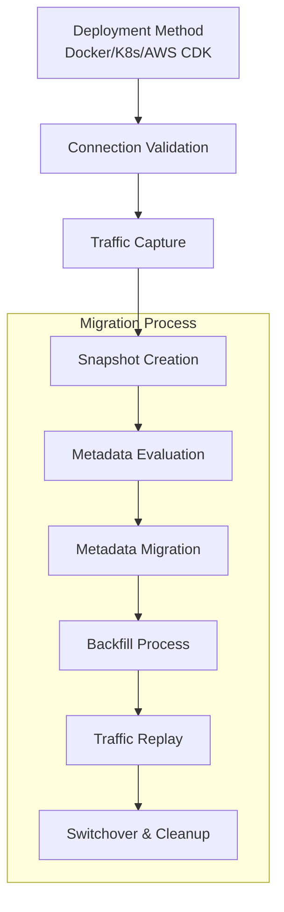

# OpenSearch Dashboards Migration Design Document

## Problem Statement

Customers migrating from Kibana to OpenSearch Dashboards face significant operational challenges, primarily due to the absence of an automated solution for dashboard migration. This gap forces organizations to rely on manual, error-prone processes that are both time-intensive and prone to risks such as data loss, broken visualizations, and service disruptions.

To address this critical need, we propose introducing a new feature within the OpenSearch Migration Assistant: **Dashboards Migration**. This feature will streamline the transformation and migration of Kibana dashboards to OpenSearch Dashboards, preserving the referential integrity between visualizations and their data sources. By eliminating manual intervention, this enhancement will reduce business risks and ensure a seamless transition for organizations migrating from Elasticsearch to OpenSearch.

---

## Current State Analysis

### Background: How to migrate dashboards and related content from Kibana to OpenSearch Dashboards today?

Migrating dashboards and related content from Kibana to OpenSearch Dashboards (OSD) currently involves several methods, each with its own set of requirements and limitations. Below, we outline the primary approaches used today, focusing on what needs to be done to execute the migration and why these methods are not optimal for users.

#### 1. Self-Managed to Self-Managed Migration Using Configuration Files

This method involves exporting Kibana objects, migrating the Elasticsearch cluster to OpenSearch while preserving .kibana* indices, and manually translating configuration settings from kibana.yml to opensearch_dashboards.yml. However, this process is highly manual, error-prone, and lacks automated validation for configuration translations across different Elasticsearch versions (5.x, 6.x, 7.x).

#### 2. Using Export/Import Option

In this approach, saved objects (e.g., dashboards, visualizations, index patterns) are exported from Kibana into an export.json file using Kibana’s API or UI and then imported into OpenSearch Dashboards. The level of manual intervention depends on the source Elasticsearch version: older versions like 5.x require manual recreation of index patterns, while newer versions (6.8+) support more complete exports without manual intervention. While this method simplifies migrations for newer Elasticsearch versions, it fails to address critical gaps for legacy environments like 5.x.

#### 3. Dashboard Sanitizer Tool

The Dashboard Sanitizer tool processes exported Kibana dashboards in NDJSON format to transform them into OpenSearch-compatible structures using a provided transformation pipeline. Despite its functionality, this tool is limited to static exports and supports only Elasticsearch 7.10 or later versions. It excludes advanced visualization types (e.g., Lens visualizations, Maps, Canvas Workpads), making it unsuitable for complex or legacy environments requiring comprehensive migration support.

(view appendix [1], [2], [3] for more information on these methods)

---

### Background: Migration Assistant Overview

The Migration Assistant is primarily interacted with through its command-line console interface, which orchestrates each phase of the migration. The process begins with users selecting their preferred deployment method—local Docker deployment, Kubernetes, or AWS CDK—and configuring connection parameters for both the source Elasticsearch cluster and the target OpenSearch cluster. Before initiating migration tasks, the Migration Assistant performs health checks to validate connectivity and access permissions, ensuring that the system is ready for migration. The workflow involves several key phases designed to preserve data consistency and minimize risks during the transition.

1. MA deploys a SourceProxy to intercept and record client traffic directed at the source Elasticsearch cluster. This traffic is persisted to Kafka topics, enabling eventual replay to maintain synchronization between source and target clusters.

2. Users initiate point-in-time snapshots of selected indices from the source cluster using `console snapshot create`. These snapshots establish a baseline for data migration.

3. Users perform a non-destructive scan of the source cluster to identify all items eligible for migration. This step helps detect potential issues before transferring data.

4. Using `console metadata migrate`, users transfer index configurations, mappings, and settings to the target OpenSearch cluster. The console provides options to review and approve modifications required for compatibility.

5. The `console backfill start` command transfers documents from source snapshots to target indices with configurable parallelism. Users can dynamically adjust worker counts (`console backfill scale`) based on system performance requirements.

6. Once initial data migration is complete, users activate the replay mechanism (`console replay start`) to process captured traffic events against the target cluster. This progressively reduces synchronization lag between source and target systems.

7. When both clusters reach a synchronized state, users redirect client applications to the target OpenSearch cluster according to their defined switchover strategy.

8. After verifying successful switchover, users terminate replay processes (`console replay stop`) and clean up migration artifacts in accordance with retention policies.

Throughout this workflow, users benefit from monitoring capabilities provided by integrated CloudWatch dashboards (deployed in the user's AWS account), performance metrics, and validation commands that ensure data consistency during critical transition points.



### Solution Approach

The proposed user experience for dashboard migration aims to streamline the process by integrating it seamlessly into the Migration Assistant workflow. Here’s an overview of how users will interact with the system:

1. **Metadata Evaluation**: Users perform console metadata evaluate, which now includes .kibana as a candidate for migration, providing detailed insights into dashboard components.

```bash
console metadata evaluate
...
(along with existing metadata evaluation output)

System indices identified:
- .kibana (contains 17 visualization components)
  - 8 visualizations
  - 1 index pattern
  - 1 config setting
  - 7 other dashboard-related objects
...
```

2. **Dashboard Migration**: Users execute console dashboards migrate, which handles the transformation and preparation of dashboard objects for migration.

```bash
console dashboards migrate 
...
Estimated duration: 4 minutes (ES 5.6 → OS 2.19)
Proceed? [y/N]: y

Uploading to target cluster...
- Importing dashboard components
Success: Dashboards available after metadata migrate
```

3. **Dashboard Upload**: The `console dashboards upload` command imports the migrated dashboard content into the target OpenSearch cluster.

```bash
console dashboards upload --auth-type saml --role DashboardAdmin
...
Uploading to target cluster...
- Importing dashboard components
Success: Dashboards available after metadata migrate
...
```

4. **Standard Migration Flow**: Users proceed with `console metadata migrate` and `console backfill start` to complete the data migration.

```bash
...
console metadata migrate
...
console backfill start
...
```

---

## Requirements

To implement the dashboard migration feature effectively, the following requirements must be met:

With the introduction of console dashboards migrate and console dashboards upload to handle dashboard transformation, preparation, and upload. The `console dashboards migrate` command is responsible for initiating the entire process of dashboards migration by orchestrating the upgrade functionality. Whereas, the `console dashboards upload` command is responsible to upload the NDJSON file to the user's production target OpenSearch cluster.

#### Upgrade Functionality

The upgrade functionality is a critical component of the console dashboards migrate command. There is a need of an orchestration strategy here to make this 'upgrade' functionality work on a user's deployment of Migration Assistant. It involves:

- Source Version Detection: Identifying the source Elasticsearch version (e.g., ES 5.6).

- Custom Snapshot: The tool should create a custom snapshot of user's production source cluster that contains all .kibana content, and minimum content from other data indices. This snapshot will be saved in a new S3 Repository of user's AWS Account.

- Orchestration Strategy:
  - Intermediate Cluster Deployment in the background: Launching intermediate clusters for each major version jump between the source and target (e.g., ES 6.x, ES 7.x, OS 1.x, OS 2.x).
  - Snapshot and Restore Loop: Performing a snapshot and restore from one version to the next, updating the .kibana index alias and launching Kibana for each version to ensure compatibility.
  - Temporary resources auto-cleaned on completion/failure

- A calculated estimated runtime to be displayed before confirmation

- Final NDJSON Generation: After reaching the target version, querying the .kibana index to generate a final NDJSON file that is compatible with OpenSearch Dashboards

#### Upload Functionality

- Upload NDJSON: The tool should upload the NDJSON file to the user's production target OpenSearch cluster without manual intervention.

- Include valid opensearch-dashboards Authentication to make a secure upload for a managed service cluster.

---

## Implementation Details

[To be continued...]

---

## Appendix

[1] This method involves exporting Kibana objects, migrating the Elasticsearch cluster to OpenSearch, and manually translating configuration files from kibana.yml to opensearch_dashboards.yml. The process is manual, error-prone, and lacks automated validation for different Elasticsearch versions.
Documentation: OpenSearch Migration Guide

[2] In this approach, administrators export saved objects (dashboards, visualizations, index patterns) via Kibana’s API or UI and then import them into OpenSearch Dashboards. Depending on the source version of Elasticsearch, this method may require manual recreation of index patterns (for versions 5.x) or offer a more complete export without manual intervention (for versions 6.8+).
Documentation: Kibana Export/Import API

[3] For Elasticsearch 7.10+ environments, the Dashboard Sanitizer tool processes exported Kibana dashboards in NDJSON format, transforming them into OpenSearch-compatible structures. This tool, however, is limited to static exports and excludes advanced visualizations (e.g., Lens, Maps, Canvas Workpads), making it unsuitable for complex environments.
Documentation: OpenSearch Dashboard Sanitizer Tool

[To be continued...]
