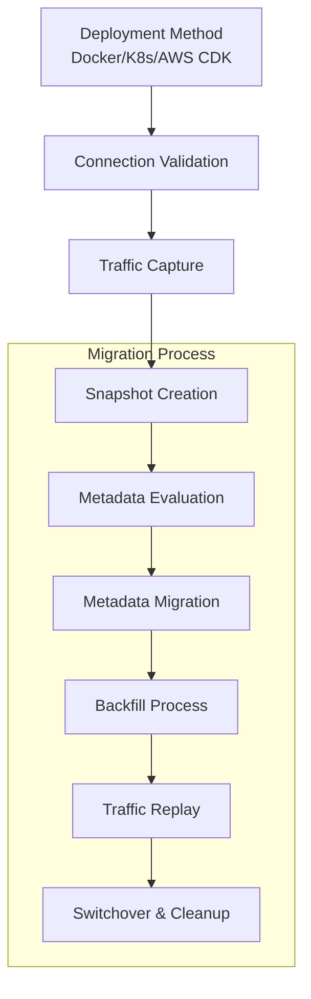

# OpenSearch Dashboards Migration Design Document

## Table of Contents
1. [Key Terminology](#key-terminology)
2. [Problem Statement](#problem-statement)
3. [Current State Analysis](#current-state-analysis)
4. [Solution Approach](#solution-approach)
5. [Requirements](#requirements)
6. [Appendix](#appendix)

## Key Terminology

* **.kibana_N indexes**
: The .kibana* indexes store runtime configurations and saved objects in Kibana and OpenSearch Dashboards. These indexes contain user-created content, dynamic settings, and are updated through UI interactions. In Elasticsearch 5.x and earlier, a single .kibana index was used. Elasticsearch 6.x and 7.x introduced multiple .kibana* indexes (e.g., .kibana_1, .kibana_2) with a .kibana alias pointing to the current active index. OpenSearch uses .opensearch_dashboards index, which replaces .kibana but maintains a similar structure to Elasticsearch 7.x.

* **Index Patterns**
: Index patterns in OpenSearch Dashboards define which OpenSearch indices you want to explore and analyze. They allow you to perform searches and create visualizations across one or more indices that match the specified pattern.

* **Visualizations**
: Visualizations in OpenSearch Dashboards are graphical representations of your data. They can include various chart types, metrics, maps, and other visual elements that help you understand and analyze your data. Visualizations can be combined to create comprehensive dashboards.
For a comprehensive list of available visualizations, refer to [Appendix [5]](#appendix).

* **Dashboard**
: Dashboards in OpenSearch Dashboards are collections of visualizations, searches, and other components arranged on a single page. They provide a comprehensive view of your data, allowing users to interact with and explore data insights in real-time. Dashboards can be shared, exported, and embedded into other applications.

* **Saved Objects**
: Saved objects in Kibana and OpenSearch Dashboards include dashboards, visualizations, index patterns, and other configurations that users can save and manage. They enable users to preserve their work and share it across different environments or with other users.

* **Export.json file**
: The export.json file is a JSON-formatted file that contains specific saved objects from Kibana and OpenSearch Dashboards, such as Dashboards, Visualizations, Index Patterns and other saved objects. This file represents a snapshot of selected content at the time of export and is commonly used for:
  - Backing up OpenSearch Dashboards configurations
  - Migrating content between different OpenSearch or Elasticsearch environments
  - Sharing specific dashboards or visualizations with other users or system

For a comprehensive list of exportable saved objects, refer to [Appendix [6]](#appendix).

---

## Problem Statement

Customers migrating from Kibana to OpenSearch Dashboards face significant operational challenges due to the lack of an automated solution for dashboard migration. This gap forces organizations to rely on manual, error-prone processes that are time-intensive and risk data loss, broken visualizations, and service disruptions.

To address this need, we propose introducing a new feature within the OpenSearch Migration Assistant: **Dashboards Migration**. This feature will streamline the transformation and migration of Kibana dashboards to OpenSearch Dashboards, preserving referential integrity between visualizations and their data sources. By eliminating manual intervention, this enhancement reduces business risks and ensures a seamless transition for organizations migrating from Elasticsearch to OpenSearch.

---

## Current State Analysis

### Background: How to migrate dashboards and related content from Kibana to OpenSearch Dashboards today?

Migrating dashboards and related content from Kibana to OpenSearch Dashboards (OSD) involves several methods, each with its own requirements and limitations. Below, we outline the primary approaches used today, focusing on what needs to be done to execute the migration and why these methods are not optimal for users.

#### 1. Self-Managed to Self-Managed Migration Using Configuration Files

This method involves exporting Kibana objects, migrating the Elasticsearch cluster to OpenSearch while preserving .kibana* indices, and manually translating configuration settings from kibana.yml to opensearch_dashboards.yml. However, this process is highly manual, error-prone, and lacks automated validation for configuration translations across different Elasticsearch versions (5.x, 6.x, 7.x).

#### 2. Using Export/Import Option

In this approach, saved objects (e.g., dashboards, visualizations, index patterns) are exported from Kibana into an export.json file using Kibana’s API or UI and then imported into OpenSearch Dashboards. The level of manual intervention depends on the source Elasticsearch version: older versions like 5.x require manual recreation of index patterns, while newer versions (6.8+) support more complete exports without manual intervention. While this method simplifies migrations for newer Elasticsearch versions, it fails to address critical gaps for legacy environments like 5.x.

#### 3. Dashboard Sanitizer Tool

The Dashboard Sanitizer tool processes exported Kibana dashboards in NDJSON format to transform them into OpenSearch-compatible structures using a provided transformation pipeline. Despite its functionality, this tool is limited to static exports and supports only Elasticsearch 7.10 or later versions. It excludes advanced visualization types (e.g., Lens visualizations, Maps, Canvas Workpads), making it unsuitable for complex or legacy environments requiring comprehensive migration support.

(view [Appendix](#appendix) [1], [2], [3] for more information on these methods)

---

### Background: Migration Assistant Overview

The Migration Assistant is primarily interacted with through its command-line console interface, which orchestrates each phase of the migration. The process begins with users selecting their preferred deployment method—local Docker deployment, Kubernetes, or AWS CDK—and configuring connection parameters for both the source Elasticsearch cluster and the target OpenSearch cluster. Before initiating migration tasks, the Migration Assistant performs health checks to validate connectivity and access permissions, ensuring that the system is ready for migration. The workflow involves several key phases designed to preserve data consistency and minimize risks during the transition.

1. Deploy a SourceProxy to intercept and record client traffic directed at the source Elasticsearch cluster. Persist this traffic to Kafka topics, enabling eventual replay to maintain synchronization between source and target clusters.

2. Initiate point-in-time snapshots of selected indices from the source cluster using `console snapshot create`. These snapshots establish a baseline for data migration.

3. `console metadata evaluate` performs a scan of the source cluster to identify all items eligible for migration. This step helps detect potential issues before transferring data.

4. Use `console metadata evaluate` to assess and `console metadata migrate` to transfer index configurations, mappings, and settings to the target OpenSearch cluster. The console provides options to review and approve modifications required for compatibility.

5. The `console backfill start` command transfers documents from source snapshots to target indices with configurable parallelism. Dynamically adjust worker counts (`console backfill scale`) based on system performance requirements.

6. Once initial data migration is complete, activate the replay mechanism (`console replay start`) to process captured traffic events against the target cluster. This progressively reduces synchronization lag between source and target systems.

7. When both clusters reach a synchronized state, redirect client applications to the target OpenSearch cluster according to the defined switchover strategy.

8. After verifying successful switchover, terminate replay processes (`console replay stop`) and clean up migration artifacts in accordance with retention policies.

Throughout this workflow, benefit from monitoring capabilities provided by integrated CloudWatch dashboards (deployed in the user's AWS account), performance metrics, and validation commands that ensure data consistency during critical transition points.



[Appendix [4]](#appendix) refer to this for more details on the architecture of migration assistant.

---

## Solution Approach

The Migration Assistant now offers enhanced capabilities for seamlessly migrating dashboard content from Elasticsearch to OpenSearch, addressing an important component of the overall migration process. Here’s an overview of how users will interact with the system:

### Dashboard Migration Command Integration

The solution enhances the Migration Assistant workflow by integrating dashboard migration capabilities through two new commands: console dashboards evaluate and console dashboards migrate. These commands enable seamless transfer of dashboard-related content (visualizations, index patterns, dashboards, and other saved objects) from the source Elasticsearch cluster to the target OpenSearch cluster.

Dashboard migration is positioned strategically within the existing workflow - after snapshot creation (console snapshot create) and before metadata migration (console metadata evaluate). This placement ensures that dashboard components are evaluated and migrated while maintaining the integrity of both source and target environments. Unlike other migration commands, dashboard migration operates directly on the system indices containing saved objects rather than utilizing snapshots created under `console snapshot create`.

1. **Dashboards Evaluation**: This command performs analysis of dashboard components in the source cluster, specifically targeting the .kibana system index where saved objects are stored. This evaluation process identifies all dashboard-related saved objects in the source cluster, categorizing them by type and ensuring users have full visibility into what will be migrated before committing to any changes.

```bash
(21:03:15) migration-console (~) -> console dashboards evaluate

Starting Dashboard Evaluation
Clusters:
   Source:
      Remote Cluster: ELASTICSEARCH 7.10.0 ConnectionContext(...)

   Target:
      Remote Cluster: AMAZON_MANAGED_OPENSEARCH 2.17.0 ConnectionContext(...)

Migration Candidates:
   System Indices Analysis:
      .kibana (contains 23 dashboard-related objects)
      - 9 visualizations
      - 2 index patterns
      - 1 config setting
      - 11 dashboard objects

Results:
   0 critical issue(s) detected
   WARN - Dashboards will show empty visualizations until data migration completes
   NOTICE - 23 dashboard components identified for processing

Command executed successfully
```

2. **Dashboard Migration**: After evaluation, users can proceed with the actual migration using the `console dashboards migrate` command. This command handles the extraction, transformation, and migration of dashboard components from the source to target cluster.

```bash
(21:03:25) migration-console (~) -> console dashboards migrate

Starting Dashboard Migration
Estimated processing time: 4 minutes (ES 7.10 → OS 2.17)

Clusters:
   Source:
      Remote Cluster: ELASTICSEARCH 7.10.0 ConnectionContext(...)

   Target:
      Remote Cluster: AMAZON_MANAGED_OPENSEARCH 2.17.0 ConnectionContext(...)

Migrated Items:
   System Indices:
      .kibana → .opensearch_dashboards
      - Processing 23 saved objects
      - Transforming object schema for compatibility
      - Resolving index pattern references
   
   Compatibility Adjustments:
      - Updated visualization references to match OpenSearch format
      - Resolved index pattern mappings

Results:
   Migration complete: 23 objects processed
   0 issue(s) detected
   NOTICE - Dashboard visualizations will remain empty until backfill completes

Command executed successfully
```

### Next steps - Existing migration workflow

Following the successful execution of `console dashboards migrate`, the target cluster will contain migrated saved objects, including index patterns, visualizations, and dashboards displayed during `console dashboards evaluate`. However, these visualizations will initially appear blank due to the absence of underlying data. 

To complete the migration, users should proceed with metadata migration (`console metadata evaluate` and `console metadata migrate`) and the backfill process (`console backfill start`), which utilize the snapshot created earlier in `console snapshot create`. These steps ensure that the data indices are populated with transformed documents, allowing visualizations to display correctly.

This workflow does not interfere with live traffic capture and replay, allowing users to seamlessly integrate dashboard migration into their existing workflow.


---

## Requirements

To implement effective dashboard migration within the Migration Assistant, the following requirements will be met:

With the introduction of `console dashboards evaluate` and `console dashboards migrate` to handle dashboard transformation, preparation, and upload. The `console dashboards migrate` command initiates the entire process of dashboards migration by orchestrating the upgrade functionality and the upload functionality as well as cleaning up all resources utilized. Whereas, the `console dashboards evaluate` command simply writes out the recognized dashboard components from the source cluster.

#### Console commands

1. **console dashboards evaluate**: 
   - Perform analysis of dashboard components in the source cluster
   - Target the .kibana system index for saved objects
   - Categorize and list all dashboard-related saved objects
   - Provide a summary of migration candidates and potential issues

2. **console dashboards migrate**: 
   - Initiate and orchestrate the entire dashboard migration process
   - Handle both upgrade and upload functionalities
   - Manage resource creation, utilization, and cleanup

### Orchestration Management

A dashboards migration orchestrator is responsible for managing the entire migration process, that includes the upgrade and upload functionality. This component ensures smooth execution of the `console dashboards migrate` command.

#### Upgrade Functionality

The upgrade functionality is a critical component of the `console dashboards migrate` command. It involves:

- Source Version Detection: Identify the source Elasticsearch version (e.g., ES 5.6) and determine the necessary upgrade path. This step is curcial as only the ES 5.x → ES 6.x transition requires reindexing, while subsequent upgrades use snapshot/restore. Refer to [Appendix [8]](#appendix) for more details.

- Custom Snapshot: The tool should create a custom snapshot of the user's production source cluster that contains all .kibana content, and minimum content from other data indices. This snapshot will be stored in a new S3 Repository of the user's AWS Account.

- Orchestration Strategy:
  - Intermediate Cluster Deployment in the background: Launching intermediate clusters for each major version upgrade after source version has been detected.
  - Snapshot and Restoration: Create full snapshots and restore them in the next major version cluster during these intermediate.
  - Only performs reindexing when absolutely required (ES 5→6 transition), uses direct snapshot/restore for subsequent version upgrades
  - Index Alias Update and Launch Kibana: Update index aliases when Kibana is stopped. Relaunching Kibana to reflect new cluster configurations for the next snapshot.
  - Estimated execution time calculation: Based on the upgrade path, an ETA will be displayed on the console output during this step.

- Transformation Pipeline: Transform dashboard components to ensure compatibility with OpenSearch Dashboards.

- Verification: Validate the successful transformation and migration of dashboard components.

- Cleanup: Remove temporary resources and snapshots post-migration to maintain a clean environment.

#### Upload Functionality

- Upload NDJSON: The tool should upload the NDJSON file to the user's production target OpenSearch cluster without manual intervention.

- Include valid opensearch-dashboards Authentication to make a secure upload for a managed service cluster.

Refer to [Appendix [7]](#appendix) for more details on the OpenSearch Dashboards saved objects API.

#### Process Management

- Monitoring: Log all significant events and actions for auditing purposes

- Error Handling: Provide clear error messages and suggested remediation steps.

- Interruption Handling: Develop a fallback strategy for user interruptions or system failures that provides clear messages.

- Ensure proper cleanup of all created resources in case of any interruptions.

---

## Appendix

[1] This method involves exporting Kibana objects, migrating the Elasticsearch cluster to OpenSearch, and manually translating configuration files from kibana.yml to opensearch_dashboards.yml. The process is manual, error-prone, and lacks automated validation for different Elasticsearch versions.
Documentation: OpenSearch Migration Guide [https://opensearch.org/docs/2.8/upgrade-to/dashboards-upgrade-to/]

[2] In this approach, administrators export saved objects (dashboards, visualizations, index patterns) via Kibana’s API or UI and then import them into OpenSearch Dashboards. Depending on the source version of Elasticsearch, this method may require manual recreation of index patterns (for versions 5.x) or offer a more complete export without manual intervention (for versions 6.8+).
Documentation: Kibana Export/Import API [https://aws.amazon.com/blogs/big-data/export-and-import-kibana-dashboards-with-amazon-opensearch/]

[3] For Elasticsearch 7.10+ environments, the Dashboard Sanitizer tool processes exported Kibana dashboards in NDJSON format, transforming them into OpenSearch-compatible structures. This tool, however, is limited to static exports and excludes advanced visualizations (e.g., Lens, Maps, Canvas Workpads), making it unsuitable for complex environments.
Documentation: OpenSearch Dashboard Sanitizer Tool [https://github.com/opensearch-project/opensearch-migrations/blob/main/dashboardsSanitizer/UserGuide.md]

[4] Refer to this for more details on the architecture of Migration Assistant.
Documentation: Migration Assistant Architecture Overview [https://opensearch.org/docs/latest/migration-assistant/#architecture-overview]

[5] Visualization Support Across Versions

| Visualization Type | ES 5.x | ES 6.3              | ES 6.8 | ES 7.10.2 | OS 2.x | Category |
|--------------------|--------|---------------------|--------|-----------|--------|----------|
| Area Chart         | ✓      | ✓                   | ✓      | ✓         | ✓      | Basic    |
| Horizontal Bar     | ✓      | ✓                   | ✓      | ✓         | ✓      | Basic    |
| Heat Map           | ✓      | ✓                   | ✓      | ✓         | ✓      | Basic    |
| Line Chart         | ✓      | ✓                   | ✓      | ✓         | ✓      | Basic    |
| Pie Chart          | ✓      | ✓                   | ✓      | ✓         | ✓      | Basic    |
| Vertical Bar       | ✓      | ✓                   | ✓      | ✓         | ✓      | Basic    |
| Gantt Chart        | x      | x                   | x      | ✓         | ✓      | Basic    |
| Metric             | ✓      | ✓                   | ✓      | ✓         | ✓      | Data     |
| Gauge              | ✓      | ✓                   | ✓      | ✓         | ✓      | Data     |
| Data Table         | ✓      | ✓                   | ✓      | ✓         | ✓      | Data     |
| Goal               | ✓      | ✓                   | ✓      | ✓         | ✓      | Data     |
| Coordinate Map     | ✓      | ✓                   | ✓      | ✓         | ✓      | Maps     |
| Region Map         | ✓      | ✓                   | ✓      | ✓         | ✓      | Maps     |
| Maps               | x      | x                   | x      | x         | ✓      | Maps     |
| Timelion           | ✓      | ✓                   | ✓      | ✓         | ✓ named Timeline     | Time Series |
| Visual Builder     | ✓ experimental    | ✓ experimental      | ✓      | x         | ✓ named VizBuilder     | Time Series    |
| TSVB               | x      | x                   | x      | ✓         | ✓      | Time Series    |
| Markdown           | ✓      | ✓                   | ✓      | ✓         | ✓      | Other |
| Tag Cloud          | ✓      | ✓                   | ✓      | ✓         | ✓      | Other |
| Controls           | x      | ✓ experimental      | ✓ experimental    | ✓ experimental       | ✓ experimental      | Other |
| Vega               | x      | ✓ experimental      | ✓ experimental    | ✓         | ✓      | Other |
| PPL                | x      | x                   | x      | x         | ✓      | Other |

[6] Export Functionality Across Versions

| Version | Export Path | Exportable Saved Object Types |
|---------|-------------|--------------|
| OS 2.x  | Dashboards Management > Saved objects > Export | config, index-pattern, visualization, url, query, homepage, dashboard, map, visualization-visbuilder, augment-vis, search, observability-panel, integration-instance, integration-template, observability-visualization, observability-search, observability-notebook |
| ES 7.10 | Stack Management > Saved Objects > Export | index-pattern, config, url, query, dashboard, visualization, search |
| ES 6.8  | Management > Saved Objects > Export | index-pattern, visualization, dashboard, search |
| ES 5.6  | Management > Saved Objects > Export | dashboards, visualizations, searches |

[7] OpenSearch Dashboards Saved Objects API
Documentation: OpenSearch Dashboards Saved Objects API [https://opensearch-project.github.io/OpenSearch-Dashboards/docs/openapi/saved_objects/]

[8] Elasticsearch 5.x to 6.x Reindexing Requirement
Documentation: Elasticsearch 5.x to 6.x Reindexing [https://www.elastic.co/guide/en/kibana/5.6/migrating-6.0-index.html]
