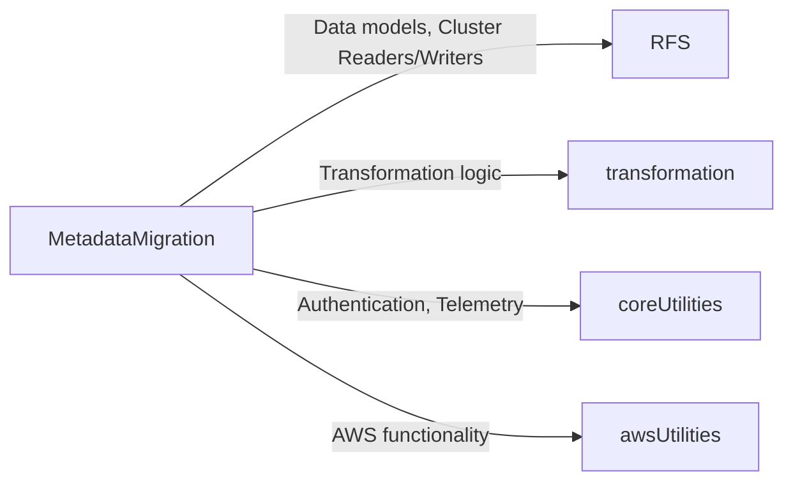

## Metadata Migration Developer Guide

- [Metadata Migration Developer Guide](#metadata-migration-developer-guide)
- [Architecture](#architecture)
- [How to run tests](#how-to-run-tests)
- [How to use the tool interactively](#how-to-use-the-tool-interactively)
  - [S3 Snapshot](#s3-snapshot)
  - [On-Disk Snapshot](#on-disk-snapshot)
  - [Handling Auth](#handling-auth)
  - [Allowlisting the templates and indices to migrate](#allowlisting-the-templates-and-indices-to-migrate)
  - [Output Formats](#output-formats)

## Architecture

The Metadata migration project holds classes that is specific only to the CLI tool and end to end test cases for the CLI.  The majority of the business logic is in the RFS library as it is shared between [CreateSnapshot](../CreateSnapshot/README.md) and [DocumentFromSnapshotMigration](../DocumentsFromSnapshotMigration/README.md) tools.   



## How to run tests

Runs all unit test cases, very fast for running unit tests
```shell
./gradlew MetadataMigration:test
```

Run all test cases include starting up docker images for end to end verification, runtime will be at least 5 minutes.

```shell
./gradlew MetadataMigration:slowTest
```

(Often Used) Run end to end test cases for only a single source platform, tests all commands with a runtime of ~1 minute.
```shell
./gradlew MetadataMigration:slowTest --tests *metadataMigrateFrom_OS_v1_3*`
```

## How to use the tool interactively

You can kick off the locally tool using Gradle.

### S3 Snapshot

From the root directory of the repo, run a CLI command like so:

```shell
./gradlew MetadataMigration:run --args='--snapshot-name reindex-from-snapshot --s3-local-dir /tmp/s3_files --s3-repo-uri s3://your-s3-uri --s3-region us-fake-1 --target-host http://hostname:9200'
```

In order for this succeed, you'll need to make sure you have valid AWS Credentials in your key ring (~/.aws/credentials) with permission to operate on the S3 URI specified.

### On-Disk Snapshot

From the root directory of the repo, run a CLI command like so:

```shell
./gradlew MetadataMigration:run --args='--snapshot-name reindex-from-snapshot --file-system-repo-path /snapshot --s3-region us-fake-1 --target-host http://hostname:9200'
```

### Handling Auth

If your target cluster has basic auth enabled on it, you can supply those credentials to the tool via the CLI:

```shell
./gradlew MetadataMigration:run --args='--snapshot-name reindex-from-snapshot --s3-local-dir /tmp/s3_files --s3-repo-uri s3://your-s3-uri --s3-region us-fake-1 --target-host http://hostname:9200 --target-username <user> --target-password <pass>'
```

### Allowlisting the templates and indices to migrate

By default, allowlist for indices and all templates types is open, meaning all non-system indices (those not prefixed with `.`) will be migrated.  You can tweak these allowlists with a comma-separated list of items you specifically with to migrate.  If you specify an custom allowlist for the templates or indices, the default allowlist is disregarded and **only** the items you have in your allowlist will be moved.

```shell
./gradlew MetadataMigration:run --args='--snapshot-name reindex-from-snapshot --s3-local-dir /tmp/s3_files --s3-repo-uri s3://your-s3-uri --s3-region us-fake-1 --target-host http://hostname:9200 --index-allowlist Index1,.my_system_index,logs-2023 --index-template-allowlist logs_template --component-template-allowlist component2,component7'
```

In the above example, the tool will migrate the following items from the snapshot per the allowlist:
* The indices `Index1`, `.my_system_index`, and `logs-2023`
* The index template `logs_template`
* The component templates `component2` and `component7`

### Output Formats

You can specify the desired output format using the `--output` parameter. The tool supports two output formats:

* `human-readable`: (Default) Displays results in a human-readable format with clear indentation and sections
* `json`: Outputs results as JSON, which is useful for programmatic consumption or post-processing

Example with human-readable output:

```shell
./gradlew MetadataMigration:run --args='evaluate --snapshot-name test-snapshot --file-system-repo-path ./src/test/resources --target-host http://fake-target:9200'
```

The same command with JSON output:

```shell
./gradlew MetadataMigration:run --args='evaluate --snapshot-name test-snapshot --file-system-repo-path ./src/test/resources --target-host http://fake-target:9200 --output json'
```

Output comparison:

**Human-readable format**:
```
Clusters:
   Source:
   Type: On-disk Snapshot (2.0.0)
   Local repository: ./src/test/resources

   Target:
   Type: Remote Cluster (2.0.0)
   Host: http://fake-target:9200

Migration Candidates:
   Index Templates:
   - template1
   - template2

   Component Templates:
   <NONE FOUND>

   Indexes:
   - index1
   - index2

   Aliases:
   <NONE FOUND>

Transformations:
   <None Found>

Results:
   0 issue(s) detected
```

**JSON format**:
```json
{
  "clusters": {
    "source": {
      "type": "On-disk Snapshot",
      "version": "2.0.0",
      "localRepository": "./src/test/resources"
    },
    "target": {
      "type": "Remote Cluster",
      "version": "2.0.0",
      "host": "http://fake-target:9200"
    }
  },
  "items": {
    "dryRun": true,
    "indexTemplates": [
      {"name": "template1", "successful": true},
      {"name": "template2", "successful": true}
    ],
    "componentTemplates": [],
    "indexes": [
      {"name": "index1", "successful": true},
      {"name": "index2", "successful": true}
    ],
    "aliases": [],
    "errors": []
  },
  "transformations": {
    "transformers": []
  },
  "errors": [],
  "errorCount": 0
}
```

The JSON output is particularly useful for programmatic consumption, logging to external systems, or post-processing with tools like `jq`.
