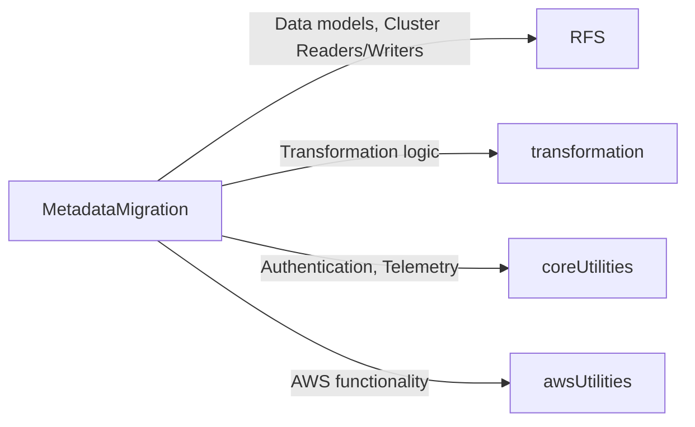

## Metadata Migration Developer Guide

- [Metadata Migration Developer Guide](#metadata-migration-developer-guide)
- [Architecture](#architecture)
- [How to run tests](#how-to-run-tests)
- [How to use the tool interactively](#how-to-use-the-tool-interactively)
  - [S3 Snapshot](#s3-snapshot)
  - [Using S3 Snapshots with LocalStack](#using-s3-snapshots-with-localstack)
  - [On-Disk Snapshot](#on-disk-snapshot)
  - [Handling Auth](#handling-auth)
  - [Allowlisting the templates and indices to migrate](#allowlisting-the-templates-and-indices-to-migrate)
  - [Output Formats](#output-formats)

## Architecture

The Metadata migration project holds classes that is specific only to the CLI tool and end to end test cases for the CLI.  The majority of the business logic is in the RFS library as it is shared between [CreateSnapshot](../CreateSnapshot/README.md) and [DocumentFromSnapshotMigration](../DocumentsFromSnapshotMigration/README.md) tools.   


```mermaid
graph LR
    mm[MetadataMigration] --> |Data models, Cluster Readers/Writers| RFS
    mm --> |Transformation logic| t[transformation]
    mm --> |Authentication, Telemetry| cu[coreUtilities]
    mm --> |AWS functionality|au[awsUtilities]
```

## How to run tests

Runs all unit test cases, very fast for running unit tests
```shell
./gradlew MetadataMigration:test
```

Run all test cases include starting up docker images for end to end verification, runtime will be at least 5 minutes.

```shell
./gradlew MetadataMigration:slowTest
```

(Often Used) Run end to end test cases for only a single source platform, tests all commands with a runtime of ~1 minute.
```shell
./gradlew MetadataMigration:slowTest --tests *metadataMigrateFrom_OS_v1_3*`
```

## How to use the tool interactively

You can kick off the locally tool using Gradle.

### S3 Snapshot

From the root directory of the repo, run a CLI command like so:

```shell
./gradlew MetadataMigration:run --args='--snapshot-name reindex-from-snapshot --s3-local-dir /tmp/s3_files --s3-repo-uri s3://your-s3-uri --s3-region us-fake-1 --target-host http://hostname:9200'
```

In order for this succeed, you'll need to make sure you have valid AWS Credentials in your key ring (~/.aws/credentials) with permission to operate on the S3 URI specified.

### Using S3 Snapshots with LocalStack

When using [LocalStack](https://localstack.cloud/) as a local S3-compatible endpoint, you must use an **IP address** (e.g., `127.0.0.1`) instead of `localhost` in the `--s3-endpoint` value. This is because LocalStack requires S3 path‑style addressing, and the AWS SDK defaults to virtual‑host style. Using an IP address forces the SDK to use path‑style access, which avoids empty results from S3 operations like `ListObjectsV2`.

For example, if LocalStack is running on port 4566:

```shell
./gradlew MetadataMigration:run --args='migrate \
  --snapshot-name my-snapshot \
  --s3-local-dir /tmp/s3_files \
  --s3-repo-uri s3://my-bucket/my/snapshot/dir \
  --s3-endpoint http://127.0.0.1:4566 \
  --s3-region us-east-1 \
  --source-version OS\ 1.3 \
  --target-host http://localhost:9200'
```

> **Note:** If you use `http://localhost:4566` instead, you may see the error:
> `Cannot find the snapshot repository root in S3 bucket`. Switching to `127.0.0.1` resolves this.

For Kubernetes deployments, the orchestration layer supports a `localstack://` protocol prefix that automatically resolves the hostname to an IP address. See the [Deploying to Kubernetes](https://github.com/opensearch-project/opensearch-migrations/wiki/Deploying-to-Kubernetes) wiki for details.

### On-Disk Snapshot

From the root directory of the repo, run a CLI command like so:

```shell
./gradlew MetadataMigration:run --args='--snapshot-name reindex-from-snapshot --file-system-repo-path /snapshot --s3-region us-fake-1 --target-host http://hostname:9200'
```

### Handling Auth

If your target cluster has basic auth enabled on it, you can supply those credentials to the tool via the CLI:

```shell
./gradlew MetadataMigration:run --args='--snapshot-name reindex-from-snapshot --s3-local-dir /tmp/s3_files --s3-repo-uri s3://your-s3-uri --s3-region us-fake-1 --target-host http://hostname:9200 --target-username <user> --target-password <pass>'
```

### Allowlisting the templates and indices to migrate

By default, allowlist for indices and all templates types is open, meaning all non-system indices (those not prefixed with `.`) will be migrated.  You can tweak these allowlists with a comma-separated list of items you specifically with to migrate.  If you specify an custom allowlist for the templates or indices, the default allowlist is disregarded and **only** the items you have in your allowlist will be moved.

```shell
./gradlew MetadataMigration:run --args='--snapshot-name reindex-from-snapshot --s3-local-dir /tmp/s3_files --s3-repo-uri s3://your-s3-uri --s3-region us-fake-1 --target-host http://hostname:9200 --index-allowlist Index1,.my_system_index,logs-2023 --index-template-allowlist logs_template --component-template-allowlist component2,component7'
```

In the above example, the tool will migrate the following items from the snapshot per the allowlist:
* The indices `Index1`, `.my_system_index`, and `logs-2023`
* The index template `logs_template`
* The component templates `component2` and `component7`

### Output Formats

You can specify the desired output format using the `--output` parameter. The tool supports two output formats:

* `human-readable`: (Default) Displays results in a human-readable format with clear indentation and sections
* `json`: Outputs results as JSON, which is useful for programmatic consumption or post-processing

Example with human-readable output:

```shell
./gradlew MetadataMigration:run --args='evaluate --snapshot-name test-snapshot --file-system-repo-path ./src/test/resources --target-host http://fake-target:9200'
```

The same command with JSON output:

```shell
./gradlew MetadataMigration:run --args='evaluate --snapshot-name test-snapshot --file-system-repo-path ./src/test/resources --target-host http://fake-target:9200 --output json'
```

Output comparison:

**Human-readable format**:
```
Starting Metadata Evaluation
Clusters:
   Source:
      Type: MockRemoteReader (OPENSEARCH 54.0.0)
      Uri: http://remote.source
      Protocol: HTTP
      TLS Verification: Disabled

   Target:
      Type: MockClusterWriter (OPENSEARCH 2000.0.0)
      Uri: http://remote.target
      Protocol: HTTP
      TLS Verification: Enabled

Migration Candidates:
   Index Templates:
      - it1
      - it2

   Component Templates:
      - ct1
      - ct2

   Indexes:
      - i1
      - i2

   Aliases:
      - a1
      - a2

Transformations:
   <None Found>

Results:
   0 issue(s) detected


Consult /home/ubuntu/git/opensearch-migrations/MetadataMigration/logs/ip-172-31-18-157/metadata/metadata2025-07-31_19-44-03.log to see detailed logs for this run
See transformations applied for this run at /home/ubuntu/git/opensearch-migrations/MetadataMigration/logs/ip-172-31-18-157/metadata/metadata2025-07-31_19-44-03-transforms.log
```

**JSON format**:
```json
{
    "clusters": {
        "source": {
            "type": "MockRemoteReader",
            "version": "OPENSEARCH 54.0.0",
            "uri": "http://remote.source",
            "protocol": "HTTP",
            "insecure": true,
            "compressionSupported": false,
            "awsSpecificAuthentication": false
        },
        "target": {
            "type": "MockClusterWriter",
            "version": "OPENSEARCH 2000.0.0",
            "uri": "http://remote.target",
            "protocol": "HTTP",
            "insecure": false,
            "compressionSupported": false,
            "awsSpecificAuthentication": false
        }
    },
    "items": {
        "dryRun": true,
        "indexTemplates": [
           { "name": "it1", "successful": true },
           { "name": "it2", "successful": true }
        ],
        "componentTemplates": [
           { "name": "ct1", "successful": true },
           { "name": "ct2", "successful": true }
        ],
        "indexes": [
           { "name": "i1", "successful": true },
           { "name": "i2", "successful": true }
        ],
        "aliases": [
           { "name": "a1", "successful": true },
           { "name": "a2", "successful": true }
        ],
        "errors": []
    },
    "transformations": {
        "transformers": []
    },
    "errors": [],
    "errorCount": 0
}
```

The JSON output is particularly useful for programmatic consumption, logging to external systems, or post-processing with tools like `jq`.
