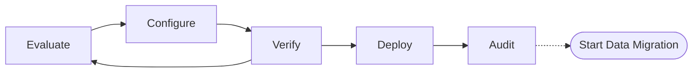

# Metadata Migration

When moving between different kinds of clusters there is moving raw data, and there is moving the containers and support materials that are part of that ecosystem.  Metadata migration is a part of the overall lifecycle, and it exists in the start of the migration process to ensure the data goes to the expected destination. 

## Migration Lifecycle

To handle moving more than data OpenSearch Migration includes we are tooling to inspect an existing cluster, generate a recommended configuration, and apply the migration onto a target cluster.



### Evaluate
By inspecting the source cluster and the target cluster, the metadata tooling will determine what items can be processed and what items need more detail to migration successfully.

A target cluster is not required to perform an evaluation by provided a target cluster version to the tool. 

### Configure
After inspecting the kind of migration that is underway there are different options, such as which indices to move to the target cluster, down to more advanced options such as how to handle deprecated features.  By updating the command line arguments or configuration file you choose how to perform the migration.

### Verify
After filling out the configuration, run the verify process to make sure that all scenarios are handled and that no configuration errors or missing settings are present.  If there is a warning or error, you might revisit the evaluation process and repeating until everything is shaped as expected.

### Deploy
The metadata migration tool will fully read the source cluster and recreate the supported features on the target cluster.

### Audit
Inspect the transformation logs (tuple logs), or run queries against the live target cluster.  Before the long process moving data from the source to the target check on anything that needs to be working to prevent redriving.

## Walkthrough

```
console meta (evaluate | verify | deploy) \

    # Inspect a live source cluster
    --source-host http://localhost:19200
    --source-username admin \
    --source-password admin \

    # Inspect source cluster from its snapshot
    --snapshot-name my-snapshot \

        # Local copy of the snapshot
        --file-system-repo-path [C:\snapshots] \

        # Snapshot in the S3 service
        --s3-repo-uri [s3://bucket/snapshots] \
        --s3-region [us-east-1] \

    # Determine the cluster target from a live cluster
    --target-host http://localhost:19200 \
    --target-username admin \
    --target-password admin \

    # Provide the target cluster version manually
    --target-cluster-version OpenSearch 2.15

    # Configure the evaluation parameters
    --index-allow-list index1, index2 \
    --index-template-allow-list rollover-daily \
```