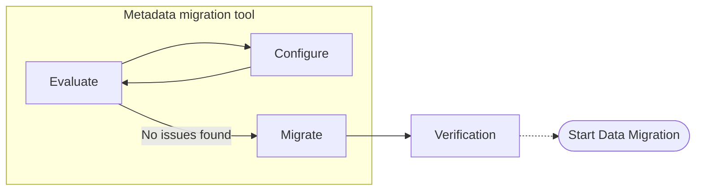

# Metadata Migration

When performing a migration of a search cluster the metadata items such as indexes, templates, configuration and processes need to be in place before document data can be moved.  The metadata migration tool provides insight into what can be moved, if there are any issues moving that data to the target cluster and can deploy those changes.  By inspecting and analyzing the metadata issues can be discovered early in the overall migration timeline. 

## Migration Lifecycle

The lifecycle of a migration revolves around a set of clients that point to the source cluster, and at the end of the lifecycle they have been updated to point to a new target cluster.  There are many individual stages to this process, for this case we are focusing on the beginning of the migration where gathering information about what is going to be migrated and indicating the change of success.


### Metadata migration lifecycle

To handle moving more than data OpenSearch Migration includes we are tooling to inspect an existing cluster, generate a recommended configuration, and apply the migration onto a target cluster.



### Evaluate
By inspecting the source cluster and the target cluster, the metadata tooling will determine what items can be processed and any potential issues with them that would prevent a successful metadata migration.

### Configure
By inspecting the source and the items it contains some options can be automatically configured.  As some items require manually intervention to what metadata items should be migrated or how to resolve different kinds of conflicts updating the configuration narrows down this scope.

### Migrate
Following the configuration used in the evaluation the target cluster is updated with all of the metadata items. During the deployment there might have been issues these can be better understood by inspecting the output and/or detailed logs.

### Verification
Before starting data migration the target cluster can be inspected by running queries to confirm the state or any other checks before the longer process of migrating data from the source to the target cluster.

## Walkthrough

> [!IMPORTANT]  
> These features for metadata migration are in development.  This walk through is to help set expectations about what is delivered, but isn't a final design.

### Basic source cluster inspection

#### Configure meta to connect to the source cluster
```
console meta configure -source \
    --source-host http://localhost:19200 \
    --source-username admin \
    --source-password admin \

Result:
   OK - able to connect to source cluster
```

#### Evaluate the migration status
```
console meta evaluate

Clusters:
   Source:
      Version: Elasticsearch 7.10.2
      Url: http://localhost:9200
      WARN - Elasticsearch 7.10.2 is not specifically supported, will attempt to migrate with as if Elasticsearch 7.17.22

Migration Candidates:
   Indexes:
      geonames, logs-181998, logs-191998, logs-201998, logs-211998
      INFO - 12 More not shown, use add `--full` to see all results

   Index Templates:
      daily_logs

   Component Templates:
      <None Found>

   Aliases:
      logs-all

Result:
   1 migration issues detected

Issues:
   No target cluster / target version specified, add with `console meta configure -target`
```


#### Evaluate the migration status with full details
```
console meta evaluate --full

Clusters:
   Source:
      Version: Elasticsearch 7.10.2
      Url: http://localhost:9200

Migration Candidates:
   Indexes:
      geonames, logs-181998, logs-191998, logs-201998, logs-211998, logs-221998, logs-231998, logs-241998, nyc_taxis, reindexed-logs, sonested
...
```

### Evaluate with transformation details

#### Configure meta to connect to the target cluster
```
console meta configure -target \
    --source-host http://localhost:19200 \
    --source-username admin \
    --source-password admin \

Result:
   OK - able to connect to target cluster
```

#### Evaluate the migration status
```
console meta evaluate

Clusters:
   Source:
      Version: Elasticsearch 7.10.2
      Url: http://localhost:9200
      WARN - Elasticsearch 7.10.2 is not specifically supported, will attempt to migrate with as if Elasticsearch 7.17.22

   Target:
      Version: OpenSearch 2.11.0
      Url: http://localhost:19200

Migration Candidates:
   Indexes:
      geonames, logs-181998, logs-191998, logs-201998, logs-211998
      INFO - 12 More not shown, add `--full` to see all results

   Index Templates:
      daily_logs

   Component Templates:
      <None Found>

   Aliases:
      logs-all

Transformations:
   Index:
      ERROR - IndexMappingTypeRemoval is Unsupported on Index `logs-181998` "No multi type resolution behavior declared, specify --multi-type-behavior to process""
   Index Template:
      ERROR - IndexMappingTypeRemoval is Unsupported on Index Template `daily_logs` "No multi type resolution behavior declared, specify --multi-type-behavior to process"
   DEBUG - 6 transformations did not apply, add --`full` to see all results

Result:
   2 migration issues detected

Issues:
   IndexMappingTypeRemoval is Unsupported on Index `logs-181998` "No multi type resolution behavior declared, specify --multi-type-behavior to process""
   IndexMappingTypeRemoval is Unsupported on Index Template `daily_logs` "No multi type resolution behavior declared, specify --multi-type-behavior to process"
```
### Exclude incompatible rolling logs indices

#### Configure meta to only allow certain indexes
```
console meta configure -index \
   --allow-list geonames, nyc_taxis, sonested

Result:
    Ok - allow-list is geonames, nyc_taxis, sonested
```

#### Configure meta to deny the incompatible template
```
console meta configure -index-template \
   --deny-list daily_logs

Result:
    Ok - deny-list is daily_logs
```

#### Evaluate meta with the updated configuration 

```
console meta evaluate

Clusters:
   Source:
      Version: Elasticsearch 7.10.2
      Url: http://localhost:9200
      WARN - Elasticsearch 7.10.2 is not specifically supported, will attempt to migrate with as if Elasticsearch 7.17.22

   Target:
      Version: OpenSearch 2.11.0
      Url: http://localhost:19200

Migration Candidates:
   Indexes:
      geonames, nyc_taxis, sonested
      INFO - 5 items excluded due to allow and/or deny list

   Index Templates:
      <None Found>
      INFO - 1 items excluded due to allow and/or deny list

   Component Templates:
      <None Found>

   Aliases:
      logs-all

Transformations:
   Index:
      IndexMappingTypeRemoval - Will Apply - Learn more http://kb.migrations.opensearch.org/1001/

   DEBUG - 6 transformations did not apply, add --`full` to see all results

Result:
   No migration issues detected
```

### Migrate with meta

```
console meta migrate \
   --no-confirmation

Clusters:
   Source:
      Version: Elasticsearch 7.10.2
      Url: http://localhost:9200
      WARN - Elasticsearch 7.10.2 is not specifically supported, will attempt to migrate with as if Elasticsearch 7.17.22

   Target:
      Version: OpenSearch 2.11.0
      Url: http://localhost:19200

Migrated Items:
   Indexes:
      geonames, nyc_taxis, sonested

   Aliases:
      logs-all

Transformations:
   Index:
      IndexMappingTypeRemoval - Applied on 3 items

Result:
   No migration issues detected
   INFO - See full migration log at `/tmp/meta_migrate_1720710618.log`

```

## Design Details

### Configuration
Configuration data should be stored in a way that mirrors the existing [Services.yaml spec](../../migrationConsole/lib/console_link/README.md)

This ensures that if the tool is run locally its setup can be deployed to the cloud with minimal effort.

### Console response structure

The output of the meta tool is to provide a top-to-bottom list of what is relevant to a migration. Overall command line response is structured as follows 
```
Clusters:
   ...
Migration Candidates | Migrated Items:
   ...
Transformations:
   ...
Result:
   ...
Issues:
   ...
```

If there are any DEBUG/INFO/WARN/ERROR messages they are printed at in the highest level bucket available.  ERROR messages are all captured and repeated under issues at the bottom of the output.

Each section is indented in the same amount, and if there are subsections those receive their own level of indenting.

```
Migration Candidates:
   Indexes:
      my-index, your-index
   Plugins:
      Security:
         Authentication:
            OIDCProvider
```

#### Transformations

Transformations should be printed out by what components they are applied to, their name, and where to get more detailed information on their function.  The following is an `index` transformation named `IndexMappingTypeRemoval` that `will` be applied that can be referred on `http://kb.migrations.opensearch.org/1001/`

```
Transformations:
   Index:
      IndexMappingTypeRemoval - Will Apply - Learn more http://kb.migrations.opensearch.org/1001/
```

#### Exit codes

0 for success, otherwise failure with the code being the number of issues.