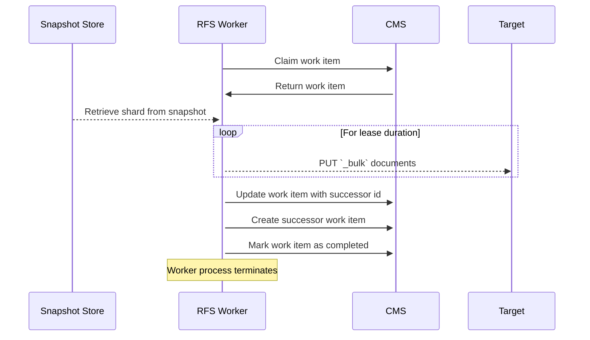

# RFS High Level Design

**LAST UPDATED: June 2024**

## Table of Contents
- [RFS High Level Design](#rfs-high-level-design)
    - [Terminology](#terminology)
    - [Background - General](#background---general)
    - [Background - Snapshots](#background---snapshots)
    - [Ultra-High Level Design](#ultra-high-level-design)
    - [Key RFS Worker concepts](#key-rfs-worker-concepts)
    - [How the RFS Worker works](#how-the-rfs-worker-works)
    - [Appendix: Assumptions](#appendix-assumptions)
    - [Appendix: Centralized or Decentralized Coordination?](#appendix-centralized-or-decentralized-coordination)
    - [Appendix: CMS Schema](#appendix-cms-schema)

## Terminology
* **Lucene Document**: A single data record, as understood by Lucene
* **Lucene Index**: A collection of Lucene Documents
* **Elasticsearch**: A software stack that can be used to search large data sets (multiple petabytes) by combining many Lucene instances into a single distributed system
* **OpenSearch**: An open source fork of Elasticsearch primarily maintained by AWS
* **Elasticsearch Document**: A single data record, as understood by Elasticsearch
* **Elasticsearch Index**: A collection of Elasticsearch Documents all conforming to a shared specification; split across potentially many Elasticsearch Shards
* **Elasticsearch Shard (Shard)**: A subdivision of an Elasticsearch Index that corresponds to a unique Lucene Index and stores it’s portion of the Elasticsearch Index’s Elasticsearch Documents in that Lucene Index as Lucene Documents; provides an Elasticsearch-level abstraction around that Lucene Index.  The Shard may contain multiple copies of the Lucene Index (replicas) spread across multiple hosts.
* **Elasticsearch Cluster (Cluster)**: A collection of nodes, of various types, that store and provide access to some number of Elasticsearch Indexes
* **Elasticsearch Template (Template)**: A metadata setting on an Elasticsearch Cluster used to pre-populate, route, change, or otherwise enrich the Elasticsearch Documents stored in the Elasticsearch Cluster
* **Snapshot**: A copy of the Elasticsearch Indexes and Elasticsearch Templates in an Elasticsearch Cluster that can be stored and then restored to stand up a new Elasticsearch Cluster with the data/metadata of the original
* **Indexing/Ingestion**: The process of taking the raw Elasticsearch Document and transforming it into one or more Lucene Documents for storage in a Lucene Index within a single Shard of an Elastisearch Cluster

## Background - General

Elasticsearch and OpenSearch are distributed software systems that provide the capability to search across large data sets (multiple PBs).  Users need a way to easily move their data and metadata from one Elasticsearch/OpenSearch Cluster to another.  A major complicating factor is that Lucene only supports backwards compatibility for one major version; Lucene and Elasticsearch/OpenSearch major versions are linked for this reason.  There are a few ways users currently perform this data movement.

One approach is to take a snapshot of the source cluster, then restore it on a new target cluster.  This operation happens at the filesystem level and over the Elasticsearch/OpenSearch back channel, skipping the overhead of the HTTP layer of the distributed system.  Snapshot/restore works if the target cluster is the same major version (MV) or one higher than the source (MV + 1).  However, before the data can be moved to a target cluster of MV + 2, all the data in the cluster must be re-indexed at MV + 1 to convert it into the correct Lucene format.  Another approach is to use the bulk re-reindexing API on the source cluster to send all its Elasticsearch Documents to the target cluster.  This happens at the Elasticsearch Index level.  The target cluster converts the Elasticsearch Documents into Lucene Documents compatible with its Lucene major version.  The faster this process happens, the more load the source cluster experiences.  Additionally, the process is sensitive to individual source cluster nodes failing, and it carries the overhead of working via the distributed systems on both the source and target clusters.

Reindex-from-Snapshot (RFS) is a new, alternative approach proposed [in this RFC](https://github.com/opensearch-project/OpenSearch/issues/12667).  The premise is to take a snapshot of the source cluster, split it into its component Elasticsearch Shards, and have a fleet of workers each responsible for extracting the Elasticsearch Documents from a single Shard and re-indexing them on the target cluster.  This removes the strain on the source cluster while also bypassing the MV + 1 upgrade limit. While not enforced, there is a recommend best practice to limit Shards to 20-50 GB depending on use-case.  This means we can some confidence that our unit of work (the Shard) is self-limiting in size.  Because every Shard is a separate Lucene Index, the RFS design can fans out at the Shard-level.  The work of migrating each Shard is completely independent of the other Shards, except for available ingestion capacity on the target cluster.  For a 1 PB source cluster, assuming Shards averaging 50 GB, this means a full fan-out could leverage up to 20,000 workers in parallel (50 GB x 20,000 => 1 PB).

The ultimate goal of RFS is to enable the movement of the data in a large (multiple petabytes) source cluster to a new target cluster with a better user experience than either of the existing solutions - assuming the user can’t just use snapshot/restore.  Users whose target cluster is the same major version as the source, or just want to upgrade a single major version but have no intention of upgrading beyond that, should just use snapshot/restore.  The source cluster may have thousands of Elasticsearch Indices and Shards.  Achieving this ultimate goal there means distributing the work of reading the snapshot and re-indexing on the target cluster across many (potentially hundreds or thousands) of workers.

## Background - Snapshots

Elasticsearch Snapshots are a directory tree containing both data and metadata.  Each Elasticsearch Index has its own sub-directory, and each Elasticsearch Shard has its own sub-directory under the directory of its parent Elasticsearch Index.  The raw data for a given Elasticsearch Shard is store in its corresponding Shard sub-directory as a collection of Lucene files, which Elasticsearch obfuscates.  Metadata files exist in the snapshot to provide details about the snapshot as a whole, the source cluster’s global metadata and settings, each index in the snapshot, and each shard in the snapshot.

Read more about [Snapshot Reading](./SNAPSHOT_READING.md)

## Ultra-High Level Design
The responsibility of performing an RFS operation is performed by a group of one or more RFS Workers (see Figure 1, below).


**Figure 1:** The Reindex-from-Snapshot high level system design 

RFS Workers perform the work of migrating the data from a source cluster to a target cluster.  They will coordinate amongst themselves in a decentralized manner using the target cluster as the source-of-truth for the state of the overall operation (see: Appendix: Centralized or Decentralized Coordination?).  Each RFS Worker is oblivious to the existence of any other RFS Worker working on the same operation, except as expressed in changes to overall operation’s metadata stored on the target cluster.  Each RFS Worker is solely concerned with answering the question, “given the operation metadata in the source-of-truth, what should I do right now?”  Any given RFS Worker may perform every step in the overall process, some of them, or none of them.  Any given RFS Worker should be able to die at any point in its work, and have a new RFS Worker resume that work gracefully.  The steps in an RFS operation are:

1. Create the coordinating metadata index on the target
2. Create work items to track the migration of each Shard on the Source
3. Migrate the documents by retrieving each Elasticsearch Shard, unpacking it into a Lucene Index locally, performing any required transformations, and re-indexing its contents against the target cluster
4. Indicate progress completed by creating successor work items

## Key RFS Worker concepts

### Coordinating Metadata Store (CMS)

The Coordinating Metadata Store (CMS) is the source of truth for the status of the overall Reindex-from-Snapshot operation.  For the first iteration, the target Elasticsearch/Opensearch cluster is used for this purpose (see A1 in [Appendix: Assumptions](#appendix-assumptions)), but it could just as easily be a PostgreSQL instance, Dynamo DB, etc.  The schema for this metadata can be found in [Appendix: CMS Schema](#appendix-cms-schema).

RFS Workers query the CMS to infer what work they should next attempt, and update the CMS with any progress they have made.  RFS Workers interact with the CMS without making assumptions about how many other RFS Workers are doing the same thing.

Important CMS features in use:

* Atomic Creates: Used by the RFS Workers to ensure only one of them can successfully create a given record no matter how many make the attempt; the winner then assumes they can perform some associated work
* Optimistic Locking: Used by the RFS Workers to ensure only one of them can successfully update a given record no matter how many make the attempt; the winner then assumes they can perform some associated work
* Effective Search: Used by RFS Workers to find available work items registered in the CMS

### Work leases

An RFS Worker “acquires” a work item by either winning an atomic creation or an optimistic update on the CMS. When it does so, it sets a maximum duration for it to complete work on the item as a part of the create/update operation. Ideally, it will use the CMS’s clock to do this.  The RFS Worker is assumed to have a lease on that work item until that duration expires. If the work is not completed in that time, the RFS Worker will create a successor work item that defines the remaining work and mark the current work item as finished.

As a specific example, an RFS Worker queries the CMS to find a work item corresponding to a starting point in an Elasticsearch shard to migrate to the target cluster.  The CMS returns a record corresponding to a specific Elasticsearch shard’s progress that either has not been started or has an expired work lease, and the RFS Worker performs an optimistic update of its leaseholder id (with the worker's unique id) & lease expiration field, setting it (hypothetically) for 5 hours from the current time (according to the CMS’s clock).

Lease timing is deterministic as a function of 1/ the "initial lease time" parameter to the RFS worker (the default is 10 minutes) and the number of times a given work item has been attempted. Each time a work item is claimed, the worker increments the number of attempts and then uses that number as an exponent to double the lease time. For example, if the initial lease time is 10 minutes, and this is the first attempt, the lease will be 10 minutes long. If this is the third attempt, the lease will be 80 minutes (10*2^3).

Claiming a lease involves a clock-check (rejecting the lease if the worker's clock is too far off from the CMS's clock), after which the RFS workers monitor the time remaining until the lease expires. When it expires without the work being completed, they (in most cases) create a successor work item including a progress cursor of the current progress through the shard, mark the original work item as completed, and kill the worker process. If shard setup (downloading, unpacking, and beginning to read the shard) takes too little (<2.5%) or too much (>10%) of the lease time, the lease time is considered wrong-sized and is adjusted for the successor item. This adjustment is done by setting the number of attempt field when creating the successor item. If the lease was too short (setup took too large a percent of the time), the number of attempts on the successor item will be the number of attempts on the original item plus one. In the opposite case, it will be initialized as the attempts on the original item minus one. And if the lease was "right-sized", the successor item will get the same number of attempts value as the original currently has.

#### Planned lease-timeout checkpoint timing (MIGRATIONS-2864)

This section documents intended behavior for `MIGRATIONS-2864`. Until that change is released, lease-timeout checkpointing is only initiated at lease expiry.

Planned trigger time for cancellation/checkpoint:
- `trigger = max(leaseDuration * 0.75, leaseDuration - PT4M30S)`

At this trigger, the worker:
1. Cancels in-flight document migration for the current shard.
2. Captures the most recent progress cursor.
3. Runs `createSuccessorWorkItemsAndMarkComplete` to persist handoff metadata.
4. Exits so the next worker can reclaim and continue.

This is meant to preserve progress during transient coordinator outages that happen shortly before lease expiry, giving coordinator retry/backoff logic additional time to persist successor metadata.

### One work lease at a time

An RFS Worker retains no more than a single work lease at a time.  If the work item associated with that lease has multiple steps or components, the work lease covers the completion of all of them as a combined unit.  As a specific example, the RFS Worker that wins the lease to migrate an Elasticsearch shard is responsible for migrating every document in that shard starting at the given doc num (or at the beginning if not specified). After completing a lease, the worker process exits.

In lease-timeout handoff scenarios, the process exits after checkpoint/handoff work is attempted so that a subsequent worker can reclaim remaining documents.

### Work lease backoff

When an RFS Worker acquires a work item, it increments the lease time exponent that will be used on the subsequent attempt. The RFS Worker increases its requested work lease duration based on this exponent.

When some work is completed and a successor item is created, the successor lease time exponent is increased / decreased to maintain a subsequent worker using up 90%-97.5% of the lease time sending docs versus setting up work (e.g. downloading/extracting shard).

The algorithm for backoff based on number of attempts and the maximum number of attempts to allow will both be data driven and expected to improve with experience.

### Idempotent Successor Item Creation

A successor item is created when a worker does not complete the shard referenced in the work item. Because OpenSearch does not have a concept of transactions, the RFS Worker executes a series of actions against the CMS that allow it to remain in a safe state throughout, if the original worker dies or a new worker picks up the original work item.

1. Generate the successor work item id. This is deterministic and just a combination of the shard name and progress cursor, which is the offset within the shard representing how far the worker was able to progress.
2. Update the `successorWorkItems` field of the original work item with the successor work item id, with a server-side check to ensure that the original work item is still owned by the current worker (validating the `leaseHolderId` matches the one supplied by the worker).
3. Create the new work item with ID that was previously determined, as long as it does not currently exist.
4. Mark the original work item as completed, again validating that the current worker still owns the lease for the work item.

If this process fails at any point before step 4 is successful, another worker will acquire the lease for the original work item. However, before beginning work, the worker checks whether the `successorWorkItems` field was set. If so, it knows that a previous worker completed up to the point indicated by the successor work item id, and it picks up the work of steps 3 and 4 (creating the successor work item, if it doesn't exist, and marking the original as complete).

If this process fails before the `successorWorkItems` field is updated, a new worker will acquire the lease, but it won't be clear to that worker that this work was already started, so it will begin from the progress cursor in the original work item. While this means that excess document processing and reindexing work is being done, it does not put the CMS in an inconsistent state. Additionally, as detailed below, reindexing documents is idempotent by ID, so re-writing a document does not cause duplicate copies on the target cluster.

Coordinator outage contract around the planned early-checkpoint trigger:
- If coordinator is unavailable at trigger time, worker retries coordinator operations using existing retry/backoff policies.
- If retries succeed before retry budget exhaustion, handoff metadata is persisted and successor work can be reclaimed.
- If retries are exhausted, worker exits and later workers may need to re-drive work from the last persisted cursor.



## How the RFS Worker works

In this section, we describe in a high-level, narrative manner how the RFS Worker operates.

### RFS Worker threads

The RFS Worker’s running process has at least two running threads:

* Main Thread - performs the work of moving the data from the source cluster to the target cluster; starts the Healthcheck Thread
* Healthcheck Thread - on a regular, scheduled basis will check the process’ shared state to determine which work item the RFS Worker currently has a lease on (if any) and confirm the lease is still valid; if the lease has expired, it immediately kills the process and all threads (see [Work leases](#work-leases)).

There are two pieces of state shared by the threads of the process, which the Main Thread is solely responsible for writing to.  The Healthcheck Thread treats this shared state as read-only.

* Container Phase - which phase the RFS Worker is operating in
* Work Item - which work item the RFS Worker currently has a lease on, if any

### Phase 0 - Container Start

On startup, the Main Thread initializes the process shared state and launches the Healthcheck Thread.

### Phase 1 - Snapshot Creation

The Main Thread queries the CMS to see if a Snapshot of the source cluster has already been created.  If so, we proceed to the next phase.

If not, we update the process shared state to indicate we’re creating a snapshot.  Based on the status of the CMS work entry for snapshot creation and the state of the source cluster, we will either attempt to create the Snapshot ourselves or wait for the in-progress Snapshot to complete.  When the Snapshot completes, we update the shared process state to indicate we've finished the phase, mark the CMS entry completed, and proceed to the next phase.  If the Snapshot fails, we update the CMS to indicate the snapshot failed, emit an event reporting the unrecoverable nature of the situation (from the RFS Worker’s perspective), and terminate the RFS Worker.

When creating the Snapshot on the source cluster, we use a consistent and deterministic name that all RFS Workers will be able to construct based upon the information available to them within their runtime environment.  This means that every RFS Worker will know which Snapshot to poll the status of on the source cluster regardless of whether it was the one to kick off its creation.

### Phase 2 - Cluster Metadata Migration

The Main Thread queries the CMS to see if a Cluster Metadata of the source cluster has already been migrated.  If so, we proceed to the next phase.

If not, we update the process shared state to indicate we’re migrating that metadata.  We enter a loop, where we check the status of the Metadata Migration entry in the CMS and then proceed based on what we find.  If it looks like no one is currently working on migrating the metadata, we attempt to acquire the work lease for it (see [Work leases](#work-leases), [Work lease backoff](#work-lease-backoff)).  The RFS Worker that wins the lease downloads the Cluster Metadata file from the Snapshot, then attempts to migrate (in order) the legacy, composite, and index Templates present in it to the target cluster - as long as the given Template matches the user whitelist and isn’t already present on the target cluster.  Once every Template has been processed, the RFS Worker updates the CMS’s status for the Cluster Metadata Migration to be complete.  RFS Workers that fail to win the lease or find that another RFS Worker has the lease wait a short, random time before checking again.  RFS Workers exit the loop when they discover the Cluster Metadata Migration has been completed or failed.

The work lease for this phase is on the entire Cluster Metadata migration (all Templates, of all types).  If something in that process fails enough times, we update the CMS to indicate the phase has failed, emit an event reporting the unrecoverable nature of the situation (from the RFS Worker’s perspective), and terminate the RFS Worker.

### Phase 3 - Index Migration

The Main Thread queries the CMS to see if the Elasticsearch Indices on the source cluster have already been migrated.  If so, we proceed to the next phase.

If not, we update the process shared state to indicate we’re migrating those Indices.  We then enter a loop to progress through two sub-phases.  At the beginning of each iteration, we check the CMS for the state of the Index Migration.

#### 3.1 - Setup

The goal of this sub-phase is to create records (Index Work Entries) in the CMS to track the migration of each Elasticsearch Index.  We exit the sub-phase when we find this has been completed, or that it has failed unrecoverably.

Each RFS Worker attempts to acquire a lease on the work to create these individual, Index-specific records (see: Work leases, Work lease backoff).  The RFS Worker that wins the lease downloads the Snapshot Metadata file from the Snapshot, then creates an Index Work Entry for each Index in the CMS (if it does not already exist).  The Index Work Entry contains Index’s name, migrations status, and the number of shards that Index has.  Once every Index Work Entry exists in the the CMS, it updates the CMS to indicate this sub-phase is completed.  RFS Workers that fail to win the lease or find that another RFS Worker has the lease wait a short, random time before returning the beginning of the loop.

The work lease for this phase is on the entire setup process (ensuring a record exists for every Index in the Snapshot).  If something in that process fails enough times, we update the CMS to indicate the phase has failed, emit an event reporting the unrecoverable nature of the situation (from the RFS Worker’s perspective), and terminate the RFS Worker.

#### 3.2 - Migrate the indices

The goal of this sub-phase is to migrate all the Elasticsearch Indices from the source cluster to the target cluster.  This means creating a corresponding Index on the target cluster for each we find on the source cluster.  We exit the sub-phase when we find every Index has been processed (successfully, or unsuccessfully).

Each RFS Worker asks the CMS for a random set of Index Work Entry that have not been processed yet.  For each Index Work Entry returned, we retrieve from the Snapshot the corresponding Index Metadata file, use the information in that file to attempt to create the Index on the target cluster if it’s not already there, and attempt to update the Index Work Entry to be completed if it hasn’t already been updated.  If we fail to create the Index on the target cluster, we attempt to increment the Index Work Entry’s number of attempts.  If we find that the number of attempts is over a specified threshold, we attempt to mark the Index Work Entry’s status to be failed and emit a notification event if we succeed.

If no Entries are returned, we know that this sub-phase is complete and attempt to update the CMS’s status for the Index Migration phase to be complete.

It’s important to point out that we don’t attempt to ensure that each Index is processed only once; we instead rely on our concept of [Don’t touch existing templates or indices](#dont-touch-existing-templates-or-indices) and optimistic locking on the Index Work Entry in the CMS to ensure that at least one RFS Workers will process each Index to completion without anything disastrous happening.  The work required for each Index is small, so there is little cost to having multiple RFS Workers attempt the same Index occasionally.

### Phase 4 - Document Migration

The Main Thread queries the CMS to see if the Elasticsearch Documents on the source cluster have already been migrated.  If so, we proceed to the next phase.

If not, we update the process shared state to indicate we’re migrating those Documents.  We then enter a loop to progress through two sub-phases.  At the beginning of each iteration, we check the CMS for the state of the Document Migration.

#### 4.1 - Setup

Similar to [3.1 - Setup](#31---setup) in the Index Migration phase, the goal of this sub-phase is to create records (Shard Work Entries) in the CMS to track the migration of each Shard.  We exit the sub-phase when we find this has been completed, or that it has failed unrecoverably.

The process is the same as 3.1 - Setup, with the exception that the RFS Worker that wins the lease to do the setup work will use the Index Work Entries to determine the number and details of the Shard Work Entries to be created.  For each Index Work Entry that was successfully migrated to target cluster, we check the number of shards set in the Index Work Entry and create a Shard Work Entry for each.  The Shard Work Entry will contain the Index name, shard number, and migration status.

#### 4.2 - Migrate the documents

The goal of this sub-phase is to migrate all the Elasticsearch Documents from the source cluster to the target cluster.  This means recreating all the Documents in the source cluster onto the target cluster.  We exit the sub-phase when we find every Shard has been processed (successfully, or unsuccessfully).

Each RFS Worker asks the CMS for a single, random Shard Work Entry that either has not been started or has an expired work lease (see [Work leases](#work-leases), [Work lease backoff](#work-lease-backoff)).  When then attempt to acquire the lease on that Entry.  If we fail, we ask the CMS for another Entry.  If we succeed, we check the number of times this Entry has been attempted.  If over the threshold, we mark it as failed and emit a notification event if not already done so then skip it.  If not over the threshold, we download the Shard’s files from the Snapshot, unpack them, read them as a Lucene Index, extract the original Elasticsearch Documents from them, and HTTP PUT those Documents against the target cluster.  When performing the PUT, we use the Document’s original ID from the source cluster and overwrite any Document on the target cluster’s corresponding Elasticsearch Index that has the same ID  (see [Overwrite documents by ID](#overwrite-documents-by-id)).  Once all Documents in the Shard have been processed, we mark the Shard Work Entry as completed and ask for another entry.

If no Entry is returned, we know that this sub-phase is complete and attempt to update the CMS’s status for the Documents Migration phase to be complete.

The work lease for this sub-phase is on the Shard (ensuring every Elasticsearch Document in that Shard has been processed).  We log/emit metrics to indicate how many Documents are successfully and unsuccessfully migrated but we don’t consider the Shard Work Entry to have failed if some (or even all) of the Documents in it are unsuccessfully migrated.  We only retry the Shard Work Entry when an RFS Worker fails to process every Document within the lease window.  These retries are relatively time consuming, but safe because we overwrite any partial work performed by a previous RFS Worker. 

### Notes on Reindexing Behavior

#### Don’t touch existing templates or indices

While performing its work, RFS Workers will not modify any Templates or Index Settings on the target cluster.  We expect that users have migrated metadata before they documents. This approach allows separation of concerns between the RFS Workers and the metadata migration process.  It also provides space for users to customize/configure the target cluster differently than the source cluster.

#### Overwrite documents by ID

While performing its work, if an RFS Worker is tasked to create an Elasticsearch Document on the target cluster, it will do so by using the same ID as on the source cluster, clobbering any existing Elasticsearch Document on the target cluster with that ID.  The reasoning for this policy is as follows.

The pending work items are the remaining docs for each Elasticsearch Shard. The RFS Workers have a consistent view of the position of a document within the entire shard. If a lease is about to expire and a shard has not been fully migrated, the RFS Workers use the latest continuous migrated doc number to reduce the duplicate work a successor work item has. On the target cluster, overwritten documents appear as deleted documents, so the amount of duplicative work can be assessed from the deleted items metric (assuming there is not other activity on the cluster creating deleted documents).

## Appendix: Assumptions

We start with the following high-level assumptions about the structure of the solution.  Changes to these assumptions would likely have a substantial impact on the design.  

* (A1) - The RFS Workers cannot assume access to a data store other than the migration’s target cluster as a state-store for coordinating their work.
* (A2) - The RFS Worker will perform all the work required to complete a historical migration.

We have the following, additional assumptions about the process of performing a Reindex-from-Snapshot operation:

* (A3) - Re-doing portions of the overall RFS operation is fine, as long as every portion is completed at least once
* (A4) - Elasticsearch Shards can only be migrated after their Elasticsearch Index has been created or migrated
* (A5) - Elasticsearch Shards can be migrated in parallel without ordering concerns

## Appendix: Centralized or Decentralized Coordination?

At a high level, the primary concerns for a Reindex-from-Snapshot operation are scalability and fault tolerance.  That is, the most important concern is that the system can handle even very large source clusters with a high degree of confidence that all work items will be processed at least once in a reasonable timeframe despite failures amongst the workers involved.  This naturally lends itself to a decentralized coordination approach over a centralized approach (whose primary benefits would be more consistent and efficient work allocation).  Additionally, our starting assumptions for the design fit a decentralized approach (see: Appendix: Assumptions). (A1) indicates we have a natural point of coordination amongst workers - the target cluster.  (A3) indicates that we need a homogenous fleet.  (A2) implies that every RFS Worker will already have a substantial set of responsibilities, and adding a work assignment layer to that would further complicate them.  (A6) allows us to avoid complex tracking/coordination by accepting that some work items might, occaisionally, be processed multiple times.

## Appendix: CMS Schema

Below is the schema for the coordinating metadata records to be stored in the CMS:

```
SHARD SETUP
ID: shard_setup
FIELDS:
    * creatorId (string): Unique id of the worker who created the task
    * leaseHolderId (string): Unique id of the worker who has aquired the lease for the task
    * expiration (timestamp): When the current lease expires
    * nextAcquisitionLeaseExponent (integer): Times the task has been attempted
    * completedAt (timestamp): If present, when the task was completed.

SHARD COMPONENT WORK ENTRY RECORD
ID: <name of the index to be migrated>__<shard number>__<progress cursor>
FIELDS:
    * creatorId (string): Unique id of the worker who created the task
    * leaseHolderId (string): Unique ID of the RFS worker that currently holds the lease
    * expiration (timestamp): When the current work lease expires
    * nextAcquisitionLeaseExponent (integer): Times the task has been attempted
    * successorWorkItems (list of strings): Follow-up work item(s) created from this parent item
    * completedAt (timestamp): When this work item was completed
```
