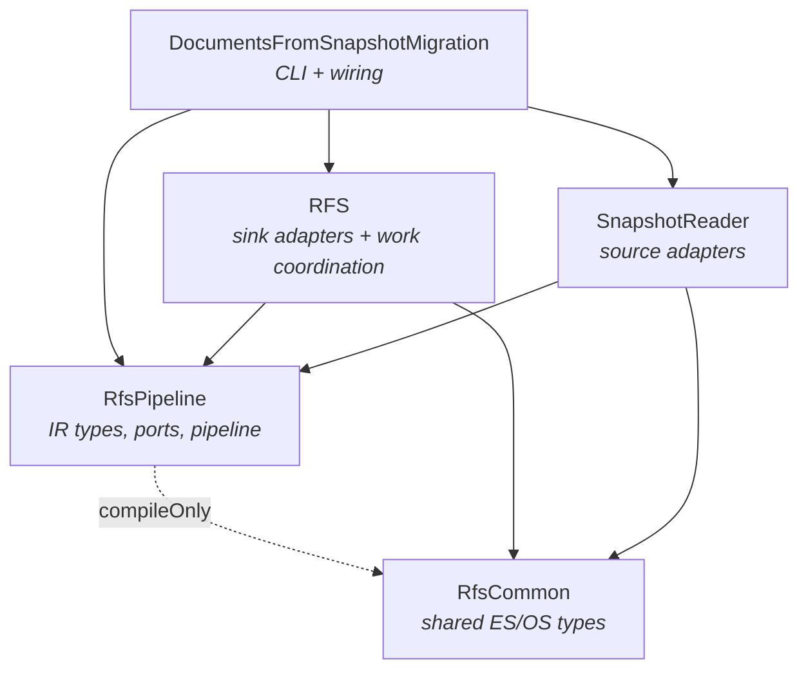
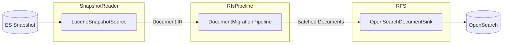

# Pipeline Architecture

The pipeline uses a **ports-and-adapters** (hexagonal) architecture. The core module (`RfsPipeline`) defines source-agnostic IR types and port interfaces with zero dependencies on Lucene or OpenSearch. Adapters in separate modules implement the ports.

## Module Dependency Graph

## Data Flow

## Source-Agnostic Core (`RfsPipeline`)

The core defines three layers:

- **IR types** (`ir/`): `Document`, `Partition`, `CollectionMetadata`, `ProgressCursor`, `BatchResult` — all source-agnostic, no ES/Lucene/OpenSearch concepts
- **Port interfaces** (`source/`, `sink/`): `DocumentSource`, `DocumentSink` — generic contracts using IR types
- **Pipeline** (`DocumentMigrationPipeline`): reactive batching + concurrency orchestration, operates only on IR types
- **Pipeline support**: `PipelineDefaults` (default values), `PipelineException` (error types)
- **Progress monitoring** (`PipelineProgressMonitor`): fixed-rate heartbeat logger, polls pipeline state on a timer

## ES-Specific Adapters (`adapter/`)

ES-specific types and optional capabilities live in the `adapter/` package (depends on `RfsCommon` at compile time only):

- `EsShardPartition` — `Partition` implementation for ES snapshot shards
- `LuceneAdapter` — converts `LuceneDocumentChange` → `Document`, populating `hints` and `sourceMetadata`
- `IndexMetadataSnapshot`, `GlobalMetadataSnapshot` — ES-specific metadata types
- `GlobalMetadataSource`, `GlobalMetadataSink` — optional ES-specific metadata interfaces
- `EsMetadataMigrationPipeline` — ES-specific metadata migration (templates, index metadata)

## Source Adapters — `SnapshotReader`

| Class | Implements | Purpose |
|---|---|---|
| `LuceneSnapshotSource` | `DocumentSource` | Reads documents from ES snapshot shards via Lucene |
| `SnapshotMetadataSource` | `GlobalMetadataSource` | Reads ES global/index metadata from snapshots |
| `IndexMetadataConverter` | — | Converts `IndexMetadata` → `CollectionMetadata` with ES `sourceConfig` |
| `ShardTooLargeException` | — | Thrown when a shard exceeds configured size limits |

## Sink Adapters — `RFS`

| Class | Implements | Purpose |
|---|---|---|
| `OpenSearchDocumentSink` | `DocumentSink` | Writes document batches via OpenSearch bulk API |
| `OpenSearchMetadataSink` | `GlobalMetadataSink` | Writes global metadata and creates indices on OpenSearch |
| `OpenSearchIndexCreator` | — | Shared helper for index creation from IR metadata |
| `PipelineDocumentsRunner` | — | Work-coordinated shard migration (lease acquisition, progress tracking) |
| `PipelineConfig` | — | Runtime configuration for pipeline behavior |

## Wiring — `DocumentsFromSnapshotMigration`

| Class | Purpose |
|---|---|
| `DocumentMigrationBootstrap` | DI orchestrator — wires source, sink, pipeline, and work coordination |
| `RfsMigrateDocuments` | CLI entry point |

## Module Boundaries

| Module | Responsibility | Dependencies |
|---|---|---|
| `RfsPipeline` | IR types, port interfaces, pipeline orchestration, ES adapter types | Reactor Core, Jackson, `RfsCommon` (compileOnly for adapters) |
| `SnapshotReader` | Source adapters (`LuceneSnapshotSource`, `SnapshotMetadataSource`) | `RfsPipeline`, `RfsCommon`, Lucene |
| `RFS` | Sink adapters (`OpenSearchDocumentSink`, `OpenSearchMetadataSink`), work coordination | `RfsPipeline`, `RfsCommon`, OpenSearch client |
| `DocumentsFromSnapshotMigration` | Top-level wiring (`DocumentMigrationBootstrap`, CLI entry point) | All of the above |

Key constraint: **RFS does not depend on SnapshotReader** and vice versa. They only share `RfsPipeline` and `RfsCommon`.
