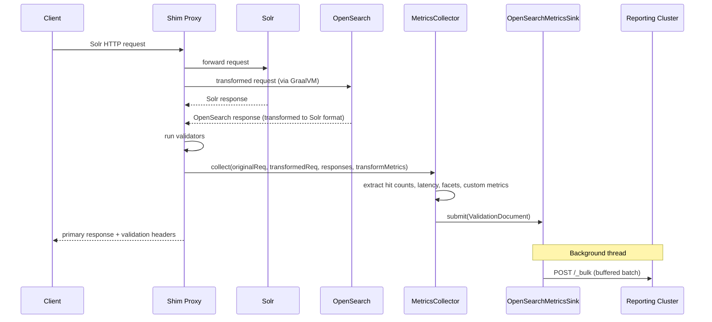

# Validation Reporting Framework

The validation reporting framework captures per-request comparison data from the Transformation Shim and streams it to an external OpenSearch cluster for visualization, aggregation, and alerting via OpenSearch Dashboards.

## Why

When the shim proxies requests to both Solr and OpenSearch in parallel, validation results (field equality, doc count, etc.) are returned as ephemeral HTTP response headers. Once the response is sent, the data is gone. The reporting framework makes this data durable and queryable — you can build dashboards for hit count drift over time, latency comparisons, facet discrepancies, and custom transform warnings.

## What Gets Captured

Each proxied request produces a single **ValidationDocument** indexed into the reporting cluster. The document contains:

| Section | Fields | When Present |
|---|---|---|
| Request context | `original_request`, `transformed_request`, `collection_name`, `normalized_endpoint`, `timestamp`, `request_id` | Always |
| Hit count drift | `solr_hit_count`, `opensearch_hit_count`, `hit_count_drift_percentage` | Always (null if target errored) |
| Query latency | `solr_qtime_ms`, `opensearch_took_ms`, `query_time_delta_ms` | Always (null if target errored) |
| Comparisons | `comparisons` list (typed entries, e.g., facet bucket diffs) | Only when the query has facets |
| Custom metrics | `custom_metrics` map | Always (empty if no transform metrics emitted) |

Both `original_request` and `transformed_request` use a generic `RequestRecord` structure: `method`, `uri`, `headers`, and optionally `body`.

Hit counts and latencies are extracted from the **post-transform** response bodies — both targets are in Solr format after the response transform runs, so the same field paths (`response.numFound`, `responseHeader.QTime`) work for both.

## Architecture



The `MetricsCollector` runs inline on the Netty event loop after validators but before the response is sent. It never blocks — the `OpenSearchMetricsSink` buffers documents and flushes on a background thread. If the reporting cluster is down, documents are discarded and the proxy continues normally.

## Configuration

Add `--reporting-config path/to/config.yaml` to the shim startup command. See `src/main/resources/reporting-config-sample.yaml` for a fully commented example.

Minimal config:

```yaml
enabled: true
sink:
  type: opensearch
  opensearch:
    uri: https://reporting-cluster:9200
    auth:
      username: admin
      password: admin
      tls:
        insecure: true
```

When `--reporting-config` is not provided, reporting is disabled and no sink is initialized.

## Custom Transform Metrics

TypeScript transforms can emit arbitrary key-value metrics via the `_metrics` side-channel. Both request and response transforms receive a `_metrics` map in their bindings:

```typescript
// In any transform function:
const metrics = bindings._metrics;
if (metrics) {
    metrics.put("warn-offset-used-in-term-facet", 1);
    metrics.put("fallback-handler", "edismax");
}
```

These appear in the `custom_metrics` field of the ValidationDocument. Existing transforms that don't reference `_metrics` are unaffected.

## Key Classes

All in `org.opensearch.migrations.transform.shim.reporting`:

| Class | Role |
|---|---|
| `ValidationDocument` | Java record — the document schema with nested `RequestRecord`, `ComparisonEntry`, `ValueDrift` |
| `MetricsCollector` | Extracts metrics from target responses, builds document, submits to sink |
| `MetricsSink` | Interface — `submit()`, `flush()`, `close()` |
| `OpenSearchMetricsSink` | Bulk-indexes documents into the reporting cluster |
| `MetricsExtractor` | Static utilities — nested field extraction, drift computation, URI parsing |
| `FacetComparator` | Compares post-transform Solr-format facet structures |
| `ReportingConfig` | YAML config POJO, parsed at startup |

## OpenSearch Index

Documents are indexed into time-based indices: `{index_prefix}-{yyyy.MM.dd}` (default: `shim-metrics-2025.03.17`). The reporting cluster should have an index template for `shim-metrics-*` — see the design doc for the full mapping.

## Error Handling

The framework is best-effort. The proxy's primary job (routing requests and returning responses) is never compromised:

- If the reporting cluster is unreachable, the batch is discarded and new documents continue to be accepted.
- If `MetricsCollector` throws, the exception is caught and logged — the client response is unaffected.
- If a target response is missing or errored, the corresponding fields are set to null and a partial document is still indexed.
