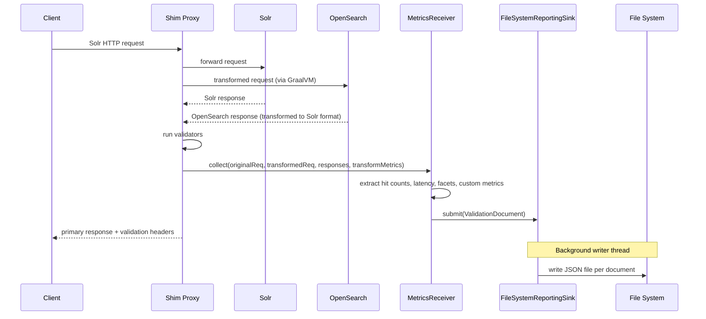

# Validation Reporting Framework

The validation reporting framework captures per-request comparison data when requests are proxied to multiple targets in parallel. It is designed as a reusable library that can be integrated into any component that performs dual-target validation — including the Transformation Shim, Traffic Capture, and Replayer. Comparison documents are streamed to a configurable sink (the `ReportingSink` interface); the current implementation writes JSON files to a local directory for inspection, debugging, and post-hoc analysis.

## Why

When the shim proxies requests to both Solr and OpenSearch in parallel, validation results (field equality, doc count, etc.) are returned as ephemeral HTTP response headers. Once the response is sent, the data is gone. The reporting framework makes this data durable and queryable — you can review hit count drift over time, latency comparisons, facet discrepancies, and custom transform warnings.

## What Gets Captured

Each proxied request produces a single **ValidationDocument**. The document contains:

| Section | Fields | When Present |
|---|---|---|
| Request context | `original_request`, `transformed_request`, `collection_name`, `normalized_endpoint`, `timestamp`, `request_id` | Always |
| Hit count drift | `baseline_hit_count`, `candidate_hit_count`, `hit_count_drift_percentage` | Always (null if target errored) |
| Response latency | `baseline_response_time_ms`, `candidate_response_time_ms`, `response_time_delta_ms` | Always (null if target errored) |
| Response context | `baseline_response`, `candidate_response` | Always (null if target missing) |
| Comparisons | `comparisons` list (typed entries, e.g., facet bucket diffs) | Only when the query has facets |
| Custom metrics | `custom_metrics` map | Always (empty if no transform metrics emitted) |

Both `original_request` and `transformed_request` use a generic `RequestRecord` structure: `method`, `uri`, `headers`, and optionally `body`.

Both `baseline_response` and `candidate_response` use a `ResponseRecord` structure: `status_code`, `error` (non-null only on failure), and optionally `body` (controlled by the `includeResponseBody` flag on `MetricsReceiver`).

Hit counts and latencies are extracted from the **post-transform** response bodies via a pluggable `MetricsExtractor` interface. Each implementation defines the field paths and URI patterns for its source system. For example, the Solr implementation uses `response.numFound` and `responseHeader.QTime`. Result comparisons (e.g. facet diffs) are also delegated to the extractor, making the framework reusable across different source and target systems.

## Architecture



The `MetricsReceiver` runs inline on the Netty event loop after validators but before the response is sent. It never blocks — the `FileSystemReportingSink` buffers documents in a `LinkedBlockingQueue` and writes them on a background thread. If a write fails, the document is discarded and the proxy continues normally.

## File System Sink

The `FileSystemReportingSink` writes each `ValidationDocument` as a separate JSON file to a configurable output directory. Files are named `{timestamp}_{requestId}.json` (colons in the timestamp are replaced with dashes) for uniqueness and chronological sorting.

Example file name: `2025-03-17T10-00-00Z_abc-123.json`

### Behavior

- `submit()` enqueues the document into a bounded `LinkedBlockingQueue` and returns immediately (non-blocking).
- A background writer thread takes documents from the queue and writes them to disk.
- If the queue is full, the document is discarded and a warning is logged.
- `flush()` inserts a poison pill into the queue and blocks until the writer thread has processed all preceding items.
- `close()` flushes remaining documents and stops the writer thread. Subsequent submissions are discarded.
- All disk I/O errors are logged and the affected document is discarded — the proxy is never impacted.

### JSON Output

Each file is a valid JSON document matching the `ValidationDocument` schema. Null fields are omitted (consistent with `@JsonInclude(NON_NULL)`).

Example:

```json
{
  "timestamp": "2025-03-17T10:00:00Z",
  "request_id": "abc-123",
  "original_request": {
    "method": "GET",
    "uri": "/solr/mycore/select?q=*:*",
    "headers": { "Host": "solr:8983" }
  },
  "transformed_request": {
    "method": "GET",
    "uri": "/mycore/_search?q=*:*",
    "headers": { "Host": "os:9200" }
  },
  "collection_name": "mycore",
  "normalized_endpoint": "/solr/{collection}/select",
  "baseline_hit_count": 100,
  "candidate_hit_count": 95,
  "hit_count_drift_percentage": 5.0,
  "baseline_response_time_ms": 12,
  "candidate_response_time_ms": 15,
  "response_time_delta_ms": 3,
  "comparisons": [
    {
      "type": "facet_field",
      "name": "category",
      "keys_match": true,
      "value_drifts": [
        { "key": "books", "baseline_value": 50, "candidate_value": 48, "drift_percentage": 4.0 }
      ]
    }
  ],
  "custom_metrics": { "warn-offset": 1 }
}
```

## Transform Metrics

Request and response transforms can emit arbitrary key-value metrics via the `_metrics` side-channel. For TypeScript transforms, this looks like:

```typescript
// In any transform function:
const metrics = bindings._metrics;
if (metrics) {
    metrics.put("warn-offset-used-in-term-facet", 1);
    metrics.put("fallback-handler", "edismax");
}
```

These appear in the `custom_metrics` field of the ValidationDocument. Existing transforms that don't reference `_metrics` are unaffected.

## Key Classes

All in `org.opensearch.migrations.transform.shim.reporting`:

| Class | Role |
|---|---|
| `ValidationDocument` | Java record — the document schema with nested `RequestRecord`, `ResponseRecord`, `ComparisonEntry`, `ValueDrift` |
| `MetricsReceiver` | Extracts metrics from target responses, builds document, submits to sink |
| `ReportingSink` | Interface — `submit()`, `flush()`, `close()` |
| `FileSystemReportingSink` | Writes each document as a JSON file to a local directory via a background thread |
| `MetricsExtractor` | Interface — field path resolution, URI parsing, result comparison; `SolrMetricsExtractor` is the Solr implementation |
| `FacetComparator` | Compares Solr-format facet structures (used internally by `SolrMetricsExtractor`) |

## Error Handling

The framework is best-effort. The proxy's primary job (routing requests and returning responses) is never compromised:

- If a file write fails, the document is discarded and subsequent documents continue to be processed.
- If `MetricsReceiver` throws, the exception is caught and logged — the client response is unaffected.
- If a target response is missing or errored, the corresponding fields are set to null and a partial document is still written.
