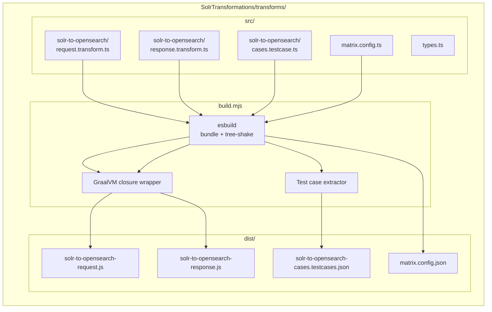
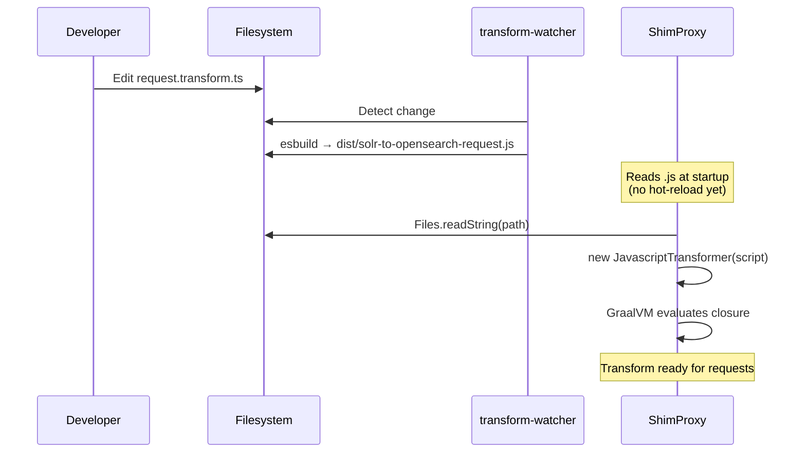
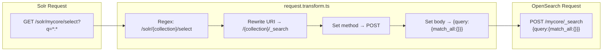
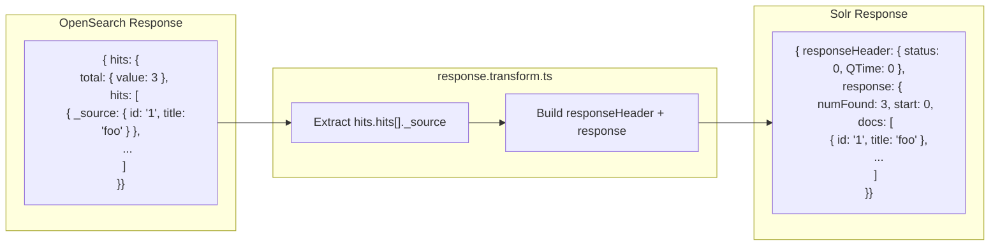
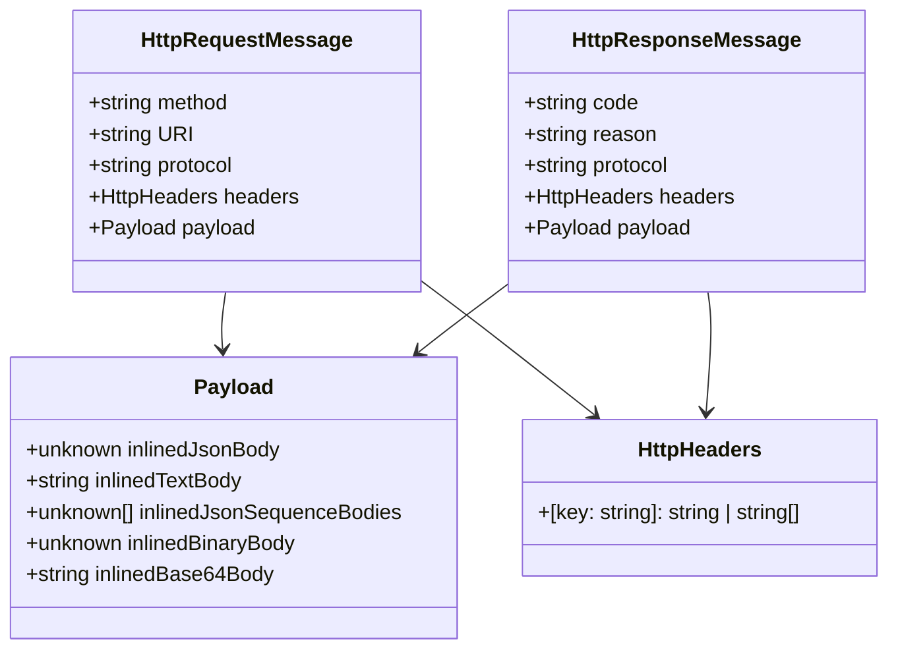
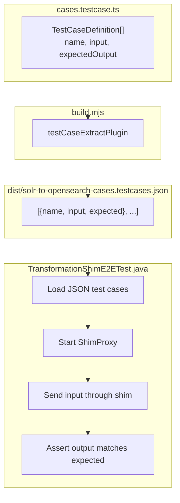

# Solr Transformations — Design

TypeScript-based request/response transforms that convert between Solr and OpenSearch HTTP protocols, executed at runtime via GraalVM.

## Table of Contents

- [Overview](#overview)
- [Build System](#build-system)
- [Transform Lifecycle](#transform-lifecycle)
- [Request Transform](#request-transform)
- [Response Transform](#response-transform)
- [Type System](#type-system)
- [Testing](#testing)

---

## Overview



---

## Build System

The build script (`build.mjs`) processes three types of source files:

| Suffix | Plugin | Output | Purpose |
|--------|--------|--------|---------|
| `*.transform.ts` | `graalvmWrapPlugin` | `*.js` | Runtime transforms |
| `*.testcase.ts` | `testCaseExtractPlugin` | `*.testcases.json` | E2E test data |
| `*.config.ts` | `configExtractPlugin` | `*.config.json` | Test matrix config |

### GraalVM Closure Format

The Java-side `JavascriptTransformer` expects a self-invoking function that returns a transform function:

```javascript
// Output format — what GraalVM loads
(function(bindings) {
  // ... bundled TypeScript code ...
  function transform(msg) { ... }
  return transform;
})
```

The `graalvmWrapPlugin` strips ESM exports and wraps the bundled code in this closure.

### Watch Mode

```bash
npm run watch    # Rebuilds on file changes
npm run build    # One-shot build
```

In Docker, the `transform-watcher` service runs `npm run watch` and writes to a shared volume that the shim containers mount read-only.

---

## Transform Lifecycle



---

## Request Transform

Converts Solr select queries into OpenSearch `_search` requests.



### Logic

```
IF URI matches /solr/{collection}/select:
  1. URI = /{collection}/_search
  2. method = POST
  3. payload = { inlinedTextBody: '{"query":{"match_all":{}}}' }
  4. headers.content-type = application/json
ELSE:
  passthrough (no modification)
```

---

## Response Transform

Converts OpenSearch `hits` format back to Solr `response` format.



---

## Type System

The TypeScript types mirror the Java-side `JsonKeysForHttpMessage` schema:



The types also define the tuple schema (`SourceTargetTuple`) used by the replayer's tuple transforms, though the shim currently only uses the v2 request/response schema.

---

## Testing

### E2E Test Architecture



Test cases are defined in TypeScript alongside the transforms, extracted to JSON at build time, and consumed by the Java E2E test suite. This keeps test data co-located with the transform logic while allowing the Java test harness to drive the actual HTTP round-trip through the full Netty pipeline.

### Matrix Testing

The `matrix.config.ts` file defines test matrix parameters (Solr versions, OpenSearch versions, etc.) that are extracted to JSON and consumed by the test framework for parameterized testing.
