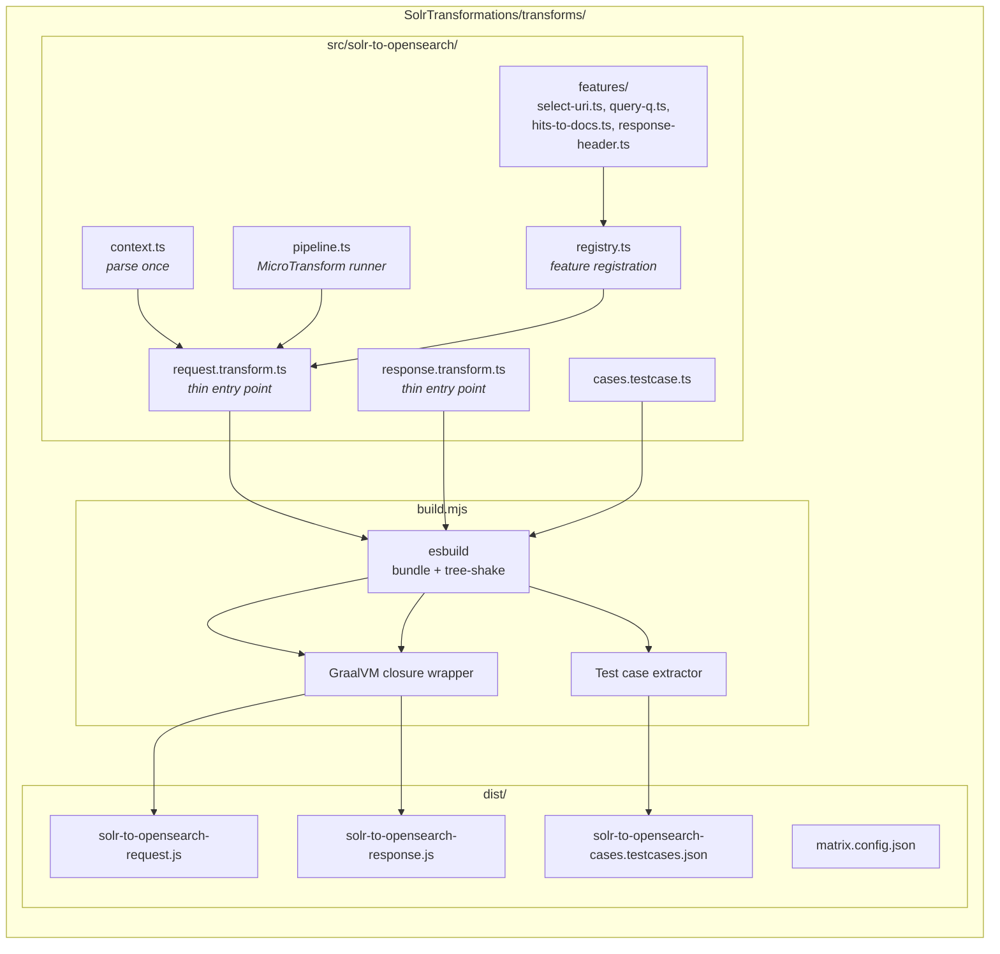
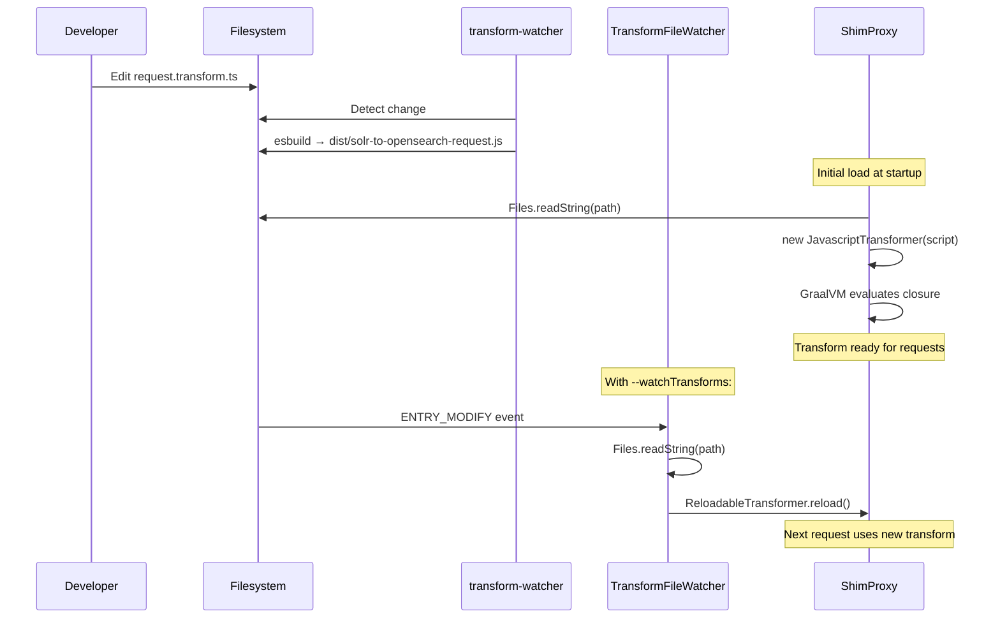
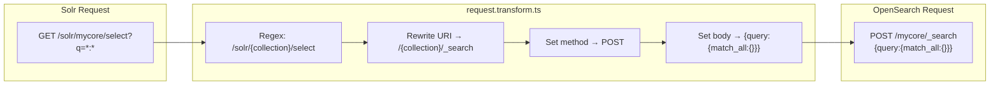
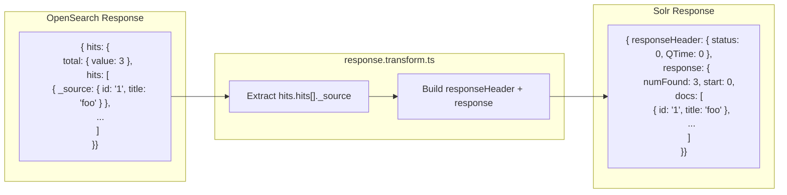
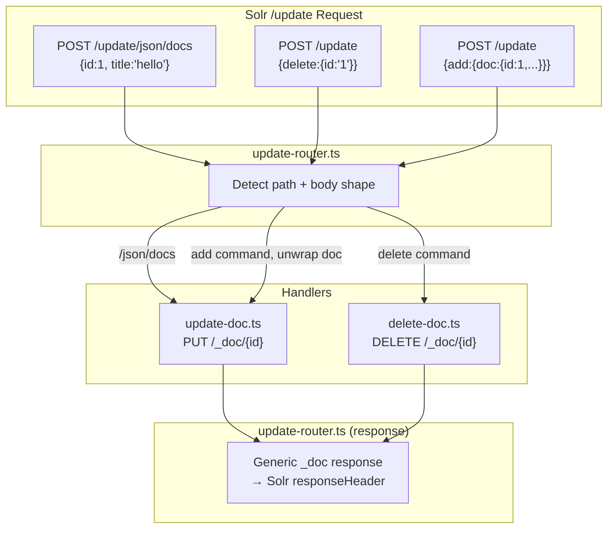
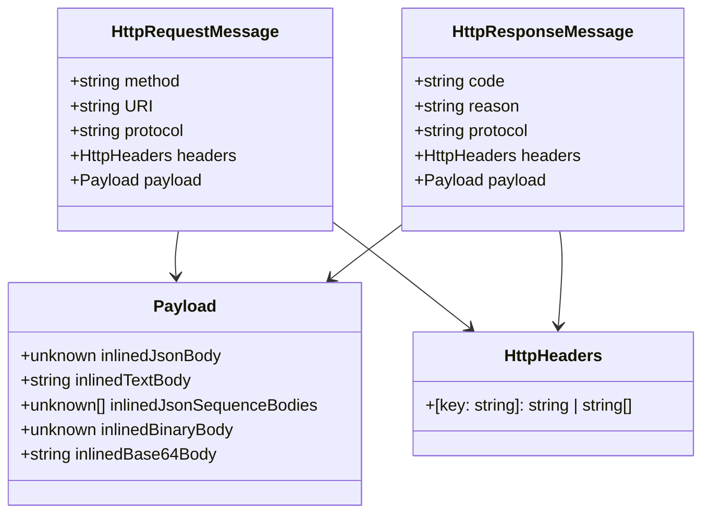
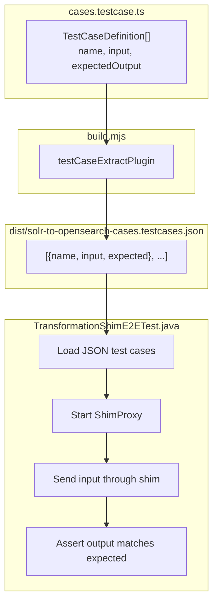

# Solr Transformations — Design

TypeScript-based request/response transforms that convert between Solr and OpenSearch HTTP protocols, executed at runtime via GraalVM.

## Table of Contents

- [Overview](#overview)
- [Build System](#build-system)
- [Transform Lifecycle](#transform-lifecycle)
- [Request Transform](#request-transform)
- [Response Transform](#response-transform)
- [Type System](#type-system)
- [Testing](#testing)

---

## Overview


```mermaid
graph LR
    subgraph SolrTransformations["SolrTransformations/transforms/"]
        subgraph Source["src/solr-to-opensearch/"]
            Context["context.ts<br/><i>parse once</i>"]
            Pipeline["pipeline.ts<br/><i>MicroTransform runner</i>"]
            Registry["registry.ts<br/><i>feature registration</i>"]
            Features["features/<br/>select-uri.ts, query-q.ts,<br/>hits-to-docs.ts, response-header.ts"]
            ReqTS["request.transform.ts<br/><i>thin entry point</i>"]
            RespTS["response.transform.ts<br/><i>thin entry point</i>"]
            Cases["cases.testcase.ts"]
        end

        subgraph BuildTool["build.mjs"]
            ESBuild["esbuild<br/>bundle + tree-shake"]
            GraalWrap["GraalVM closure wrapper"]
            TestExtract["Test case extractor"]
        end

        subgraph Dist["dist/"]
            ReqJS["solr-to-opensearch-request.js"]
            RespJS["solr-to-opensearch-response.js"]
            TestJSON["solr-to-opensearch-cases.testcases.json"]
            ConfigJSON["matrix.config.json"]
        end
    end

    Features --> Registry
    Context --> ReqTS
    Pipeline --> ReqTS
    Registry --> ReqTS
    ReqTS --> ESBuild --> GraalWrap --> ReqJS
    RespTS --> ESBuild --> GraalWrap --> RespJS
    Cases --> ESBuild --> TestExtract --> TestJSON
```

---

## Build System

The build script (`build.mjs`) processes three types of source files:

| Suffix | Plugin | Output | Purpose |
|--------|--------|--------|---------|
| `*.transform.ts` | `graalvmWrapPlugin` | `*.js` | Runtime transforms |
| `*.testcase.ts` | `testCaseExtractPlugin` | `*.testcases.json` | E2E test data |
| `*.config.ts` | `configExtractPlugin` | `*.config.json` | Test matrix config |

### GraalVM Closure Format

The Java-side `JavascriptTransformer` expects a self-invoking function that returns a transform function:

```javascript
// Output format — what GraalVM loads
(function(bindings) {
  // ... bundled TypeScript code ...
  function transform(msg) { ... }
  return transform;
})
```

The `graalvmWrapPlugin` strips ESM exports and wraps the bundled code in this closure.

### Watch Mode

```bash
npm run watch    # Rebuilds on file changes
npm run build    # One-shot build
```

In Docker, the `transform-watcher` service runs `npm run watch` and writes to a shared volume that the shim containers mount read-only.

---

## Transform Lifecycle


```mermaid
sequenceDiagram
    participant Dev as Developer
    participant FS as Filesystem
    participant Watcher as transform-watcher
    participant FW as TransformFileWatcher
    participant Shim as ShimProxy

    Dev->>FS: Edit request.transform.ts
    Watcher->>FS: Detect change
    Watcher->>FS: esbuild → dist/solr-to-opensearch-request.js
    Note over Shim: Initial load at startup
    Shim->>FS: Files.readString(path)
    Shim->>Shim: new JavascriptTransformer(script)
    Shim->>Shim: GraalVM evaluates closure
    Note over Shim: Transform ready for requests
    Note over FW: With --watchTransforms:
    FS->>FW: ENTRY_MODIFY event
    FW->>FW: Files.readString(path)
    FW->>Shim: ReloadableTransformer.reload()
    Note over Shim: Next request uses new transform
```

---

## Request Transform

Converts Solr select queries into OpenSearch `_search` requests.


```mermaid
graph LR
    subgraph Input["Solr Request"]
        A["GET /solr/mycore/select?q=*:*"]
    end

    subgraph Transform["request.transform.ts"]
        B["Regex: /solr/{collection}/select"]
        C["Rewrite URI → /{collection}/_search"]
        D["Set method → POST"]
        E["Set body → {query:{match_all:{}}}"]
    end

    subgraph Output["OpenSearch Request"]
        F["POST /mycore/_search<br/>{query:{match_all:{}}}"]
    end

    A --> B --> C --> D --> E --> F
```

### Logic

Java Maps are passed directly to GraalVM JS via `allowMapAccess(true)`. Transforms use `.get()`/`.set()` for zero-serialization interop:

```
IF URI matches /solr/{collection}/select:
  1. msg.set('URI', '/{collection}/_search')
  2. msg.set('method', 'POST')
  3. payload.set('inlinedTextBody', '{"query":{"match_all":{}}}')
  4. headers.set('content-type', 'application/json')
ELSE:
  passthrough (no modification)
```

---

## Response Transform

Converts OpenSearch `hits` format back to Solr `response` format.


```mermaid
graph LR
    subgraph Input["OpenSearch Response"]
        A["{ hits: {<br/>  total: { value: 3 },<br/>  hits: [<br/>    { _source: { id: '1', title: 'foo' } },<br/>    ...<br/>  ]<br/>}}"]
    end

    subgraph Transform["response.transform.ts"]
        B["Extract hits.hits[]._source"]
        C["Build responseHeader + response"]
    end

    subgraph Output["Solr Response"]
        E["{ responseHeader: { status: 0, QTime: 0 },<br/>  response: {<br/>    numFound: 3, start: 0,<br/>    docs: [<br/>      { id: '1', title: 'foo' },<br/>      ...<br/>    ]<br/>}}"]
    end

    A --> B --> C --> E
```

---

## Update Router

Routes all `/update/*` requests through a single entry point that dispatches by path and body shape.


```mermaid
graph TD
    subgraph Input["Solr /update Request"]
        A1["POST /update/json/docs<br/>{id:1, title:'hello'}"]
        A2["POST /update<br/>{delete:{id:'1'}}"]
        A3["POST /update<br/>{add:{doc:{id:1,...}}}"]
    end

    subgraph Router["update-router.ts"]
        R["Detect path + body shape"]
    end

    subgraph Handlers["Handlers"]
        H1["update-doc.ts<br/>PUT /_doc/{id}"]
        H2["delete-doc.ts<br/>DELETE /_doc/{id}"]
    end

    subgraph Response["update-router.ts (response)"]
        Resp["Generic _doc response<br/>→ Solr responseHeader"]
    end

    A1 --> R -->|/json/docs| H1
    A2 --> R -->|delete command| H2
    A3 --> R -->|add command, unwrap doc| H1
    H1 --> Resp
    H2 --> Resp
```

### Adding New Commands

To add support for a new command (e.g., `commit`, `delete-by-query`, bulk):

1. Create a handler file (e.g., `features/commit-handler.ts`)
2. Add a case in `update-router.ts` `dispatchCommand()` switch
3. No pipeline or registry changes needed

See `docs/LIMITATIONS.md` → `UPDATE-COMMANDS` for the full list of supported and unsupported commands.

---

## Input Validation

Validation runs before any endpoint-specific transforms, rejecting invalid requests early with clear error messages.

### Declaring Supported Params

Each feature module can export three optional fields that the validation system auto-discovers:

```typescript
// features/my-feature.ts
export const params = ['myParam'];                    // exact param names
export const paramPrefixes = ['myParam.'];            // prefix matching (e.g., hl.fl, json.facet)
export const paramRules: ParamRule[] = [
  { name: 'myParam', type: 'integer' },               // type validation
  { name: 'q', type: 'rejectPattern',                 // regex rejection
    pattern: String.raw`^\{!`,
    reason: 'Local params ({!...}) syntax not supported' },
];
```

Register the module in `FEATURE_MODULES` in `registry.ts` so validation discovers its params.

### Validation Order

1. **Unsupported param detection** — any param not declared by any feature (and not in `COMMON_PARAMS`) is rejected
2. **Param type checks** — rules run in declaration order:
   - `integer` — must match `/^-?\d+$/` (rejects `10abc`)
   - `boolean` — must be `'true'` or `'false'`
   - `json` — must parse via `JSON.parse()`
   - `rejectPattern` — must NOT match the given regex

### Available ParamRule Types

| Type | Validates | Example |
|------|-----------|---------|
| `integer` | Strict integer string | `{ name: 'rows', type: 'integer' }` |
| `boolean` | `'true'` or `'false'` only | `{ name: 'hl', type: 'boolean' }` |
| `json` | Valid JSON | `{ name: 'json.facet', type: 'json' }` |
| `rejectPattern` | Value must NOT match regex | `{ name: 'sort', type: 'rejectPattern', pattern: String.raw`\{!`, reason: '...' }` |

---

## Type System

The TypeScript types mirror the Java-side `JsonKeysForHttpMessage` schema:


```mermaid
classDiagram
    class HttpRequestMessage {
        +string method
        +string URI
        +string protocol
        +HttpHeaders headers
        +Payload payload
    }

    class HttpResponseMessage {
        +string code
        +string reason
        +string protocol
        +HttpHeaders headers
        +Payload payload
    }

    class Payload {
        +unknown inlinedJsonBody
        +string inlinedTextBody
        +unknown[] inlinedJsonSequenceBodies
        +unknown inlinedBinaryBody
        +string inlinedBase64Body
    }

    class HttpHeaders {
        +[key: string]: string | string[]
    }

    HttpRequestMessage --> Payload
    HttpRequestMessage --> HttpHeaders
    HttpResponseMessage --> Payload
    HttpResponseMessage --> HttpHeaders
```

The types also define the tuple schema (`SourceTargetTuple`) used by the replayer's tuple transforms, though the shim currently only uses the v2 request/response schema.

---

## Testing

### E2E Test Architecture


```mermaid
graph TB
    subgraph TestCases["cases.testcase.ts"]
        TC["TestCaseDefinition[]<br/>name, input, expectedOutput"]
    end

    subgraph Build["build.mjs"]
        Extract["testCaseExtractPlugin"]
    end

    subgraph JSON["dist/solr-to-opensearch-cases.testcases.json"]
        Data["[{name, input, expected}, ...]"]
    end

    subgraph Java["TransformationShimE2ETest.java"]
        Load["Load JSON test cases"]
        Shim["Start ShimProxy"]
        Send["Send input through shim"]
        Assert["Assert output matches expected"]
    end

    TC --> Extract --> Data --> Load --> Shim --> Send --> Assert
```

Test cases are defined in TypeScript alongside the transforms, extracted to JSON at build time, and consumed by the Java E2E test suite. This keeps test data co-located with the transform logic while allowing the Java test harness to drive the actual HTTP round-trip through the full Netty pipeline.

### Matrix Testing

The `matrix.config.ts` file defines test matrix parameters (Solr versions, OpenSearch versions, etc.) that are extracted to JSON and consumed by the test framework for parameterized testing.
