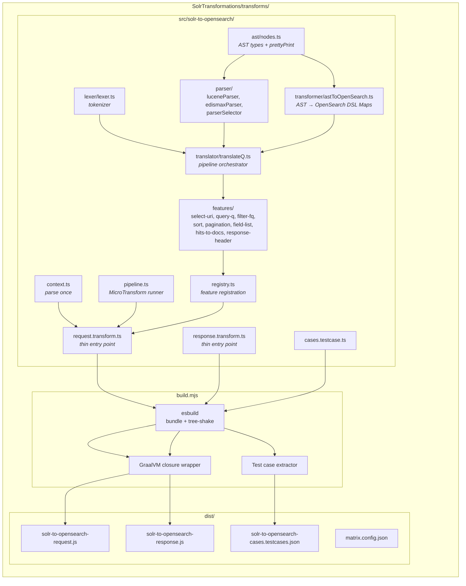
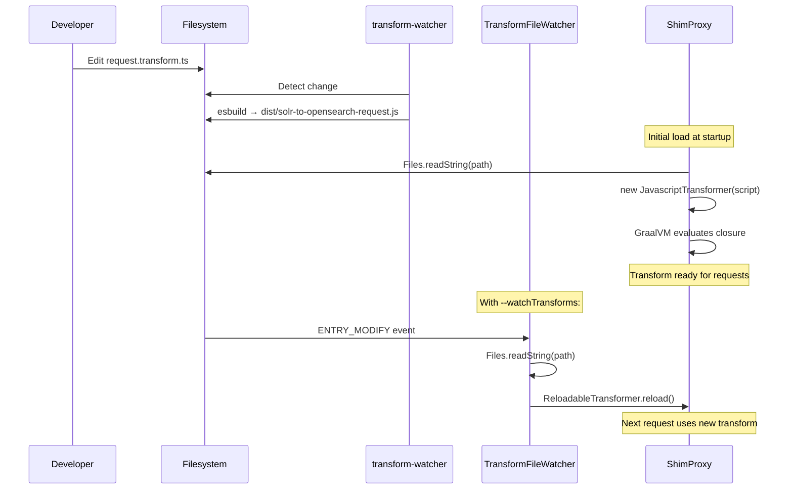
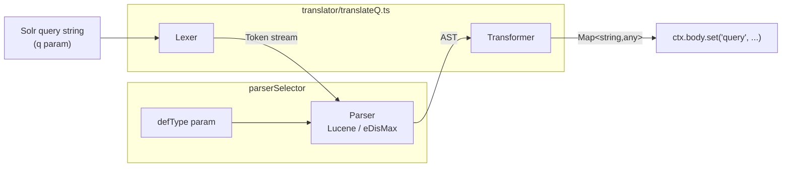
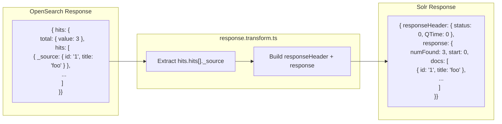
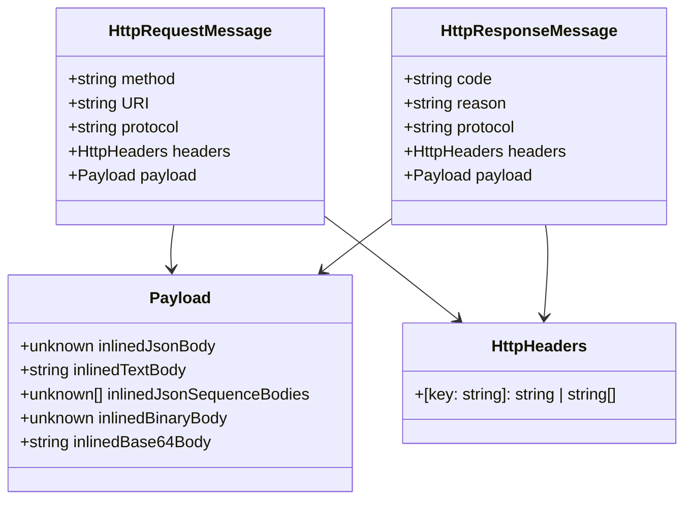
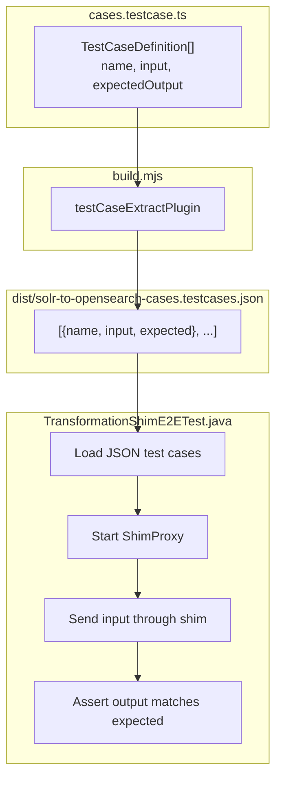

# Solr Transformations — Design

TypeScript-based request/response transforms that convert between Solr and OpenSearch HTTP protocols, executed at runtime via GraalVM.

## Table of Contents

- [Overview](#overview)
- [Build System](#build-system)
- [Transform Lifecycle](#transform-lifecycle)
- [Request Transform](#request-transform)
- [Response Transform](#response-transform)
- [Type System](#type-system)
- [Testing](#testing)

---

## Overview


```mermaid
graph LR
    subgraph SolrTransformations["SolrTransformations/transforms/"]
        subgraph Source["src/solr-to-opensearch/"]
            Context["context.ts<br/><i>parse once</i>"]
            Pipeline["pipeline.ts<br/><i>MicroTransform runner</i>"]
            Registry["registry.ts<br/><i>feature registration</i>"]
            Features["features/<br/>select-uri, query-q, filter-fq,<br/>sort, pagination, field-list,<br/>hits-to-docs, response-header"]
            Lexer["lexer/lexer.ts<br/><i>tokenizer</i>"]
            AST["ast/nodes.ts<br/><i>AST types + prettyPrint</i>"]
            Parsers["parser/<br/>luceneParser, edismaxParser,<br/>parserSelector"]
            Transformer["transformer/astToOpenSearch.ts<br/><i>AST → OpenSearch DSL Maps</i>"]
            Translator["translator/translateQ.ts<br/><i>pipeline orchestrator</i>"]
            ReqTS["request.transform.ts<br/><i>thin entry point</i>"]
            RespTS["response.transform.ts<br/><i>thin entry point</i>"]
            Cases["cases.testcase.ts"]
        end

        subgraph BuildTool["build.mjs"]
            ESBuild["esbuild<br/>bundle + tree-shake"]
            GraalWrap["GraalVM closure wrapper"]
            TestExtract["Test case extractor"]
        end

        subgraph Dist["dist/"]
            ReqJS["solr-to-opensearch-request.js"]
            RespJS["solr-to-opensearch-response.js"]
            TestJSON["solr-to-opensearch-cases.testcases.json"]
            ConfigJSON["matrix.config.json"]
        end
    end

    Features --> Registry
    Lexer --> Translator
    AST --> Parsers
    AST --> Transformer
    Parsers --> Translator
    Transformer --> Translator
    Translator --> Features
    Context --> ReqTS
    Pipeline --> ReqTS
    Registry --> ReqTS
    ReqTS --> ESBuild --> GraalWrap --> ReqJS
    RespTS --> ESBuild --> GraalWrap --> RespJS
    Cases --> ESBuild --> TestExtract --> TestJSON
```

---

## Build System

The build script (`build.mjs`) processes three types of source files:

| Suffix | Plugin | Output | Purpose |
|--------|--------|--------|---------|
| `*.transform.ts` | `graalvmWrapPlugin` | `*.js` | Runtime transforms |
| `*.testcase.ts` | `testCaseExtractPlugin` | `*.testcases.json` | E2E test data |
| `*.config.ts` | `configExtractPlugin` | `*.config.json` | Test matrix config |

### GraalVM Closure Format

The Java-side `JavascriptTransformer` expects a self-invoking function that returns a transform function:

```javascript
// Output format — what GraalVM loads
(function(bindings) {
  // ... bundled TypeScript code ...
  function transform(msg) { ... }
  return transform;
})
```

The `graalvmWrapPlugin` strips ESM exports and wraps the bundled code in this closure.

### Watch Mode

```bash
npm run watch    # Rebuilds on file changes
npm run build    # One-shot build
```

In Docker, the `transform-watcher` service runs `npm run watch` and writes to a shared volume that the shim containers mount read-only.

---

## Transform Lifecycle


```mermaid
sequenceDiagram
    participant Dev as Developer
    participant FS as Filesystem
    participant Watcher as transform-watcher
    participant FW as TransformFileWatcher
    participant Shim as ShimProxy

    Dev->>FS: Edit request.transform.ts
    Watcher->>FS: Detect change
    Watcher->>FS: esbuild → dist/solr-to-opensearch-request.js
    Note over Shim: Initial load at startup
    Shim->>FS: Files.readString(path)
    Shim->>Shim: new JavascriptTransformer(script)
    Shim->>Shim: GraalVM evaluates closure
    Note over Shim: Transform ready for requests
    Note over FW: With --watchTransforms:
    FS->>FW: ENTRY_MODIFY event
    FW->>FW: Files.readString(path)
    FW->>Shim: ReloadableTransformer.reload()
    Note over Shim: Next request uses new transform
```

---

## Request Transform

Converts Solr select queries into OpenSearch `_search` requests using a structured Lexer → Parser → AST → Transformer pipeline.


```mermaid
graph LR
    subgraph Input["Solr Request"]
        A["GET /solr/mycore/select?q=title:java AND price:[10 TO 100]"]
    end

    subgraph Transform["request.transform.ts"]
        B["Endpoint detection + wt guard"]
        C["select-uri: Rewrite URI → /{collection}/_search"]
        D["query-q: Lex → Parse → AST → Transform"]
        E["filter-fq: fq params → bool.filter"]
        F["sort: sort param → sort array"]
        G["pagination: start/rows → from/size"]
        H["field-list: fl → _source"]
    end

    subgraph Output["OpenSearch Request"]
        I["POST /mycore/_search<br/>{query:{bool:{must:[...]}}, sort:[...], from:0, size:10}"]
    end

    A --> B --> C --> D --> E --> F --> G --> H --> I
```

### Query Translation Pipeline

The `query-q` micro-transform delegates to a structured pipeline that replaces the previous regex-based approach:


```mermaid
flowchart LR
    A["Solr query string<br/>(q param)"] --> B[Lexer]
    B -->|Token stream| C[Parser<br/>Lucene / eDisMax]
    C -->|AST| D[Transformer]
    D -->|"Map&lt;string,any&gt;"| E["ctx.body.set('query', ...)"]

    subgraph "parserSelector"
        F["defType param"] --> C
    end

    subgraph "translator/translateQ.ts"
        B
        C
        D
    end
```

The pipeline supports:
- Lucene query syntax (default): field queries, boolean operators (AND/OR/NOT), phrases, ranges, grouping, boost, match-all
- eDisMax query syntax: multi-field distribution via `qf`, phrase boosting via `pf`
- Graceful fallback: any error at any stage falls back to `query_string` passthrough

### AST Node Types

The parser produces a typed AST with discriminated unions:

| Node Type | Solr Syntax | OpenSearch DSL |
|-----------|-------------|----------------|
| `FieldNode` | `title:java` | `{"term": {"title": "java"}}` |
| `PhraseNode` | `"hello world"` | `{"match_phrase": {"field": "hello world"}}` |
| `BoolNode` | `A AND B`, `A OR B`, `NOT A` | `{"bool": {"must": [...], "should": [...], "must_not": [...]}}` |
| `RangeNode` | `price:[10 TO 100]` | `{"range": {"price": {"gte": "10", "lte": "100"}}}` |
| `BoostNode` | `title:java^2` | `{"term": {"title": "java", "boost": 2}}` |
| `MatchAllNode` | `*:*` | `{"match_all": {}}` |
| `GroupNode` | `(A OR B)` | Transparent — recurses into child |

### Additional Micro-Transforms

Beyond query translation, the pipeline includes:

| Transform | Solr Parameter | OpenSearch Output |
|-----------|---------------|-------------------|
| `filter-fq` | `fq=status:active` | `bool.filter` clauses (no scoring) |
| `sort` | `sort=price asc` | `sort` array (`score` → `_score`) |
| `pagination` | `start=10&rows=20` | `from: 10, size: 20` |
| `field-list` | `fl=id,title` | `_source: ["id", "title"]` |

### wt Parameter Guard

If the `wt` parameter is set to a non-JSON value (e.g., `xml`, `csv`), the request transform skips all transformations and passes the request through unchanged, since only JSON response format is supported.

### Logic

Java Maps are passed directly to GraalVM JS via `allowMapAccess(true)`. Transforms use `.get()`/`.set()` for zero-serialization interop. All output uses `new Map()` for GraalVM JavaMap compatibility.

---

## Response Transform

Converts OpenSearch `hits` format back to Solr `response` format.


```mermaid
graph LR
    subgraph Input["OpenSearch Response"]
        A["{ hits: {<br/>  total: { value: 3 },<br/>  hits: [<br/>    { _source: { id: '1', title: 'foo' } },<br/>    ...<br/>  ]<br/>}}"]
    end

    subgraph Transform["response.transform.ts"]
        B["Extract hits.hits[]._source"]
        C["Build responseHeader + response"]
    end

    subgraph Output["Solr Response"]
        E["{ responseHeader: { status: 0, QTime: 0 },<br/>  response: {<br/>    numFound: 3, start: 0,<br/>    docs: [<br/>      { id: '1', title: 'foo' },<br/>      ...<br/>    ]<br/>}}"]
    end

    A --> B --> C --> E
```

---

## Type System

The TypeScript types mirror the Java-side `JsonKeysForHttpMessage` schema:


```mermaid
classDiagram
    class HttpRequestMessage {
        +string method
        +string URI
        +string protocol
        +HttpHeaders headers
        +Payload payload
    }

    class HttpResponseMessage {
        +string code
        +string reason
        +string protocol
        +HttpHeaders headers
        +Payload payload
    }

    class Payload {
        +unknown inlinedJsonBody
        +string inlinedTextBody
        +unknown[] inlinedJsonSequenceBodies
        +unknown inlinedBinaryBody
        +string inlinedBase64Body
    }

    class HttpHeaders {
        +[key: string]: string | string[]
    }

    HttpRequestMessage --> Payload
    HttpRequestMessage --> HttpHeaders
    HttpResponseMessage --> Payload
    HttpResponseMessage --> HttpHeaders
```

The types also define the tuple schema (`SourceTargetTuple`) used by the replayer's tuple transforms, though the shim currently only uses the v2 request/response schema.

---

## Testing

### Unit & Property-Based Tests

The transform modules are tested with Vitest and fast-check for property-based testing. Tests live in `src/solr-to-opensearch/__tests__/`:

| Test File | Tests | What It Covers |
|-----------|-------|----------------|
| `lexer.test.ts` | 16 | Tokenization, whitespace handling, phrases, errors |
| `luceneParser.test.ts` | 29 | Boolean operators, default field, ranges, boost, precedence |
| `edismaxParser.test.ts` | 24 | qf field distribution, explicit field preservation, Lucene compatibility |
| `transformer.test.ts` | 20 | DSL generation, bool recursion/unwrapping, Map-only output |
| `translateQ.test.ts` | 17 | Pipeline orchestration, fallback on error, deterministic output |
| `queryQ.test.ts` | 8 | Micro-transform integration, body.query is always a Map |
| `filterFq.test.ts` | 7 | Filter clauses, no scoring keys in filters |
| `sort.test.ts` | 6 | Sort parsing, score → _score mapping |
| `pagination.test.ts` | 7 | start/rows → from/size |
| `wtGuard.test.ts` | 8 | Non-JSON wt passthrough |
| `roundtrip.test.ts` | 1 | Parse → prettyPrint → parse round-trip (100 iterations) |

Run with:
```bash
cd transforms && npx vitest --run
```

25 correctness properties are validated via fast-check with 100 iterations each, covering lexer invariants, parser operator mapping, transformer output structure, translator determinism, and round-trip consistency.

### E2E Test Architecture


```mermaid
graph TB
    subgraph TestCases["cases.testcase.ts"]
        TC["TestCaseDefinition[]<br/>name, input, expectedOutput"]
    end

    subgraph Build["build.mjs"]
        Extract["testCaseExtractPlugin"]
    end

    subgraph JSON["dist/solr-to-opensearch-cases.testcases.json"]
        Data["[{name, input, expected}, ...]"]
    end

    subgraph Java["TransformationShimE2ETest.java"]
        Load["Load JSON test cases"]
        Shim["Start ShimProxy"]
        Send["Send input through shim"]
        Assert["Assert output matches expected"]
    end

    TC --> Extract --> Data --> Load --> Shim --> Send --> Assert
```

Test cases are defined in TypeScript alongside the transforms, extracted to JSON at build time, and consumed by the Java E2E test suite. This keeps test data co-located with the transform logic while allowing the Java test harness to drive the actual HTTP round-trip through the full Netty pipeline.

### Matrix Testing

The `matrix.config.ts` file defines test matrix parameters (Solr versions, OpenSearch versions, etc.) that are extracted to JSON and consumed by the test framework for parameterized testing.
