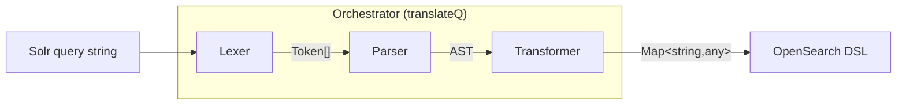
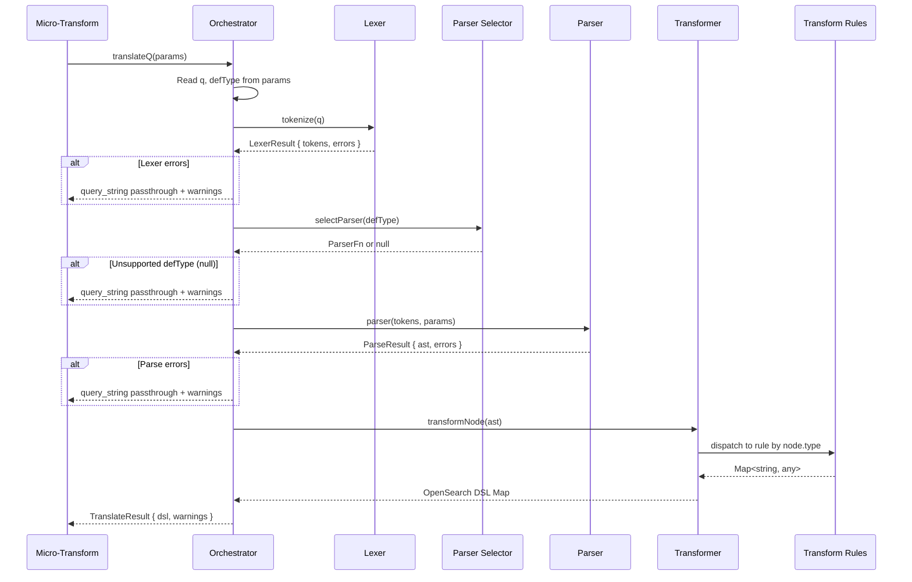
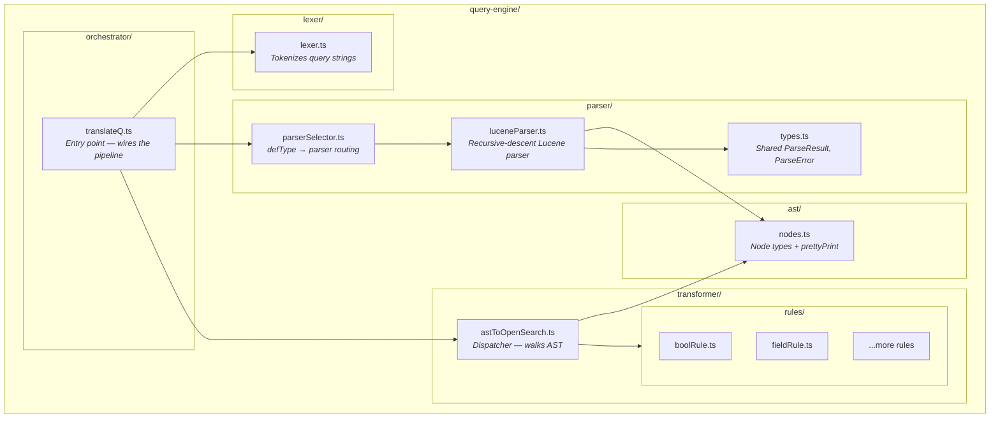
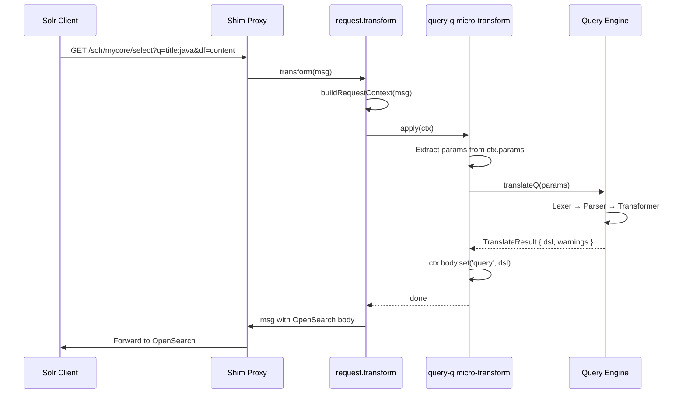
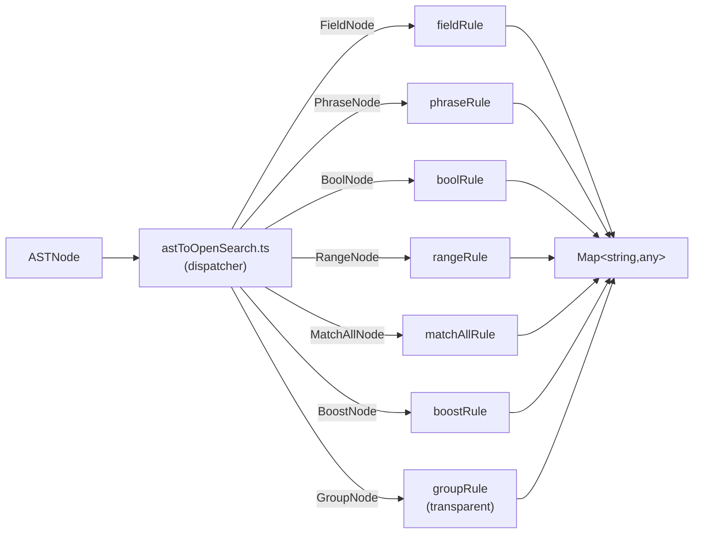
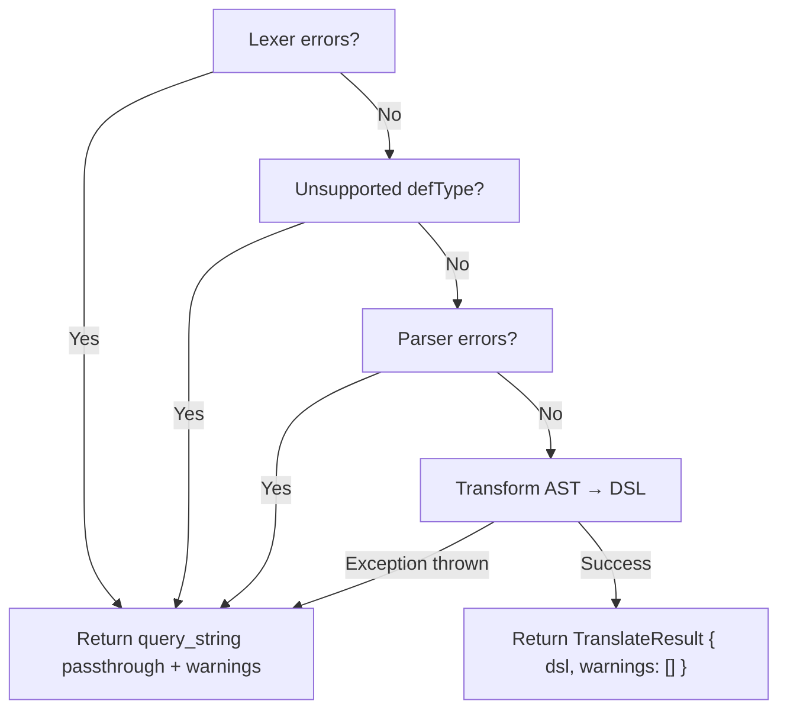

# Query Engine — Architecture

Translates Solr query strings into OpenSearch Query DSL. This is a self-contained module used by the micro-transform layer — it has no knowledge of HTTP, GraalVM, or the shim proxy.

## Table of Contents

- [Overview](#overview)
- [Pipeline Flow](#pipeline-flow)
- [Component Architecture](#component-architecture)
- [Request Flow](#request-flow)
- [Data Flow Example](#data-flow-example)
- [AST Node Types](#ast-node-types)
- [Transformer Rules](#transformer-rules)
- [Error Handling](#error-handling)
- [Extending the Engine](#extending-the-engine)

---

## Overview

The query engine converts Solr query syntax into OpenSearch Query DSL through a four-stage pipeline:




The **Orchestrator** (`orchestrator/translateQ.ts`) wires these stages together, handles errors at each stage, and falls back to a safe passthrough when anything fails.

---

## Pipeline Flow




---

## Component Architecture



### Directory Structure

```
query-engine/
  README.md                  ← This file
  orchestrator/
    translateQ.ts             ← Entry point. Wires lexer → parser → transformer.
  lexer/
    lexer.ts                  ← Tokenizes raw Solr query strings into Token[].
  parser/
    types.ts                  ← Shared types: ParseResult, ParseError.
    parserSelector.ts         ← Maps defType → parser function.
    luceneParser.ts           ← Recursive-descent parser for Solr Lucene syntax.
  ast/
    nodes.ts                  ← AST node type definitions and prettyPrint.
  transformer/
    astToOpenSearch.ts        ← Dispatches AST nodes to transformation rules.
    rules/
      boolRule.ts             ← BoolNode → OpenSearch bool query.
      (more rules added per node type)
```


---

## Request Flow

How a Solr query flows from the HTTP request through the query engine:



---

## Data Flow Example

Tracing `title:java AND price:[10 TO 100]` through each stage:

### Stage 1: Lexer

Input: `"title:java AND price:[10 TO 100]"`

Output:
```
Token[]  =  [
  FIELD("title", pos:0)
  COLON(":", pos:5)
  VALUE("java", pos:6)
  AND("AND", pos:11)
  FIELD("price", pos:15)
  COLON(":", pos:20)
  INCLUSIVE_RANGE_START("[", pos:21)
  VALUE("10", pos:22)
  TO("TO", pos:25)
  VALUE("100", pos:28)
  INCLUSIVE_RANGE_END("]", pos:31)
  EOF("", pos:32)
]
```

### Stage 2: Parser

Input: Token[] + params (df="content")

The recursive-descent parser walks the tokens following the grammar:
```
parseQuery → parseOrExpr → parseAndExpr
  left  = FieldNode { field: "title", value: "java" }
  AND
  right = RangeNode { field: "price", lower: "10", upper: "100",
                      lowerInclusive: true, upperInclusive: true }
```

Output:
```
BoolNode {
  and: [
    FieldNode { field: "title", value: "java" },
    RangeNode { field: "price", lower: "10", upper: "100",
                lowerInclusive: true, upperInclusive: true }
  ],
  or: [],
  not: []
}
```


### Stage 3: Transformer

Input: AST (BoolNode)

The dispatcher walks the tree, delegating to rules:
```
transformNode(BoolNode)
  → transformBool(node, transformNode)
    → transformNode(FieldNode)  → Map{"term" → Map{"title" → "java"}}
    → transformNode(RangeNode)  → Map{"range" → Map{"price" → Map{"gte":"10","lte":"100"}}}
    → assemble bool wrapper
```

Output:
```
Map { "bool" → Map {
  "must" → [
    Map { "term" → Map { "title" → "java" } },
    Map { "range" → Map { "price" → Map { "gte" → "10", "lte" → "100" } } }
  ]
}}
```

---

## AST Node Types

Each node represents a Solr query construct:

| Node | Solr Syntax | Example |
|------|-------------|---------|
| `FieldNode` | `field:value` | `title:java` |
| `PhraseNode` | `"text"` or `field:"text"` | `title:"hello world"` |
| `BoolNode` | `AND`, `OR`, `NOT` | `a AND b OR c NOT d` |
| `RangeNode` | `[low TO high]`, `{low TO high}` | `price:[10 TO 100]` |
| `MatchAllNode` | `*:*` | `*:*` |
| `GroupNode` | `(expr)` | `(a OR b)` |
| `BoostNode` | `expr^N` | `title:java^2` |

See `ast/nodes.ts` for full type definitions with examples.

---

## Transformer Rules

The transformer dispatches each AST node type to a dedicated rule:



Each rule is a pure function: AST node in, Map out. Rules that contain children (BoolNode, GroupNode, BoostNode) receive a `transformChild` callback from the dispatcher to handle recursion without circular imports.

| Rule | Input | Output |
|------|-------|--------|
| `fieldRule` | `FieldNode(title, java)` | `Map{"term" → Map{"title" → "java"}}` |
| `phraseRule` | `PhraseNode(hello world, title)` | `Map{"match_phrase" → Map{"title" → "hello world"}}` |
| `boolRule` | `BoolNode(and:[...], or:[...], not:[...])` | `Map{"bool" → Map{"must"→[...], "should"→[...], "must_not"→[...]}}` |
| `rangeRule` | `RangeNode(price, 10, 100, true, true)` | `Map{"range" → Map{"price" → Map{"gte"→"10", "lte"→"100"}}}` |
| `matchAllRule` | `MatchAllNode` | `Map{"match_all" → Map{}}` |
| `boostRule` | `BoostNode(child, 2)` | Inner Map with `"boost" → 2` added |
| `groupRule` | `GroupNode(child)` | Recurse into child (transparent) |


---

## Error Handling

Errors are values, not exceptions. Each stage returns errors in its result object.



### Passthrough Fallback

When any stage fails, the orchestrator wraps the raw query in a `query_string` passthrough:

```
Map { "query_string" → Map { "query" → "the original solr query" } }
```

This lets OpenSearch attempt to parse the raw query itself — a safe degradation. The query doesn't crash; it just isn't a structured translation.

### Translation Modes

| Mode | Behavior |
|------|----------|
| `best-effort` (default) | Translate all supported parts, attach warnings for unsupported parts |
| `strict` | First unsupported construct stops the pipeline, falls back to passthrough |

### Warning Structure

Each warning contains:
- `construct` — machine-readable identifier (e.g., `"defType:dismax"`, `"lexer_error"`)
- `position` — 0-based index in the query where the issue was detected
- `message` — human-readable description

---

## Extending the Engine

### Adding a New AST Node Type

1. Add the interface to `ast/nodes.ts` and include it in the `ASTNode` union
2. Update the lexer if new token types are needed (`lexer/lexer.ts`)
3. Add parsing logic in the appropriate parser (`parser/luceneParser.ts`)
4. Create a new rule file in `transformer/rules/`
5. Register the rule in `transformer/astToOpenSearch.ts`

### Adding a New Parser Type

1. Create a new parser file in `parser/` (e.g., `dismaxParser.ts`)
2. The parser must match the `ParserFn` signature: `(tokens, params) → ParseResult`
3. Register it in `parserSelector.ts`

### Adding a New Transformation Rule

1. Create a new file in `transformer/rules/` (e.g., `functionQueryRule.ts`)
2. Export a function that takes the AST node and returns a `Map<string, any>`
3. If the node has children, accept a `transformChild` callback for recursion
4. Register the rule in `transformer/astToOpenSearch.ts`

---

## Constraints

- **All transformer output must use `new Map()`** — never plain JS objects. This is a GraalVM runtime requirement for JavaMap interop.
- **The query engine has no side effects** — no I/O, no logging, no config file access. It's a pure function: params in, DSL out.
- **The AST is Solr-specific** — it represents what the user wrote in Solr syntax, not how it maps to any target system. The transformer handles the Solr → OpenSearch mapping.
