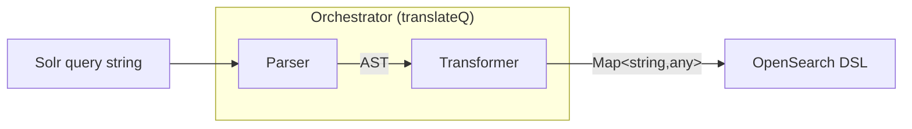
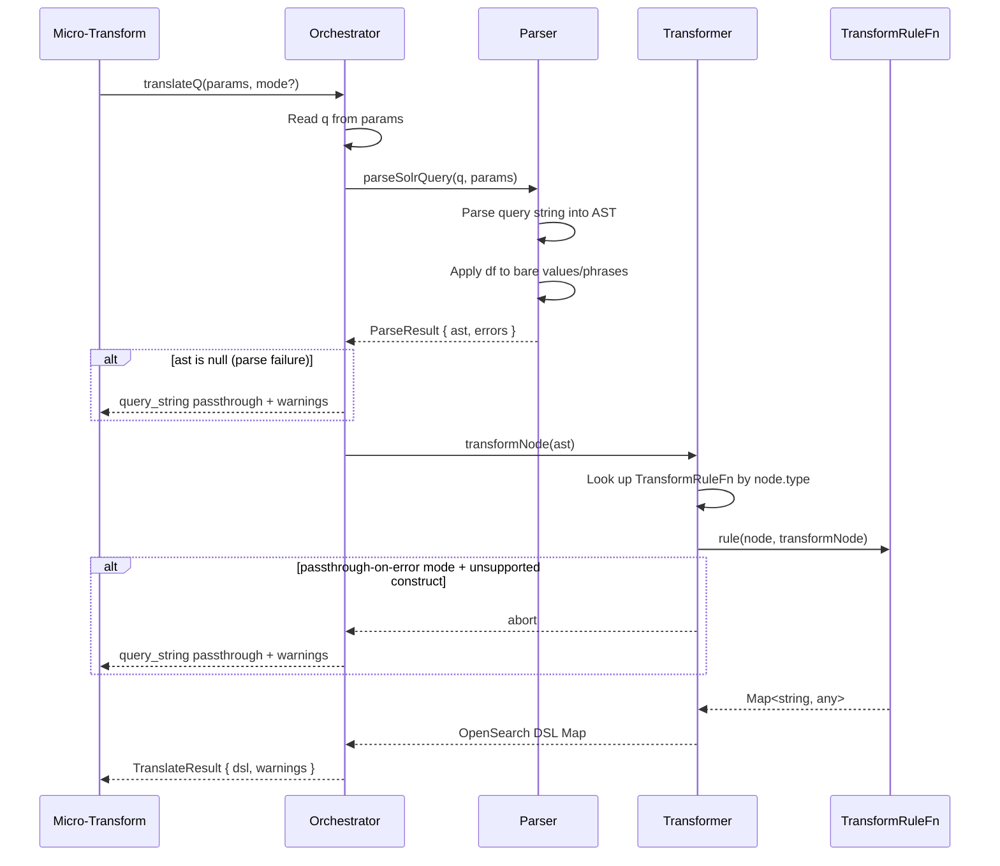
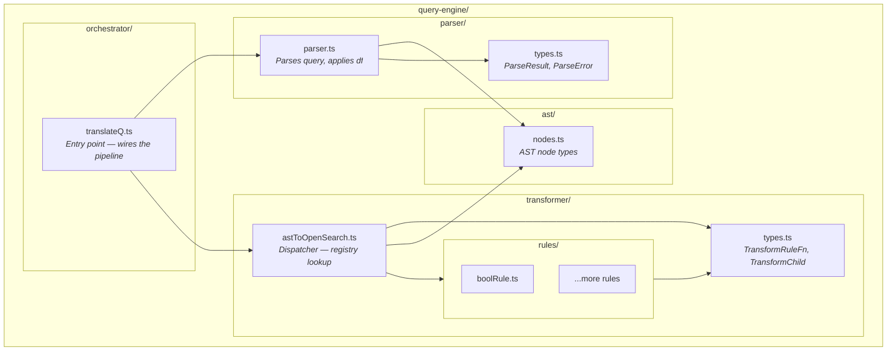
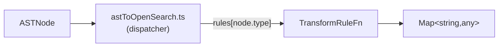
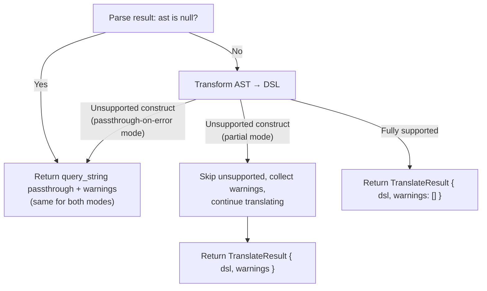

# Query Engine — Architecture

Translates Solr query strings into OpenSearch Query DSL. This is a self-contained module used by the micro-transform layer — it has no knowledge of HTTP, GraalVM, or the shim proxy.

## Table of Contents

- [Overview](#overview)
- [Pipeline Flow](#pipeline-flow)
- [Component Architecture](#component-architecture)
- [Data Flow Example](#data-flow-example)
- [AST Node Types](#ast-node-types)
- [Transformer Rules](#transformer-rules)
- [Error Handling](#error-handling)
- [Extending the Engine](#extending-the-engine)


## Overview

The query engine converts Solr query syntax into OpenSearch Query DSL through a two-stage pipeline:



The **Parser** (`parser/parser.ts`) parses a Solr query string into an AST. It also applies the default field (`df`) from the params map to bare values and unfielded phrases — the caller is responsible for providing `df` in the params map (e.g., from `solrconfig.xml` defaults), and the parser applies it where needed so every AST node has a resolved field.

The **Transformer** converts AST nodes into OpenSearch DSL Maps using a registry of `TransformRuleFn` functions — one per AST node type.

The **Orchestrator** (`orchestrator/translateQ.ts`) wires these stages together and handles errors.


## Pipeline Flow




## Component Architecture



### Directory Structure

```
query-engine/
  README.md                  ← This file
  orchestrator/
    translateQ.ts             ← Entry point. Wires parser → transformer.
  parser/
    parser.ts                 ← Parses query string, applies df to bare values.
    types.ts                  ← Shared types: ParseResult, ParseError.
  ast/
    nodes.ts                  ← AST node type definitions.
  transformer/
    astToOpenSearch.ts        ← Dispatcher: looks up TransformRuleFn by node.type.
    types.ts                  ← Shared types: TransformRuleFn, TransformChild.
    rules/
      boolRule.ts             ← BoolNode → OpenSearch bool query.
      (more rules added per node type)
```


## Data Flow Example

Tracing `title:java AND price:[10 TO 100]` through each stage:

### Stage 1: Parser

Input: `"title:java AND price:[10 TO 100]"`

Output:
```
BoolNode {
  and: [
    FieldNode { field: "title", value: "java" },
    RangeNode { field: "price", lower: "10", upper: "100",
                lowerInclusive: true, upperInclusive: true }
  ],
  or: [],
  not: []
}
```

### Default field resolution

When the query contains bare values (no `field:` prefix), the parser applies `df` from the params map:

Input: `"java"` with params `df=title`

Output:
```
FieldNode { field: "title", value: "java" }
```

The caller provides `df` in the params map. The parser applies it to produce a complete AST where every node has a resolved field.

### Stage 2: Transformer

Input: AST root node (BoolNode in this example)

The dispatcher looks up the `TransformRuleFn` for each node type and calls it:
```
transformNode(BoolNode)
  → rules["bool"](BoolNode, transformNode)
    → transformNode(FieldNode) → rules["field"](...) → Map{"term" → ...}
    → transformNode(RangeNode) → rules["range"](...) → Map{"range" → ...}
    → assemble bool wrapper
```

Output:
```
Map { "bool" → Map {
  "must" → [
    Map { "term" → Map { "title" → "java" } },
    Map { "range" → Map { "price" → Map { "gte" → "10", "lte" → "100" } } }
  ]
}}
```


## AST Node Types

Each node represents a Solr query construct. See `ast/nodes.ts` for full definitions.

| Node | Solr Syntax | Example |
|------|-------------|---------|
| `FieldNode` | `field:value` | `title:java` |
| `PhraseNode` | `"text"` or `field:"text"` | `title:"hello world"` |
| `BoolNode` | `AND`, `OR`, `NOT` | `a AND b OR c NOT d` |
| `RangeNode` | `[low TO high]`, `{low TO high}` | `price:[10 TO 100]` |
| `MatchAllNode` | `*:*` | `*:*` |
| `GroupNode` | `(expr)` | `(a OR b)` |
| `BoostNode` | `expr^N` | `title:java^2` |


## Transformer Rules

Each AST node type has a corresponding `TransformRuleFn` registered in the dispatcher. The dispatcher looks up the function by `node.type` and calls it with the node and a `transformChild` callback for recursion.



Leaf rules (FieldNode, PhraseNode, RangeNode, MatchAllNode) ignore the `transformChild` callback. Composite rules (BoolNode, GroupNode, BoostNode) use it to recurse into children.


## Error Handling



### Passthrough Fallback

When parsing fails or passthrough-on-error mode encounters an unsupported construct, the orchestrator wraps the raw query in a `query_string` passthrough:
```
Map { "query_string" → Map { "query" → "the original solr query" } }
```

### Translation Modes

| Mode | Parse failure | Unsupported construct during transform |
|------|--------------|---------------------------------------|
| `passthrough-on-error` (default) | Passthrough + warnings | Abort immediately, passthrough + warnings |
| `partial` | Passthrough + warnings | Translate supported parts, skip unsupported, collect warnings |


## Extending the Engine

### Adding a New AST Node Type

1. Add the interface to `ast/nodes.ts` and include it in the `ASTNode` union
2. Add parsing support in `parser/parser.ts`
3. Create a `TransformRuleFn` in `transformer/rules/`
4. Register the function in the dispatcher's rules registry in `transformer/astToOpenSearch.ts`

### Adding Support for a New Solr Feature

1. Extend the parser to handle the new syntax
2. Add corresponding AST node types if needed
3. Add `TransformRuleFn` implementations for the new nodes


## Constraints

- **All transformer output must use `new Map()`** — never plain JS objects. GraalVM runtime requirement.
- **The query engine has no side effects** — no I/O, no logging, no config file access. Pure function: params in, DSL out.
- **The AST is Solr-specific** — represents what the user wrote, not how it maps to any target system.
- **The parser handles all Solr parser types** — Lucene, eDisMax, DisMax share the same core syntax. Parser-specific behavior (e.g., eDisMax qf distribution) is a post-parse AST transformation.
- **The caller provides configuration** — `df`, `qf`, `pf` etc. come from the params map. The query engine does not read config files.


## Output Format Requirements

All transformer rules MUST return `Map<string, any>` objects (not plain JS objects). This is a GraalVM requirement for Java interop.

### Boost Compatibility

When creating rules that may be boosted (wrapped in BoostNode), the output MUST follow one of these two patterns:

#### 1. Field-Level Pattern

For queries that target a specific field (match, match_phrase, range, term, etc.):

```typescript
// Structure: {"queryType": {"fieldName": {"param": "value"}}}
return new Map([
  ['match', new Map([
    ['title', new Map([['query', 'java']])]  // ← Field params in nested Map
  ])]
]);
```

**WRONG** (boost will be applied at wrong level):
```typescript
return new Map([
  ['match', new Map([['title', 'java']])]  // ← String value, not Map!
]);
```

#### 2. Query-Level Pattern

For queries without a specific field (query_string, bool, match_all, exists):

```typescript
// Structure: {"queryType": {"param": "value"}}
return new Map([
  ['query_string', new Map([['query', 'java']])]
]);
```

### How boostRule Detects the Pattern

The `boostRule` checks if the first value in the query body is a `Map`:
- If `Map` → field-level pattern, boost added inside field params
- If primitive (string/number/array) → query-level pattern, boost added at query body level
