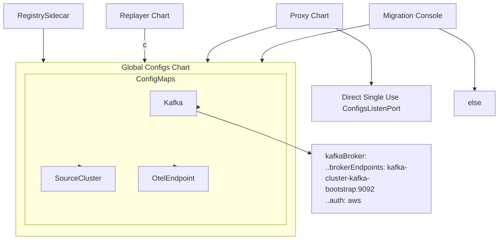

.......................................................................................................................................................................................................................,,ffdf