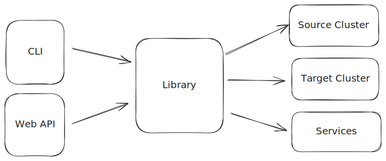

# Console_link Library
- [Services.yaml spec](#servicesyaml-spec)
    - [Cluster](#cluster)
    - [Metrics Source](#metrics-source)
    - [Backfill](#backfill)
        - [Reindex From Snapshot](#reindex-from-snapshot)
        - [OpenSearch Ingestion](#opensearch-ingestion)
- [Usage](#usage)
    - [Library](#library)
    - [CLI](#cli)
        - [Global Options](#global-options)
        - [Objects](#objects)
        - [Commands \& options](#commands--options)
- [Development](#development)
    - [Unit Tests](#unit-tests)
    - [Coverage](#coverage)


The console link library is designed to provide a unified interface for the many possible backend services involved in a migration. The interface can be used by multiple frontends--a CLI app and a web API, for instance.



The user defines their migration services in a `migration_services.yaml` file, by default found at `/etc/migration_services.yaml`.

Currently, the supported services are:

- `source_cluster`: Source cluster details
- `target_cluster`: Target cluster details
- `metrics_source`: Metrics source details
- `backfill`: Backfill migration details

For example:

```yaml
source_cluster:
    endpoint: "https://capture-proxy-es:9200"
    allow_insecure: true
    no_auth:
target_cluster:
    endpoint: "https://opensearchtarget:9200"
    allow_insecure: true
    basic_auth:
        username: "admin"
        password: "myStrongPassword123!"
metrics_source:
    prometheus:
        endpoint: "http://prometheus:9090"
backfill:
    opensearch_ingestion:
        pipeline_role_arn: "arn:aws:iam::123456789012:role/OSMigrations-aws-integ-us--pipelineRole"
        vpc_subnet_ids:
            - "subnet-123456789"
        security_group_ids:
            - "sg-123456789"
        aws_region: "us-west-2"
        pipeline_name: "test-cli-pipeline"
        index_regex_selection:
            - "test-index*"
        log_group_name: "/aws/vendedlogs/osi-aws-integ-default"
        tags:
            - "migration_deployment=1.0.6"
```


## Services.yaml spec

### Cluster

Source and target clusters have the following options:

- `endpoint`: required, the endpoint to reach the cluster.

Exactly one of the following blocks must be present:

- `no_auth`: may be empty, no authorization to use.
- `basic_auth`:
    - `username`
    - `password`
- `sigv4`: may be empty, not yet implemented

Having a `source_cluster` and `target_cluster` is required.

### Metrics Source

Currently, the two supported metrics source types are `prometheus` and `cloudwatch`.
Exactly one of the following blocks must be present:

- `prometheus`:
    - `endpoint`: required

- `cloudwatch`: may be empty if region is not specified
    - `aws_region`:  optional. if not provided, the usual rules are followed for determining aws region. (`AWS_DEFAULT_REGION`, `~/.aws/config`, etc.)

### Backfill

Backfill can be performed via several mechansims. The primary two supported by the console library are Reindex From Snapshot (RFS) and
OpenSearch Ingestion Pipeline (OSI).

#### Reindex From Snapshot

Depending on the purpose/deployment strategy, RFS can be used in Docker or on AWS in an Elastic Container Service (ECS) deployment.
Most of the parameters for these two are the same, with some additional ones specific to the deployment.

- `reindex_from_snapshot`
    - `snapshot_repo`: optional, path to the snapshot repo. If not provided, ???
    - `snapshot_name`: optional, name of the snapshot to use as the source. If not provided, ???
    - `scale`: optional int, number of instances to enable when `backfill start` is run. In the future, this will be modifiable during the run
    with `backfill scale X`. Default is 1.

There is also a block that specifies the deployment type. Exactly one of the following blocks must be present:

- `docker`:
    - `socket`: optional, path to mounted docker socket, defaults to `/var/run/docker.sock`

- `ecs`:
    - `cluster_name`: required, name of the ECS cluster containing the RFS service
    - `service_name`: required, name of the ECS service for RFS
    - `aws_region`:  optional. if not provided, the usual rules are followed for determining aws region. (`AWS_DEFAULT_REGION`, `~/.aws/config`, etc.)

Both of the following are valid RFS backfill specifications:

```yaml
backfill:
    reindex_from_snapshot:
        docker:
```

```yaml
backfill:
    reindex_from_snapshot:
        snapshot_repo: "abc"
        snapshot_name: "def"
        scale: 3
        ecs:
            cluster_name: migration-aws-integ-ecs-cluster
            service_name: migration-aws-integ-reindex-from-snapshot
            aws-region: us-east-1
```

#### OpenSearch Ingestion

- `opensearch_ingestion`
    - `pipeline_role_arn`: required, IAM pipeline role containing permissions to read from source and read/write to target, more details [here](https://docs.aws.amazon.com/opensearch-service/latest/developerguide/pipeline-security-overview.html#pipeline-security-sink)
    - `vpc_subnet_ids`: required, VPC subnets to place the OSI pipeline in
    - `security_group_ids`: required, security groups to apply to OSI pipeline for accessing source and target clusters
    - `aws_region`: required, AWS region to look for pipeline role and secrets for cluster
    - `pipeline_name`: optional, name of OSI pipeline
    - `index_regex_selection`: optional, list of index inclusion regex strings for selecting indices to migrate
    - `log_group_name`: optional, name of existing CloudWatch log group to use for OSI logs
    - `tags`: optional, list of tags to apply to OSI pipeline

## Usage

### Library

The library can be imported and used within another application.
Use `pip install .` from the top-level `console_link` directory to install it locally and then import it as, e.g. `from console_link.models.metrics_source import MetricsSource`

### CLI

The CLI comes installed on the migration console. If you'd like to install it elsewhere, `pip install .` from the top-level `console_link` directory will install it and setup a `console` executable to access it.

Autocomplete can be enabled by adding `eval "$(_CONSOLE_COMPLETE=bash_source console)"` to your `.bashrc` file, or `eval "$(_FOO_BAR_COMPLETE=zsh_source foo-bar)"` to your `.zshrc` and re-sourcing your shell.

The structure of cli commands is:
`console [--global-options] OBJECT COMMAND [--options]`

#### Global Options

The available global options are:

- `--config-file FILE` to specify the path to a config file (default is `/etc/migration_services.yaml`)
- `--json` to get output in JSON designed for machine consumption instead of printing to the console

#### Objects

Currently, the two objects available are `cluster` and `metrics`.

#### Commands & options

Each object has its own commands available, and each command has its own options. To see the available commands and options, use:

```sh
console OBJECT --help
```

## Development

To install the library for development purposes, create a virtual env and install the library. It will automatically install its dependencies as well.

```shell
python3 -m venv .venv
source .venv/bin/activate
python3 -m pip install --upgrade pip
pip install -e . # or the path to the console_link directory
```

### Unit Tests

Unit tests can be run from this current `console_link/` by first installing dependencies then running pytest:

```shell
pip install -r tests/requirements.txt
python -m coverage run -m pytest
```

### Coverage

_Code coverage_ metrics can be generated after a unit-test run. A report can either be printed on the command line:

```shell
python -m coverage report
```

or generated as HTML:

```shell
python -m coverage html
```
