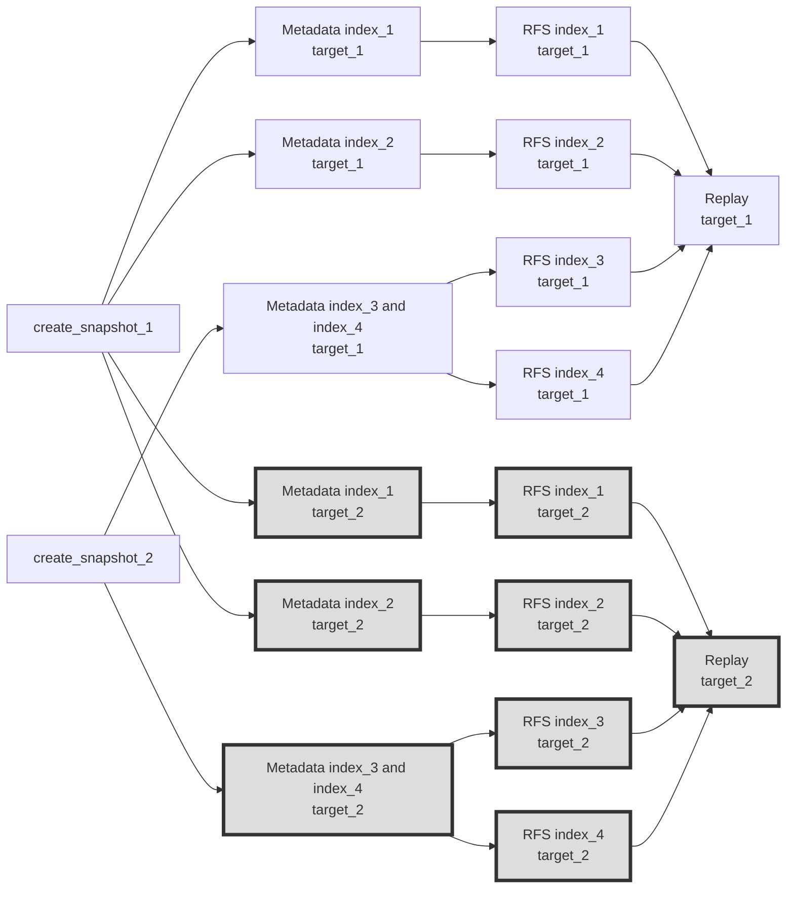

```mermaid
flowchart LR
    create_snapshot_1 --> metadata_index1_t1[Metadata index_1\ntarget_1]
    create_snapshot_1 --> metadata_index2_t1[Metadata index_2\ntarget_1]
    
    metadata_index1_t1 --> rfs_index1_t1[RFS index_1\ntarget_1]
    metadata_index2_t1 --> rfs_index2_t1[RFS index_2\ntarget_1]
    
    create_snapshot_2 --> metadata_index3_and_index4_t1[Metadata index_3 and index_4\ntarget_1]
    
    metadata_index3_and_index4_t1 --> rfs_index3_t1[RFS index_3\ntarget_1]
    metadata_index3_and_index4_t1 --> rfs_index4_t1[RFS index_4\ntarget_1]
    
    rfs_index1_t1 --> replayer_target_t1[Replay\ntarget_1]
    rfs_index2_t1 --> replayer_target_t1
    rfs_index3_t1 --> replayer_target_t1
    rfs_index4_t1 --> replayer_target_t1


    create_snapshot_1 --> metadata_index1_t2[Metadata index_1\ntarget_2]
    create_snapshot_1 --> metadata_index2_t2[Metadata index_2\ntarget_2]

    metadata_index1_t2 --> rfs_index1_t2[RFS index_1\ntarget_2]
    metadata_index2_t2 --> rfs_index2_t2[RFS index_2\ntarget_2]


    create_snapshot_2 --> metadata_index3_and_index4_t2[Metadata index_3 and index_4\ntarget_2]
    metadata_index3_and_index4_t2 --> rfs_index3_t2[RFS index_3\ntarget_2]
    metadata_index3_and_index4_t2 --> rfs_index4_t2[RFS index_4\ntarget_2]

    rfs_index1_t2 --> replayer_target_t2[Replay\ntarget_2]
    rfs_index2_t2 --> replayer_target_t2
    rfs_index3_t2 --> replayer_target_t2
    rfs_index4_t2 --> replayer_target_t2

    style metadata_index1_t2 fill:#ddd,stroke:#333,stroke-width:4px
    style metadata_index2_t2 fill:#ddd,stroke:#333,stroke-width:4px
    style metadata_index3_and_index4_t2 fill:#ddd,stroke:#333,stroke-width:4px

    style rfs_index1_t2 fill:#ddd,stroke:#333,stroke-width:4px
    style rfs_index2_t2 fill:#ddd,stroke:#333,stroke-width:4px
    style rfs_index3_t2 fill:#ddd,stroke:#333,stroke-width:4px
    style rfs_index4_t2 fill:#ddd,stroke:#333,stroke-width:4px

    style replayer_target_t2 fill:#ddd,stroke:#333,stroke-width:4px

```