# Transformation Shim — Architecture

A multi-target HTTP proxy that sits between clients and backend search engines, providing request/response transformation, parallel dispatch, and in-flight response validation.

## Table of Contents

- [System Context](#system-context)
- [Cutover & Validation Use Cases](#cutover--validation-use-cases)
- [Component Architecture](#component-architecture)
- [Request Flow](#request-flow)
- [Data Model](#data-model)
- [Validation Framework](#validation-framework)
- [Transform Pipeline](#transform-pipeline)
- [Deployment Modes](#deployment-modes)
- [CLI Reference](#cli-reference)

---

## System Context

The shim is a Netty-based reverse proxy that accepts Solr-format HTTP requests and can dispatch them to one or more named backend targets (Solr, OpenSearch, etc.) in parallel. Each target can have independent request/response transforms and authentication. The primary target's response is returned to the client, with validation results from cross-target comparison added as HTTP headers.

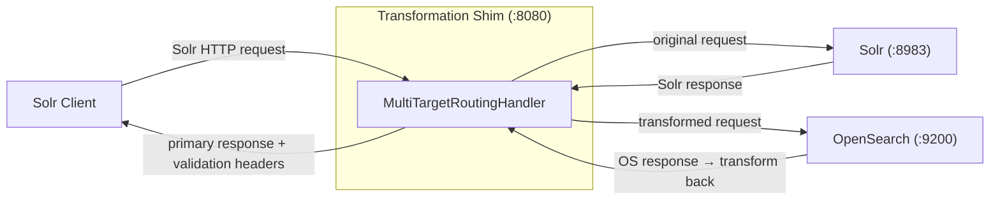

The shim supports three operational patterns, all from the same binary:

| Pattern | Targets | Transforms | Validators | Use Case |
|---------|---------|------------|------------|----------|
| Passthrough | 1 | None | None | Transparent proxy |
| Transform | 1 | Request + Response | None | Protocol translation (Solr → OpenSearch) |
| Validation | 2+ | Per-target | Cross-target | In-flight correctness verification |

---

## Cutover & Validation Use Cases

The shim supports a phased migration from Solr to OpenSearch. Each phase maps to a shim configuration — no code changes, just CLI flags.

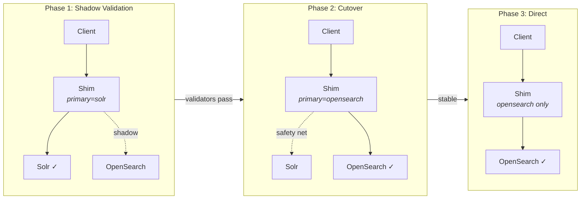

### Phase 1 — Shadow Validation (Solr Primary)

Production traffic continues to be served by Solr. The shim silently forwards every request to OpenSearch in parallel, runs validators, and reports results in response headers. The client always gets the Solr response — OpenSearch failures are invisible to end users.

**Goal:** Build confidence that OpenSearch returns equivalent results before switching.

```bash
--target solr=http://solr:8983 \
--target opensearch=https://os:9200 \
--primary solr \
--targetTransform opensearch=request:req.js,response:resp.js \
--validator field-equality:solr,opensearch:ignore=responseHeader.QTime \
--validator doc-count:solr,opensearch:assert=solr==opensearch
```

**What to monitor:**
- `X-Validation-Status` header — track PASS/FAIL ratio over time
- `X-Target-opensearch-Latency` — compare latency between backends
- `X-Target-opensearch-Error` — catch connectivity or transform issues early
- `X-Validation-Details` — identify which validators fail and on which queries

### Phase 2 — Cutover with Safety Net (OpenSearch Primary)

Flip `--primary` to `opensearch`. The client now gets OpenSearch responses, but Solr still runs in the background as a safety net. Validators continue to compare — if OpenSearch diverges, the headers flag it immediately.

**Goal:** Serve production from OpenSearch while retaining the ability to detect regressions.

```bash
--target solr=http://solr:8983 \
--target opensearch=https://os:9200 \
--primary opensearch \
--targetTransform opensearch=request:req.js,response:resp.js \
--validator field-equality:solr,opensearch:ignore=responseHeader.QTime \
--validator doc-count:solr,opensearch:assert=solr==opensearch
```

**Rollback:** Change `--primary` back to `solr` — one config change, no data migration.

### Phase 3 — Direct OpenSearch (Solr Decommissioned)

Once validation passes consistently, remove Solr from the target list. The shim becomes a simple transform proxy (or can be removed entirely if the client speaks OpenSearch natively).

```bash
--target opensearch=https://os:9200 \
--primary opensearch \
--targetTransform opensearch=request:req.js,response:resp.js
```

### Validation Strategies

Different migration scenarios call for different validator configurations:

| Scenario | Validators | What it catches |
|----------|-----------|-----------------|
| Exact parity | `field-equality` (ignore QTime) | Any response difference beyond timing |
| Document completeness | `doc-count:assert=solr==opensearch` | Missing or extra documents in OpenSearch |
| Ranking equivalence | `doc-ids:ordered` | Same docs in same order |
| Superset check | `doc-count:assert=opensearch>=solr` | OpenSearch returns at least as many results |
| Custom business logic | `js:script=custom.js` | Application-specific invariants (e.g., facet counts, highlighting) |

### Multi-Cluster Comparison

The shim isn't limited to two targets. Compare multiple OpenSearch clusters (e.g., different versions, different index configurations) against the Solr baseline simultaneously:

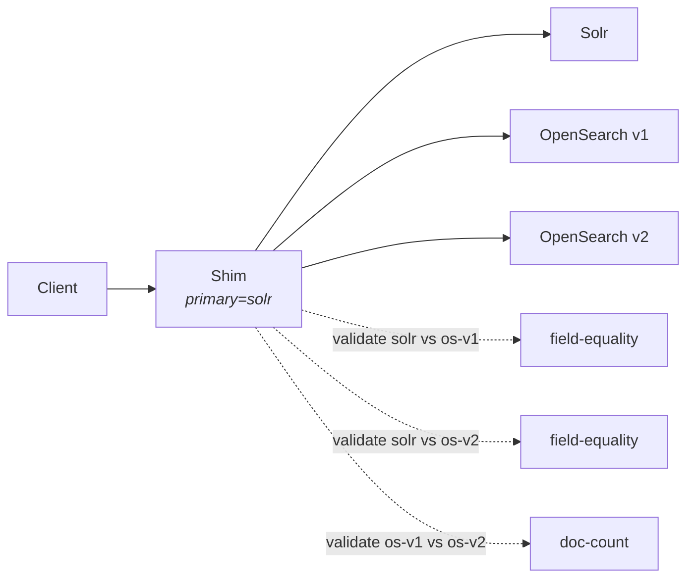

```bash
--target solr=http://solr:8983 \
--target os-v1=https://os-v1:9200 \
--target os-v2=https://os-v2:9200 \
--primary solr \
--validator field-equality:solr,os-v1 \
--validator field-equality:solr,os-v2 \
--validator doc-count:os-v1,os-v2:assert=os-v1==os-v2
```

---

## Component Architecture

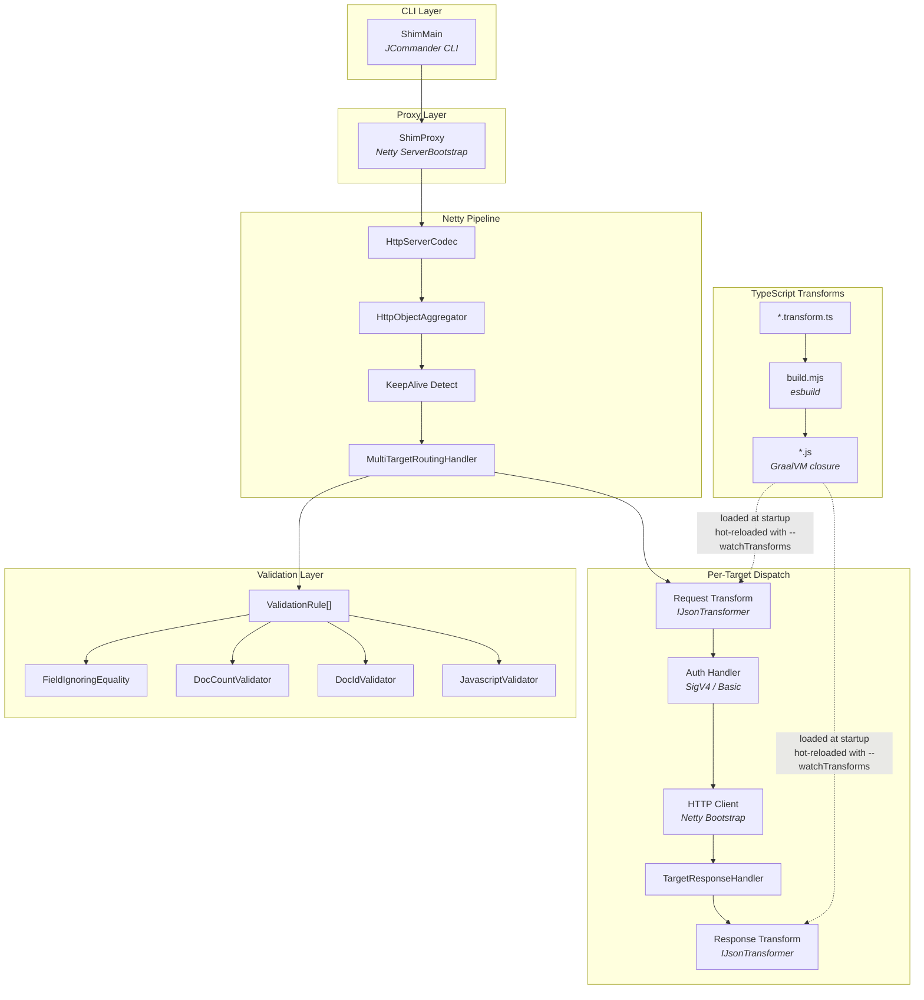

### Package Structure

```
transformationShim/
├── src/main/java/org/opensearch/migrations/transform/shim/
│   ├── ShimMain.java                    # CLI entry point
│   ├── ShimProxy.java                   # Netty server bootstrap
│   ├── ReloadableTransformer.java       # Hot-swap transformer wrapper
│   ├── TransformFileWatcher.java        # File watcher for --watchTransforms
│   ├── netty/
│   │   ├── MultiTargetRoutingHandler.java  # Core: parallel dispatch + validation
│   │   ├── HttpMessageUtil.java            # Netty ↔ Map conversion + response utilities
│   │   ├── SigV4SigningHandler.java        # AWS SigV4 auth
│   │   ├── BasicAuthSigningHandler.java    # Basic/header auth
│   │   └── ShimChannelAttributes.java      # Channel attributes
│   └── validation/
│       ├── Target.java                  # Named backend record
│       ├── TargetResponse.java          # Per-target result record
│       ├── ValidationResult.java        # Validation outcome record
│       ├── ResponseValidator.java       # Validator interface
│       ├── ValidationRule.java          # Named rule binding
│       ├── FieldIgnoringEquality.java   # Deep JSON diff
│       ├── DocCountValidator.java       # Document count comparison
│       ├── DocIdValidator.java          # Document ID comparison
│       └── JavascriptValidator.java     # Custom JS validator (GraalVM)
└── src/test/java/...
```

---

## Request Flow

### Single-Target Mode

When only one target is active, the shim acts as a simple transform proxy:

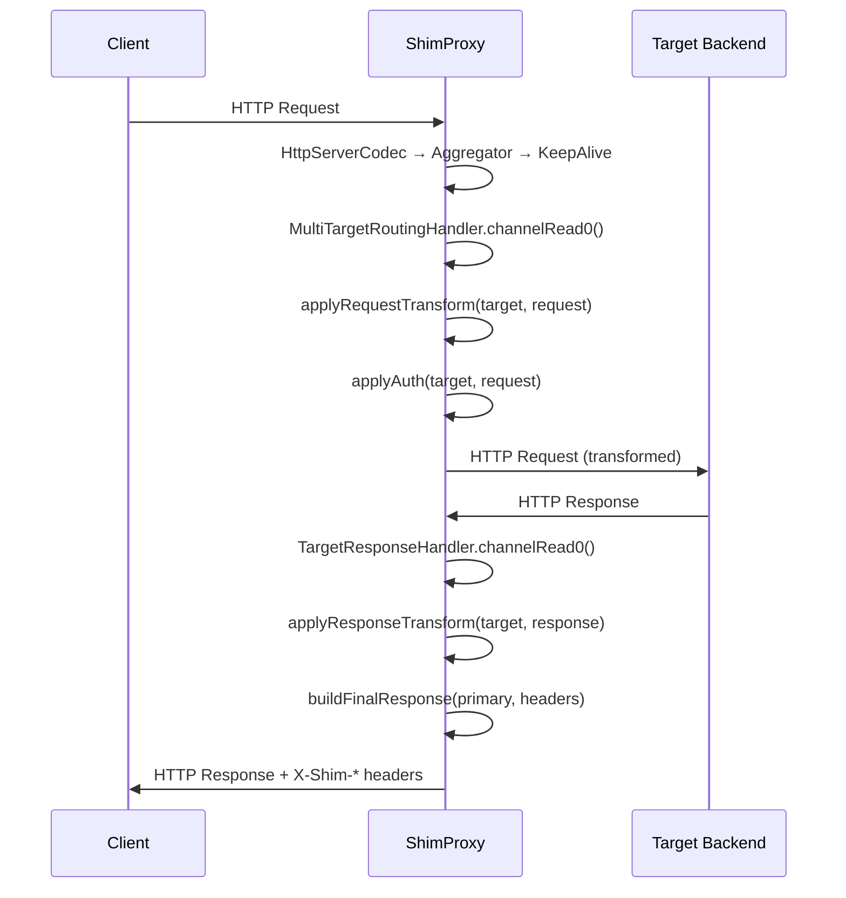

### Multi-Target Validation Mode

When multiple targets are active, requests are dispatched in parallel:

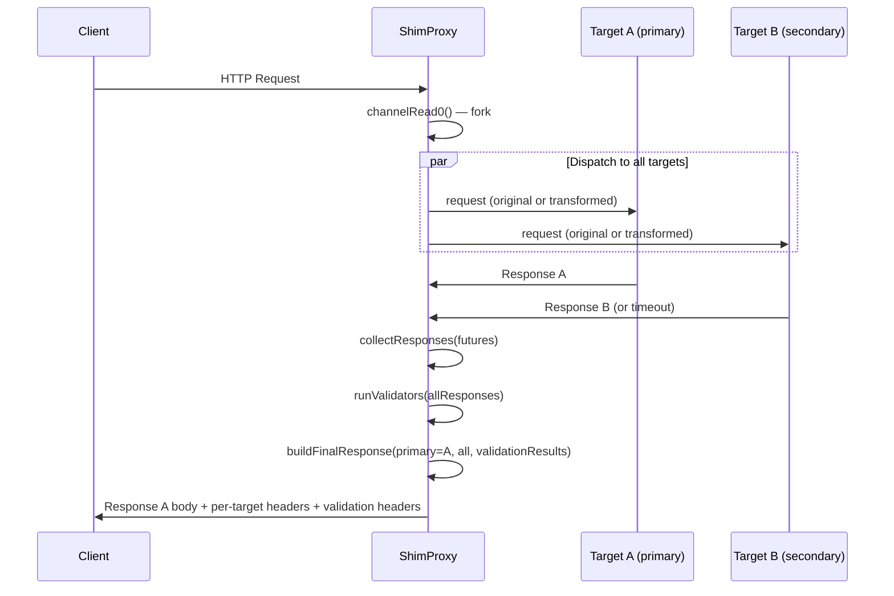

### Response Headers

Every response includes metadata headers:

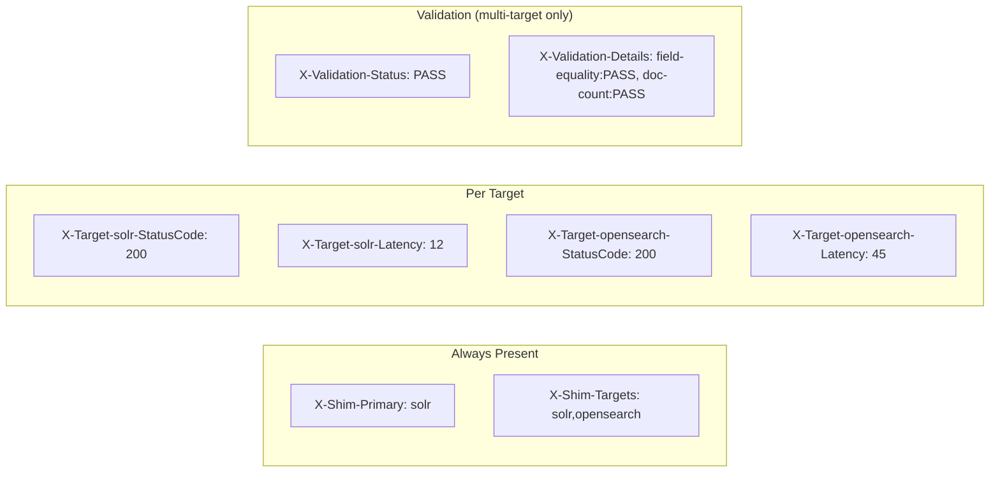

| Header Pattern | When | Example |
|----------------|------|---------|
| `X-Shim-Primary` | Always | `solr` |
| `X-Shim-Targets` | Always | `solr,opensearch` |
| `X-Target-{name}-StatusCode` | Per target (success) | `200` |
| `X-Target-{name}-Latency` | Per target (success) | `45` (ms) |
| `X-Target-{name}-Error` | Per target (failure) | `Connection refused` |
| `X-Validation-Status` | Multi-target + validators | `PASS` / `FAIL` / `ERROR` |
| `X-Validation-Details` | Multi-target + validators | `field-equality:PASS, doc-count:FAIL[...]` |

---

## Data Model

Core types that flow through the system:

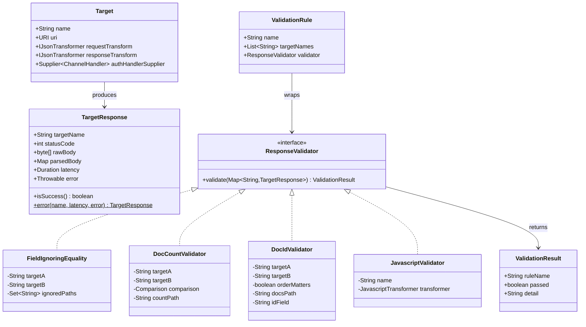

---

## Validation Framework

Validators compare responses from two or more targets. Each validator receives the full response map but operates on its configured target pair.

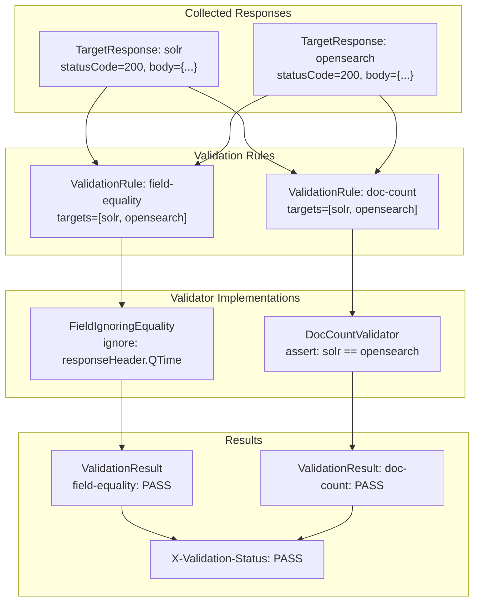

### Built-in Validators

| Validator | What it does | Config |
|-----------|-------------|--------|
| `FieldIgnoringEquality` | Deep JSON diff between two targets, skipping specified dot-paths | `ignore=responseHeader.QTime,responseHeader.params.NOW` |
| `DocCountValidator` | Compares document count at a JSON path (default: `response.numFound`) | `assert=solr==opensearch` (or `<=`, `>=`) |
| `DocIdValidator` | Compares document IDs from `response.docs[].id` | `ordered` (optional — checks order too) |
| `JavascriptValidator` | Custom JS function via GraalVM: `(responses) → {passed, detail}` | `script=custom.js` |

### Error Handling

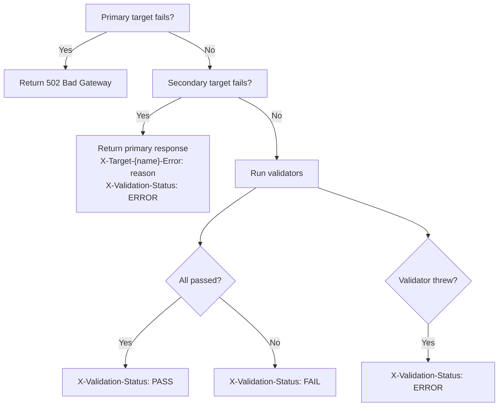

---

## Transform Pipeline

Transforms convert between Solr and OpenSearch HTTP formats. They're written in TypeScript, bundled to JavaScript, and executed in GraalVM at runtime.

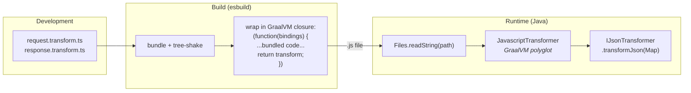

### Hot-Reload (`--watchTransforms`)

When `--watchTransforms` is enabled, transforms are wrapped in `ReloadableTransformer` and a `TransformFileWatcher` daemon thread monitors the JS files via Java's `WatchService`. When the `transform-watcher` container rebuilds a JS file, the shim detects the change and atomically swaps in a new `JavascriptTransformer` — no restart required. In-flight requests complete with the old transformer; new requests use the updated one.

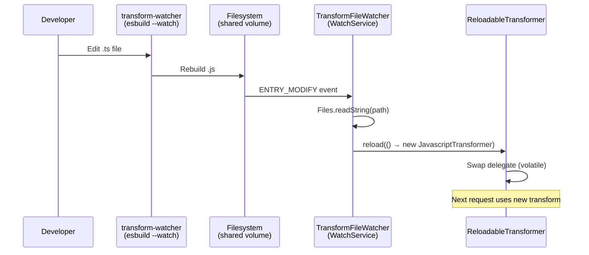

### Transform Contract

Transforms implement the `IJsonTransformer` interface via JavaScript:

```
Input (request):  { method, URI, protocol, headers, payload: { inlinedTextBody } }
Output (request): { method, URI, protocol, headers, payload: { inlinedTextBody } }

Input (response):  { statusCode, protocol, headers, payload: { inlinedTextBody } }
Output (response): { statusCode, protocol, headers, payload: { inlinedTextBody } }
```

The Solr→OpenSearch request transform rewrites:
- `/solr/{collection}/select?q=...` → `POST /{collection}/_search`
- Adds `{"query":{"match_all":{}}}` body

The OpenSearch→Solr response transform converts:
- `hits.hits[]._source` → `response.docs[]`
- Adds `responseHeader` with status and QTime

### Auth Handlers

Per-target authentication is applied after the request transform:

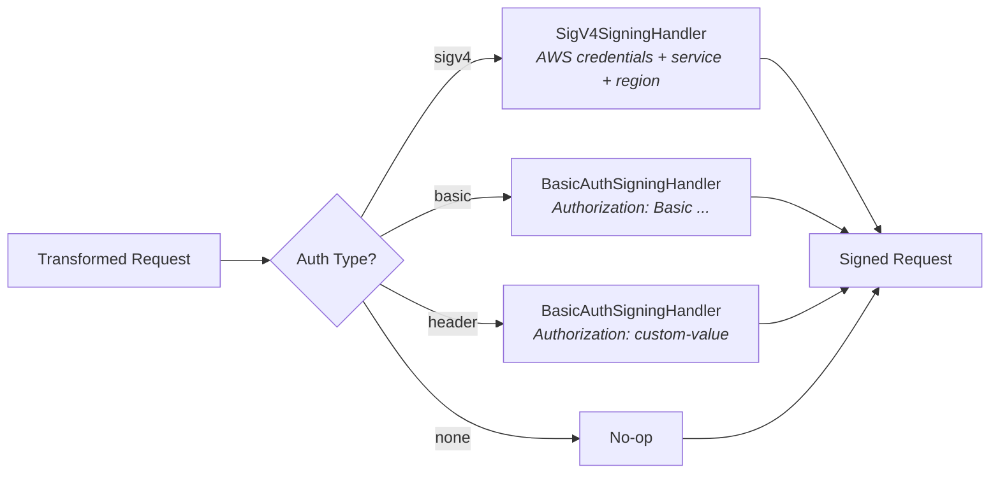

Auth handlers are applied via `EmbeddedChannel` — the existing Netty handlers (SigV4, Basic) are reused without modification.

---

## Deployment Modes

The Docker Compose setup runs multiple shim instances to demonstrate all modes simultaneously:

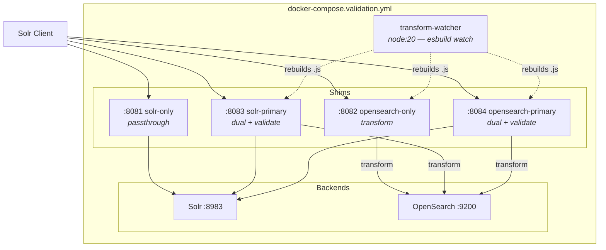

All shim instances with transforms use `--watchTransforms`, so when the `transform-watcher` rebuilds JS files from TypeScript changes, the shims hot-reload them without restart.

| Port | Service | Primary | Targets | Validators | Description |
|------|---------|---------|---------|------------|-------------|
| 8081 | shim-solr-only | solr | solr | — | Passthrough proxy to Solr |
| 8082 | shim-opensearch-only | opensearch | opensearch | — | Transform proxy to OpenSearch |
| 8083 | shim-solr-primary | solr | solr, opensearch | field-equality, doc-count | Returns Solr response, validates against OpenSearch |
| 8084 | shim-opensearch-primary | opensearch | solr, opensearch | field-equality, doc-count | Returns OpenSearch response, validates against Solr |

### Build & Run

```bash
# Build the Docker image
cd TrafficCapture && ../gradlew :TrafficCapture:transformationShim:jibDockerBuild

# Start all services
cd SolrTransformations
docker compose -f docker/docker-compose.validation.yml up

# Or run the full demo (builds, seeds data, demos each mode)
./demo-validation.sh
```

---

## CLI Reference

```
ShimMain — Multi-target validation shim proxy

Required:
  --listenPort <port>           Proxy listen port
  --target <name=uri>           Named target (repeatable)
  --primary <name>              Target whose response is returned to client

Optional:
  --active <name,name,...>      Active targets (default: all)
  --targetTransform <spec>      Per-target transforms (repeatable)
                                Format: name=request:file.js,response:file.js
  --targetAuth <spec>           Per-target auth (repeatable)
                                Formats: name=sigv4:service,region
                                         name=basic:user:pass
                                         name=header:value
                                         name=none
  --validator <spec>            Validation rule (repeatable)
                                Formats: field-equality:a,b:ignore=path1,path2
                                         doc-count:a,b:assert=a<=b
                                         doc-ids:a,b[:ordered]
                                         js:a,b:script=file.js
  --timeout <ms>                Secondary target timeout (default: 30000)
  --watchTransforms             Watch transform JS files and hot-reload on change
  --insecureBackend             Trust all backend TLS certificates
```

### Example Configurations

**Passthrough proxy:**
```bash
--target solr=http://solr:8983 --primary solr
```

**Single-target with transforms:**
```bash
--target opensearch=https://os:9200 --primary opensearch \
--targetTransform opensearch=request:req.js,response:resp.js
```

**Dual-target validation (Solr primary):**
```bash
--target solr=http://solr:8983 \
--target opensearch=https://os:9200 \
--targetTransform opensearch=request:req.js,response:resp.js \
--targetAuth opensearch=sigv4:es,us-east-1 \
--primary solr \
--validator field-equality:solr,opensearch:ignore=responseHeader.QTime \
--validator doc-count:solr,opensearch:assert=solr==opensearch
```

**Three targets (comparing two OpenSearch clusters):**
```bash
--target solr=http://solr:8983 \
--target os-v1=https://os-v1:9200 \
--target os-v2=https://os-v2:9200 \
--targetTransform os-v1=request:req.js,response:resp.js \
--targetTransform os-v2=request:req-v2.js,response:resp-v2.js \
--primary solr \
--validator field-equality:solr,os-v1 \
--validator field-equality:solr,os-v2 \
--validator doc-count:os-v1,os-v2:assert=os-v1==os-v2
```
