# Instrumentation Developer Guide

## Why This Framework

OpenTelemetry provides a unified API for metrics and traces, but its default patterns assume synchronous,
stack-frame-based context propagation. That doesn't work well for the asynchronous, dependency-injected code
throughout the TrafficCapture packages. Static meter storage also makes parallel testing difficult. This framework
adapts OpenTelemetry so that instrumentation contexts are explicit first-class parameters — passed alongside data
rather than hidden in thread-locals — making the code easier to reason about, test, and extend.

## Core Concepts

### Class Hierarchy

```
IInstrumentationAttributes          ← meter counters/histograms without span lifecycle
  └─ IScopedInstrumentationAttributes  ← adds span creation, duration tracking, auto-close
       └─ BaseSpanContext<S>              ← abstract base for top-level activities
            └─ BaseNestedSpanContext<S,T>     ← child activity with a parent span
                 └─ DirectNestedSpanContext<S,T,L> ← child with typed access to logical parent
```

**Why the layers?**
- `IInstrumentationAttributes` lets you record metrics from any context, even ones that don't own a span.
- `IScopedInstrumentationAttributes` adds lifecycle: when the context is created a span starts, and when it's
  closed the span ends and duration/count metrics are emitted automatically.
- `BaseSpanContext` is the concrete starting point for top-level activities (no parent span).
- `BaseNestedSpanContext` creates a child span linked to a parent, so traces show the hierarchy.
- `DirectNestedSpanContext` is a convenience when the parent's type is known at compile time — see below.

**Why parent linkages matter:** Linking child spans to parent spans is what turns flat, disconnected telemetry
into a meaningful trace tree. When a `processWidget` span is a child of `processBatch`, a tracing backend can
show you the full request lifecycle as a single tree — which widget was slow, which batch it belonged to, and
how the durations nest. Without parent linkages, you'd have thousands of unrelated spans with no way to
correlate them. `BaseNestedSpanContext` handles this automatically: its constructor takes the parent context,
and `initializeSpan()` wires the new span as a child of the parent's span via OpenTelemetry's `setParent()`.

**`BaseNestedSpanContext` vs `DirectNestedSpanContext`:** Both create child spans. The difference is ergonomic:

- `BaseNestedSpanContext<S, T>` requires you to pass both the root scope and the parent explicitly. Its
  `getEnclosingScope()` returns `IScopedInstrumentationAttributes` — the generic base type. If application
  code needs to navigate back up to the parent to call parent-specific methods, it must cast.

- `DirectNestedSpanContext<S, T, L>` simplifies both sides. Its constructor takes just the parent (extracting
  the root scope automatically via `parent.getRootInstrumentationScope()`), and it provides
  `getLogicalEnclosingScope()` which returns the parent already cast to the logical type `L`.

This matters in practice because application code frequently navigates up the context tree. For example, the
replayer's `TargetRequestContext` needs to access its parent `HttpTransactionContext` to get the original
request timestamp. With `DirectNestedSpanContext`, that's a type-safe `getLogicalEnclosingScope()` call
instead of a cast:

```java
// DirectNestedSpanContext — type-safe parent access
class TargetRequestContext extends DirectNestedSpanContext<
    RootReplayerContext, HttpTransactionContext,
    IReplayerHttpTransactionContext> { ... }

// Application code can do:
ctx.getLogicalEnclosingScope().getTimeOfOriginalRequest()  // no cast needed

// vs BaseNestedSpanContext where you'd need:
((IReplayerHttpTransactionContext) ctx.getEnclosingScope()).getTimeOfOriginalRequest()
```

Use `DirectNestedSpanContext` when the child always has exactly one known parent type and code needs to
navigate back to it. Use `BaseNestedSpanContext` when the parent type varies (e.g., a context that can be
nested under different parent types) or when you don't need typed parent access.

### How Contexts Work Across Library Boundaries

A key design question: when library A calls into library B, how does instrumentation flow across that boundary?
There are two patterns in this codebase, and which one to use depends on whether the inner library needs to
emit its own metrics.

**Pattern A: Context interface passed into the inner library.** The inner library depends on a context
interface (defined in a shared package), and the caller passes a concrete implementation. The inner library
calls domain methods on the interface to record metrics. It never knows about the concrete context class or
the root context.

This is how `RestClient` (in the RFS package) works. It accepts `IRfsContexts.IRequestContext` as a parameter:

```java
// RestClient.java — inner library accepts a context interface
public HttpResponse get(String path, IRfsContexts.IRequestContext context) {
    // ... make HTTP call ...
    context.addBytesRead(response.length());
}
```

The caller (e.g., `MetadataMigrationContexts.CreateIndexContext`) creates the concrete context and passes it in:

```java
// Caller creates the context, inner library uses the interface
try (var reqCtx = createCheckRequestContext()) {
    restClient.get(path, reqCtx);
}
```

The inner library depends only on the `IRfsContexts.IRequestContext` interface — it has no dependency on
`RootMetadataMigrationContext`, `CreateIndexContext`, or any specific root scope. This is the recommended
pattern when the inner library has meaningful events to report (bytes sent, items processed, etc.).

**Pattern B: Context stays in the caller; inner library is unaware.** The inner library has no instrumentation
dependency at all. The caller meters events before and after calling into it.

This is how the JSON transform library works today. `IJsonTransformer.transformJson(Object)` is a pure
data-in/data-out interface with no context parameter:

```java
// IJsonTransformer.java — no instrumentation awareness
public interface IJsonTransformer extends AutoCloseable {
    Object transformJson(Object incomingJson);
}
```

All transformation metrics are recorded by the replayer's `RequestTransformationContext`, which wraps the
transformer calls:

```java
// The replayer (caller) meters events around the context-unaware transformer
transformationContext.onPayloadBytesIn(payload.length());
Object result = jsonTransformer.transformJson(payload);
transformationContext.onTransformSuccess();
```

This works when the caller has enough visibility into what happened. But it means the transform library
can't report internal details — per-rule timing, regex match counts, intermediate parse steps — because it
doesn't have a context to report them to.

**Adding instrumentation to a context-unaware library (like transforms):** If you wanted the transform
library itself to emit metrics (e.g., time spent in each transformation rule, number of fields modified),
you'd:

1. Define a context interface in a shared package that the transform library can depend on:

```java
// In a shared/interface package
public interface ITransformInstrumentationContext {
    void onRuleApplied(String ruleName, Duration elapsed);
    void onFieldsModified(int count);
}
```

2. Add the context as an optional parameter to the transformer (or use a context-aware wrapper):

```java
public interface IJsonTransformer extends AutoCloseable {
    Object transformJson(Object incomingJson);

    // New overload that accepts instrumentation
    default Object transformJson(Object incomingJson,
                                 ITransformInstrumentationContext ctx) {
        return transformJson(incomingJson); // default ignores context
    }
}
```

3. Implement the interface in a context class within the calling application (the replayer), backed by
   real otel instruments. The transform library never depends on OpenTelemetry or the tracing framework
   directly — it only depends on the thin interface.

This is the same progression that the RFS libraries followed: `RestClient` started context-unaware, then
`IRfsContexts.IRequestContext` was introduced as the boundary interface so it could report bytes read/sent
without depending on any specific root context.

### Metric Instruments

```
CommonMetricInstruments             ← just an exception counter
  └─ CommonScopedMetricInstruments  ← adds a scope count counter + duration histogram
```

Every context gets an exception counter automatically. Scoped contexts also get an activity count and a duration
histogram — these are real otel metrics registered and emitted by `CommonScopedMetricInstruments` in its
constructor. "Automatically" means you don't write any code to define or emit them; the base class handles
registration (via the `Meter`) and emission (in the `close()` / `sendMeterEventsForEnd()` path). You only
need to define instruments for your domain-specific metrics beyond these baseline ones.

**Why are instruments created once in the root context?** OpenTelemetry instruments are safe to share and should
be reused. Creating them once at startup (in the root context constructor) avoids repeated lookups and keeps
metric registration deterministic.

### Root Context

Your application's root context extends `RootOtelContext`. It holds the `OpenTelemetry` SDK instance, creates
the `Meter`, and constructs all `MetricInstruments` for every context type in your library. Individual span
contexts retrieve their instruments from the root via `getRootInstrumentationScope()`.

**Why a single root?** It centralizes SDK initialization, makes the no-op path trivial (just pass a no-op SDK),
and gives tests a single object to swap out.

---

## Tutorial: Instrumenting a New Library

We'll instrument a fictional `WidgetProcessor` library from scratch. It processes widgets in batches — a
top-level "process batch" activity that spawns a "process widget" child activity per widget.

By the end, the framework will automatically produce these traces and metrics:

### Resulting Trace Structure

```mermaid
gantt
    title WidgetProcessor Trace
    dateFormat X
    axisFormat %s

    section Batch
    processBatch           :0, 50

    section Widgets
    processWidget (widget-1) :5, 20
    processWidget (widget-2) :22, 40
    processWidget (widget-3) :35, 48
```



Each `processWidget` span is a child of `processBatch`, so tracing backends (Jaeger, X-Ray, etc.) render them
as a nested tree:

```
processBatch (50ms)
├── processWidget widget-1 (15ms)
├── processWidget widget-2 (18ms)
└── processWidget widget-3 (13ms)
```

### Resulting Metrics

| Metric Name | Type | Source | Description |
|---|---|---|---|
| `processBatchCount` | Counter | auto | Incremented each time a batch context closes |
| `processBatchDuration` | Histogram (ms) | auto | Duration of each batch |
| `processBatchExceptionCount` | Counter | auto | Exceptions observed during batch processing |
| `processWidgetCount` | Counter | auto | Incremented each time a widget context closes |
| `processWidgetDuration` | Histogram (ms) | auto | Duration of each widget |
| `processWidgetExceptionCount` | Counter | auto | Exceptions observed during widget processing |
| `widgetsProcessed` | Counter | custom | Total widgets successfully processed |
| `widgetBatchSize` | Histogram | custom | Number of widgets per batch |
| `activeWidgetBatches` | UpDownCounter | custom | Currently in-flight batches (gauge-like) |
| `widgetProcessingErrors` | Counter | custom | Domain-specific error count per widget |

The "auto" metrics come free from `CommonScopedMetricInstruments`. The "custom" ones are what we'll add.

---

### Step 1: Define Activity Names and the Context Interface

Activity names are the identity of each context — they become span names and metric name prefixes. Centralizing
them in one place keeps naming consistent and makes the full set of activities discoverable at a glance.

```java
package org.opensearch.migrations.widgets.tracing;

import org.opensearch.migrations.tracing.IScopedInstrumentationAttributes;

public interface IWidgetContexts {

    class ActivityNames {
        public static final String PROCESS_BATCH = "processBatch";
        public static final String PROCESS_WIDGET = "processWidget";
        private ActivityNames() {}
    }

    class MetricNames {
        public static final String WIDGETS_PROCESSED = "widgetsProcessed";
        public static final String BATCH_SIZE = "widgetBatchSize";
        public static final String ACTIVE_BATCHES = "activeWidgetBatches";
        public static final String WIDGET_ERRORS = "widgetProcessingErrors";
        private MetricNames() {}
    }

    interface IProcessBatchContext extends IScopedInstrumentationAttributes {
        String ACTIVITY_NAME = ActivityNames.PROCESS_BATCH;
        IProcessWidgetContext createProcessWidgetContext(String widgetId);
    }

    interface IProcessWidgetContext extends IScopedInstrumentationAttributes {
        String ACTIVITY_NAME = ActivityNames.PROCESS_WIDGET;
        void onWidgetProcessed();
        void onWidgetError();
    }
}
```

**Why interfaces?** They decouple the instrumentation contract from the implementation. Application code depends
on `IProcessBatchContext`, not the concrete class — so tests can substitute a no-op or in-memory implementation.

### Step 2: Implement the Span Contexts

Each context class has three responsibilities: define its `MetricInstruments`, implement the interface methods,
and wire up to the root scope for instrument access.

```java
package org.opensearch.migrations.widgets.tracing;

import org.opensearch.migrations.tracing.BaseNestedSpanContext;
import org.opensearch.migrations.tracing.BaseSpanContext;
import org.opensearch.migrations.tracing.CommonScopedMetricInstruments;
import org.opensearch.migrations.tracing.IScopedInstrumentationAttributes;

import io.opentelemetry.api.metrics.LongCounter;
import io.opentelemetry.api.metrics.LongHistogram;
import io.opentelemetry.api.metrics.LongUpDownCounter;
import io.opentelemetry.api.metrics.Meter;
import lombok.NonNull;

public interface WidgetContexts extends IWidgetContexts {

    // ── Top-level context: no parent span ──────────────────────────────

    class ProcessBatchContext extends BaseSpanContext<RootWidgetContext>
        implements IProcessBatchContext {

        protected ProcessBatchContext(RootWidgetContext rootScope, int batchSize) {
            super(rootScope);
            initializeSpan(rootScope);
            meterDeltaEvent(getMetrics().activeBatches, 1);
            meterHistogram(getMetrics().batchSize, batchSize);
        }

        // ── Metric instruments ──

        public static class MetricInstruments extends CommonScopedMetricInstruments {
            final LongUpDownCounter activeBatches;
            final LongHistogram batchSize;

            private MetricInstruments(Meter meter, String activityName) {
                super(meter, activityName);
                activeBatches = meter.upDownCounterBuilder(MetricNames.ACTIVE_BATCHES).build();
                batchSize = meter.histogramBuilder(MetricNames.BATCH_SIZE)
                    .ofLongs().build();
            }
        }

        public static @NonNull MetricInstruments makeMetrics(Meter meter) {
            return new MetricInstruments(meter, ACTIVITY_NAME);
        }

        @Override
        public MetricInstruments getMetrics() {
            return getRootInstrumentationScope().batchInstruments;
        }

        // ── Scoped context boilerplate ──

        @Override
        public String getActivityName() { return ACTIVITY_NAME; }

        @Override
        public IScopedInstrumentationAttributes getEnclosingScope() { return null; }

        @Override
        public void sendMeterEventsForEnd() {
            super.sendMeterEventsForEnd();
            meterDeltaEvent(getMetrics().activeBatches, -1);
        }

        // ── Child context factory ──

        @Override
        public IProcessWidgetContext createProcessWidgetContext(String widgetId) {
            return new ProcessWidgetContext(getRootInstrumentationScope(), this, widgetId);
        }
    }

    // ── Nested context: child span of ProcessBatchContext ──────────────

    class ProcessWidgetContext
        extends BaseNestedSpanContext<RootWidgetContext, IProcessBatchContext>
        implements IProcessWidgetContext {

        private final String widgetId;

        protected ProcessWidgetContext(
            RootWidgetContext rootScope,
            IProcessBatchContext enclosingScope,
            String widgetId
        ) {
            super(rootScope, enclosingScope);
            this.widgetId = widgetId;
            initializeSpan(rootScope);
        }

        // ── Metric instruments ──

        public static class MetricInstruments extends CommonScopedMetricInstruments {
            final LongCounter widgetsProcessed;
            final LongCounter widgetErrors;

            private MetricInstruments(Meter meter, String activityName) {
                super(meter, activityName);
                widgetsProcessed = meter.counterBuilder(MetricNames.WIDGETS_PROCESSED).build();
                widgetErrors = meter.counterBuilder(MetricNames.WIDGET_ERRORS).build();
            }
        }

        public static @NonNull MetricInstruments makeMetrics(Meter meter) {
            return new MetricInstruments(meter, ACTIVITY_NAME);
        }

        @Override
        public MetricInstruments getMetrics() {
            return getRootInstrumentationScope().widgetInstruments;
        }

        // ── Scoped context boilerplate ──

        @Override
        public String getActivityName() { return ACTIVITY_NAME; }

        // ── Domain-specific metering ──

        @Override
        public void onWidgetProcessed() {
            meterIncrementEvent(getMetrics().widgetsProcessed);
        }

        @Override
        public void onWidgetError() {
            meterIncrementEvent(getMetrics().widgetErrors);
        }
    }
}
```

**Why `BaseSpanContext` vs `BaseNestedSpanContext`?** `ProcessBatchContext` is a top-level activity — it has no
parent span, so it extends `BaseSpanContext` and returns `null` from `getEnclosingScope()`.
`ProcessWidgetContext` is always created within a batch, so it extends `BaseNestedSpanContext` which automatically
wires its span as a child of the batch's span. The trace backend then renders the nesting shown above.

**Why domain methods like `onWidgetProcessed()`?** Application code calls `ctx.onWidgetProcessed()` instead of
`ctx.meterIncrementEvent(someCounter)`. This keeps instrumentation details out of business logic and
consolidates all metric concerns inside the context class.

**Why `sendMeterEventsForEnd()`?** This hook fires when the context closes. The base implementation emits the
auto count and duration metrics. Override it to emit additional close-time metrics (like decrementing the active
batches gauge). Always call `super.sendMeterEventsForEnd()` first.

### Step 3: Create the Root Context

The root context extends `RootOtelContext`, creates a `Meter`, and constructs all `MetricInstruments` once.

```java
package org.opensearch.migrations.widgets.tracing;

import org.opensearch.migrations.tracing.IContextTracker;
import org.opensearch.migrations.tracing.RootOtelContext;

import io.opentelemetry.api.OpenTelemetry;

public class RootWidgetContext extends RootOtelContext {
    public static final String SCOPE_NAME = "widgetProcessor";

    public final WidgetContexts.ProcessBatchContext.MetricInstruments batchInstruments;
    public final WidgetContexts.ProcessWidgetContext.MetricInstruments widgetInstruments;

    public RootWidgetContext(OpenTelemetry sdk, IContextTracker contextTracker) {
        super(SCOPE_NAME, contextTracker, sdk);
        var meter = this.getMeterProvider().get(SCOPE_NAME);

        batchInstruments = WidgetContexts.ProcessBatchContext.makeMetrics(meter);
        widgetInstruments = WidgetContexts.ProcessWidgetContext.makeMetrics(meter);
    }

    public IWidgetContexts.IProcessBatchContext createBatchContext(int batchSize) {
        return new WidgetContexts.ProcessBatchContext(this, batchSize);
    }
}
```

**Why are instrument fields `public final`?** Context classes access them via
`getRootInstrumentationScope().batchInstruments`. Making them public final keeps the access simple and
immutable — no getters needed, no risk of reassignment.

### Step 4: Use It in Application Code

```java
public void processBatch(RootWidgetContext rootContext, List<Widget> widgets) {
    try (var batchCtx = rootContext.createBatchContext(widgets.size())) {
        for (var widget : widgets) {
            try (var widgetCtx = batchCtx.createProcessWidgetContext(widget.getId())) {
                processWidget(widget);
                widgetCtx.onWidgetProcessed();
            } catch (Exception e) {
                widgetCtx.addCaughtException(e);
                widgetCtx.onWidgetError();
            }
        }
    }
}
```

When this code runs:
1. `createBatchContext()` starts a `processBatch` span, increments `activeWidgetBatches`, and records the batch
   size histogram.
2. Each `createProcessWidgetContext()` starts a child `processWidget` span nested under the batch.
3. `onWidgetProcessed()` increments the `widgetsProcessed` counter.
4. If an exception occurs, `addCaughtException()` records it on the span and increments the auto exception
   counter. `onWidgetError()` increments the domain-specific error counter.
5. Each `close()` (via try-with-resources) ends the span, emits the auto duration histogram and count counter.
6. The batch `close()` also decrements `activeWidgetBatches`.

### Step 5: Adding Span Attributes

Attributes attach contextual key-value pairs to spans. Override `fillAttributesForSpansBelow()` to propagate
attributes to all child spans, or `fillExtraAttributesForThisSpan()` for attributes on the current span only.

```java
// In ProcessBatchContext — propagates batchId to all child widget spans
@Override
public AttributesBuilder fillAttributesForSpansBelow(AttributesBuilder builder) {
    return super.fillAttributesForSpansBelow(builder)
        .put(AttributeKey.stringKey("batchId"), batchId);
}

// In ProcessWidgetContext — only on this span, not propagated further
@Override
public AttributesBuilder fillExtraAttributesForThisSpan(AttributesBuilder builder) {
    return super.fillExtraAttributesForThisSpan(builder)
        .put(AttributeKey.stringKey("widgetId"), widgetId);
}
```

**When to use span attributes vs metric attributes:** Span attributes can have high cardinality (unique IDs,
URLs) because each span is an individual event. Metric attributes get aggregated into time-series buckets — every
unique attribute combination creates a new series. Use `fillExtraAttributesForThisSpan()` for high-cardinality
data and `getPopulatedMetricAttributes()` only for low-cardinality dimensions (status codes, categories). See
`TupleHandlingContext` in the replayer for a real example of this tradeoff — it puts `method` and categorized
status codes on metrics, but puts the full endpoint URL only on the span.

---

## Testing Instrumented Code

The codebase provides `InMemoryInstrumentationBundle` for tests that need to assert on emitted metrics and spans,
and a no-op path for tests that don't care about instrumentation.

```java
// No-op — zero overhead, no metrics collected
var rootCtx = new RootWidgetContext(
    RootOtelContext.initializeNoopOpenTelemetry(),
    IContextTracker.DO_NOTHING_TRACKER
);

// In-memory — captures metrics and spans for assertions
var bundle = new InMemoryInstrumentationBundle(true, true);
var rootCtx = new RootWidgetContext(bundle.openTelemetrySdk, new BacktracingContextTracker());
// ... run code ...
// Assert on bundle.getFinishedSpans(), bundle.getMetrics(), etc.
```

**Why `BacktracingContextTracker`?** It tracks all open contexts and fails loudly if any are leaked (not closed).
Use it in tests to catch resource leaks early.

For a complete test context pattern, see
[TestContext](../TrafficCapture/trafficReplayer/src/testFixtures/java/org/opensearch/migrations/tracing/TestContext.java)
which wraps `RootReplayerContext` with the in-memory bundle and provides convenience factory methods.

---

## Design Rationale (Deep Dive)

### Why not use OpenTelemetry directly?

OpenTelemetry's default patterns rely on:
- **Thread-local context propagation** — breaks down in async code where work hops between threads.
- **`try-with-resources` on Scopes** — assumes the span creator and closer are on the same call stack.
- **Static instrument registration** — makes parallel test execution fragile.

This framework replaces all three: contexts are explicit parameters, spans are managed by context lifecycle, and
instruments are instance fields on the root context.

### The MetricInstruments Pattern

Each context class defines a static inner `MetricInstruments` class and a `makeMetrics(Meter)` factory. The root
context calls `makeMetrics()` once during construction and stores the result as a `public final` field. Individual
contexts access their instruments via `getRootInstrumentationScope().fieldName`.

This ensures:
- Instruments are created exactly once per application lifecycle.
- No static state — different root contexts (e.g., in parallel tests) have independent instruments.
- The full set of metrics for a library is visible in one place (the root context constructor).

### The No-Op Path

Passing `initializeNoopOpenTelemetry()` to the root context creates a fully functional context hierarchy where
every meter operation is a no-op. No code changes needed — the same application code runs with or without
instrumentation. This is critical for unit tests and for deployments where telemetry collection isn't configured.

### Context as Parameter

Instead of retrieving context from a thread-local (as otel expects), contexts are passed as method parameters or
stored as fields. This makes the data flow explicit:

```java
// Instead of this (otel pattern — implicit, breaks in async):
Span span = Span.current();

// We do this (explicit, works everywhere):
void processWidget(IProcessWidgetContext ctx, Widget widget) { ... }
```

This also means IDEs can trace which context flows where, and missing contexts are compile-time errors rather
than runtime surprises.

### Cardinality and Metric Attributes

Metric attributes create time-series dimensions. Every unique combination of attribute values creates a separate
series in the backend (Prometheus, CloudWatch, etc.). High-cardinality attributes (request IDs, URLs) can
explode storage costs.

The framework addresses this by separating span attributes from metric attributes:
- `fillExtraAttributesForThisSpan()` — high cardinality is fine, spans are individual events.
- `getPopulatedMetricAttributes()` — keep cardinality low (status code categories, not exact codes).

See `TupleHandlingContext.categorizeStatus()` which buckets HTTP status codes into 200/300/400/500 categories
for metrics while preserving exact codes on spans.

### Automatic Metrics from Scoped Contexts

Every `IScopedInstrumentationAttributes` context automatically emits on close:
- A **count** increment (`{activityName}Count`) — how many times this activity occurred.
- A **duration histogram** (`{activityName}Duration`) — how long each occurrence took, in milliseconds.
- An **exception counter** (`{activityName}ExceptionCount`) — inherited from `CommonMetricInstruments`.

These are real OpenTelemetry instruments — counters and histograms registered with the `Meter` during
`CommonScopedMetricInstruments` construction. They're emitted in the `close()` path via
`sendMeterEventsForEnd()` (for count and duration) and `addTraceException()` (for exceptions). The exception
counter is also recorded on the span as a span event, so it appears in both metrics and traces.

This means even a context with zero custom metrics still produces useful operational data. You only add custom
instruments when you need domain-specific measurements beyond "how often," "how long," and "how many errors."


---

## Future Work: Instrumentation Across Language Boundaries (Speculative)

> **Note:** Nothing in this section is implemented. These are design options for a potential future where
> transform rules running as JavaScript or Python scripts inside GraalVM need to emit their own metrics
> and traces. Today, all transformation metrics are recorded by the Java-side `RequestTransformationContext`
> wrapping the transformer calls (Pattern B from the cross-boundary section above).

The patterns described earlier in this guide assume Java on both sides of the call boundary. But some
transform rules run as scripts inside GraalVM. Those scripts can't implement Java interfaces or access
thread-locals naturally. There are several approaches, each with different tradeoffs.

### Option 1: Thread-local context (Java-only callers)

Since JSON transformers run on a single thread, the caller can set a thread-local before invoking
`transformJson()` and clear it after. Any Java code in the call chain can grab it. This avoids changing
the `IJsonTransformer` interface but doesn't help scripts running in Graal — they can't see Java
thread-locals. Level of effort is low, but it only works for the Java-to-Java boundary.

### Option 2: Explicit Java interface parameter

Pass a context interface into `transformJson()`. Type-safe and discoverable, but creates a compile
dependency from the transform library on the interface. Doesn't help Graal scripts either — they'd need
a polyglot bridge to call methods on the Java object, which is possible but awkward. Low-to-medium effort
for Java callers; medium effort if you also need to bridge it into scripts.

### Option 3: Bound function sink with dynamic instrument creation

Bind a simple `emitMetric(name, value, tags)` function into the Graal polyglot context before executing
the script. The script calls it with plain strings and numbers — zero Java dependency:

```java
// Java side — bind before script execution
bindings.putMember("emitMetric", (PolyglotMetricSink) (name, value, tags) -> {
    instrumentationContext.recordMetric(name, value, tags);
});
```

```javascript
// JavaScript transform — no Java dependency
function transformJson(doc) {
    var start = Date.now();
    // ... transform ...
    emitMetric("transformRuleElapsed", Date.now() - start, {"rule": "myRule"});
    return doc;
}
```

Without pre-registration, the Java side would need to create otel instruments on the fly — looking up or
creating a counter/histogram by name for each unique metric string. OpenTelemetry's
`Meter.counterBuilder(name).build()` is idempotent (same name returns the same instrument), so a
`ConcurrentHashMap<String, Object>` cache works. But there are real costs:

- **Instrument type ambiguity.** A raw `(name, value)` pair doesn't tell you whether it should be a
  counter, histogram, or gauge. You'd need a convention (e.g., names ending in `Elapsed` become
  histograms, others become counters) or an extra parameter for the type.
- **Unbounded metric names.** Scripts can emit arbitrary strings, creating new otel instruments at will.
  This is a cardinality explosion at the *instrument* level, not just the attribute level — each unique
  name is a separate time series in the backend. A bug or loop in a script could create thousands of
  metrics.
- **No validation until runtime.** Typos in metric names silently create new instruments instead of
  failing.

Level of effort: low to implement the basic sink, but requires ongoing discipline from script authors and
ideally a validation/allowlist layer to prevent runaway metric creation.

### Option 4: Pre-registered instrument registry with a bound sink

Same `emitMetric` binding as Option 3, but the Java side pre-registers the allowed metric names, types,
and units at startup — similar to how `MetricInstruments` classes work today. The bound function validates
incoming names against the registry and rejects unknown ones:

```java
// Java side — pre-register allowed metrics
var registry = new ScriptMetricRegistry();
registry.registerCounter("fieldsModified", "count");
registry.registerHistogram("ruleElapsed", "ms");

bindings.putMember("emitMetric", (PolyglotMetricSink) (name, value, tags) -> {
    registry.record(name, value, tags); // throws or logs warning if name not registered
});
```

This gives you type safety (the registry knows counter vs histogram), bounded cardinality (only registered
names are accepted), and clear documentation of what metrics scripts can emit. The cost is coordination:
when a script author wants a new metric, someone needs to add it to the Java-side registry. That could be
driven by configuration (a JSON/YAML file listing script metrics) to avoid code changes for each new metric.

Level of effort: medium. You need the registry class, the validation logic, and a way to configure it. But
it's a one-time investment that makes the dynamic path safe.

### Option 5: Expose Java's otel Meter/Tracer to scripts via polyglot interop

GraalVM's polyglot interop can expose Java objects to guest languages, so you could pass the otel `Meter`
or `Tracer` directly into scripts and let them create instruments and spans through the Java API:

```javascript
// Hypothetical — script uses Java otel objects via polyglot interop
var histogram = meter.histogramBuilder("ruleElapsed").setUnit("ms").build();
histogram.record(elapsed);
```

This gives scripts full otel power, but the complexity is significant:

- **Span lifecycle management.** If a script creates a span, who closes it on error? Java's
  try-with-resources doesn't exist in JS. An uncaught exception in the script leaks the span. You'd need
  wrapper logic on the Java side to clean up orphaned spans.
- **Context propagation.** otel's `Context.current()` doesn't flow across the polyglot boundary. You'd
  need to explicitly pass span contexts in and out, or accept that script-created spans are disconnected
  from the Java trace tree.
- **API surface area.** Exposing the full otel API means scripts can do anything — create meters, set
  attributes, start spans with arbitrary parents. That's powerful but hard to govern and easy to misuse.
- **Testing.** Verifying that scripts emit correct telemetry requires polyglot test infrastructure.

Level of effort: high. This is essentially building a polyglot observability SDK. It makes sense if scripts
are complex, long-lived, and need rich tracing. For simple transform rules that just need to report a few
counters, it's overkill.

### Option 6: Language-native otel SDK with propagated trace context

Instead of bridging Java's otel objects into the script, treat the polyglot boundary like a microservice
boundary. Each side uses its own language-native otel SDK, and you propagate the trace context (trace ID +
span ID) as a plain string so everything stitches together in the collector.

The key insight is that GraalVM's embedded engines (GraalJS, GraalPy) *can* import pure packages — the
constraint is specifically around packages that depend on native/runtime-specific modules:

| Package | Pure JS/Python? | Works in embedded Graal? |
|---|---|---|
| `@opentelemetry/api` (JS) | Yes | Yes |
| `@opentelemetry/sdk-trace-base` (JS) | Yes | Yes |
| `@opentelemetry/sdk-trace-node` (JS) | No — needs `process`, `os` | No |
| `@opentelemetry/exporter-otlp-http` (JS) | No — needs `http`/`https` | No |
| `opentelemetry-api` (Python) | Yes | Yes |
| `opentelemetry-sdk` (Python) | Yes | Yes |
| `opentelemetry-exporter-otlp-proto-http` (Python) | Pure Python (`requests`/`urllib3`) | Likely yes |

The otel API and base SDK layers are pure JS/Python and should work fine in GraalVM's embedded engines.
The problem for JS is specifically the **exporters** — they make network calls using Node.js built-in
modules (`http`, `https`, `net`) that don't exist in embedded GraalJS (which is an ECMAScript engine, not
a Node.js runtime). Python is in much better shape because its networking libraries are pure Python or
have GraalPy-compatible C extensions, so the full otel stack including exporters likely works out of the
box.

**For Python — likely works end-to-end:**

```java
// Java side — propagate trace context
bindings.putMember("parentTraceContext", traceparent);
```

```python
# Python transform — full otel SDK works in GraalPy
from opentelemetry import trace, context
from opentelemetry.propagate import extract

parent_ctx = extract({"traceparent": parent_trace_context})
with tracer.start_as_current_span("applyRule", context=parent_ctx) as span:
    # ... transform work ...
    meter.create_counter("fieldsModified").add(modified_count)
```

The Python otel SDK exports directly to the collector. Spans appear as children of the Java-side trace.
Level of effort: low-medium — mostly configuration and verifying GraalPy compatibility.

**For JavaScript — use a bridge exporter:**

The JS otel API and SDK work, but exporters don't. The fix is a custom exporter that bridges back to Java
via polyglot interop instead of making network calls from JS:

```javascript
// Custom exporter — calls back into Java instead of using Node.js http
class JavaBridgeSpanExporter {
    export(spans, resultCallback) {
        javaBridge.exportSpans(JSON.stringify(spans));
        resultCallback({ code: 0 });
    }
    shutdown() { return Promise.resolve(); }
}

// Now use the standard otel API with the bridge exporter
var { trace, context, propagation } = require('@opentelemetry/api');
var parentCtx = propagation.extract(context.active(), { traceparent: parentTraceContext });
var span = tracer.startSpan("applyRule", {}, parentCtx);
try {
    // ... transform work ...
    meter.createCounter("fieldsModified").add(modifiedCount);
} finally {
    span.end();
}
```

```java
// Java side — receives exported spans and feeds them into the existing pipeline
bindings.putMember("javaBridge", new SpanBridge(javaOtelExporter));
```

This way JS code uses the real otel API idiomatically — creating spans, recording metrics, proper error
handling — but export goes through Java's already-configured otel SDK. No duplicate export pipeline, no
Node.js dependencies. The bridge exporter is a small, bounded piece of work.

**Considerations for both languages:**

- **Script startup cost.** Initializing an otel SDK per script invocation is expensive. Initialize once
  and reuse across invocations by managing SDK lifecycle alongside the script engine lifecycle.
- **Two SDK instances (Python path).** If Python exports independently, you have two batch processors and
  two export connections in the same process. Fine at low throughput; at high throughput, consider the
  bridge exporter approach for Python too to funnel everything through Java's single pipeline.
- **Configuration sync.** Both SDKs need the same collector endpoint, service name, and export format.
  Pass these from Java into the script context at initialization.

Level of effort: low-medium for Python (likely works with standard packages), medium for JavaScript (need
the bridge exporter, which is ~50 lines of code plus wiring).

### Summary of Options

| Approach | Coupling | Graal scripts? | Type safety | Dynamic metrics? | Effort |
|---|---|---|---|---|---|
| Thread-local | None | No | Full | No | Low |
| Java interface param | Compile dep | Awkward | Full | No | Low-Med |
| Bound sink, dynamic | Convention only | Yes | None | Yes (risky) | Low |
| Bound sink, pre-registered | Convention only | Yes | Partial | No (bounded) | Medium |
| Expose Java otel to scripts | Full otel (Java API) | Yes | Full | Yes | High |
| Native otel SDK + propagation (Python) | Trace context string | Yes | Full (native API) | Yes | Low-Med |
| Native otel SDK + bridge exporter (JS) | Trace context string | Yes | Full (native API) | Yes | Medium |

For most transform use cases, **Option 4 (pre-registered bound sink)** is the simplest path that works
everywhere. For **Python** scripts, **Option 6** may work out of the box with minimal effort since the full
otel stack is pure Python — worth prototyping first. For **JavaScript**, Option 6 with a bridge exporter is
a bounded task (~50 lines) that gives scripts idiomatic otel usage. Option 5 is a fallback if you need more
than a sink but can't get native SDKs working.
