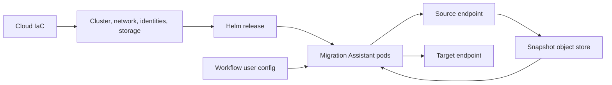
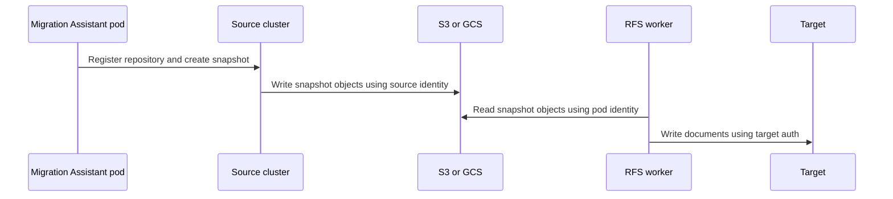

# Multi-Cloud Kubernetes Deployment Architecture

This document explains how Migration Assistant is deployed on Amazon EKS and
Google Kubernetes Engine (GKE), and how workloads in either cluster can connect
to Amazon OpenSearch Service (AOS), Amazon OpenSearch Serverless (AOSS), or
self-managed Elasticsearch/OpenSearch clusters.

The intended audience is developers extending the deployment to additional
clouds or replacing the repository's Infrastructure as Code (IaC).

## Key points

- Helm installs Kubernetes resources. It does not, by itself, establish cloud
  workload identity, cross-network routing, managed-service access policies, or
  object-store permissions.
- CloudFormation/CDK and Terraform are opinionated implementations of those
  prerequisites. The specific IaC tool is optional; the capabilities it creates
  are not.
- The Kubernetes cluster and the OpenSearch endpoint do not have to be in the
  same cloud. Connectivity and credentials must be supplied independently.
- SigV4 signing is implemented in the application and is not intrinsically tied
  to EKS. EKS currently supplies AWS credentials through Pod Identity. GKE needs
  a separate AWS credential federation mechanism.
- The role used by Migration Assistant pods and the role used by an AOS domain
  to write a snapshot are different identities.
- GKE cluster name and location are only needed by the bundled Fluent Bit
  configuration. They are not needed for migrations, GCS access, or GKE
  Workload Identity.

## Three deployment planes

It is useful to separate the deployment into three planes:

| Plane | Examples | Owner |
| --- | --- | --- |
| Cloud infrastructure | VPC/VNet, EKS/GKE, routes, private endpoints, IAM roles, Google service accounts, buckets, image registries | IaC or platform team |
| Kubernetes platform | ServiceAccounts, RBAC, Argo Workflows, Strimzi, Migration Console, RFS, replayer, collectors | Helm |
| Migration runtime | Source and target endpoints, authentication mode, snapshot repository, migration options | Workflow user configuration |

The current implementations combine some of these steps for convenience. For
example, GCP Terraform runs the Helm release, while the AWS CLI runs
CloudFormation first and Helm second. That orchestration does not change the
ownership boundary.



## Responsibility boundary

| Capability | Cloud IaC/platform responsibility | Helm responsibility |
| --- | --- | --- |
| Kubernetes cluster | Create/configure EKS or GKE | Consume an existing kube context |
| Cloud workload identity | Create cloud principal, trust, permissions, and association | Create/name Kubernetes ServiceAccounts; add GKE annotations where configured |
| Source/target routing | VPCs, peering, VPN, PSC/PrivateLink, firewall, DNS | Put the endpoint into generated workloads |
| Object storage | Create bucket and IAM policy, except the AWS chart can create its default S3 bucket with a hook Job | Publish bucket settings and run migration workloads |
| Managed OpenSearch authorization | AOS domain policy, AOSS data/network policies, IAM permissions | Configure `sigv4` with service and region |
| Self-managed authorization | Create users, certificates, and server configuration | Mount Kubernetes Secrets and configure Basic/mTLS |
| Snapshot plugin identity | Configure credentials on the source cluster | Register the repository and invoke the snapshot API |
| Observability identity | Grant CloudWatch or Cloud Logging permissions | Run collectors and configure outputs |

Helm can technically run cloud CLI commands in Jobs, as the S3 bucket hooks do,
but this does not make cloud IAM or networking Kubernetes-native. Those Jobs
still need a previously established cloud identity and permissions.

## Current AWS/EKS deployment

The AWS deployment is orchestrated by the
[`migration-assistant` CLI](aws/README.md). Its sequence is:

1. Deploy or adopt the CloudFormation stack generated from
   [`deployment/migration-assistant-solution`](../migration-assistant-solution/).
2. Configure the local kube context for the EKS cluster.
3. Mirror images into ECR, unless public images are selected.
4. Install the aggregate Helm chart with
   [`valuesEks.yaml`](charts/aggregates/migrationAssistantWithArgo/valuesEks.yaml).
5. Pass CloudFormation outputs such as account, region, and snapshot role into
   Helm.

### AWS IaC creates

The current EKS CDK implementation creates:

- VPC/subnets or integration with an imported VPC.
- EKS and ECR.
- A pod execution role trusted by `pods.eks.amazonaws.com`.
- EKS Pod Identity associations for the Kubernetes ServiceAccounts used by
  Migration Assistant.
- Permissions for S3, AOS, AOSS, CloudWatch, ECR, and other enabled services.
- A separate snapshot role trusted by `es.amazonaws.com`.
- Optional VPC endpoints for private AWS service access.

See
[`eks-infra.ts`](../migration-assistant-solution/lib/eks-infra.ts)
for the role and association definitions.

The default pod role is broad because it supports multiple migration features.
A production deployment should scope resources and actions to the buckets,
domains, collections, secrets, and registries in use.

### AWS Helm creates or configures

Helm creates:

- Migration Assistant ServiceAccounts and Kubernetes RBAC.
- Migration Console, Argo resources, RFS jobs, replayers, Kafka, and collectors.
- AWS-specific Kubernetes resources selected by `valuesEks.yaml`.
- A default S3 bucket through a hook Job when
  `defaultBucketConfiguration.create` is enabled.
- Snapshot configuration containing the S3 URI, AWS region, and optional
  `snapshotRoleArn`.

The Kubernetes ServiceAccount names must match the Pod Identity associations
created outside Helm. Important runtime names include:

- `migration-console-access-role`
- `migrations-service-account`
- `argo-workflow-executor`
- `otel-collector`

Creating a ServiceAccount with one of these names does not create an AWS role or
Pod Identity association.

### AWS handoff into Helm

The bootstrap passes values similar to:

```yaml
cloudProvider: aws

aws:
  configureAwsEksResources: true
  account: "123456789012"
  region: us-east-1

stageName: dev

defaultBucketConfiguration:
  snapshotRoleArn: arn:aws:iam::123456789012:role/example-snapshot-role
  useLocalStack: false
```

For an existing EKS cluster without Karpenter or EKS Auto Mode, also disable the
chart's dedicated node-pool assumptions:

```yaml
cluster:
  dedicatedKarpenterNodePoolForMigrationConsole: false
  useCustomKarpenterNodePool: false
```

The platform still needs suitable nodes, a default or explicitly configured
StorageClass, the EKS Pod Identity Agent, IAM roles, and Pod Identity
associations.

## Current GCP/GKE deployment

The GCP path is implemented as one Terraform root module in
[`deployment/terraform/gcp`](../terraform/gcp/README.md).
Terraform provisions cloud resources and then runs the Helm release directly.

### GCP Terraform creates

The current implementation creates:

- VPC, subnet, secondary pod/service ranges, Cloud Router, and NAT.
- A regional GKE cluster and node pools.
- A GCS snapshot bucket.
- A Google service account (GSA) and project IAM role bindings.
- GKE Workload Identity configuration and GSA/Kubernetes ServiceAccount
  bindings.
- Optional Private Service Connect or VPC peering for GCP-hosted source and
  target endpoints.
- The Migration Assistant Helm release.

The implementation currently reuses the GKE node GSA as the GSA mapped to
Migration Assistant workloads and grants it project-level roles including
`roles/storage.admin`. A least-privilege implementation should normally use
dedicated workload GSAs and bucket-level bindings.

### GCP Helm creates or configures

The GKE overlay:

- Selects `cloudProvider: gcp`.
- Annotates selected Kubernetes ServiceAccounts with
  `iam.gke.io/gcp-service-account`.
- Configures Argo artifacts and snapshots for GCS.
- Configures Fluent Bit to write to Cloud Logging.
- Disables creation of the GCS bucket because Terraform already created it.

The GSA annotation is only one half of Workload Identity. The GSA, IAM roles,
and permission for the Kubernetes ServiceAccount to impersonate the GSA must
already exist.

### GCP handoff into Helm

Terraform currently passes:

```yaml
cloudProvider: gcp

gcp:
  project: my-project
  serviceAccountEmail: migration-workload@my-project.iam.gserviceaccount.com
  clusterName: my-gke-cluster
  clusterLocation: us-central1

gcsBucketConfiguration:
  create: false
  bucketName: my-migration-snapshots
```

For a zonal cluster, `clusterLocation` is a zone such as `us-central1-a`; for a
regional cluster, it is a region such as `us-central1`.

`clusterName` and `clusterLocation` are currently required by
[`gcpMetadata.yaml`](charts/aggregates/migrationAssistantWithArgo/templates/resources/gcp/gcpMetadata.yaml)
and are used only to construct Cloud Logging `k8s_container` resource labels.
They are not migration or identity inputs.

GKE does not inject `GKE_CLUSTER_NAME` or `GKE_CLUSTER_LOCATION` environment
variables. It does expose both through the metadata service:

```text
/computeMetadata/v1/instance/attributes/cluster-name
/computeMetadata/v1/instance/attributes/cluster-location
```

The chart could discover these at runtime and retain Helm values as overrides.
The current explicit Terraform-to-Helm propagation is deterministic, but it
unnecessarily couples a logging detail to Terraform and prevents the documented
Helm-only command from working without additional values.

## Is IaC required?

Terraform and CloudFormation are not intrinsically required. Their cloud-side
effects are.

### Required for both providers

- A schedulable Kubernetes cluster with appropriate storage and capacity.
- Network routes, DNS, firewall rules, and TLS trust to every source and target.
- A cloud identity for each pod that accesses cloud APIs.
- Object-store access for RFS and Argo.
- Source-cluster snapshot plugin and credentials when creating a snapshot.
- Managed-service authorization policies when using AOS or AOSS.

### Provider-specific requirements

| Requirement | EKS | GKE |
| --- | --- | --- |
| Pod cloud identity | EKS Pod Identity or IRSA | GKE Workload Identity |
| Identity association | IAM role + Pod Identity association/IRSA trust | GSA or Workload Identity principal + IAM binding |
| Default snapshot store | S3 | GCS |
| Image registry | ECR or public registry | Artifact Registry or public registry |
| Private managed endpoints | VPC routing/PrivateLink | PSC/VPC peering for GCP services; VPN for AWS |
| Managed AOS snapshot role | Required when AOS creates a new S3 snapshot | Still required because AOS, not GKE, assumes it |

A Helm-only installation is therefore possible when a platform team has already
provided these prerequisites. Helm alone cannot make an arbitrary EKS/GKE
cluster ready for cloud API access.

## Snapshot identities and data flow

Snapshot creation has two independent callers:

1. A Migration Assistant pod calls the source cluster's snapshot API.
2. The source cluster's snapshot plugin writes the snapshot objects.

Migration Assistant does not proxy the snapshot bytes from the source to the
bucket.



### AOS source writing to S3

For an Amazon OpenSearch Service domain:

- Migration Assistant signs the repository and snapshot API requests with the
  pod's AWS identity.
- The caller needs `iam:PassRole` for the snapshot role.
- Repository registration includes `role_arn`.
- The snapshot role trusts `es.amazonaws.com` and has access to the S3 bucket.
- The AOS service assumes that role and writes the objects.

This role is not the EKS Pod Identity role. It is needed regardless of whether
Migration Assistant runs on EKS, GKE, or another compute platform.

AOSS cannot be used as a snapshot source in this model. It has no equivalent
managed snapshot-repository flow and is treated as a migration target.

### Self-managed source writing to S3

The source cluster's `repository-s3` plugin writes with credentials available to
the source process. On EKS this might be IRSA, Pod Identity where supported by
the plugin/SDK version, or credentials in the Elasticsearch/OpenSearch
keystore. No AOS service snapshot role is needed.

### Self-managed source writing to GCS

The source cluster's `repository-gcs` plugin writes with:

- GKE Workload Identity/Application Default Credentials, when supported by the
  plugin and source pod setup; or
- a service-account credentials file configured in the source cluster keystore.

The GSA used by Migration Assistant RFS pods does not automatically grant the
source cluster access. The source must use that GSA too or receive separate
bucket permissions.

[`SnapshotCreator.java`](../../RFS/src/main/java/org/opensearch/migrations/bulkload/common/SnapshotCreator.java)
shows the provider difference: S3 may receive `role_arn`; GCS receives bucket
and path settings and expects authentication to be configured on the source.

### Bring Your Own Snapshot

With an externally managed snapshot, Migration Assistant skips source snapshot
creation. The source-cluster write identity and AOS snapshot role are not used,
but RFS still needs read access to S3 or GCS.

### Cross-cloud snapshot implications

The snapshot store is constrained by the source cluster, not by the Kubernetes
provider running Migration Assistant:

- An AOS source uses S3 for manual snapshots. Running Migration Assistant on
  GKE does not make that source capable of writing to GCS.
- A self-managed source can use whichever repository plugin it supports and has
  been configured to authenticate to.
- RFS must authenticate to the store selected by the source, even when that
  store is in a different cloud from the Kubernetes cluster.

This creates legitimate dual-identity deployments:

| Migration placement | Snapshot/target combination | Pod identities required |
| --- | --- | --- |
| GKE | AOS source snapshot in S3 -> AOS/AOSS target | AWS credentials for AOS, S3, and target; GCP identity for GKE services/observability |
| GKE | Self-managed source snapshot in GCS -> AOS/AOSS target | GCP identity for GCS; AWS credentials for target SigV4 |
| EKS | Self-managed source snapshot in GCS -> self-managed/AWS target | Google credentials for GCS; AWS pod identity when AWS APIs are used |
| EKS | AOS source snapshot in S3 -> AOS/AOSS target | AWS pod identity plus the separate AOS snapshot service role |

The EKS and GKE overlays are opinionated defaults for S3 and GCS respectively.
The underlying repository schema and readers are provider-aware, but
cross-cloud object-store credentials are not currently wired as a turnkey Helm
configuration.

## Endpoint access has two independent gates

For every source and target, both of these must succeed:

1. **Network reachability:** route, DNS, firewall/security group, and TLS.
2. **Application authorization:** Basic auth, mTLS, no auth, or SigV4 plus the
   managed service's access policy.

SigV4 solves only the second gate. It does not make a private endpoint routable.

## Connecting from EKS or GKE

| Endpoint | From EKS | From GKE |
| --- | --- | --- |
| Public AOS domain | Internet/NAT route; sign with EKS pod role | Internet/NAT route; sign with federated or static AWS credentials |
| VPC AOS domain | Same/connected AWS VPC, DNS, and security groups | Cross-cloud VPN/interconnect into the AWS VPC, DNS forwarding, and security groups |
| Public AOSS collection | Public AOSS network policy; sign with EKS pod role | Public AOSS network policy; sign with federated or static AWS credentials |
| Private AOSS collection | AOSS VPC endpoint plus network policy | Cross-cloud private routing to the AWS VPC endpoint plus private DNS |
| Self-managed in same cloud | VPC peering, PSC/PrivateLink, load balancer, or public endpoint | VPC peering, PSC/PrivateLink, load balancer, or public endpoint |
| Self-managed in another cloud/on-premises | VPN, Direct Connect, transit routing, or public endpoint | HA VPN, Cloud Interconnect, transit routing, or public endpoint |

The GCP Terraform `psc_consumer` and `vpc_peering` modes are GCP-internal. They
do not establish connectivity to AWS. GKE-to-private-AOS/AOSS requires separate
cross-cloud networking and DNS infrastructure.

### AOS authorization

For SigV4 access to AOS:

- Sign with service name `es` and the domain's AWS region.
- The AWS principal needs an identity policy such as scoped
  `es:ESHttp*` permissions.
- The AOS domain access policy must allow the principal or otherwise permit the
  request.
- If fine-grained access control is enabled, map the IAM principal to an
  OpenSearch backend role with the necessary index/cluster permissions.

### AOSS authorization

For SigV4 access to AOSS:

- Sign with service name `aoss` and the collection's AWS region.
- The AWS principal needs `aoss:APIAccessAll`.
- An AOSS data access policy must name the principal and grant the required
  collection/index permissions.
- An AOSS network policy must permit public access or the selected VPC endpoint.

IAM permission, data access policy, and network policy are separate checks.

### Self-managed authorization

Self-managed Elasticsearch/OpenSearch commonly uses Basic auth or mTLS:

```yaml
sourceClusters:
  source:
    endpoint: https://source.example.com:9200
    version: ES 7.10
    authConfig:
      basic:
        secretName: source-credentials

targetClusters:
  target:
    endpoint: https://target.example.com:9200
    authConfig:
      mtls:
        caCert: /path/to/ca.pem
        clientSecretName: target-client-certificate
```

The referenced Basic auth Secret must contain `username` and `password`. mTLS
requires the expected TLS material. `allowInsecure` should only be used for
development.

## Workflow SigV4 configuration

The workflow schema supports SigV4 for either source or target:

```yaml
sourceClusters:
  aos-source:
    endpoint: https://search-source.us-east-1.es.amazonaws.com
    version: OS 2.15
    authConfig:
      sigv4:
        region: us-east-1
        service: es
    snapshotInfo:
      repos:
        default:
          repoPathUri: s3://migration-snapshots/source
          awsRegion: us-east-1
          s3RoleArn: arn:aws:iam::123456789012:role/aos-snapshot-role
      snapshots:
        migration-snapshot:
          repoName: default
          config:
            createSnapshotConfig: {}

targetClusters:
  aoss-target:
    endpoint: https://collection-id.us-east-1.aoss.amazonaws.com
    authConfig:
      sigv4:
        region: us-east-1
        service: aoss
```

The config processor carries these settings into snapshot, metadata, RFS, and
replayer workloads. The Java clients use the AWS SDK
`DefaultCredentialsProvider` and then sign each HTTP request.

## SigV4 from GKE

The application can sign requests from GKE, but the current GKE chart only
configures Google Workload Identity. A Google identity is not an AWS credential
and cannot directly sign an AWS request.

### Recommended keyless design

Use AWS STS `AssumeRoleWithWebIdentity` with a projected GKE Kubernetes
ServiceAccount token:

1. Configure an AWS IAM OIDC provider for the GKE/Kubernetes token issuer.
2. Create an AWS IAM role whose trust policy accepts only:
   - the intended token audience, normally `sts.amazonaws.com`; and
   - the intended Kubernetes subject, for example
     `system:serviceaccount:ma:argo-workflow-executor`.
3. Grant that role scoped AOS/AOSS/S3 permissions.
4. Project a ServiceAccount token into every pod that needs AWS access.
5. Set `AWS_ROLE_ARN` and `AWS_WEB_IDENTITY_TOKEN_FILE`.
6. Configure workflow `authConfig.sigv4` with the AWS region and `es` or `aoss`.

The pod fragment is conceptually:

```yaml
spec:
  serviceAccountName: argo-workflow-executor
  volumes:
    - name: aws-web-identity
      projected:
        sources:
          - serviceAccountToken:
              audience: sts.amazonaws.com
              expirationSeconds: 3600
              path: token
  containers:
    - name: migration-workload
      env:
        - name: AWS_ROLE_ARN
          value: arn:aws:iam::123456789012:role/gke-migration-role
        - name: AWS_WEB_IDENTITY_TOKEN_FILE
          value: /var/run/secrets/aws/token
      volumeMounts:
        - name: aws-web-identity
          mountPath: /var/run/secrets/aws
          readOnly: true
```

This is an architectural example, not a currently supported GKE values block.
The generated Argo workflow pods must receive the projected volume and
environment variables. Configuring only the Migration Console pod is
insufficient because RFS, metadata migration, snapshot creation, and replayer
pods make the endpoint calls.

### AWS SDK dependency caveat

RFS and the replayer use `DefaultCredentialsProvider`, which recognizes web
identity configuration. The repository's `RfsHttp` module currently declares
the AWS SDK `auth` artifact but not the `sts` artifact. AWS SDK for Java v2 web
identity role assumption normally requires `software.amazon.awssdk:sts` at
runtime.

Before treating GKE OIDC federation as supported:

- add or verify the STS runtime dependency in every image that signs requests;
- add tests that resolve credentials through a web identity token; and
- verify token refresh during long-running RFS/replay jobs.

EKS Pod Identity uses the container credential endpoint injected into pods, so
it does not exercise the same provider path.

### Other credential options

- **AWS IAM Roles Anywhere or a credential broker:** expose short-lived
  credentials through an SDK-supported `credential_process`. This requires the
  helper and AWS config to be present in each image/pod.
- **Static access keys in a Kubernetes Secret:** supported by the default
  provider through `AWS_ACCESS_KEY_ID`, `AWS_SECRET_ACCESS_KEY`, and optionally
  `AWS_SESSION_TOKEN`, but not recommended for production.

Do not store static AWS keys directly in Helm values.

## Building another cloud implementation

A new provider should implement a small cloud contract rather than duplicate
the entire chart:

1. Provide a conformant Kubernetes cluster and storage.
2. Make source, target, object store, registry, and observability endpoints
   routable.
3. Bind the chart's Kubernetes ServiceAccounts to provider identities.
4. Grant object-store and observability permissions.
5. Supply provider-specific Helm values and image locations.
6. Keep endpoint and authentication choices in workflow user configuration.
7. Configure the source cluster's snapshot plugin independently.

The common Helm chart should avoid requiring IaC-derived values when Kubernetes
or provider metadata can discover them. Explicit values should remain available
as deterministic overrides.

## Current portability gaps

- The GKE chart requires cluster name/location for Fluent Bit even though GKE
  metadata provides them and core migration functionality does not need them.
- The workflow schema describes SigV4 credentials specifically in terms of EKS
  Pod Identity even though the runtime uses the cloud-neutral AWS SDK provider
  chain.
- GKE-to-AWS web identity is not wired into generated workflow pods and needs
  STS dependency validation.
- The AWS and GCP reference deployments use broad shared workload identities.
  Production deployments should split identities by function and scope access.
- The AWS default bucket may be created by a Helm hook, while GCP creates its
  bucket in Terraform. A future provider contract should make this ownership
  explicit and consistent.
- Cross-cloud private networking is outside the current GCP Terraform and AWS
  CloudFormation modules.

## Practical validation checklist

Before running a migration:

1. From an `argo-workflow-executor` pod, resolve the source and target DNS names.
2. Verify TCP/TLS connectivity without disabling certificate validation.
3. For SigV4, call a read-only endpoint with the pod's resolved AWS identity.
4. Confirm AOS domain policy/FGAC or AOSS IAM/data/network policies.
5. Verify the source cluster can write a test snapshot object.
6. Verify an RFS pod can list and read the snapshot prefix.
7. Confirm the target identity can create/write a test index.
8. Run the same checks from the actual workflow ServiceAccount, not an
   operator's local cloud credentials.

## Relevant implementation references

- [Aggregate Helm chart](charts/aggregates/migrationAssistantWithArgo/)
- [AWS EKS deployment](aws/README.md)
- [AWS EKS infrastructure](../migration-assistant-solution/lib/eks-infra.ts)
- [GCP Terraform deployment](../terraform/gcp/README.md)
- [GCP private networking](../../docs/gcpPrivateNetworking.md)
- [Workflow cluster/auth schema](../../orchestrationSpecs/packages/schemas/src/userSchemas.ts)
- [RFS connection and SigV4 selection](../../RfsHttp/src/main/java/org/opensearch/migrations/bulkload/common/http/ConnectionContext.java)
- [Traffic Replayer SigV4 selection](../../TrafficCapture/trafficReplayer/src/main/java/org/opensearch/migrations/replay/TrafficReplayer.java)
- [Snapshot repository registration](../../RFS/src/main/java/org/opensearch/migrations/bulkload/common/SnapshotCreator.java)
