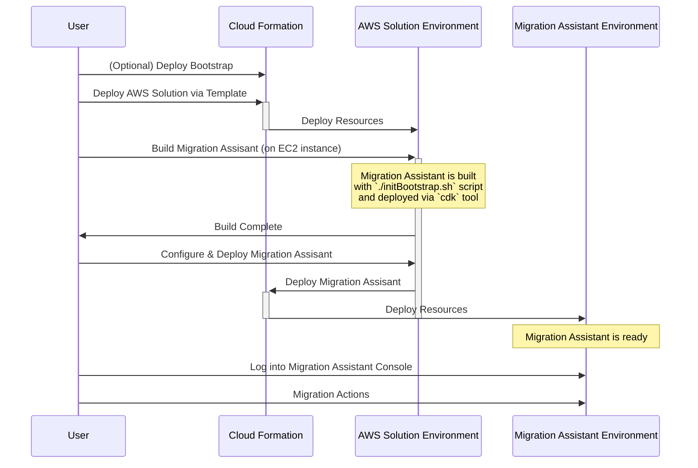

# AWS Solutions Deployment

OpenSearch Migration assistant is distributed in AWS Solutions Library, see the most recent release in https://aws.amazon.com/solutions/implementations/migration-assistant-for-amazon-opensearch-service/

## Solutions Architecture

For the solutions project to allow customization of the feature used by Migration assistant first a bootstrap environment is deployed then a secondary step is used to deploy the configured version of Migration Assistant.  See more details about this configuration options from [options.md](../cdk/opensearch-service-migration/options.md).

