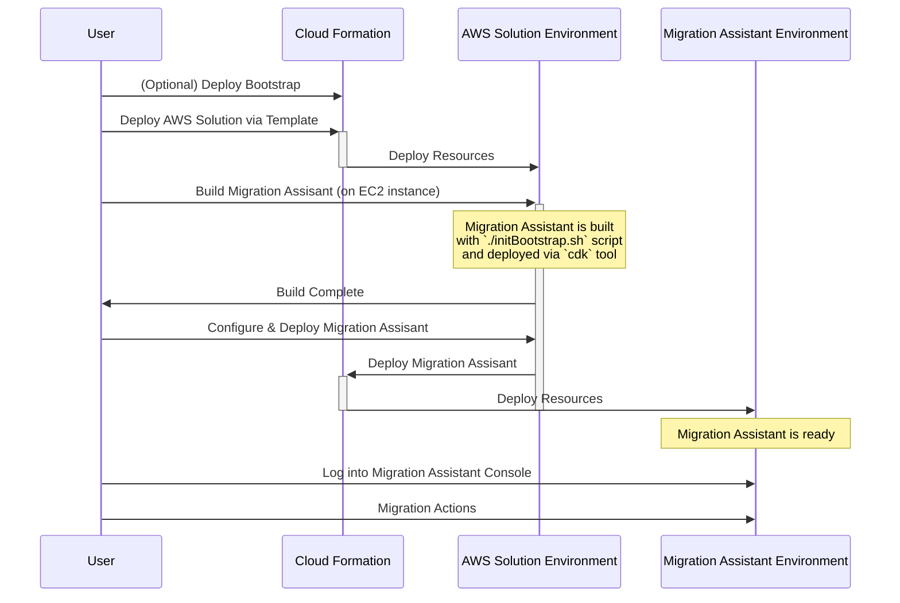

# AWS Solutions Deployment

OpenSearch Migration assistant is distributed in AWS Solutions Library, see the most recent release in https://aws.amazon.com/solutions/implementations/migration-assistant-for-amazon-opensearch-service/

## Solutions Architecture

For the solutions project to allow customization of the feature used by Migration assistant first a bootstrap environment is deployed then a secondary step is used to deploy the configured version of Migration Assistant.  See more details about this configuration options from [options.md](../cdk/opensearch-service-migration/options.md).

### Migration Assistant

The full range of functionality offered by the migration assistant deployed through the opensearch-service-migration project, see its [README.MD](../cdk/opensearch-service-migration/README.md) for additon details.

## Development

This project is writen in TypeScript and uses the cloud developer tookit (CDK) to produce its build artifacts, cloud formation templates that can be used to deploy onto Amazon Web Services.

### Hardcoded AMIs

While using EC2 we have run into issues with AMI's being released that broken our functionality so we are hardcoding all AMIs to ensure the solution will work.  Setup your AWS credentials in the command line and run the script `create-ami-map.sh` in this directory to find the matching AMI in all regions, then update the map inside the solutions stack, [ref](./create-ami-map.sh).

### Quick Start Guide

* Install Node 18+ & Npm 10+ https://docs.npmjs.com/downloading-and-installing-node-js-and-npm
* Build the project `npm run build`
* Test the project `npm run build`
* Create the deployment artifacts `npm run synth`
* Deploy with the default AWS credentials to the default region `npm run deploy`