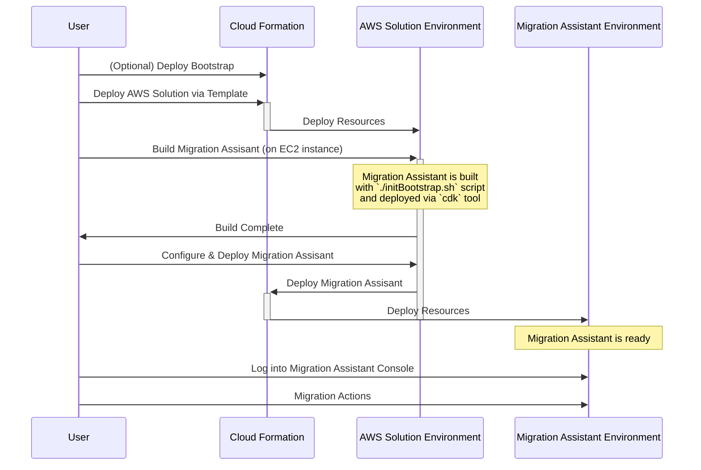
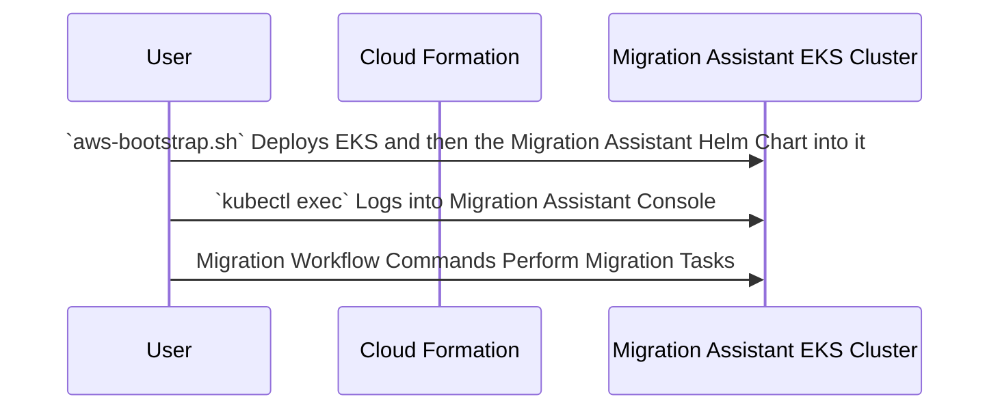

# AWS Solutions Deployment

OpenSearch Migration assistant is distributed in AWS Solutions Library, see the most recent release in https://aws.amazon.com/solutions/implementations/migration-assistant-for-amazon-opensearch-service/

## Solutions Architecture (ECS)

For the solutions project to allow customization of the feature used by Migration assistant first a bootstrap environment is deployed then a secondary step is used to deploy the configured version of Migration Assistant.  See more details about this configuration options from [options.md](../cdk/opensearch-service-migration/options.md).  More details about deploying the solution from a development environment can be found [here](../cdk/opensearch-service-migration/README.md).

## Solutions Architecture (EKS)

The EKS solution has a simpler initial configuration surface.  A user deploys an
EKS cluster via one of the vended CloudFormation templates.  Once deployed, the
user runs the aws-bootstrap.sh script, which can be downloaded directly from
github and run as-is.  Both of these commands can be run from an AWS CloudShell 
or from anywhere else with credentials and network access.  

See [here](../k8s/aws/README.md) for a quick-start to setup and EKS cluster 
and deploy the Migration Assistant to it.

## Development

This CloudFormation projects for ECS and EKS are writen in TypeScript and uses the cloud developer tookit (CDK) to produce its build artifacts, CloudFormation templates that can be used to deploy onto Amazon Web Services.

### Hardcoded AMIs

While using EC2 in the ECS solution, we have run into issues with AMI's being released that broken our functionality so we are hardcoding all AMIs to ensure the solution will work.  Setup your AWS credentials in the command line and run the script `create-ami-map.sh` in this directory to find the matching AMI in all regions, then update the map inside the solutions stack, [ref](./create-ami-map.sh).

### Quick Start Guide

* Install Node 18+ & Npm 10+ https://docs.npmjs.com/downloading-and-installing-node-js-and-npm
* Build the project `npm run build`
* Test the project `npm run build`
* Create the deployment artifacts `npm run synth`
* Deploy with the default AWS credentials to the default region `npm run deploy`
* 