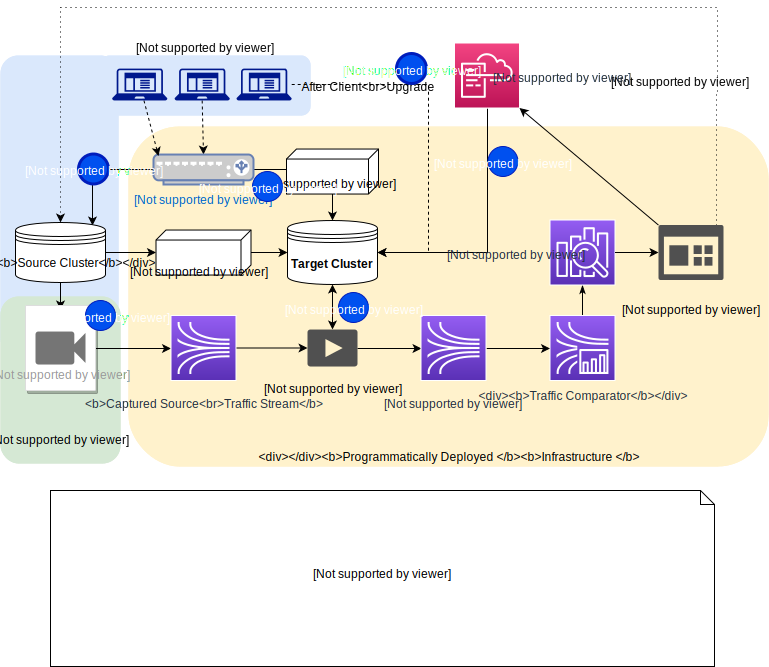
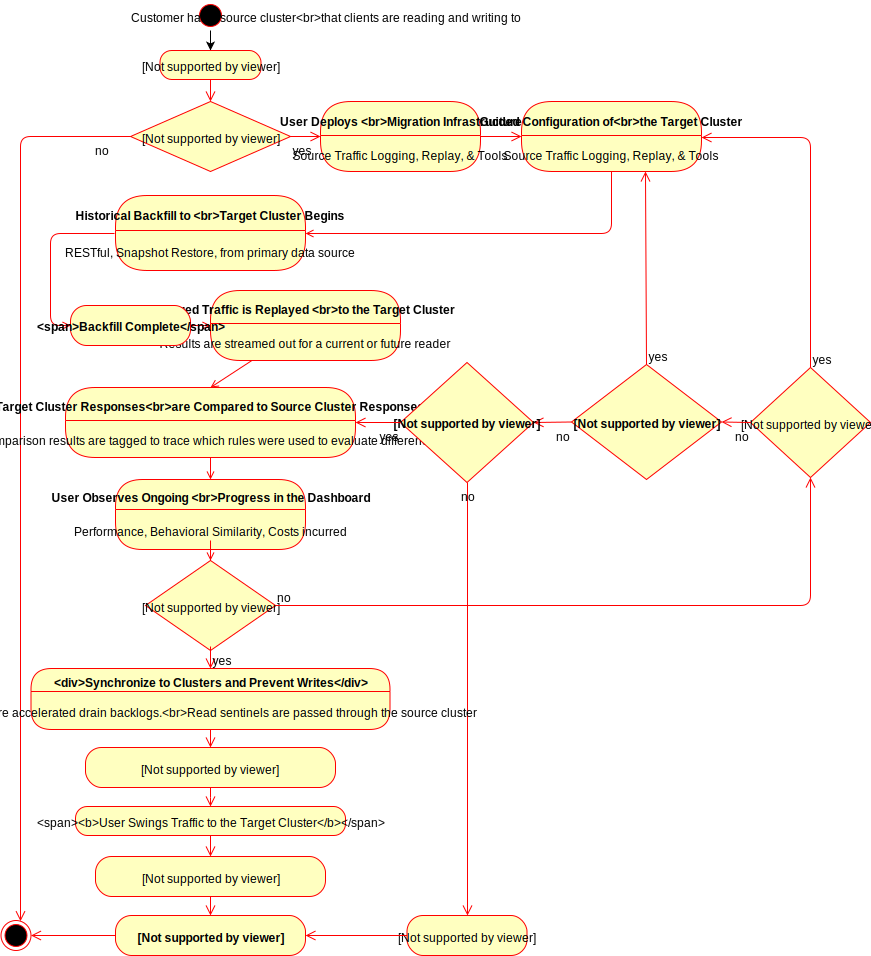
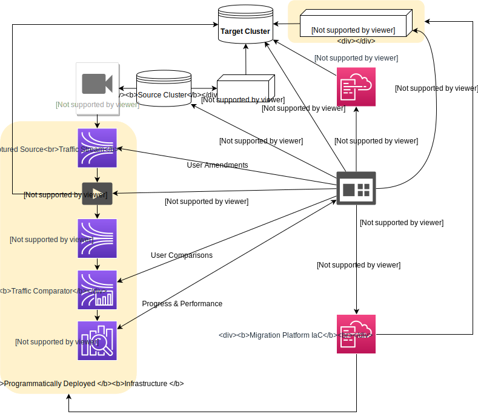
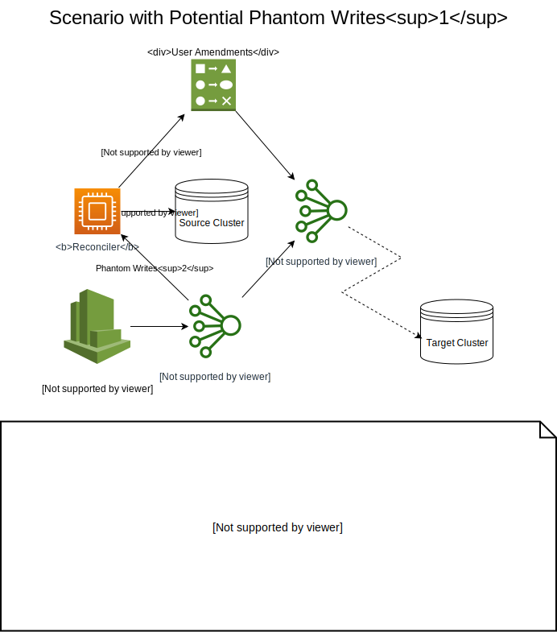
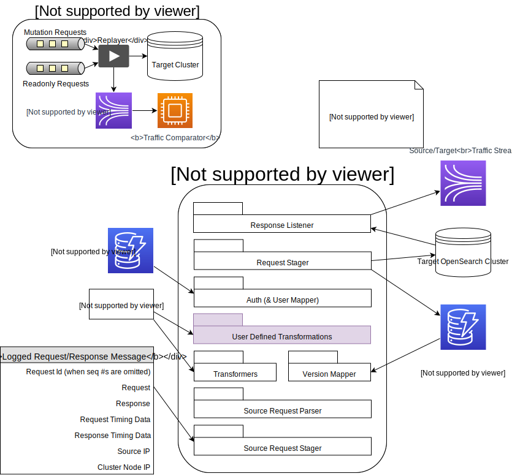
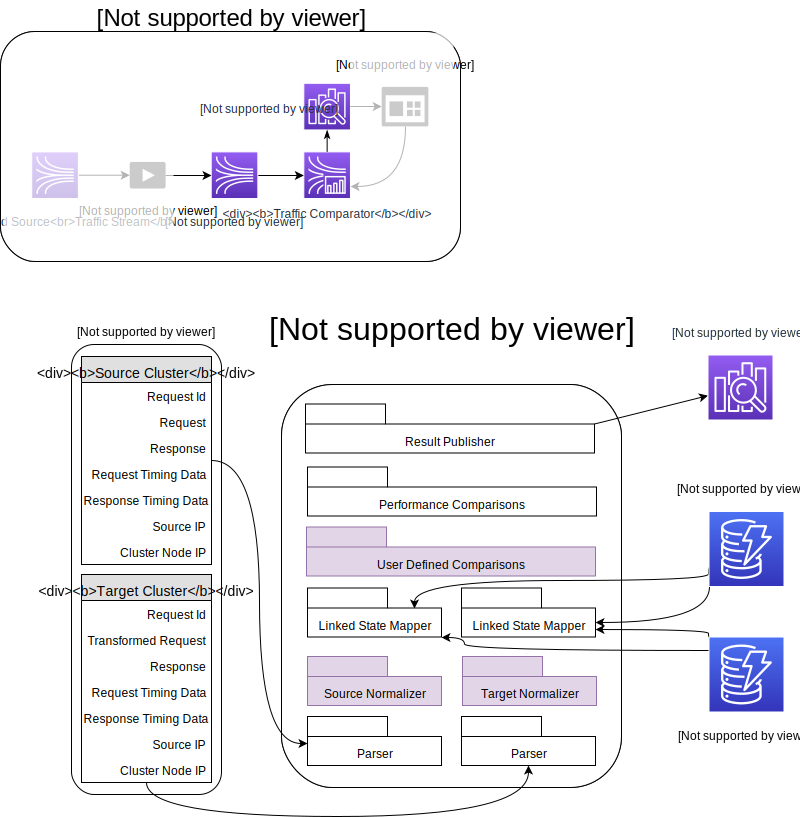
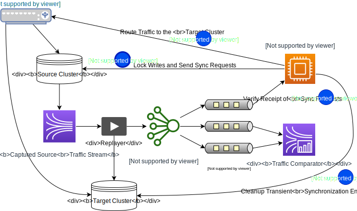

# OpenSearch Migrations Architecture

## Background

Organizations use searchable data stores for a variety of reasons.  Some common use cases are observability where machine produced logs are aggregated into dashboards/alerts and search which can include product search or document discovery.  The size of the data managed by these systems range from terabytes to petabytes and typically sharded over many nodes, making it difficult to reason about the systems in an atomic way.  That difficulty extends to migrating a datastore to new infrastructure or even just upgrading to a new version in a safe way.

In some cases, users may have uncertainties that prevent them from making any transition.  Some of those uncertainties are warranted.  It can be costly and time-consuming to undertake a large migration; regressions in performance or correctness may not be discovered quickly to facilitate an orderly rollback; and there will be little confidence that the worst case outcomes can be mitigated, considering how little practice most users will have with such scenarios.

We are looking to improve the overall migration experience by surfacing failures before production traffic is affected, to automate the transitions between steps, and to provide softer landings when the unexpected occurs.

## Problem Statement

Organizations are normally wary of changing any part of a production workflow. With any change, users are looking to minimize disruptions and surprises. Some of the most challenging aspects for users include transitioning between old and new systems and ensuring that dependencies have been updated to mitigate any changes that will be apparent between the two systems.  The distributed nature of components and dependencies in service oriented architectures complicates these transitions.

Given the amount of state and attention required to complete a migration, in the interest of efficiency for the user, this approach addresses multiple needs in a single unified framework.  Those needs include understanding and preparing for the behavioral differences between the source and target; migrating the data between clusters; game day testing the new environment; and keeping the target in sync with the source cluster for a seamless cut-over, when appropriate.

While anybody would love a “single click” that could do a perfect migration, each user’s environment and specific requirements necessitate careful considerations of the many facets of a migration.  Therefore, our goal is not to design a one-size-fits-all solution.  Instead, we’re considering the best practices for migrations and providing tools that can be snapped (mixed & matched) together into a platform to make it easier, quicker, and safer to migrate onto a new OpenSearch cluster.

## Tenets

* Reliable.  Don’t surprise users: clearly communicate costs, share performance results, and demonstrate differences between systems.
* Safe.  Minimize production impact.  Users need to care about their business and we strive to make them comfortable with the changes that need to be made.
* Supportive, not dismissive.  We manage complexities instead of ignoring them.  Users need tools to minimize the risk and pain of a migration but they remain responsible for judgment calls and policy decisions.  Surface succinct and relevant information for each of them not piles of data.
* Listen.  Migrations are devilishly complicated.  Listen to what users are saying and for what they aren’t able to communicate.  Foster different kinds of feedback channels.
* Cooperative.  Allow users to mold the solution for their own needs and improve the tools.
* Frugality!  Consider costs that are commensurate with long-term costs of running a cluster.  Don’t optimize to zero, but also don’t choose tooling that will cost more than what it will cost to run the service for more than a year.

## Proposed User Narrative

The high-level approach that the rest of this document describes is one to reduce FUD by allowing users to shadow the requests to a prospective replacement cluster, while comparing the responses to find any differences in behavior.  Differences to observe include cost, performance, and in the quality/correctness of the results.  Once the user is happy that the target cluster is performing as they expect it to, the user can proceed with the migration and promote the target cluster into their production workflow, with the target cluster replacing the source one.  If the user wasn’t happy with the results, they can try again with a new cluster, or abort the entire process.

For additional assurances, even after a migration the migration solution can keep the original source in sync so that the migration can be rolled back in case of the unexpected (this feature is not described in detail in this document as it is going to be dependent upon details of writing back into different types of source clusters).

### Background

A user is using a search/analytics data store to handle some “mission-critical” functionality

* Examples could include log analytics for operational health, website search, etc.
* Clients that make inbound requests to this data store may be distributed.  Finding where they all are and who maintains them could be challenging (e.g. some callers might not be actively maintained).
* For security, performance, or cost reasons, a user/admin/organization decides that they should upgrade and/or migrate their data to an OpenSearch cluster, either self-managed or managed.
* Dependencies will be sensitive to downtime, but is more sensitive to unexpected downtime.  The amount of downtime that is acceptable will vary.
* During the migration process, existing production systems should be impacted as little as possible.

### Migration User Journey (North Star)

#### Notes:

* Steps 4-7 can be deployed with IaC (Cloudformation or Terraform) and may be repeated multiple times.  This may be done in parallel , e.g. to find the target cluster that has the best cost-performance ratio, or to remedy a configuration or data consistency defect that was present in a previous run.  After a user is done with a test, IaC can delete the resources.
* Steps 5 & 6 to move data into the target cluster will be main drivers of cost.  As such, these two steps will be configurable to balance finding a representative cluster and keeping costs low, especially for when the target cluster is for testing and not as a prospective replacement.

#### Steps:

1. The user (aka ‘admin’) in charge of coordinating the migration, reads **documentation** from various sources to get familiar with OpenSearch, and the migration tools that we’re building.
2. The admin runs an **Assessment Tool** that consumes their current configuration and allows them to add additional requirements (new features, performance requirements, VPC requirements, etc).  The Assessment Tool gives the admin a report showing known differences between the source and target platform.  As the Assessment Tool is independent of the rest of this story, it will be documented elsewhere.
3. The admin setups up a **Traffic Recorder** to log all requests & responses to the pre-existing source data store.  One size won’t fit all here.  Some solutions may include...
    1. capturing logs from the source data store.  For ES/OS, this might be done through a plugin
    2. exporting logs from upstream microservices
    3. configuring a network capture device in front of the source cluster (e.g. the load balancer)
4. The admin runs a **target cluster deployment** tool that takes the current configuration and additional requirements.  Those requirements could range from, I need 2x as much storage or these indices to ‘I’m only testing my configurations, so do it on 3 tiny node instances).  The tool then deploys a target cluster and fully configures it with the help of some IaC platform (some users have already asked for Terraform).
    1. Multiple targets may be created here if the goal is to find the best fitting target (version for features, hardware/configuration variants for cost/performance).
    2. The admin is able to see long-term cost projections for each of the clusters being configured.
    3. After the cluster infrastructure has been initialized, the cluster is configured.
        1. Node settings are adjusted as appropriate.
        2. Appropriate plugins are installed and configured.
        3. When possible, source configurations (such as those for ILM) are converted into target configurations.
        4. When necessary, users will supply new configurations for behaviors in OpenSearch that are significantly different than they were in the source cluster (e.g. security).
        5. Kibana→Dashboards settings are migrated.
        6. RESTful configurations are made, such as Index Templates are configured.
    4. The admin confirms the full-set of configurations.
        1. A summary is displayed (along w/ cost projections).
        2. Known behavioral differences are shown.
    5. The admin may wish to skip the historical backfill and shadow testing and run simple acid tests to get comfortable with the configuration changes.  After those have completed, the user may tear this cluster down and recreate a new one with the same configurations (which would have been persisted) - or the admin may delete the indices to move to the next steps.
5. As the target clusters are deployed and are operational, the **historical backfill** process is kicked off.
    1. Move all the data up to a point in time (that is after when the Traffic Recorder has started)
    2. Like traffic recording, one size won’t fit all here.  Production data may be extremely large and exporting it in a timely manner could be taxing to production workflows.  Furthermore, we’re considering a number of data sources in addition to those from the ElasticSearch family.  Some export options include.
        1. Configuring Logstash/DataPrepper to pull data via REST.
        2. Taking a snapshot and restoring to the target clusters (the tooling will manage the N+1 impediment).
        3. Pulling data from an external source of truth (splitting Logstash writes, RDBMS, DDB, MongoDB, S3, etc).
    3. Sentinel requests may have to be utilized to capture watermarks that can be used to determine the future boundary between historical data that was restored and requests that will need to be replayed.  This doesn’t need to be perfect, but getting closer will save resources and in some cases, supervision.
        1. Index sequence numbers & terms as well as document versions for these sentinels are stored for later reconciliation.
6. As the historical backfill finishes, the migration tooling kicks off the **replay** of the logged requests from step #3.  The purpose of the replay is two-fold.  It keeps the target cluster in sync with the source and it logs the responses of both mutations and replayed *QUERIES* for further analysis.  This tool is run away from the production pipeline and sends traffic to prospective targets that are not yet part of production workflows, so there’s less sensitivity to implementation.  However, users may want/need to run this in different environments (EC2, GCP, self-managed hardware, etc).  Ideally, the tool can also be distributed across multiple networks (VPCs, regions, etc) to simulate real-world conditions.  Features of the replay include...
    1. Can be configured to replay at original rate or accelerated rate.
    2. The tool can be distributed to meet whatever replay rate is demanded.
    3. Allows for real-time and predetermined management of the replay (pause, stop, restart, speed up, etc).
    4. Response logs can be shared for future processing by the Traffic Comparator (see #7).
    5. The replay sequence for mutating requests (PUT, POST, DELETE, etc) is stable across replays.
    6. The replayer transforms source requests into appropriate requests for the target cluster.
    7. The replay stream can be edited to allow for overrides - newly inserted requests to backfill missing data, reordering specific events, and allowing for new/custom transformations.
    8. The replayer can do different degrees of sampling to reduce time/cost for various types of acid tests (only mutations on this index, no queries of the following pattern are to be rerun).
    9. The stream of results coming out of the replayer can be monitored by a control plane.  That control plane can be triggered by the progress on the streams, or by a UI to perform chaos testing.  The replay pace can be accelerated to put undo load on the cluster or by commands could be issued to the target to create stresses on the cluster (node taken offline, node is undergoing a b/g deployment, node is out of disk space, etc).
        1. ***This is a potential integration point/ask of the managed service.  A number of users complained about a lack of resiliency in their current clusters.  Giving users the ability to degrade their user’s performance in test environments in very well-understood ways would prepare users and lower Amazon’s operational burdens.***
7. As the results from the replayer for all HTTP requests (including queries and control plane commands) are being logged, a **Traffic Comparator** tool compares the responses between the source requests and target requests.
    1. Compares status codes, response content & performance data (latencies).
    2. Contents are normalized and specific types of differences can be ignored.
        1. These normalizations and settings are user-configurable.
    3. Reports are made available so that users can see differences in specific responses and in aggregate.  Alerts and dashboards are also available to show process in real-time.
    4. For performance data, universal adjustments can be made to account for network latencies.
    5. This introduces the supervision phase for a user.  When there are differences, the user can introduce new comparisons, make amendments to the replay request stream to patch data or to ignore some messages, or add new transformations for requests so that they are handled appropriately.  With each of these user-changes, which are always visible to the user, the user can track upstream changes that are necessary to ensure a smooth transition.
8. The admin runs a campaign to upgrade clients and to make appropriate client-side changes to work with the new solution - *and through the switchover process* (see #8).
    1. These changes have been tested in pre-prod environments against alternate target clusters that have been deployed specifically for testing - by rerunning steps 4-7, possibly with smaller sets of data.  Notice that we’re not making any recommendations to place sensitive production data in insecure environments.  It is up to users to determine the best way to do acceptance testing for dependency changes.
9. Upon deciding that a target cluster is a good replacement for the source and that dependencies have been updated, the admin begins the **Switchover** process.  This process can be first carried out in a pre-prod environment with an additional target cluster, separate from the one that will move to production (sort of a shadow-shadow-cluster).  This Switchover process is defined by two main steps - 1) getting to a singular point where two clusters are representing the same ground truth and 2) moving traffic to the target cluster.
    1. To support rollback, the target cluster begins logging all incoming requests.
    2. This process begins by accelerating the replay of traffic to the target cluster that is being promoted.
    3. Basic external checks, like document count, sequence numbers, etc, are run to verify that both source and target clusters are in-sync or are very close to being in sync (with an estimate for how long it will take to get into sync, thanks to recording results from the replay so far).
    4. Write locks are put into place on the source cluster.
        1. This can vary wildly depending on what the source cluster is.  The most important thing is to allow clients to resubmit writes after they had failed due to being in this ‘locked’ state.
        2. This lock could be an authorization lock that still allows queries to go through.
        3. In the worse case scenario, the source cluster could be taken offline.
    5. The external checks wait for the target cluster to be at parity with the source.
    6. The admin makes updates (DNS, load balancer, Logstash, application server, etc) to move traffic from the source to the target cluster.
    7. Clients recover failed requests and the target accepts those.
10. TODO: document rollback scenarios
11. After the user is happy with the transition, alternate clusters, logs, etc are removed.

## High-Level Architecture Diagrams

### Overview

### Activity Diagram (including Switchover)

### Dashboard

### DataFlow of Captured Logs through the Replayer

This diagram depicts how the logs flow through the system for replays and how they are merged with other source such as amendments and extemporaneous queries.

### Ensuring Data Parity

The logging facilities could provide 3 different traits, specifically for requests that have a mutating effect -

1. Guarantee that all requests committed to the source are present in the logs (potential phantoms/overwrites);
2. Guarantee that all requests in the log had been committed to the source cluster (potential missing data);
3. Both of the above.  (this would require support for a 2-phase commit, or to tap into the source’s journal)

Right now the plan is to greatly prefer #1 over #2.  While appealing, #3 likely won’t work for all types of source clusters.  The following diagram shows how #1 will be reconciled to produce a stream whose side effects should match #3.

### Replayer

### Traffic Comparator

### Cutover

## Component Descriptions

### Production Switchover

All the components for replicating and comparing continuous requests need to support, or will otherwise impede, a near seamless switchover from the source cluster to the newly created target one.  The faster that all changes can make it from the source to the target will dictate how quickly cutover can happen, hence the reason that all the components beyond historical backfill are stream oriented.

We will require that we can send requests to the source cluster so that we can observe when they are handled by the target cluster.  Such synchronization requests may be triggers for sensitive operations (like swinging traffic), so those messages should be able to prove their provenance.  A public key pair signature for the request, including a timed nonce, can be included within the user-agent field of the request, which can later be verified and used to determine lag and readiness.  These synchronization messages and their checks will be used in a number of ways to facilitate smooth and expedient transitions.

The synchronization messages can be used periodically to record the lag going through the system and can contribute to advisory signals shared with the end-user.  Those signals can help to choose the best time and to give an estimate as to how long the transition will take.  The synchronization requests themselves can be queries or changes, though some care will need to be taken if those types of requests are logged with different reliability guarantees.

Tools will be vended to show historical traffic patterns to help the user choose the best time to make a cutover.   At the point that the user has decided to initiate cutover, actions 1-4 will be carried out as per the [diagram above](https://quip-amazon.com/ZOW9AXcQF7jN/OpenSearch-Migrations-Architecture#temp:C:RdWcc42c369e0274dd19f92e92d1).

1. The source cluster will be put into a quiescent state, blocking writes so that it stays in a static state while the target finalizes its replication.
    1. While the source cluster has paused making updates, it can still service readonly requests.
2. The synchronization agent waits until the target has received all of the synchronization requests that had flowed through the source cluster.
3. An upstream change is made (LB, DNS, client change, etc) that causes all traffic to hit the target cluster, likely via the compatibility shim.
4. Any entries that may have been added by the synchronization requests are removed from the target cluster by subsequent requests sent by the synchronization agent to the target cluster.

The user will eventually migrate their clients, if necessary, and will bypass the compatibility shim, but this can be done as users sees fit without impacting downtime.  This, and other details, such as enabling logging on the target cluster and/or shim may have an impact on the user’s ability to quickly rollback after the target cluster has been promoted.

See the [Concerns Section](https://quip-amazon.com/ZOW9AXcQF7jN/OpenSearch-Migrations-Architecture#temp:C:RdW788a95de11c045efb20ee8fad) below for specific issues that will be required when building the switchover apparatus as well as the rest of the streaming components.

### Migrations Dashboard (Orchestrator)

The Migrations Dashboard is meant to be the single place that users go to understand and manage the migration of their cluster.  For now, we’re assuming only a single cluster, though in the future, this could be extended.  Being a single ingress point for so many different responsibilities makes access control a concern.  Should a dashboard be exposed at all, should it be on the internet, should it have fine-grained user access control, how should such configurations be made?

A simple approach could be to setup several different roles - one to view configurations and progress, but no data; another to view data (comparisons); and another to do management operations, such as creating a new target cluster, deleting failed clusters, and initiating switchover (pausing the source cluster, running a command to update the load balancer).  Authorized users can assume those roles and all of the interactions should be audited.

Cloud providers, such as AWS, etc, have native support for the scenario outlined above via IAM and audit logs.  For users migrating *into* such environments, such services will be familiar or will soon need to be for them.  Keeping consistent use of such tools could be a major simplifier for users.  The UX for the management and data concerns will need to be resolved.  We’ll have to balance between the best, secure experience for our managed service users and an easy-to-use open source platform that we can iterate with.

The current straw man is that the admin can bring the dashboard up in a private network and gate it with a simple AuthN scheme that of their choosing, sans fine-grained auth-control.  Additional layers for granular access can be layered for different cloud environments.

## Related Technologies

### Historical Backfill

The Historical Backfill can be done with off-the-shelf tools today.  LogStash can consume data from one data source and deposit it into ElasticSearch/OpenSearch.  DataPrepper is implementing similar behavior and is under active development.  Other options such as CCR, snapshot restore, and remote indexing today are options for some source→target migrations, though they won’t work to migrate from source environments not in the ElasticSearch family.  Other future techniques like transforming snapshot/backup files directly into OpenSearch index files could also be a major win for some users.

Exciting, new mechanisms, which may be faster & cheaper can be undertaken, but they don’t fulfill a requirement to reduce FUD for users.  As such, any of those new components would be outside the scope of the migration solution described here and would simply be additional backfill modules that can be “plugged in”.

Given that there are already many options off-the-shelf that we can leverage, we’d like to start with these.  We can simplify the UX around setting up the transfers and the transition between bulk loading to online-loading with validations, reducing the cognitive load for users - especially if the backfill is repeated across multiple target clusters.

### LogStash/DataPrepper

These tools are primarily concerned with streaming data from one source into a sink, buffering, enriching and transforming the source data as appropriate.  Some specific requirements for the migrations platform that don’t seem relevant for DataPrepper include:

1. Comparing responses between multiple clusters
2. Running queries, not just mutations - and comparing differences
3. Coordinating with sensitivity/chaos testing
4. Supporting a semi-supervised manner that allows users to iterate

## Concerns by Component/Phase

The following points by component list some of the main concerns that will need to be addressed within the design documents for each of these components.

### Migration Dashboard

* AuthN & AuthZ - especially for an opensearch distribution
* How do we keep costs down?
    * An OS cluster will be expensive
    * Deploying control planes as lambdas + API-GW is a lot of complexity for a user
* What are the control plane calls that we might want a user to invoke from the AWS Console?  How would those calls interface into resources deployed into the user’s account?
    * Probably via a multi-tenant control-plane managed by AWS.  An OpenSearch-Migrations Service Principal will likely call back into resources on the user’s account.
* UI can leverage OpenSearch Dashboards.
    * Allows OpenSearch to eat our own dog food.
    * OpenSearch is good at aggregation reports, making it a good consumer of the final output coming from the traffic comparator.
        * This might be expensive for the load that we could be sending in.
    * Will work well for a completely managed solution vs an OpenSource one.
    * We’ll have much more flexibility in look and feel and to add additional components.

### Traffic Recorder

This may have the largest impact to a production workflow.  It is also the one that is impossible to get right 100% the time in the general case.  Concerns for the existing production workflow include

1. Adding additional latency and reducing throughput of operations already running.  Some clusters may be at or near capacity already.
    1. Can we vend a plugin that can, with reasonable reliability, offload traffic in a nearly imperceptible manner (<1% impact to latency/throughput)
    2. Will users be willing/able to install such a plugin?  Will the total solution on the source architecture be able to offload the logs to a final destination that the replayer can pick up?
2. The accuracy of the logs may not reflect the reality of how the source cluster handled requests.
    1. When possible, can we allow the recorder mechanism to induce a performance hit for the source to guarantee that all requests are offloaded to logs?
        1. Notice that this doesn’t say, all requests that are processed successfully are offloaded.  Doing this, without deep support for a 2-phase commit approach, which is infeasible, means that some requests definitely logged will NOT have been processed correctly.  If the fault plane of the coordinating node and the logging are aligned (e.g. same process or machine), any failure in the coordinating node could create a false-positive.
        2. Notice that when a response is generated, our downstream systems can be entirely sure of whether the request was committed or not.  The ambiguity arises when a response isn’t found, which while relatively rare, still needs to be reconciled.  The only real advantage here is that discovery of missing items becomes much simpler.  There’s no risk of additional strain on the source cluster to find the missing mutation, which could be very expensive to track down in the case of an update (effectively, running a full-scan on an index’s documents).
    2. The replayer and comparator will need to work to mitigate data gaps that may have occurred in the logs.
    3. Should all nodes issue wire logs for all requests to allow redundancy checks on responses to minimize the likelihood of error?  This would create a wider performance impact and a much greater cost in offloaded data processing, though the logged items could likely be quickly deduped in stream processing before the replayer.
    4. Is it sensible to bootstrap wire logs with additional normative information - like from the translog (or equivalent)?
3. Source traffic that is in TLS creates a host of technical and security challenges.
    1. Can we vend a plugin story that isn’t crazy complicated to install and configure, especially if TLS is configured inside the process?
    2. Are there any users willing to use a session-key-interceptor that would allow us to recover encrypted traffic.
    3. Would any users be amenable to changing their TLS termination story on their production workflow?
4. How will we handle logs that could be enormous and contain sensitive data?
    1. What options should we support offloading logs to?
    2. Should offloading traffic require TLS?  What if a user isn’t using TLS anywhere for this workflow?
    3. Will we need to force users to use AuthN/AuthZ models that they aren’t comfortable with?  (like IAM and policies, or even just OpenSearch controls from the security plugin)
    4. When should the logs be encrypted at the “application level”?  What should the key be?  This is straightforward with KMS for an AWS solution.  Other solutions will require the AWS teams to explore.

#### ElasticSearch Plugin

An existing POC implemented a NetworkPlugin and provided a new http.type.  That only works if a security plugin doesn’t try to override the type itself w/ its own SSL enabled pipeline.  There are a number of bad options that are apparent today.

1. Maintain a logging+securityplugin for every version of every security plugin.
    1. This isn’t feasible for the ES X-Pack solution.
2. Write a logging plugin that itself can handle SSL & keep the same user-facing interfaces to configure it (certs, ciphers, etc).
3. Patch netty itself to support logging.
    1. To do this at high-performance and within the bounds of the typical network/security plugin, the means to do this may be limited to only network traffic.  E.g., a “sidecar” traffic accepting plugin could be instantiated that opens a local port on the server & then consumes the logs and offloads them as planned (e.g. memfs→cloudwatch).
    2. Are there alternates to allow a monkey-patched netty class to discover other instances loaded by other class loaders? (@schohn can’t think of any ATM)
4. Have a user disable TLS & do it out of process.

#### Wire Capture

There aren’t many solutions to capture plaintext requests and responses for TLS encrypted traffic.  Anything would require a session-key-intercept solution to be in place on the hosts of the source data store services.

The next question would be, can capture be instrumented on the existing nodes or on any other machines in the middle?  If not, what would be the best scalable solution?  We have a POC that uses HAProxy as a pass through.  That solution tried to log requests and responses directly, not packet for packet.  The memory footprint and performance suffer at large scales.  The replay tooling is built to handle packet traffic, so we could do that much more efficiently.

#### Proxy (TLS MITM)

The complexities here, other than getting users to deploy new HA infrastructure may be around certificate management.  The user would need to move their private key to the new proxy.

### Target Cluster Deployment

Eventually, this should have good models of what users have and how to project those configurations and requirements into a target cluster configuration.  This is challenging and interesting, but should be tractable, especially with the comparison step to validate if the choices made were good ones.

* How will we scan for non-RESTful settings (e.g. file settings)?
* How are requirements going to be specified?
* How can we let a user quickly the how settings will impact their applications?
* Target/Managed Service Interactions:
    * How will we surface future enhancements back to the managed service teams (user needs this plugin)?
    * How will we configure advanced settings (repeatedly) that may need to be done via ticket?  Are there any of these?  (I feel like JVM settings might be)
* Users will expect the deployed resources to be through the IaC that *they’re* comfortable with, not just through CloudFormation.
* How accurately can we calculate costs?  What about VPC charges?
    * How accurately can we estimate the cost of testing and using the migrations tools.  These could be more open ended, depending on how much traffic is being replicated, than the cost of a a set of nodes running for n-hours.
* What’s a really fast and dirty way to get expertise on mapping source configs and requirements to a best configuration for cost vs performance?

### Historical Backfill

This could be CCR, Snapshot-Restore, using REST-APIs coordinated by DataPrepper/Logstash.  The most important aspects here are...

1. Knowing where the backfill ended, specifically relative to the traffic logstream.
2. Minimize the impact of pulling data from the source does not put excess strain, which is defined by users, on the production workflows.
3. Some users will be able to bring their own data.  Our interface should be very straightforward, but needs to include
    1. When is the process done?
    2. How can we find out what is the first mutation that was NOT included in the just-restored target cluster?
4. Different mechanisms will produce different results in subtle ways.  E.g. running documents through analysis again.
5. Dimensions to be aware of - overall cost, time, fidelity, load on the source cluster.
6. We might come up with some new, super efficient, super tuned mechanisms to do this.  If we do, these should be contributed in whatever packages gives them the most visibility.  Some new ideas could include Upgrading from snapshot (EMR reindex); starting from a volume snapshot; having OS support maintaining legacy versions.

### Traffic Streaming

* Ordering *really* matters for requests that cause side effects.  It may be possible to reconstruct an ordered stream that matches the source cluster by reconciling the stream against the translog.
* Ordering by index will break down for bulk requests - synchronizing a bulk request across a series of single-index requests will be more difficult to scale.
* Per-index ordering may not be possible for all other data sources.  Intermediary steps may be required to project requests into denormalized per-index requests.  How would that be captured for a compatibility shim, if it isn’t being done within the replayer.  The reason that it wouldn’t be done w/in the replayer would be if it was too much work for a single replayer.
* In the absence of [sentinel/synchronization requests](#production-switchover), in a multi-node environment, how long should the stream wait to process messages before deciding that it can proceed up to some previous point?

### Replay

The replayer needs to be able to take packets and reconstruct them into well-formed requests.

Transforming messages from a different source type will be challenging.

* Some source requests may need to be split into multiple target messages.  How do we transactionally know which parts have sent in case of a failure?  With a failure, how do we recover responses?  Even with durable storage, updates could be lost after the request was fully handled - unlike the source case, the target case cannot guarantee a response is logged!
* Should the final, well-tuned transformations be able to be leveraged by proxy solution (compatibility shim), post switchover, that could help bridge old clients to the new service?
* There could be hundreds of different mapping rules that need to be applied.  How should a user write these rules, especially to leverage a stock library of starting transition?  (Off the shelf-UI tools exist for message mapping, sometimes in XSLT).

Other concerns include...

* Sequence numbers for optimistic locking will need to be rewritten, meaning that all sequence numbers will also need to be stored in a map.  This may or may not need external storage, especially if the new sequence numbers are deterministic given a request stream and a starting state.  We (hopefully) only have one compute making mutation requests (see the note below about master nodes), so shouldn’t be accessed by multiple nodes.
    * Some requests may be rewritten into multiple requests (a bulk update turns into many single-document updates).  Some mutating requests may be filtered out from running.  Those differences will cause the stream of sequence numbers to grow independent of each other.  To reconcile the realized numbers into the logical numbers from the source, index, and document version mappings will need to be updated for each target response.  For requests that are to be ignored (don’t PUT documents of this form), the replayer still needs to recognize that a request was skipped and update the mappings so that subsequent requests in the source stream can have their version numbers mapped appropriately
* How does fault tolerance work?  Reminder - we’re always projecting to the latest version of OpenSearch, so we can leverage more features (like optimistic writes).
    * How do we guarantee that the replayer has sent each mutating request to only make a change once?  PUT & DELETE are OK to resend, since repeated ones shouldn’t cause side-effects.
    * POST likely require optimistic concurrency checks.  That will mean adding them if they weren’t present.
* Honoring causality within each index, across a distributed replay framework will be a challenge.  However, indices are all channeled through “master nodes” today, so there shouldn’t be an unmanageably large amount of data to pass through a single point of control, at least for only mutation traffic.  Readonly traffic can be distributed over many nodes.  Getting sync-points to make sure that the reads are after the requisite commits is another challenge (take a look at [this framework](https://docs.rs/timely/latest/timely/) for some ideas).
* Being able to control replay speeds, to preserve that causality, especially considering transient failures that can happen may be a challenge.
* Replicating precise network behavior is nice to have, but slightly wonky after messages have been transformed.
* We should be able to run replayers from different VPCs to simulate IP the actual traffic and to confirm that of network rules are functioning - but setting that up to maintain some notion of causality across a more distributed system could be extremely difficult.
* As it needs to make changes during runtime, it will need a way to get control commands.
    * The Replayer will need to speed up to catch up at times and run in “realtime” at other times.
    * A dedicated configuration update stream may make more sense than to embed an HTTP API.
* Latencies will likely be measuring different values than the traffic logs did - are there additional calibration requests that should be made so that more representative values can be displayed to the user?
* The Replayer may need to run at slower rates, though subsampling will likely be handled upstream in the streaming system.

### Traffic Comparator - in progress

* How do we run user code?  What should “user code” even be?
* We can probably scope a fairly tight environment that is lazily loaded, like here are the mutating messages around n-seconds of this request.
* Can we leverage DataPrepper’s models to parse requests?
* Does a batch/hybrid solution make sense here, especially for rerunning comparisons after the normalization/comparison rules have been updated?  MapReduce could be a LOT more efficient than rerunning the stream.
* Being able to explain in what ways things were different could be super valuable.  e.g. 33%

### Production Switchover

As mentioned in the description, switching production traffic to the target is the driving factor behind nearly every other design decision.  Some considerations across the architecture include...

* What can sentinel/synchronization values look like, especially for mutating events.
* There should be SOME automated checks, especially defined by the end user, from the point that the user proceeds with cutting over traffic until the targets are synchronized.  What should those checks look like?  How long might they delay the process?
* Is the “Synchronization Orchestrator” simply the control plane for the migration dashboard (orchestrator)?
* Should the stream solution always be parsing/listening for synchronization requests or just when it’s required (probably all the time to help w/ the latency questions - but what’s the cost)?

## TODO

- [ ] Rollback post switch
- [ ] Dashboard parity testing
- [ ] Legacy External Transport node clients (9300 non-http protocol)

