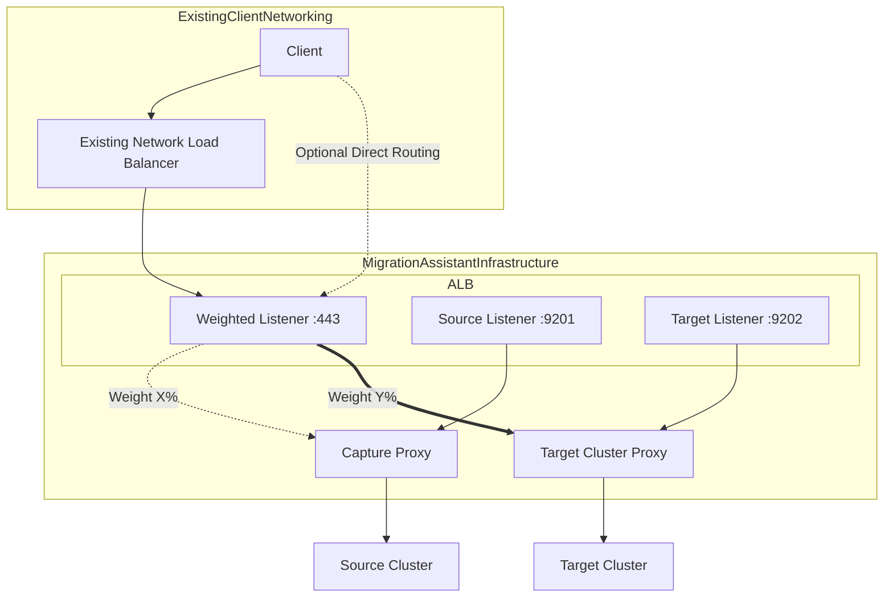

# Application Load Balancer: Routing Traffic for Migration

## What is an Application Load Balancer?

An Application Load Balancer (ALB) is a service that manages and distributes incoming network traffic across multiple targets, such as servers or containers.

## How Our ALB Works

Our ALB is configured to manage traffic for different components of our migration system. Here's a straightforward explanation of its operation:

1. **Single Entry Point**: The ALB serves as a single point of entry for all incoming requests. Users and applications only need to know one address to access our services.

2. **Secure Communication**: All communication with the ALB is encrypted, ensuring data privacy and security during transmission over the internet.

3. **Intelligent Routing**: The ALB uses different ports to direct traffic to various services. Each port corresponds to a specific service within our system.

## Services and Listeners

Our ALB is set up to route traffic to these main services:

1. **Capture Proxy** (Port 9201): This service records incoming traffic and forwards requests to the source cluster.

2. **Target Cluster Proxy** (Port 9202): This service forwards requests to the new cluster we're migrating to, acting as an intermediary between the ALB and the target cluster.

3. **Weighted Proxy** (Port 443): This forwards requests to either the Capture Proxy or Target Cluster Proxy based on configuration, see [Weighted Proxy](#weighted-proxy)

## Weighted Proxy

A key feature of our ALB is its ability to distribute traffic between the old and new systems. This is accomplished using the weighted listener on port `443`:

- The ALB can direct a portion or all of the requests to either the Capture Proxy or Target Cluster Proxy.
- We can adjust the traffic distribution between each system, allowing for a gradual transition.

This feature, known as weighted routing, operates as follows:
- Each route (Capture Proxy and Target Cluster Proxy) is assigned a numerical weight.
- The ALB distributes traffic proportionally based on these weights.
- For example, with weights of 80 for Capture Proxy and 20 for Target Cluster Proxy, 80% of traffic would go to the source cluster and 20% to the target cluster.
- These weights can be adjusted in real-time, allowing for precise control over the migration process.

This weighted routing is valuable because it allows us to:
- Test the new system with actual traffic while maintaining the old system's operation (careful planning is needed to prevent data loss).
- Incrementally increase traffic to the target cluster, ensuring a smooth migration (again, careful planning is needed to prevent data loss).
- Quickly modify traffic distribution or revert to the source cluster if issues arise.

## Benefits for Your Migration

Using this ALB setup offers several advantages:

1. **Flexibility**: We can easily adjust traffic routing without modifying anything on the user or application side.

2. **Safety**: The ability to split traffic enables safer, more controlled migrations.

3. **Monitoring**: We can observe how both systems handle traffic during the migration process. And collect top level metrics from the ALB.

4. **Seamless Transition**: Users and applications experience no disruption as traffic is shifted to the new cluster.

5. **Smoke Testing**: Ports 9201 and 9202 can be used for preliminary testing before shifting client traffic:
   - Port 9201 (Capture Proxy): Test requests can be sent here to confirm that the source cluster is still accessible and functioning correctly through the ALB.
   - Port 9202 (Target Cluster Proxy): Send test requests to this port to verify that the new target cluster is properly set up and responding as expected.
   - By testing both ports, we can ensure that both the old and new systems are working correctly before gradually shifting real client traffic using the weighted routing on port `443`.

   This smoke testing process allows us to:
   - Verify the ALB configuration is correct for both source and target clusters.
   - Identify any potential issues with either cluster before exposing them to real client traffic.
   - Gain confidence in the migration setup before initiating the actual traffic shift.

By utilizing the ALB in this manner, we can ensure a smooth, controlled, and safe migration process, minimizing risks and disruptions to your service. The ability to perform smoke tests on specific ports adds an extra layer of verification and safety to the migration process.

### Architecture Diagram

