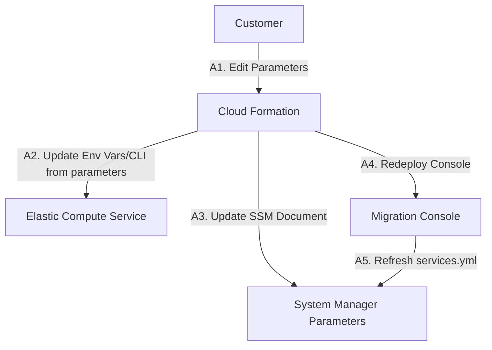
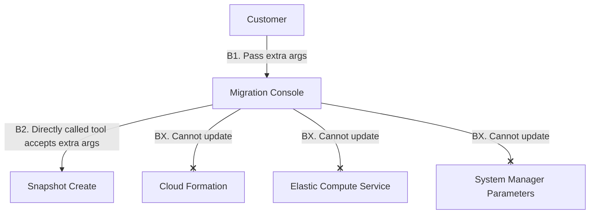
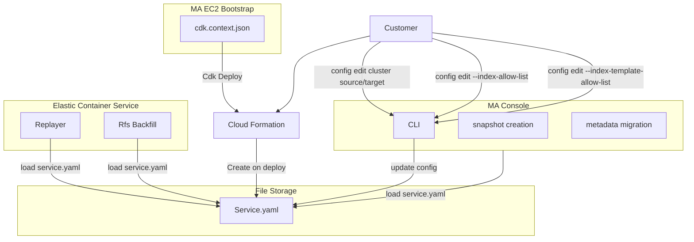

# Controlling the Migration Assistant Control Plane

Migration Assistant (MA) has several distinct workflows that affect how the different parts of MA work together.  Ideally by editing a value once, it will be consistent in all tools as users would expect. 

## Customer Scenarios

* Customer needs to swap out credentials for target cluster
* Customer refines the list of indices they want to migrate
* Customer needs to switch to a different target cluster
* Customer switches to a self managed Kafka instance.

### Why are these scenario difficult today?

* ECS task based tools are only modifiable by CDK deployment
* MA Console based tools allow overrides, but these are not savable
* It is not obvious what settings need to be treated differently by the CX
* Deployment takes time, pushing customer out of iterative workflow

#### Update parameter in cdk.context.json, then deploy

#### In console pass extra command line args

### Recommendation: All tools read from a single file
Within the MA Console the services.yaml contains nearly all of the details that are of interest to the different tools.  

1. Having all tools adopt `check services.yaml on startup` will ensure changes are propagated and reduce the amount of extra system consideration that is needed.
2. Move CloudFormation focus to deployment infrastructure, remove all parameters that are in `services.yaml`. 
3. Customers need a way to make updates to `services.yaml` that with a degree of guardrails, if they are updating the target cluster and backfill/replayer is running they should be able to be warned.

#### Desired State

#### Service Upload Flow

For the services that are short lived, such as create snapshot or curl.  The configuration would be loaded during application startup and never re-checked.

> [!Note] 
> There are services that are long running, this creates some user experience questions.
> * For RFS config changes can alter the shape of the migration which is defined once, should that run to completion or be stopped?
> * For Replayer the transformation would be passed via this mechanism, should they be reloaded as they come in?    

### Read from AWS Parameter store
Parameter store is a centralized system within AWS and it build for parameter management.  It is not recommended as it creates vendor lock-in on AWS.

The same is true of any proprietary system. 

## Appendix

#### Scenarios out of scope.

* Customer wants to fully redeploy MA from the Console
  - _Parts of MA might be updated/modified by the console, but there will be a set of core infrastructure that cannot be modified by the console_
* Customer wants to change the VPC of MA
   - _Requires a redeployment of the MA stack(s)_
* Customer wants to make a permission change
  - _IAM roles can be updated outside of MA in AWS Console/CFN_
