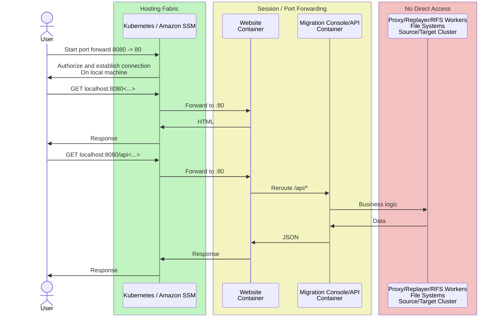

# Migration Assistant Frontend

Migration Assistant helps customers with the complex task of replicating their Elasticsearch and OpenSearch data to a new destination. While it's possible to drive these actions via the command-line interface, this approach increases complexity, making it challenging to inspect data and perform operations simultaneously. Command-line tools are also limited in how they can convey critical versus useful information. To address this, Migration Assistant is constructing a front-end user interface, henceforth referred to as "Frontend," to guide users through all the phases of Assessment, Setup Verification, Metadata Migration, Data Migration, Validation, Switchover, and Cleanup.

To support these scenarios, Migration Assistant includes several areas of focus. Below are details on these core areas:

- **Authorization:** Limits access to the Migration Console.
- **APIs:** Transforms actions in the Console Link into APIs.
- **Stateless Website:** The frontend website will have no stateful information.

### Authorization

Authorization is currently managed by limiting access to users who can start an SSH session with an EC2 instance or execute `bash` on the Migration Console ECS container.  We will ensure this same level of access control with the `kubectl port-forward` or `aws ssm start-session` command to open a port to the webserver that is only accessible on the local host by navigating to `http://localhost:8080/`.  While websites are accessed by navigating to a well defined URL this would create complexity for on prem and different cloud providers as they will have varied capabilities, this approach will align with the long term vision to run Migration Assistant on Kubernetes.

### APIs: Transform actions in the Console Link into APIs

Executing actions on the Migration Console uses the [console link](../migrationConsole/lib/console_link/README.md) command-line utility to define and control these actions. This tool is highly powerful and often serves as the initial platform for new features; as features mature, they will be integrated into the user interface.

To enable website access to console link functionality, we will create an API layer. Existing tooling supports this space, and we will expand on its functionality.

### Stateless Website: The frontend website will have no stateful information

While the website will make calls to access Migration Assistant state, make updates, and trigger events, it will be stateless itself. The site will not have session state, trackers, or cookies—except for the authorization token. There will be no user customization features either.

This approach supports using a simple ngnix server. For developers, this means a `serve & watch` workflow will be easily usable with local deployments.

## Overall System Architecture

Migration Assistant consists of data stores and compute clusters described in detail in [Architecture](./Architecture.md). These architectural components will remain unchanged; functional changes will be driven by specific requirements, with no major adjustments needed to integrate the Frontend system.

### Authorization

Operators of Migration Assistant will forward ports from the webserver onto their local machines and access the website via a browser pointed to that port.  This port tunnelling process limits the need for additional infrastructure and permissions associated with authorization.

#### Components with No Direct Access

While users will access the website, the website it will only connect to the Migration Assistant API.  This ensures the website is decoupled from all other systems or dependencies, allowing for near immediate startup.  This setup encourages writing testable APIs and channels functionality through standardized interfaces, limiting exposure to components and systems.

> [!NOTE]
> This restriction is only on how the website is authored and has no impact on existing architecture.   Access to Migration Console CLI, AWS Console and AWS CLI will remain unaltered.

### Stateless Site

One advantage of a stateless website is that if the Migration API goes down and returns, it doesn’t prevent the web pages from loading. As we iterate on the architecture of Kubernetes/EKS/ECS, this should allow the API-providing container to start and stop with configuration changes without impacting users.

> [!NOTE]
> Migrations are *stateful*, so data stores are required, but they will be accessed through the API rather than a browser session.

### Website Architecture

With a stateless frontend required by the overall architecture the website assets will need to use JavaScript to interact with the Migration API.  Lets review the high-level components that will be part of the website architecture

### Serving Content

The web content will be in a container running nginx, this is a lightweight platform that requires few resources to run.  For requests against the `/api/*` path these will be forwarded onto the Migration API which reusing the communications channel.

#### Language

[Typescript](https://www.typescriptlang.org/), already in use in this project for CDK.  OpenSearch's frontend OpenSearch-Dashboards is built with Typescript. Finally all of the AWS Console components for OpenSearch are built with Typescript.  Its a great choice with its huge developer community and numerous library and tools vended with npm.

#### Design Language

[Cloudscape](https://cloudscape.design/) is the open-source version of AWS Console's UX.  Being that current set of maintainers also work on UX design at Amazon there is clear skill set alignment.

The components of Cloudscape use React, and therefore the majority of the component design will follow this model for consistency even for the few custom components.

#### Application Framework

[Next.js](https://nextjs.org/docs) providers routing, caching, and packaging.  The packaging system of Next.js can compile all our web assets for deployment.  While there are other lighter  weight frameworks out there the critical workflows of client-based site development, simple routing and caching approaches and static asset deployment align with our purposes.

#### Developer Velocity

*Linting*

Linters will be enforced for best practice management and code styling.  All website components will follow these tooling that are available through NPM.  Next.js has [default conventions](https://nextjs.org/docs/app/api-reference/config/eslint) for both eslint and prettier and we will enable them in our CI workflows.

*Local Dev*

Next.js comes with a [dev webserver](https://nextjs.org/docs/app/api-reference/cli/next#next-dev-options) that runs all pages as part of a sever-side website.  While this is slightly different experience from the static workflow writing code and seeing an update to the UX occurs in sub-second time frame - perfect for quickly iterating on layout and routing logic.

*Testing*

With a decoupled backend, a mock response library will be configurable as the api layer to serve as UX reference.  When there is sufficiently complex logic that requires testing [Jest](https://nextjs.org/docs/app/building-your-application/testing/jest) is the library of choice that provides a framework for test declaration and snapshotting for UX components.  Finally for end to end testing [Cypress](https://nextjs.org/docs/app/building-your-application/testing/cypress) supports headless and full dom based testing with clean reporting and validation.
