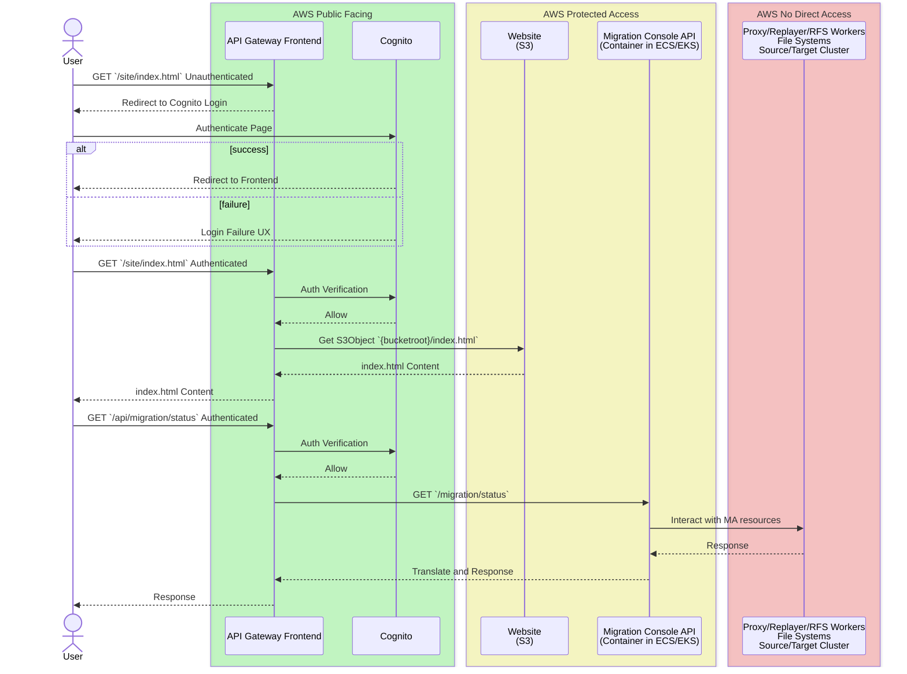

# Migration Assistant Frontend

Migration Assistant helps customers with the complex task of replicating their Elasticsearch and OpenSearch data to a new destination. While it's possible to drive these actions via the command-line interface, this approach increases complexity, making it challenging to inspect data and perform operations simultaneously. Command-line tools are also limited in how they can convey critical versus useful information. To address this, Migration Assistant is constructing a front-end user interface, henceforth referred to as "Frontend," to guide users through all the phases of Assessment, Setup Verification, Metadata Migration, Data Migration, Validation, Switchover, and Cleanup.

To support these scenarios, Migration Assistant includes several areas of focus. Below are details on these core areas:

- **Authorization:** Limits access to the Migration Console.
- **APIs:** Transforms actions in the Console Link into APIs.
- **Stateless Website:** The frontend website will have no stateful information.

### Authorization

Authorization is currently managed by limiting access to users who can start an SSH session with an EC2 instance or execute `bash` on the Migration Console container. The Frontend website for Migration Assistant will be more accessible than before, requiring additional security measures to directly authorize users.

### APIs: Transform actions in the Console Link into APIs

Executing actions on the Migration Console uses the [console link](../TrafficCapture/dockerSolution/src/main/docker/migrationConsole/lib/console_link/README.md) command-line utility to define and control these actions. This tool is highly powerful and often serves as the initial platform for new features; as features mature, they will be integrated into the user interface.

To enable website access to console link functionality, we will create an API layer. Existing tooling supports this space, and we will expand on its functionality.

### Stateless Website: The frontend website will have no stateful information

While the website will make calls to access Migration Assistant state, make updates, and trigger events, it will be stateless itself. The site will not have session state, trackers, or cookies—except for the authorization token. There will be no user customization features either.

This approach supports using the Frontend in AWS cloud scenarios or on-premises. For developers, this also means a `serve & watch` workflow will be easily usable with local deployments.

Deployment customization will be done through a configuration file that includes the API endpoint.

## Overall System Architecture

Migration Assistant consists of data stores and compute clusters described in detail in [Architecture](./Architecture.md). These architectural components will remain unchanged; functional changes will be driven by specific requirements, with no major adjustments needed to integrate the Frontend system.

### Authorization

All traffic will route through API Gateway (APIG), which will use different authorizers for authorization. The `CognitoUserPoolsAuthorizer` leverages Cognito User Pools with its UX to sign in users. After completing the login flow and being redirected back to APIG, either static resources or API calls can be routed into the protected access environment.

#### Components with No Direct Access

While the Frontend can access the website S3 bucket and Migration Assistant API, it will not have access to other Migration Assistant resources. This setup encourages writing testable APIs and channels functionality through standardized interfaces, limiting exposure to components and systems.

> [!NOTE]
> This restriction does not mean these components are inaccessible; they are simply not available directly through APIG. Existing access via AWS Console, AWS CLI, and Migration Console CLI will remain functional.

### Site and API Access

To keep backend resources clearly organized and eliminate any cross-origin browser behavior, a single APIG instance will route between the site and API components. Using a top-level path, entries will direct deeper-level routing.

#### Site
`.../site/{0}` maps to the S3 bucket after the bucket root prefix. For example, if `{0}` is `index.html`, it will directly reference `{bucketroot}/index.html` on S3.

#### API
`.../api/{0}` re-routes requests to the Migration Console API. For instance, if `{0}` is `migration/status`, it maps to `{migration-console-endpoint}/migration/status` and passes the request and response back.

### Stateless Site

One advantage of a stateless website is that if the Migration Console API goes down and returns, it doesn’t prevent the web pages from loading. As we iterate on the architecture of Kubernetes/EKS/ECS, this should allow the API-providing container to start and stop with configuration changes without impacting users.

> [!NOTE]
> Migrations are *stateful*, so data stores are required, but they will be accessed through the API rather than a browser session.

