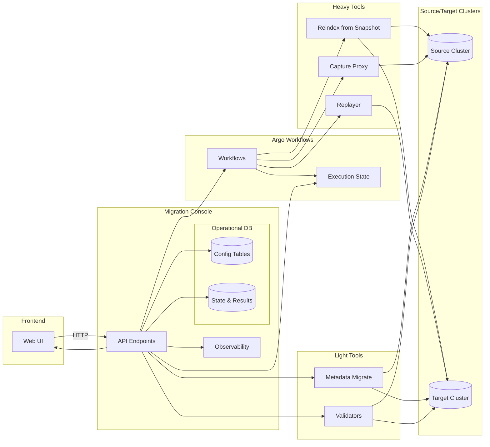
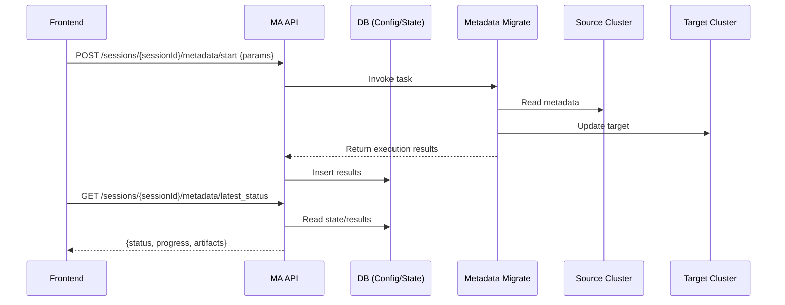
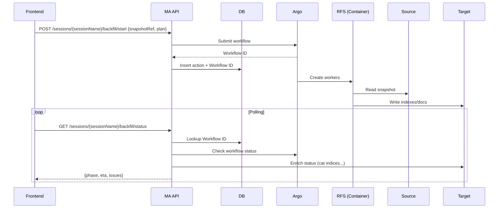

# Migration Assistant Information Architecture

## Purpose

This document outlines the design principles for how the Migration Assistant (MA) project will manage communication between its different elements with the introduction of a frontend and backend system. It establishes how these new systems will integrate with existing components while aligning with the team’s strategic shift toward API-driven, web-first deliverables.

## Context

The Migration Assistant currently supports two categories of tools:

1. **Heavy tools** – Java-based processes such as **Reindex-from-Snapshot (RFS)**, **Capture Proxy**, and **Replayer**. These typically run in dedicated containers, require lifecycle management, and are orchestrated using systems like Argo.
2. **Light tools** – Smaller Python scripts or Java applications that run directly on the **Migration Console instance**.

With the introduction of the **frontend** and its reliance on the **API layer** provided by the Migration Console, we now have a unified system of control with structured verbs and endpoints. This transition shifts how we view ownership of state and orchestration of processes.

## Strategic Shift

* **Old model**: Customers were expected to script logic into the Migration Console via CLI commands. These commands returned human-readable responses.
* **New model**: Customers needing automation will use the **Migration Assistant API directly**. This establishes a **clear, structured interface boundary** for partner teams, removing ambiguity in command patterns.

Implications:

* Reduced priority for console-first features.
* All designs should be treated as **web-first**, ensuring customer-facing deliverables and structured APIs.
* The console remains available for ad-hoc usage, but feature investment will focus on the frontend and API.

## System of Record

Migrations must have a **single source of truth** for dynamic configuration and execution state:

* The **API layer (backed by a database, e.g., PostgreSQL)** will be the system of record for all migration configuration, actions, and results.
* **Direct database access will not be permitted**. All data will only be accessible through APIs.
* Tools that produce transient state (e.g., metadata migrate output) will register that state with the API, which persists it in the DB.
* Heavy tools that interact with clusters (source/target) will still do so directly, but their lifecycle, triggers, and state reporting will always flow through the API.

## Orchestration & Argo Workflows

* Argo workflows to provide orchestration for heavy tools.
* Workflow execution data will remain in Argo, but the Migration Console API will **query and expose workflow states** as structured API responses.
* Migration Assistant will not duplicate workflow execution data but will provide standardized access and metadata references.
* Principle: **Workflow data is stored in Argo, surfaced through API.**

## Design Principles

1. **API-first** – All new control plane features must be defined as structured APIs. CLI/console extensions are secondary.
2. **Single Source of Truth** – Migration state is always stored in one system (DB for config/results, Argo for workflow execution).
3. **Web-first customer experience** – Design for frontend consumption, then adapt for CLI if necessary.
4. **Encapsulation** – Tools continue direct cluster interactions but must always report state and results through the API.
5. **Observability & Traceability** – APIs should provide consistent tracking, logging, and error reporting across workflows.
6. **Extensibility** – APIs should allow integration by partner teams without requiring console-level scripting.

## Example Flows

* **Metadata Migration**:

  * Runs as a light tool.
  * Triggered via API call.
  * Results persisted in API-managed DB.
  * Accessible via frontend through standardized API.

* **Reindex-from-Snapshot**:

  * Runs as a heavy tool, orchestrated via Argo.
  * Triggered via API.
  * Workflow execution data stored in Argo.
  * API provides normalized status endpoint for frontend.

