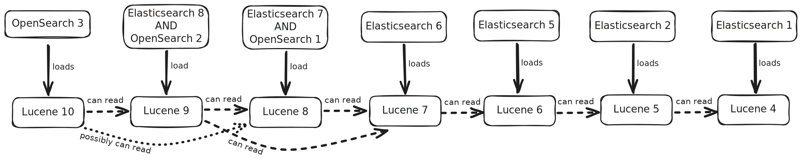

# Lucene Compatibility

Elasticsearch and OpenSearch versions are implicitly tied to versions of Lucene, the underlying search/indexing library. Each version of ES or OS loads a specific Lucene version and creates indices with that version. That Lucene library can also read indices created in at least the previous Lucene version. This limited backwards compatibility is what supports snapshot-and-restore and other types of upgrade.

As an example: An Elasticsearch 5 cluster writes indices with Lucene 6. Those indices can be snapshotted and restored to an Elasticsearch 6 cluster. That cluster loads Lucene 7, which can read the restored Lucene 6 indices. However, that snapshot can **not** be restored to an Elasticsearch 7 cluster, because the Lucene 8 jar on that cluster cannot read the Lucene 6 codec.

Several recent versions of Lucene include an additional backwards-compatible codec to read two versions back.

The chart below shows each version of Elasticsearch/OpenSearch, with the version of Lucene it loads, and which versions it can read.

([source](diagrams/Lucene_compatibility_chart.excalidraw))

## Relevance to RFS

RFS reads Lucene indices from snapshots, and therefore this compatiblity chart is relevant. It loads a (versioned) Lucene jar and reads the indices in a snapshot, so it's essential that it uses a version of Lucene compatible with the snapshot it is reading. Indices retain the Lucene version with which they were originally created (until they are reindexed). Therefore, an ES5 cluster that was once upgraded from ES2 may have indices created both with Lucene 6 and Lucene 5. In that case, to fully support ES5, RFS must use Lucene 6 to read the snapshot.

##### Sources
This chart is an expanded version from this page: https://github.com/peternied/opensearch-migrations/blob/expand-reindexing/docs/expanding-reindexing.md#lucene-support-over-time

It also pulls in information from Lucene documentation (for [Lucene 10](https://lucene.apache.org/core/10_0_0/backward-codecs/index.html) and [Lucene 9](https://lucene.apache.org/core/9_9_0/backward-codecs/index.html)) and the [OpenSearch documentation](https://opensearch.org/docs/latest/install-and-configure/upgrade-opensearch/index/#index-compatibility-reference).