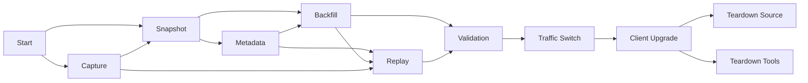
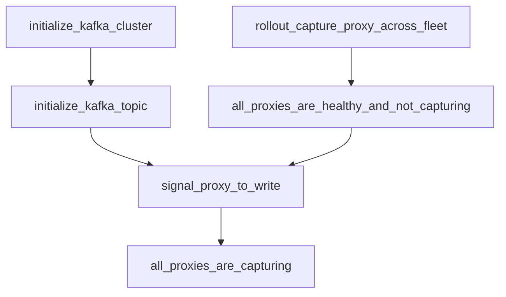
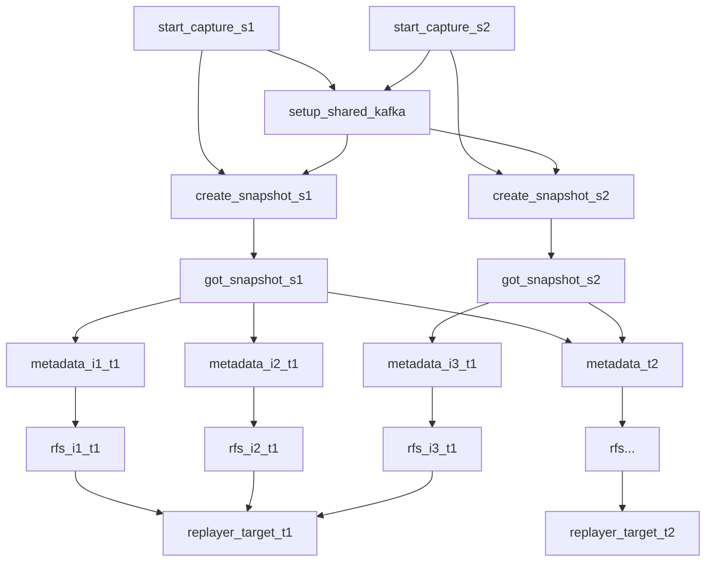
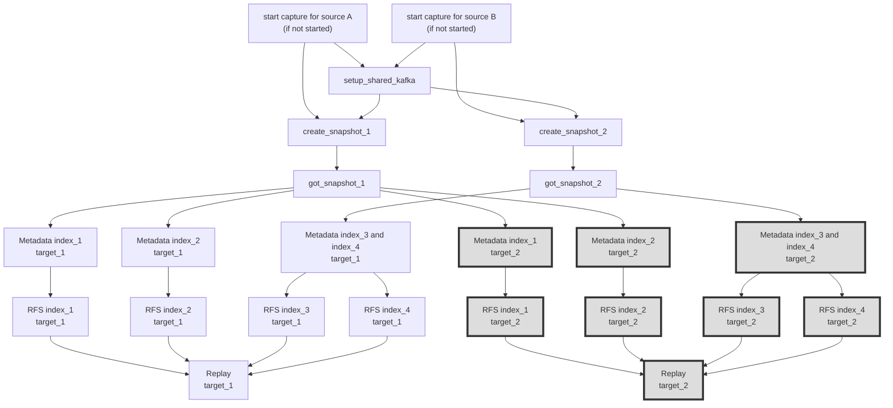

# Migration as a Workflow

"You're not building a tool. You're building a process." - early feedback for
this migrations project.

## Tenets

* Feedback is reactive. Users can provide new configurations and get feedback,
  in most cases, within seconds.
* The system minimizes complexity. This doesn't *prevent* users from doing
  complex migrations. Instead, it provides powerful, sound semantics. Users are
  constantly assisted to a keep the cognitive load of a migration to the
  absolute minimum.

## Problem

Customers often require a high degree of confidence in their migration -
specifically, that a source cluster's configurations and data have been
transformed as necessary and moved to a target cluster. The most customers most
sensitive to disruptions of any kind will vet tools and prospective new systems
thoroughly and test it in pre-prod environments. The migrations tooling can
establish a process and itself be established *as* the process for the community
by providing a solid UX that's both accessible and easy to understand.

For OpenSearch clusters, or really any type of datastore, a migration may be
composed of a number of steps that are related in varying degrees - some steps
are independent for some applications and dependent for others. For our
purposes, some of the following steps are codependent and others are purely
optional. For each of these steps though, there is a cardinality: steps should
not be reordered for the data that they concern.

1. Setting up a network proxy to capture traffic for replication and validation.
2. Creating a snapshot of metadata and data from the source cluster.
3. Configuring the target cluster's configurations, possibly migrating
   configurations from the source cluster. Templates, index configurations, and
   plugin settings are all examples of things that probably need to be
   established on the target *before* data is migrated since those settings have
   an impact on how data is ingested.
4. Backfilling existing/historical data to the target cluster. The RFS tool in
   the Migration Assistant repo supports pulling documents from source-cluster's
   snapshots, but users may have other mechanisms to replicate their data (e.g.
   push from S3).
5. Replaying traffic to synchronize the data between the clusters and to
   validate the responses of the target cluster.
6. Making the target cluster the primary cluster and moving all client traffic
   to it, leaving the source cluster for eventual decommissioning.

Below is a workflow describing the above steps that would make up a
full-migration. Some of these steps may be omitted or substituted if the user
doesn't have a need for them. All of them could be restarted, though that may
require rolling back several steps in some cases. Actual user flows may have
repeated steps or be divided into multiple parallel paths.



### Managing a Migration Workflow

The ability for a user to keep & gain confidence in the process fades as it
becomes more complicated. Each additional step and disruption weighs on a user.
As nuances start appearing and a user's assumptions break down, users need tools
that are familiar and work with them rather than against them. Those tools
should simplify the process rather than requiring more cognitive load - less is
more.

While, the migration console, and forthcoming web-console, simplify some of the
process for a user, we can go further. We need to break from many of the
previous configurations models, making them more granular and dynamic. Users
should receive ongoing feedback for each setting that they provide - that means
having fewer things to react upon, but reacting upon them in a very supportive
way. Consider a user that has hours of work ahead. Writing distinct metadata
mappings upfront and hoping that they're all correct after the data has been
transferred (RFS) and retrieved (replayer) puts a huge cognitive load on the
customer and for a long period of time. Customers will benefit from being able
to narrow the scope and attain more rapid feedback. To support this, we'll need
to enhance most of our tools, but we need a structure to start moving in the
right direction.

After much experimentation, users will invariably need to remember what they've
done. That's a simple question, but currently a difficult one to answer in our
procedural "open-world" CLI. Looking at this inductively, user uncertainty is
almost a certainty!

Before considering a solution, it's important to note why migrations might be
overly-complicated.

* (Time) Migrations are long and users' patience will wear thin, giving them
  incentives to take shortcuts, even if they create future risks.
* (Execution) Users are prone to errors: "Was A executed before B?" When these
  mistakes happen, they might not be detected immediately. Mistakes may not be
  understood even after they've made an impact. Mistakes may not have clear
  remediations either.
* (Expertise) Novel migrations will include many misconfigurations. Users need
  to perform try-test loops repeatedly. Remembering the chain of actions and
  settings that were responsible for the current state is imprecise and mentally
  taxing.

## UX of a Migration

This document argues that the time, execution, and expertise problems of a
migration can be effectively mitigated by modeling migrations as an opinionated
workflow that can be defined through a simple declarative configuration. True to
the tenets, the derivation (performed by the "control-plane") from the
configuration (spec) to the workflow should be able to happen nearly immediately
and any configuration change should be able to have an impact on that workflow.

Users configure their migration by adding details - first the source, eventually
the target, and somewhere along the way, options for the migration tools (
metadata, backfill, capturing, replay). These configurations make up a single
overall specification that the control plane uses to create a workflow.

A workflow on rails helps reduce execution errors but won't help compensate for
a lack of expertise. To provide that, a workflow needs to not just move forward,
but also allow steps to be reverted to put the user back into known states.
Rollback is valuable even when it has a long turnaround time, and in most cases,
we can engineer ways to reduce the cost of a rollback. Even for expensive
rollbacks, having the control-plane/workflow engine orchestrate them removes the
user from executing unfamiliar steps and therefore reduces the risks that manual
interventions bring.

For the last of the issues that can dog migrations, the solution needs to be
sensitive to time. Migrating terabytes of data is never instant and time is
relative, but we still need to acknowledge that there are a number of ways that
we need to amount of blocking that a user has to experience.

1. Users need to be able to monitor progress before a task is done. The workflow
   should be able to stop and rollback when something needs to be adjusted.
2. Every step needs some variant to quickly approximate a result for a user.
3. Users should be able to pipeline their tasks, with different partitions of
   work cascading through the system at different steps, we need to support
   that. Consider a user that has three different indices to migrate. Once
   they've sampled some documents with RFS after a couple previous iterations of
   metadata/backfill, they may be ready to migrate the entire index. While
   that's ongoing, we should allow them to begin working on the next index and
   let it "just work".
4. As a user changes part of the workflow, the user shouldn't need to wait for
   work unrelated to the change to run again. Our workflow system needs to be
   smart about when work needs to be repeated and when it's still fresh enough
   from the last run.

After pulling declarative-configured workflows, rollbacks, and time-savers, we
just need to think about how to package it all up. Each step of the workflow can
be run with automated or manual validation, pausing the progress of the workflow
when a user should provide some confirmation. Notice that observability tools in
the migration console today (success metrics, kafka stats, etc) can be run for
validation that can suspend progress and even trigger resets. Over time, manual
user validation steps can be converted into automated steps that use cleaner
signals. This will build a virtuous loop - the easier it is to automate a
validation, the easier it will be for a user to proceed. We become much more
aware of ambiguity for a user when clear automation isn't possible.

Using workflows won't be a panacea, nor will we have all the features above
ready immediately - but with modest amounts of effort, we can provide a better
experience than what we have today. Over time, the interface described above is
attainable and converges with what our user-base is trying to do. Making these
investments is a win for customers and also for us, since it lets us take on
more complexity that users otherwise wouldn't be able to handle through manual
interactions.

### Bonus Features

After building out a workflow that the user is happy with, or in the middle of
that run, a user may decide to test performance on additional clusters. With a
simple declarative configuration with minimal configurations, the system can
stamp out a second pipeline to an additional target cluster. The UX can/should
keep the workflows in sync as changes are made. Once the user is satisfied with
the final choices that they've made, they can simply rerun the same
configuration, which was being updated throughout the process, to load another
source load onto another environment (pre-prod to prod, across customer
partitions, etc).

Notice that our tooling keeps this map around and uses the workflow state to
manage the context, knowing when one stage is done, another may need to be
rolled back, etc. That frees us or the user from needing to perform tedious
bookkeeping. Instead, we can focus on enhancing the workflow structure to pause
until a workflow receives user-input or to allow workflow modifications (new
stages/ modifications). Higher-level features are much easier to orchestrate and
vend. E.g., using delta snapshots to keep clusters in sync more economically;
resetting the traffic replication topic right before running snapshot to make
replays more efficient and fast; or automatically using a newly modified
transform to resend failed documents from the backfill stage.

## CLI

### Interface Options

The migration console container currently provides the primary access to
control-plane and migration resources while the web UI is being developed. With
Kubernetes, as well as with Argo, we do have additional mechanisms that users
can use to interface with a migration.

We could create an operator specifically for a migration - becoming K8s native,
turning the migration console into a service that fields requests from the K8s
as users submit commands with kubectl. That’s probably a super-massive
level-of-effort if the operator is user-facing, judging by the complexity of
other operators for K8s (otel, strimzi).

We could also rely strictly upon kubectl to interface with argo. We could also
leverage the Argo CLI. Either of these options would be able to run from
anywhere that kubectl could connect to the cluster. The latter would require an
additional installation and the Argo CLI distribution is ~150MB. Other than a
text-based graph view of the workflow, the Argo CLI doesn’t offer much over the
kubectl interface since value of Argo is that it’s already K8s native. In other
words, one can already submit jobs, check statuses, etc.

A K8s-direct approach isn’t accessible enough for users. As described in the
Design section, Argo doesn’t allow modifications to a workflow. That precludes
users from being able to easily make changes to their migration. Also, given the
breadth *and* depth of a migration, users need the ability to navigate their
focus around a complicated migration. Consider the case where there are two
targets and a replayer is running for one while a backfill is still running for
two indices for the other target. Gathering on-the-fly details for ALL of the
processes in flight is inundating - and may be time/resource consuming.

This brings us back to a CLI similar to what we have today, where we can develop
incrementally as new features are introduced. Much of the code that supports
today’s CLI can be reused to provide critical tools to support workflows (“is
the snapshot done?”, etc) and users (“can I connect to the source cluster?”).
Many of the existing `console` command make assumptions, like all configuration
is known when the console command is run; there’s a source and a target; etc.
While those assumptions don’t hold for the overall workflow case, we can select
portions of the workflow configuration to run console commands. The Argo
workflow steps need the same data that the console commands use since they are
both interfacing with the same underlying tools. As Argo splits work and
proceeds through phases, configurations are built up (e.g., a Kafka cluster is
created and that broker list is passed onward). In fact, the Argo workflow can
be seen as an orchestrator not just of a migration, but more specifically, of
the many granular services.yaml configurations that make up a single migration.
In other words, our Argo workflows start with one configuration, split it up as
appropriate, augments it with details of newly deployed resources, and continues
to pass the right contexts through the workflow.

### CLI Command

While many of the commands that a user will run will be the same as what they’ve
been, there are some subtleties between them, given that we’re packaging things
so differently. To make sure that users understand that they’re in a new
environment that might behave differently, the `console` command should stay
exactly as it is and a new `workflow` command should be used for Workflow
deployments. There should be a runtime variable on the console container that
indicates if the migration-console is controlling the imperative “classic”
console or if it should be controlling the new workflow-based system. Both the
console and workflow commands should check to confirm that they’re being run
from the right environment and if not, issue helpful messages to redirect the
user.

### Configurations

What does that mean for a user though? How can users make sense of these
parallel universes? To answer that question, we need to consider new mechanisms.
As we move away from a “(re)deploy everything” model to one that’s more
incremental, we need to make changes anyway. A side effect of being able to
change configurations on-the-fly is that we need to deploy those changes
cleanly. Every bit of mutable global state that we use is at risk of causing
race conditions and logging headaches. A logical conclusion to remedy those
issues is to not allow global state to be changed. Since our workflows already
manage deployed state, it’s feasible to move any user-defined state that can
change into the workflow and its configuration.

Instead of managing potentially volatile configurations within
`cdk.context.json` or `values.yaml` for a helm deployment, we can manage those
values within each workflow session. These might range from the mostly static
values like source cluster configurations to more volatile values like
metric/throughput thresholds or transformations. Potentially NONE of these
values may exist when the first configurations are provided. Let’s assume that
the migration environment is initialized with Argo and its templates but nothing
more. No Kafka, no buckets, no user-configurations.

As the user begins specifying sufficient pieces of the migration, the migration
workflow can begin to run. As shown below, configurations are structured json
values that are organized in a hierarchical manner. As also shown below, at some
levels, the configuration may specify work to be done in parallel, e.g.
migrating to multiple targets, or with different index configurations. At each
of these branch points, users also need to provide a unique name for that part
of the config. Consider the following snipped of a migration configuration (
notice that this is NOT the same as services.yaml, which will be described
shortly).

```
{
  "targets": {
    "targetSecuritylogs": {
      "endpoint": "URI...",
      "auth": { ... }
    }
  ],
  "migrations": [
    "sourceSecuritylogs": {
      "source": {
        "endpoint": "URI...",
        "auth": { ... }
      }, ...
   }, ...
}
```

Configurations can be set either by using an editor on the console or by
specifying individual fields at the command line (probably a fast follow - or a
good spot for the UI to provide this).

```
# Add a new source configuration to the migration workflow context
% workflow configure add migrations
{
    "sourceSecuritylogs": {
        "source": {
            "endpoint": "URI...",
            "auth": { ... }
        }, ...
    }
}
# this should have the same result
% workflow configure add migrations.sourceSecuritylogs
{
    "source": {
        "endpoint": "URI...",
        "auth": { ... }
    }, ...
}
# Just show the configuration, don't change it
% workflow configure show [optional jsonPath]
{
    "source": {
        "endpoint": "URI...",
        "auth": { ... }
    }, ...
}
```

```
# Remove a source configuration block from the workflow context.  No input required.
% workflow configure remove migrations.securitylogs
```

```
# Update a field
% workflow configure update migrations.sourceSecuritylogs.source.endpoint
"NEW_URI"
% workflow configure update migrations.sourceSecuritylogs.source
{
    "endpoint": "NEW_URI...",
    "auth": { ... }
}
```

```
# Launch $EDITOR on the current workflow configuration, which will be written to
# a temporary file
% workflow configure
```

As users make these updates, the configurations themselves are stored in a
durable way within the K8s cluster. As a workflow is reconfigured or adjusted in
any way, a new workflow will replace the old one, memoizing previously computed
steps. When a new workflow is constructed, it waits for the old workflow to be
terminated to transition its resources to the new workflow. Before that process
begins, users can confirm the change or wait until more configurations are
in-place. Just as users will be able to specify if migrations should run with
manual or automatic approvals, they can choose to immediately begin running a
new workflow, or to create a new configuration but to leave it’s start as a
pending operation that requires approval.

That means that after any of the configure commands above, users will receive a
prompt

```
% workflow configure add migrations
{
    "sourceSecuritylogs": {
        "source": {
            "endpoint": "URI...",
            "auth": { ... }
        }, ...
    }
}

Begin running workflow for 
{
  ...
}
y/n:
[y] # immediately tear down the old workflow and start the new one
[n]...
Suspend the currently running workflow?  Y/N: ?

# for when there's a configuration pending, but it hasn't been started yet
% workflow start
```

Notice that at any point, a workflow can be paused (`workflow pause`). That
causes all long-running tasks to have their replicasets scaled to 0 and for
existing processes to receive SIGTERM commands.  `workflow resume` will reverse
a pause. In the above case where there’s a transition between workflows, there
will only be one pending workflow and one current one. Upon each
reconfiguration, the user is given the option to switch. The user can allow run
`workflow configure commit` to cause the workflow for the current session to
transition to the newly configured one.

The Web UI designs have suggested that the migration assistant maintain
migration “sessions”. We can provide that too approximately how git manages
branches - one will be created automatically for the first workflow configure,
or one could name it.

```
% workflow session create prod
securityMigration session created
% workflow session switch gamma
searchMigration session activated
... # we can print out some summary status here
% workflow session delete gamma
# this command will run configure add migrations on the 'securityMigrations' session
% workflow session=prod configure add migrations
```

### Runtime / Observability

Assuming that the user has configured additional steps for some kind of
migration activity - Metadata Migration, RFS, or a replay - some resources will
be spun up when the workflow is run. As that workflow runs and parameters are
pushed through the workflow, and progress begins to occur. Simply running status
will show a brief summary of

```
# Once a workflow has been started w/ `workflow start` (or automatically)...
% workflow status --yaml # The output could be yaml, json, or plaintext
session: gamma
to: 
  targetSecuritylogs:
    from: 
      sourceSecurityLogs:
        01_01_01_indices:
          metaData:
            status: complete
            details: {...}
          backfill: 
            status: running
            progress: 
              finished: 14
              total: 87
              ...
        replay: waiting
          
% workflow status
sourceSecurityLogs -> targetSecuritylogs [session=gamma]
complete:   metaData (*)
inProgress: backfill (accessLogs: 14/87) 
pending:    backfill (errorLogs)
```

The structured output for a migration workflow can be created by iterating over
each of the contexts that the workflow has created to piece together various
service.yaml files for the different (and sometimes parallel) parts of the
workflow. Compressing the status from yaml to plaintext will be an iterative
exercise with significant - at least ad-hoc - usability testing. This overall
status command will be the only new command for the console to render new
contents.

The migration console provides many other observability tools - like running /_
cat/indices or observing the kafka topic depth. Including everything within the
overall status call is expensive and slow. It also becomes cumbersome for users
to have to manage long command line invocations. Like the session context that
we can keep track of, we can also bind the user’s current environment to the
workflow values for a given task.

There are a couple different ways that we could handle default contexts. The
simplest one is that when there are no branches, simply use the context for the
deepest task within the workflow. When there are branches contexts can be
enumerated, the user can select which one to use.

```
# while backfill is running, the 01_01_01_indices configuration is active
% workflow context set
1 targetSecurityLogs -> sourceSecurityLogs -> 01_01_01_indices [in progress]
2 targetSecurityLogs -> sourceSecurityLogs -> 01_01_02_indices [completed]
3 targetSecurityLogs -> sourceSecurityLogs -> 01_01_03_indices [in progress]
[2] # User input

# User can now run ordinary console commands to interact with the resources for 
# the 01_01_02_indices run of targetSecurityLogs -> sourceSecurityLogs
% workflow kafka describe-topic-records
TOPIC                    PARTITION     RECORDS
sourceSecurityLogs-topic 0             1234

% workflow cluster check-connection
SOURCE CLUSTER
...Successfully Connected...
TARGET CLUSTER
...Successfully Connected...
```

When the user creates a shell on the migration console, we have a `.bashrc` rig
the PS1 variable to read the context to set the prompt to something like

```
[gamma|targetSecurityLogs|sourceSecurityLogs|01_01_01_indices] 
%
```

### Blocking Upon User Approval

The configuration hierarchy lends itself to an easy approval process for steps
that might require user-approval.

```
[gamma|targetSecurityLogs|sourceSecurityLogs|01_01_01_indices]
% workflow status
review:
    metaData: 01_01_02_indices
inProgress: 
    snapshot: 01_01_03_indices
    backfill: 01_01_01_indices (14/87) 

% workflow context set
1 targetSecurityLogs -> sourceSecurityLogs -> 01_01_01_indices [in progress]
2 targetSecurityLogs -> sourceSecurityLogs -> 01_01_02_indices [under review]
3 targetSecurityLogs -> sourceSecurityLogs -> 01_01_03_indices [in progress]
[2]

# User runs any commands that they'd like on the 01_01_02_indices context
[gamma|targetSecurityLogs|sourceSecurityLogs|01_01_02_indices]
% ...

[gamma|targetSecurityLogs|sourceSecurityLogs|01_01_02_indices]
% workflow approve
1 targetSecurityLogs -> sourceSecurityLogs -> 01_01_02_indices -> metadata
[1] # user has approved the results of the metadata step 

[gamma|targetSecurityLogs|sourceSecurityLogs|01_01_01_indices]
% workflow status
inProgress: 
    snapshot: 01_01_03_indices
    backfill: 
        01_01_01_indices (14/87) 
        01_01_02_indices (0/15)
```

### Logging

With K8s, we need to manage log offloading ourselves more than we did for ECS.
With the fluentbit stateful set that we’re running, we should be able to project
all of our logs as unique streams that include not just the pod name, but
additional metadata that the workflow can attach. Specifically, the workflow run
number (3rd attempt), the service, and configuration’s name (e.g.
`targetSecurityLogs.sourceSecurityLogs.01_01_01_indices`) can all be included as
new json fields in the data that we push to CloudWatch or any other structured
logger. That will let us use OpenSearch, CloudWatch insights, etc to see all of
the logs across the stack and also slice and project the data across any
dimensions that a user might need.

## Design

### Argo

To begin to achieve the vision for the UX laid out above, we need to start
with the following runtime components and features. A workflow engine that can
run tasks and move data between tasks as they execute is an obvious place to
start. We’ll need to make a significant effort into maintaining the precise
definition of a workflow as well as the conversion of the configuration
specification into that workflow.

Argo provides a reasonable workflow engine and is K8s native. Adopting Argo as
the basis for our control-plane implementation means that workflow templates can
be defined declaratively, albeit in YAML, to specify our workflows. These
workflows will be flexible, making runtime decisions using configurations and
state, but the templates themselves will be statically defined. Since Argo is
already K8s native, it can easily deploy K8s resources, provide resiliency,
offer consistent control through kubectl, is reliable, etc.. Other workflow
engines include Airflow, Metaflow or Dagger - and rolling a bespoke workflow
control-plane could also be an option. While those might offer some
improvements, we’ll still likely be stuck with some of the same shortcomings (
like K8s poll intervals), though the implementations might make it easier/harder
to roll out workflows. The rest of this document assumes that we’ll use Argo.

Argo workflows can’t be modified while they’re in progress. Just as we don’t
want to modify configurations while a java process is running, we probably
wouldn’t want to modify in-flight workflows because it makes it harder to reason
with the results. Secondly, workflows can be dynamic. One can write conditionals
to choose a branch based upon a value pulled on-demand. That gives us plenty of
flexibility - and we need to be concerned that it’s clear why the workflow chose
a specific branch, which is traceable with Argo since parameters for every task
are available for the lifetime of the workflow.

After interfacing with Argo for several months, there are two persistent
drawbacks. It can take ~8s in my minikube environment to spin up a container,
which impacts running a script to calculate a value, check a status, etc. That
latency induction will add up, putting strain on our tenet to be reactive with
immediate feedback (
see [Mitigating Slow Turnaround Times for Argo Tasks](https://quip-amazon.com/FqafA7U3hSAt#temp:C:AJZ8519e816190a45cab5d707f11)).
There are some potentials workarounds to this, like
using [HTTP templates](https://github.com/argoproj/argo-workflows/issues/12381#issuecomment-1871262302)
or tweaking the
default [duration times](https://github.com/argoproj/argo-workflows/blob/main/docs/environment-variables.md)).

The second drawback of Argo is that its configuration specifications are string
based and there’s little support for type-safety. Argo passes strings in and out
of templates through parameters. Parameters may have default values that are
static literals or dynamically retrieved ConfigMap values (from a specific key).
Default values can also reference other parameters directly or through
expressions. Managing parameters through a stack of tasks across dozens of
invocations without having structured objects can be cumbersome. We could pass
json contents and have every task preluded with a jq container to convert the
json, but it’s more straightforward and efficient to use Argo expressions. These
expressions, however, can become over wielding and difficult to test.

The hope, whose description will be deferred to another document, is to use a
DSL to reduce the boilerplate, provide type checking, and support passing
compound types at the modeling/DSL layer. That enables us to define workflows in
a rich language and transpile them into the Argo workflow templates. The
transpilation step can manage getting the conversion from structured input to
Argo expressions right every time. That DSL can also check against schemas and
do much more checking to reduce the need for belabored diagnostic-gatherings for
workflows that effectively have preventable configuration errors. Managing the
transpilation gives us better structure while abdicating the responsibility of
managing the runtime resources.

Since Argo produces graphs of unique nodes, we can assure that nodes are easily
discovered at runtime to facilitate the UX described above. E.g. the node for
the context (services.yaml) to describe this task will be defined in this
format.

### Workflow Change Management and Resource Adoptions

This document has laid out an environment where users build up workflows
incrementally by adjusting their configurations. This section explores how to
model that behavior with Argo as our underlying workflow engine.

Argo doesn’t natively support changing a workflow but even if it did, that would
be difficult to manage. Instead, we need to change the fully-realized workflow.
All the templates can be (& are planned to be) static. We’ll derive which branch
of a workflow to run, where to fanout work, etc based upon the incoming
configurations that were defined by the user. As configurations change, the
steps that we need to run will be different. For example, the workflow has
started backfill because Metadata has been migrated and RFS has started running.
If a user adds a new metadata configuration for a new index - and needs to do a
new RFS backfill for it, we’ll need to stop the current workflow, including (at
least) the backfill steps that are dependent upon the change, figure out how to
transfer resource to the new workflow and revert the recent changes that
shouldn’t be transferred (see Rollbacks below). After the environment is in a
well-known state, the new workflow will be started.

Assuming that there might be an issue at every step and that the user might need
to make a configuration change, rerunning all bits of work repeatedly would
cause an already long process to get even longer (O(n^2)). We need a way to fold
previously completed work into the next workflow.

There are critical steps to safely memoize work and both require some overhead.
1) Was the work successfully completed? 2) Was the work that was previously
completed going to be equivalent to the work that would be done by the new
workflow?

For cases where work can be recomputed easily and doesn’t have side effects,
we’ll just rerun the tasks. Bigger tasks, like creating a snapshot, running a
backfill, and running the replayer are all jobs that we’ll want to avoid
restarting when possible. Metadata migration may be able to go either way here.
The migration tools continue to undergo various degrees of changes to support
more workflow-friendly use cases. It may make sense to rerun an idempotent
metadata migration, or we might want to treat it similar to the longer running
tasks since it does create side-effects.

#### Calculating Change Sets

When considering memoizing steps, one can think of Gradle or even
CloudFormation. Each item that we want to cache was constructed with a set of
inputs. Those inputs, which are chained all the way back up the workflow graph
will dictate when results are out of date or when they should be reused. When
they’re out of date, we’ll need to discard them and when they’re still relevant,
we’ll want to ‘adopt’ the previous workflow’s results into the current workflow.

The Argo workflows for fullMigration and captureReplay both manually manage this
process today
for “[bring your own snapshot](https://github.com/opensearch-project/opensearch-migrations/blob/ea859bdac789e077470133c143029985ecca9fcd/TrafficCapture/dockerSolution/src/main/docker/migrationConsole/workflows/templates/createOrGetSnapshot.yaml#L4)”
and “bring your own Kafka” (
see [here](https://github.com/opensearch-project/opensearch-migrations/blob/ea859bdac789e077470133c143029985ecca9fcd/TrafficCapture/dockerSolution/src/main/docker/migrationConsole/workflows/templates/captureReplay.yaml#L48)
and [parameter routing later in the file](https://github.com/opensearch-project/opensearch-migrations/blob/ea859bdac789e077470133c143029985ecca9fcd/TrafficCapture/dockerSolution/src/main/docker/migrationConsole/workflows/templates/captureReplay.yaml#L163-L178)).
A composite workflow task (template in Argo terms) inspects the incoming
parameters. If a parameter isn’t set yet, it runs a branch to create it. The
composite task will return either the value passed in or the newly created
resource.

We can use similar a paradigm, just as we would with traditional code where we
have a unit that does work or pulls from a cache and returns the necessary item.
In this case, instead of writing results to in-process memory, we need to work
in a more distributed way, writing the results to a shared data store. The Argo
workflows currently checked in make use of etcd (the same key-store that K8s is
using internally to manage its own state) to
manage [countdown latches](https://github.com/opensearch-project/opensearch-migrations/blob/ea859bdac789e077470133c143029985ecca9fcd/TrafficCapture/dockerSolution/src/main/docker/migrationConsole/workflows/templates/targetLatchHelpers.yaml)
to determine once all of the backfill tasks for a cluster have been completed.

We’ll need to make use of a data store a bit differently, but the current latch
implementation shows how we can use a transactional store for simple values. In
our case, we’ll want to wrap every resource-creating task with some tracking
logic. We’ll setup the appropriate key (going back to the names in the
configurations), check if it already exists, set the state as pending, run the
task, then mark it as complete, logging the outputs from the previous task. All
of that should be able to be wrapped up in a simple proxy/decorator definition
that we can use repeatedly throughout our workflows.

The work that can be considered to move to the new workflow doesn’t need to JUST
be the final resultant state. Consider the case where a migration is ongoing to
a target cluster. The user decides to run the SAME migration to another cluster
to see if it’s faster/cheaper/etc. When the user updates the target
configuration, NOTHING changes for the original target. Though it hasn’t
finished its replayer step, it shouldn’t need to restart that replayer step.
Just as an index could be considered as a state, a K8s compute resource can
conceptually also be considered as a resource. In that case, we’ll migrate the
replicaset name, etc into the new workflow and wait just as we would have if it
was created by the current workflow.

The most challenging aspect of this may be garbage collection - how will we
remove cached/prior resources that aren’t relevant. Our transactional state
logging can probably help here. The expectation will be that there’s a cleanup
step that runs in each workflow invocation, sweeps over the etcd manifest, finds
things that haven’t been adopted, and runs cleanup tasks on those.

### Rollbacks (in progress)

When work needs to be cancelled, because a user changed their mind or because it
failed approvals, some amount of steps need to be reverted. Primarily, this is
the responsibility of the workflow, but we may find other improvements that we
can make within individual tools.

Checkpoints, simply powered by snapshots which can be restored, may provide the
biggest ROI. We can run snapshots on specific indices or the entire cluster
before running the replayer. That one checkpoint alone may be enough to provide
a reasonable experience for most use cases since RFS is already granular and its
relevance is also in a composable unit (index) for a migration.

More investigation will be required to determine if rollbacks will be better
integrated directly into the full Argo workflow or if it would be easier to
reset state outside of Argo within our control plane that sets up the workflows.
Either way, between the adoption work and rollback, there’s a need for tracking
the states of the migration steps as well as any ancillary states that may be
setup to make it easier to facilitate consecutive runs.

## Workflow Examples

### Inner Workflows

Some of the steps above will be composed of other workflows. An invocation of
RFS or the replayer involves deploying compute nodes, managing their scaling,
and observing for an exit criteria. For example: all documents have been
migrated or the lag between the source and target is low and there are no 4xx
errors.

### Start Capture

The start capture workflow is worth describing because it's an example of a
simple model that helps to facilitate reasoning. In this case "all proxies are
healthy" sounds like an easy and obvious step. However, how many proxies have
been deployed? How does the rest of the system know the global health? We don't
have that global state today, but with workflow modeling, we can zoom in on
steps, let them express more granular conditions, and test them for correctness!



## Example User-Driven Workflow (including A/B testing)

This workflow represents one where the user has done granular migrations, one
snapshot, one index, and one stage at a time. In this case, the user may have
made changes, and validated the data. They may have run some steps repeatedly
with different configurations. Those configurations may have included
transformation/exclusion rules or possibly data sampling parameters, testing
incrementally more data until the last invocation migrated 100% of the data.

In the diagram below, the gray nodes are represent those cloned directly from
the workflow for target 1 and are kept in sync.

### Simplified Multi-Source/Multi-Target Migration

Below is an example where data from multiple source clusters needs to be routed
to multiple target clusters. This scenario comes up when a customer has decided
to re-home data, which can arise for compliance or to meet other an
organization's other needs.



### Multiple Sources to Multiple Test Clusters (A/B Testing)...

This workflow shows two different sources that are being migrated into a common
target (`target_1`). As the migration unfolds (or a priori), the user has
decided to test multiple scenarios and `target_2` has been configured to _also_
receive the same contents as `target_1`. The customer can determine which target
is a better fit, update their configuration and move forward as they see fit.



## Appendix - Sample Configurations

### Sample Top-Level Configuration

```

{
  "targets": [
    {
      "endpoint": "URI",
      "auth": { ... }
    }
  ],
  "source-migration-configurations": [
    {
      "source": {
        "endpoint": "URI",
        "auth": { ... }
      },
      "snapshot-and-migration-configs": [
        {
          // when this is present, this stage (THIS static migration config) will NOT create a new snapshot, 
          // but from the top-level, the snapshot may be refresh it a replayer is set to happen
          "existingSnapshot": { ... },
          "indices": {
            "names": "index1,index2...",
            "mode": "include|exclude"
          },
          "migrations": [
            {
              "metadata": {
                "transforms": "..."
              },
              "documentBackfillConfigs": {
                // These indices should be a subset of the parent ones
                "indices": {
                  "names": "index1,index2...",
                  "mode": "include|exclude"
                },
               "transforms": "..."
            }
          ]
        }
      ],
      "replayer-config": {
        "maxSpeedupFactor": 2.0,
        "maxThroughputMbps": 1000,
        "transforms": "..."
      }
    }
  ]
}
```

### Sample single-target

TODO - this will be updated once we have finalized the configuration schema.

```

{
  "target": {
    "endpoint": "http://elasticsearch-master-headless:9200/"
  },
  "source-migration-configurations": [
    {
      "source": {
        "endpoint": "http://opensearch-master-headless:9200/"
      },
      "static-migration-configs": [
        {
          "indices_toIgnore": {
            "names": "index1,index2",
            "mode": "include"
          },
          "metadata": { "No keys are necessary to do this step": true },
          "documentBackfillConfigs": [
            {
                "No keys are necessary to do this step": true
            }
          ]
        }
      ],
      "replayer-config": {
        "maxSpeedupFactor": 2.0,
        "maxThroughputMbps": 1000
      }
    }
  ]
}
```
