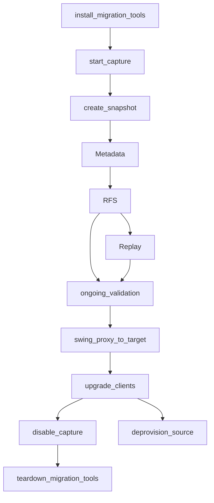

# Migration as a Workflow
  
## Problem

Customers need a high degree of confidence in their migration - specifically, that all of their configurations and data have been transformed and moved appropriately.  They also want to confirm that it's been adequately tested and performs well so they are prepared operationally post-migration.  The desire for confidence in the tools quickly fades as customers begin to undertake a complicated process.  As nuances start appearing and assumptions break down, users need more support.  

The migration console (and forthcoming web-console) provide some of that support.  They're limited in what they can though when migrations need to be defined rigidly at deployment time.  Today, customers are forced to redeploy.  Even making that a runtime decision won't eliminate the potential for confusion since some stages may be run (or need to be run) in an incremental way.  Consider a user that has hours of work ahead.  Writing distinct metadata mappings upfront and hoping that they're all correct once data starts being sent (RFS) and touched (replayer) puts a huge cognitive load on the customer.  Customers will benefit from being able to narrow the scope and attain more rapid feedback.

After much experimentation, users will invariably want to know the state of their migration.  What's been done already is a simple question, but a difficult one to manage, especially for a user that's doing a migration with some level of novelty.  Our migration tooling can help by transcribing each change and appending it into a workflow.  The workflow serves as a map of everything that's been done and the work being done.  When a step doesn't go as planned, that step can be erased from the workflow as the state is rolled back to a checkpoint.  From that point, the user can try again.

## Design

This document models a migration as a user-managed workflow.  There's a balance between giving the user ample flexibility but having enough constraints so that the migration is sound.  If a user doesn't want to wait for incremental snapshots or rollbacks, we can give them the ability to disable those and manage their state manually.  If a user wants to migrate new index metadata even after we've already replayed data for that index, and they understand the impact, they still can.  Providing a strongly-structured workflow gives both them and us something to reason with.  Users should begin gaining confidence in their migration from the moment that they look at the overview of the Migration Assistant, see their choices flow through the UX and data through the systems, and can validate everything in the audits of post-processing.  Having a structure simplifies supporting customers.  It also lets them, and supporting teams, easily reproduce results across new targets, new deployments, new regions, etc.

### Bonus Features

After building out a workflow that the user is happy with, or in the middle of that run, a user may decide to test performance on additional clusters.  With a simple declarative configuration with minimal configurations, the system can stamp out a second pipeline to an additional target cluster.  The UX can/should keep the workflows in sync as changes are made.  Once the user is satisfied with the final choices that they've made, they can simply rerun the same configuration, which was being updated throughout the process, to load another source load onto another environment (pre-prod to prod, across customer partitions, etc).

Notice that our tooling keeps this map around and uses the workflow state to manage the context, knowing when one stage is done, another may need to be rolled back, etc.  That frees us or the user from needing to perform tedious bookkeeping.  Instead, we can focus on enhancing the workflow structure to pause until a workflow receives user-input or to allow workflow modifications (new stages/ modifications).  Higher-level features are much easier to orchestrate and vend.  E.g., using delta snapshots to keep clusters in sync more economically; resetting the traffic replication topic right before running snapshot to make replays more efficient and fast; or automatically using a newly modified transform to resend failed documents from the backfill stage.

### Idealized User Workflow

Below is a simplified high-level workflow of the steps that would need to be executed for a full-migration.  Some of these steps may be omitted or substituted if the user doesn't have a need for them.  All of them could be restarted, though that may require rolling back several steps in some cases.



## Inner Workflows

Some of the steps above will be composed of other workflows.  An invocation of RFS or the replayer involves deploying compute nodes, managing their scaling, and observing for an exit criteria.  For example: all documents have been migrated or the lag between the source and target is low and there are no 4xx errors.

### Start Capture

The start capture workflow is worth describing because it's an example of a simple model that helps to facilitate reasoning.  In this case "all proxies are healthy" sounds like an easy and obvious step.  However, how many proxies have been deployed?  How does the rest of the system know the global health?  We don't have that global state today, but with workflow modeling, we can zoom in on steps, let them express more granular conditions, and test them for correctness! 


## Example User-Driven Workflow (including A/B testing)

This workflow represents one where the user has done granular migrations, one snapshot, one index, and one stage at a time.  In this case, the user may have made changes, and validated the data.  They may have run some steps repeatedly with different configurations.  Those configurations may have included transformation/exclusion rules or possibly data sampling parameters, testing incrementally more data until the last invocation migrated 100% of the data.

In the diagram below, the gray nodes are represent those cloned directly from the workflow for target 1 and are kept in sync.

Simplified Multi-Source/Multi-Target Migration


## Top-Level Configuration

```
{
  "targets": [
    {
      "endpoint": "URI",
      "auth": { ... }
    }
  ],
  "source-migration-configurations": [
    {
      "source": {
        "endpoint": "URI",
        "auth": { ... }
      },
      "snapshot-and-migration-configs": [
        {
          // when this is present, this stage (THIS static migration config) will NOT create a new snapshot, 
          // but from the top-level, the snapshot may be refresh it a replayer is set to happen
          "existingSnapshot": { ... },
          "indices": {
            "names": "index1,index2...",
            "mode": "include|exclude"
          },
          "migrations": [
            {
              "metadata": {
                "transforms": "..."
              },
              "documentBackfillConfigs": {
                // These indices should be a subset of the parent ones
                "indices": {
                  "names": "index1,index2...",
                  "mode": "include|exclude"
                },
               "transforms": "..."
            }
          ]
        }
      ],
      "replayer-config": {
        "maxSpeedupFactor": 2.0,
        "maxThroughputMbps": 1000,
        "transforms": "..."
      }
    }
  ]
}
```

Sample single-target
```
{
  "target": {
    "endpoint": "http://elasticsearch-master-headless:9200/"
  },
  "source-migration-configurations": [
    {
      "source": {
        "endpoint": "http://opensearch-master-headless:9200/"
      },
      "static-migration-configs": [
        {
          "indices_toIgnore": {
            "names": "index1,index2",
            "mode": "include"
          },
          "metadata": { "No keys are necessary to do this step": true },
          "documentBackfillConfigs": [
            {
                "No keys are necessary to do this step": true
            }
          ]
        }
      ],
      "replayer-config": {
        "maxSpeedupFactor": 2.0,
        "maxThroughputMbps": 1000
      }
    }
  ]
}
```

Sample Single
```
{
  "target": {
    "endpoint": "http://elasticsearch-master-headless:9200/"
  },
  "source": {
    "endpoint": "http://opensearch-master-headless:9200/"
  },
  "static-migration-configs": [
    {
      "indices_toIgnore": {
        "names": "index1,index2",
        "mode": "include"
      },
      "metadata": { "No keys are necessary to do this step": true },
      "documentBackfillConfigs": [
        {
            "No keys are necessary to do this step": true
        }
      ]
    }
  ],
  "replayer-config": {
    "maxSpeedupFactor": 2.0,
    "maxThroughputMbps": 1000
  }
}
```