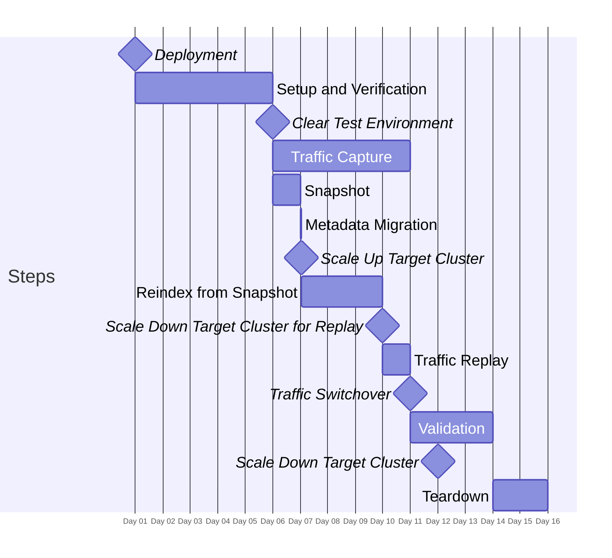

# Migration Timelines

## 15 day

This 15-day migration timeline demonstrates an example of a migration process that can be adapted to 3 working weeks when including weekends. Key phases:

1. Deployment and setup (Days 1-5)
1. Historical backfill and catchup (Days 5-10)
1. Validation and teardown (Days 11-15)

### Timeline



#### Explanation of Scaling Operations

1. **Scale Up Target Cluster**: Occurs after metadata migration and before reindexing. The target cluster is scaled up to handle the resource-intensive reindexing process faster.


2. **Scale Down Target Cluster for Replay**: Once the reindexing is complete, the target cluster is scaled down to a more appropriate size for the traffic replay phase. While still provisioned higher than normal production workloads, given replayer has a >1 speedup factor.

3. **Scale Down Target Cluster**: After the validation phase, the target cluster is scaled down to its final operational size. This step ensures that the cluster is rightsized for normal production workloads, balancing performance needs with cost-efficiency.

### Component Durations

This component duration breakdown is useful for identifying the cost of resources deployed during the migration process. It provides a clear overview of how long each component is active or retained, which directly impacts resource utilization and associated costs.

Note: Duration excludes weekends. If actual timeline extends over weekends, duration (and potentially costs) will increase.

```mermaid
%%{
    "gantt": {
        "fontSize": 20,
        "barHeight": 40,
        "sectionFontSize": 24,
        "leftPadding": 175
    }
  }
}%%
gantt
    dateFormat D HH
    axisFormat Day %d
    todayMarker off
    tickInterval 1day

    section Services
    Core Services Runtime (15d) : active, 1 00, 15d
    Capture Proxy Runtime (5d) : active, capture_active, 6 00, 5d
    Capture Data Retention (5d) : after capture_active, 5d
    Snapshot Runtime (1d) : active, snapshot_active, 6 00, 1d
    Snapshot Retention (9d) : after snapshot_active, 9d
    Reindex from Snapshot Runtime (3d) : active, historic_active, 7 01, 71h
    Replayer Runtime (1d) : active, replayer_active, after historic_active, 1d
    Replayer Data Retention (5d) : after replayer_active, 5d
    Target Proxy Runtime (5d) : active, after replayer_active, 5d
```

| Component                         | Duration |
|-----------------------------------|----------|
| Core Services Runtime             | 15d      |
| Capture Proxy Runtime             | 5d       |
| Capture Data Retention            | 5d       |
| Snapshot Runtime                  | 1d       |
| Snapshot Retention                | 9d       |
| Reindex from Snapshot Runtime     | 3d       |
| Replayer Runtime                  | 1d       |
| Replayer Data Retention           | 5d       |
| Target Proxy Runtime              | 5d       |
