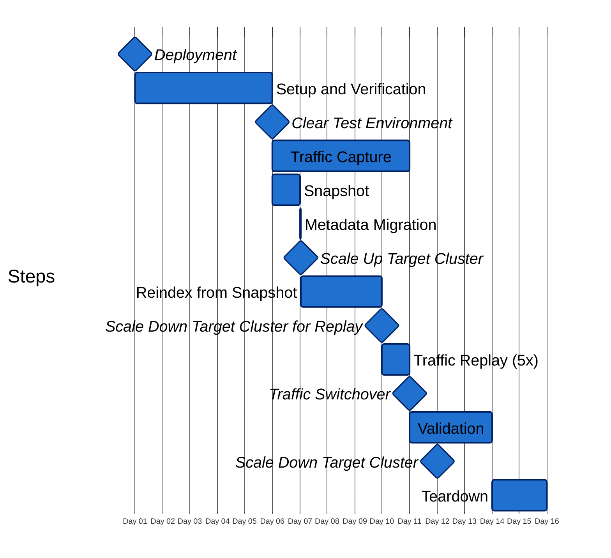
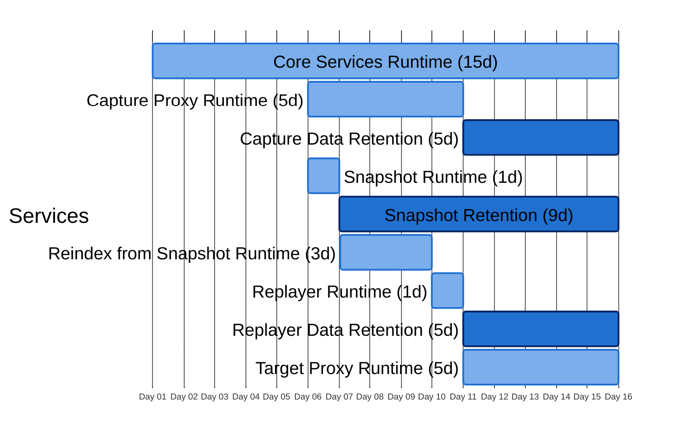

# Migration Timelines

## 15 day

### Timeline

### Component Durations

| Component                         | Duration |
|-----------------------------------|----------|
| Core Services Runtime             | 15d      |
| Capture Proxy Runtime             | 5d       |
| Capture Data Retention            | 5d       |
| Snapshot Runtime                  | 1d       |
| Snapshot Retention                | 9d       |
| Reindex from Snapshot Runtime     | 3d       |
| Replayer Runtime                  | 1d       |
| Replayer Data Retention           | 5d       |
| Target Proxy Runtime              | 5d       |
