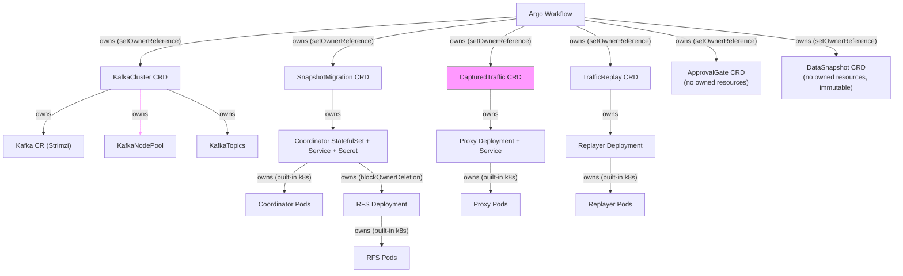
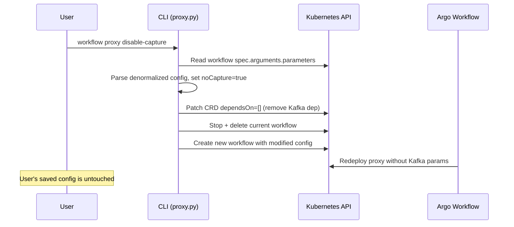
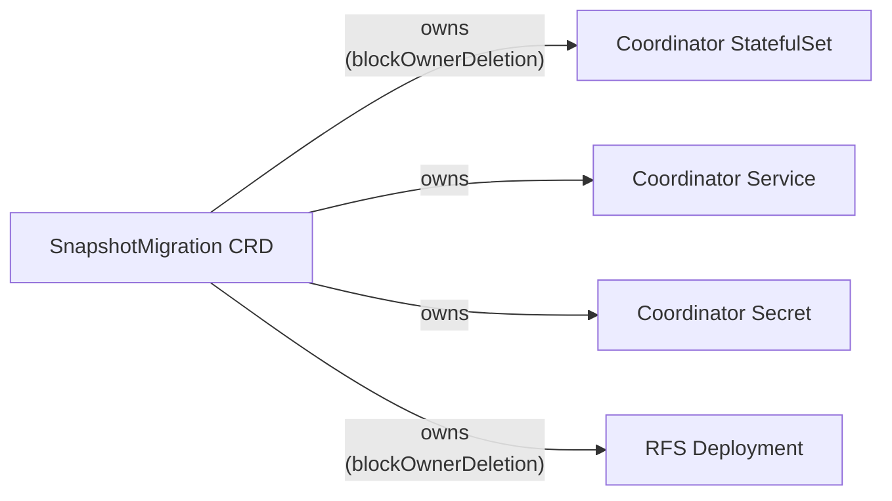
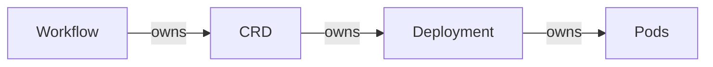
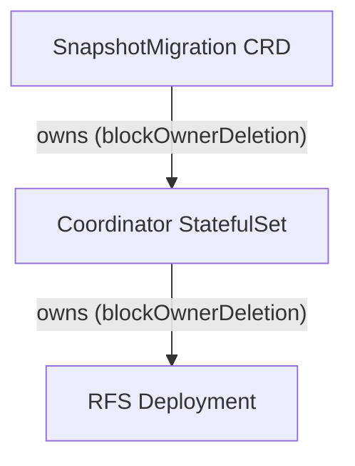
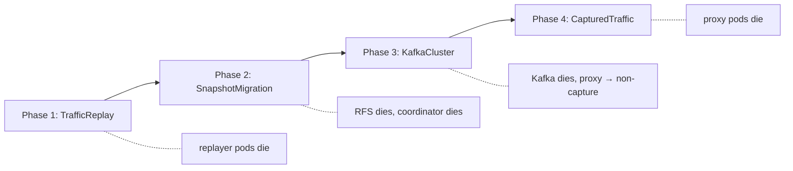

# Workflow CRD Lifecycle & Kubernetes-Native Teardown

## Core Insight

Teardown ordering belongs in **Kubernetes**, not Argo. Argo exit handlers don't survive `argo stop`, and Argo has no concept of "wait for pods to drain." Kubernetes already solves this with owner references and foreground cascading deletion.

## Architecture

### The ownership graph (set up at creation time in orchestration specs)

Ownership is **chained** so that dependents die before their dependencies. This
ensures zero spurious error logs (e.g., RFS never sees "coordinator unavailable"
because RFS pods are already gone before the coordinator starts draining).



> The CapturedTraffic CRD (proxy) has **two teardown modes** — see [Proxy Lifecycle](#proxy-lifecycle-state-transitions) below.

**Chained deletion order for SnapshotMigration:**
1. CLI deletes SnapshotMigration CRD (foreground)
2. k8s deletes Coordinator StatefulSet (foreground, blocked by RFS)
3. k8s deletes RFS Deployment → RFS pods drain and terminate
4. RFS fully gone → Coordinator pods drain and terminate
5. Coordinator fully gone → CRD deleted
6. Workflow's `waitForCrdDeletion` resolves

**Cross-CRD ordering (CLI-managed):**
1. Delete TrafficReplay CRDs → replayer pods die (no more traffic to proxy)
2. Delete SnapshotMigration CRDs → RFS dies, then coordinator dies
3. Delete KafkaCluster CRDs → Kafka dies, proxy switches to non-capture mode
4. Delete CapturedTraffic CRDs → proxy pods die

Result: zero "connection refused", "coordinator unavailable", or "upstream gone" errors in any component's logs.

---

## Proxy Lifecycle: State Transitions

The capture proxy has a well-defined lifecycle with three states. Understanding these transitions is important for customers who want to control when traffic capture starts and stops, or who need to keep the proxy routing traffic after disabling capture.

### State diagram

```mermaid
stateDiagram-v2
    [*] --> Capturing : deploy proxy with Kafka connection

    Capturing --> NonCapture : delete KafkaCluster CRD<br/>(Kafka dies, proxy redeploys)
    Capturing --> Deleted : delete CapturedTraffic CRD<br/>(direct teardown)

    NonCapture --> Deleted : delete CapturedTraffic CRD

    Deleted --> [*]

    state Capturing {
        direction LR
        note right of Capturing
            CRD phase: Ready
            Routes traffic to source
            AND writes to Kafka topic
        end note
    }

    state NonCapture {
        direction LR
        note right of NonCapture
            CRD phase: Ready
            Routes traffic to source only
            Transparent pass-through
        end note
    }
```

### States

| State | CRD phase | Proxy behavior | Kafka alive? |
|-------|-----------|---------------|-------------|
| **Capturing** (Ready) | `Ready` | Routes traffic to source AND writes to Kafka topic | Yes |
| **Non-Capture** (pass-through) | `Ready` | Routes traffic to source only — transparent pass-through, no Kafka writes | No (disabled via `workflow proxy disable-capture` or KafkaCluster deleted) |
| **Deleted** | CRD gone | Proxy Deployment + Service + Pods all removed via ownership cascade | N/A |

### Transitions

#### 1. Created → Capturing (normal startup)

The workflow creates the CapturedTraffic CRD, deploys the proxy with `kafkaConnection` parameters, and patches the CRD to `Ready`. The proxy intercepts client traffic, forwards it to the source cluster, and writes a copy to the Kafka topic.

**Trigger**: Workflow `setupSingleProxy` completes deployment.

#### 2. Capturing → Non-Capture (Kafka deleted, proxy stays alive)

When the KafkaCluster CRD is deleted (e.g., via `workflow reset my-kafka` or as part of `workflow reset --all`), the proxy detects the deletion and redeploys itself without `kafkaConnection` parameters. It becomes a transparent pass-through — client traffic still reaches the source cluster, but nothing is written to Kafka.

**Trigger**: `workflow reset <kafka-cluster-name>` or `workflow reset --all` (Phase 3 deletes KafkaCluster).

**What happens internally**:
1. CLI deletes KafkaCluster CRD → Strimzi resources cascade-delete → Kafka brokers shut down
2. Workflow's `kafkaGonePath` detects KafkaCluster deletion
3. Workflow calls `deployProxyDeployment` with a config that omits `kafkaConnection` (no `destinationUri` for Kafka, no auth params)
4. Kubernetes performs a rolling update — old capturing pods replaced with non-capturing pods
5. Proxy continues routing traffic to source cluster as a transparent pass-through

**Why this matters**: Customers can tear down the Kafka/replay pipeline without disrupting live traffic flowing through the proxy. This is useful when:
- Resetting a failed replay while keeping the proxy in place
- Transitioning from capture to a state where only the proxy is needed for traffic routing
- Preparing for a new capture cycle without a traffic interruption

#### 3. Non-Capture → Deleted (full proxy teardown)

After the proxy is in non-capture mode, deleting the CapturedTraffic CRD removes the proxy entirely. The Proxy Deployment and Service have `ownerReferences` pointing to the CapturedTraffic CRD with `blockOwnerDeletion: true`, so Kubernetes foreground-deletes them before removing the CRD.

**Trigger**: `workflow reset <proxy-name>` or `workflow reset --all` (Phase 4 deletes CapturedTraffic).

**What happens internally**:
1. CLI deletes CapturedTraffic CRD with `propagationPolicy: Foreground`
2. k8s GC deletes Proxy Deployment → pods drain and terminate
3. k8s GC deletes Proxy Service → cloud load balancer deprovisioned
4. All dependents gone → CRD object deleted
5. Workflow's `waitForCrdDeletion(CapturedTraffic)` resolves

#### 4. Capturing → Deleted (direct teardown, skipping non-capture)

If the CapturedTraffic CRD is deleted while Kafka is still alive (e.g., targeted `workflow reset <proxy-name>`), the proxy is deleted immediately via ownership cascade. There is no intermediate non-capture state.

**Trigger**: `workflow reset <proxy-name>` while Kafka is still running.

**What happens internally**:
1. CLI deletes CapturedTraffic CRD with `propagationPolicy: Foreground`
2. Workflow's `directTeardown` path resolves (it was watching for CapturedTraffic deletion)
3. k8s ownership cascade deletes Proxy Deployment + Service + Pods
4. The `kafkaGonePath` is killed by parallel group completion (`continueOn: {failed: true}`)

### Workflow implementation: dual-mode parallel teardown

The `setupSingleProxy` template uses a parallel step group that races two teardown signals:

```
7. [parallel — first signal wins]:
   a. kafkaGonePath {continueOn: failed}:
      → waitForCrdDeletion(KafkaCluster)        ← blocks until Kafka CRD deleted
      → redeployProxyNoCapture                   ← rolling update, remove kafkaConnection
      → waitForCrdDeletion(CapturedTraffic)      ← blocks until proxy CRD deleted
   b. directTeardown {continueOn: failed}:
      → waitForCrdDeletion(CapturedTraffic)      ← blocks until proxy CRD deleted
```

- **Path (a) wins** when Kafka is deleted first → proxy transitions to non-capture, then waits for full teardown
- **Path (b) wins** when CapturedTraffic is deleted directly → proxy deleted immediately, path (a) cancelled

### CLI ordering ensures clean transitions

During `workflow reset --all`, the CLI deletes CRDs in dependency order so the proxy always transitions through non-capture before deletion:

```
Phase 1: Delete TrafficReplay CRDs    → replayer dies (stops consuming from Kafka)
Phase 2: Delete SnapshotMigration CRDs → RFS dies, coordinator dies
Phase 3: Delete KafkaCluster CRDs     → Kafka dies, proxy switches to non-capture
Phase 4: Delete CapturedTraffic CRDs  → proxy dies (now safe, no consumers, no Kafka)
Phase 5: argo stop + delete workflow
```

This ordering guarantees:
- The replayer is gone before the proxy changes mode (no "upstream disconnected" errors)
- The proxy is in non-capture mode before it's deleted (no "Kafka connection lost" errors)
- Zero spurious error logs in any component

---

## Reconfiguration: Disable/Enable Capture

The primary way to switch a proxy between capturing and non-capture mode is through
explicit reconfiguration, not teardown. This keeps the proxy alive and routing traffic
throughout the transition.

### CLI commands

```bash
workflow proxy disable-capture source-proxy   # switch to non-capture
workflow proxy enable-capture source-proxy    # restore capture
```

### How it works

The command reads the **running workflow's denormalized config** directly from the Argo
workflow's `spec.arguments.parameters[name=config]` — not the user's saved ConfigMap.
This preserves any config drift from previous `configure edit` + `submit` cycles.



**Key design decisions:**

1. **Reads from the running Argo workflow, not the ConfigMap.** The running workflow's
   config is the actual state of the system. Reading from the ConfigMap could revert
   changes made via `configure edit` + `submit`.

2. **Bypasses the config processor.** The denormalized config already has all the labels
   and resolved references needed by the workflow templates. Going through the config
   processor would re-derive everything from the user config, losing any drift.

3. **CLI patches CRD `dependsOn` directly** before submitting. This is the one exception
   to the "CLI only deletes CRDs" rule — `dependsOn` is metadata about the dependency
   graph, not component state. The Argo workflow doesn't manage `dependsOn`.

4. **User's saved config is not modified.** A fresh `workflow submit` restores the
   original configuration from the ConfigMap.

### Typical flow: disable capture then tear down Kafka

```bash
workflow proxy disable-capture source-proxy   # proxy → non-capture, dependsOn=[]
workflow reset my-kafka                        # now unblocked — deletes Kafka
# ... later ...
workflow submit                                # fresh start from saved config (with capture)
```

### Difference from teardown-triggered non-capture

The `kafkaGonePath` in the Argo workflow (see below) is a **resilience mechanism** — it
handles the case where Kafka dies unexpectedly while the proxy is running. The explicit
`workflow proxy disable-capture` command is the **primary way** to switch modes.

| Mechanism | Trigger | Proxy survives? | User config changed? |
|-----------|---------|----------------|---------------------|
| `workflow proxy disable-capture` | Explicit CLI command | Yes (redeployed) | No |
| `kafkaGonePath` (Argo) | KafkaCluster CRD deleted | Yes (redeployed in-place) | No |
| `workflow reset source-proxy` | CRD deletion | No (deleted) | No |

---

## Proxy Dual-Mode Teardown (Implementation Details)

The proxy has two distinct teardown behaviors depending on *what* gets deleted:

### Mode 1: Kafka deleted → proxy switches to non-capture (stays alive)

When the KafkaCluster CRD is deleted, the proxy should keep routing traffic to
the source cluster but stop capturing. This is useful when resetting the
Kafka/replay pipeline while keeping the proxy as a transparent pass-through.

The proxy already supports a `noCapture` config option — when set, it omits the
`kafkaConnection` parameter and just forwards traffic without writing to Kafka.

**Workflow behavior:**
```
setupSingleProxy:
  ...
  5. patchCapturedTrafficReady
  6. [parallel — race between two signals]:
     a. waitForCrdDeletion(KafkaCluster/{kafkaClusterName})
        → redeployProxy(noCapture: true)   ← apply with updated config
        → waitForCrdDeletion(CapturedTraffic)  ← then wait for full teardown
     b. waitForCrdDeletion(CapturedTraffic)  ← direct full teardown
```

When Kafka is deleted first:
1. (a) resolves — redeploys proxy with `noCapture: true` (uses `action: apply`, rolling update)
2. (a) then waits for CapturedTraffic deletion
3. Eventually CLI deletes CapturedTraffic → (a) or (b) resolves → proxy fully deleted via ownership

When CapturedTraffic is deleted directly (Kafka still alive):
1. (b) resolves immediately
2. Proxy Deployment deleted via ownership cascade
3. (a) is killed by parallel group completion (`continueOn: {failed: true}`)

### Mode 2: CapturedTraffic deleted → full proxy deletion

This is the standard ownership-based teardown. The Proxy Deployment is owned by
the CapturedTraffic CRD, so deleting the CRD cascades to the Deployment and pods.

### New CRD: KafkaCluster

```yaml
apiVersion: migrations.opensearch.org/v1alpha1
kind: KafkaCluster
metadata:
  name: my-kafka
  # owned by workflow (setOwnerReference: true)
spec: {}
status:
  phase: Ready  # Created → Ready → (deleted)
```

The KafkaCluster CRD owns the Strimzi Kafka CR, KafkaNodePool, and KafkaTopics.
When the KafkaCluster CRD is deleted:
1. k8s foreground-deletes Strimzi resources
2. Strimzi operator handles broker pod shutdown
3. KafkaCluster CRD deleted
4. Any proxy watching for this deletion switches to non-capture mode

### Template: `redeployProxyNoCapture`

Reuses the existing `deployProxyDeployment` template but with a modified config
that sets `noCapture: true`. Since the template uses `action: apply`, this is a
rolling update — existing proxy pods are replaced with non-capturing ones.

```typescript
.addTemplate("redeployProxyNoCapture", t => t
    .addRequiredInput("proxyConfig", typeToken<...>())
    .addRequiredInput("proxyName", typeToken<string>())
    // ... same inputs as deployProxyDeployment ...
    .addSteps(b => b
        .addStep("redeploy", INTERNAL, "deployProxyDeployment", c =>
            c.register({
                ...selectInputsForRegister(b, c),
                // Override jsonConfig with noCapture version
                jsonConfig: expr.asString(expr.serialize(
                    makeNoCaptureProxyParamsDict(b.inputs.proxyConfig)
                )),
            })
        )
    )
)
```

### Updated `setupSingleProxy` flow

```
steps:
  1. waitForKafkaCluster
  2. createCapturedTraffic CRD (owned by workflow)
  3. getCrdUid(CapturedTraffic)
  4. createKafkaTopic
  5. deployProxy (ownerRef → CapturedTraffic CRD)
  6. patchCapturedTrafficReady
  7. [parallel — first signal wins]:
     a. kafkaGone path:
        → waitForCrdDeletion(KafkaCluster)
        → redeployProxyNoCapture
        → waitForCrdDeletion(CapturedTraffic)
     b. directTeardown path {continueOn: failed}:
        → waitForCrdDeletion(CapturedTraffic)
```

### What happens on `kubectl delete snapshotmigration/src-tgt-snap --cascade=foreground`

1. k8s sets `metadata.deletionTimestamp` on the CRD
2. k8s sees owned Deployments/StatefulSets → deletes them
3. k8s waits for all owned objects (and their owned pods) to be fully gone
4. k8s deletes the CRD object itself
5. The workflow's watcher resolves (resource gone)

**No finalizers needed.** Foreground cascading deletion already provides the ordering guarantee. The CRD isn't removed until all its dependents are gone.

### Why not finalizers?

Finalizers require a controller to remove them. We'd need either:
- The Argo workflow to remove them (but `argo stop` kills the workflow)
- A separate controller (operational complexity)
- The CLI to remove them (defeats the purpose)

Owner references with foreground deletion give us the same ordering guarantee with zero controllers and zero finalizers. Kubernetes GC does all the work.

---

## Orchestration Spec Changes

### Key change: Deployments owned by CRDs, not by the Workflow

Currently, `setOwnerReference: true` on Deployment creation makes the **Argo Workflow** the owner. We need the **CRD** to be the owner instead.

Since the builder library only supports `setOwnerReference: boolean` (always points to the workflow), we need to set custom ownerReferences in the manifest. The CRD's `name` and `uid` must be resolved at runtime.

#### Pattern: Read CRD UID, then create Deployment with ownerReference

```typescript
// 1. Create the CRD (owned by workflow via setOwnerReference: true)
.addStep("createSnapshotMigration", ResourceManagement, "createSnapshotMigration", c =>
    c.register({ resourceName: b.inputs.resourceName })
)

// 2. Read the CRD's UID (new template)
.addStep("getCrdUid", ResourceManagement, "getResourceUid", c =>
    c.register({
        resourceName: b.inputs.resourceName,
        resourceKind: expr.literal("SnapshotMigration"),
    })
)

// 3. Create Deployment with ownerReference pointing to the CRD
//    setOwnerReference: false (don't point to workflow)
//    metadata.ownerReferences set manually to point to CRD
```

#### New template: `getResourceUid`

```typescript
.addTemplate("getResourceUid", t => t
    .addRequiredInput("resourceName", typeToken<string>())
    .addRequiredInput("resourceKind", typeToken<string>())
    .addResourceTask(b => b
        .setDefinition({
            action: "get",
            manifest: {
                apiVersion: CRD_API_VERSION,
                kind: b.inputs.resourceKind,
                metadata: { name: b.inputs.resourceName }
            }
        })
        .addJsonPathOutput("uid", "{.metadata.uid}", typeToken<string>()))
    .addRetryParameters(K8S_RESOURCE_RETRY_STRATEGY)
)
```

#### Modified Deployment creation (example: RFS)

In `documentBulkLoad.ts`, the `startHistoricalBackfill` template currently uses `setOwnerReference: true` (workflow-owned). Change to ownerReference pointing to the **SnapshotMigration CRD** (CRD-owned):

```typescript
.setDefinition({
    action: "create",
    setOwnerReference: false,  // ← changed from true
    manifest: {
        apiVersion: "apps/v1",
        kind: "Deployment",
        metadata: {
            name: deploymentName,
            ownerReferences: [{
                apiVersion: CRD_API_VERSION,
                kind: "SnapshotMigration",
                name: b.inputs.crdName,
                uid: b.inputs.crdUid,
                blockOwnerDeletion: true,
                controller: false
            }]
        },
        spec: { ... }
    }
})
```

The Coordinator StatefulSet itself is also owned by the SnapshotMigration CRD:

```typescript
// In rfsCoordinatorCluster.ts
.setDefinition({
    action: "apply",
    setOwnerReference: false,
    manifest: {
        apiVersion: "apps/v1",
        kind: "StatefulSet",
        metadata: {
            name: statefulSetName,
            ownerReferences: [{
                apiVersion: CRD_API_VERSION,
                kind: "SnapshotMigration",
                name: b.inputs.crdName,
                uid: b.inputs.crdUid,
                blockOwnerDeletion: true,
                controller: false
            }]
        },
        spec: { ... }
    }
})
```

### New template: `waitForCrdDeletion`

Uses a raw container with `kubectl wait --for=delete`:

```typescript
.addTemplate("waitForCrdDeletion", t => t
    .addRequiredInput("resourceName", typeToken<string>())
    .addRequiredInput("resourceKind", typeToken<string>())
    .addInputsFromRecord(makeRequiredImageParametersForKeys(["MigrationConsole"]))
    .addContainer(b => b
        .addImageInfo(
            b.inputs.imageMigrationConsoleLocation,
            b.inputs.imageMigrationConsolePullPolicy
        )
        .addCommand(["kubectl"])
        .addArgs([
            "wait", "--for=delete",
            expr.concat(
                b.inputs.resourceKind,
                expr.literal(".migrations.opensearch.org/"),
                b.inputs.resourceName
            ),
            "--timeout=86400s"
        ])
    )
)
```

---

## Revised Component Patterns

### setupSingleProxy (dual-mode: non-capture on Kafka deletion, full delete on CRD deletion)

```
steps:
  1. waitForKafkaCluster
  2. createCapturedTraffic CRD (owned by workflow)
  3. getCrdUid(CapturedTraffic)
  4. createKafkaTopic
  5. deployProxy (ownerRef → CapturedTraffic CRD, blockOwnerDeletion: true)
  6. patchCapturedTrafficReady
  7. [parallel — first signal wins]:
     a. kafkaGone path:
        → waitForCrdDeletion(KafkaCluster)
        → redeployProxyNoCapture (apply with noCapture config, rolling update)
        → waitForCrdDeletion(CapturedTraffic)
     b. directTeardown path {continueOn: failed}:
        → waitForCrdDeletion(CapturedTraffic)
```

Kafka deleted first: (a) fires → proxy redeploys as pass-through → waits for
CapturedTraffic deletion. CapturedTraffic deleted directly: (b) fires → proxy
deleted via ownership cascade → (a) killed by parallel group.

### runSingleSnapshotMigration (chained: CRD → Coordinator → RFS)



```
steps:
  1. waitForSnapshot, readSnapshotName
  2. createSnapshotMigration CRD (owned by workflow)
  3. getCrdUid(SnapshotMigration)
  4. startCoordinator (ownerRef → SnapshotMigration CRD)
  5. getCoordinatorUid
  6. [parallel group]:
     a. deletionWatcher: waitForCrdDeletion(SnapshotMigration)
     b. migrateAndComplete {continueOn: failed}:
        → startRFS (ownerRef → SnapshotMigration CRD)
        → waitForCompletion
        → patchSnapshotMigrationReady
        → deleteCrd(SnapshotMigration)  ← self-delete triggers (a)
```

The coordinator must be created **before** the parallel group so its UID is
available for the RFS ownerReference. The coordinator starts up and waits for
RFS to connect.

**Natural completion**: RFS finishes → patches Ready → deletes CRD → k8s
foreground-deletes coordinator (RFS already done, no-op) → CRD gone → (a) resolves.

**External reset**: CLI deletes CRD → k8s foreground-deletes coordinator →
k8s foreground-deletes RFS (owned by CRD) → RFS pods drain → coordinator
pods drain → CRD gone → (a) resolves → (b) fails with `continueOn: {failed: true}`.

### runSingleReplay (TrafficReplay CRD owns Replayer Deployment)

```
steps:
  1. waitForSnapshotMigrationDeps, waitForProxy, waitForKafka
  2. createTrafficReplay CRD (owned by workflow)
  3. getCrdUid(TrafficReplay)
  4. deployReplayer (ownerRef → TrafficReplay CRD)
  5. patchTrafficReplayReady
  6. waitForCrdDeletion(TrafficReplay)
```

---

## CLI Changes

### `workflow reset --all` — ordered CRD deletion

```python
def _reset_all(namespace, workflow_name, argo_server, token, insecure):
    # Phase 1: Delete TrafficReplay CRDs (foreground cascade)
    #   → k8s deletes replayer Deployments → waits for pods gone → deletes CRDs
    _delete_crds_and_wait(namespace, 'trafficreplays')

    # Phase 2: Delete SnapshotMigration CRDs (foreground cascade)
    #   → k8s deletes Coordinator (foreground) → deletes RFS → RFS pods drain
    #   → Coordinator pods drain → CRDs gone
    _delete_crds_and_wait(namespace, 'snapshotmigrations')

    # Phase 3: Delete KafkaCluster CRDs (foreground cascade)
    #   → Strimzi resources deleted → Kafka brokers shut down
    #   → Proxy detects Kafka gone → redeploys as non-capture pass-through
    _delete_crds_and_wait(namespace, 'kafkaclusters')

    # Phase 4: Delete CapturedTraffic CRDs (foreground cascade)
    #   → k8s deletes proxy Deployments → proxy pods gone → CRDs gone
    _delete_crds_and_wait(namespace, 'capturedtraffics')

    # Phase 5: Delete ApprovalGate CRDs (no dependents, instant)
    _delete_crds_and_wait(namespace, 'approvalgates')

    # Phase 6: argo stop + delete workflow
    argo_stop(workflow_name, namespace, argo_server, token, insecure)
    delete_workflow(workflow_name, namespace, argo_server, token, insecure)
```

```python
def _delete_crds_and_wait(namespace, plural, timeout=120):
    """Delete all CRDs of a type with foreground cascading, wait until gone."""
    custom = client.CustomObjectsApi()
    items = custom.list_namespaced_custom_object(
        group=CRD_GROUP, version=CRD_VERSION,
        namespace=namespace, plural=plural
    ).get('items', [])

    names = []
    for item in items:
        name = item['metadata']['name']
        custom.delete_namespaced_custom_object(
            group=CRD_GROUP, version=CRD_VERSION,
            namespace=namespace, plural=plural, name=name,
            body=client.V1DeleteOptions(
                propagation_policy='Foreground'  # ← key: wait for dependents
            )
        )
        names.append(name)

    # Wait for all CRDs to be fully gone
    _wait_until_gone(namespace, plural, names, timeout)
```

### `workflow reset <name>` — single resource

```python
def _handle_targeted_reset(namespace, name):
    plural, name, phase = _find_resource_by_name(namespace, name)
    _delete_crd_foreground(namespace, plural, name)
    _wait_until_gone(namespace, plural, [name])
    click.echo(f"  ✓ Deleted {name}")
```

### `argo_stop` — new helper

```python
def argo_stop(workflow_name, namespace, argo_server, token, insecure):
    """Stop workflow — prevents new steps, running steps finish quickly."""
    url = f"{argo_server}/api/v1/workflows/{namespace}/{workflow_name}/stop"
    headers = {"Authorization": f"Bearer {token}"} if token else {}
    resp = requests.put(url, headers=headers, verify=not insecure)
    resp.raise_for_status()
```

---

## CRD Creation Changes

All CRDs need explicit creation templates (some are currently implicit). Each CRD is created with `setOwnerReference: true` (workflow owns CRD) and the CRD's UID is read back for use in Deployment ownerReferences.

### New templates in `resourceManagement.ts`

```typescript
// Create CRDs (some already exist, some are new)
"createKafkaCluster"        // new — Kafka currently has no CRD
"createSnapshotMigration"   // new — currently implicit
"createCapturedTraffic"     // new — currently implicit
// "createTrafficReplay"    // already exists
// "createApprovalGate"     // already exists

// Read CRD UID for ownerReference injection
"getResourceUid"            // new

// Wait for CRD deletion (kubectl wait --for=delete)
"waitForCrdDeletion"        // new

// Self-delete CRD (for natural completion)
"deleteCrd"                 // new — generic CRD delete

// Redeploy proxy in non-capture mode
"redeployProxyNoCapture"    // new — apply with noCapture config
```

### New CRD definition in `migrationCrds.yaml`

```yaml
- apiVersion: apiextensions.k8s.io/v1
  kind: CustomResourceDefinition
  metadata:
    name: kafkaclusters.migrations.opensearch.org
  spec:
    group: migrations.opensearch.org
    versions:
      - name: v1alpha1
        served: true
        storage: true
        subresources:
          status: {}
        schema:
          openAPIV3Schema:
            type: object
            properties:
              spec:
                type: object
                x-kubernetes-preserve-unknown-fields: true
              status:
                type: object
                x-kubernetes-preserve-unknown-fields: true
    scope: Namespaced
    names:
      plural: kafkaclusters
      singular: kafkacluster
      kind: KafkaCluster
```

---

## What about `setOwnerReference: true` on the Workflow?

Currently CRDs are created with `setOwnerReference: true`, making the Argo Workflow the owner. We **keep this** — it's a safety net. If the workflow is deleted without going through `workflow reset`, the CRDs get garbage-collected (and their owned Deployments cascade-delete too).

The ownership chain becomes:



Deleting at any level cascades down. The CLI deletes at the CRD level for ordered teardown. Deleting the workflow is the nuclear option.

---

## Ordering Guarantee: Chained Ownership = Clean Logs

The ownership chain ensures strict ordering within each CRD's resource tree:

### SnapshotMigration: RFS dies before Coordinator



1. CLI deletes CRD with `propagationPolicy: Foreground`
2. k8s GC deletes Coordinator (foreground) — but Coordinator has a dependent (RFS)
3. k8s GC deletes RFS Deployment → RFS pods drain and terminate
4. RFS fully gone → Coordinator pods drain and terminate
5. Coordinator fully gone → CRD deleted

RFS never logs "coordinator unavailable" because it's already dead when the
coordinator starts shutting down.

### Cross-CRD: Replayer dies before Proxy, Kafka dies before Proxy

The CLI deletes CRDs in reverse dependency order:



The proxy never logs "Kafka connection lost" because it's already been
redeployed in non-capture mode before the CapturedTraffic CRD is deleted.
The replayer never logs "client disconnected" because it's already gone
before the proxy starts shutting down.

---

## Files to Modify

| File | Changes |
|------|---------|
| `resourceManagement.ts` | Add `createKafkaCluster`, `createSnapshotMigration`, `createCapturedTraffic`, `getResourceUid`, `waitForCrdDeletion`, `deleteCrd`, `redeployProxyNoCapture` templates |
| `fullMigration.ts` | Add CRD creation + UID read steps. Create coordinator before parallel group. Replace `waitForTeardown` with `waitForCrdDeletion`. Replace `selfTeardown` with `deleteCrd`. Add dual-mode parallel in `setupSingleProxy`. Add KafkaCluster CRD creation in `setupSingleKafkaCluster`. |
| `setupCapture.ts` | Accept `crdUid` input, set ownerReference on Proxy Deployment/Service to CapturedTraffic CRD |
| `setupKafka.ts` | Accept `crdUid` input, set ownerReference on Strimzi Kafka CR/KafkaNodePool/KafkaTopics to KafkaCluster CRD |
| `documentBulkLoad.ts` | Accept `crdUid`/`crdName` inputs, set ownerReference on RFS Deployment to SnapshotMigration CRD |
| `rfsCoordinatorCluster.ts` | Accept `crdUid`/`crdName` inputs, set ownerReference on StatefulSet to SnapshotMigration CRD. Service + Secret also owned by CRD directly. |
| `replayer.ts` | Accept `crdUid` input, set ownerReference on Replayer Deployment to TrafficReplay CRD |
| `migrationCrds.yaml` | Add KafkaCluster CRD definition |
| `workflowRbac.yaml` | Add RBAC for `kafkaclusters` + `/status` subresource |
| `reset.py` | Replace `_patch_teardown` with `_delete_crd_foreground`. Add `_wait_until_gone`. Implement ordered deletion (6 phases including KafkaCluster). Add `argo_stop`. Add `kafkaclusters` to `TEARDOWN_RESOURCES`. |
| `suspend_steps.py` | Add `argo_stop()` |
| Snapshot tests | Regenerate |

---

## Open Questions

1. **Proxy Service ownership**: The proxy Service (LoadBalancer) should also be owned by the CapturedTraffic CRD so it's cleaned up on deletion. But LoadBalancer Services can take time to deprovision the cloud LB — should we accept that delay or handle it differently?

2. **KafkaCluster CRD ownership of Strimzi resources**: Strimzi has its own operator managing Kafka CRs. Setting ownerReferences on Strimzi-managed resources might conflict with the Strimzi operator's own reconciliation. Need to verify Strimzi tolerates external ownerReferences. Alternative: the KafkaCluster CRD deletion triggers a workflow step that explicitly deletes the Strimzi Kafka CR, rather than relying on ownership cascade.

3. **Builder library changes**: Do we want to add a `WaitForDeletedResource` builder (mirrors `WaitForNewResource` with `--for=delete`), or just use a raw container template? The raw container is simpler but less type-safe.

4. **Kafka topic cleanup on non-capture transition**: When the proxy switches to non-capture mode, should the Kafka topic be deleted too? The topic is owned by the KafkaCluster CRD, so it would be deleted when Kafka is deleted. But if we want to keep Kafka alive and just stop capturing, the topic should be explicitly deleted.

5. **Coordinator Service + Secret ownership**: The coordinator has a headless Service and a Secret in addition to the StatefulSet. These should also be owned by the SnapshotMigration CRD (not chained through the StatefulSet — they're peers, not dependents of the StatefulSet).
