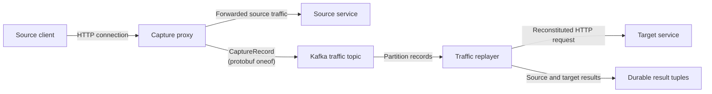
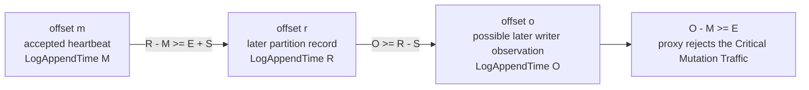
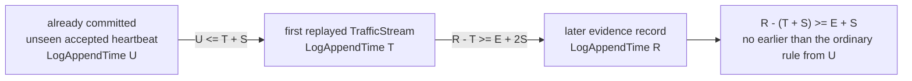
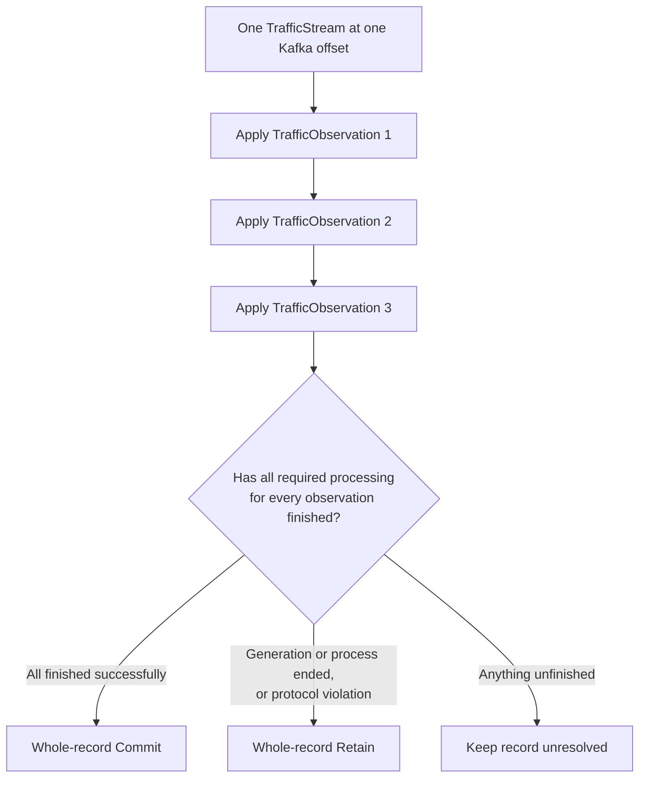
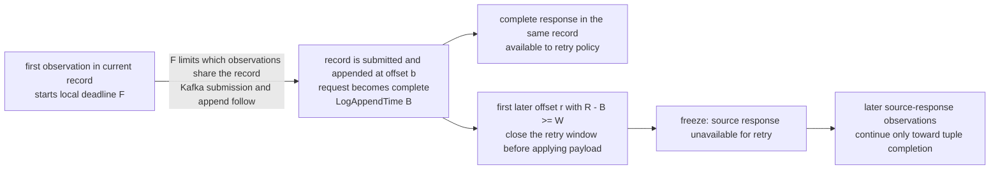
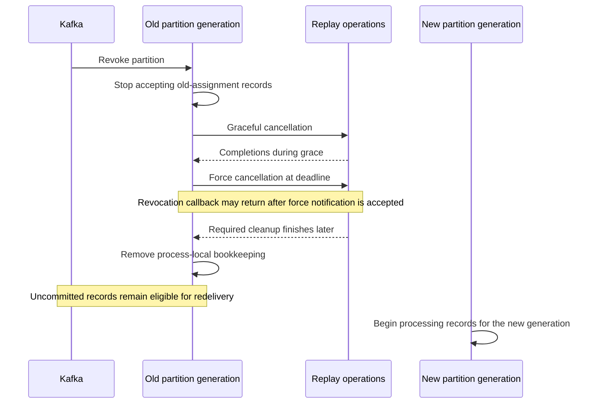

# Capture and Replay Architecture

**Status:** top-level design contract; implementation conformance is incomplete

This document defines the observable protocol shared by the capture proxy, Kafka, and the traffic
replayer: what each component guarantees, which failures are tolerated, when the replayer may
commit a Kafka record, and why the protocol is safe under its stated assumptions.

Companion documents (§16) refine this contract with the proxy algorithms, replayer behavior,
asynchronous-work accounting, and managed-fleet orchestration. Implementation class names, thread
names, and callback graphs belong in those documents, not here.

Implementation status: the working schema defines the three `CaptureRecord.payload` cases and
derives partitions from Kafka record metadata. Proxy, archive, and replayer code still require a
later implementation pass to produce and consume that envelope consistently.

Capture and replay provides representative source traffic for target validation, load, and mutation
replay. It does not promise that two distributed clusters will execute concurrent traffic
identically. Instead, the protocol removes the avoidable differences: it preserves captured request
bytes, source-connection ordering, and replay timing wherever those goals do not conflict.

## 1. Scope and managed-fleet boundaries

The protocol in this document is complete for:

- routing newly opened source connections across a horizontally scaled proxy fleet;
- capturing source traffic into Kafka;
- preserving the connection-local order needed to reconstruct HTTP;
- performing clean connection and proxy shutdown;
- handling proxy scale changes, shutdown, hard failure, and long inactivity;
- reconstructing requests and source responses;
- replaying requests against a target;
- requiring durable result-tuple output before committing Kafka records for a reconstituted
  request;
- committing or retaining whole Kafka records; and
- stopping safely during replayer rebalance, shutdown, or internal process failure.

HTTP/1.x pipelined requests are outside the settled protocol contract. This document does not
define behavior when one source connection has multiple outstanding requests or one inbound read
contains bytes from more than one request. Deployments cannot rely on capture or replay correctness
for those cases.

Managed-fleet recovery is not scheduled for near-term implementation. It is specified here and in
the managed-fleet companion to confirm that the protocol can support it without redesign. Recovery
after an interval of uncaptured source traffic must satisfy:

1. Missing source traffic cannot be reconstructed later.
2. A replay run must never silently cross an uncaptured interval.
3. A new run after an uncaptured interval requires a fresh source snapshot.
4. The new run requires a new immutable Kafka topic. Its replay start offsets must be fixed before
   proxies may publish captured traffic for that run.
5. Before the fresh snapshot is accepted, processes and source requests from the ended run must be
   proven unable to complete additional mutations against the source service.

The managed-fleet companion specifies the new-topic boundary and constraints on a possible future
`CaptureCoverageEstablished` extension, which is not one of the current three
`CaptureRecord.payload` cases. Reusing the ended run's Kafka topic is prohibited, automated
same-resource recovery is unsupported, and the source-specific proof that ended-run operations
cannot complete is deployment-defined. No implementation may claim automatic recovery until the
companion document authorizes it.

A capture-compromised proxy process never captures again. If it forwarded no source traffic without
capture, a fresh process may replace it in the existing Kafka topic and replay run — in an
unmanaged deployment this is simply starting a fresh proxy against the same topic. Records the
ended process already submitted remain valid in that run, including records that Kafka appends
after the replacement starts. Any qualifying higher-offset record on an affected partition,
commonly the replacement's initial or periodic heartbeat, may supply the broker-time evidence that
expires the ended process's incomplete connection state under §8. No identity handoff from the
ended process to the replacement is implied. If source traffic was forwarded without capture, the
current run ends and the five requirements above apply.

A managed controller may select same-run replacement only when its durable state proves that the
ended process was never authorized to forward without capture. If that fact is missing or
ambiguous, the workflow cannot claim uninterrupted capture, and restoring a complete guarantee
requires the full new-run procedure above.

## 2. System model



The **source** is the service receiving traffic during capture. The **target** is the service
receiving reconstructed requests during replay.

The proxy sits on the source traffic path. When source clients use TLS, the proxy terminates TLS
and captures the decrypted HTTP traffic before forwarding it to the source. It publishes the
captured representation to Kafka. The replayer reads Kafka partitions, reconstructs HTTP requests
and source responses, sends each reconstituted request to the target, and writes a durable tuple
describing the source and target results. Kafka provides ordered records within each partition and
assigns partitions to replayer group members; it provides no ordering across partitions.

**Strict capture** guarantees that every request classified as Critical Mutation Traffic that the
proxy permits to reach the source has a complete, durably acknowledged representation in Kafka that
can be reconstituted and replayed to the target. Strict capture therefore uses `fail-closed`: if
capture becomes compromised, existing and new connections cannot continue forwarding uncaptured
traffic. Non-strict operation uses `fail-open`, permanently abandons capture in that process, and
allows existing and new connections to continue forwarding to the source without the replay
guarantee.

A few terms recur throughout:

- The **terminal connection observation** is `CloseObservation`. `DisconnectObservation` and
  `ConnectionExceptionObservation` are non-terminal diagnostics and do not end source
  reconstruction.
- **Connection retirement** is the acknowledgement and removal lifecycle for one closed connection.
- **Drain** describes an aggregate operation that stops adding connections and lets existing
  connections retire.
- A **publisher lane** is the one ordered owner of Kafka submissions and acknowledgement callbacks
  for its writer and partition.
- **Replay intake** is the replayer state owner that applies Kafka records, reconstructs source
  HTTP, tracks heartbeat expiration, and determines when all processing associated with a Kafka
  record is finished.
- A **connection owner** maintains one target connection and the captured order of requests using
  it.

The protocol uses two independent timestamp domains:

- `TrafficObservation.ts` is the proxy-recorded source event time. The replayer uses it to
  preserve relative source timing when scheduling target operations.
- Each Kafka record's broker-assigned `LogAppendTime` is the only time used for
  capture-before-forward validation (§4), heartbeat baselines and broker-time expiration (§8), and
  the deterministic source-response boundary used by retry policy (§10).

Target scheduling uses `TrafficObservation.ts`, while the capture and retry rules named above use
`LogAppendTime`. When replaying traffic, Kafka reads (and pauses) are driven by the downstream 
consumer, which considers how much has been consumed by the target and other lifecycle activities.

The proxy also flushes each connection's captured observations at least periodically. A nonempty
connection-local `TrafficStream` is published within a bounded interval `F` (the
`trafficStreamFlushInterval`, defaulting to five seconds) of its first observation, even when the
record has not reached its size limit; size, Critical Mutation Traffic, and connection close may
end it earlier. This bounds how old a record's observations can be by the time the replayer reads
them — without it, a quiet or low-volume connection could hold its earliest observations until the
connection closed. `F` is proxy-local configuration, not a third event timestamp: the replayer
never interprets it and sees only the record boundaries it produces.
[Proxy Capture Protocol §4.2](proxyCaptureProtocol.md#42-publisher-ordering-and-acknowledgement)
defines the exact deadline, detachment, ordering, acknowledgement, and failure rules.

Kafka input is demand-driven per partition. The Kafka source owner tracks three independent
conditions for each assigned partition:

1. replay intake currently requests more records;
2. no prior local assignment generation for the partition is still cleaning up; and
3. neither revocation nor shutdown prohibits new intake.

The Kafka consumer may read the partition only while all three conditions permit it. Clearing one
pause reason cannot clear another.

Replay intake sizes its request-supply target as `N = P * T`, where `P` is the configured number of
requests per target Netty event-loop thread, defaulting to `2`, and `T` is the event-loop thread
count fixed at replayer startup. Startup requires `P >= 1` and `T >= 1`.

For this demand calculation, a **retry-ready request** is a reconstituted request that:

1. has not finished its turn on the target connection and has not been removed by cancellation;
   and
2. has received its immutable source-response input for retry policy — either the complete captured
   source response or an explicit result that no source response is available for that retry
   decision (§10).

Replay intake requests records for a partition while fewer than `N` retry-ready requests from that
partition remain. Reconstituting a request does not make it retry-ready while its retry input is
unresolved. The request may nevertheless begin target replay; this count controls Kafka input
demand, not target admission.

This makes Kafka lookahead adaptive to the captured responses that actually arrive. A request whose
complete source response is reconstructed quickly may become retry-ready far earlier than the
configured `B + W` boundary. A slow or missing response becomes retry-ready only when captured
close, broker-time expiration, finalized-archive end, or the first later Kafka record crossing
`B + W` supplies the explicit unavailable result. `W` is therefore an upper boundary for one
unresolved retry input, not a fixed amount of data or time that the replayer reads ahead for every
request.

`ConnectionRequestFinished` or cancellation removes a request from the supply. If the target turn
finishes before retry input resolves, a later retry-input result may still contribute to tuple
processing but does not add the request back to the supply. Replay intake recomputes partition
demand after every input that can change this count and applies each delivered partition batch
completely before recomputing. While every partition is paused, the Kafka source owner continues
the polls required for group membership.

This rule imposes no hard Kafka-record or byte ceiling. Reading far enough to resolve one request
may traverse many records for other connections, and every returned record is still processed in
offset order. A hard ownership ceiling could stop intake just before the record needed to complete,
close, or expire already-retained state, so the design instead accepts that extreme traffic density
or record size may exhaust memory. `N` limits ordinary retry-ready target supply; unresolved
requests and other traffic encountered before enough retry inputs resolve may exceed it.
[Replayer Processing and Commit Architecture §8](replayerProcessingAndCommitArchitecture.md#8-backpressure)
develops the full demand and backpressure model.

### 2.1 Identities

`captureActivationId` identifies one capture-authoritative lifetime of a proxy process.
`assignmentSequence` is a process-local identifier that is unique and never reused within one
`captureActivationId`. The proxy chooses a new value when Kafka supplies a replacement group
assignment, before accepting any connection under that assignment. The writer identity used for
newly opened connections is:

```text
writerNodeId = captureActivationId + ":" + assignmentSequence
```

Its numeric value and ordering have no protocol meaning. The proxy may generate it by incrementing
a process-local counter; only uniqueness and non-reuse within one `captureActivationId` are
required.

Every new assignment therefore creates a writer identity that cannot be reused within the
`captureActivationId`. Existing connections permanently retain the `writerNodeId` under which they
opened, so rapid rebalances may leave several older writer identities draining concurrently.

The out-of-group Kafka reachability probe runs before a consumer-group generation exists. Its
writer field is:

```text
writerNodeId = captureActivationId + ":PROBE"
```

`CaptureCapabilityProbe` confirms only that the proxy can publish to Kafka. It has no replay
meaning. If the replayer encounters one, it allows the Kafka record to become commit-eligible
without creating traffic, heartbeat, connection, writer-baseline, or expiration state.

`connectionId` is Netty's globally unique long-form channel identifier, though the protocol
requires uniqueness only within one `writerNodeId`. The complete connection identity is:

```text
(writerNodeId, connectionId)
```

Every protocol decision about a connection — expiration, terminal validation, metrics — uses the
complete identity. A bare `connectionId` is never enough to identify a connection across proxy
writers.

Every source connection is assigned one Kafka partition when it opens, and that mapping never
changes for the life of the connection:

```text
(writerNodeId, connectionId) -> Kafka partition
```

A proxy may publish connections to a partition, later drain all of them, and receive
new-connection eligibility for that partition in a future assignment. The future connections use
the future assignment's `writerNodeId`; the earlier identity never resumes.

Every local connection registry, publisher lane, and broker-time baseline is keyed by
`(writerNodeId, partition)`, not by one process-global current writer identity.

### 2.2 Protocol records

Every Kafka application-record value is one `CaptureRecord` protobuf envelope. Its `payload`
`oneof` identifies exactly one of these payloads:

- `TrafficStream` contains one or more `TrafficObservation` values for one connection. Each
  `TrafficObservation` records captured network or connection-lifecycle activity and carries `ts`,
  the proxy-recorded source event time retained for replay scheduling, and the connection-local
  sequence needed by this protocol.
- `WriterPartitionHeartbeat` periodically proves that one `(writerNodeId, partition)` can still
  publish acknowledged records. It identifies the writer; the partition is the Kafka partition that
  contains the record. It carries no connection state. Its `heartbeatIntervalMillis` field reports
  the configured publication interval for diagnostics and future sanity checks; it does not
  configure replayer expiration.
- `CaptureCapabilityProbe` confirms Kafka publication capability and is inert during replay.

`CaptureRecord`, `TrafficStream`, `TrafficObservation`, `WriterPartitionHeartbeat`, and
`CaptureCapabilityProbe` are fixed protobuf names. The active `CaptureRecord.payload` field is the
record-type discriminator; Kafka headers are not used for that purpose. An envelope with no
recognized payload follows the protocol-violation behavior in §13.

The interval `F` changes only where a proxy closes one `TrafficStream` and begins the next; it adds
no `CaptureRecord.payload` case or field. A traffic payload remains homogeneous in connection and
writer identity. A periodic connection flush may split one HTTP request or response across several
records, and one record may still contain the end of one response followed by some or all of a
later request on the same connection.

Neither `TrafficStream` nor `WriterPartitionHeartbeat` carries a partition in its body. The Kafka
partition that contains a record is the partition for every `(writerNodeId, partition)` key derived
from it. Keeping the partition out of the record body avoids two independently supplied partition
values that could disagree. The current archive import defined in §2.3 preserves the source
partition layout.

A Kafka topic must never contain records written under mutually wire-incompatible capture-protocol
formats. Reusing an existing topic for a wire-incompatible format is prohibited, even after the old
consumer group is empty or the deployment has entered a no-capture interval. A wire-incompatible
format requires a new Kafka topic, and the complete capture and replay cohort using that format
must use the new topic.

### 2.3 Imported capture archives

Bring-your-own captured traffic is supported only when the archive was produced by the same capture
protocol version that the replayer accepts. The archive is a versioned representation of Kafka
application records, not a file containing protobuf payloads alone.

[`BringYourOwnCapturedTraffic.md`](BringYourOwnCapturedTraffic.md) defines the archive and
orchestration details.

For every archived record, the exporter preserves:

- the source partition and offset;
- the original Kafka timestamp and timestamp type;
- the binary key and value, including null values;
- every Kafka header, preserving duplicate names and order; and
- the record's position within its source partition.

The archive also preserves the protocol/build version, source partition count, fixed exported
offset range for every partition, capture parameters `E` and `S`, an explicit `archiveEndMode`, and
integrity information that detects omitted, duplicated, reordered, or corrupted records. Export
reads exactly the recorded partition ranges; it does not use a timeout as an implicit successful
end boundary.

Import creates one Kafka application record for every archived record, writes it to the archived
partition (same-partition import is the current requirement of this document), preserves
partition-local order, and restores its binary key, value, and headers. Imported offsets and broker
leader epochs are newly assigned Kafka transport identities; the replayer uses the imported offsets
for commit accounting. The original offsets remain archive integrity and diagnostic data and do not
participate in imported-topic commits.

The timestamp policy has two modes:

- **`preserve`**, the default, imports each archived original `LogAppendTime` numeric value as the
  record timestamp on a dedicated bring-your-own topic configured to preserve producer-supplied
  timestamps. Kafka reports the destination timestamp type according to that destination
  configuration; the archive retains the source record's original timestamp type as metadata. The
  user asserts that the original broker clock-skew bound `S` was healthy. The replayer may apply
  the ordinary `E + S` expiration proof using the archived timestamp and archived `E` and `S`. That
  archived timestamp also reproduces the source-response retry boundary; the import broker's append
  time is not substituted for it.
- **`rebase-without-expiration`**, an expert mode, accepts newly assigned import-broker timestamps
  and automatically disables broker-time expiration for that input. Terminal connection
  observations still resolve incomplete state. The replayer uses the newly assigned timestamps for
  the source-response retry boundary, but never for the original capture run's expiration proof.

No mode may use newly assigned import-broker time to perform the original capture run's `E + S`
expiration proof.

`archiveEndMode` distinguishes two uses:

- **`finalized`** certifies that capture producers were stopped or quiesced before the fixed
  partition end offsets were selected. After replay intake processes a partition's declared final
  record, the import workflow supplies an explicit partition-end input. That input is not a Kafka
  record, has no Kafka offset or timestamp, and cannot by itself advance a commit. It resolves
  unresolved retry source-response input as unavailable and expires incomplete request and
  source-response assembly known at that boundary. Already-reconstituted target and tuple work
  continues normally, and its supporting Kafka records remain uncommitted until that work finishes.
- **`range`** represents an arbitrary finite range from a capture that may continue outside the
  archive. End of the range is not completion evidence. Open reconstruction and retry waits may
  remain unresolved without later records.

The importer and replayer require the mode explicitly; there is no implicit default. Reprocessing
the same archive delivers the same partition-end inputs at the same declared offsets.

## 3. Proxy group membership and connection routing

Kafka consumer-group membership is used only to load-balance newly opened source connections across
Kafka partitions. Membership state is not capture-health evidence and has no replay meaning.

The deployment uses a Kafka-provided assignment strategy supported by its selected consumer-group
protocol. The capture protocol does not require a custom assignor, subscription `userData`,
assignment metadata, member readiness state, minimum group size, or startup quorum. A built-in
sticky or cooperative strategy may reduce connection-routing churn, but neither property is
required for correctness.

Fleet capacity and startup policy are controller concerns, not group-assignment inputs. A managed
controller may require a configured number of proxies whose control-plane status reports
`captureReady=true` before routing source traffic, but that requirement is not carried through
Kafka membership or assignment metadata.

Before a proxy has received its first usable assignment, it has no partition on which it can
publish a new connection. The proxy completes its Kafka capability probes before joining the group
and does not open its source listener until:

- it has received its first assignment;
- it has proved that it can publish acknowledged records to Kafka; and
- the initial heartbeat required by §5 has been acknowledged and accepted for every partition it
  may use.

The first assignment has one acceptance gate. A failed, ambiguous, timed-out, or late initial
heartbeat on any permitted partition keeps the source listener closed for the entire assignment and
irreversibly enters the process-wide compromised workflow in §12.4. The proxy does not route around
the failed partition or accept connections on the others.

A client that attempts to connect before the listener opens is refused by the operating system; the
proxy never accepts a source connection that it cannot capture. If startup fails before the
listener opens, the proxy follows the process-wide `--capture-failure-policy` defined in §12.4. It
does not later resume capture in that process after applying either terminal policy.

After the first usable assignment is installed, the proxy retains it until Kafka supplies a
replacement assignment. Revocation, partition-loss callbacks, failed or stale membership polling,
empty polls, delayed heartbeats, coordinator outages, and group departure do not close a capture or
connection-acceptance gate; the proxy continues assigning new connections with its last usable
assignment. Kafka may temporarily assign the same partition to another proxy after considering the
old member gone. That overlap affects load distribution only: each proxy uses a distinct
`writerNodeId`, so captured records remain unambiguous.

When Kafka supplies a replacement assignment, the proxy:

1. chooses a new, previously unused `assignmentSequence` and creates the replacement assignment's
   `writerNodeId`;
2. publishes, receives acknowledgement for, and accepts that identity's initial heartbeat on every
   partition it may use;
3. begins assigning new source connections with the replacement assignment only after those
   acknowledgements and timestamp checks; and
4. continues heartbeats and connection retirement independently for every older writer identity
   that still has connections.

Failure on any one replacement-assignment partition leaves the whole replacement unusable and
enters the process-wide compromised workflow. The proxy does not continue accepting new connections
with a subset of the replacement assignment.

Connections accepted before the replacement retain their original proxy, writer identity, and
Kafka partition. There is no membership-health deadline and no application retry or failure policy
driven by membership after startup.

The initial heartbeat establishes the new assignment-scoped writer identity's broker-time baseline
before that identity accepts a source connection. Later timely heartbeats update that same
continuous baseline; they never create a new writer lifetime or reset a lapsed identity.

After an older identity's connections on a partition drain, the proxy retires that identity's
publisher lane locally. An unused writer-partition identity is already drained and may begin local
publisher retirement immediately when that assignment is replaced or the process retires.

Heartbeats carry no connection inventory, and group stability does not authorize replay settlement.

## 4. Capture-before-forward

For every request classified as Critical Mutation Traffic:

```text
If the source can apply the request,
then Kafka has already acknowledged every TrafficObservation
needed to reconstruct that complete request.
```

The converse is intentionally false. Kafka may contain a complete request that the proxy ultimately
does not send to the source.

Kafka must assign record timestamps using `LogAppendTime`. Workflow-managed capture topics set
`message.timestamp.type=LogAppendTime`; unmanaged deployments must configure the same topic
property. Before joining the proxy group, each Kafka capability probe supplies a producer timestamp
of zero and accepts the acknowledgement only when Kafka reports a positive record timestamp.
`LogAppendTime` replaces the supplied timestamp with broker time; a topic using `CreateTime` either
rejects the stale timestamp or reports it unchanged, so the proxy rejects startup in either case.

For each `(writerNodeId, partition)`, the proxy tracks `lastAcceptedHeartbeatLogAppendTime`,
initially established by the acknowledged initial heartbeat required by §3. The baseline is
continuous for the lifetime of that writer identity and partition. Neither an empty connection
registry, inactivity, nor a later assignment resets it.

Heartbeats are published every 10 seconds by default. The default proxy heartbeat expiration
interval `E` is 30 seconds. Let `H` be the configured publication interval. Proxy startup requires
`0 < H < E`; equality is invalid because it leaves no time for scheduling, Kafka publication,
retries, or acknowledgement processing. `E - H` is the available healthy-operation latency margin,
and deployments must choose a margin large enough for their expected operational jitter. This
margin is independent of the clock-skew allowance `S`.

Each `WriterPartitionHeartbeat` reports the proxy's configured interval in
`heartbeatIntervalMillis`. The field is informational; the replayer uses its separately supplied
`E` and `S` configuration for expiration decisions.

The proxy and replayer must receive the same `E` and `S` values for one capture-and-replay run; `S`
is defined in §8. A managed orchestration layer supplies the agreed values to all participating
processes; in an unmanaged deployment, maintaining that agreement is an operator requirement. The
timestamp proof in §8 is invalid when the processes are configured with different values.

A subsequent heartbeat updates `lastAcceptedHeartbeatLogAppendTime` only when:

```text
heartbeatLogAppendTime - lastAcceptedHeartbeatLogAppendTime < E
```

If the difference is greater than or equal to `E`, the heartbeat is late. The proxy does not update
the baseline and irreversibly enters its compromised state. For one writer and partition, the proxy
does not submit a later heartbeat until the current heartbeat is acknowledged and accepted, so a
proxy that observes a late heartbeat cannot publish a later heartbeat that appears to restore
freshness. This is a proxy invariant; the replayer does not add a separate sticky-lapse state.

Separately from broker timestamps, the proxy enforces a local monotonic acknowledgement deadline of
`E` for each `(writerNodeId, partition)`: if a heartbeat acknowledgement is not processed and
accepted within `E` of the previous acceptance (initially, of the initial heartbeat's submission),
the process irreversibly enters its compromised state, and a later acknowledgement cannot renew the
deadline or restore capture. This local deadline complements the `LogAppendTime` checks above
rather than replacing them.
[Proxy Capture Protocol §5.2](proxyCaptureProtocol.md#52-heartbeat-publication) defines the exact
scheduling and race rules.

For every Critical Mutation Traffic request, the proxy enforces the guarantee in this order:

1. Capture the request observations.
2. Publish every observation required to reconstruct the complete request.
3. Wait for Kafka acknowledgement.
4. Read the Kafka `LogAppendTime` of the `TrafficStream` containing the observation that permits
   the request to take effect.
5. Compare that time with `lastAcceptedHeartbeatLogAppendTime`.
6. Continue only when the difference is less than `E`.
7. Only then submit the source traffic that permits the request to take effect.
8. Otherwise, irreversibly enter the compromised state and apply `--capture-failure-policy`.
   `fail-closed` does not forward the request and closes the connection as the process terminates.
   Unmanaged `fail-open` forwards the waiting request without authoritative capture and leaves the
   connection open in permanent pass-through mode. Managed `fail-open` blocks that source-bound
   forwarding until the controller durably records incomplete capture and acknowledges that exact
   activation.

The comparison and forwarding decision share a one-way local state transition. Once the proxy is
compromised, no request may newly pass this check and forward Critical Mutation Traffic as
captured. The proxy immediately applies `--capture-failure-policy`: `fail-closed` terminates
without orderly retirement, while `fail-open` permanently abandons capture. Unmanaged fail-open
switches existing and new TCP connections to uncaptured forwarding immediately; managed fail-open
first waits for the controller acknowledgement above. Neither policy permits capture-authoritative
operation to resume in that process.

This proof assumes that the source cannot mutate state before receiving the complete request.
Deployments whose source handlers apply mutations while an incomplete request body is still
arriving require full request buffering or another separately specified protocol.

The broker timestamp is never used to order HTTP observations or schedule target operations:
connection-local `connectionObservationSequence` supplies observation order, and
`TrafficObservation.ts` supplies source event time for replay scheduling (§2).

The connection-record interval `F` (§2) does not change the capture-before-forward rule: periodic
detachment and enqueueing never wait for Kafka acknowledgement, while Critical Mutation Traffic
still waits for acknowledgement of its complete request representation before the final
execution-enabling source bytes are forwarded.

### 4.1 Denial-of-service bounds for incomplete requests

The proxy places hard bounds on incomplete requests so that a client cannot retain unbounded proxy
or replayer state by sending one byte at a time.

At minimum, the proxy enforces:

- an absolute maximum request-assembly duration measured from the first request byte and never
  reset by later progress; and
- bounded request and header bytes while the request remains incomplete.

The proxy also enforces a separately configurable maximum lifetime for the client connection,
defaulting to 60 minutes. This bounds how long one connection can delay a planned proxy
connection-set drain even when its requests individually stay within the request-assembly limits.
A deployment may explicitly configure a different lifetime when required.

The two time limits are independent: the connection-lifetime timer starts when Netty accepts the
connection and closes the connection when that lifetime expires, while the request-assembly timer
starts with the first byte of each request and protects incomplete HTTP assembly.

When either bound is exceeded, the proxy stops forwarding that request, closes the affected
connection, and publishes the terminal connection `TrafficObservation` after all earlier
observations for the connection. An incomplete Critical Mutation Traffic request never receives the
source traffic that would permit it to take effect.

These are proxy denial-of-service limits, distinct from replayer expiration after missed
writer-partition heartbeats.

## 5. Writer-partition heartbeats

For every `(writerNodeId, partition)`, the proxy publishes one atomic `WriterPartitionHeartbeat` at
the configured interval. The record contains no connection identities. It states only that this
writer identity can still publish acknowledged records to this partition within the protocol's time
bound.

The proxy still maintains an exact local connection registry. That registry routes existing
connections, waits for connection retirement, proves that the registry is empty before its
publisher lane retires, and retains older writer identities while their connections close. The
registry is never transmitted to Kafka.

A heartbeat does not open, close, list, omit, or permanently retire a connection. Normal connection
completion is represented by the connection's durable terminal `TrafficObservation`. Failure to
publish that terminal observation compromises capture; the replayer does not use a second
proxy-authored connection list to repair that proxy failure.

The proxy publishes:

- an initial heartbeat on every usable partition before accepting a source connection under a new
  writer identity; and
- periodic heartbeats while that writer identity is current or still has retiring connections.

Each `WriterPartitionHeartbeat` is one Kafka record, so there is no chunk assembly, partial-list
state, heartbeat sequence, or connection-membership interpretation. Kafka offset orders heartbeats
within the partition, and Kafka `LogAppendTime` supplies the authoritative time used by §§4 and 8.

Kafka acknowledgement means that all in-sync replicas required by the topic's durability policy
have accepted the record. The producer must preserve submission order across retries and prevent a
retry from creating a conflicting duplicate. These are protocol requirements, not optional tuning.

Within one connection, the proxy assigns a contiguous `connectionObservationSequence` and submits
`TrafficObservation` values to Kafka in that order. Kafka preserves that connection-local order
across its records. Other connections and heartbeats may be published concurrently and interleave
in the partition; the replayer never needs to reorder one connection's observations.

### 5.1 Producer ownership

The protocol permits one Kafka producer and one publisher lane for all partitions. The lane orders
that producer's submissions and callbacks. Scaling that publisher is safe only when, for each
`(writerNodeId, partition)`:

- exactly one producer and publisher-lane owner publishes its heartbeats and observations in one
  submission order;
- ownership never overlaps; and
- a handoff waits for every submission and callback from the previous owner to finish before the
  next owner begins.

If one producer becomes a measured throughput bottleneck, the proxy may add producer instances and
assign each producer a mutually exclusive set of Kafka partitions.

Different proxy writers may concurrently publish existing connections to the same Kafka partition;
the single-owner requirement is within one writer and partition. It preserves one submission order
for that writer's connection observations and heartbeats, and the fully drained handoff prevents a
previous producer from publishing a late record after its successor begins.

## 6. Connection opening and retirement

### 6.1 Opening

The proxy adds a newly opened connection to its local registry before accepting its first
`TrafficObservation` for publication. The connection permanently retains its selected
`writerNodeId` and partition.

### 6.2 Clean connection retirement

A closed connection is retired in one strict order: after Netty reports the close and no further
network traffic can arrive for the connection, its event-loop owner submits the terminal
`CloseObservation` after every earlier observation, waits for Kafka to acknowledge the terminal and
every earlier observation, and only then removes the connection from the local registry.
[Proxy Capture Protocol §5.1](proxyCaptureProtocol.md#51-local-registry-and-connection-retirement)
defines the exact steps.

If an acknowledgement fails or its outcome is ambiguous, the proxy does not publish an
authoritative completion for that connection. The proxy closes capture and follows its configured
failure behavior. Heartbeats stop because the process is compromised; they never substitute for the
missing close.

The terminal `CloseObservation` establishes a replayer validation cutoff:

> After the replayer processes a connection's `CloseObservation`, any subsequent
> `TrafficObservation` for the same `(writerNodeId, connectionId)` is a protocol violation and
> causes the containing Kafka record to be retained, high-severity diagnostics and an alarm, and
> termination of the replayer process.

This is a replayer validation rule, not Kafka producer fencing.

Detection is best effort over the Kafka history and process-local state available to the running
replayer. The replayer does not persist a tombstone for every closed connection or scan backward
from its committed cursor. If the close is already in committed Kafka history after restart, an
invalid later observation may be treated as fresh reconstruction. The proxy's
connection-retirement invariant prevents that stream in correct operation.

A `CloseObservation` unambiguously states that Netty has ended that connection. Remote closure,
local closure, and unrecoverable channel failure all close the real Netty channel and therefore
produce the normal terminal `CloseObservation`; `DisconnectObservation` and
`ConnectionExceptionObservation` are non-terminal. When the replayer processes `CloseObservation`,
the replayer:

- expires the connection's current incomplete request assembly;
- marks an incomplete source response as expired;
- allows an already-started target transaction to reach its normal outcome;
- requires durable tuple output for every request that was reconstituted;
- requires no tuple when no request was reconstituted; and
- makes the affected Kafka records eligible for commit after all associated processing finishes.

## 7. Writer-partition publisher retirement

Writer-partition retirement is local proxy lifecycle management. It does not publish a terminal
Kafka control record and does not directly settle replayer state.

A publisher lane is scoped to a single `(writerNodeId, partition)` pair, and retiring the lane is
what makes that pair permanently quiet. The lane retires only once nothing under the pair can
publish again: new connections for the partition are gated off under that writer identity, every
connection the identity held on the partition has fully retired with its terminal and all earlier
observations acknowledged, the identity's registry for the partition is empty, its periodic
heartbeats have quiesced, and every send the lane already accepted has finished. Lanes for other
writer identities on the same partition are untouched, so a lane left from an earlier assignment can
drain while a newer identity captures on that partition. What retirement buys is the guarantee that
every source-completable request this proxy sent on the partition under that identity already has a
complete, acknowledged Kafka representation. During clean process shutdown, the shared producer
closes only after every publisher lane using it has retired.
[Proxy Capture Protocol §4.3](proxyCaptureProtocol.md#43-writer-partition-publisher-retirement-barrier)
defines the retirement barrier and its ordering.

Each acknowledged `CloseObservation` resolves its connection independently. If a proxy crashes or
stops publishing before a connection closes cleanly, §8 defines how later broker-time evidence may
expire only the incomplete connection state already known to the replayer. The replayer's
broker-time baseline for a `(writerNodeId, partition)` is shared by every connection under that
key. While any incomplete state for the key exists, the baseline is retained and later observations
under the key continue to use it. Once no incomplete state for the key remains, the replayer may
discard the baseline; a later observation then starts fresh state under the §8 rules for a key with
no baseline, which can only expire later than the retained baseline would have.

The proxy must never resume a locally retired writer identity. A future assignment uses a new
`writerNodeId`.

Unexpected death of any proxy event loop terminates the proxy process. The process is considered
unstable, and no cross-thread recovery transfers ownership of its connections or publication state.
Logging, metrics, and cleanup are best effort; process termination must not wait for orderly local
recovery.

## 8. Broker-time expiration of known connection state

Each `WriterPartitionHeartbeat` is a periodic statement that one `(writerNodeId, partition)` can
still publish acknowledged records within the capture deadline. It keeps every incomplete
accumulator already known for that writer and partition from expiring merely because an individual
connection is idle. It does not enumerate those connections.

A replayer may begin reading after earlier heartbeat records for a writer and partition have
already been committed. The first non-probe Kafka record that replay intake processes for a
`(writerNodeId, partition)` establishes that key's process-local broker-time starting point. The
baseline belongs to the key, not to any one connection: every connection under the key, including
fresh reconstruction started after an earlier expiration, uses the same value.

If that first record is a `WriterPartitionHeartbeat`, replay intake records the heartbeat's
`LogAppendTime` as its process-local heartbeat baseline and applies the `E` comparison to every
heartbeat encountered afterward. If the proxy accepted that heartbeat, the process-local value
equals the proxy's baseline. If the proxy rejected it as late, the proxy left its own baseline
unchanged and permanently abandoned capture-authoritative operation; the replayer cannot observe
that local decision, so its process-local value is later than the proxy's and can only delay
expiration. Because the proxy publishes no later heartbeat after detecting a lapse, the replayer
needs no additional state recording that the writer previously missed its deadline.

If that first record is a `TrafficStream`, replay intake records the record's `LogAppendTime` as
`T`. The exact preceding heartbeat is unavailable, so §8.1 supplies the conservative expiration
reference derived from `T`. The first heartbeat encountered afterward is accepted unconditionally
and replaces that fallback with its exact `LogAppendTime`.

The replayer's baseline is therefore never earlier than the proxy baseline used in the Critical
Mutation Traffic forwarding check for a later `TrafficObservation`. The argument separates the only
two possible cases:

1. If the proxy accepted the first heartbeat observed by this replayer process, both baselines
   become that heartbeat's `LogAppendTime`. For every later heartbeat, equal baselines and the same
   `E` comparison produce the same result. Accepted heartbeats keep the baselines equal.
2. If the proxy rejected that first observed heartbeat, the proxy retains its earlier baseline and
   irreversibly abandons capture-authoritative operation. The replayer uses the rejected
   heartbeat's later `LogAppendTime`, so its baseline is later than the proxy's. The proxy
   publishes no subsequent heartbeat, so there is no later transition that could reverse the
   ordering.

The same two cases apply when a `T` fallback is replaced by the first heartbeat encountered after
`T`. Therefore the invariant `replayer baseline >= proxy baseline` holds after the starting record
and after every later heartbeat that can exist.

Let:

- `E` be the heartbeat expiration interval configured identically in the proxy and replayer;
- `S` be the maximum permitted backward movement between Kafka `LogAppendTime` values at increasing
  offsets in one partition, configured identically in the proxy, replayer, and fleet clock monitor;
- `M` be the replayer's accepted heartbeat baseline for that writer and partition; and
- `R` be the `LogAppendTime` of any later record at a higher offset in that partition, regardless
  of which proxy wrote it and including `CaptureCapabilityProbe` records and other writers'
  heartbeats. Using a record as `R` creates no state for that record's writer.

The ordinary expiration proof can be read on this Kafka-offset timeline. Horizontal position is
offset order, not proportional elapsed time; broker timestamps may move backward by at most `S`.



The replayer may expire the incomplete connection state that it already knows for that writer and
partition when:

```text
R - M >= E + S
```

Suppose a later observation from the expired writer has broker timestamp `O`. The clock-skew bound
requires:

```text
O >= R - S
```

Therefore:

```text
O - M >= E
```

The proxy's forwarding rule in §4 rejects that observation and enters the compromised state before
the corresponding Critical Mutation Traffic can reach the source. It is therefore safe for the
replayer to release the incomplete state known at offset `R`.

### 8.1 First traffic record when the preceding heartbeat is unavailable

A replayer may first encounter a `TrafficStream` after the heartbeat that authorized the proxy to
publish it has already been committed. This commonly occurs after restart at an uncommitted traffic
record. The replayer does not need to scan backward or retain process-local heartbeat state across
that restart.

Let:

- `T` be the `LogAppendTime` of the first `TrafficStream` record encountered for that writer and
  partition; and
- `U` be the `LogAppendTime` of the latest accepted heartbeat before `T`. That heartbeat is already
  committed and unseen by this replayer process.

The restart fallback accounts for that unseen heartbeat:



The proxy could not have accepted the connection without an earlier acknowledged heartbeat. Since
`T` is at a higher Kafka offset than that heartbeat, the skew bound guarantees:

```text
U <= T + S
```

The replayer therefore conservatively treats `T + S` as the latest possible unseen heartbeat time.
It may expire the already-known incomplete state when:

```text
R - (T + S) >= E + S
```

which is equivalent to:

```text
R - T >= E + 2S
```

This fallback can expire later than the exact-heartbeat rule but never earlier. Any accepted
heartbeat encountered after `T` replaces the fallback with its exact `LogAppendTime` and restores
the ordinary `E + S` rule. The replayer must inspect every partition offset from `T` through `R`;
it may not skip an intervening heartbeat or a `TrafficObservation` that contributes to the
incomplete state.

Expiration:

- ends each currently known incomplete request accumulator for that writer and partition;
- marks each currently known incomplete source-response accumulator as expired;
- ends the current process-local reconstruction for each affected connection;
- allows a target HTTP transaction already in progress to continue;
- still requires a durable tuple for every request that was reconstituted; and
- requires no tuple when no request was reconstituted.

Expiration releases only those known accumulators and closes only their current process-local
reconstruction. It does not retire the writer, partition, connection identity, or future
reconstruction state. Any already-created connection owner finishes its admitted complete requests
and tuple output, closes its target channel, and is then removed.

The first later `TrafficObservation` for that connection is handled exactly as it would be after a
replayer restart whose cursor begins at that observation, except that the writer-partition baseline
is retained: fresh reconstruction under a key that still has a baseline continues to use it, and
the `T` fallback applies only when the key has none. Fresh reconstruction uses
`TrafficStream.priorRequestsReceived` and `TrafficStream.lastObservationWasUnterminatedRead` to
avoid parsing the tail of a request or response as a new request. It discards incomplete preceding
HTTP assembly until the next captured request boundary. The first `connectionObservationSequence`
encountered by that fresh reconstruction establishes its local sequence baseline; every later
observation must follow contiguously. Fresh reconstruction never joins the expired accumulator.

If later observations begin at a captured request boundary and form a complete request, that
request replays normally. If they remain incomplete and no accepted heartbeat refreshes them, a
later broker-time horizon expires them independently. This is consistent with the accepted
possibility that Kafka contains a complete request that the proxy did not send to the source.

An explicit terminal connection observation is different. It permanently ends that connection
identity, and every later `TrafficObservation` for it is a protocol violation.

Expiration is the required final outcome for the affected accumulators. The replayer commits the
Kafka records holding those observations after every other independent operation associated with
each whole record has also finished. Leaving an expired accumulator's records permanently
uncommitted would create a poison pill.

Kafka backlog does not itself cause expiration, because the rule uses durable broker timestamps
rather than consumer wall-clock time. For each partition, the replayer tracks the greatest
`LogAppendTime` it has observed. If a record at a higher offset has a `LogAppendTime` more than `S`
below that greatest value, the Kafka record stream directly demonstrates that the declared bound
was violated. The replayer emits high-severity diagnostics and terminates immediately without
making an expiration or commit decision from that record.

This check is a detector, not a guard. An expiration decided at an earlier offset `R` may already
have been unsafe if the violating record's true position in time is before `R - S`, and the records
it released may already be committed. The check guarantees that such a violation is loud rather
than silent; the expiration proof itself remains valid only while the declared `S` bound is
actually enforced on the brokers.

External attestation of broker clock health is a managed-workflow responsibility. Loss of that
attestation does not need to be inferred or handled by the replayer. The explicitly selected
`rebase-without-expiration` archive mode in §2.3 does not claim the broker-time expiration proof
and accepts that incomplete hard-crash state may remain unresolved.

## 9. Replayer processing and whole-record commit

One `TrafficStream` may contain several ordered `TrafficObservation` values.

The replayer can commit only the whole record.

The replayer processes each observation in the record's order while tracking that the observations
belong to one indivisible Kafka record. It does not wait to validate the future semantic effect of
every later observation before processing an earlier valid observation:



Applying the observations in order does not require waiting for asynchronous target,
source-response, or tuple work started by one observation to finish before applying the next
observation. Those operations may overlap, but the observations that create or update them are
applied in Kafka order.

`Commit` and `Retain` describe only whole Kafka records:

- `Commit` means the replayer may advance the Kafka partition's committed offset past the record.
- `Retain` means the replayer deliberately leaves the record uncommitted and eligible for
  redelivery.

**Redelivery** is Kafka's ordinary at-least-once behavior, not a replayer operation. A retained
record's offset is never committed, so whichever consumer next owns the partition — a later
partition generation in this process or a future replayer — receives the record again from the
committed position. Nothing is re-enqueued, and no redelivery request exists; retention is simply
the absence of a commit.

`Retain` is not a normal disposition, and no replay outcome selects it. An unsuccessful target
response, an expired source response, and a failing tuple sink all finish or retry within the
current delivery; none of them requests redelivery. In an undisturbed run every record eventually
commits. A record comes to require redelivery in only three ways, each of which ends the
processing scope that was handling it:

- **Cancellation.** Partition revocation or replayer shutdown ends the partition generation before
  the record's work finished. Cancelled work never counts as successful processing, so the record
  stays uncommitted and a later generation receives it again.
- **Process failure.** A crash, out-of-memory failure, or external kill leaves every uncommitted
  record implicitly retained; no decision is recorded anywhere.
- **Protocol violation (§13).** The record is deliberately marked `Retain` and the replayer
  terminates. That record is a poison pill: every restart encounters it again until the input is
  corrected outside this protocol.

The diagram's `Retain` branch therefore fires only through these paths, never as the outcome of
successfully applied observations.

Processing associated with an observation can include:

- incomplete HTTP request assembly;
- a reconstituted request sent to the target;
- source-response assembly;
- durable tuple output;
- connection expiration or terminal validation; and
- cleanup of resources created by those operations.

When a terminal observation or broker-time expiration ends an incomplete request or
source-response accumulator, the replayer does not finish independent processing merely because the
supporting Kafka record remains uncommitted, and it does not complete or cancel a target HTTP
transaction already running for a reconstituted request.

A record becomes eligible for `Commit` only after every required operation associated with all of
its observations has reached its required final state. If any operation requires redelivery, the
whole record is `Retain`, even when other observations in the same record finished successfully.

Every `TrafficStream` whose observations contribute to one or more reconstituted requests remains
unresolved until every required tuple for those requests is durable. An observation belonging only
to an incomplete request that expires without producing a reconstituted request needs no tuple and
finishes through the expiration rule in §8.

A later invalid observation does not retroactively undo a target request already sent from earlier
valid observations. The invalid containing record is retained and replay halts according to §13.

A `WriterPartitionHeartbeat` record finishes once replay intake applies it, whether or not it
updates the writer-partition broker-time baseline; a late heartbeat that does not move the baseline
still finishes and commits. These control records are whole Kafka records and follow the same
contiguous-offset commit rule.

Retaining one record prevents the replayer from committing a later Kafka offset past it. This
preserves redelivery of the retained record.

## 10. Target replay and durable tuples

When the replayer recognizes a complete captured request, it may begin the target HTTP transaction
without waiting for the captured source response or connection closure.

For a positive configured `speedupFactor`, the nominal replay time is:

```text
replayStart + (sourceObservationTime - firstSourceObservationTime) / speedupFactor
```

Requests captured on the same source connection retain their captured order, and that ordering
takes priority over exact pacing: if the target is slower than the source, later requests on that
connection wait rather than overtake the request ahead of them. Independent source connections may
continue concurrently. The replayer reuses the corresponding target connection across requests
while its unchanged target-connection policy permits that connection to remain open.

The target result and captured source response may finish in either order.

The configured `--max-concurrent-target-attempts` limit bounds the number of requests with a target
attempt in progress. A request holds a concurrency slot only from immediately before a target send
until that attempt has produced its outcome. If the configured retry policy needs the captured
source response before it can decide whether to retry, the request releases its slot while it waits
and acquires a slot again before any further attempt. Holding a slot while waiting on a non-target
event would let target concurrency couple otherwise independent connections and partitions.

The source response used by retry policy has a finite, deterministic Kafka-record boundary. Let:

- `B` be the `LogAppendTime` of the Kafka record containing the final `TrafficObservation` needed
  to reconstitute the complete source request; and
- `W` be the positive configured source-response retry window, defaulting to five seconds.

Replay intake examines every later record on that partition in increasing offset order. If the
complete captured source response is reconstituted before the boundary is crossed, replay intake
freezes that complete response as the source-response input for every retry decision for the
request. Otherwise, the first later record with `LogAppendTime R` satisfying:

```text
R - B >= W
```

closes the retry window before replay intake applies that record's payload. Replay intake sends the
request an immutable result stating that no source response is available for retry policy. A
captured close or broker-time connection expiration may produce the same result earlier. Partial
source-response bytes are never passed to retry policy.

This is intentionally a record-granular boundary. A complete source response encoded later in the
same `TrafficStream` as the request-completing observation is applied before any higher-offset
record can cross the boundary and is therefore available to retry policy. `W` does not compare
`TrafficObservation.ts` values and does not exclude a same-record response based on source elapsed
time.

`W` is a capture Kafka broker-time window used only to decide whether retry policy may consult the
captured source response. It is not replay wall-clock waiting and does not prescribe a fixed Kafka
read-ahead amount. Kafka input demand counts retry-ready requests, so a complete captured response
often resolves that demand much earlier than `B + W`; only a slow or missing response needs a
later record to cross the boundary. It shares its five-second default with the proxy's record
interval `F` (§2) by coincidence, not by constraint: `F` limits which observations may enter one
proxy-local record, while `W` compares the `LogAppendTime` values of separate Kafka records. A
response in the request-completing record remains available to retry policy regardless of source
elapsed time.

`W` is also independent of the 10-second heartbeat interval `H` and 30-second writer-expiration
interval `E`. A heartbeat may be the first later record that crosses `B + W`, so `H` can affect how
coarsely the five-second boundary is observed on an otherwise quiet partition, but no correctness
rule requires an inequality between `W`, `H`, and `E`.

Because of record granularity, publication latency, heartbeat cadence, and permitted skew, the
first record crossing the boundary may arrive well over five source seconds after request
completion: the effective elapsed time can include the remainder of the current `F` interval, Kafka
submission and append latency, `W` itself, the wait for the first later partition record, and the
skew tolerance `S`. No proof treats that sum as an exact source-time deadline; the record offsets
and `LogAppendTime` values make the decision deterministic. Choosing `F` small relative to `W`
brings the operational boundary closer to source elapsed time, but no correctness argument
currently requires a numerical relationship between them.



The retry result is irreversible. A later Kafka record whose timestamp moves backward does not
reopen the window, and a complete source response reconstructed later does not change any retry
decision. Under the declared skew bound, the boundary may include or exclude a response within
approximately `S` of the configured interval, but the same partition offsets and preserved
`LogAppendTime` values always produce the same retry input. Any higher-offset record type may
establish the boundary, including `WriterPartitionHeartbeat` and `CaptureCapabilityProbe`.

This retry boundary is separate from final source-response accumulation. If the retry boundary
closes first, replay intake continues accumulating the source response for tuple output. A later
complete response may therefore appear in the tuple even though retry policy received no source
response. The boundary releases only the target retry decision; it does not complete tuple work,
release Kafka-record processing, or authorize commit.

Before the Kafka records supporting a reconstituted request may be committed, the replayer writes a
durable tuple for that request. The tuple records the available source and target outcomes,
including a source response that is complete or expired.

The Kafka processing associated with that request cannot finish until:

- the target operation has reached the outcome required by replay policy;
- the source response has become complete, expired, or otherwise reached its defined final state;
- the tuple has been written durably; and
- all resources owned by those operations have been released.

A terminal connection observation or broker-time expiration may finalize the source-response side
as expired. Neither erases the request, cancels the target transaction, or waives durable tuple
output. A missing or expired source response does not prove that the source mutation failed; the
tuple must represent the source-response outcome without inferring an unobserved source result.

The system is at-least-once. A process may crash after sending the target request or writing the
tuple but before committing Kafka. Redelivery may therefore send the target request again and write
a duplicate tuple. This protocol accepts those duplicates and introduces no deduplication
mechanism.

## 11. Replayer partition reassignment

Kafka assigns partitions to replayer group members. Records themselves are not assigned; a replayer
polls records from its currently assigned partitions.

For one partition, a **partition generation** is one uninterrupted period during which the replayer
owns that partition. The replayer has one cancellation grace interval, set by a command-line option,
with a **one-second default**. It may be raised, but must remain safely below the Kafka poll interval:
that interval is also the rebalance timeout, and exceeding it fences the member, which turns a
graceful revocation into a lost one and discards all staged progress. The default is the smallest
useful value rather than a generous one, because the revocation callback stalls reading on every
partition the replayer holds — not only the revoked ones — and blocks the entire consumer group's
rebalance while it runs.

When Kafka revokes the partition, the replayer stops accepting records from the revoked
generation and immediately cancels every request whose complete bytes are not already on the wire —
including one partway through sending, which cannot finish without further target writes that
graceful cancellation will not issue. A fully sent request, and the tuple work needed to finish it,
get the grace interval — completions during that wait may still commit, and only when the response
was obtained, no retry remains, and the tuple is durable. At the deadline it sends force cancellation, and `onPartitionsRevoked`
returns once replay intake accepts that notification, without waiting for every forced cleanup to
finish. Cancelled work requires redelivery rather than counting as successful processing, and a
newer generation of the partition does not process records until the old generation's in-process
work and cleanup finish.

Because a revocation commits only the contiguous prefix of finished records, a partition whose
earliest uncommitted record outlives the grace interval commits nothing, and repeated revocations
arriving faster than that record finishes prevent the committed position from ever advancing. Every
individual revocation looks like ordinary at-least-once redelivery, so the replayer makes the
condition visible instead of guessing at it: each retiring generation reports how many records it
committed and how many it read. A run of generations retiring with zero commits on the same partition
is that stall, and the operator's levers are the grace interval and how much is admitted ahead of the
head record. `replayerProcessingAndCommitArchitecture.md` §9.5 defines both measurements.
[Replayer Processing and Commit Architecture §9.2](replayerProcessingAndCommitArchitecture.md#92-bounded-revocation-grace-and-scoped-cancellation)
defines the exact sequence.

The completion rule is:

> After every record and operation from the revoked partition generation reaches its required final
> state, the replayer removes that generation's process-local bookkeeping. Kafka records that have
> not been committed are implicitly retained and remain eligible for redelivery by a future
> partition generation.

A commit rejected because the replayer no longer owns the partition is not retried under the old
generation. If ownership is lost while a previously submitted commit has an unknown broker outcome,
the replayer records the attempt as `ownership lost; broker outcome unknown`. It neither retries
the commit nor waits indefinitely for its callback. It cleans up the old assignment's process-local
state and lets Kafka's next assigned offset determine whether redelivery occurs. A late callback is
ignored except for logging and metrics.

Partitions are independent. A partition with no unfinished prior generation may begin processing
immediately even while another partition is still cleaning up its revoked generation.



No timeout permits the replayer to discard old in-process state and continue as though cleanup
succeeded. A timeout may terminate the process.

## 12. Process failure and shutdown

### 12.1 Replayer event-loop death

Unexpected death of a replayer event loop terminates the replayer process.

The process is unstable because the sole owner of mutable connection, target, timer, and replay
state no longer exists. The system does not transfer that ownership to another thread or construct
successful completion from partial cleanup.

After fatal event-loop death is detected, the replayer emits best-effort diagnostics and starts
bounded fatal-process termination. It does not wait for cleanup, completion, or Kafka commit
coordination owned by the failed event loop. Exit code `80` is reserved for fatal event-loop-owner
loss. The diagnostic flushing, shutdown-hook bound, watchdog, and final halt procedure are defined
in
[Replayer Processing and Commit Architecture §10.3](replayerProcessingAndCommitArchitecture.md#103-unstable-process).

Shutdown hooks may close independent process resources, but they do not manufacture successful
replay completion. Any concurrent external operation may or may not complete. Kafka's committed
offset determines the durable outcome after restart: correctness relies on Kafka redelivering
records whose offsets were not committed, just as it would after an out-of-memory failure or hard
process kill.

### 12.2 Normal replayer shutdown

Normal shutdown applies the revocation pattern process-wide: stop accepting new Kafka records,
run the same graceful-then-forced cancellation with the configured grace interval, complete Kafka
commits that become valid while partitions are still owned, mark unfinished whole records for
redelivery, and close Kafka, tuple output, transformation resources, and event loops after
process-local cleanup. Cancellation never causes a Kafka commit.
[Replayer Processing and Commit Architecture §10.1](replayerProcessingAndCommitArchitecture.md#101-normal-shutdown)
defines the ordered steps.

### 12.3 Orderly proxy shutdown

An orderly shutdown is a planned operation performed while capture and Kafka publication remain
trustworthy. Connection and publisher-retirement ordering remain defined in §§6–7 of this document.
The shutdown timeline is bounded and every interval is configurable; the defaults end in an
independent watchdog hard stop at 300 seconds, and managed orchestration must provide an external
termination grace period longer than the configured internal hard-stop deadline.
[Proxy Capture Protocol §3.5](proxyCaptureProtocol.md#35-scale-down) defines the normative timing
and failure behavior.

### 12.4 Proxy capture failure modes

An unexpected proxy event-loop death, an out-of-memory-like failure, or corrupted internal
ownership always terminates the process immediately.

The first of the following events closes the proxy's one-way capture state and applies
`--capture-failure-policy` to the whole process:

- any Kafka failure, timeout, or ambiguous result exposed to the application;
- expiration of a heartbeat acknowledgement deadline `E`; or
- any other event proving that capture can no longer be trusted.

That transition atomically closes every capture-authoritative gate and notifies the acceptor,
connections, heartbeat scheduler, and publisher lane. A later Kafka acknowledgement cannot restore
capture. Previously acknowledged traffic remains valid; the transition does not retroactively
invalidate it.

- `fail-closed` emits high-severity diagnostics and terminates immediately. It does not attempt
  orderly connection or publisher retirement because Kafka acknowledgements are no longer
  trustworthy.
- `fail-open` permanently abandons capture. In an unmanaged deployment it makes the configured
  one-way transition to process-wide pass-through. In a controller-managed deployment, the proxy
  first enters a compromised state in which no new source-bound traffic is forwarded. The
  controller must durably record incomplete capture for that exact activation and acknowledge the
  compromise before existing or new TCP connections may forward without capture. If that
  acknowledgement is not received within the configured finite deadline, the proxy terminates
  instead. Once pass-through begins, the process emits a persistent high-severity capture-gap alarm
  and never returns to capture.

The Kafka client may retry internally before exposing an outcome. After a failure, timeout, or
ambiguous result is exposed to the proxy, the proxy does not resubmit the record at the application
layer. Capture authority never resumes in that process. Membership polling and rebalance events are
not capture failures after startup and never invoke this policy.

A suspended proxy that resumes after its acknowledged heartbeat has become stale cannot forward new
Critical Mutation Traffic as captured; the capture-health check in §4 applies the configured
process-wide policy before those source bytes are submitted.

## 13. Protocol violations

The following are protocol violations:

- a `TrafficObservation` after the terminal observation for the same connection identity;
- a connection-local observation sequence that regresses, conflicts, or has an unexplained gap;
- a record whose type the replayer does not recognize, including a control record defined only by a
  managed-fleet extension that this replayer build does not implement; and
- malformed input for which the replayer cannot determine the required processing safely.

For a protocol violation, the replayer response is:

1. immediately mark the whole Kafka record `Retain`, making it permanently ineligible for commit in
   this process;
2. block Kafka commits at that offset and pause Kafka intake;
3. emit a high-severity log and metric containing the available writer, connection, partition, and
   offset identities;
4. raise an operator-visible alarm;
5. perform a bounded drain of target replay and tuple work that was already admitted; and
6. terminate the replayer process.

The bounded drain allows 60 seconds for already-started side effects to complete and release their
resources. It does not decide the record disposition: `Retain` was already selected by the
violation. If admitted work does not finish within the bound, the replayer terminates without
waiting longer.

There is no keep-running mode for a protocol violation. The poison record remains uncommitted and
eligible for redelivery. The replayer must not guess, silently discard required work, or turn an
unknown case into a commit.

Failures indicating that the process itself is unstable — including event-loop death, an OOM-like
failure, or corrupted internal ownership — do not use this bounded protocol-violation drain. They
terminate the process immediately, leaving every uncommitted record eligible for redelivery.

## 14. Safety arguments

### 14.1 A source mutation is replayable

For Critical Mutation Traffic, the proxy waits for acknowledgement of the complete request
representation before allowing the request to take effect at the source. A source mutation
therefore cannot be absent from Kafka merely because the proxy failed immediately afterward.

This argument depends on the source not mutating from an incomplete request body.

The invariant proves durable capture, not that every Kafka-complete request is eventually
reconstituted. In `fail-open`, the waiting request may be forwarded only after capture authority
has already been abandoned. The replayer may have expired an earlier portion of that connection
before the request's final observation arrives, so the complete Kafka representation may not
produce a replay. That case belongs to the explicitly alarmed capture gap.

### 14.2 Clean connection retirement cannot hide valid earlier traffic

The proxy submits a connection's terminal observation after every earlier observation in that
connection's publication order, and removes the connection from its local registry only after Kafka
acknowledges the terminal observation and every earlier observation. A successful clean retirement
therefore cannot omit an earlier valid observation.

### 14.3 Heartbeats cannot complete or retire a connection

`WriterPartitionHeartbeat` contains no connection identities and causes no per-connection state
transition. It can refresh only the writer-partition broker-time baseline. A connection ends
normally only through its terminal observation; missed heartbeats may expire only incomplete
accumulators already known to the replayer.

### 14.4 Mixed records cannot be partially committed

The replayer may process observations independently, but it waits for every observation and
associated operation before deciding the whole record. Kafka's indivisible offset is therefore
preserved even when one record contributes to several asynchronous operations.

### 14.5 Source-response expiration does not lose a replay result

Every reconstituted request still produces a durable tuple. Expiration changes the source-response
status recorded in that tuple; it does not erase the request or waive target and tuple processing.

An incomplete request that never became a reconstituted request requires no tuple. Expiration still
finishes its observation processing and permits its Kafka records to commit, preventing a permanent
poison pill.

### 14.6 Reassignment cannot commit cancelled work

Partition revocation stops new old-assignment intake before graceful cancellation. Work completed
during the grace interval may commit; cancelled work does not authorize commit. At the deadline,
the callback waits only until replay intake accepts force cancellation; cleanup may finish later.
The replayer removes process-local state only after old operations reach their required final
states, and any uncommitted records remain available to a later partition assignment.

### 14.7 Broker-time expiration cannot hide a later source mutation

At a qualifying later offset, the skew-adjusted broker-time inequality proves that every
subsequently appended observation from the silent writer is at or beyond the proxy's rejection
threshold. The proxy therefore cannot use it to forward Critical Mutation Traffic. Releasing only
the replayer's currently known incomplete accumulators cannot hide a future source mutation.

The expiration does not retire the writer or partition. A future first observation creates fresh
state. Legitimate newly opened connections after rebalance use the new assignment's `writerNodeId`;
older identities continue only their already-open connections until those connections retire and
the proxy closes the old publisher lane.

### 14.8 Hard failure is conservative

A hard proxy crash may leave incomplete connection state until a later partition record establishes
the broker-time horizon in §8. A completely quiet partition has no such evidence and remains
unresolved. A hard replayer crash leaves uncommitted Kafka records eligible for redelivery. Neither
component manufactures successful completion from consumer wall-clock silence.

In normal live operation, a partition with a current or draining proxy writer is not quiet because
that writer publishes periodic heartbeats. A partition is completely quiet only when no live writer
is publishing records to it or when publication itself has failed.

### 14.9 Restart without the preceding heartbeat is conservative

When the exact preceding heartbeat is before the committed cursor, the first `TrafficStream`
record's `LogAppendTime` plus `S` is an upper bound on that unseen heartbeat. Waiting for `E + S`
beyond that upper bound produces the `E + 2S` rule in §8.1. The fallback may delay expiration but
cannot authorize it earlier than the exact-heartbeat proof.

### 14.10 Periodic connection publication bounds local withholding

Each nonempty connection record has one fixed deadline that later activity cannot extend (§2).
Continuous low-volume traffic therefore cannot keep the same record open indefinitely, and an
otherwise quiet connection cannot retain its last observations until the connection's maximum
lifetime.

At the deadline, detachment prevents later observations from entering that record, and the existing
connection-local publisher chain preserves record order after detachment. This bounds only
proxy-local record coalescing before enqueueing into that chain. Time spent waiting for a preceding
record's acknowledgement, producer submission and acknowledgement latency, and process suspension
remain separate failure and operational concerns.

## 15. Verification requirements

Every guarantee above requires deterministic tests and, where Kafka behavior is involved,
real-Kafka tests.

| Guarantee | Deterministic tests | Real-system tests |
|---|---|---|
| Record-type discrimination | `CaptureRecord.payload` selects exactly one `TrafficStream`, `WriterPartitionHeartbeat`, or `CaptureCapabilityProbe`; an unset or unrecognized payload is a protocol violation | Testcontainers round trip of all three payload cases and malformed envelopes |
| Capability probe is inert | `writerNodeId = captureActivationId + ":PROBE"` never creates writer, heartbeat baseline, connection, or replay state | Testcontainers probes before first group generation |
| Group membership only load-balances new connections | A Kafka-provided assignor requires no custom metadata or startup quorum; managed capacity comes from control-plane `captureReady` status; startup requires every permitted partition's initial heartbeat to be acknowledged and accepted through one assignment-wide gate; failure on one partition compromises the process; the last usable assignment remains active through revocation, loss, and polling failure; replacement assignments create new writer identities; existing connections keep their identity | Testcontainers Kafka-default assignment, one-partition initial-heartbeat failure, coordinator outage, revocation/loss callbacks, overlapping stale and replacement assignments, and live proxy scale-up and scale-down |
| Capture-before-forward | Initial heartbeat baseline; heartbeat and observation `LogAppendTime`; irreversible compromise | Kafka delay, timestamp, and failure injection; live source verification |
| Bounded connection-record buffering | The first observation starts one fixed `F` deadline; later activity does not extend it; size, Critical Mutation Traffic, and close may flush earlier; an idle connection creates no empty record; detachment precedes later observation admission; successor records preserve HTTP and observation-sequence continuity | Event-loop timer tests, continuous low-volume traffic, quiet keepalive connections, request and response spanning the deadline, restart from a periodic successor record, producer delay, and many connections sharing an event loop |
| Incomplete-request denial-of-service limits | Absolute duration is not reset by progress; request/header limits close the connection; whole connections default to a 60-minute maximum lifetime | Slow one-byte-at-a-time request, oversized-header, and maximum-connection-lifetime tests |
| Connection-local ordering | Sequence assignment and publication remain ordered while other connections run concurrently | Testcontainers interleaving across connections while the replayer applies each partition in Kafka order |
| Heartbeat semantics | Reject `H <= 0`, `E <= 0`, and `H >= E`; accept the 10-second/30-second defaults; the first non-probe record encountered for a writer and partition establishes its process-local broker-time starting point; a first heartbeat supplies the replayer's baseline, while a first traffic record uses the conservative `E + 2S` fallback until a heartbeat is encountered; later heartbeats use `E`; heartbeats carry no connection identities; `heartbeatIntervalMillis` is informational; an idle connection remains live while its writer heartbeat is timely | Testcontainers restart with a first heartbeat, restart with a first traffic record whose preceding heartbeat was committed, heartbeat delay that exhausts `E - H`, writer silence, differing informational interval values, and multi-writer partition progress |
| Clean connection retirement | Terminal observation is last; removal waits for acknowledgements | Producer retry and ambiguous-send tests |
| Multi-observation `TrafficStream` | Separate observation processing; whole-record commit only after all finish | Testcontainers redelivery of an uncommitted multi-observation record |
| Connection expiration | Agreed `E` and `S`; heartbeat-baseline `E + S`; first-traffic-record fallback `E + 2S`; expire only known accumulators; fresh reconstruction uses TrafficStream continuity metadata and accepts its first connection sequence as the local baseline; an observed backward timestamp movement greater than `S` terminates replay before that record authorizes expiration or commit | Testcontainers restart or expiration in the middle of a request and response, restart after the preceding heartbeat was committed, multi-writer partition progress, leadership changes, configuration agreement, delayed observations, and a higher-offset record whose timestamp is more than `S` below the partition's greatest observed timestamp |
| Kafka input demand and target replay time | With `N = P * T`, where `P` defaults to two requests per target Netty event-loop thread and `T` is fixed at startup, each partition requests records while fewer than `N` requests have resolved retry-policy source-response input and unfinished target turns; complete responses usually resolve the input before `B + W`, while slow or missing responses use the deterministic boundary; a request may begin target replay before it is counted; `ConnectionRequestFinished`, cancellation, and retry-input resolution change the count; demand, generation-cleanup, and lifecycle pause reasons are independent; `TrafficObservation.ts` schedules target work; `LogAppendTime` resolves the irreversible retry boundary and can thereby change demand | Testcontainers per-partition pause/resume, every demand-recompute trigger while an empty poll leaves the outstanding batch request in place, independent pause reasons, fast complete responses, slow or missing responses crossing the boundary, a target turn finishing before later retry-input resolution, poll-batch overshoot, mixed-record requests, overdue target schedules, backward timestamps after the boundary, and target-permit release during a source-response wait |
| Writer-partition publisher retirement | New connections are gated off; every connection closes and its observations are acknowledged; the registry becomes empty; heartbeats quiesce; remaining sends finish; the lane retires without a terminal Kafka record; the identity never resumes | Deterministic lane-state tests and Testcontainers producer retry, callback quiescence, rapid-rebalance, and clean-shutdown tests |
| Replayer reassignment | Cancel and clean one partition generation before processing its successor; unrelated partitions proceed | Testcontainers partition transfer during target and tuple operations |
| Event-loop death | Fatal signal and no ownership transfer | Process-level fault injection; live container restart |
| Process-wide capture failure policy | Required Kafka publication failure or capture compromise causes immediate `fail-closed` termination or irreversible `fail-open`; managed fail-open forwards no uncaptured source traffic until the controller durably records incomplete capture and acknowledges that exact activation; membership events do neither after startup | Producer failure and ambiguous-outcome fault injection in both modes, lost and duplicate compromise notifications, controller failover before and after durable recording, and acknowledgement timeout |
| Protocol violations | Immediate `Retain`, intake pause, bounded drain of admitted target/tuple work, and process termination | Corrupt and out-of-order Kafka records with in-flight target and tuple work; redelivery after exit |
| Bring-your-own archive fidelity | Version, partition ranges, binary key/value, ordered headers, source offsets, original timestamps, exact application-record boundaries, `E`, `S`, checksums, timestamp mode, and explicit finalized-versus-range end mode | Export/import round trip with periodically flushed traffic records, heartbeats, multi-observation records, multiple partitions, corruption, missing-record injection, deterministic finalized partition-end inputs, and unresolved arbitrary-range endings |

The full acceptance suite must also prove:

- a connection may remain idle across many heartbeats without expiration;
- a proxy may stop using a partition for a long time and later place a newly opened connection on
  it under the last usable assignment's `writerNodeId`;
- heartbeats never enumerate, omit, complete, or reopen a connection;
- a clean close is sufficient to finish connection state without a later heartbeat;
- an incomplete request expires and commits without requiring a tuple;
- a source response expiring before or after target completion still requires durable tuple output;
- expiration ends only the current process-local reconstruction; later observations for that
  connection start fresh state, while observations after an explicit terminal connection
  observation are protocol violations;
- a writer may drain a partition, remain silent, and later create fresh connection state there
  after rebalance under a new assignment-scoped `writerNodeId` without reviving an expired
  accumulator;
- a late heartbeat irreversibly compromises the proxy, and one heartbeat must be acknowledged and
  accepted before the next is submitted;
- rapid rebalances may leave several `(writerNodeId, partition)` registries and publisher lanes
  draining independently;
- a record from another writer can establish `E + S` progress for a silent writer on the same
  partition;
- after restart without the preceding heartbeat, the first traffic record plus the `E + 2S`
  fallback safely establishes later expiration;
- `N` equals the configured requests per target Netty event-loop thread multiplied by the fixed
  event-loop thread count, and a partition requests records whenever it has fewer than `N`
  requests with resolved retry-policy source-response input and unfinished target turns;
- every nonempty connection record has one fixed `F` deadline, continuous activity does not extend
  it, an observation at or after the deadline enters only a successor record, a scheduled callback
  publishes an otherwise-idle record, and inactive connections create no empty records;
- complete source responses may make requests count toward `N` long before `B + W`, while slow or
  missing responses keep demand open until close, expiration, finalized-archive end, or the first
  higher-offset record crossing `B + W` makes their retry input explicitly unavailable;
- `ConnectionRequestFinished`, retry-input resolution, cancellation, and generation cleanup cause
  demand to be recomputed; a retry input that resolves after its request's target turn finished
  does not add that request back to the count; an empty poll leaves the outstanding batch request
  in place; and clearing demand pause never clears generation-cleanup or lifecycle pause;
- crossing `B + W` closes the retry window before the crossing record's payload is applied, and a
  later lower timestamp or complete response cannot change the retry decision;
- a complete response in the request-completing Kafka record is available to retry policy
  regardless of source elapsed time, while `F` limits the proxy-local activity span represented by
  one connection record;
- source-response accumulation may continue for tuple output after retry policy receives
  source-response-unavailable, and that later work still controls Kafka-record completion;
- a higher-offset record whose `LogAppendTime` is more than `S` below the greatest previously
  observed value for that partition immediately terminates the replayer before that record
  authorizes expiration or commit;
- a crash after target execution or tuple output but before Kafka commit may produce accepted
  at-least-once duplicates;
- cancellation never creates a Kafka commit;
- revocation uses a five-second default graceful interval, sends force cancellation at the
  deadline, and returns after replay intake accepts that notification rather than after every
  cleanup finishes;
- retained records prevent committing later offsets past them;
- a semantic violation in a later record does not prevent an earlier complete request from reaching
  the target;
- a `preserve` archive replay produces the same protocol decisions as the original partition logs
  while using newly assigned imported offsets for commits;
- `rebase-without-expiration` never applies broker-time expiration; and
- a `finalized` archive supplies deterministic partition-end inputs that resolve only the
  documented finite-capture state, while a `range` archive's end-of-file never completes an open
  writer, incomplete connection, or retry wait.

## 16. Companion documents

This architecture is refined by progressively detailed companion documents:

1. [**Proxy Capture Protocol**](proxyCaptureProtocol.md): group assignment, capability checks,
   heartbeat publication, bounded connection-record buffering, connection retirement, publication
   ordering, failure handling, and proxy tests.
2. [**Replayer Processing and Commit Architecture**](replayerProcessingAndCommitArchitecture.md):
   record handling, HTTP assembly, target replay, tuple output, expiration, commit accounting,
   rebalance, shutdown, asynchronous ownership, cancellation, cleanup, and owner-affinity checks.
   Its class and message contracts begin at
   [**Replayer Low-Level Design**](replayerLowLevelDesign.md).
3. [**Managed Fleet Capture Recovery**](managedFleetCaptureRecovery.md): controller
   responsibilities, durable state, snapshot boundaries, and explicitly unresolved recovery
   mechanisms.

Child documents may add implementation detail but may not weaken or redefine this document's
observable guarantees.
