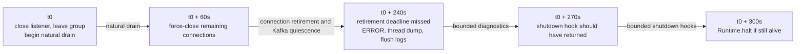
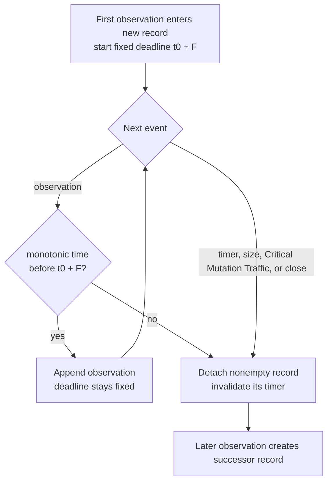

# Proxy Capture Protocol

**Status:** standalone component design contract; implementation conformance is incomplete
**Last revised:** 2026-09-14

This document defines how capture proxies scale horizontally and behave under failure while
writing source traffic to Kafka for later replay. It covers the controller-less deployment.
Managed-fleet terminal-failure behavior and fresh-run recovery are specified separately in
[`managedFleetCaptureRecovery.md`](managedFleetCaptureRecovery.md).

**Strict capture** guarantees that every Critical Mutation Traffic request the proxy permits to
reach the source already has a complete, durably acknowledged representation in Kafka. Strict mode
therefore uses `fail-closed`; non-strict mode uses `fail-open` and permanently abandons capture in
that process. The precise definitions of both modes are in
[Capture and Replay Architecture §2](captureAndReplayArchitecture.md#2-system-model).

The design deliberately separates three concerns:

1. Kafka group membership load-balances partitions for new connections.
2. Periodic records from each writer and partition establish the broker-time baseline used to
   expire incomplete state after a proxy becomes silent.
3. The capture-before-forward contract prevents a strict-mode proxy from completing a source
   request that Kafka cannot later replay.

Group departure only causes a rebalance among the remaining members. A proxy that Kafka considers
involuntarily departed keeps using its last usable assignment until Kafka supplies a replacement. A
proxy that leaves deliberately while draining (§3.5) has already stopped accepting connections and
keeps publishing under its existing writer identities. In neither case is departure capture-health
or replay evidence, and it never authorizes another proxy to declare the departed instance
finished.

---

## 1. Goals and accepted boundaries

### 1.1 Required behavior

The system must:

- ensure that Netty's terminal observation and every earlier `TrafficObservation` for a closed
  connection are acknowledged by Kafka before that connection leaves the active set;
- replay every complete request that the capture parser recognized and detached from its
  connection, even if the connection's remaining reconstruction later expires or the proxy goes
  silent;
- capture every mutating request completely before allowing it to complete at the source in strict
  mode;
- preserve long-lived connections, including connections with long periods of no traffic;
- give every nonempty connection-local traffic record one fixed record-boundary deadline beginning
  with its first observation, and never admit an observation at or after that deadline into the old
  record;
- let the replayer expire incomplete per-connection HTTP accumulation after normal connection
  completion or proved proxy silence;
- scale proxies horizontally without moving existing connections;
- keep capture and source forwarding ordered correctly during rebalance, shutdown, and Kafka
  failure; and
- alarm loudly when capture develops a gap.

### 1.2 Accepted behavior

The design accepts:

- a complete request may be captured even though it never reaches the source;
- an incomplete accumulation from a hard-crashed proxy may remain retained when no skew-valid
  later partition record can settle it;
- hard process death may prevent normal terminal connection observations;
- pass-through mode may create a known interval in which source traffic is not replayable;
- restoring strict capture after such an interval requires a new capture and replay run;
- HTTP/1.x pipelined requests are outside the settled protocol contract. The protocol does not
  define behavior when one source connection has multiple outstanding requests or one inbound read
  contains bytes from more than one request. Deployments cannot rely on capture or replay
  correctness for those cases;
- this protocol supports only source request handling that cannot mutate state before the complete
  HTTP request arrives. Streaming source handlers that can act on an incomplete body remain out of
  scope; and
- the strict guarantee applies only to requests classified as Critical Mutation Traffic by the
  configured HTTP-method predicate. Endpoints that mutate outside that predicate are unsupported.

The standalone design does not require transactions or a controller.

### 1.3 Central end-to-end invariant

For every request `Q` that can mutate source state:

```text
SourceApplied(Q)
    implies
Kafka has durably acknowledged the complete replay representation of Q
```

The converse is intentionally false. Kafka may contain a complete request that the proxy later
chooses not to forward.

In `fail-open`, Kafka may also contain a complete request whose earlier connection state the
replayer already expired before the final observation arrived. Such a request belongs to the
alarmed capture gap without being reconstituted for replay. The invariant guarantees durable
capture before source mutation; it does not guarantee replay across a compromised interval.

The proxy enforces the invariant by withholding the final execution-enabling bytes of a mutating
request until Kafka has acknowledged the request's complete representation. After that
acknowledgement, and immediately before those source bytes are submitted, the proxy performs the
capture-liveness check in §5.

The invariant assumes that source execution is gated by receipt of the complete HTTP request.
Transfer-Encoding chunking does not violate that assumption by itself; a source handler that
applies effects while consuming an incomplete body does. Such streaming source semantics are not
supported by this protocol.

Kafka acknowledgement at the source execution boundary applies only to the final
execution-enabling bytes of Critical Mutation Traffic. Ordinary packet forwarding, and requests
outside the configured Critical Mutation Traffic predicate, are not synchronously gated on Kafka
acknowledgement. Connection retirement separately waits for acknowledgement of the terminal
observation and every earlier observation for that connection.

This ordering makes terminal connection processing safe:

- if the source completed the request, Kafka already contains the complete request;
- if Kafka contains only an incomplete request, strict mode could not have completed it at the
  source;
- after Netty reports a connection closed, the kernel and Netty deliver no more network traffic for
  that connection;
- the connection's event-loop owner submits the terminal connection observation after every earlier
  observation in the connection-local Kafka submission chain; and
- only after Kafka acknowledges the terminal observation and every earlier observation does the
  event-loop owner remove the connection from the active set.

This invariant combines with the skew-adjusted Kafka `LogAppendTime` proof in §6.3. That proof may
release only incomplete connection accumulators already known to the replayer. It does not retire a
writer or partition and does not prevent a later first observation from starting fresh state.

---

## 2. Terminology and identities

### 2.1 `processId`

`processId` identifies one operating-system process for logs, metrics, and control-plane
diagnostics. It is generated at process start and is never reused.

### 2.2 Capture activation and writer identities

Writer identities are defined normatively in
[Capture and Replay Architecture §2.1](captureAndReplayArchitecture.md#21-identities). In brief:
`captureActivationId` names one capture-authoritative lifetime of a proxy process, and
`assignmentSequence` is a process-local value that is unique and never reused within one
`captureActivationId`, chosen fresh for every Kafka group assignment. Newly opened connections use:

```text
writerNodeId = captureActivationId + ":" + assignmentSequence
```

The out-of-group Kafka capability probe runs before any consumer-group generation exists and uses
the inert attribution value:

```text
writerNodeId = captureActivationId + ":PROBE"
```

The facts this protocol relies on:

- `writerNodeId` values are never reused within a `captureActivationId`; their numeric value and
  ordering carry no protocol meaning;
- existing connections permanently retain the `writerNodeId` under which they opened, so rapid
  rebalances may leave several older writer identities draining concurrently in one process; and
- `CaptureCapabilityProbe` proves only that the proxy can publish to Kafka. The replayer never
  interprets its `writerNodeId` as a traffic writer identity, heartbeat owner, or source of
  connection state.

### 2.3 Captured client connection

Every accepted connection uses Netty's globally unique long-form channel identifier as its
`connectionId`. The protocol requires uniqueness only within its immutable `writerNodeId`. The
proxy records its chosen traffic partition when the connection is accepted:

```text
(writerNodeId, connectionId) -> trafficPartition
```

Both the writer identity and partition mapping are immutable for the life of the connection. The
maximum whole-connection lifetime defaults to 60 minutes and is configured independently of the
incomplete-request duration and byte limits.

This document reserves **drain** for two aggregate operations:

- **writer-partition drain** — stop opening connections under one `(writerNodeId, partition)` while
  the proxy continues serving that identity's existing connections; and
- **proxy connection-set drain** — wait for the proxy's connections to close naturally or close
  them during proxy shutdown.

The lifecycle of one closed connection is **connection retirement**, as defined in §5.1. The
`DRAINING` process state and "still-draining proxy" wording below refer to the second aggregate
operation; they do not name a third kind of drain.

### 2.4 Capture failure policy

`--capture-failure-policy` is process-wide:

- **`fail-closed`** terminates the process immediately when required Kafka publication fails or
  capture is otherwise compromised.
- **`fail-open`** permanently abandons capture for the process. Existing and new TCP connections
  may continue forwarding without capture, the process alarms continuously, and capture never
  resumes. A controller-managed deployment additionally requires the controller acknowledgement
  in §7.3 before any uncaptured source forwarding begins.

The Kafka client may retry internally while no failure has been exposed to the application. Once a
Kafka failure, timeout, or ambiguous result is exposed, one of the terminal policies applies and
the proxy does not resubmit the record.

---

## 3. Kafka membership and horizontal scaling

### 3.1 Membership is load balancing only

The proxy group exists to distribute Kafka partitions for newly opened source connections — nothing
more. Membership does not prove capture health, producer health, or proxy death, and it does not
settle replayer state.

The deployment uses a Kafka-provided assignment strategy supported by its selected consumer-group
protocol. The capture protocol uses only the partitions assigned to the local member. It requires
no custom assignor, subscription `userData`, assignment metadata, member readiness state, minimum
group size, or startup quorum. A built-in sticky or cooperative strategy may reduce routing churn,
but neither property is required for correctness.

Fleet capacity and startup policy are external to Kafka assignment. A managed controller may route
source traffic only after enough proxies report `captureReady=true` on their control interfaces,
but that policy does not change group subscription or assignment.

Every member completes the Kafka capability probe before it joins the group. After the first usable
assignment, later group size or membership health does not close a capture or
connection-acceptance gate.

### 3.2 Assignment and connection routing

A proxy cannot accept a captured source connection before it has a Kafka partition for it, so the
proxy does not open its source listener until its first assignment is usable. A client that
connects earlier is refused by the operating system rather than accepted. A startup failure before
the listener opens invokes the process-wide `--capture-failure-policy`; after either terminal
policy is applied, that process never resumes capture, even when membership later supplies an
assignment.

The first assignment becomes usable only after:

1. the assignment is installed;
2. the proxy's capture-authoritative mode remains valid; and
3. the initial heartbeats for that assignment's writer identity are acknowledged on every
   partition the assignment permits it to use.

The assignment has one acceptance gate. If any permitted partition cannot acknowledge and accept
its initial heartbeat, the proxy does not route around that partition or accept connections on the
others. The assignment never becomes usable, and the first failed, ambiguous, late, or
deadline-expired initial heartbeat irreversibly enters the process-wide compromised workflow in §7.

Afterward, the proxy retains the last usable assignment until Kafka supplies a replacement.
Revocation, partition-loss callbacks, stale or failed polling, empty polls, delayed heartbeats,
coordinator outages, and group departure do not invalidate it. The proxy continues assigning new
connections with the last usable assignment.

Kafka may temporarily give another proxy the same partition after considering the stale member
gone. This affects load distribution only. The proxies have distinct writer identities, so capture
and replay remain unambiguous.

When a replacement assignment arrives, the proxy creates its next assignment-scoped writer
identity and acknowledges that identity's initial heartbeats before using the replacement for new
connections. Connections opened earlier retain their original writer identity and partition. There
is no membership-health deadline.

### 3.3 Startup capability probing

A process must not join the proxy group until it has demonstrated that its producer can complete an
acknowledged Kafka write.

While in `PROBING`, it:

1. refreshes metadata for the traffic topic;
2. chooses one representative traffic partition for every distinct current leader broker;
3. emits a semantically inert `CaptureCapabilityProbe` carrying
   `writerNodeId = captureActivationId + ":PROBE"` and a producer timestamp of zero to each
   representative partition;
4. accepts each acknowledgement only when its Kafka record metadata reports a positive timestamp,
   proving that the broker replaced the supplied timestamp with `LogAppendTime`;
5. waits for all probe acknowledgements; and
6. refreshes metadata again before joining the group.

A topic configured with `CreateTime` either rejects the deliberately stale producer timestamp or
returns it unchanged. Either result fails the probe. Workflow-managed capture topics set
`message.timestamp.type=LogAppendTime`; unmanaged deployments must configure the same property.

`CaptureCapabilityProbe` is not replay input. If the replayer later encounters the Kafka record, it
performs no replay action and allows the record to become commit-eligible through ordinary
whole-record accounting.

The probe qualifies current producer reachability, not future availability. Normal runtime
failures are handled by §5 and §7.

### 3.4 Scale up

When member B joins:

1. B completes §3.3 and joins the group.
2. Kafka's configured assignment strategy redistributes new-connection partition eligibility.
3. Every member receiving a new assignment chooses a new, previously unused `assignmentSequence`
   and creates that assignment's `writerNodeId`.
4. Existing member A stops opening connections under its preceding writer identity when the
   replacement assignment becomes usable. Existing connections keep that preceding identity and
   their original partitions.
5. Each member acknowledges and accepts an initial heartbeat for its new writer identity on every
   partition that the assignment permits it to use before accepting any connection under that
   identity. Failure on any one partition makes the entire assignment unusable and enters the
   process-wide compromised workflow; the member does not continue with only the other partitions.
6. A continues traffic and periodic heartbeats for every older writer identity that still has
   connections.
7. After an older `(writerNodeId, partition)` has no connections, A retires that identity's
   publisher lane locally. This applies even when the identity acknowledged its initial heartbeat
   but never accepted a connection there.

Existing connections never migrate between processes or partitions.

### 3.5 Scale down

A planned process retirement first becomes `DRAINING`:

1. it closes its source listener and stops accepting new connections;
2. it leaves the Kafka consumer group so that Kafka redistributes new-connection eligibility for
   its partitions to the remaining members. Membership is load balancing only, so leaving does not
   affect publication under the proxy's existing writer identities, and remaining members that
   receive a replacement assignment follow §3.4;
3. existing connections continue in place for a bounded natural-drain interval while the proxy
   continues traffic and heartbeat publication for every draining writer identity;
4. after that interval, or as soon as a `(writerNodeId, partition)` connection set is empty, it
   applies §4.3 to that lane; §4.3 step 2 disconnects any connection that remains, so a
   connection's 60-minute maximum lifetime never governs how long retirement takes;
5. every publisher lane reaches `RETIRED`; and
6. it exits after every publisher lane is retired and the producer is closed.

This orderly retirement is performed only while capture and Kafka publication remain trustworthy.
Its default timing is:

- 60 seconds for connections to close naturally;
- 180 additional seconds after the remaining connections are force-closed for terminal
  observations, Kafka acknowledgements, publisher callback quiescence, and producer closure;
- 30 seconds for a high-severity diagnostic, thread dump, and explicit log flushing if orderly
  retirement is still incomplete;
- the shutdown hook is expected to return by 270 seconds; and
- an independent watchdog invokes `Runtime.halt` at 300 seconds if the shutdown hook does not
  finish.

Each interval is independently configurable, but their configured sum must fit within the
deployment's process-termination grace period. The natural-drain, forced-retirement, diagnostic,
and shutdown-hook intervals must all be finite. Managed Kubernetes deployments should provide at
least 30 seconds of external margin beyond the internal hard-stop deadline.



If retirement finishes before the shutdown-hook completion boundary, the proxy closes the producer,
stops its event loops, and lets the shutdown hook return so the JVM exits normally. The hook does
not call `System.exit` after JVM shutdown has already begun. Missing the 240-second
orderly-retirement deadline is a high-severity failure even if cleanup finishes during the
diagnostic interval. An application-visible Kafka failure or expiration of the current heartbeat
acknowledgement deadline `E`, whichever occurs first, makes retirement unsuccessful immediately;
the proxy then exits without claiming that orderly retirement completed. This timing policy is not
used for the unstable-process failures described in §7.

### 3.6 Later use of a partition

A live proxy process may become eligible to accept new connections on a partition that it used in
an earlier assignment. Those new connections use the last usable assignment's `writerNodeId`. A
replacement identity acknowledges its initial heartbeats on every permitted partition, including
that one, before accepting any connection.

The earlier writer identity never resumes. Heartbeats for an active identity update its continuous
broker-time baseline; they do not end or reset it. After the earlier identity's connections drain,
the proxy retires that `(writerNodeId, partition)` publisher lane locally.

Rapid rebalances may leave several writer identities draining on the same Kafka partition while the
last usable assignment's identity accepts new connections there. Every connection registry,
publisher lane, broker-time baseline, and retirement state is therefore keyed by
`(writerNodeId, partition)`, not by one process-global current identity.

### 3.7 Kafka 4 and assignment-protocol rollout

The capture protocol has no dependency on a custom assignor or custom subscription metadata. The
deployment may use Kafka's Classic group protocol or a newer supported consumer-group protocol with
a Kafka-provided assignor. Members in one group must still use a configuration that Kafka considers
interoperable during rollout.

Changing assignment strategy may redistribute every partition and may temporarily overlap a stale
proxy's last usable assignment with a replacement assignment. That affects load balancing only.
Assignment-scoped writer identities keep captured records unambiguous, and existing connections
retain their original identities and partitions. No capture boundary is required solely because a
different Kafka-provided assignment strategy changes partition placement.

---

## 4. Capture records and publisher ordering

### 4.1 Record types

Every traffic-topic application record carries one `CaptureRecord` protobuf envelope:

```text
CaptureRecord {
    payload = oneof {
        TrafficStream {
            nodeId = writerNodeId
            connectionId
            subStream[] {
                connectionObservationSequence
                ts
                ...
            }
            ...
        }

        WriterPartitionHeartbeat {
            writerNodeId
            heartbeatIntervalMillis
            emittedAtMillis?  // optional, diagnostic only
        }

        CaptureCapabilityProbe {
            writerNodeId = captureActivationId + ":PROBE"
            probeId
        }
    }
}
```

The active `CaptureRecord.payload` field identifies the record type. The protocol does not use a
Kafka header as a second discriminator. An envelope with no recognized payload is invalid.

No payload carries a partition. The partition of every `(writerNodeId, partition)` key is the Kafka
partition that contains the envelope, read from Kafka record metadata. The proxy still binds each
connection to one partition for its lifetime (§2.3); that binding is proxy-local routing state and
appears on the wire only as the partition to which the connection's records are published.

`WriterPartitionHeartbeat` is the fixed protobuf name. One record proves only that one
`(writerNodeId, partition)` can still publish acknowledged records within the configured interval.
It contains no connection identities, chunk metadata, heartbeat sequence, or connection-lifecycle
boundary. `heartbeatIntervalMillis` reports the proxy's configured publication interval for
diagnostics and future sanity checks; it does not configure replayer expiration.

`connectionObservationSequence` is a monotonically increasing connection-local value assigned by
the connection's single event-loop owner. It validates the order of `TrafficObservation` values for
that captured client connection. It is not shared across connections and needs no contended atomic
increment.

Let `F` be the configured `trafficStreamFlushInterval`, defaulting to five seconds. Measured with
the proxy's local monotonic clock, `F` defines both the scheduled time for detaching and enqueueing
a nonempty connection-local `TrafficStream` and the latest time at which another observation may
enter that record. It does not promise that `KafkaProducer.send()` will run by the deadline: the
detached record must wait for the preceding record for that connection to be acknowledged. `F` is
not serialized into the record and is not interpreted by the replayer.

Reconstruction-relevant records for one connection enter the producer through a connection-local
acknowledgement chain in contiguous sequence order. Record N+1 for that connection is not passed to
`KafkaProducer.send()` until Kafka acknowledges record N. Other connections and heartbeats may
interleave freely; there is no global packet lock. A missing sequence, a repeated sequence with
different content, or a regression is a protocol failure: it closes capture on the proxy side, or
on the replayer side causes the record to be retained with high-severity diagnostics and process
termination. The replayer does not wait indefinitely for a lower sequence. Truly incidental packet
diagnostics that cannot affect HTTP request completion, expiration, source forwarding, or target
replay are outside this sequence and may be best effort.

The acknowledgement wait is deliberately stronger than producer submission ordering or Kafka
producer idempotence. Those features preserve the order of records that Kafka successfully appends,
but they do not guarantee that every earlier application record succeeds. If record N fails or has
an ambiguous outcome after record N+1 was already submitted, Kafka may append N+1 without N. The
replayer would then encounter a permanent `connectionObservationSequence` gap and correctly treat
the retained record as a protocol violation on every restart. Waiting for N's acknowledgement
prevents that situation: if N fails or is ambiguous, the proxy enters the compromised workflow and
never submits the successor record for that connection.

The proxy may deliberately suppress capture for requests selected by configured policy while still
forwarding them to the source. If the decision is available before any request byte is captured, the
request produces no traffic observation. If capture has already begun when the decision becomes
available, the proxy emits `RequestIntentionallyDropped` after the captured prefix. The marker means
that the preceding incomplete read sequence was intentionally abandoned, not lost in transport.
It advances the request sequence while leaving the connection open, so later captured requests on
the same connection remain distinguishable and reconstruct normally.

`CloseObservation` is the final sequence value for a connection. `DisconnectObservation` and
`ConnectionExceptionObservation` are non-terminal. Once the replayer consumes `CloseObservation`,
any later `TrafficObservation` for that connection is a protocol violation, including a contiguous
next sequence value. Heartbeats have no per-connection meaning and cannot reopen the connection's
traffic-observation state.

### 4.2 Publisher ordering and acknowledgement

Kafka producer ordering is required within one writer identity and partition. It is not used to
force every ordinary packet and connection lifecycle change through one global proxy lock.

Each connection's event-loop owner also controls the lifetime of its current `TrafficStream`:

1. Appending the first observation to a new record schedules one monotonic deadline at `F`.
2. Before beginning every later `TrafficObservation`, the owner compares the local monotonic time
   with that fixed deadline. If the deadline has passed, it detaches the old record before
   admitting the new observation. A delayed timer therefore cannot place new activity into an
   expired record.
3. Appending later observations before the deadline does not move or replace that deadline.
4. If the record reaches its size limit, a complete Critical Mutation Traffic request requires
   publication, or the connection closes, the owner detaches and submits the record earlier.
5. Otherwise, the scheduled callback detaches and enqueues the nonempty record when it runs.
6. Detachment clears the owner's current-record reference before ordinary capture continues. A
   later observation therefore creates or enters only a successor record.
7. An earlier detachment cancels or invalidates the old deadline. A stale timer callback must not
   flush the successor record.

No timer is scheduled for an empty record, and an idle connection emits no empty `TrafficStream`.
The deadline is associated with the current record, not with the connection's last activity;
continuous traffic cannot postpone it. The append-side deadline check is the content boundary,
while the scheduled callback publishes an otherwise-idle record.

Every successor record carries the same continuity information required after a size-triggered
flush: the cumulative completed-request count, whether the preceding record ended during an
unterminated request read, and the next contiguous `connectionObservationSequence`. Periodic
publication therefore adds no semantic boundary and requires no new marker.

At the deadline, the scheduled action is detachment and enqueueing into the connection-local
acknowledgement chain, not bypassing it. Ordinary source traffic does not wait for a periodic
publication acknowledgement. The detached record enters the same chain as size-triggered, Critical
Mutation Traffic, and terminal records. It reaches `KafkaProducer.send()` only after the preceding
record for that connection is acknowledged.

Kafka publication failure or ambiguity follows §7 regardless of whether size, `F`, Critical
Mutation Traffic, or connection close caused the write. A callback that runs late records its
lateness in a metric and warning log, then enqueues the record immediately. Lateness alone does not
compromise capture when the write succeeds. The append-side check still prevents any observation at
or after the deadline from entering that old record.

Every record-detachment future is observed by the process-wide capture-failure path when it is
created. Correctness must not depend on a later caller awaiting that future. Serialization,
finalization, timer-callback, publication-enqueue, lifecycle-chain, and Kafka-send failures all
enter the same required-capture-failure or unstable-process workflow according to their cause.

Detached records may wait behind an earlier unacknowledged record for the same connection. Queue
age, count, and bytes are observable but do not create an additional capture-compromise rule. The
required write's failure or ambiguous outcome is the event that compromises capture; the proxy does
not drop the queued record or block its Netty event loop waiting for Kafka.



Broker append order for records submitted in order must remain stable across retries. The producer
therefore requires:

```text
enable.idempotence = true
acks = all
max.in.flight.requests.per.connection <= 5
```

These are correctness settings, not tuning defaults. User configuration must not weaken them, and
startup must validate the effective producer configuration before the process becomes
capture-authoritative. Failure to establish ordering-preserving settings fails capture closed.

One Kafka producer and one publisher lane can serve all partitions. The lane orders accepted
submissions, producer calls, and producer callbacks. Multiple producers are safe only when, for
each `(writerNodeId, partition)`:

- exactly one producer and publisher-lane owner publishes observations and heartbeats in one
  submission order;
- ownership never overlaps; and
- handoff waits for every submission and callback from the previous owner before the successor
  begins.

Different proxy writers may still publish existing connections to the same Kafka partition. The
single-owner rule is scoped to one writer and partition. It preserves one submission order for that
writer, and the drained handoff prevents late callbacks or writes from the previous owner.

The lane distinguishes:

- **accepted** — submission entered the lane;
- **submitted** — the producer API accepted it;
- **acknowledged** — Kafka acknowledged it; and
- **failed or ambiguous** — success cannot be established.

Only acknowledgement advances the proxy's durable publication state.

For permanent `(writerNodeId, partition)` retirement, the publisher lane has a one-way local state:

```text
OPEN -> RETIRING -> RETIRED
```

- `OPEN` accepts existing-connection traffic and ordinary periodic heartbeats. The separate routing
  and acceptance gate determines whether a new connection may be opened.
- `RETIRING` is entered only after all connections have been fully retired and the local registry
  is empty. It rejects every new submission while previously accepted sends finish.
- `RETIRED` rejects every submission.

Publisher initialization and shutdown are completion-gated lifecycle operations. The composition
root owns a newly created producer until publisher construction succeeds. The publisher owns its
serialized publisher executor and its separate heartbeat-deadline scheduler. Failed initialization
closes every resource that was created before returning failure; successful construction transfers
sole producer ownership to `CaptureKafkaPublisher`. Clean process shutdown first runs the §4.3
retirement barrier for every used partition. Only after every publisher lane is `RETIRED` does
publisher shutdown close the producer and terminate both executors. A capture failure may instead
close the producer without claiming orderly retirement. Publisher shutdown completes only after
callback quiescence, producer closure, and both executors terminate. There is no optional no-op
lifecycle callback or default method that can omit this cleanup.

### 4.3 Writer-partition publisher retirement barrier

Writer-partition retirement is local proxy lifecycle management. It does not publish a terminal
Kafka control record and does not directly settle replayer state.

Before retiring the publisher lane for partition P under one `writerNodeId`, the proxy:

1. stops accepting new connections for P under this `writerNodeId` using the routing and acceptance
   gate. The publisher lane remains `OPEN` for existing-connection observations and periodic
   heartbeats;
2. disconnects every Netty connection using P and fully retires each connection under §5.1,
   including Kafka acknowledgement of its terminal observation and every preceding observation;
3. verifies that P's local connection registry is empty;
4. atomically moves P's publisher lane from `OPEN` to `RETIRING` and asynchronously quiesces the
   periodic heartbeat publisher: no future run may start, and any callback already running must
   either have entered the lane before `RETIRING` or finish without submitting. The quiescence
   completion gate must not block a Netty event loop;
5. waits for every remaining send previously accepted by P's publisher to succeed and treats any
   failed or ambiguous send as a capture failure under §7;
6. moves the publisher lane to `RETIRED` before reporting completion.

The `RETIRING` transition and heartbeat-publisher quiescence ensure that no delayed periodic task
can submit an ordinary heartbeat after local retirement begins. Multiple retirement requests share
the same idempotent completion gate.

The useful guarantee is:

```text
Every source-completable request from this proxy instance on P
has a complete acknowledged Kafka representation before the publisher lane reaches RETIRED.
```

Because every connection is fully retired before the lane enters `RETIRING`, no proxy thread
remains able to submit source or capture bytes for P after the lane reaches `RETIRED`. The source
service may still finish processing a request that it received before disconnection, but that
request's complete Kafka representation was already acknowledged.

After local retirement, no code path may reopen capture submission for P under this `writerNodeId`.

### 4.4 Hard failure

A killed, crashed, or indefinitely suspended process may fail to publish terminal connection
observations. The replayer may still settle a known incomplete accumulator through the
skew-adjusted broker-time rule in §6.3. Without a qualifying later partition record, the affected
accumulation remains retained. Group departure does not substitute for completion.

---

## 5. Connection retirement, heartbeats, and the pre-forward liveness gate

### 5.1 Local registry and connection retirement

For every `(writerNodeId, partition)`, the proxy maintains an exact registry of **all** open
captured connections under that identity, including idle connections. This registry is local
bookkeeping. The proxy never serializes or publishes the connection set.

Creating a captured client connection adds it to the local registry before the proxy accepts its
first `TrafficObservation`. The connection permanently retains its selected `writerNodeId` and
partition.

**Connection retirement** is the lifecycle of one closed connection:

1. Netty reports the connection closed because of remote closure, local closure, or channel
   failure.
2. After that notification, the kernel and Netty provide no further network traffic for the
   connection.
3. The connection's event-loop owner submits its terminal `CloseObservation` through the Kafka
   publisher's connection-local submission chain after every earlier observation for the
   connection.
4. The event-loop owner waits for Kafka to acknowledge the terminal observation and every earlier
   `TrafficObservation` for the connection.
5. Only after those acknowledgements does the event-loop owner remove the connection from the local
   registry.

If any required Kafka acknowledgement fails or becomes ambiguous, the connection is not
successfully retired. The process enters its compromised state. It must not keep publishing
heartbeats as though capture remained healthy.

Any nonempty current `TrafficStream` is detached immediately as part of terminal publication,
regardless of its `F` deadline. A stale periodic-flush callback cannot create a record after
`CloseObservation`.

`CloseObservation` is the only normal per-connection completion record. Remote closure, local
closure, and unrecoverable channel failure all close the real Netty channel and therefore produce
that observation. `DisconnectObservation` and `ConnectionExceptionObservation` remain non-terminal.
After the replayer processes `CloseObservation`, any later `TrafficObservation` for the same
connection identity is a protocol violation. A heartbeat cannot complete, omit, reopen, or
otherwise change a connection.

### 5.2 Heartbeat publication

Every current or still-draining `(writerNodeId, partition)` with an active publisher emits one
atomic `WriterPartitionHeartbeat` at `heartbeatInterval`. The default interval is 10 seconds. Each
record carries that configured value in `heartbeatIntervalMillis` for information only. The
replayer uses separately configured expiration rules and may add sanity checks for this field
later.

Heartbeat publication is sequenced per writer and partition. A later heartbeat is not submitted
until the previous heartbeat has been acknowledged and its timestamp accepted. Overlapping periodic
callbacks coalesce into the next run. A failed, ambiguous, or late heartbeat closes the capture
gate, so no later heartbeat is authoritative.

Each `(writerNodeId, partition)` also has a local monotonic heartbeat acknowledgement deadline. The
initial deadline starts when the initial heartbeat is submitted. Kafka's acknowledgement callback
and a separate deadline scheduler atomically determine whether acknowledgement arrival or deadline
expiration happened first; publisher-lane backlog cannot change that result. When an
acknowledgement is processed and accepted, the proxy sets the next deadline to `E` after that local
monotonic acceptance time. If the deadline expires before Kafka invokes the required
acknowledgement callback, the expiration atomically compromises the process. A later Kafka
acknowledgement cannot update capture state, renew the deadline, activate an assignment, or
complete publisher retirement. This local deadline is independent of the broker `LogAppendTime`
validation in §5.4.

`WriterPartitionHeartbeat` is exactly one Kafka record and contains no connection identities. There
is no chunk assembly, partial-heartbeat state, sequence number, or connection-membership
interpretation.

### 5.3 Initial heartbeat

For the first assignment and each replacement assignment, before accepting any captured client
connection under that assignment, the proxy must choose a new, previously unused
`assignmentSequence`, create the assignment's `writerNodeId`, and acknowledge an initial heartbeat
for that identity on every partition the assignment permits it to use. This establishes the first
accepted broker-time baseline for each such `(writerNodeId, partition)` before the writer can
publish connection traffic. A single acceptance gate for the whole assignment is deliberate: it
avoids routing around partitions whose baseline is not yet established.

Every initial heartbeat must both receive a successful acknowledgement and pass the same timestamp
acceptance check as a later heartbeat. If any permitted partition fails, times out, has an
ambiguous producer result, or returns a late timestamp, the gate remains closed for every partition
in the assignment and the process follows §7. A later acknowledgement or a new group event cannot
make that assignment usable again.

### 5.4 Acknowledged heartbeat broker time

Kafka must use `LogAppendTime` for the traffic topic. The proxy tracks, for each
`(writerNodeId, partition)`:

```text
lastAcceptedHeartbeatLogAppendTime
```

The initial heartbeat establishes `lastAcceptedHeartbeatLogAppendTime`. That baseline is continuous
for the lifetime of the `(writerNodeId, partition)`. An empty local connection registry,
inactivity, and later assignments do not reset it.

The default configured heartbeat expiration interval `E` is 30 seconds with the default 10-second
publication interval. The interval and `E` are configurable. Startup rejects nonpositive values and
rejects `heartbeatInterval >= E`.

The proxy and replayer must receive the same `E` and `S` values for one capture-and-replay run; the
managed orchestration requirement is defined in
[Managed Fleet Capture Recovery](managedFleetCaptureRecovery.md). Unmanaged deployment
configuration must preserve the same agreement.

A later heartbeat updates the value only when:

```text
heartbeatLogAppendTime - lastAcceptedHeartbeatLogAppendTime < E
```

A failed, ambiguous, or late heartbeat does not update the value. When the difference is greater
than or equal to `E`, the proxy irreversibly enters its compromised state and immediately follows
the process-wide `--capture-failure-policy` in §7. That process never becomes capture-authoritative
again.

This conclusion is enforced at the proxy rather than reconstructed downstream. As specified in
§5.2, the next heartbeat is not submitted until the current heartbeat is acknowledged and its
timestamp is accepted. A late acknowledged heartbeat closes the capture gate before any later
heartbeat can be submitted. Tests must prove this ordering. The replayer does not maintain a
separate sticky-lapse state.

### 5.5 Pre-forward liveness check

For every Critical Mutation Traffic request:

1. capture and acknowledge every `TrafficObservation` needed to reconstruct the complete request;
2. obtain the Kafka `LogAppendTime` of the `TrafficStream` containing the observation that permits
   the request to take effect;
3. immediately before submitting the corresponding source bytes, read the current capture state
   and `lastAcceptedHeartbeatLogAppendTime`;
4. permit source submission only when capture remains authoritative and:

   ```text
   observationLogAppendTime - lastAcceptedHeartbeatLogAppendTime < E
   ```

5. otherwise irreversibly enter the compromised state and apply `--capture-failure-policy`:
   `fail-closed` does not forward the waiting request and closes the connection as the process
   terminates; unmanaged `fail-open` forwards the waiting request without authoritative capture
   and leaves the connection open in permanent pass-through mode; managed `fail-open` blocks that
   forwarding until the controller acknowledgement required by §7.3.

The check and source-forwarding decision must share a one-way local capture gate. Once the gate
closes, no thread may newly pass the check. This avoids a simple check-then-transition race inside
the process.

No local check can fence a thread that has already entered an uninterruptible source syscall. That
does not violate the central invariant: the request was completely acknowledged to Kafka before
that syscall was allowed.

### 5.6 Timing relationship

Let `H` be the configured heartbeat publication interval. Startup validates:

```text
0 < H < E
```

Equality is invalid. If both values were 10 seconds, the next heartbeat would become due at the
same instant as the acknowledgement deadline, leaving no time for scheduler delay, Kafka
publication, retries, or acknowledgement processing.

The difference `E - H` is the available healthy-operation latency margin. The strict inequality is
the minimum configuration check, not a promise that any positive margin is operationally
sufficient. Deployments must choose values whose margin covers expected scheduling delay, Kafka
publication and acknowledgement latency, retries, and operational jitter. The defaults are
`H = 10 seconds` and `E = 30 seconds`.

This local timing margin is independent of `S`. `S` bounds backward movement in Kafka
`LogAppendTime`; it does not provide time for heartbeat scheduling or acknowledgement. At runtime,
the monotonic deadline in §5.2 enforces the chosen `E`: failure to process the required
acknowledgement before that deadline compromises capture.

---

## 6. Replayer interpretation

### 6.1 Complete requests

A request that the capture parser already recognized as complete and detached from its connection
continues normally regardless of later heartbeats or proxy health.

Connection completion and writer expiration apply only to incomplete per-connection HTTP
accumulation. They must never discard an already detached complete request merely because its proxy
later became silent.

### 6.2 Connection completion and writer expiration

For one captured client connection emitted by writer identity X on partition P:

| Observation | Replayer action |
|---|---|
| normal terminal connection-close record | Expire the connection's incomplete request and source-response accumulators, finish the connection through the ordinary close path, and reject every later `TrafficObservation` for that identity |
| timely heartbeat from X on P | Update the writer-partition broker-time baseline; do not change any connection directly |
| heartbeat lapse proved by §6.3 | End the current process-local reconstruction for each already-known connection from X on P; expire its incomplete request and source-response accumulators; let already-detached complete requests continue; do not permanently retire X or any connection identity |

The terminal connection observation is the traffic-observation cutoff for the connection.
`connectionId` is unique within its `writerNodeId`. Heartbeats never reopen, complete, or retire a
connection. Replayer detection of a later observation is best effort over the history available
from its current committed cursor; it requires no durable closed-connection tombstone. The proxy
ordering and retirement invariant is what prevents the invalid stream in correct operation.

Kafka record composition does not weaken this rule. A Kafka record may contain several
observations, but the replayer can commit only the whole record. The record remains uncommitted
until every observation's required processing is complete. Expiration releases only the affected
incomplete accumulator; target replay, tuple output, or other processing associated with the same
record may remain pending.

### 6.3 Skew-adjusted broker-time expiration

The normative timestamp proof, including restart after the preceding heartbeat has already been
committed, is defined once in
[Capture and Replay Architecture §§8–8.1](captureAndReplayArchitecture.md#8-broker-time-expiration-of-known-connection-state).

This proxy protocol supplies the proof's capture-side premises:

- the proxy and replayer use separately configured, agreed `E` and `S` values;
- `heartbeatIntervalMillis` is informational and does not change those values;
- the proxy serializes heartbeat publication and cannot restore freshness after accepting a late
  heartbeat; and
- §5.5 rejects Critical Mutation Traffic whose acknowledged observation is outside the accepted
  heartbeat baseline.

The replayer expires only incomplete accumulators already known at the qualifying offset. It does
not retire the writer, partition, or connection identity. A later first observation starts fresh
state. Already-started target work continues, and every reconstituted request still requires
durable tuple output. Consumer wall-clock time is not commit authority. A higher-offset record
whose `LogAppendTime` is more than `S` below the greatest previously observed value for that
partition is an immediate fatal replayer condition. That check detects a violated bound after the
fact; it does not make an expiration already decided under the violated bound safe. The proof
depends on the deployment actually enforcing `S` on the brokers.

`F` is a proxy-local publication setting. The replayer does not use it for heartbeat expiration,
source-response retry boundaries, target scheduling, or commit. Its effect is already present in
the Kafka record boundaries that the replayer consumes.

### 6.4 Long gaps

A connection with no traffic for hours remains represented because its writer-partition heartbeats
remain timely. No application-idle timeout is inferred from that silence.

### 6.5 Timestamp domains

The protocol intentionally contains independent values with different meanings:

- `TrafficObservation.ts` is source event time for replay pacing;
- `F` is a proxy-local monotonic deadline for detaching the current nonempty connection record; it
  is not serialized and is not an event timestamp;
- `WriterPartitionHeartbeat.heartbeatIntervalMillis` reports configured publication cadence for
  information only;
- optional `WriterPartitionHeartbeat.emittedAtMillis` is diagnostic only;
- Kafka `LogAppendTime` is used for capture-before-forward validation, the deterministic
  source-response boundary supplied to retry policy, and the skew-adjusted expiration proof in
  §5.4 and the top-level architecture's §§8–8.1; and
- Kafka offsets order records within a partition.

Kafka-consumer pause and resume decisions do not use either timestamp. Target replay scheduling
does not use `LogAppendTime`. No conversion between source event time and broker time is part of
expiration correctness.

### 6.6 Commit behavior

When a connection's incomplete source state is settled, all of its retained source records follow
the ordinary terminal-disposition and commit-accounting path. No special force-commit bypass is
introduced.

The replayer advances a partition's Kafka commit watermark only while consecutive records beginning
with the earliest uncommitted record have a `Commit` disposition. A `Retain` disposition closes process-local contexts but deliberately keeps
its offset eligible for redelivery and therefore continues to block that watermark, as does
incomplete state that has not reached a sound terminal disposition.

---

## 7. Proxy failure behavior

### 7.1 Shared transition rule

The first of these events closes the local capture gate permanently for the process:

- any Kafka failure, timeout, or ambiguous result exposed to the application;
- expiration of a heartbeat acknowledgement deadline `E`; or
- any other event proving that capture can no longer be trusted.

The transition atomically closes every capture-authoritative gate and notifies the acceptor,
connections, heartbeat scheduler, and publisher lane. Capture never resumes within the same
compromised process. A new assignment and a later Kafka acknowledgement cannot restore capture
authority to that process. Previously acknowledged traffic remains valid.

The Kafka client may retry internally before exposing an outcome. Once a failure, timeout, or
ambiguous result is exposed to the proxy, there is no application-level resubmission. Recovery
requires a fresh process and fresh `captureActivationId`.

The process emits a high-severity alarm containing at least:

- `processId`, `captureActivationId`, and every affected `writerNodeId`;
- mode;
- affected partitions;
- last acknowledged heartbeat submission age from the proxy's local monotonic clock;
- last acknowledged traffic offset when available;
- producer error or stale-gate reason; and
- whether source forwarding continued.

### 7.2 `fail-closed`

After capture is compromised:

- the request currently waiting at the pre-forward check is not sent to the source;
- the process emits high-severity diagnostics; and
- the process terminates immediately with a distinct nonzero capture-failure exit status.

It does not attempt orderly connection or publisher retirement. Those operations require
trustworthy Kafka acknowledgements. The replayer handles the termination as a crash and does not
fabricate completion.

### 7.3 `fail-open`

After the gate closes:

- Kafka capture submission remains permanently closed;
- the process emits a loud, persistent capture-gap alarm; and
- it does not claim orderly connection or publisher retirement for the compromised capture
  activation.

In an unmanaged deployment, the Critical Mutation Traffic request waiting at the pre-forward check
and later traffic follow the configured one-way pass-through behavior immediately.

In a controller-managed deployment, capture compromise and permission to begin pass-through are
separate transitions:

1. The proxy enters `COMPROMISED_AWAITING_CONTROLLER_ACK`. Capture remains permanently closed, and
   no source-bound traffic that has not already passed the capture-before-forward gate may be
   forwarded.
2. The proxy immediately reports the compromise on an authenticated control path. The report
   identifies the exact resource, process, Pod, capture activation, Kafka topic, and current
   controller recovery generation. Because one capture activation can be compromised only once,
   retries for that exact activation are idempotent and require no second event identity.
3. The controller durably marks capture incomplete and terminal for that activation before it
   acknowledges the report. Merely receiving a notification, scraping a metric, or observing an
   unhealthy endpoint is not acknowledgement.
4. Only after the proxy receives an authenticated acknowledgement matching its current activation
   and the current controller recovery generation may surviving existing connections and new
   connections forward without capture. The proxy then enters `PASS_THROUGH_COMPROMISED`.
5. If acknowledgement does not arrive within the configured finite controller-acknowledgement
   deadline, the proxy terminates without forwarding the blocked traffic.

The notification must not use the traffic Kafka cluster whose failure caused the transition. A push
notification or controller-held event stream is the normal low-latency path. Status polling may
discover the pending transition, but the controller must still perform the explicit
acknowledgement after its durable state update. Duplicate reports and acknowledgements are
harmless. If the controller persisted the transition but its response was lost, the proxy retries
and the controller returns the same acknowledgement.

The process must not resume heartbeats or generate captured traffic under the same or a new
`writerNodeId`, even if Kafka later recovers. Recovery requires retiring the process and starting a
fresh capture-authoritative process.

### 7.4 Process suspension

A process may be suspended after Kafka acknowledgement and before source submission. If it resumes:

- in strict mode, the pre-forward stale-heartbeat check prevents execution once the threshold is
  exceeded;
- if suspension occurred after the source-forwarding decision, the request was already completely
  captured and remains replayable; and
- in pass-through mode, the capture gap is an accepted and alarmed policy outcome.

This is the base containment boundary without broker transactions. A managed controller adds the
pass-through acknowledgement rule in §7.3 so no uncaptured forwarding can begin before the fleet
has durably recorded incomplete capture.

### 7.5 Membership observations

A missing group member, failed health check, or control-plane declaration of node death should
alarm operators and may trigger process replacement. It does not cause replay settlement and does
not cause another proxy to write completion on behalf of the missing proxy activation.

After the first usable assignment, membership polling and callbacks do not control capture or
connection acceptance. The proxy continues using its last usable assignment until Kafka supplies a
replacement. A replacement assignment creates a new writer identity for subsequently opened
connections after its initial heartbeats are acknowledged. Existing connections remain unchanged.

Membership recovery does not restore capture because membership loss never removed capture
authority. Conversely, membership recovery cannot restore a process that entered `fail-open` or
avoid termination after a capture-compromising failure.

---

## 8. Recovery after a capture gap

Pass-through creates an interval whose source effects cannot be proven complete from Kafka. The
system must not silently splice later strict capture onto the previous replay run.

Recovery is:

1. alarm and record the start of the gap;
2. retire every process that entered pass-through;
3. restore a fully strict capture fleet with fresh process and capture-activation identities;
4. create a new immutable Kafka topic, trusted replay-boundary plan, and checkpoints bound to that
   topic;
5. establish the source-specific barrier proving that failed-run operations can no longer complete;
6. take a fresh source snapshot appropriate to the replay workflow; and
7. start a new replay run from the trusted boundary.

The managed controller marks the failed capture resource terminal and does not restore capture or
authorize a replacement snapshot within that resource. A fresh workflow may proceed only after the
managed-fleet addendum's Kafka-input-isolation, ended-run workload-retirement, and
source-quiescence preconditions are satisfied. The fresh workflow may not reuse the ended run's
Kafka topic. Automatic same-resource regrant and coverage restoration are not specified.

---

## 9. Component responsibilities

| Responsibility | Required behavior |
|---|---|
| Group assignor | Use a Kafka-provided assignment strategy with no custom assignor, subscription `userData`, assignment metadata, member readiness state, or group-size barrier. Retain the last usable assignment until Kafka installs a replacement. Stickiness and cooperative movement are optional routing optimizations. |
| Startup | Run out-of-group capability probes using `writerNodeId = captureActivationId + ":PROBE"` before joining the group; probes remain inert to replay. |
| Routing | Keep the last usable assignment until a replacement is initialized; choose a new, previously unused `assignmentSequence` and create a new assignment-scoped `writerNodeId` for that replacement; persist each connection's immutable writer identity and partition. |
| Registry | Maintain exact all-open connection sets locally per `(writerNodeId, partition)`; retain older registries while their connections drain; never serialize the set; remove a closed connection only after its terminal and all earlier observations are acknowledged. |
| Publisher | Publish one atomic `WriterPartitionHeartbeat` per writer and partition with no connection identities or chunking; do not pass connection record N+1 to `KafkaProducer.send()` until record N is acknowledged; allow packet capture on other connections to continue concurrently. Keep one producer and one lane owner that orders submissions and callbacks per writer and partition; drain all submissions and callbacks before handoff or local retirement. |
| Connection-record publication | For each connection, start one fixed monotonic `F` deadline with the first observation in a new `TrafficStream`; do not extend it for later activity; schedule detachment and enqueueing into the connection-local acknowledgement chain at the deadline; before admitting an observation at or after the deadline, detach the old record first; size, Critical Mutation Traffic, or close may end it earlier; never emit an empty periodic traffic record. |
| Source forwarding | Establish an acknowledged initial heartbeat baseline; reject late heartbeats; compare acknowledged observation `LogAppendTime` against `lastAcceptedHeartbeatLogAppendTime`; make compromise irreversible. |
| Failure mode | Make capture abandonment irreversible per process; implement strict exit and permanent pass-through transitions. In managed mode, block uncaptured source forwarding until the controller durably records incomplete capture and acknowledges the exact activation; terminate if the bounded acknowledgement deadline expires. |
| Record validation | Validate terminal connection observations and connection-local observation sequences; retain the poison record, log and metric at least once, alarm, and terminate the replayer process on protocol violations. |
| Replayer | Apply the normative broker-time expiration proof in the top-level architecture to expire only already-known accumulators; treat a future first observation as fresh initialized state. |
| Observability | Emit accepted heartbeat `LogAppendTime`, skew health, connection-record age and flush-deadline lateness, broker-time expiration, capture-gate, retained-incomplete-state, and capture-gap metrics. |

### 9.1 Required status

Each proxy should expose:

- process identity, `captureActivationId`, current `assignmentSequence`, current `writerNodeId`,
  and every older writer identity still draining;
- whether the first usable assignment has been received, the last usable assignment, and any
  replacement assignment being initialized;
- capture mode and whether the capture gate is open;
- whether a managed compromise is awaiting controller acknowledgement, the age of that wait, and
  whether the matching acknowledgement was accepted;
- current connections by `(writerNodeId, partition)`;
- nonempty current connection records, their oldest first-observation age, periodic-flush counts,
  and periodic-flush deadline lateness;
- detached records waiting to enter the Kafka producer, their total bytes, and the oldest such
  record;
- pending connection retirements and the oldest unacknowledged terminal-or-earlier observation;
- `lastAcceptedHeartbeatLogAppendTime` and the latest rejected late-heartbeat time by
  `(writerNodeId, partition)`;
- oldest unacknowledged publisher work;
- whether the process has permanently abandoned capture; and
- capture-gap alarm state.

The replayer should expose:

- incomplete per-connection HTTP accumulations by writer identity and partition;
- accepted heartbeat broker time, fallback observation time when used, `E`, `S`, and broker-time
  expiration counts;
- observed backward `LogAppendTime` movements greater than `S`;
- terminal-disposition counts by normal close and broker-time expiration;
- unresolved record-processing counts;
- retained state for which no sound terminal disposition exists; and
- the oldest commit-blocking state.

---

## 10. Implementation requirements and unsupported scope

### 10.1 Heartbeat schema and connection retirement

Before implementation is declared complete:

- `TrafficObservation` carries the connection-local observation sequence defined in §4.1;
- `WriterPartitionHeartbeat` carries the writer identity, informational
  `heartbeatIntervalMillis`, and optional diagnostic `emittedAtMillis`; neither it nor
  `TrafficStream` carries a partition, which the replayer reads from Kafka record metadata;
- every Kafka application-record value is wrapped in `CaptureRecord`, whose `payload` oneof is the
  only record-type discriminator;
- a positive configurable `trafficStreamFlushInterval` `F` exists, defaulting to five seconds; its
  fixed monotonic deadline starts with the first observation in every new nonempty connection
  record, is not reset by later activity, and the record is detached before later observations are
  admitted after the deadline;
- proxy startup is rejected unless the configured heartbeat interval `H` and expiration interval
  `E` satisfy `0 < H < E`; clock-skew allowance `S` is not part of that local timing margin;
- connection addition to the local registry precedes acceptance of its first `TrafficObservation`;
- Netty's terminal connection observation is the final contiguous `connectionObservationSequence`
  value for the connection;
- any later `TrafficObservation` for that connection is rejected even when its sequence is
  contiguous;
- the connection remains in the local active set until Kafka acknowledges that terminal observation
  and every earlier observation for it;
- a failed or ambiguous terminal send cannot remove the connection or leave the process publishing
  healthy heartbeats;
- one heartbeat is acknowledged and accepted before the next is submitted; and
- tests prove that heartbeats never complete, omit, reopen, or otherwise mutate per-connection
  state.

### 10.2 Known limitation: streaming source execution

This protocol assumes that the source application cannot mutate state until it has received the
complete HTTP request. Under that assumption, withholding the final request bytes until complete
Kafka acknowledgement preserves §1.3.

Full-request buffering and source handlers that apply effects while streaming an incomplete body
are outside the protocol. Deployments with those semantics cannot claim the strict-mode
capture-before-forward guarantee for those endpoints.

HTTP chunked transfer encoding remains supported when it is only wire framing and the source still
waits for the complete request. Supporting true streaming execution would require buffering or
spooling the complete mutating request, acknowledging its complete Kafka representation, checking
the capture gate, and only then releasing effect-causing bytes to the source.

### 10.3 Mutating-request classification

The central invariant applies to requests classified as Critical Mutation Traffic by the configured
HTTP-method predicate. A deployment whose source mutates state for requests outside that predicate
does not satisfy the strict capture-before-forward contract. Supporting such a source requires a
source-specific mutation policy, a default-mutating rule, or an explicit read-only allowlist.

### 10.4 Expiration implementation

The replayer must implement
[Capture and Replay Architecture §§8–8.1](captureAndReplayArchitecture.md#8-broker-time-expiration-of-known-connection-state).
For each partition, it tracks the greatest observed `LogAppendTime` and terminates if a
higher-offset record is more than `S` below that value; that termination is a detector for a
violated bound, not a guard that makes earlier expirations safe. Otherwise, it expires only
already-known incomplete accumulators. It does not retire the writer or partition, and a future
first observation initializes fresh state under the key's retained baseline. External clock-health
attestation is enforced by the managed workflow, not by the replayer.

### 10.5 Managed-fleet addendum

The managed-fleet addendum makes an uncaptured interval terminal for the resource: the resource
remains incomplete and recovery starts a new capture and replay run. A compromised `fail-closed`
process may be replaced in the existing run because it forwarded no uncaptured source traffic.
Every managed fresh run requires a new immutable Kafka topic, trusted replay-boundary plan, and
checkpoints bound to that topic. The addendum also specifies:

- heartbeat-based expiration and explicit retention when no broker-time proof exists;
- the irreversible local capture gate;
- explicit new-run recovery after a capture gap;
- topic isolation that prevents delayed records from an ended run from entering the new run;
- separate ended-run capture-activation retirement and Kubernetes traffic retirement; and
- immutable pre-grant replay start offsets in the new topic that remain conservative across the
  new source snapshot.

---

## 11. Validation plan

### 11.1 Deterministic proxy tests

Capture-before-forward and classification:

- A mutating request cannot submit execution-enabling source bytes before complete Kafka
  acknowledgement.
- The supported-source contract states that mutating handlers do not apply effects before the
  complete HTTP request arrives; true streaming source execution remains out of scope.
- Mutating-request classification uses the configured HTTP-method predicate, and requests outside
  that predicate are identified as unsupported by the strict guarantee.
- A stale heartbeat after capture acknowledgement blocks strict-mode source forwarding.
- An acknowledged observation whose difference from the accepted heartbeat baseline is greater than
  or equal to `E` is not forwarded to the source.
- Closing the capture gate races safely with many source-forwarding threads.
- A source-forwarding operation allowed before gate closure has a complete Kafka representation.

Heartbeat configuration and timing:

- The initial heartbeat establishes `lastAcceptedHeartbeatLogAppendTime` before a source connection
  is accepted.
- Heartbeat configuration rejects `H <= 0`, `E <= 0`, `H = E`, and `H > E`, and accepts the default
  `H = 10 seconds`, `E = 30 seconds`.
- Runtime delay that consumes the configured `E - H` margin and prevents acknowledgement processing
  before the monotonic deadline compromises capture.
- A later heartbeat whose broker-time difference is greater than or equal to `E` does not update
  the baseline and irreversibly compromises the proxy.
- Failed or ambiguous heartbeat publication does not refresh proxy-local acknowledged-heartbeat
  freshness, and a later acknowledgement cannot restore capture.
- Periodic callbacks never submit the next heartbeat before the previous heartbeat is acknowledged
  and accepted.
- A heartbeat is one Kafka record with no connection identities, chunks, or connection-lifecycle
  sequence.

Connection-record deadlines (`F`):

- The first observation in a connection's new `TrafficStream` starts exactly one `F` deadline, and
  later activity does not extend it.
- Before beginning an observation after the deadline, the connection event-loop owner detaches the
  old record first, even when the scheduled callback has not yet run.
- A low-volume connection whose record never reaches the size limit has a callback scheduled for
  `F`; when that callback runs, it detaches and enqueues the record into the connection-local
  acknowledgement chain.
- Size-triggered, Critical Mutation Traffic, and terminal publication detach the record before `F`,
  invalidate its timer, and never cause a stale callback to flush the successor record.
- An inactive connection with no buffered observation creates no empty periodic `TrafficStream`.
- Many connections sharing one event loop retain independent record deadlines without changing each
  connection's observation order.
- A late deadline callback records timer lateness and immediately detaches and enqueues the record
  without changing its contents or sequence; if the eventual write succeeds, lateness alone does
  not compromise capture.
- Wall-clock movement does not change a record deadline; only the local monotonic clock does.
- A missing `trafficStreamFlushInterval` uses five seconds; zero and negative values are rejected.
- A periodic flush in the middle of a request or source response writes the successor record's
  continuity fields and preserves contiguous `connectionObservationSequence` values.

Publisher ordering and failure observation:

- With record N detached and record N+1 already waiting behind it, injected failed and ambiguous
  outcomes for N verify that N+1 is never passed to `KafkaProducer.send()`.
- A delayed predecessor acknowledgement prevents the next record for that connection from reaching
  `KafkaProducer.send()` but does not allow later observations to enter the detached record.
- A local serialization, finalization, timer, enqueue, lifecycle-chain, or asynchronous publication
  failure is observed by the process-wide failure path even when no caller awaits the returned
  future.
- Queue age, count, and bytes produce observability only; they do not compromise capture separately
  from a required write failure or ambiguous outcome.
- A Critical Mutation Traffic request spanning several periodically flushed records waits for
  acknowledgement of every request-bearing predecessor and the request-completing record before
  forwarding its execution-enabling source bytes.
- Producer configuration cannot disable idempotence, weaken `acks=all`, or set
  `max.in.flight.requests.per.connection` above the ordering-preserving limit; startup fails closed
  when the effective settings cannot preserve same-partition lane order across retries.
- Multiple producers are allowed only with one non-overlapping producer and lane owner that orders
  submissions and callbacks per writer and partition, and handoff waits for every previous
  submission and callback.
- Publisher initialization failure closes its producer and both executors; repeated failed starts
  leave no publisher or heartbeat-deadline threads behind.

Connection retirement:

- Registry addition precedes acceptance of the connection's first `TrafficObservation`.
- Netty close caused by remote closure, local closure, or channel failure produces exactly one
  terminal connection observation after every earlier observation in the connection's event-loop
  submission chain.
- The kernel and Netty produce no later network traffic for the connection after Netty reports
  closure.
- Netty's terminal observation immediately becomes the replayer's traffic-observation cutoff for
  that connection; a later contiguous sequence value is retained, alarmed, and terminates the
  replayer process.
- A terminal `CloseObservation` following several periodically flushed records does not remove the
  connection until all predecessor records and the terminal record are acknowledged.
- Removing a closed connection from the active set is impossible until Kafka acknowledges its
  terminal observation and every earlier `TrafficObservation`.
- A failed or ambiguous terminal send leaves the connection registered, compromises capture, and
  prevents later healthy heartbeat publication.
- Heartbeats never complete, omit, retire, or reopen a connection.
- The connection-local submission chain preserves same-connection Kafka order, and
  `connectionObservationSequence` makes a gap, regression, or conflicting duplicate a protocol
  violation.

Publisher retirement and failure policy:

- Writer-partition publisher retirement closes the new-connection gate first, fully retires all
  related Netty connections, verifies the registry is empty, enters `RETIRING`, quiesces periodic
  heartbeats, waits for remaining accepted sends, and then enters `RETIRED`.
- A periodic heartbeat callback racing permanent `(writerNodeId, partition)` retirement either
  entered the lane before `RETIRING` and completes or exits without submission; it never publishes
  after terminal retirement begins.
- Pass-through never resumes capture.
- Strict mode stops new source execution and exits.

### 11.2 Heartbeat and replayer tests

- A heartbeat updates only the writer-partition broker-time baseline and contains no connection
  membership.
- `heartbeatIntervalMillis` reports the proxy configuration but does not change the replayer's
  separately configured expiration rules.
- The first non-probe Kafka record encountered for a `(writerNodeId, partition)` establishes its
  process-local broker-time starting point: a first heartbeat supplies an exact baseline, while a
  first traffic record supplies `T` for the conservative `E + 2S` fallback until a heartbeat is
  encountered. Later heartbeats are accepted only under the configured `E` rule.
- An idle connection's incomplete state remains live while its writer-partition heartbeats remain
  timely.
- A terminal connection observation expires that connection's incomplete request and
  source-response accumulators.
- A `TrafficObservation` after the connection's terminal observation is a protocol violation.
- One Kafka record containing several observations remains uncommitted until every observation's
  required processing is complete.
- A writer-partition identity that acknowledged its initial heartbeat but never accepted a
  connection may retire its publisher lane immediately when the assignment is replaced or the
  process retires.
- A later record from any writer on the partition may establish `R - M >= E + S` and expire only
  the silent writer's already-known incomplete accumulators.
- After restart when the preceding heartbeat is before the committed cursor, the first
  `TrafficStream` record's `LogAppendTime` supplies `T` for the conservative `R - T >= E + 2S`
  fallback, and a heartbeat encountered afterward replaces the fallback with its exact
  `LogAppendTime`.
- A later assignment may create fresh initialized connection state on the same partition under its
  new `writerNodeId`; expiration never joins that state to an older expired accumulator.
- A later first observation for an unknown connection under an old writer identity also starts
  isolated state and may expire independently. The proxy invariant prevents a compromised process
  from publishing a later heartbeat that restores freshness; the replayer adds no sticky-lapse
  state.
- A later observation for a connection whose previous process-local reconstruction expired starts
  fresh reconstruction and never joins the expired state. Fresh reconstruction uses
  `priorRequestsReceived` and `lastObservationWasUnterminatedRead` to discard an incomplete
  preceding HTTP message, its first `connectionObservationSequence` establishes the local sequence
  baseline, and it continues to use the `(writerNodeId, partition)` key's retained broker-time
  baseline rather than a new `T` fallback. A complete request from that fresh state replays
  normally; an incomplete one may expire independently.
- A higher-offset record whose `LogAppendTime` is more than `S` below the greatest value previously
  observed for that partition immediately terminates the replayer.
- Source event time, proxy monotonic time, Kafka offset, and Kafka timestamp remain separate
  domains.
- Periodic connection-record publication changes only Kafka record boundaries; the replayer does
  not use `F` as an event timestamp or expiration input.
- A complete request continues replay even when its connection later closes or its source response
  expires.
- Every terminal path settles its process-local accounting exactly once; only contiguous `Commit`
  dispositions advance Kafka's commit watermark.

### 11.3 Membership tests

- A process completes leader-broker probes before joining, joins only after those probes are
  acknowledged, and every probe uses `writerNodeId = captureActivationId + ":PROBE"` and creates no
  writer baseline, heartbeat state, or connection state in the replayer.
- Scale-up moves eligibility to accept new captured client connections using a Kafka-provided
  assignment while the existing proxy connection set drains in place.
- The protocol works with the deployment's Kafka-provided assignor without custom subscription or
  assignment metadata; controller startup capacity uses proxy `captureReady` status rather than
  group membership.
- Every new assignment uses a new, previously unused `assignmentSequence` and creates a new
  `writerNodeId` for new connections, while existing connections keep their original writer
  identities across rebalance.
- Every new assignment identity acknowledges an initial heartbeat on every permitted partition
  before accepting any connection under that identity.
- One failed, ambiguous, timed-out, or late initial heartbeat keeps the whole assignment unusable,
  accepts no connection on any of its partitions, and enters the process-wide compromised workflow.
- The source listener is not open before the first usable assignment; a client connecting earlier
  is refused, and no capture-failure policy is invoked by that refusal.
- A draining proxy leaves the group before its connection set drains; remaining members receive the
  redistributed partitions and open new writer identities, while the draining proxy continues
  publishing and heartbeating under its existing identities without membership.
- A draining proxy allows 60 seconds by default for natural close, then force-closes remaining
  connections and allows 180 seconds for retirement and publisher quiescence. If still incomplete,
  it emits and flushes an error and thread dump, expects the shutdown hook to return by 270
  seconds, and is halted by an independent watchdog at 300 seconds if the hook hangs. Every
  interval is configurable.
- An older writer identity emits periodic heartbeats until its connections drain, then retires its
  publisher lane locally.
- Rapid rebalances may leave several writer identities draining concurrently without sharing
  registries, publisher lanes, or broker-time baselines.
- Revocation, partition loss, empty polls, coordinator outage, and failed membership polling leave
  the last usable assignment available for new connections until a replacement assignment is
  installed.
- A stale proxy and its replacement may temporarily assign new connections to the same partition;
  their distinct writer identities keep capture unambiguous.
- Assignment-strategy changes may redistribute every partition without changing capture
  correctness; deployment rollout still obeys Kafka's own group-protocol compatibility rules.

### 11.4 Failure tests

- Kill a proxy with open idle and active connections; verify that a qualifying later partition
  record expires only already-known incomplete state.
- Repeat without a later partition record; verify that the incomplete Kafka state remains retained
  and alarms.
- Suspend a proxy beyond the stale threshold and resume it; verify strict source execution is
  blocked after complete Kafka capture.
- Suspend it after source forwarding was allowed; verify the request was already completely
  captured.
- Fail Kafka during heartbeat publication in strict and pass-through modes.
- Create an ambiguous producer send and verify the capture gate closes.
- In `fail-closed`, verify that Kafka or capture compromise terminates immediately without orderly
  retirement.
- In unmanaged `fail-open`, verify that existing and new TCP connections forward without capture
  and that Kafka recovery does not resume capture.
- In managed `fail-open`, verify that no uncaptured source traffic is forwarded while compromise
  acknowledgement is pending; the controller durably records incomplete terminal status before
  acknowledging; a matching acknowledgement enables whole-process pass-through; lost and duplicate
  notifications and acknowledgements are idempotent; controller failover reconstructs the durable
  acknowledgement; and deadline expiration terminates without forwarding the blocked traffic.
- Verify the 60-second natural drain, force-close transition, 240-second orderly-retirement
  deadline, bounded diagnostic flush, expected shutdown-hook completion at 270 seconds, and
  watchdog `Runtime.halt` at 300 seconds. Verify that the hook does not call `System.exit` after
  JVM shutdown has begun, that each interval is configurable, and that orderly retirement fails on
  the first application-visible Kafka failure or heartbeat acknowledgement deadline expiration.
- Verify that later acknowledgements cannot activate an assignment or complete publisher
  retirement.
- Verify that capture-compromise and unstable-process failures do not enter retirement.

### 11.5 Acceptance criteria

The design is complete when:

1. every source-completable mutating request is completely acknowledged to Kafka first;
2. timely writer-partition heartbeats preserve already-known incomplete state for open idle
   connections without transmitting a connection list;
3. terminal connection observations and broker-time expiration release only the state they are
   authorized to settle;
4. only observations and heartbeats emitted under a writer identity affect that writer's state;
5. later use of a partition occurs under the new assignment's writer identity, while an old
   identity never resumes after local publisher retirement;
6. strict suspension recovery cannot create an uncaptured completed request;
7. pass-through creates a loud, explicit capture gap and never resumes capture; in managed mode,
   the controller durably records incomplete capture before the first uncaptured source byte is
   permitted;
8. Kafka offset, source event time, proxy monotonic time, and Kafka `LogAppendTime` retain their
   distinct meanings;
9. a nonempty connection record cannot remain open indefinitely while its proxy connection event
   loop continues processing work; and
10. a Kafka record commits only after all required processing for every observation it contains is
    complete, while retained offsets continue to block Kafka commit progress.

---

## 12. Protocol summary

- Kafka membership only load-balances new connections. Before the first usable assignment it is a
  startup prerequisite; afterward the proxy keeps its last usable assignment through revocation,
  loss, and polling failure until Kafka installs a replacement. The assignor is Kafka-provided,
  with no custom metadata, readiness state, or quorum.
- Every new assignment creates a fresh assignment-scoped `writerNodeId`. Existing connections keep
  the identity and partition under which they opened; drained identities retire their publisher
  lanes locally and never resume.
- The exact connection registry stays local; it is never published. Registry removal waits for
  Kafka acknowledgement of the terminal observation and every earlier observation.
- Every nonempty connection-local `TrafficStream` has one fixed monotonic `F` deadline starting at
  its first observation. Later activity cannot extend it; observations at or after the deadline
  enter only a successor record; idle connections emit no empty records.
- One atomic `WriterPartitionHeartbeat` per `(writerNodeId, partition)` establishes and refreshes
  the broker-time baseline. It names no connections. A baseline updates only while heartbeat
  differences stay under `E`; a failed, ambiguous, or late heartbeat irreversibly compromises the
  process, and heartbeat publication is serialized so no later heartbeat can restore freshness.
- Capture-before-forward is the primary guarantee: a mutating request's complete representation is
  acknowledged, and the acknowledged observation's `LogAppendTime` is checked against the accepted
  heartbeat baseline, before its execution-enabling source bytes are forwarded. It assumes
  non-streaming source execution and applies only to the configured Critical Mutation Traffic
  predicate.
- Producer idempotence, `acks=all`, and the ordering-preserving in-flight limit are mandatory and
  cannot be weakened by deployment configuration.
- A Kafka record containing several observations commits only after all required processing for
  every observation is complete; retained offsets block the commit watermark, and replayer
  wall-clock time is never commit authority.
- Broker-time expiration uses the `E + S` proof (or the conservative `E + 2S` restart fallback)
  and releases only already-known incomplete state. A quiet partition remains retained. Expiration
  never retires a writer, partition, or connection identity; observations after an explicit
  terminal close are protocol violations.
- `fail-closed` terminates immediately after compromise without orderly retirement. `fail-open`
  switches the whole process to permanent, loudly alarmed pass-through; a managed proxy first
  blocks uncaptured forwarding until its controller durably records incomplete capture and
  acknowledges the exact activation, and terminates if that acknowledgement times out.
- Orderly shutdown, used only while capture and Kafka remain trustworthy, allows a 60-second
  natural drain, force-closes remaining connections, expects the shutdown hook to return by 270
  seconds, and hard-stops at 300 seconds via an independent watchdog.
- The maximum whole-connection lifetime defaults to 60 minutes.
- Recovery after a capture gap starts a new capture and replay run; a managed fresh run never
  reuses the ended run's Kafka topic, and same-resource regrant automation is not specified.
