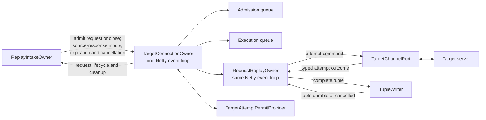

# Connection and Request Replay Low-Level Design

**Status:** initial class and message design

**Date:** 2026-09-14

This document defines target-connection and per-request replay components. It is a child of
[Replayer Low-Level Design](replayerLowLevelDesign.md) and consumes the identities and messages
defined by
[Kafka Source and Replay Intake Low-Level Design](replayerKafkaSourceAndIntakeLowLevelDesign.md).

The existing request transformation, target retry policy, target packet pacing, source-versus-target
comparison, and tuple format remain in force unless another approved design changes them. This
document defines when those operations run, who owns their mutable state, and which typed result
must return.

## 1. Component map



The proposed top-level Java components are:

| Component | Responsibility |
| --- | --- |
| `TargetConnectionOwner` | One captured connection lifetime's target channel, ordered command queues, active target turn, and request registry |
| `ConnectionAdmissionEntry` | One ordered request or captured-close command waiting for preparation time |
| `ConnectionExecutionEntry` | One prepared or preparing command waiting for captured execution time and its turn |
| `RequestReplayOwner` | One request's transformation, target attempts, retry state, final source response, tuple, and cleanup |
| `TargetAttemptPermitProvider` | Existing global target-attempt limit exposed as a nonblocking acquire/release interface |
| `TargetChannelPort` | Narrow event-loop-only interface for connect, reconnect, paced writes, response aggregation, and target close |
| `TupleWriter` | One logical complete-tuple write with internal retry until durable or cancellation |

There is no connection-owner executor. Each owner is assigned to one existing Netty event loop and
remains there for its lifetime.

## 2. Connection-owner creation and publication

Replay intake creates a target-connection owner only after it reconstitutes the first complete
request for a `ConnectionProcessingId`.

Construction may occur off the event loop only from immutable identity and configuration:

```text
ConnectionProcessingId
target configuration
time shifter reference
request transformation configuration
retry policy
tuple writer
permit provider
process supervisor
```

The first use submits one initialization-and-admission task to the selected event loop. Replay
intake publishes the owner reference for later routing only after the event loop has accepted that
task. Later messages from replay intake to the same owner use the same event loop.

Mutable state is never read or changed off that event loop. Every public owner entry point asserts
event-loop affinity inside its submitted task.

## 3. Inputs from replay intake

The connection owner accepts these immutable message families:

```java
sealed interface ConnectionInput permits
    AdmitReconstitutedRequest,
    AdmitCapturedClose,
    SourceResponseComplete,
    SourceResponseUnavailableForRetry,
    SourceResponseIncomplete,
    CapturedConnectionExpired,
    GracefulConnectionCancellation,
    ForceConnectionCancellation {
    ConnectionProcessingId connectionProcessingId();
}
```

Each input also carries `PartitionGenerationId`. The owner rejects an input for a different
generation or connection-processing lifetime.

### 3.1 Request admission

`AdmitReconstitutedRequest` contains:

- `ReplayRequestId`;
- captured request ordinal;
- captured source time used to calculate the nominal target send time;
- immutable reconstituted source request data;
- transformation and target metadata already fixed for the replay run; and
- an activity-monitor identity.

Admission returns:

```java
sealed interface RequestAdmissionResult permits
    RequestAdmissionAccepted,
    RequestAdmissionRejected {}
```

An accepted result means:

- the connection owner appended one admission entry;
- it created and registered exactly one `RequestReplayOwner`; and
- that request owner accepted responsibility for the request data.

A rejected result means the partition generation or connection lifetime was already cancelling or
closed before admission. The rejection returns responsibility for releasing the request data to
the sender.

### 3.2 Captured close admission

`AdmitCapturedClose` contains the captured ordinal and replay time of `CloseObservation`.

The close enters the same admission order as requests. It has no request owner and needs no
transformation.

Acceptance of the close command is sufficient target-side acknowledgement to replay intake. The
actual target-channel close is not Kafka commit authority. Any records already associated with a
reconstituted request remain tied to that request through tuple durability.

### 3.3 Source-response routing

The connection owner routes these messages immediately by `ReplayRequestId`:

- `SourceResponseComplete`;
- `SourceResponseUnavailableForRetry`; and
- `SourceResponseIncomplete`.

They do not enter either ordered connection queue. The owner does not inspect or modify response
bytes. It verifies that the request exists and submits the typed input to its request owner on the
same event loop.

A missing request for one of these messages is an invariant failure unless cancellation cleanup has
already removed the entire partition generation.

### 3.4 Connection expiration

`CapturedConnectionExpired` means heartbeat evidence ended the current process-local source
reconstruction.

The connection owner:

- rejects later admissions for that `ConnectionProcessingId`;
- retains every complete request already admitted;
- lets those requests run through target and tuple processing;
- closes the target channel after all admitted target turns finish; and
- remains alive until its request registry is empty.

The signal is not inserted at a captured replay time. It is a replay-intake liveness decision.

## 4. Connection-owner state

```text
TargetConnectionOwner
    ConnectionProcessingId
    Netty EventLoop
    target channel state
    admission queue
    execution queue
    request owner registry
    active target-turn request, if any
    pending permit acquisition, if any
    next preparation timer
    next execution timer
    source lifetime = open | captured close admitted | expired
    cancellation = active | graceful(deadline) | forced
    completion-emission guard
```

Only this owner changes these fields.

The request registry is keyed by `ReplayRequestId`, not only by the captured connection identity.
The registry retains a request after its target turn finishes and removes it only after normal
request-processing completion or cancellation cleanup.

## 5. Admission and execution queues

### 5.1 Admission queue

The admission queue contains requests and captured close in captured order.

Each entry contains only state known at admission:

```text
request:
    ReplayRequestId
    captured ordinal
    nominal send time T

close:
    captured ordinal
    nominal close time
```

It does not contain a future result.

For a request, the preparation point is approximately:

```text
T - preparationLead
```

where the initial `preparationLead` is one second.

When that time arrives, the connection owner:

1. removes the request entry from the admission head;
2. appends a preparing entry to the execution tail;
3. sends `BeginRequestPreparation` to the request owner; and
4. schedules the next admission entry's preparation timer.

The owner does not wait for one preparation to finish before scheduling preparation of a later
entry.

A close entry moves to the execution queue already prepared when its admission time is reached.

### 5.2 Execution queue

The execution queue preserves the same order as admission:

```text
ConnectionExecutionEntry
    command identity
    nominal execution time
    preparation = not required | waiting | ready
```

`RequestPreparationReady` can change only the matching entry from waiting to ready. A later entry
cannot pass an earlier one.

At or after the nominal execution time, the connection owner considers only the head:

- if another request owns the connection turn, it waits;
- if preparation is still pending, it waits without blocking the event loop;
- if a request is ready, it begins permit acquisition for that head;
- if a close is ready and every earlier target turn is finished, it closes the target channel.

An overdue entry runs as soon as its other prerequisites are satisfied.

### 5.3 Why two queues are sufficient

The admission queue answers which command should begin preparation next. The execution queue
answers which prepared command may use the target connection next.

Out-of-order transformation completion changes only readiness. It cannot change either queue's
order.

No online radix sorter or additional ordering thread is required.

## 6. Request preparation

`RequestReplayOwner` performs transformation on its connection's Netty event loop.

The typed preparation result is:

```java
sealed interface RequestPreparationResult permits
    RequestPreparationReady,
    RequestPreparationCancelled {}
```

Expected transformation fallback behavior remains part of the existing transformation policy and
is represented inside `RequestPreparationReady`. An unexpected transformation throw or exceptional
completion is process-fatal.

The request owner retains the prepared representation. The connection owner receives only the
identity and readiness result needed to update its execution entry.

Transformation runs once per request. Authentication signing that depends on current time runs
immediately before each target attempt.

## 7. Target turn and concurrency permits

Only the execution-queue head may begin a target turn.

For the first attempt:

1. the connection owner reserves the connection turn for the head request;
2. it asks `TargetAttemptPermitProvider` for one permit;
3. permit completion returns to the connection owner on its event loop;
4. the connection owner sends `BeginTargetTurn` with the permit to the request owner; and
5. the request owner begins the target attempt.

Requests waiting behind the head never acquire a permit.

For a retry, the request owner sends `RequestAttemptPermit` to its connection owner. Because that
request still owns the connection turn, the owner obtains and returns the permit without allowing a
later request to start.

Permit acquisition never blocks the event loop. Cancellation can withdraw a pending acquisition.

The request owner releases the permit as soon as the target attempt produces its outcome. It does
not hold the permit while:

- waiting for source-response input required by retry policy;
- waiting for retry backoff;
- waiting for final source-response input for the tuple; or
- writing the tuple.

## 8. Target attempt

`TargetChannelPort` is the only interface through which request replay changes target-channel
state. It is valid only on the connection's event loop.

It provides nonblocking operations for:

- opening or reusing the target channel;
- reconnecting after a target-initiated close;
- applying the captured per-packet pacing;
- signing immediately before the attempt;
- sending request bytes;
- aggregating the target response; and
- reporting that no response was obtained.

The attempt outcome is:

```java
sealed interface TargetAttemptOutcome permits
    TargetResponseObtained,
    NoTargetResponseObtained {}
```

`TargetResponseObtained` contains the complete response information required by retry policy and
tuple output, regardless of whether its HTTP or bulk-item result is successful.

`NoTargetResponseObtained` means no target response was obtained. It is not an unsuccessful HTTP
response.

When Netty accepts the request's first target write, the request owner reports
`FirstTargetWriteSubmitted` to the connection owner on their shared event loop. The connection
owner uses this fact to distinguish unsent work from work that has begun sending when it handles
cancellation. Retries do not repeat this transition.

`FirstTargetWriteSubmitted` is local to the target connection. It is not forwarded to replay
intake and does not affect Kafka input demand.

## 9. Retry decisions

Request transformation finishes before the first attempt. The following states concern only
sending the transformed request to the target server, receiving a target response, and deciding
whether to retry.

### 9.1 No target response

When no target response is obtained, the request continues the existing indefinite retry behavior
while the partition generation and process remain valid.

The request owner:

- records the attempt outcome;
- releases the permit;
- applies the existing retry delay and connection-reuse rules;
- obtains another permit through the connection owner; and
- starts another attempt.

It does not produce a terminal target result or Kafka-record completion.

### 9.2 Target response obtained

When a target response is obtained:

1. the request owner records it in the complete attempt history;
2. it releases the target-attempt permit;
3. it determines whether the configured retry policy needs captured source-response input;
4. if the required input is unresolved, it enters `WaitingForRetrySourceResponse`;
5. otherwise it applies the existing retry policy.

The retry-policy result is:

```java
sealed interface RetryDecision permits
    RetryRequired,
    TargetServerAttemptsFinished {}
```

`RetryRequired` schedules the existing retry delay and eventually requests another permit.

`TargetServerAttemptsFinished` means the replayer obtained a target-server response and the retry
policy requires no further attempt. The final response may be successful or unsuccessful. A
non-retryable unsuccessful response is not skipped and does not request Kafka redelivery.

### 9.3 Source response used for retry

The request owner accepts exactly one:

```java
sealed interface RetrySourceResponse permits
    CompleteSourceResponseForRetry,
    SourceResponseUnavailableForRetry {}
```

The value is immutable and cannot be replaced. A complete source response arriving after
`SourceResponseUnavailableForRetry` may still become the final tuple input but never changes retry
policy.

## 10. Connection-turn completion

The request owner emits exactly one `ConnectionTurnFinished` when:

- sending and retrying the request against the target server has finished; or
- cancellation has ended a previously started target turn.

Before emitting it, the request owner:

- has no target attempt in progress;
- holds no target-attempt permit;
- has cancelled any retry timer;
- will request no later target attempt; and
- has released target-attempt-only data.

The connection owner:

1. verifies that the request owns the active turn;
2. clears the active-turn field;
3. removes the request's execution entry;
4. submits exactly one `ConnectionRequestFinished` to replay intake for a normally or gracefully
   completed target turn;
5. schedules or immediately examines the next execution-queue head; and
6. retains the request in its registry until full processing or cleanup finishes.

The connection does not wait for tuple durability before advancing.

## 11. Final source-response input

The request owner accepts exactly one final tuple input:

```java
sealed interface FinalSourceResponse permits
    CompleteFinalSourceResponse,
    IncompleteFinalSourceResponse {}
```

`CompleteFinalSourceResponse` owns the complete captured response.

When `SourceResponseComplete` arrives while retry-source-response input is unresolved, the request
owner uses that same immutable complete response for both retry policy and final tuple input.

`IncompleteFinalSourceResponse` carries no partial response bytes represented as complete. It
records that the captured response ended incomplete because source assembly closed or expired.
The tuple representation need not distinguish those two causes unless the tuple schema separately
requires that diagnostic information.

When `SourceResponseIncomplete` arrives while retry-source-response input is unresolved, the
request owner also freezes retry input as unavailable.

The final response may arrive:

- before the first target attempt;
- between retries;
- after sending and retrying the request against the target server has finished; or
- after connection-turn completion.

It does not control per-connection target ordering unless retry policy explicitly needs the
separate retry-source-response input.

## 12. Tuple construction and durability

Tuple output begins once both are available:

- sending and retrying the request against the target server has finished; and
- the final complete or incomplete source-response outcome.

The request owner constructs one complete tuple containing the established request and replay
outputs, including:

- the source request;
- complete or explicitly incomplete captured source response;
- target attempt history and terminal response outcome;
- source-versus-target HTTP and bulk comparison required by user output; and
- existing replay and transformation metadata.

The request owner sends one logical `WriteTuple` request.

`TupleWriter` owns all tuple-sink retries. A permissions error, missing bucket, unavailable sink,
or other persistent sink error keeps retrying while the generation and process remain valid. The
request owner does not schedule physical tuple-write retries.

The typed result is:

```java
sealed interface TupleWriteResult permits
    TupleDurable,
    TupleWriteCancelled {}
```

`TupleDurable` means the complete tuple reached the configured durable-output condition.

`TupleWriteCancelled` occurs only through scoped generation cancellation or process shutdown. It
does not produce normal request-processing completion.

## 13. Request-processing completion

After `TupleDurable`, the request owner:

1. releases request-specific source, transformed, target-response, and tuple resources;
2. verifies that connection-turn completion was already emitted;
3. marks its lifecycle normally finished; and
4. emits exactly one `RequestProcessingFinished`.

The connection owner:

1. verifies that the request is still registered;
2. submits the completion to replay intake;
3. after required inbox acceptance, removes the request from its registry; and
4. checks whether the connection owner itself can finish.

Replay intake, not the connection owner, releases the request's Kafka-record associations.

## 14. Request state model

`RequestReplayOwner` uses explicit sealed state values rather than booleans whose combinations are
interpreted informally.

The state is composed from these independently named parts:

```text
PreparationState
    admitted | preparing | ready | cancelled

TargetServerState
    not started
    waiting for permit
    attempt in progress
    waiting for retry source response
    waiting for retry time
    finished
    cancelled

RetrySourceResponseState
    unresolved | complete | unavailable

FinalSourceResponseState
    unresolved | complete | incomplete

TupleState
    not ready | writing | durable | cancelled

CancellationState
    active | graceful(deadline) | forced
```

Every owner input is handled by an exhaustive switch. The handler validates the complete state
combination before applying a transition.

Examples of fatal impossible transitions:

- a second final source-response result;
- `TupleDurable` before tuple writing began;
- a second connection-turn completion;
- target attempt outcome while no attempt is in progress;
- a retry attempt after sending and retrying the request against the target server has finished;
- normal request-processing completion after forced cancellation; and
- a request input for the wrong `ConnectionProcessingId`.

Transition-table tests cover every input against every reachable state category. Adding a new
sealed input variant causes compilation failures at affected switches.

## 15. Resource lifetime

### 15.1 Reconstituted request data

Before admission, replay intake owns the request-data reference.

- `RequestAdmissionAccepted` transfers that reference to `RequestReplayOwner`.
- `RequestAdmissionRejected` leaves it with replay intake, which releases it.
- the request owner releases it after tuple durability or cancellation cleanup.

### 15.2 Prepared and signed data

The request owner owns the transformed reusable representation.

Each target attempt owns any per-attempt signed or materialized `ByteBufList`. The attempt path
releases that list exactly once after Netty accepts the required retained views or after the
attempt is cancelled before submission.

The original transformed representation is not released by an attempt-level callback. It remains
owned by the request until final cleanup.

### 15.3 Source and target responses

Replay intake owns a complete source-response reference until the connection owner accepts its
delivery to the request owner. The request owner then owns it through tuple durability or
cancellation.

The target attempt transfers its complete response representation to the request owner, which
retains the required attempt history through tuple durability or cancellation.

### 15.4 Tuple data

The request owner owns the complete tuple until `TupleWriter` accepts it. The tuple writer owns any
references needed across retries and releases them after `TupleDurable` or
`TupleWriteCancelled`.

Every transfer has a one-shot acceptance guard. Duplicate acceptance or release is an invariant
failure.

## 16. Captured close, expiration, and owner removal

### 16.1 Captured close

At the close entry's nominal time, after every earlier target turn finishes, the connection owner
closes the target channel and marks the ordered source lifetime closed.

Requests whose connection turn already finished may remain in the registry while tuple output
continues.

### 16.2 Heartbeat expiration

After `CapturedConnectionExpired`, the connection owner runs every already-admitted complete
request. It closes the target channel after their target turns finish and accepts no later source
input for that `ConnectionProcessingId`.

### 16.3 Target-initiated channel close

A target keepalive timeout, reset, or other target-initiated close does not remove the owner.
The `TargetChannelPort` reconnects for a later attempt or request according to existing policy.
The affected attempt returns `TargetResponseObtained` or `NoTargetResponseObtained` as applicable.

### 16.4 Owner removal

The connection owner emits one `ConnectionOwnerFinished` and becomes removable only when:

- captured close or heartbeat expiration ended source admission, or cancellation ended the
  generation;
- the admission and execution queues are empty;
- no target turn or permit acquisition remains;
- the request registry is empty;
- the target channel is closed; and
- every owner-created timer and reference is released.

Normal `ConnectionOwnerFinished` updates replay-intake routing state but does not independently
release a Kafka record. Cancellation completion also contributes to generation cleanup.

## 17. Scoped cancellation

### 17.1 Graceful cancellation

The deadline is the process-local monotonic value supplied by the Kafka source owner. Connection
and request owners compare it only with the same monotonic clock.

On `GracefulConnectionCancellation(deadline)`, the connection owner:

- rejects new admissions;
- cancels every queued request that has not submitted a target write;
- cancels pending preparation and permit acquisition for those requests;
- prevents the execution queue from beginning another unsent request;
- allows a request that already submitted a target write to continue its target and required tuple
  chain until the deadline; and
- allows a tuple already required by such a request to begin and finish during the grace interval.

An admitted request cancelled before it begins sending returns cancellation cleanup and emits no
`ConnectionRequestFinished`.

A request whose target turn finishes normally or during graceful cancellation emits exactly one
`ConnectionRequestFinished`.

### 17.2 Force cancellation

On `ForceConnectionCancellation`, the owner upgrades the same scope and immediately forwards force
cancellation to every remaining request owner.

Each request owner:

- cancels pending timers and permit acquisition;
- releases any held permit;
- cancels or closes active target I/O according to the existing channel policy;
- cancels tuple output;
- releases all request-owned references; and
- emits `RequestCleanupFinished`, not `RequestProcessingFinished`.

The connection owner aggregates request cleanup, closes the channel, releases its queues and
timers, and emits `ConnectionCleanupFinished`.

Neither cleanup result authorizes Kafka commit.

## 18. Activity monitoring

Before starting correctness-relevant asynchronous work, the owning component registers:

- `PartitionGenerationId`;
- `ConnectionProcessingId`;
- `ReplayRequestId`, when applicable;
- operation type;
- start time;
- scheduled target time, when applicable; and
- current wait reason.

The registration remains until the owner applies the typed completion or cleanup input.

Examples include:

- request preparation;
- permit acquisition;
- target attempt;
- retry-source-response wait;
- retry timer;
- final source-response wait;
- tuple durability; and
- cancellation cleanup.

Long-running activity reporting observes these registrations but cannot complete them.

## 19. Required tests

### 19.1 Ordering and timing

- Requests and captured close enter in captured order.
- Transformations finish out of order but target turns remain ordered.
- A preparation that misses its nominal send time runs when ready without blocking the event loop.
- Only the execution head requests a first-attempt permit.
- Per-packet target pacing matches captured timing.
- Transformation runs near `T - preparationLead`; signing runs immediately before each attempt.

### 19.2 Request lifecycle

- A terminal target result emits connection-turn completion before tuple durability when final
  source response is still pending.
- A request whose retry policy needs source response waits without holding a permit.
- A later retry reacquires a permit.
- A target response, including an unsuccessful response, finishes target-server work when the
  existing retry policy requires no further attempt.
- No target response retries indefinitely until cancellation.
- The first accepted target write changes local cancellation state exactly once, and retries do not
  repeat that transition.
- Exactly one `ConnectionRequestFinished` reaches replay intake for a normally or gracefully
  completed target turn.
- Cancellation before target sending emits cleanup and no `ConnectionRequestFinished`.
- Exactly one request-processing completion reaches replay intake after tuple durability.

### 19.3 Source-response and tuple

- Complete source response before target completion is retained for retry and tuple use.
- Retry input may freeze unavailable while final response later becomes complete.
- Incomplete final response contains no partial bytes represented as complete.
- Tuple output waits until target-server sending and retries have finished and the final
  source-response outcome is available.
- Tuple writer owns retries and returns one durable result.
- Source-versus-target comparison remains in tuple and user-facing output.

### 19.4 Connection lifecycle

- First complete request creates an owner without a captured open in process-local state.
- Captured close is ordered after earlier requests.
- Heartbeat expiration rejects later admissions but finishes every admitted complete request.
- Target-initiated channel close reconnects without removing the owner.
- An expired lifetime and a later fresh lifetime for the same captured identity use different
  owners and route no messages to one another.
- The owner remains until its registry, queues, channel, timers, and references are clean.

### 19.5 Cancellation and resources

- Graceful cancellation immediately cleans every unsent request.
- A sent request may finish target and tuple work before the deadline.
- Force cancellation produces cleanup results rather than normal processing completion.
- No permit, timer, target buffer, transformed request, response, tuple, or registry entry leaks.
- Every per-attempt signed buffer list is released exactly once.
- Cancellation cleanup never emits Kafka-record completion.

### 19.6 Failure

- Every impossible transition reaches the process supervisor.
- Event-loop death uses the fatal owner-loss path.
- Rejected required message submission is fatal.
- No default switch hides a new expected outcome.
