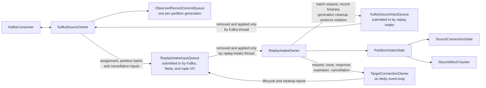

# Kafka Source and Replay Intake Low-Level Design

**Status:** initial class and message design

**Date:** 2026-09-15

This document defines the replayer components that own Kafka and source-side reconstruction. It is
a child of [Replayer Low-Level Design](replayerLowLevelDesign.md) and must preserve
[Replayer Processing and Commit Architecture](replayerProcessingAndCommitArchitecture.md).

This document does not define target retry policy, request transformation, target-channel behavior,
or tuple formatting. It defines the messages and completion evidence those components must return.

## 1. Component map



The proposed top-level Java components are:

| Component | Responsibility |
| --- | --- |
| `KafkaSourceOwner` | Every Kafka consumer call, assignment lifecycle, pause state, observed-record commit order |
| `KafkaSourceInputQueue` | Thread-safe submission of immutable messages to the Kafka source |
| `PartitionSourceState` | One currently assigned partition generation, its bootstrap and explicit batch demand, and its independent pause reasons |
| `ObservedRecordCommitQueue` | Observed Kafka record order and consecutive finished records at the head of the queue |
| `ReplayIntakeInputQueue` | Thread-safe submission of immutable Kafka batches, lifecycle inputs, completion inputs, and cleanup inputs |
| `ReplayIntakeOwner` | Decode and apply records; own source reconstruction, broker-time state, demand, and record associations |
| `PartitionIntakeState` | All replay-intake state for one partition generation |
| `WriterPartitionTimeState` | Heartbeat baseline or restart fallback for one writer and partition |
| `SourceConnectionState` | One process-local source HTTP assembly lifetime |
| `RecordWorkTracker` | Whether one indivisible Kafka record still has associated work |
| `GenerationCleanupTracker` | Whether every process-local object from one revoked generation is clean |

Names may change during implementation review, but responsibilities and message directions may not
move without updating the architecture.

## 2. Shared immutable values

The following records are values, not state owners:

```java
record PartitionGenerationId(TopicPartition topicPartition, long localSequence) {}

record KafkaRecordId(PartitionGenerationId generation, long offset) {}

record WriterPartitionId(String writerNodeId, TopicPartition topicPartition) {}

record CapturedConnectionId(String writerNodeId, String connectionId) {}

record ConnectionProcessingId(
    PartitionGenerationId generation,
    CapturedConnectionId capturedConnectionId,
    long localSequence
) {}

record ReplayRequestId(
    ConnectionProcessingId connectionProcessingId,
    long capturedRequestOrdinal
) {}

record PartitionBatchRequestId(
    PartitionGenerationId generation,
    long localSequence
) {}

record CancellationDeadline(long monotonicDeadlineNanos) {}
```

`PartitionGenerationId.localSequence` is allocated by the replayer each time Kafka assigns that
partition locally. It is not Kafka's group generation and is never serialized.

`ConnectionProcessingId.localSequence` is allocated whenever replay intake begins fresh
process-local source assembly for a captured connection. It distinguishes a later fresh lifetime
from an expired lifetime whose target or tuple work is still finishing.

`ReplayRequestId` is the only request identity used across replay intake, target connection,
request replay, and tuple output.

`PartitionBatchRequestId.localSequence == 0` identifies the source-local bootstrap entitlement
installed automatically when the Kafka source creates a partition generation. It is carried only
by the first real batch, never as a request message. Replay intake allocates later values beginning
at `1` for its explicit next-batch requests. The identity is never serialized.

## 3. Kafka-source and replay-intake loops

`KafkaSourceOwner` runs on the dedicated Kafka thread. `ReplayIntakeOwner` runs on the dedicated
replay-intake thread. They communicate only by the immutable messages defined below.

The Kafka-source loop is:

```text
apply queued Kafka-source inputs, with commit and lifecycle work before new batch requests
submit eligible commits
resume assigned partitions that have bootstrap or explicit batch demand and are otherwise readable
perform one Kafka poll
for each partition represented in the result:
    pause that partition before the next poll
    register every returned record in observed order
    submit one PartitionRecordBatch to replay intake
repeat
```

One `poll()` may return records from several readable partitions. The Kafka source groups the
result by partition and consumes one corresponding bootstrap or explicit entitlement for each
partition represented.

An empty poll consumes no entitlement. Its partition remains resumed and the Kafka source
continues polling until records arrive, the assignment changes, or lifecycle state prohibits
reading.

The replay-intake loop is:

```text
remove one replay-intake input
apply that input completely to replay-intake state
emit every resulting typed message
repeat
```

Creating a partition generation automatically installs one source-local bootstrap entitlement.
The source submits `PartitionGenerationAssigned` only after its generation state and cleanup gate
are installed, and before that entitlement may make the partition readable. Replay intake applies
the assignment by creating state that expects the bootstrap batch and then performs its ordinary
end-of-input demand pass over every assigned generation. If demand is open, it may immediately
submit one `RequestNextPartitionBatch` in addition to the bootstrap entitlement.

Bootstrap therefore has two ordered source-to-intake messages: first
`PartitionGenerationAssigned`, then `PartitionRecordBatch` if Kafka returns records. The ordinary
intake-to-source demand pass is not suppressed. The source may consequently owe two batches—the
bootstrap batch and one explicitly requested batch—and delivers them in that order. Both are real,
nonempty Kafka batches; no synthetic or empty bootstrap item crosses either queue.

After applying a `PartitionRecordBatch`, replay intake may submit another
`RequestNextPartitionBatch` for that partition. It cannot submit the next request before it has
applied every record in the current batch.

Kafka preserves record order within a partition. The replayer does not define an order between
different partitions and does not need one.

## 4. Messages into and out of replay intake

### 4.1 Inputs submitted to replay intake

The Kafka thread, Netty event loops, and tuple I/O may submit immutable inputs to
`ReplayIntakeInputQueue`. Only the replay-intake thread removes those inputs and changes
replay-intake state. The queue does not own replay state.

The sealed input family initially contains:

```java
sealed interface ReplayIntakeInput permits
    PartitionGenerationAssigned,
    PartitionRecordBatch,
    GracefulGenerationCancellation,
    ForceGenerationCancellation,
    FinalizedArchivePartitionEnd,
    ConnectionRequestFinished,
    RequestProcessingFinished,
    ConnectionOwnerFinished,
    ConnectionCleanupFinished {
    PartitionGenerationId generation();
}
```

These are events that replay intake processes, not states:

| Input | What it reports | What replay intake changes |
| --- | --- | --- |
| `PartitionGenerationAssigned` | Kafka assigned a partition, the source allocated a new process-local generation, and its bootstrap batch entitlement is open. | Creates the corresponding `PartitionIntakeState` expecting the bootstrap batch, then runs the ordinary demand pass over all assigned generations and may emit one `RequestNextPartitionBatch`. |
| `PartitionRecordBatch` | Kafka returned the records that satisfy one outstanding request for this partition generation. | Applies every record in order, closes that batch request, recomputes demand, and may submit the next request. |
| `GracefulGenerationCancellation` | Kafka began revoking the partition and supplied the grace deadline. | Stops admitting records from the generation, cancels work that has not started an external operation, and distributes scoped graceful cancellation. |
| `ForceGenerationCancellation` | Cancellation of everything remaining in this generation is now required. Sent when the revocation's grace interval ends — at its deadline, or earlier once every revoked generation has reported cleanup. | Records forced cancellation and distributes it to every remaining connection and request owner in the generation. |
| `FinalizedArchivePartitionEnd` | A finalized imported partition has no later record. | Applies the finite-input expiration rules without creating Kafka timestamp or offset evidence. |
| `ConnectionRequestFinished` | The request has finished all target sends and retries, so the next request from the same captured connection may start. Tuple work may still be unfinished. | Removes the request from retry-ready Kafka demand supply if it was counted and prevents later retry-input resolution from adding it back. |
| `RequestProcessingFinished` | Target sending and retries are finished, the captured source response is either complete or known to be incomplete, the tuple is durable, and the request's resources have been released. | Marks this request's required processing complete for every Kafka record containing its request or response observations. A record may then finish if no other request or incomplete source reconstruction still depends on it. |
| `ConnectionOwnerFinished` | A normally completed connection owner has no requests, queued work, target connection, timers, or retained data left. | Removes the mapping used to send later messages to that connection owner. This event does not itself finish a Kafka record. |
| `ConnectionCleanupFinished` | A connection owner and all of its requests have finished cancellation cleanup after Kafka revoked the partition. | Records that this connection no longer prevents cleanup of the revoked partition assignment. Cancelled Kafka work does not become committable. |

Duplicate or already-cleaned delivery of `ForceGenerationCancellation` is inert. It is distributed to every
remaining connection and request owner in the generation, which is the empty set once that generation's cleanup
has completed, and it creates no state. The Kafka source therefore submits it unconditionally, including when
the grace wait returned early because every revoked generation had already reported cleanup.

Any future input must be a named immutable value and its design must state:

- which completed operation emits it;
- which identities it carries;
- which replay-intake fields may change when it is processed;
- how duplicate, stale-generation, and already-cleaned-generation delivery is handled; and
- whether it affects Kafka-record associations, partition demand, or generation cleanup.

The queue does not accept a generic callback or `Runnable`. Such a value would hide which
replay-intake fields it can change and would bypass the exhaustive switch over the named input
types.

Orderly owner termination is queue control, not another `ReplayIntakeInput`. The queue internally
orders two entry types: an ordinary immutable input and one stop-after-draining marker. Requesting
stop atomically stops acceptance before appending that marker. The replay-intake owner therefore
cannot remove it until every successfully submitted input before it has been removed and applied
completely. Removing the marker ends the owner loop and completes its termination future.

The marker changes no replay-intake state, carries no generation identity, and does not enter the
exhaustive input switch above. It is the FIFO fence used by orderly process shutdown and by bounded
producers that need to close replay intake after their final input. An abrupt process-failure path
may close the queue without draining and does not wait for this marker.

Inputs sent by one owner to this queue preserve that sender's submission order. In particular, the
Kafka source submits `PartitionGenerationAssigned` before it can submit that generation's initial
`PartitionRecordBatch` or cancellation. Correctness must not depend on a total order between
independent owners; messages carry request and generation identities so replay intake can apply a
valid completion regardless of which independent connection completed first.

An input submission needed for correctness must report acceptance. Queue rejection or an
unexpected failure to submit is process-fatal.

### 4.2 Messages from replay intake to the Kafka source

Replay intake also sends typed messages back to `KafkaSourceOwner`:

```java
sealed interface KafkaSourceInput permits
    RequestNextPartitionBatch,
    RecordProcessingFinished,
    GenerationCleanupFinished,
    CaptureProtocolViolationDetected {}
```

| Input | What it reports | What the Kafka source changes |
| --- | --- | --- |
| `RequestNextPartitionBatch` | Replay intake has completely applied the previous batch and needs the next available records for this partition generation. | Records one outstanding request. It resumes the partition only when assignment, prior-generation cleanup, and lifecycle state also permit reading. |
| `RecordProcessingFinished` | Every required operation associated with one Kafka record has finished. | Marks that observed record finished. Starting with the earliest observed record, the Kafka source may commit past consecutive records only while each one is finished. |
| `GenerationCleanupFinished` | Replay intake has removed all process-local state belonging to one revoked partition assignment. | Allows a newer assignment of that partition to begin reading. It does not commit records from the revoked assignment. |
| `CaptureProtocolViolationDetected` | Replay intake detected invalid capture input at a specific Kafka partition and offset. | Stops admitting later Kafka records and begins the already-defined diagnostic, bounded-drain, and process-termination path. |

Replay intake submits these values to `KafkaSourceInputQueue`. Only the Kafka thread removes and
applies them. Required submission reports acceptance; the queue is not allowed to silently discard
an input.

`RequestNextPartitionBatch` is not a general resume notification. It is a request with an identity
and exactly one eventual result: one `PartitionRecordBatch`, or cancellation because that
partition generation ended. Replay intake may have at most one such explicit request outstanding
for a partition generation. The assignment bootstrap entitlement is independent and may overlap
that one request.

## 5. Kafka source owner

### 5.1 Partition source state

For each assigned partition, `KafkaSourceOwner` holds one `PartitionSourceState`:

```text
PartitionSourceState
    current PartitionGenerationId
    ObservedRecordCommitQueue
    assignmentBootstrapPending
    outstanding intake-requested PartitionBatchRequestId, or none
    priorGenerationCleanupPending
    lifecycleAllowsIntake
    kafkaPaused
    pendingCommit
```

The effective read decision is:

```text
readable =
    assignmentBootstrapPending or an intake-requested batch is outstanding
    and not priorGenerationCleanupPending
    and lifecycleAllowsIntake
```

The owner calls `pause()` or `resume()` only when the effective state changes. Clearing one reason
never clears another.

There is no record-count or byte-count ownership limit. Ordinarily one intake-requested batch may
be outstanding; assignment may add one bootstrap batch, so a new generation can briefly produce
two batches before demand settles. Neither entitlement limits the size of its Kafka result, so
either batch may still exhaust memory. The design does not refuse a batch partway through: a later
record in that batch may be the heartbeat, close, response, or broker-time evidence needed to
release earlier work, so a hard cap could deadlock the replayer. This is the one place this
trade-off is made; later sections rely on it rather than restating it.

### 5.2 Assignment

Kafka does not preserve pause state across an assignment change. During
`onPartitionsAssigned`, before Kafka may fetch from the resulting assignment,
`KafkaSourceOwner` pauses every partition in `consumer.assignment()`.

For each newly assigned partition:

1. `KafkaSourceOwner` allocates a new `PartitionGenerationId`.
2. It creates a new `ObservedRecordCommitQueue` beginning at Kafka's assigned position.
3. It opens the assignment bootstrap entitlement, identified by
   `PartitionBatchRequestId(generation, 0)`.
4. If any prior local generation is still cleaning up, it sets
   `priorGenerationCleanupPending=true`.
5. It submits `PartitionGenerationAssigned` to replay intake.

The complete assignment is paused before these steps, so the bootstrap entitlement cannot admit
records before the assignment input is accepted. Afterwards, if no cleanup or lifecycle reason
still prohibits reading, it makes the partition readable immediately. If cleanup is pending, the
entitlement remains open and clearing the cleanup reason later makes the partition readable
without another signal. Whether records arrive immediately, arrive after cleanup, or never arrive,
`PartitionGenerationAssigned` is always the first source-to-intake message for the generation.

Applying `PartitionGenerationAssigned` does not suppress replay intake's normal demand pass. An
explicit `RequestNextPartitionBatch` may therefore arrive while the bootstrap entitlement remains
open. The source records one such request independently and consumes the bootstrap entitlement
before the explicit request.

A partition retained continuously by this consumer keeps its existing
`PartitionGenerationId`, but the source still reapplies its pause state after the assignment
change. After the callback, only partitions with bootstrap or explicit batch demand and no other
pause reason are resumed.

A newly assigned generation cannot reuse mutable state from the previous generation.

### 5.3 Requesting and delivering one partition batch

Replay intake requests a batch with:

```java
record RequestNextPartitionBatch(PartitionBatchRequestId requestId) {}
```

The assignment bootstrap entitlement does not cross `KafkaSourceInputQueue`. Replay intake may
submit `RequestNextPartitionBatch` immediately after applying `PartitionGenerationAssigned`, or
after any later input, when its ordinary demand pass finds demand open.

The Kafka source accepts it only when:

- the partition generation is current;
- no earlier intake-issued batch request for that generation remains outstanding; and
- lifecycle state has not permanently ended intake for the generation.

Prior-generation cleanup may temporarily prevent reading without rejecting the request. The
request remains outstanding and the partition remains paused until cleanup finishes.

When `poll()` returns records for a readable partition, the Kafka source:

1. pauses that partition before another poll can run;
2. consumes the bootstrap entitlement if it remains open; otherwise it clears the outstanding
   intake-issued request;
3. registers every returned record in observed order;
4. creates one immutable, nonempty result:

   ```java
   record PartitionRecordBatch(
       PartitionBatchRequestId requestId,
       List<ApplicationKafkaRecord> records
   ) {}
   ```

5. submits the result to replay intake.

One poll may complete one outstanding request for each of several partitions. Records for one
partition remain in Kafka order. No order is defined between the separate partition-batch
messages.

An empty poll completes no request. A result for a partition that had no outstanding request is an
internal invariant failure.

Replay intake fully applies the batch before it may request the next batch for that partition, so
the application holds at most one delivered-but-not-yet-applied batch per partition generation.
That is a batch-count property, not the byte or record ceiling that §5.1 rules out.

### 5.4 Poll interruption and queued source messages

`KafkaSourceInputQueue` carries source commands. `KafkaConsumer.wakeup()` carries no command and
changes no source state; it only prompts the Kafka thread to stop waiting in `poll()` and inspect
the queue.

The wakeup controller has one race-safe state that distinguishes:

- the Kafka thread may be waiting in `poll()`;
- a rebalance callback is running; or
- another Kafka operation is running.

Submitting a source input always places the immutable value in the queue first. If the Kafka
thread may be waiting in `poll()`, the controller issues at most one coalesced wakeup. During a
rebalance callback or another Kafka operation, it records that a wakeup is pending but does not
issue it.

Before a rebalance callback returns, it atomically leaves the callback state and checks whether a
wakeup became pending while the callback ran. If so, it issues one wakeup. The surrounding
`poll()` then returns or throws `WakeupException`, and the Kafka loop drains the queued source
inputs. If this occurs after `onPartitionsRevoked` but before `onPartitionsAssigned`, the next
`poll()` continues the rebalance; the assignment callback is postponed, not discarded.

`WakeupException` is caught only at the poll-loop boundary and means “inspect the source-input
queue.” It is not logged as a Kafka failure. A wakeup that races with normal poll return must be
consumed at a controlled poll boundary before the source begins a commit or another Kafka
operation that wakeup is permitted to interrupt.

Pausing all partitions does not prevent group maintenance or rebalance callbacks. The source
therefore never resumes partitions merely to make Kafka coordination responsive.

### 5.5 Poll-result registration

Before replay intake applies a Kafka record, `KafkaSourceOwner` registers it in
`ObservedRecordCommitQueue`.

The queue stores observed records in poll order:

```text
ObservedRecordEntry
    KafkaRecordId
    completed = false
```

This is an ordered deque, not an array indexed by numeric offset. Kafka logs may contain physical
offset gaps. The commit rule is based on the ordered records the consumer observed, not on every
integer between two offsets.

After registration, replay intake receives an immutable application-record value containing:

- `KafkaRecordId`;
- key, value, and headers as required for diagnostics;
- Kafka `LogAppendTime`;
- the containing partition from Kafka metadata; and
- the decoded or still-encoded `CaptureRecord` value.

Replay intake, not the Kafka source, interprets `CaptureRecord.payload`.

### 5.6 Record-processing-finished input

Replay intake emits exactly one:

```java
record RecordProcessingFinished(KafkaRecordId recordId) {}
```

after that whole record has no unfinished associated work.

`KafkaSourceOwner` marks the matching observed entry complete. A duplicate completion or a
completion for a record that was never registered in the active generation is an invariant
failure unless the generation has already been cleaned up, in which case a late message is
diagnostic only.

The owner removes complete entries from the head of the deque. If entries through offset `O` were
removed, the next commit position is `O + 1`.

Later complete entries remain queued behind an incomplete head.

After `KafkaSourceOwner` accepts `RecordProcessingFinished`, replay intake removes its
`RecordWorkTracker`. The Kafka source's observed-record queue then owns the remaining process-local
state needed to submit or abandon the Kafka commit.

### 5.7 Commit submission

Only `KafkaSourceOwner` invokes the Kafka commit API.

For each partition generation it stages at most one next contiguous commit position. It may batch
positions for several partitions in one Kafka operation.

**Two submission modes, chosen by where the commit happens.**

In the ordinary loop the owner submits **asynchronously** and handles the completion callback, which
`procCommit §5.1` already lists among its Kafka operations. A synchronous commit in the loop blocks for
as long as the client retries internally — up to its configured API timeout — and the owner does not
poll while it blocks, which is the same mechanism that makes a blocking commit inside a rebalance
callback dangerous. The loop polls every iteration and a poll is what delivers the callback, so
asynchronous submission needs nothing extra to make progress.

Inside `onPartitionsRevoked` the owner submits **synchronously**, bounded by the time remaining before
the grace deadline. **It attempts the commit however little of the interval is left, and there is no minimum
remainder below which it declines to try.** The work whose position this commits has already been sent to the
target and cannot be recalled, so every remaining millisecond is worth spending on recording it completely: the
alternative is not a saving but a guaranteed re-send of traffic the target has already seen. The bound is what
confines the call, so a small remainder is a small budget rather than a hazard, and a revoked generation's
position is discarded once the callback returns whether or not the attempt was made. Asynchronous
submission cannot be used there: its callback is delivered by a later poll, and the generation is gone
before that poll happens. A commit that cannot finish within the remaining grace must not be started,
because the rest of the interval belongs to force-cancellation delivery (§15.2).

**At most one commit operation is in flight at a time.** Positions submitted and not yet resolved are
held apart from staged positions, so a partition whose contiguous prefix advances again while its
commit is outstanding stages the newer position rather than racing a second operation for the same
partition. This is also what keeps the source from spamming the broker (`procCommit §9.4`).

Commit handling distinguishes:

- **acknowledged** — the client recorded the operation;
- **retriable** — the client reports a failure it expects the caller to retry, and the generation is
  intact. Asynchronous submission surfaces these to the caller rather than absorbing them, which
  synchronous submission does not;
- **the generation is stale** — the client reports that this member's generation or membership is no
  longer valid. The broker validates generation per *request*, not per partition, so this applies to
  every partition in the operation and singles out none of them;
- **the outcome is unknown** — a bounded synchronous commit ran out of time, or a wakeup interrupted
  one. The operation may already have reached the broker;
- **a late callback** — the callback's generation is no longer held locally. Diagnostic only.

A **structurally invalid** commit is not in this list and is not an outcome. Authorization failure,
oversized offset metadata, an invalid commit offset size, and any unrecognized commit failure are
process-fatal per `replayerLLD §4`: retrying cannot fix them, and continuing to read while never
committing loses data on the next restart without saying so.

These outcomes describe the operation, not individual partitions. A batched operation may be applied
for some of its partitions and not others, and the Kafka client reports one result for the whole
operation without identifying which positions were recorded — the per-partition error codes exist on
the wire and the client discards them. A failed operation is therefore not evidence that nothing was
committed, and the source never treats it as such. **The source never infers which partition failed**;
where it must distinguish partitions it uses what it already knows about its own assignment, never the
operation's result.

None of these outcomes returns a Kafka-record disposition to replay intake. Replay intake already
finished its record-processing decision before sending `RecordProcessingFinished`.

A staged position is discarded when its commit is acknowledged, not when it is attempted. If an
operation does not succeed, every partition in it that this consumer still owns under the same
generation keeps its staged position and is offered again in a later operation. Re-offering a position
that was in fact recorded is harmless, which is what makes this sound while partial application stays
unobservable. Abandoning the position instead would hold that partition's committed progress until its
next contiguous prefix advances, which work blocked behind an unfinished record can delay without
bound.

After revocation, the old generation does not retry or wait indefinitely for a commit. Its staged
position is discarded rather than re-offered. The next assigned Kafka position determines redelivery.

Revocation begins when `onPartitionsRevoked` is entered, not when it returns. Within the callback the
owner knows which partitions it is losing, because Kafka handed it that collection, so the decision to
discard needs no inference from an outcome. A first synchronous attempt during the grace interval is
still permitted (`procCommit §9.2` step 5); what the discard rule forbids is offering the same position
again after that attempt did not succeed. Re-offering cannot succeed — a stale generation's commit is
rejected identically however many times it is sent — and it consumes the interval that force
cancellation needs.

## 6. Replay-intake partition state

`ReplayIntakeOwner` holds one `PartitionIntakeState` for each local partition generation:

```text
PartitionIntakeState
    PartitionGenerationId
    greatestObservedLogAppendTime
    writerTimeStateByWriterNodeId
    activeSourceConnectionsByCapturedConnectionId
    activeConnectionProcessingById
    requestStateByReplayRequestId
    recordTrackersByKafkaRecordId
    unresolvedRetryBoundaries
    retryReadyRequestSupplyCount
    bootstrapBatchState = pending | applying | consumed
    requestedBatchState = idle | requested | applying
    cancellationState
    GenerationCleanupTracker
```

All maps are changed only by the replay-intake thread.

`activeSourceConnectionsByCapturedConnectionId` points only to the current source-assembly lifetime.
Older expired `ConnectionProcessingId` values may remain in
`activeConnectionProcessingById` while their target and tuple work finishes. A new source lifetime
replaces only the current captured-identity mapping; it does not mutate the old lifetime.

## 7. Applying one Kafka record

Replay intake applies a record in this order:

1. Validate that its generation is active for application.
2. Create its `RecordWorkTracker`.
3. Validate partition `LogAppendTime` movement before using the record as time evidence.
4. Resolve retry-source-response boundaries crossed by this higher-offset record.
5. Apply broker-time expiration that this record proves for existing writer state.
6. Decode `CaptureRecord.payload`.
7. Apply the recognized payload.
8. Close the tracker to new associations.
9. If the tracker has no unfinished associations, emit `RecordProcessingFinished`.
10. Recompute partition demand.

If timestamp validation or payload decoding detects a protocol violation, replay intake does not
apply the remaining payload. Work admitted by earlier records or earlier valid observations
continues only through the bounded violation-drain rule.

### 7.1 Payload dispatch

The exhaustive payload switch is:

```java
switch (captureRecord.getPayloadCase()) {
    case TRAFFICSTREAM -> applyTrafficStream(...);
    case WRITERPARTITIONHEARTBEAT -> applyHeartbeat(...);
    case CAPTURECAPABILITYPROBE -> applyProbe(...);
    case PAYLOAD_NOT_SET -> protocolViolation(...);
}
```

There is no default branch and no trial decoding of several protobuf types.

`CaptureCapabilityProbe` creates no writer or connection state. Its record timestamp may still
serve as later partition-time evidence for an already existing retry boundary or writer
expiration.

## 8. Record work tracking

### 8.1 Tracker state

One `RecordWorkTracker` exists for each accepted Kafka record:

```text
RecordWorkTracker
    KafkaRecordId
    openForNewAssociations
    associationsByOperationId
    completionEmitted
```

An **association** means that one named operation still needs the record's observation before the
whole Kafka record can finish. It is bookkeeping inside replay intake, not an object passed to
target or tuple code.

The operation identity is one of:

- one incomplete source-request assembly;
- one `ReplayRequestId`;
- terminal source-connection processing; or
- another explicitly documented replay-intake operation.

For one record and one operation identity, replay intake creates at most one association even when
several observations in the record contribute to that operation.

### 8.2 Moving an association

When an incomplete request becomes a reconstituted request, replay intake relabels every
contributing association from the source-request assembly identity to its `ReplayRequestId`.

Relabeling does not decrement the tracker and create a gap. The record remains unfinished
throughout the transition.

Every later record that contributes source-response observations to that request receives an
association with the same `ReplayRequestId`. Those associations remain until
`RequestProcessingFinished` arrives after durable tuple output.

When an incomplete request expires before reconstitution, replay intake removes its source-request
assembly associations. No tuple is required.

### 8.3 Mixed records

A record can contain associations with several request identities. `RequestProcessingFinished` for
one request removes only that request's association from each contributing record.

The tracker emits completion only when:

```text
openForNewAssociations == false
and associationsByOperationId is empty
and completionEmitted == false
```

It then sets `completionEmitted=true` before submitting `RecordProcessingFinished`.

## 9. Source connection state

`SourceConnectionState` owns only source-side HTTP assembly:

```text
SourceConnectionState
    ConnectionProcessingId
    nextExpectedObservationSequence
    request parser and incomplete request state
    source-response parser state by ReplayRequestId
    current captured request ordinal
    continuity state from TrafficStream
    contributing record identities
    open | explicitly closed | expired
```

It does not own a target channel, target attempt, tuple, Kafka consumer, or commit position.

The first observation in fresh reconstruction establishes the process-local sequence baseline.
Later observations in that lifetime must be contiguous.

The state uses `TrafficStream.priorRequestsReceived` and
`TrafficStream.lastObservationWasUnterminatedRead` to decide whether input begins in the tail of an
HTTP message. It discards that tail until the next captured request boundary rather than parsing it
as a new request.

An inherited incomplete request occupies one captured request ordinal. Fresh reconstruction reserves
that ordinal once when `lastObservationWasUnterminatedRead` is true. Its end-of-message marker, a source
write that proves the request boundary was crossed, or `RequestIntentionallyDropped` ends inherited-tail
discard and returns to the between-requests phase without advancing the ordinal again.

`InterimResponseObservation` carries one complete source interim response.
`InterimResponseSegmentObservation` values followed by `EndOfSegmentsIndication` carry the segmented
form; the segment end finalizes the active interim response. Replay intake preserves the exact interim
bytes and record associations in observation order. An interim received while a request is being
assembled does not discard or complete that request, advance its captured request ordinal, change its
request bytes, or leave request assembly. An interim received after request end-of-message and before
the final response remains associated with that request and does not enter the final-response bytes.
Ordinary `WriteObservation` and `WriteSegmentObservation` values are final-response observations and
are never accepted as an interim-response compatibility encoding. Captures written before the typed
protocol change have no interim-response decoder or fallback.

Source bytes that never completed an interim response's header are not an interim response. The
capture emits them as ordinary final-response `WriteObservation` or `WriteSegmentObservation` values,
ordered before the connection's `ConnectionExceptionObservation` and before its terminal
`CloseObservation`. Replay intake retains them under the final-response rules for the phase in which
they arrive and never reclassifies an ordinary write observation as an interim response.

An ordinary final-response observation received while a request is still being assembled is retained
without completing or discarding the request, advancing its captured request ordinal, changing its
request bytes, or leaving request assembly. Whole and segmented final-response bytes and their record
associations remain with the request assembly until end-of-message allocates `ReplayRequestId`; replay
intake then relabels those associations and installs the retained bytes as that request's initial
final-response state. `EndOfSegmentsIndication` finalizes an active pre-EOM final-response segment.

A typed interim response observed while replay intake is discarding an inherited request tail or is
between requests has no current request identity. Replay intake ignores it and never assigns its bytes
or record associations to a later request.

### 9.1 Complete request

When the parser reconstitutes a request:

1. replay intake allocates `ReplayRequestId`;
2. it freezes the request's source event time and request-completing record `LogAppendTime B`;
3. it moves all request-assembly record associations to `ReplayRequestId`;
4. it creates request-state bookkeeping for retry input, final source response, and demand:
   `targetSupplyState = present`, `retryInput = unresolved`, and
   `countedAsRetryReadySupply = false`;
5. it sends `AdmitReconstitutedRequest` to the matching target-connection owner, creating that
   owner if necessary; and
6. it retains Kafka-record accounting locally.

If request admission is rejected because that partition generation was cancelled before
acceptance, the request data is released and the generation follows cancellation cleanup. The
rejection does not emit record completion.

### 9.2 Source response

Replay intake remains the only owner of mutable source-response assembly.

For every source-response observation:

- the containing record is associated with the applicable `ReplayRequestId`;
- bytes remain in replay intake until the response is complete or becomes incomplete;
- source-response assembly ends at a terminal boundary: the first read observation of the next
  request on that connection, a captured close, or a connection exception. All three send
  `SourceResponseComplete`;
- only expiration and generation cancellation send `SourceResponseIncomplete`. "Incomplete" states
  that replay intake stopped assembling, not that the captured bytes are partial;
- `SourceResponseComplete` carries `keptAlive`: true when the next request's read observation on the
  same connection ended the response, which proves the source finished it, and false when a close or
  connection exception ended it, where completion is unproven. Nothing else can prove it. The capture
  protocol carries no end-of-message indication for a response — only for a request — and the
  replayer deliberately does not parse response framing, because the proxy's request parser is
  optimized for memory footprint and a second parser for responses would cost more than the
  distinction is worth. A consumer that needs certainty uses `keptAlive`; and
- the request's record associations remain until `RequestProcessingFinished`.

`SourceResponseUnavailableForRetry` is separate. It freezes only retry-policy input and does not
finish source-response assembly or any record association.

Whenever retry input changes from `unresolved` to either complete or unavailable, replay intake:

1. removes the request from the unresolved-boundary index;
2. increments `retryReadyRequestSupplyCount` and sets
   `countedAsRetryReadySupply = true` only if `targetSupplyState` is still `present`; and
3. recomputes partition demand.

If target supply is already `finishedOrCancelled`, the retry input still reaches the request owner
and may contribute to tuple processing, but the count does not change.

### 9.3 Captured close

`CloseObservation`:

1. ends incomplete source-request assembly without creating a request or tuple;
2. completes any source-response assembly with
   `SourceResponseComplete(keptAlive=false)`;
3. sends the ordered `AdmitCapturedClose` command to the applicable target-connection owner;
4. marks the current process-local source lifetime closed; and
5. prevents later observations from joining that lifetime.

If no target-connection owner exists because no request was reconstituted, replay intake does not
create one merely to process the close. Source-side close processing is sufficient.

Detection of later observations after the close is diagnostic and best effort. No durable
closed-connection tombstone is kept after the committed cursor passes the close.

`ConnectionExceptionObservation` and `DisconnectObservation` do not perform these steps.

### 9.4 Intentional request-capture suppression

`RequestIntentionallyDropped` records that the proxy deliberately stopped capturing one request.
The proxy emits it only when some read observations for that request were already captured before
the suppression decision became available; when the decision is available before any request byte
is captured, no request observation or drop marker is emitted.

The marker is valid while replay intake is assembling that incomplete request or discarding an
inherited incomplete request whose prefix predates process-local reconstruction. For a process-local
assembly, replay intake:

1. discards the request bytes accumulated so far;
2. releases that request-assembly's record associations;
3. advances the captured request ordinal exactly once;
4. returns to the between-requests phase; and
5. leaves the process-local source connection lifetime open.

It creates no `ReplayRequestId`, target admission, source-response result, or tuple. A later request
on the same connection reconstructs normally with the next ordinal. For an inherited tail, the marker
only ends discard: there are no process-local request associations to release, and fresh reconstruction
already reserved its ordinal. A marker received when neither an incomplete request is under assembly nor
an inherited tail is being discarded is a capture-protocol violation: it cannot truthfully describe the
condition the marker exists to distinguish from accidental loss.

## 10. Writer heartbeat and broker time

### 10.1 Partition timestamp validation

Before a higher-offset record is used for any time decision, replay intake compares its
`LogAppendTime` with `greatestObservedLogAppendTime`.

If:

```text
recordLogAppendTime < greatestObservedLogAppendTime - S
```

the process terminates through the fatal path before that record authorizes retry-boundary
resolution, expiration, payload application, or commit.

Otherwise, the greatest value is updated with the maximum of the two timestamps.

### 10.2 Writer time state

`WriterPartitionTimeState` has one of two starting references:

```java
sealed interface ExpirationReference {
    record ExactHeartbeat(long logAppendTime) implements ExpirationReference {}
    record FirstTrafficFallback(long logAppendTime) implements ExpirationReference {}
}
```

The first non-probe record for a writer and partition creates the state:

- a first heartbeat creates `ExactHeartbeat(M)`;
- a first traffic record creates `FirstTrafficFallback(T)`.

The first heartbeat after a traffic fallback replaces it unconditionally with
`ExactHeartbeat(M)`. Later heartbeats replace an exact heartbeat only when their difference is
less than `E`.

`heartbeatIntervalMillis` and `emittedAtMillis` are retained for diagnostics only.

### 10.3 Expiration evaluation

For each existing writer time state, a higher-offset record with timestamp `R` proves expiration
when:

```text
ExactHeartbeat(M):      R - M >= E + S
FirstTrafficFallback(T): R - T >= E + 2S
```

Expiration affects only current process-local source connection states already known for that
writer and partition.

For each affected `SourceConnectionState`, replay intake:

1. expires incomplete source-request assembly;
2. sends `SourceResponseIncomplete` for every incomplete source response;
3. removes the state from the current captured-identity map;
4. sends `CapturedConnectionExpired` to its target-connection owner if one exists; and
5. retains the writer's accepted broker-time reference while any incomplete state under the
   writer-partition key remains.

Already-reconstituted requests and tuple work continue.

A later observation for the captured identity creates a new `ConnectionProcessingId` and fresh
source assembly. It cannot route into the expired lifetime.

## 11. Retry source-response boundary

For every `ReplayRequestId`, replay intake stores:

```text
requestCompletingLogAppendTime B
retryInput = unresolved | complete response | unavailable
```

Before applying a higher-offset record with timestamp `R`, replay intake finds every unresolved
boundary satisfying:

```text
R - B >= W
```

For each match it:

1. freezes retry input as unavailable;
2. sends `SourceResponseUnavailableForRetry`;
3. records that the required receiver accepted the message; and
4. applies the retry-input-resolution transition from §9.2.

This happens before applying the crossing record's payload. A complete response later in that
payload may still become the final tuple response, but it cannot replace retry input.

## 12. Completion inputs from connection owners

Replay intake applies connection-owner messages as follows:

- `ConnectionRequestFinished` verifies the request and generation, marks its target supply
  `finishedOrCancelled`, and decrements `retryReadyRequestSupplyCount` exactly once if the request
  was counted. Retry-input resolution after this transition cannot add the request back to the
  count.
- `RequestProcessingFinished` removes that request's association from every contributing
  `RecordWorkTracker`, removes the request's replay-intake state, and emits any newly eligible
  `RecordProcessingFinished` messages.
- `ConnectionOwnerFinished` removes the routing reference for that `ConnectionProcessingId`.
- `ConnectionCleanupFinished` contributes to the matching `GenerationCleanupTracker`.

Messages from one connection event loop are enqueued in causal order. Request-processing completion
precedes normal connection-owner completion when it is the last registered request.

Duplicate or impossible completion inputs are fatal while their generation remains active.
Messages that arrive after completed generation cleanup are diagnostic only because no process-local
state remains that they can safely change.

## 13. Per-partition demand

Replay intake stores:

```text
retryReadyRequestSupplyCount
requestSupplyTarget N = P * T
bootstrapBatchState = pending | applying | consumed
requestedBatchState =
    idle | requested(PartitionBatchRequestId) | applying(PartitionBatchRequestId)
```

Each request's replay-intake bookkeeping stores:

```text
targetSupplyState = present | finishedOrCancelled
retryInput = unresolved | complete response | unavailable
countedAsRetryReadySupply = false | true
```

`countedAsRetryReadySupply` is process-local bookkeeping that makes count changes idempotent. It is
not a protocol state or a separate request lifecycle.

The count changes only through these transitions:

1. Request reconstitution creates request bookkeeping with unresolved retry input and does not
   increment the count.
2. Complete or unavailable retry input increments the count exactly once if target supply is still
   `present`.
3. `ConnectionRequestFinished` or cancellation decrements the count exactly once if counted and
   changes target supply to `finishedOrCancelled`, permanently preventing later re-addition.
4. `RequestProcessingFinished` releases Kafka-record associations but does not independently
   change a request that already left target supply.

Replay intake needs another partition batch when:

```text
retryReadyRequestSupplyCount < N
```

After completely applying every replay-intake input, replay intake recomputes this condition over
every active partition generation. This includes `PartitionGenerationAssigned`; assignment is not
a special path that bypasses the ordinary demand calculation.

If replay intake needs another batch and `requestedBatchState` is `idle`, it allocates a
`PartitionBatchRequestId` with a local sequence beginning at `1`, changes the state to `requested`,
and submits
`RequestNextPartitionBatch`.

A newly assigned generation starts with `retryReadyRequestSupplyCount = 0` and
`bootstrapBatchState = pending` and `requestedBatchState = idle`. Its end-of-input demand pass will
normally move `requestedBatchState` to `requested` immediately because startup requires `N >= 1`;
that explicit request may overlap the bootstrap batch.

When `PartitionRecordBatch` carrying local sequence `0` arrives, replay intake changes
`bootstrapBatchState` from `pending` to `applying`, applies every record, and then changes it to
`consumed`. A later batch must match `requestedBatchState`; replay intake changes that state to
`applying`, applies every record, and then changes it to `idle`. The end-of-input demand pass then
decides whether to request again. If the explicit request was already outstanding while the
bootstrap batch was applied, that pass sends no duplicate request.

A stale request identity, a second bootstrap batch, a second batch for one explicit request, or an
explicit batch while `requestedBatchState` is `idle` is an internal invariant failure.

An empty Kafka poll is invisible to replay intake and changes neither entitlement. The source
continues trying to satisfy the bootstrap entitlement first and then any explicit request.

One batch may raise `retryReadyRequestSupplyCount` above `N`. The assignment bootstrap may also
overlap one explicit request, producing two indeterminately sized batches when one would have
satisfied demand. Replay intake still applies both batches completely, but it does not request
another one unless the condition becomes true again and no explicit request remains outstanding.
The batches may also add many unresolved requests before enough retry inputs resolve. As §5.1
explains, there is deliberately no hard record-count or byte-count cap behind this rule.

## 14. Finalized archive partition end

The importer supplies:

```java
record FinalizedArchivePartitionEnd(PartitionGenerationId generation) {}
```

only after replay intake has applied the declared final Kafka record for that partition.

The input:

- resolves every unresolved retry input as unavailable;
- expires incomplete source request and source-response assembly;
- leaves target, tuple, cleanup, and record associations to finish normally; and
- creates no Kafka record, timestamp, offset, or commit authority.

A `range` archive never sends this input.

## 15. Revocation and generation cleanup

### 15.1 Graceful cancellation

During `onPartitionsRevoked`, `KafkaSourceOwner` submits the following value to
`ReplayIntakeInputQueue`:

```java
record GracefulGenerationCancellation(
    PartitionGenerationId generation,
    CancellationDeadline deadline
) {}
```

The deadline is measured with a process-local monotonic clock. Wall-clock changes cannot shorten
or extend the configured grace interval. **One monotonic source serves the whole deadline**: the value
the source owner reads to create the deadline and the value anything else compares it against come
from the same injected clock. A deadline compared against a second, independently-originated clock is
not a shorter or longer wait but an arbitrary one, since the two origins are unrelated.

The interval is set by `--cancellation-grace-ms` (alias `--cancellationGraceMs`), defaulting to
`1000`. `replayerProcessingAndCommitArchitecture.md` §1.1 leaves the option name to this document;
§9.2 there fixes the behavior and the default, and §9.5 why the default is the smallest useful value
rather than a generous one.

Replay intake:

- rejects any later record application for that generation;
- ends the assignment bootstrap entitlement and any outstanding explicit batch request for that
  generation without a batch result;
- cancels incomplete source assembly;
- sends scoped graceful cancellation to every connection owner in the generation;
- records every expected connection cleanup result; and
- continues accepting completion and cleanup inputs through its input queue.

A request cancels immediately unless its **final** request bytes are already on the wire — so both
unsent work and work partway through sending cancel, since neither can finish without target writes
that graceful cancellation will not start. A fully written request, and the tuple chain needed to
finish it, may continue until the deadline. `connLLD §17.1` defines the boundary and `§8` the two
write milestones it rests on.

While the callback waits for the grace deadline, the Kafka thread processes commit-related and
lifecycle inputs already submitted to `KafkaSourceInputQueue`. Queue submission signals the
callback's wait directly; it does not call `KafkaConsumer.wakeup()` while callback handling is
protected from wakeup.

### 15.2 Force cancellation

At the deadline, the Kafka source submits:

```java
record ForceGenerationCancellation(PartitionGenerationId generation) {}
```

Successful submission to `ReplayIntakeInputQueue` proves that replay intake will observe the force
notification unless the process fails. `onPartitionsRevoked` then returns; it does not wait for
replay intake or downstream owners to finish cleanup.

Replay intake records the force input when it removes it from the queue and submits the
corresponding force-cancellation message to every remaining connection owner. Downstream cleanup
continues asynchronously.

### 15.3 Cleanup completion

`GenerationCleanupTracker` is complete only when:

- no source accumulator remains;
- every connection owner has returned cleanup completion;
- every request and tuple operation has returned cleanup completion through its connection owner;
- every generation-scoped timer and permit is released;
- no required completion input for the generation remains unapplied; and
- every record tracker and request association for the generation has been removed.

Uncommitted records are discarded from process-local bookkeeping without a commit request.

Replay intake then sends:

```java
record GenerationCleanupFinished(PartitionGenerationId generation) {}
```

through `KafkaSourceInputQueue`. The source may clear only the prior-generation-cleanup pause
reason for a new assignment of that partition. That newer generation still remains paused until
its bootstrap entitlement or an explicit batch request is outstanding. The assignment-installed
bootstrap normally satisfies that condition, so clearing the last prior-generation cleanup
obligation makes the newer generation readable on the next source-loop pause/resume decision
without another intake signal.

### 15.4 Generation retirement measurements

`KafkaSourceOwner` records two values for a partition generation at the moment it retires it — from
`onPartitionsRevoked` after the callback's staged commits are resolved, and from `onPartitionsLost`
before the state is dropped. Both are attributed to the retiring `PartitionGenerationId`, not to the
`TopicPartition`, so successive generations of one partition stay distinguishable.

- `recordsCommittedInGeneration` — how far the generation's `ObservedRecordCommitQueue` advanced the
  committed position over its whole life, not only during the grace interval. A generation retiring at
  zero is the observable form of the head-of-line stall in
  `replayerProcessingAndCommitArchitecture.md` §9.5.
- `recordsReadInGeneration` — every record the generation delivered to replay intake. Against the
  committed count it gives the re-work a revocation cost.

Both are recorded exactly once per generation. A generation that never became readable still retires,
and reports zero for both, because a generation absent from the measurement is indistinguishable from
one that committed nothing — which is precisely the case these exist to make visible.

The owner records the values; it draws no conclusion from them and changes no behavior in response.
The grace interval is configuration, never adapted at runtime (§9.5).

## 16. Protocol violation and fatal failure

On a detected capture-protocol violation, replay intake:

1. leaves the violating record unfinished;
2. latches a replay-wide protocol-violation cutoff before applying another record batch;
3. reports the violating partition and offset to `KafkaSourceOwner`;
4. causes the source to pause further Kafka intake;
5. emits the required diagnostics and alarm;
6. allows only target and tuple side effects admitted before the violation to drain for 60 seconds; and
7. terminates the whole replay application.

After the cutoff is latched, replay intake applies no record from any later queued batch on any
partition. Completion and cleanup inputs for side effects already admitted before the violation may
still run during the bounded drain. Nothing admitted after the violating record may join that drain.

An unexpected owner failure, failed required message submission, timestamp-bound violation,
owner-thread violation, or corrupted internal state bypasses that protocol-drain path and invokes
the process supervisor immediately.

## 17. Required tests

### 17.1 Record accounting

- A record containing two requests emits no completion after only one request finishes.
- A request spanning three records keeps all three unfinished until tuple durability.
- A record contributing source-response bytes remains unfinished until the tuple is durable.
- An incomplete request that expires without reconstitution releases its records without creating
  a tuple.
- A heartbeat-only or probe-only record completes immediately after application.
- Record completion is emitted exactly once.
- Physical Kafka offset gaps do not block advancement across finished records at the head of the observed-record queue.

### 17.2 Source reconstruction

- Periodic `TrafficStream` boundaries do not change request or response reconstruction.
- Fresh reconstruction discards an incomplete preceding message using the continuity fields.
- The first sequence value establishes the process-local baseline; later values are contiguous.
- Expiration and a later fresh lifetime for the same captured identity coexist without sharing
  state or messages.
- `ConnectionExceptionObservation` does not close source assembly.

### 17.3 Broker time

- First heartbeat, first traffic fallback, fallback replacement, timely heartbeat, and late
  heartbeat follow the exact `E`, `S`, and `E + 2S` rules.
- Any writer's later partition record can prove another writer's expiration.
- A backward movement greater than `S` is fatal before payload application.
- Retry boundaries are resolved before the crossing payload.
- A later complete response changes tuple input but not frozen retry input.

### 17.4 Demand and Kafka

- Demand requests another batch while fewer than `N` requests have resolved retry input and
  unfinished target turns.
- Request reconstitution with unresolved retry input does not increment the supply count.
- A fast complete response may increment supply before `B + W`.
- A slow or missing response keeps demand open until complete or explicitly unavailable.
- A finished or cancelled request is removed exactly once.
- Retry-input resolution after finish or cancellation does not add the request back to supply.
- Replay intake has at most one outstanding explicit batch request per partition generation.
- One poll can satisfy requests for several partitions without creating an order between them.
- A partition is paused before its returned batch is submitted to replay intake.
- An empty poll consumes neither bootstrap nor explicit batch demand.
- Replay intake cannot request the next batch until it fully applies the current batch.
- One batch can overshoot `N` without loss or reordering.
- Batch demand, prior-generation cleanup, and lifecycle pause reasons remain independent.
- No hard record or byte cap blocks heartbeat, close, retry, or expiration evidence.
- `onPartitionsAssigned` pauses the complete resulting assignment before Kafka may fetch records.
- A queued source input wakes a long all-partitions-paused poll promptly.
- Wakeups submitted during callback handling are coalesced and issued when callback handling
  finishes.
- A wakeup between revocation and assignment postpones assignment until a later poll without
  losing the callback.
- A wakeup prompted by replay intake never escapes the poll boundary into commit or another
  protected Kafka operation.
- An ordinary-loop commit is submitted asynchronously and does not block the loop; the loop reaches its
  next poll before the commit resolves.
- At most one commit operation is in flight; a position advancing while a commit is outstanding is
  staged rather than submitted as a second operation for the same partition.
- A retriable asynchronous commit failure re-stages its positions; an acknowledged one clears them.
- A commit callback for a generation no longer held locally is recorded and changes no state.
- A structurally invalid commit — authorization, oversized metadata, invalid offset size — reaches the
  process-failure path rather than becoming an outcome.
- Assignment installs one source-local bootstrap entitlement and submits
  `PartitionGenerationAssigned` before permitting a read.
- Applying `PartitionGenerationAssigned` runs the ordinary demand pass over every assigned
  generation and may issue one explicit request while the bootstrap entitlement remains open.
- The bootstrap entitlement and one explicit request may produce two batches; the source consumes
  bootstrap first and replay intake applies both completely in delivery order.
- The bootstrap entitlement may remain open while prior-generation cleanup keeps the partition
  paused; clearing the last cleanup obligation permits reading without another signal.

### 17.5 Revocation

- Graceful cancellation immediately cancels unsent work, and work partway through sending.
- Fully sent target work, and the tuple work it requires, may finish and commit during the grace
  interval.
- Successful force-cancellation queue submission allows the callback to return before cleanup
  finishes.
- The successor generation stays paused until `GenerationCleanupFinished`.
- Unrelated partitions continue.
- Rejected or unknown old-generation commits are not retried.
- A commit attempted inside the callback cannot hold it past the grace deadline, and is bounded by the
  interval that remains however small that is.
- Every retired generation reports `recordsCommittedInGeneration` and `recordsReadInGeneration`
  exactly once, including a generation that committed nothing and a generation that never became
  readable.
- A generation whose earliest uncommitted record does not finish within the grace interval retires
  reporting zero commits and a non-zero read count.
