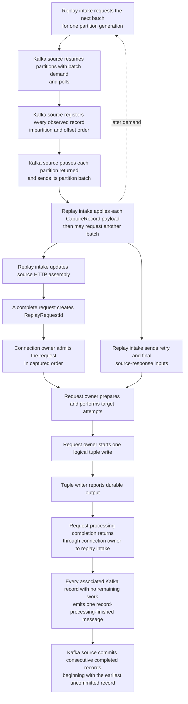

# Replayer Low-Level Design

**Status:** initial class and message design

**Date:** 2026-09-15

This document is the entry point for the replayer low-level design. It turns
[Replayer Processing and Commit Architecture](replayerProcessingAndCommitArchitecture.md) into
Java component boundaries, identities, messages, and completion paths.

The lower-level design is split so that each document remains reviewable:

- [Kafka Source and Replay Intake Low-Level Design](replayerKafkaSourceAndIntakeLowLevelDesign.md)
  defines Kafka polling, partition generations, record application, source HTTP assembly,
  heartbeat expiration, partition-batch requests, whole-record completion, commits, and partition
  cleanup.
- [Connection and Request Replay Low-Level Design](replayerConnectionAndRequestLowLevelDesign.md)
  defines target-connection ordering, request preparation, target attempts, retry decisions,
  source-response delivery, tuple output, and request cleanup.
- [Asynchronous Message-Passing Programming Guide](asyncMessagePassingProgrammingGuide.md) defines
  the reusable Java pattern for a typed asynchronous result that must reach another owner.

The top-level protocol remains authoritative for externally observable behavior. These documents
must not add another capture record, timestamp rule, retry policy, deduplication mechanism, or
Kafka-record disposition.

## 1. Shared terms

A **state owner** is the only component allowed to change one named group of mutable state. The
owner applies one input completely before it begins the next input to that state. Asynchronous
work started by the first input does not have to finish before the second input is applied.

An **owner input** is an immutable value delivered to the execution environment used by the owner:

- the dedicated Kafka thread for Kafka-source state;
- the dedicated replay-intake thread for source reconstruction and Kafka-record accounting; or
- one selected Netty event loop for one target-connection owner and all of its request-replay
  owners.

An **external operation** is work whose completion arrives later, such as a target HTTP attempt,
timer, target-concurrency permit acquisition, or tuple write. Its completion returns as another
typed owner input.

The design distinguishes these identities:

| Identity | Meaning |
| --- | --- |
| `PartitionGenerationId` | One process-local uninterrupted ownership period for one Kafka topic partition |
| `KafkaRecordId` | One Kafka offset within one `PartitionGenerationId` |
| `WriterPartitionId` | One protocol `writerNodeId` and the Kafka partition containing its records |
| `CapturedConnectionId` | Protocol identity `(writerNodeId, connectionId)` |
| `ConnectionProcessingId` | One process-local source-assembly and target-connection lifetime for a `CapturedConnectionId` |
| `ReplayRequestId` | One reconstituted request within a `ConnectionProcessingId` |

`ConnectionProcessingId` exists because heartbeat expiration can end one process-local connection
lifetime while target and tuple work from that lifetime continues. A later observation for the
same `CapturedConnectionId` may start a separate lifetime. The two lifetimes must never share
source accumulators, a target channel, a request registry, or completion messages.

None of these process-local identities is added to the capture protobuf.

## 2. Owners and execution environments

| Owner | Mutable state | Execution environment |
| --- | --- | --- |
| Kafka source | Kafka consumer, assignments, pause state, outstanding partition-batch requests, observed-record order, commit submission | Dedicated Kafka thread |
| Replay intake | Record decoding, source HTTP assembly, broker-time state, partition-batch demand, record-to-work associations | Dedicated replay-intake thread |
| Target connection | One target channel, ordered request and close queues, active target turn, request registry | One selected Netty event loop |
| Request replay | One request's preparation, attempts, retry state, source-response inputs, tuple, cleanup | Same Netty event loop as its target connection |

The Kafka source and replay intake exchange immutable messages through thread-safe queues. Only the
Kafka thread calls `KafkaConsumer`. Only the replay-intake thread changes replay-intake state.
Neither waits for the other to run arbitrary work.

Kafka input ordinarily flows one partition batch at a time. A new assignment adds one source-local
bootstrap entitlement, while replay intake may concurrently keep at most one
`RequestNextPartitionBatch` outstanding per partition generation; assignment can therefore produce
a bounded two-batch overshoot. The Kafka source resumes only partitions with bootstrap or explicit
demand; when one `poll()` returns records, it groups them by partition, pauses each partition
represented in the result before the next poll, and consumes one entitlement per
`PartitionRecordBatch`. Replay intake fully applies each batch in delivery order and recomputes
demand after every input. The
[Kafka Source and Replay Intake Low-Level Design](replayerKafkaSourceAndIntakeLowLevelDesign.md)
defines the mechanics.

The Kafka source may sit in a long `poll()` while every partition is paused, so submitting a
Kafka-source message also prompts the source through `KafkaConsumer.wakeup()`. The queue carries
the work; wakeup only asks the Kafka thread to inspect that queue. Wakeup is deferred while a
rebalance callback or another Kafka operation is running, then coalesced and issued when that
protected operation finishes.

`onPartitionsAssigned` pauses the complete resulting assignment before returning, because Kafka
does not preserve pause state across assignment changes. A wakeup issued after a revocation
callback may cause the surrounding poll to return before assignment is delivered. The next poll
continues that rebalance; the assignment callback is delayed, not lost.

A target-connection owner and its request-replay owners share one thread. Messages between them
are still typed and explicit so that completion and cleanup cannot hide in detached callbacks.

## 3. Main processing path



The path has two intentionally separate request results:

1. **Connection turn finished** — no more target attempts will use the connection for this request,
   so the next captured request may begin.
2. **Request processing finished** — request transformation, all sends and retries to the target
   server, final captured source-response handling, durable tuple output, and request cleanup have
   finished, so replay intake may release this request's Kafka-record associations.

The second result may occur much later than the first.

## 4. Required message properties

Every correctness-relevant cross-owner message:

- is immutable;
- carries the exact `PartitionGenerationId` to which it belongs;
- carries the applicable connection and request identities;
- has one declared receiving owner;
- has an explicit accepted or rejected result when the sender retains a resource or must take
  another action; and
- is either handled normally or causes the process-failure path. It is never silently dropped.

Expected outcomes use sealed interfaces or equivalent exhaustive value types. Correctness-critical
switches contain no default branch.

Unexpected throws, exceptional completion, owner-thread violations, rejected required submission,
and impossible state transitions are process-fatal. Recoverable target, tuple, expiration,
revocation, and retry outcomes are values, not exceptions.

## 5. Required completion paths

The implementation must make these paths visible in types:

```text
request admission
    -> accepted by connection owner
    -> request owner exists on the selected event loop

target turn
    -> sending and retrying the request against the target server finishes
    -> connection-turn completion reaches the connection owner
    -> ConnectionRequestFinished reaches replay intake

tuple path
    -> complete tuple submitted
    -> tuple writer retries until durable or cancellation
    -> tuple-durable reaches request owner
    -> request-processing completion reaches connection owner
    -> connection owner removes request
    -> request-processing completion reaches replay intake

record path
    -> replay intake applies every observation
    -> every record association finishes
    -> one record-processing-finished message reaches Kafka source
    -> Kafka source advances only across consecutive completed records beginning with the earliest uncommitted record
```

Normal completion of an inner asynchronous operation is not enough. The returned stage for a
required link completes only after the required receiving owner has accepted and handled the
result.

## 6. Cancellation model

Cancellation is scoped to one `PartitionGenerationId`.

`GracefulGenerationCancellation`:

- immediately cancels work that has not begun an external target operation;
- permits a request already sent to the target, and the tuple chain required by that request, to
  finish before the deadline; and
- permits a tuple write already in progress to finish before the deadline.

`ForceGenerationCancellation`:

- upgrades the same scope;
- causes every remaining owner to begin immediate local cancellation; and
- does not wait for all cleanup before `onPartitionsRevoked` returns.

Each owner later returns a typed cleanup result. Cleanup completion is not request-processing
completion and never authorizes Kafka commit. Replay intake reports the partition generation clean
only after every owned source object, connection object, request object, timer, permit, tuple
operation, and record tracker in that generation has reached its required cleanup state.

## 7. Data and reference lifetime

Kafka-record accounting never leaves replay intake. Downstream owners receive request data,
source-response data, and identities, but they do not receive authority to release a Kafka record.

Each lower-level interface that carries a reference-counted object must state:

- who owns the reference before submission;
- whether acceptance transfers that reference;
- who releases it after acceptance;
- who releases it after rejection; and
- which one-shot guard detects duplicate release.

The implementation must not rely on garbage collection for Netty buffer lifetime and must not use
a general implied-ownership convention.

## 8. Process-failure boundary

Every execution adapter reports its unexpected failure to one process supervisor. The supervisor:

- accepts only the first fatal signal;
- records the owner and operation that failed;
- stops further input where the failed owner is still able to respond;
- flushes high-severity diagnostics;
- begins the configured `System.exit` path; and
- uses the documented ten-minute watchdog and thread dump before `Runtime.halt`.

No replacement thread adopts mutable state from a failed owner.

## 9. Verification required across both LLDs

The combined implementation must prove:

- each mutable value has one named owner;
- every admitted request produces at most one connection-turn completion and at most one
  request-processing completion, and every normally completed request produces both;
- replay intake has at most one outstanding Kafka batch request for each partition generation;
- every delivered partition batch matches exactly one outstanding request and is applied before
  replay intake requests the next batch for that partition;
- replay intake requests another partition batch while fewer than `N` requests have resolved retry
  input and unfinished target turns;
- fast complete responses can satisfy retry-ready supply before `B + W`, while slow or missing
  responses keep demand open until complete or explicitly unavailable;
- a target-finished or cancelled request cannot be added back to retry-ready supply by later
  retry-input resolution;
- target-write start remains local cancellation state rather than a replay-intake message;
- a queued Kafka-source input wakes a long poll without interrupting rebalance callback work or
  another Kafka operation;
- no request-processing completion occurs before tuple durability;
- no record-processing-finished message occurs while the record has unfinished associated work;
- one record shared by several requests cannot finish after only one request;
- records contributing source-response bytes remain associated through tuple durability;
- an expired process-local connection lifetime and a later fresh lifetime cannot route messages to
  one another;
- cancellation cleanup cannot produce a commit request;
- a newer local generation of one partition waits for the previous local generation's cleanup;
- unrelated partitions continue;
- no hard record or byte limit can stop the reads needed to reach retry or heartbeat evidence; and
- every unexpected owner failure reaches the process supervisor.
