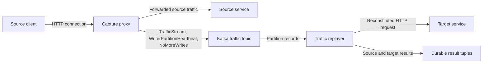
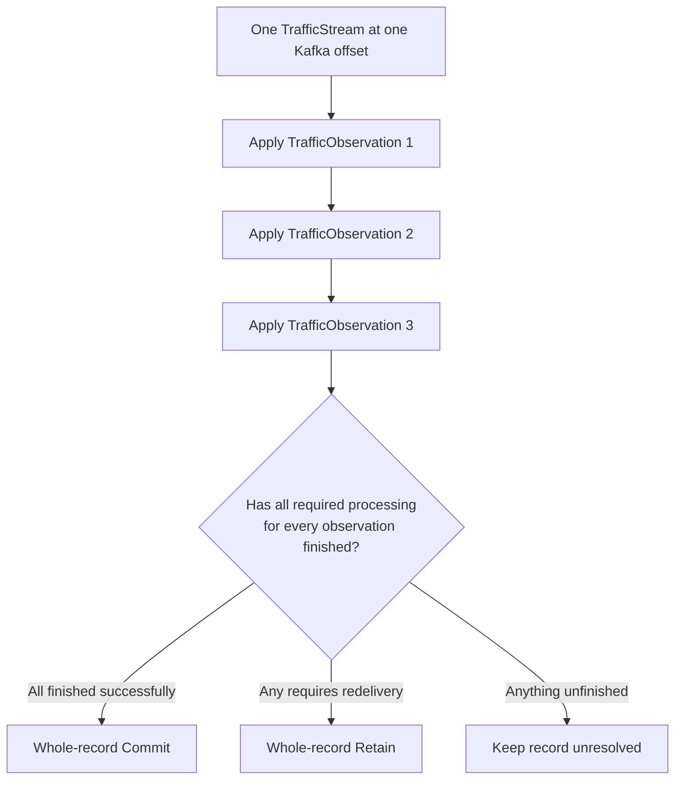
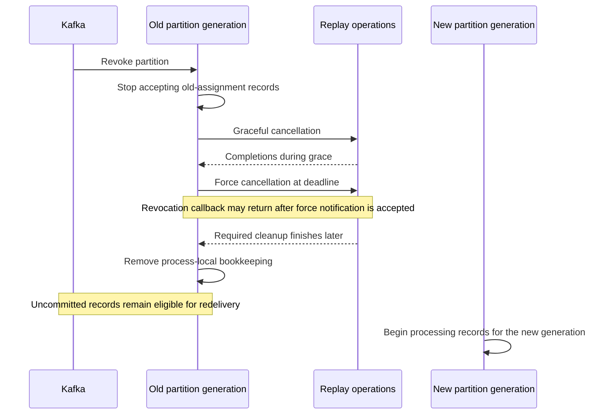

# Capture and Replay Architecture

**Status:** top-level design contract

This document defines the observable protocol shared by the capture proxy, Kafka, and the traffic
replayer. It states what each component guarantees, which failures are tolerated, when the replayer
may commit a Kafka record, and why the protocol is safe under its stated assumptions.

Companion documents provide the lower-level proxy algorithms, replayer behavior, replayer
asynchronous-work accounting, and managed-fleet orchestration. Implementation class names, thread
names, and callback graphs belong in those lower-level documents.

Capture and replay provides representative source traffic for target validation, load, and mutation
replay. It does not promise that two distributed clusters will produce identical internal execution
or responses for concurrent traffic. The protocol minimizes avoidable differences by preserving
captured request bytes, source-connection ordering, and replay timing where those requirements do
not conflict.

## 1. Scope and managed-fleet boundaries

The protocol in this document is complete for:

- routing newly opened source connections across a horizontally scaled proxy fleet;
- capturing source traffic into Kafka;
- preserving the connection-local order needed to reconstruct HTTP;
- detecting clean connection and proxy completion;
- handling proxy scale changes, shutdown, hard failure, and long inactivity;
- reconstructing requests and source responses;
- replaying requests against a target;
- requiring durable result-tuple output before committing Kafka records for a reconstituted
  request;
- committing or retaining whole Kafka records; and
- stopping safely during replayer rebalance, shutdown, or internal process failure.

HTTP/1.x pipelined requests are outside the settled protocol contract. In particular, this document
does not define behavior when one source connection has multiple outstanding requests or one
inbound read contains bytes from more than one request. Deployments cannot rely on capture or replay
correctness for those cases.

Managed-fleet recovery after an interval of uncaptured source traffic must satisfy:

1. Missing source traffic cannot be reconstructed later.
2. A replay run must never silently cross an uncaptured interval.
3. A new run after an uncaptured interval requires a fresh source snapshot.
4. The new run requires a durable Kafka input boundary fixed before proxies may publish captured
   traffic for that run.
5. Before the fresh snapshot is accepted, processes and source requests from the ended run must be
   proven unable to complete additional mutations against the source service.

The managed-fleet companion specifies session identity, the `FleetCaptureReset` boundary required
when a fresh run reuses a Kafka topic, and constraints on `CaptureCoverageEstablished`. Automated
same-resource recovery is unsupported. The source-specific proof that ended-run operations cannot
complete is deployment-defined and must satisfy the managed-fleet contract. No implementation may
claim automatic recovery until the companion document authorizes it.

## 2. System model



The **source** is the service receiving traffic during capture. The **target** is the service
receiving reconstructed requests during replay.

The proxy sits on the source traffic path. When source clients use TLS, the proxy terminates TLS and
captures the resulting decrypted HTTP traffic before forwarding it to the source. It publishes the
captured representation to Kafka.

The replayer reads Kafka partitions, reconstructs HTTP requests and source responses, sends each
reconstituted request to the target, and writes a durable tuple describing the source and target
results.

Kafka provides ordered records within each partition and assigns partitions to replayer group
members. Kafka does not provide ordering across partitions.

### 2.1 Identities

`captureActivationId` identifies one capture-authoritative lifetime of a proxy process.
`assignmentSequence` is a process-local, strictly increasing value. The proxy increments it when
Kafka supplies a replacement group assignment, before accepting any connection under that
assignment. The writer identity used for newly opened connections is:

```text
writerNodeId = captureActivationId + ":" + assignmentSequence
```

Every new assignment therefore creates a writer identity that cannot be reused within the
`captureActivationId`. Existing connections permanently retain the `writerNodeId` under which they
opened. Rapid rebalances may leave several older writer identities draining concurrently.

The out-of-group Kafka reachability probe runs before a consumer-group generation exists. Its
writer field is:

```text
writerNodeId = captureActivationId + ":PROBE"
```

`CaptureCapabilityProbe` confirms only that the proxy can publish to Kafka. It has no replay
meaning. If the replayer encounters one, it allows the Kafka record to become commit-eligible
without creating traffic, heartbeat, connection, writer-baseline, or expiration state.

`connectionId` is Netty's globally unique long-form channel identifier. The protocol requires
uniqueness only within one `writerNodeId`. The complete connection identity is:

```text
(writerNodeId, connectionId)
```

Every protocol decision about a connection, including expiration, terminal validation, and
metrics, uses the complete identity. A bare `connectionId` is never enough to identify a connection
across proxy writers.

Every source connection is assigned one Kafka partition when it opens. That mapping never changes
for the life of the connection:

```text
(writerNodeId, connectionId) -> Kafka partition
```

A proxy may publish connections to a partition, later drain all of them, and receive new-connection
eligibility for that partition in a future assignment. The future connections use the future
assignment's `writerNodeId`; the earlier identity never resumes. After `NoMoreWrites` retires a
`(writerNodeId, partition)`, that writer identity may never use that partition again.

Every local connection registry, publisher lane, broker-time baseline, and `NoMoreWrites` lifecycle
is keyed by `(writerNodeId, partition)`, not by one process-global current writer identity.

### 2.2 Protocol records

The protocol uses these records:

- `TrafficStream` contains one or more `TrafficObservation` values for one connection.
- `TrafficObservation` records captured network or connection-lifecycle activity. Each observation
  carries the connection-local sequence needed by this protocol.
- `WriterPartitionHeartbeat` periodically proves that one `(writerNodeId, partition)` can still
  publish acknowledged records. It identifies the writer and partition and carries no connection
  state. Its `heartbeatIntervalMillis` field reports the configured publication interval for
  diagnostics and future sanity checks; it does not configure replayer expiration.
- `NoMoreWrites` permanently states that one `writerNodeId` will publish no more records to one
  Kafka partition. Its Kafka record carries `writerNodeId` in a required header, and Kafka record
  metadata supplies the partition. Neither value is repeated in the protobuf body.

`TrafficStream`, `TrafficObservation`, `WriterPartitionHeartbeat`, and `NoMoreWrites` are fixed
protobuf names. The component documents define exact fields and the wire-compatibility plan; they
may not change the observable meanings defined here.

### 2.3 Imported capture archives

Bring-your-own captured traffic is supported only when the archive was produced by the same capture
protocol version that the replayer accepts. The archive is a versioned representation of Kafka
application records, not a file containing protobuf payloads alone.

[`BringYourOwnCapturedTraffic.md`](BringYourOwnCapturedTraffic.md) defines the archive and
orchestration details.

For every archived record, the exporter preserves:

- the source partition and offset;
- the original Kafka timestamp and timestamp type;
- the binary key and value, including null values;
- every Kafka header, preserving duplicate names and order; and
- the record's position within its source partition.

The archive also preserves the protocol/build version, source partition count, fixed exported
offset range for every partition, capture parameters `E` and `S`, and integrity information that
detects omitted, duplicated, reordered, or corrupted records. Export reads exactly the recorded
partition ranges. It does not use a timeout as an implicit successful end boundary.

Import creates one Kafka application record for every archived record, writes it to the archived
partition, preserves partition-local order, and restores its binary key, value, and headers.
Imported offsets and broker leader epochs are newly assigned Kafka transport identities; the
replayer uses the imported offsets for commit accounting. The original offsets remain archive
integrity and diagnostic data and do not participate in imported-topic commits.

The timestamp policy has two modes:

- **`preserve`**, the default, imports each archived original `LogAppendTime` as the record timestamp
  on a dedicated bring-your-own topic configured to preserve producer-supplied timestamps. The user
  asserts that the original broker clock-skew bound `S` was healthy. The replayer may apply the
  ordinary `E + S` expiration proof using the archived timestamp and archived `E` and `S`.
- **`rebase-without-expiration`**, an expert mode, accepts newly assigned import-broker timestamps
  and automatically disables broker-time expiration for that input. Terminal connection
  observations and valid `NoMoreWrites` records still resolve incomplete state.

No mode may use newly assigned import-broker time to perform the original capture run's `E + S`
expiration proof. An archive ending at an open writer or incomplete connection is not completion
evidence merely because the file ended.

## 3. Proxy group membership and connection routing

Kafka consumer-group membership is used only to load-balance newly opened source connections across
Kafka partitions. Membership state is not capture-health evidence and has no replay meaning.

The deployment uses a Kafka-provided assignment strategy supported by its selected consumer-group
protocol. The capture protocol does not require a custom assignor, subscription `userData`,
assignment metadata, member readiness state, minimum group size, or startup quorum. A built-in
sticky or cooperative strategy may reduce connection-routing churn, but neither property is
required for correctness.

Fleet capacity and startup policy are controller concerns, not group-assignment inputs. A managed
controller may require a configured number of proxies whose control-plane status reports
`captureReady=true` before routing source traffic, but that requirement is not carried through
Kafka membership or assignment metadata.

Before a proxy has received its first usable assignment, it has no partition on which it can publish
a new connection. The proxy completes its Kafka capability probes before joining the group. It may
begin accepting source connections only after:

- it has received its first assignment;
- it has proved that it can publish acknowledged records to Kafka; and
- the initial heartbeat required by §5 has been acknowledged for every partition it may use.

If startup fails before any assignment is received, or a source connection arrives while no first
usable assignment exists, the proxy follows the process-wide `--capture-failure-policy` defined in
§12.4. It does not later resume capture in that process after applying either terminal policy.

After the first usable assignment is installed, the proxy retains it until Kafka supplies a
replacement assignment. Revocation, partition-loss callbacks, failed or stale membership polling,
empty polls, delayed heartbeats, coordinator outages, and group departure do not close a capture or
connection-acceptance gate. The proxy continues assigning new connections with its last usable
assignment. Kafka may temporarily assign the same partition to another proxy after considering the
old member gone. That overlap affects load distribution only: each proxy uses a distinct
`writerNodeId`, so captured records remain unambiguous.

When Kafka supplies a replacement assignment, the proxy:

1. increments `assignmentSequence` and creates the replacement assignment's `writerNodeId`;
2. publishes and receives acknowledgement for that identity's initial heartbeats on every
   partition it may use;
3. begins assigning new source connections with the replacement assignment only after those
   acknowledgements; and
4. continues heartbeats and connection retirement independently for every older writer identity
   that still has connections.

Connections accepted before the replacement retain their original proxy, writer identity, and
Kafka partition. There is no membership-health deadline and no application retry or failure policy
driven by membership after startup.

The initial heartbeat establishes the new assignment-scoped writer identity's broker-time baseline
before that identity accepts a source connection. Later timely heartbeats update that same
continuous baseline; they never create a new writer lifetime or reset a lapsed identity.

After an older identity's connections on a partition drain, it publishes self `NoMoreWrites`,
permanently retiring that identity and partition.

Only a writer identity's own publisher emits `NoMoreWrites` for that writer and partition.
Heartbeats carry no connection inventory, and group stability does not authorize replay
settlement.

## 4. Capture-before-forward

For every request classified as Critical Mutation Traffic:

```text
If the source can apply the request,
then Kafka has already acknowledged every TrafficObservation
needed to reconstruct that complete request.
```

The converse is intentionally false. Kafka may contain a complete request that the proxy ultimately
does not send to the source.

Kafka must assign record timestamps using `LogAppendTime`. Workflow-managed capture topics set
`message.timestamp.type=LogAppendTime`; unmanaged deployments must configure the same topic
property. Before joining the proxy group, each Kafka capability probe supplies a producer timestamp
of zero and accepts the acknowledgement only when Kafka reports a positive record timestamp.
`LogAppendTime` replaces the supplied timestamp with broker time. A topic using `CreateTime` either
rejects the stale timestamp or reports it unchanged, so the proxy rejects startup in either case.

For each `(writerNodeId, partition)`, the proxy tracks
`lastAcceptedHeartbeatLogAppendTime`, initially established by the acknowledged initial heartbeat
required by §3.

The baseline is continuous for the lifetime of that writer identity and partition. Neither an empty
connection registry, inactivity, nor a later assignment resets it.

Heartbeats are published every 10 seconds by default. The default proxy heartbeat expiration
interval `E` is 30 seconds. The interval and `E` are configurable, but the heartbeat interval must
remain lower than `E`.

Each `WriterPartitionHeartbeat` reports the proxy's configured interval in
`heartbeatIntervalMillis`. This field is informational. The replayer uses its separately supplied
`E` and `S` configuration for expiration decisions.

The proxy and replayer must receive the same `E` and `S` values for one capture-and-replay run; `S`
is defined in §8. A managed orchestration layer supplies the agreed values to all participating
processes. In an unmanaged deployment, maintaining that agreement is an operator requirement. The
timestamp proof in §8 is invalid when the processes are configured with different values.

A subsequent heartbeat updates `lastAcceptedHeartbeatLogAppendTime` only when:

```text
heartbeatLogAppendTime - lastAcceptedHeartbeatLogAppendTime < E
```

If the difference is greater than or equal to `E`, the heartbeat is late. The proxy does not update
the baseline and irreversibly enters its compromised state. For one writer and partition, the proxy
does not submit a later heartbeat until the current heartbeat is acknowledged and accepted.
Therefore a proxy that observes a late heartbeat cannot publish a later heartbeat that appears to
restore freshness. This is a proxy invariant; the replayer does not add a separate sticky-lapse
state.

Separately from broker timestamps, the proxy maintains one local monotonic acknowledgement
deadline for each `(writerNodeId, partition)`. The initial deadline starts when the initial
heartbeat is submitted. Every accepted heartbeat renews the deadline for another `E`. If the
deadline expires before the required acknowledgement is processed, the process
irreversibly enters its compromised state. A later acknowledgement is ignored for capture
authority and cannot renew the deadline. This local deadline does not replace the `LogAppendTime`
checks above.

For every Critical Mutation Traffic request, the proxy enforces the guarantee in this order:

1. Capture the request observations.
2. Publish every observation required to reconstruct the complete request.
3. Wait for Kafka acknowledgement.
4. Read the Kafka `LogAppendTime` of the `TrafficStream` containing the observation that permits the
   request to take effect.
5. Compare that time with `lastAcceptedHeartbeatLogAppendTime`.
6. Continue only when the difference is less than `E`.
7. Only then submit the source traffic that permits the request to take effect.
8. Otherwise, irreversibly enter the compromised state and apply `--capture-failure-policy`.
   `fail-closed` does not forward the request and closes the connection as the process terminates.
   Unmanaged `fail-open` forwards the waiting request without authoritative capture and leaves the
   connection open in permanent pass-through mode. Managed `fail-open` blocks that source-bound
   forwarding until the controller durably records incomplete capture and acknowledges that exact
   activation.

The comparison and forwarding decision share a one-way local state transition. Once the proxy is
compromised, no request may newly pass this check and forward Critical Mutation Traffic as captured.
The proxy immediately applies `--capture-failure-policy`: `fail-closed` terminates without orderly
retirement, while `fail-open` permanently abandons capture. Unmanaged fail-open switches existing
and new TCP connections to uncaptured forwarding immediately. Managed fail-open first waits for the
controller acknowledgement above. Neither policy permits capture-authoritative operation to resume
in that process.

This proof assumes that the source cannot mutate state before receiving the complete request.
Deployments whose source handlers apply mutations while an incomplete request body is still
arriving require full request buffering or another separately specified protocol.

The broker timestamp is not used to order HTTP observations. Connection-local
`connectionObservationSequence` supplies that order. Kafka `LogAppendTime` supplies only the
capture-before-forward and broker-time expiration proofs.

### 4.1 Denial-of-service bounds for incomplete requests

The proxy places hard bounds on incomplete requests so that a client cannot retain unbounded proxy
or replayer state by sending one byte at a time.

At minimum, the proxy enforces:

- an absolute maximum request-assembly duration measured from the first request byte and never reset
  by later progress; and
- bounded request and header bytes while the request remains incomplete.

The proxy also enforces a separately configurable maximum lifetime for the client connection,
defaulting to 60 minutes. This limit bounds how long one connection can delay a planned proxy
connection-set drain even when its requests individually remain within the request-assembly limits.
A deployment may explicitly configure a different lifetime when required.

The two time limits are independent:

- the connection-lifetime timer starts when Netty accepts the connection and closes the connection
  when that lifetime expires; and
- the request-assembly timer starts with the first byte of each request and protects incomplete
  HTTP assembly.

When either bound is exceeded, the proxy stops forwarding that request, closes the affected
connection, and publishes the terminal connection `TrafficObservation` after all earlier
observations for the connection. An incomplete Critical Mutation Traffic request never receives the
source traffic that would permit it to take effect.

These are proxy denial-of-service limits. They are distinct from replayer expiration after missed
writer-partition heartbeats.

## 5. Writer-partition heartbeats

For every `(writerNodeId, partition)`, the proxy publishes one atomic
`WriterPartitionHeartbeat` at the configured interval. The record contains no connection
identities. It states only that this writer identity can still publish acknowledged records to this
partition within the protocol's time bound.

The proxy still maintains an exact local connection registry. That registry is required to route
existing connections, wait for connection retirement, prove that the registry is empty before
`NoMoreWrites`, and retain older writer identities while their connections close. The registry is
not transmitted to Kafka.

A heartbeat does not open, close, list, omit, or permanently retire a connection. Normal connection
completion is represented by the connection's durable terminal `TrafficObservation`. Failure to
publish that terminal observation compromises capture; the replayer does not use a second
proxy-authored connection list to repair that proxy failure.

The proxy publishes:

- an initial heartbeat on every usable partition before accepting a source connection under a new
  writer identity;
- periodic heartbeats while that writer identity is current or still has retiring connections.

Each `WriterPartitionHeartbeat` is one Kafka record, so there is no chunk assembly, partial-list
state, heartbeat sequence, or connection-membership interpretation. Kafka offset orders
heartbeats within the partition. Kafka `LogAppendTime` supplies the authoritative time used by
§§4 and 8.

Kafka acknowledgement means that all in-sync replicas required by the topic's durability policy
have accepted the record. The producer must preserve submission order across retries and prevent a
retry from creating a conflicting duplicate. These are protocol requirements, not optional tuning.

Within one connection, the proxy assigns a contiguous `connectionObservationSequence` and submits
`TrafficObservation` values to Kafka in that order. Kafka preserves that connection-local order
across its records. Other connections and heartbeats may be published concurrently and interleave
in the partition; the replayer never needs to reorder one connection's observations.

### 5.1 Producer ownership

The protocol permits one Kafka producer and one publisher lane for all partitions.
The lane orders that producer's submissions and callbacks. Scaling that publisher is safe only
when, for each `(writerNodeId, partition)`:

- exactly one producer and publisher-lane owner publishes its heartbeats and observations in one
  submission order;
- ownership never overlaps; and
- a handoff waits for every submission and callback from the previous owner to finish before the
  next owner begins.

Different proxy writers may concurrently publish existing connections to the same Kafka partition.
The single-owner requirement is within one writer and partition.

This preserves one submission order for that writer's connection observations, heartbeats, and
`NoMoreWrites`. Non-overlapping ownership and a fully drained handoff prevent a previous producer
from publishing a late record after its successor begins.

## 6. Connection opening and retirement

### 6.1 Opening

The proxy adds a newly opened connection to its local registry before accepting its first
`TrafficObservation` for publication. The connection permanently retains its selected
`writerNodeId` and partition.

### 6.2 Clean connection retirement

Connection retirement follows this order:

1. Netty reports that the connection closed because of remote closure, local closure, or channel
   failure.
2. The kernel and Netty provide no further network traffic for that connection.
3. The connection's event-loop owner submits its terminal `TrafficObservation` after every earlier
   observation in that connection's publication order.
4. The event-loop owner waits for Kafka to acknowledge the terminal observation and every earlier
   `TrafficObservation` for that connection.
5. Only after those acknowledgements does the event-loop owner remove the connection from the
   local connection registry.

If an acknowledgement fails or its outcome is ambiguous, the proxy does not publish an
authoritative completion for that connection. The proxy closes capture and follows its configured
failure behavior. Heartbeats stop because the process is compromised; they never substitute for
the missing close.

The terminal `TrafficObservation` establishes a replayer validation cutoff:

> After the replayer processes a connection's terminal `TrafficObservation`, any subsequent
> `TrafficObservation` for the same `(writerNodeId, connectionId)` is a protocol violation and
> causes the containing Kafka record to be retained, high-severity diagnostics and an alarm, and
> termination of the replayer process.

This is a replayer validation rule, not Kafka producer fencing.

A terminal connection `TrafficObservation` unambiguously states that Netty has ended that
connection. The lower-level protocol maps remote closure, local closure, and channel failure to the
corresponding protobuf observation. When the replayer processes it, the replayer:

- expires the connection's current incomplete request assembly;
- marks an incomplete source response as expired;
- allows an already-started target transaction to reach its normal outcome;
- requires durable tuple output for every request that was reconstituted;
- requires no tuple when no request was reconstituted; and
- makes the affected Kafka records eligible for commit after all associated processing finishes.

## 7. `NoMoreWrites` and writer-partition retirement

`NoMoreWrites` permanently retires one `(writerNodeId, partition)`. The required Kafka record
header identifies the writer, and Kafka record metadata identifies the partition. A correctly
wired proxy publishes `NoMoreWrites` only for itself.

Before publishing `NoMoreWrites`, the proxy:

1. stops accepting new connections using the routing and acceptance gate;
2. disconnects and fully retires existing connections, including Kafka acknowledgement of every
   terminal observation and every preceding observation;
3. verifies that the local connection registry is empty;
4. moves the publisher lane to `RETIRING` and quiesces periodic heartbeats;
5. waits for every remaining previously accepted send;
6. publishes and receives acknowledgement for `NoMoreWrites`; and
7. moves the publisher lane to `RETIRED`.

The Kafka offset occupied by `NoMoreWrites` is the terminal cutoff. It supplies the terminal
outcome for remaining incomplete state already known for that writer and partition. Each affected
whole Kafka record becomes eligible for commit only after every other operation associated with
that record has also finished. An exact duplicate `NoMoreWrites` is inert and eligible for commit.

The replayer treats the required header as the authoritative writer identity. If the header is
missing or malformed, the replayer logs a warning, treats the `NoMoreWrites` record as inert, and
permits its commit. It does not retire any writer or connection state.

No `TrafficStream` or `WriterPartitionHeartbeat` record may appear at a Kafka offset above the
valid `NoMoreWrites` cutoff for that `(writerNodeId, partition)`. Such a record is a protocol
violation that causes retain, high-severity diagnostics and an alarm, and termination of the
replayer process.

A hard crash may emit no `NoMoreWrites`. Group departure does not replace it.

Unexpected death of any proxy event loop terminates the proxy process. The process is considered
unstable, and no cross-thread recovery transfers ownership of its connections or publication state.
Logging, metrics, and cleanup are best effort; process termination must not wait for orderly local
recovery.

## 8. Broker-time expiration of known connection state

Each `WriterPartitionHeartbeat` is a periodic statement that one `(writerNodeId, partition)` can
still publish acknowledged records within the capture deadline. It keeps every incomplete
accumulator already known for that writer and partition from expiring merely because an individual
connection is idle. It does not enumerate those connections.

The replayer tracks `lastAcceptedHeartbeatLogAppendTime` for each writer and partition. A heartbeat
updates the value only when the difference from the previous accepted value is less than `E`. The
proxy invariant in §4 guarantees that after it acknowledges a late heartbeat it publishes no
subsequent heartbeat for that compromised process. The replayer does not maintain an additional
sticky-lapse state.

Let:

- `E` be the heartbeat expiration interval configured identically in the proxy and replayer;
- `S` be the maximum permitted backward movement between Kafka `LogAppendTime` values at increasing
  offsets in one partition and configured identically in the proxy, replayer, and fleet clock
  monitor;
- `M` be a writer and partition's `lastAcceptedHeartbeatLogAppendTime`; and
- `R` be the `LogAppendTime` of any later record at a higher offset in that partition, regardless of
  which proxy wrote it.

The replayer may expire the incomplete connection state that it already knows for that writer and
partition when:

```text
R - M >= E + S
```

Suppose a later observation from the expired writer has broker timestamp `O`. The clock-skew bound
requires:

```text
O >= R - S
```

Therefore:

```text
O - M >= E
```

The proxy's forwarding rule in §4 rejects that observation and enters the compromised state before
the corresponding Critical Mutation Traffic can reach the source. It is therefore safe for the
replayer to release the incomplete state known at offset R.

### 8.1 Restart when the preceding heartbeat is before the committed cursor

A replayer may restart at an uncommitted `TrafficObservation` after the heartbeat that authorized
the proxy to publish it has already been committed. The replayer does not need to scan backward or
retain process-local heartbeat state across that restart.

Let:

- `T` be the `LogAppendTime` of the first `TrafficObservation` encountered for that writer and
  partition after the restart; and
- `H` be the latest accepted heartbeat before `T`, which is in the already committed prefix.

The proxy could not have accepted the connection without an earlier acknowledged heartbeat. Since
`T` is at a higher Kafka offset than `H`, the skew bound guarantees:

```text
H <= T + S
```

The replayer therefore conservatively treats `T + S` as the latest possible unseen heartbeat time.
It may expire the already-known incomplete state when:

```text
R - (T + S) >= E + S
```

which is equivalent to:

```text
R - T >= E + 2S
```

This fallback can expire later than the exact-heartbeat rule but never earlier. Any accepted
heartbeat encountered after `T` replaces the fallback with its exact `LogAppendTime` and restores
the ordinary `E + S` rule. The replayer must inspect every partition offset from `T` through `R`;
it may not skip an intervening heartbeat or a `TrafficObservation` that contributes to the
incomplete state.

Expiration:

- ends each currently known incomplete request accumulator for that writer and partition;
- marks each currently known incomplete source-response accumulator as expired;
- ends the current process-local reconstruction for each affected connection;
- allows a target HTTP transaction already in progress to continue;
- still requires a durable tuple for every request that was reconstituted; and
- requires no tuple when no request was reconstituted.

Expiration releases only those known accumulators and closes only their current process-local
reconstruction. It does not retire the writer, partition, connection identity, or future
reconstruction state. Any already-created target actor finishes its admitted complete requests and
tuple output, closes its target channel, and is then removed. The first later
`TrafficObservation` for that connection is handled exactly as it would be after a replayer restart
whose cursor begins at that observation: it creates fresh initialized state and never enters the
expired reconstruction. If those later observations form a complete request, the request replays
normally. If they remain incomplete and no accepted heartbeat refreshes them, a later broker-time
horizon expires them independently. This is consistent with the accepted possibility that Kafka
contains a complete request that the proxy did not send to the source.

An explicit terminal connection observation is different. It permanently ends that connection
identity, and every later `TrafficObservation` for it is a protocol violation.

Expiration is the required final outcome for the affected accumulators. The replayer commits the
Kafka records holding those observations after every other independent operation associated with
each whole record has also finished. Leaving an expired accumulator's records permanently
uncommitted would create a poison pill.

Kafka backlog does not itself cause expiration because the rule uses durable broker timestamps
rather than consumer wall-clock time. If the declared `S` bound is violated or the fleet cannot
attest that it is healthy, the timestamp proof is unavailable. The replayer stops making affected
expiration decisions, retains the unresolved records, and raises a high-severity alarm. Ordinary
record processing that does not depend on this timestamp proof may continue.

## 9. Replayer processing and whole-record commit

One `TrafficStream` may contain several ordered `TrafficObservation` values.

For the replayer, it can only commit the whole record.

The replayer processes each observation in the record's order while tracking that the observations
belong to one indivisible Kafka record. It does not wait to validate the future semantic effect of
every later observation before processing an earlier valid observation:



Applying the observations in order does not require waiting for asynchronous target, source-response,
or tuple work started by one observation to finish before applying the next observation. Those
operations may overlap, but the observations that create or update them are applied in Kafka order.

`Commit` and `Retain` describe only whole Kafka records:

- `Commit` means the replayer may advance the Kafka partition's committed offset past the record.
- `Retain` means the replayer deliberately leaves the record uncommitted and eligible for
  redelivery.

Processing associated with an observation can include:

- incomplete HTTP request assembly;
- a reconstituted request sent to the target;
- source-response assembly;
- durable tuple output;
- connection expiration or terminal validation; and
- cleanup of resources created by those operations.

When a terminal observation or broker-time expiration ends an incomplete request or source-response
accumulator, the replayer does not finish independent processing merely because the supporting
Kafka record remains uncommitted, and it does not complete or cancel a target HTTP transaction
already running for a reconstituted request.

A record becomes eligible for `Commit` only after every required operation associated with all of
its observations has reached its required final state. If any operation requires redelivery, the
whole record is `Retain`, even when other observations in the same record finished successfully.

Every `TrafficStream` whose observations contribute to one or more reconstituted requests remains
unresolved until every required tuple for those requests is durable. An observation belonging only
to an incomplete request that expires without producing a reconstituted request needs no tuple and
finishes through the expiration rule in §8.

A later invalid observation does not retroactively undo a target request already sent from earlier
valid observations. The invalid containing record is retained and replay halts according to §13.

`WriterPartitionHeartbeat` records finish after the replayer updates the writer-partition
broker-time baseline. A valid `NoMoreWrites` record finishes after its terminal effect in §7 has
been applied. These control records are whole Kafka records and follow the same contiguous-offset
commit rule.

Retaining one record prevents the replayer from committing a later Kafka offset past it. This
preserves redelivery of the retained record.

## 10. Target replay and durable tuples

When the replayer recognizes a complete captured request, it may begin the target HTTP transaction
without waiting for the captured source response or connection closure.

For a positive configured `speedupFactor`, the nominal replay time is:

```text
replayStart + (sourceObservationTime - firstSourceObservationTime) / speedupFactor
```

Requests captured on the same source connection retain their captured order. That ordering takes
priority over exact pacing: if the target is slower than the source, later requests on that
connection wait rather than overtake the request ahead of them. Independent source connections may
continue concurrently. The replayer reuses the corresponding target connection across requests
while its unchanged target-connection policy permits that connection to remain open.

The target result and captured source response may finish in either order.

Before the Kafka records supporting a reconstituted request may be committed, the replayer writes a
durable tuple for that request. The tuple records the available source and target outcomes,
including a source response that is complete or expired.

The Kafka processing associated with that request cannot finish until:

- the target operation has reached the outcome required by replay policy;
- the source response has become complete, expired, or otherwise reached its defined final state;
- the tuple has been written durably; and
- all resources owned by those operations have been released.

A terminal connection observation or broker-time expiration may finalize the source-response side
as expired. Neither erases the request, cancels the target transaction, or waives durable tuple
output.
A missing or expired source response does not prove that the source mutation failed; the tuple must
represent the source-response outcome without inferring an unobserved source result.

The system is at-least-once. A process may crash after sending the target request or writing the
tuple but before committing Kafka. Redelivery may therefore send the target request again and write
a duplicate tuple. This protocol accepts those duplicates and introduces no deduplication
mechanism.

## 11. Replayer partition reassignment

Kafka assigns partitions to replayer group members. Records themselves are not assigned; a
replayer polls records from its currently assigned partitions.

For one partition, a **partition generation** is one uninterrupted period during which the replayer
owns that partition. The replayer has one configurable cancellation grace interval, with a
five-second default. It may be lowered, including to one second, but must remain safely below the
Kafka poll interval.

When Kafka revokes the partition, the replayer:

1. stops accepting additional records from the revoked partition generation;
2. sends replay intake a graceful-cancellation notification for that partition generation;
3. immediately cancels work that has not started an external target or tuple operation;
4. allows already-sent target requests and already-started tuple output to finish during the grace
   interval;
5. processes resulting completion and commit requests while it waits;
6. at the grace deadline, sends replay intake a force-cancellation notification;
7. returns from `onPartitionsRevoked` after replay intake accepts that notification, without
   waiting for every forced cleanup to finish;
8. treats cancelled Kafka work as requiring redelivery rather than as successful processing; and
9. does not process records from a newer generation of that partition until the old generation's
   in-process work and cleanup are finished.

The completion rule is:

> After every record and operation from the revoked partition generation reaches its required final
> state, the replayer removes that generation's process-local bookkeeping. Kafka records that have
> not been committed are implicitly retained and remain eligible for redelivery by a future
> partition generation.

A commit rejected because the replayer no longer owns the partition is not retried under the old
generation. If ownership is lost while a previously submitted commit has an unknown broker outcome,
the replayer records the attempt as `ownership lost; broker outcome unknown`. It neither retries
the commit nor waits indefinitely for its callback. It cleans up the old assignment's process-local
state and lets Kafka's next assigned offset determine whether redelivery occurs. A late callback is
ignored except for logging and metrics.

Partitions are independent. A partition with no unfinished prior generation may begin processing
immediately even while another partition is still cleaning up its revoked generation.



No timeout permits the replayer to discard old in-process state and continue as though cleanup
succeeded. A timeout may terminate the process.

## 12. Process failure and shutdown

### 12.1 Replayer event-loop death

Unexpected death of a replayer event loop terminates the replayer process.

The process is unstable because the sole owner of mutable connection, target, timer, and replay
state no longer exists. The system does not transfer that ownership to another thread or construct
successful completion from partial cleanup.

After fatal event-loop death is detected, the replayer emits a best-effort
`replayFatalFailures{reason=event_loop_terminated}` metric and an ERROR diagnostic, synchronously
flushes Log4j and standard error, and invokes `System.exit(80)` so bounded shutdown hooks can flush
additional diagnostics. An independent watchdog allows up to ten minutes for process exit. If exit
does not finish, the watchdog writes a thread dump directly to standard error, flushes standard
error, and invokes `Runtime.halt(80)`. Metric export is not guaranteed before termination. Exit
code `80` is reserved for fatal event-loop-owner loss.

The replayer does not wait for cleanup, completion, or Kafka commit coordination owned by the
failed event loop. Shutdown hooks may close independent process resources, but they do not
manufacture successful replay completion. Any concurrent external operation may or may not
complete. Kafka's committed offset determines the durable outcome after restart.

Correctness relies on Kafka redelivering records whose offsets were not committed, just as it would
after an out-of-memory failure or hard process kill.

### 12.2 Normal replayer shutdown

Normal shutdown is ordered:

1. stop accepting new Kafka records;
2. send the same graceful-cancellation notification used for revocation;
3. immediately cancel work that has not started an external target or tuple operation;
4. allow already-started work the configured cancellation grace interval;
5. complete Kafka commits that become valid while the partition is still owned;
6. send force cancellation when the grace interval expires;
7. mark unfinished whole records for redelivery;
8. wait for process-local cleanup and resource release; and
9. close Kafka, tuple output, transformation resources, and event loops.

Cancellation never causes a Kafka commit.

### 12.3 Orderly proxy shutdown

An orderly shutdown is a planned operation performed while capture and Kafka publication remain
trustworthy. Its normative timing and failure behavior are defined in
[Proxy Capture Protocol §3.5](proxyCaptureProtocol.md#35-scale-down). Connection and
writer-retirement ordering remain defined in §§6–7 of this document.

### 12.4 Proxy capture failure modes

An unexpected proxy event-loop death, an out-of-memory-like failure, or corrupted internal
ownership always terminates the process immediately.

The first of the following events closes the proxy's one-way capture state and applies
`--capture-failure-policy` to the whole process:

- any Kafka failure, timeout, or ambiguous result exposed to the application;
- expiration of a heartbeat acknowledgement deadline `E`; or
- any other event proving that capture can no longer be trusted.

That transition atomically closes every capture-authoritative gate and notifies the acceptor,
connections, heartbeat scheduler, and publisher lane. A later Kafka acknowledgement cannot restore
capture. Previously acknowledged traffic remains valid; the transition does not retroactively
invalidate it.

- `fail-closed` emits high-severity diagnostics and terminates immediately. It does not attempt
  connection or writer retirement because Kafka acknowledgements are no longer trustworthy.
- `fail-open` permanently abandons capture. In an unmanaged deployment it makes the configured
  one-way transition to process-wide pass-through. In a controller-managed deployment, the proxy
  first enters a compromised state in which no new source-bound traffic is forwarded. The
  controller must durably record incomplete capture for that exact activation and acknowledge the
  compromise before existing or new TCP connections may forward without capture. If that
  acknowledgement is not received within the configured finite deadline, the proxy terminates
  instead. Once pass-through begins, the process emits a persistent high-severity capture-gap alarm
  and never returns to capture.

The Kafka client may retry internally before exposing an outcome. After a failure, timeout, or
ambiguous result is exposed to the proxy, the proxy does not resubmit the record at the application
layer. Capture authority never resumes in that process. Membership polling and rebalance events are
not capture failures after startup and never invoke this policy.

A suspended proxy that resumes after its acknowledged heartbeat has become stale cannot forward new
Critical Mutation Traffic as captured; the capture-health check in §4 applies the configured
process-wide policy before those source bytes are submitted.

## 13. Protocol violations

The following are protocol violations:

- a `TrafficObservation` after the terminal observation for the same connection identity;
- a `TrafficStream` or `WriterPartitionHeartbeat` record after `NoMoreWrites` for the same writer
  and partition;
- a connection-local observation sequence that regresses, conflicts, or has an unexplained gap;
- malformed input for which the replayer cannot determine the required processing safely.

The explicitly inert cases are an exact duplicate `NoMoreWrites` and a `NoMoreWrites` record with a
missing or malformed writer header as specified in §7. For other protocol violations, the replayer
response is:

1. immediately mark the whole Kafka record `Retain`, making it permanently ineligible for commit
   in this process;
2. block Kafka commits at that offset and pause Kafka intake;
3. emit a high-severity log and metric containing the available writer, connection, partition, and
   offset identities; and
4. raise an operator-visible alarm;
5. perform a bounded drain of target replay and tuple work that was already admitted; and
6. terminate the replayer process.

The bounded drain allows 60 seconds for already-started side effects to complete and release their
resources. It does not decide the record disposition: `Retain` was already selected by the
violation. If admitted work does not finish within the bound, the replayer terminates without
waiting longer.

There is no keep-running mode for a protocol violation. The poison record remains uncommitted and
eligible for redelivery. The replayer must not guess, silently discard required work, or turn an
unknown case into a commit.

Failures indicating that the process itself is unstable—including event-loop death, an OOM-like
failure, or corrupted internal ownership—do not use this bounded protocol-violation drain. They
terminate the process immediately, leaving every uncommitted record eligible for redelivery.

## 14. Safety arguments

### 14.1 A source mutation is replayable

For Critical Mutation Traffic, the proxy waits for acknowledgement of the complete request
representation before allowing the request to take effect at the source. Therefore a source
mutation cannot be absent from Kafka merely because the proxy failed immediately afterward.

This argument depends on the source not mutating from an incomplete request body.

### 14.2 Clean connection retirement cannot hide valid earlier traffic

The proxy submits a connection's terminal observation after every earlier observation in that
connection's publication order. It removes the connection from its local registry only after Kafka
acknowledges the terminal observation and every earlier observation. A successful clean retirement
therefore cannot omit an earlier valid observation.

### 14.3 Heartbeats cannot complete or retire a connection

`WriterPartitionHeartbeat` contains no connection identities and causes no per-connection state
transition. It can refresh only the writer-partition broker-time baseline. A connection ends
normally only through its terminal observation; missed heartbeats may expire only incomplete
accumulators already known to the replayer.

### 14.4 Mixed records cannot be partially committed

The replayer may process observations independently, but it waits for every observation and
associated operation before deciding the whole record. Kafka's indivisible offset is therefore
preserved even when one record contributes to several asynchronous operations.

### 14.5 Source-response expiration does not lose a replay result

Every reconstituted request still produces a durable tuple. Expiration changes the source-response
status recorded in that tuple; it does not erase the request or waive target and tuple processing.

An incomplete request that never became a reconstituted request requires no tuple. Expiration still
finishes its observation processing and permits its Kafka records to commit, preventing a permanent
poison pill.

### 14.6 Reassignment cannot commit cancelled work

Partition revocation stops new old-assignment intake before graceful cancellation. Work completed
during the grace interval may commit. Cancelled work does not authorize commit. At the deadline,
the callback waits only until replay intake accepts force cancellation; cleanup may finish later.
The replayer removes process-local state only after old operations reach their required final
states, and any uncommitted records remain available to a later partition assignment.

### 14.7 Broker-time expiration cannot hide a later source mutation

At a qualifying later offset, the skew-adjusted broker-time inequality proves that every
subsequently appended observation from the silent writer is at or beyond the proxy's rejection
threshold. The proxy therefore cannot use it to forward Critical Mutation Traffic. Releasing only
the replayer's currently known incomplete accumulators cannot hide a future source mutation.

The expiration does not retire the writer or partition. A future first observation creates fresh
state. Legitimate newly opened connections after rebalance use the new assignment's
`writerNodeId`; older identities continue only their already-open connections until
`NoMoreWrites`.

### 14.8 Hard failure is conservative

A hard proxy crash may leave incomplete connection state until a later partition record establishes
the broker-time horizon in §8. A completely quiet partition has no such evidence and remains
unresolved. A hard replayer crash leaves uncommitted Kafka records eligible for redelivery. Neither
component manufactures successful completion from consumer wall-clock silence.

### 14.9 Restart without the preceding heartbeat is conservative

When the exact preceding heartbeat is before the committed cursor, the first observation's
`LogAppendTime` plus `S` is an upper bound on that unseen heartbeat. Waiting for `E + S` beyond that
upper bound produces the `E + 2S` rule in §8.1. The fallback may delay expiration but cannot
authorize it earlier than the exact-heartbeat proof.

## 15. Verification requirements

Every guarantee above requires deterministic tests and, where Kafka behavior is involved,
real-Kafka tests.

| Guarantee | Deterministic tests | Real-system tests |
|---|---|---|
| Capability probe is inert | `writerNodeId = captureActivationId + ":PROBE"` never creates writer, heartbeat baseline, connection, or replay state | Testcontainers probes before first group generation |
| Group membership only load-balances new connections | A Kafka-provided assignor requires no custom metadata or startup quorum; managed capacity comes from control-plane `captureReady` status; startup requires a first usable assignment; the last usable assignment remains active through revocation, loss, and polling failure; replacement assignments create new writer identities; existing connections keep their identity | Testcontainers Kafka-default assignment, coordinator outage, revocation/loss callbacks, overlapping stale and replacement assignments, and live proxy scale-up and scale-down |
| Capture-before-forward | Initial heartbeat baseline; heartbeat and observation `LogAppendTime`; irreversible compromise | Kafka delay, timestamp, and failure injection; live source verification |
| Incomplete-request denial-of-service limits | Absolute duration is not reset by progress; request/header limits close the connection; whole connections default to a 60-minute maximum lifetime | Slow one-byte-at-a-time request, oversized-header, and maximum-connection-lifetime tests |
| Connection-local ordering | Sequence assignment and publication remain ordered while other connections run concurrently | Testcontainers interleaving across connections while the replayer applies each partition in Kafka order |
| Heartbeat semantics | Initial and periodic heartbeats carry no connection identities; `heartbeatIntervalMillis` is informational; an idle connection remains live while its writer heartbeat is timely | Testcontainers heartbeat delay, writer silence, differing informational interval values, and multi-writer partition progress |
| Clean connection retirement | Terminal observation is last; removal waits for acknowledgements | Producer retry and ambiguous-send tests |
| Multi-observation `TrafficStream` | Separate observation processing; whole-record commit only after all finish | Testcontainers redelivery of an uncommitted multi-observation record |
| Connection expiration | Agreed `E` and `S`; exact-heartbeat `E + S`; restart fallback `E + 2S`; expire only known accumulators; future first observations start fresh; skew-bound failure retains | Testcontainers restart after the preceding heartbeat was committed, multi-writer partition progress, leadership changes, configuration agreement, and delayed observations |
| `NoMoreWrites` | Prior sends are acknowledged first; writer identity comes from the required header and partition from Kafka record metadata; duplicates and records with missing or malformed writer headers are inert | Testcontainers terminal ordering, duplicate delivery, record-partition routing, and header validation |
| Replayer reassignment | Cancel and clean one partition generation before processing its successor; unrelated partitions proceed | Testcontainers partition transfer during target and tuple operations |
| Event-loop death | Fatal signal and no ownership transfer | Process-level fault injection; live container restart |
| Process-wide capture failure policy | Required Kafka publication failure or capture compromise causes immediate `fail-closed` termination or irreversible `fail-open`; managed fail-open forwards no uncaptured source traffic until the controller durably records incomplete capture and acknowledges that exact activation; membership events do neither after startup | Producer failure and ambiguous-outcome fault injection in both modes, lost and duplicate compromise notifications, controller failover before and after durable recording, and acknowledgement timeout |
| Protocol violations | Immediate `Retain`, intake pause, bounded drain of admitted target/tuple work, and process termination | Corrupt and out-of-order Kafka records with in-flight target and tuple work; redelivery after exit |
| Bring-your-own archive fidelity | Version, partition ranges, binary key/value, ordered headers, source offsets, original timestamps, `E`, `S`, checksums, and timestamp mode | Export/import round trip with heartbeats, `NoMoreWrites` headers, multi-observation records, multiple partitions, corruption, and missing-record injection |

The full acceptance suite must also prove:

- a connection may remain idle across many heartbeats without expiration;
- a proxy may stop using a partition for a long time and later place a newly opened connection on
  it under the last usable assignment's `writerNodeId`;
- heartbeats never enumerate, omit, complete, or reopen a connection;
- a clean close is sufficient to finish connection state without a later heartbeat;
- an incomplete request expires and commits without requiring a tuple;
- a source response expiring before or after target completion still requires durable tuple output;
- expiration ends only the current process-local reconstruction; later observations for that
  connection start fresh state, while observations after an explicit terminal connection
  observation are protocol violations;
- a writer may drain a partition, remain silent, and later create fresh connection state there after
  rebalance under a new assignment-scoped `writerNodeId` without reviving an expired accumulator;
- a late heartbeat irreversibly compromises the proxy, and one heartbeat must be acknowledged and
  accepted before the next is submitted;
- rapid rebalances may leave several `(writerNodeId, partition)` registries and publisher lanes
  draining independently;
- a record from another writer can establish `E + S` progress for a silent writer on the same
  partition;
- after restart without the preceding heartbeat, the first observation plus the `E + 2S` fallback
  safely establishes later expiration;
- violating the declared clock-skew bound disables broker-time expiration and retains affected
  records;
- a crash after target execution or tuple output but before Kafka commit may produce accepted
  at-least-once duplicates;
- cancellation never creates a Kafka commit;
- revocation uses a five-second default graceful interval, sends force cancellation at the
  deadline, and returns after replay intake accepts that notification rather than after every
  cleanup finishes;
- retained records prevent committing later offsets past them;
- a semantic violation in a later record does not prevent an earlier complete request from reaching
  the target; and
- a `NoMoreWrites` record with a missing or malformed writer header is inert, warned, and
  committed;
- a `preserve` archive replay produces the same protocol decisions as the original partition logs
  while using newly assigned imported offsets for commits;
- `rebase-without-expiration` never applies broker-time expiration; and
- archive end-of-file alone never completes an open writer or incomplete connection.

## 16. Companion documents

This architecture is refined by three progressively detailed companion documents:

1. [**Proxy Capture Protocol**](proxyCaptureProtocol.md): group assignment, capability checks,
   heartbeat publication, connection retirement, publication ordering, failure handling, and proxy
   tests.
2. [**Replayer Processing and Commit Architecture**](replayerProcessingAndCommitArchitecture.md):
   record handling, HTTP assembly, target replay, tuple output, expiration, commit accounting,
   rebalance, shutdown, asynchronous ownership, cancellation, cleanup, and owner-affinity checks.
3. [**Managed Fleet Capture Recovery**](managedFleetCaptureRecovery.md): controller
   responsibilities, durable state, snapshot boundaries, and explicitly unresolved recovery
   mechanisms.

Child documents may add implementation detail but may not weaken or redefine this document's
observable guarantees.
