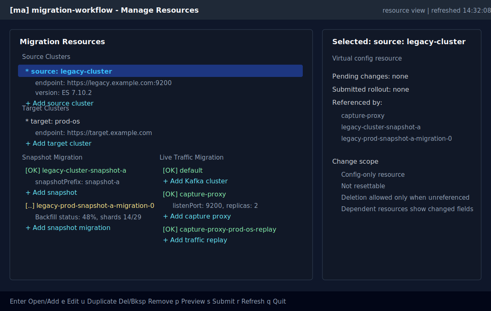
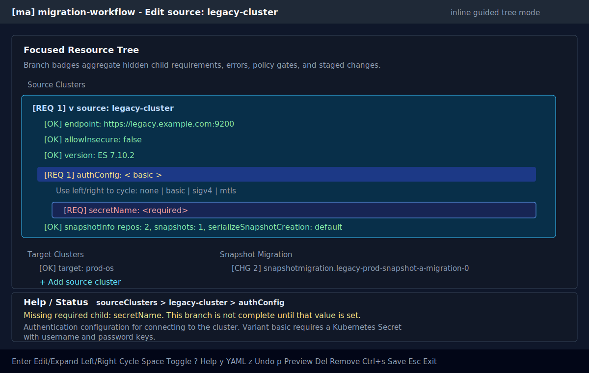
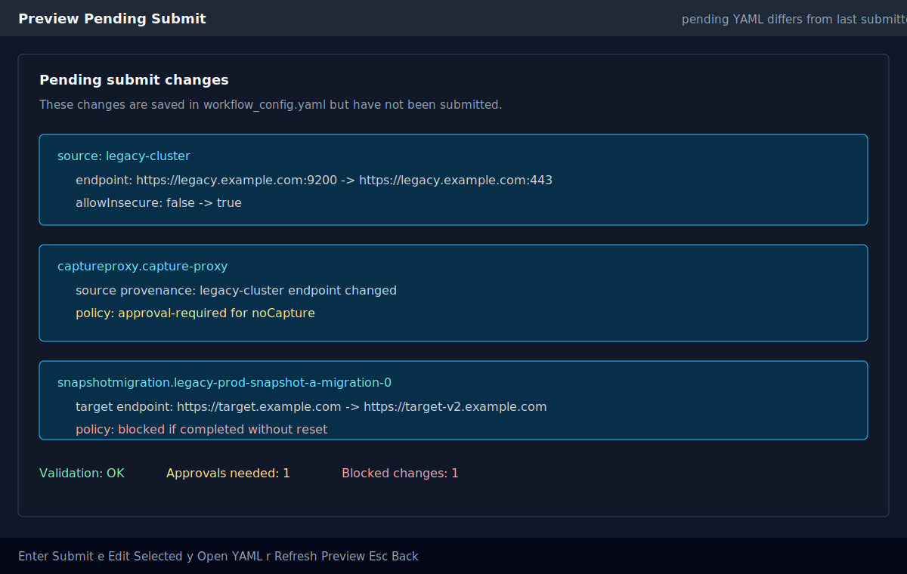
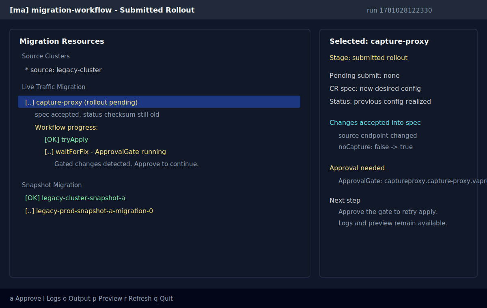

# Manage Resource Editing and Resubmission

> Status: prototype in progress. The first implementation exists behind
> `workflow manage --resource-view` -> `e`, but preview, live inverse
> regeneration, submit/reset wiring, and policy-aware rollout diffs are still
> design targets.

## Summary

The objective is to make workflow configuration editable from `workflow manage`
without requiring users to remember the full YAML schema. The edit experience
should operate from the existing resource-centric manage view, use an inline
guided tree editor, show schema descriptions for resources and fields, offer a
YAML escape hatch for complex nested structures, and save pending changes back
to the existing workflow configuration ConfigMap.

Edits are not applied directly to live migration CR specs. The flow remains:

```text
manage edit UI
  -> pending workflow YAML
  -> config-processor validation/preview
  -> workflow submit
  -> migration CR specs
  -> workflow convergence
```

The TS config-processor should own schema-aware editing, inverse rendering,
validation, diffing, and policy preview. The Python Textual UI should stay a
thin presentation layer that calls config-processor CLI commands, renders the
returned tree DTO, and updates the config store.

This does not imply a long-lived Node.js daemon. The v1 design should use
one-shot Node invocations through the existing `ScriptRunner` pattern: Python
writes temporary input files, runs a config-processor command, reads the JSON
result, and lets the process exit. A daemon/helper remains an optimization only
if measured interaction latency becomes unacceptable; if added later, it should
be a manage-owned stdio child process, not a cluster service or network daemon.

## Current Prototype Shape

The current branch has a working first pass that validates the main design
direction but is intentionally incomplete.

Implemented pieces:

- `orchestrationSpecs/packages/config-processor/src/editConfig.ts` exposes
  `editConfig state` and `editConfig apply`.
- `editConfig state --pending-config <file|->` parses pending workflow YAML and
  returns `EditStateV1` JSON.
- `editConfig apply --pending-config <file|-> --operation <json-file|->`
  applies one committed operation, returns updated YAML, and returns the next
  `EditStateV1`.
- Python `ConfigEditService` is a boundary around those one-shot TS commands.
  It loads the raw pending YAML from `WorkflowConfigStore`, calls TS, and saves
  raw YAML back to the same store.
- `workflow manage --resource-view` binds `e` to enter config edit mode.
- Edit mode replaces the live resource tree with a generic
  `Workflow Config Edit` tree rendered from the TS DTO.
- The bottom help/status panel follows the selected row and shows breadcrumb
  path, aggregate status/diagnostic text, and the schema description returned by
  TS.
- Edit tree rows are colored from a single effective status. The renderer uses
  the highest-priority status available for the selected status mode, including
  aggregate status from descendants.
- The TUI has separate value and status projection modes: `All`, `Deployed`,
  `After Workflow`, and `After Submit`. Current TS data only has pending YAML,
  but the renderer already understands future per-state values/statuses and can
  collapse unchanged values in `All` mode.
- Current operation support is `set`, `add`, and `removeConfig`.
- Current editable groups are source clusters, target clusters, Kafka cluster
  configuration, traffic capture proxies, traffic replayers, and snapshot
  migration configs.
- Current guided variants cover HTTP auth (`none`, `basic`, `sigv4`, `mtls`)
  and Kafka mode (`autoCreate`, `existing`).
- Current schema hints are authored in `userSchemas.ts` with `.uiHint(...)`,
  exported to JSON Schema as `x-ui-hint`, copied into `EditStateV1` as
  `inputHint`, and rendered generically by Python.
- Reference hints currently drive pickers for source cluster, target cluster,
  Kafka cluster, and capture proxy references when options are available.
- Scalar edit dialogs use local schema regex hints immediately and schedule a
  debounced one-shot TS validation pass for whole-config diagnostics.
- `Enter` edits scalar values, toggles booleans, opens union pickers, expands objects,
  or starts add rows depending on the selected row.
- `Del` and `Backspace` remove config entries after a confirmation modal, and
  are not bound on synthetic add rows.
- `Ctrl+s` saves the current draft YAML to the pending config store.

Current interaction details:

| Key | Current edit-mode behavior |
| --- | --- |
| `e` | Enter edit mode from resource view |
| `Enter` | Edit scalar with a small input modal, toggle booleans, open union pickers, expand/collapse object rows, approve running gates, or start an add row |
| `a` | Start the selected synthetic add row |
| `Left` / `Right` | Collapse/expand the selected tree row |
| `Space` | Toggle boolean rows |
| `v` | Cycle value projection mode |
| `t` | Cycle status projection mode |
| `Del` / `Backspace` | Confirm and remove removable config entries |
| `Ctrl+s` | Save pending YAML draft to `WorkflowConfigStore` |
| `Esc` | Exit edit mode and restore the live resource tree |
| `?` | Show selected field/resource description as a notification |

The current UI still uses modals for scalar value entry and add-name entry.
That is an implementation shortcut, not the final UX. The desired direction is
still inline or near-inline editing in the main view, with modals reserved for
destructive confirmation and genuinely large choices.

The current prototype runs TS more often than the original batching sketch:

- once when entering edit mode, to build the initial editable tree;
- once for each committed edit operation, such as a completed scalar edit,
  boolean toggle, union choice, add, or remove;
- once after a scalar value is idle long enough in the edit dialog, using a
  transient operation against the current draft YAML; stale validation results
  are ignored with generation tokens;
- not on cursor movement;
- not on every keystroke while typing in the input modal; local regex checks run
  immediately, while full TS validation is debounced;
- not on normal manage polling refreshes.

`Ctrl+s` currently only writes the already-computed draft YAML to the ConfigMap.
It does not rerun TS today. A later preview/submit step should run TS again with
current pending/live inputs before submitting, so stale policy or validation
state cannot be accepted silently.

Known prototype gaps:

- The edit tree is global; pressing `e` on a resource does not yet focus only
  that resource's config subtree.
- Python still knows a small amount of path policy for removability. Longer
  term, TS should return `removable`, `editable`, and command metadata so Python
  does not need schema path knowledge.
- Descriptions are a mix of schema descriptions and hand-authored strings in
  `editConfig.ts`; this should converge on `userSchemas.ts` metadata wherever
  possible.
- Pending-submit changes, submitted-rollout changes, and policy preview arrays
  are currently empty placeholders.
- The value/status modes are rendering plumbing only until TS starts sending
  deployed/current-workflow/pending-submit state values.
- The prototype edits pending YAML only. It does not yet regenerate user config
  from live resources or `MigrationRun` history when pending YAML is absent.
- Save does not submit, and reset/delete of deployed resources is not wired.
- YAML shape preservation is basic: TS parses to an object and re-stringifies
  YAML, so comments and formatting are not preserved.

## Sample UI

The screenshots below are static mockups of the intended Textual experience.
They are not pixel-perfect final output, but they show the planned screen
structure, modes, and change-stage language.

### Resource Overview

The resource view becomes the default place to inspect deployed resources,
virtual source/target resources, and pending edit state.



### Inline Guided Tree Editor

Edit mode keeps the user inside the resource tree. The selected resource is
expanded into schema-backed config rows. Leaf values can be edited in place:
booleans toggle, enum/union fields open a picker from `Enter`, and text-like values
open a focused inline input below the selected row. If a union selection requires
nested input, the tree grows those child rows immediately beneath it. Branch
labels show aggregate completion/error cues, and a bottom help strip follows the
selected row with the relevant schema description and current diagnostic.



### Pending Submit Preview

Before submit, manage shows changes saved in pending YAML but not yet submitted
as a workflow run. Source/target changes are grouped under their virtual
resource name and repeated as provenance only under consumers affected by those
specific fields.



### Submitted Rollout and Approval State

After submit, the UI distinguishes accepted CR spec changes that have not
converged from active workflow progress and approval gates.



## Existing Repo Context

Relevant current pieces:

- `workflow manage` launches a Textual app from
  `migrationConsole/lib/console_link/console_link/workflow/commands/manage.py`.
- `--resource-view` already builds a CR-centric tree from live migration CRs and
  merges Argo workflow progress.
- `workflow configure edit` stores raw pending YAML in the existing
  `WorkflowConfigStore` ConfigMap.
- `workflow submit` reads that ConfigMap and uses config-processor to generate
  workflow artifacts and migration CR resources.
- `MigrationRun.spec.resolvedConfig` records effective submitted resource
  parameters for each run.
- `resolvedMigrationResources.ts` already exposes a VAP-style dry-run policy
  evaluator for `safe`, `gated`, and `impossible` field changes.
- `userSchemas.ts` already has field descriptions, defaults,
  `changeRestriction`, and `checksumFor` metadata.

The design should reuse those pieces instead of creating a second config path.

## UX Model

`workflow manage --resource-view` should show these top-level groups:

- `Source Clusters` virtual resources from `sourceClusters`.
- `Target Clusters` virtual resources from `targetClusters`.
- Existing real migration resources: Kafka, captured traffic, proxy, snapshot,
  snapshot migration, and replay.

Context-sensitive keys:

| Key | Action |
| --- | --- |
| `Enter` | Open selected node; on synthetic add rows, start the add wizard |
| `e` | Edit selected resource or virtual resource |
| `u` | Duplicate selected config entry |
| `Del` / `Backspace` | Remove selected config entry, or launch reset flow for real resources, after confirmation |
| `p` | Preview pending and rollout changes |
| `s` | Submit pending config through existing `workflow submit` |
| `r` | Refresh live workflow/resource state |

Adding resources should be represented in the tree instead of through a global
hotkey. Each actionable collection gets a synthetic add row:

```text
Source Clusters
  source: legacy-cluster
  + Add source cluster

Target Clusters
  target: prod-os
  + Add target cluster

Snapshot Migration
  Snapshot
    datasnapshot.legacy-cluster-snapshot-a
    + Add snapshot
  Backfill
    snapshotmigration.legacy-prod-snapshot-a-migration-0
    + Add snapshot migration

Live Traffic Migration
  Capture
    captureproxy.capture-proxy
    + Add capture proxy
  Buffer
    kafkacluster.default
    + Add Kafka cluster
  Replay
    trafficreplay.capture-proxy-prod-os-replay
    + Add traffic replay
```

Synthetic add rows are not resources and are not removable. Selecting one and
pressing `Enter` launches the add flow for that specific collection. This keeps
add discoverable, avoids a generic "choose a resource type" modal, and lets add
forms prefill nearby context where useful.

The UI should make three change stages explicit:

1. Pending submit: saved in pending YAML, not submitted yet.
2. Submitted rollout: accepted into migration CR `.spec`, but not yet reflected
   in the resource's realized status checksum.
3. Active workflow progress: current Argo steps, approval gates, retry loops,
   and live output.

## Inline Guided Tree Editing

The preferred edit interaction is a tree-based mode, not modal-first guided
forms. Pressing `e` on a resource enters edit mode in the main manage view:

- the selected resource remains in the tree;
- unrelated top-level groups can be dimmed or temporarily collapsed to reduce
  visual noise;
- schema-backed editable rows appear beneath the resource;
- a dockable help/status panel, bottom by default, shows the selected resource
  or field description from `userSchemas.ts`;
- changes are staged locally in the edit session until the user saves.

The TS edit-state command should return enough schema/edit metadata for Python
to avoid knowing the workflow schema. The first prototype sends each committed
row operation back through TS and re-renders the returned tree. That keeps all
variant expansion, validation, and YAML rendering in one place while the DTO is
still evolving. If startup latency becomes a UX problem, the next optimization
is to let Python apply simple local display updates optimistically and reconcile
through TS on save/preview. Python still should not become a second schema
engine.

This keeps users moving top-down through the same structure they are editing and
reduces the fatigue of repeatedly switching between tree, modal, preview, and
back again.

### Row Types

| Row type | Interaction |
| --- | --- |
| Object/resource | `Enter` expands/collapses children; help panel shows resource description |
| Enum/union | `Enter` opens an option picker; `Left`/`Right` collapse or expand the tree row |
| Boolean | `Space` toggles |
| String/number | `Enter` opens an inline input row directly under the selected field |
| Array | `Enter` expands items; `+ Add item` synthetic row appends a value |
| Record/map | `+ Add <key>` synthetic row creates a key, then child fields appear |
| Complex YAML-backed field | `y` opens an inline YAML editor panel scoped to that subtree |

### Completion and Error Cues

Every editable branch should show an aggregate cue computed from its visible and
latent descendants. This is how users know whether a subtree is done even when
it is collapsed.

Use compact, text-first badges in tree labels. The badge is part of the branch
label, not a separate side panel, so the signal remains visible while scrolling:

| Badge | Meaning |
| --- | --- |
| `[OK]` | Field or subtree is valid and complete |
| `[REQ n]` | `n` required descendant values are missing |
| `[ERR n]` | `n` validation errors exist under this branch |
| `[CHG n]` | `n` changed values exist under this branch |
| `[GATED n]` | `n` changed values will require approval |
| `[BLOCK n]` | `n` changes are blocked by policy or lifecycle |

`[OK]` means the node and all descendants are complete for the current schema
variant and locally valid. It does not mean the saved draft has been submitted
or rolled out; those states remain separate pending-submit and rollout badges in
the normal resource view.

Badge precedence should be:

```text
[BLOCK] > [ERR] > [REQ] > [GATED] > [CHG] > [OK]
```

A row can also show secondary badges when useful, for example:

```text
[REQ 1] authConfig: < basic >
  [REQ] secretName:
```

When a collapsed branch has several conditions, show the highest-precedence
badge in the main label and summarize the rest in the bottom help/status panel.
For example, a source cluster row might show `[REQ 1] source: legacy-cluster`
while the help strip says `1 required field, 2 changed fields`. This keeps the
tree readable without hiding the queue of work under the branch.

### Field Validation, Hints, and Suggestions

The validation model should be layered so Python stays a thin UI and TS remains
the schema authority:

1. Generative UI hints are authored in `userSchemas.ts` as Zod metadata:
   `.uiHint(...)`. JSON schema generation lifts them to `x-ui-hint`, and the
   config-processor edit engine copies them into `EditStateV1.inputHint`.
   Python does not maintain a parallel field model.
2. Static scalar validation metadata travels with each editable node. For
   example, a string field can include a regex pattern, a human message,
   requiredness, examples, and the field description. Python can then show
   immediate feedback in the input dialog without invoking Node on every
   keystroke.
3. Cross-field and lifecycle validation stays in TS. This includes Zod
   `refine`/`superRefine` logic such as unknown source/target references,
   duplicate names, source snapshot references, SigV4 snapshot constraints,
   and policy checks. Python should render the resulting diagnostics and
   aggregate status counts returned by TS after committed edits, preview, save,
   and submit.
4. Reference fields should be modeled as suggestions or selectable values
   instead of plain strings. Current implemented examples include `fromSource`
   over `sourceClusters`, `toTarget` over `targetClusters`, proxy references
   over `traffic.proxies`, and Kafka references over
   `kafkaClusterConfiguration`. Snapshot names over the selected source's
   `snapshotInfo.snapshots` should follow the same pattern.

The DTO can grow without changing the Python architecture:

```ts
type EditInputHint =
  | {
      kind: "text";
      format?: "text" | "http-endpoint" | "optional-http-endpoint" | "cluster-version" | "k8s-name";
      pattern?: string;
      message?: string;
      examples?: string[];
    }
  | {
      kind: "reference";
      sourcePath: string[];
      options?: { label: string; value: string; description?: string }[];
      allowCustom?: boolean;
      emptyMeansDefault?: string;
      message?: string;
    }
  | {
      kind: "record";
      addLabel: string;
      keyFormat?: "text" | "k8s-name";
      keyPattern?: string;
      message?: string;
    }
  | { kind: "array"; addLabel: string };
```

Implemented first-pass hints:

| Schema location | Hint | UI behavior |
| --- | --- | --- |
| `sourceClusters.*.endpoint` | optional HTTP endpoint text pattern | local regex feedback, full-config preview after idle |
| `targetClusters.*.endpoint` | required HTTP endpoint text pattern | local regex feedback, full-config preview after idle |
| `sourceClusters.*.version` | cluster version text pattern and examples | local regex feedback with examples in the message |
| `authConfig.basic.secretName` | Kubernetes-name text pattern | local regex feedback for Basic auth secret names |
| `sourceClusters`, `targetClusters`, `kafkaClusterConfiguration`, `traffic.proxies`, `traffic.replayers` | record add labels and key hints | synthetic add rows use the label and key validation |
| `traffic.proxies.*.source`, `traffic.proxies.*.kafka`, `traffic.replayers.*.fromProxy`, `traffic.replayers.*.toTarget`, `snapshotMigrationConfigs.*.fromSource`, `snapshotMigrationConfigs.*.toTarget` | references to named config scopes | Python opens a picker when options exist, otherwise falls back to text |
| `snapshotMigrationConfigs` | array add label | add row appends a new snapshot migration without asking for a key |

For now, scalar regex validation is cheap enough to run locally in Python using
metadata supplied by TS. The source of truth is still the Zod schema and the
full TS validation pass; the modal feedback is a fast, user-friendly first line
of defense.

Narrow field validation should work by applying a transient operation to the
whole draft in TS, not by validating the scalar in isolation. The one-shot
response returns structured diagnostics:

```ts
interface EditDiagnostic {
  severity: "required" | "error" | "warning" | "gated" | "blocked";
  message: string;
  path?: string[];
}
```

The active dialog displays only diagnostics whose `path` matches the active
edit node. This preserves whole-config validation, including Zod refinements,
without flooding a narrow field edit with unrelated errors. Python schedules the
one-shot after a short idle delay and increments a generation token for each
change; when an older response arrives, the generation mismatch drops it.

There are two viable ways to pick up richer Zod refinements without rewriting
them in Python:

- Keep one-shot TS commands for committed operations. This is the safest v1:
  Python sends an operation, TS applies it, runs Zod validation/refinements,
  returns the next tree, and Python renders it. It avoids daemon lifecycle bugs
  and is already consistent with submit. This is also the current scalar-dialog
  validation path, except the returned YAML is discarded until the user commits.
- Add a manage-scoped Node helper later if the UI needs per-keystroke
  cross-field validation, dynamic suggestions, or very low-latency preview. If
  we do this, it should be a child process using stdio JSON-RPC, not a network
  daemon. Python would start it when manage enters edit mode, send
  `load`, `validateField`, `apply`, `suggest`, and `preview` requests, and
  terminate it when manage exits edit mode or quits.

The daemon/helper option becomes attractive only if one-shot startup latency is
visible or if we decide that reference pickers must update live while the user
types. Until then, one-shot commands plus richer DTO metadata keep the failure
model simpler.

For HTTP Basic auth, selecting `basic` immediately adds the required child rows.
Until `secretName` is set, both the child and the parent auth branch show
required/missing state. If the user cycles back to `none`, the basic-only child
rows disappear and the branch can return to `[OK]` if auth is optional for that
resource.

For HTTP auth, the user should see an explicit union selector:

```text
authConfig: < none >
```

Cycling right changes it to:

```text
authConfig: < basic >
  secretName: legacy-basic-auth
```

Cycling again could switch to:

```text
authConfig: < sigv4 >
  region:
  service: es
```

The nested rows are added or removed immediately as the selected union variant
changes. This same model applies to TLS modes, Kafka `autoCreate` vs `existing`,
snapshot source selection, and transform entry-point variants.

### Descriptions and Help

Every editable resource and field should surface its schema description:

- resource descriptions appear when the resource row is selected;
- field descriptions appear when a field row is selected;
- expert fields keep their `[Expert]` signal, but the UI should render that as a
  warning label instead of burying it in prose;
- changed fields show old and new values in the help panel;
- blocked/gated fields show the policy reason near the description.

Descriptions should be shown in a persistent help panel, not in transient
tooltips. The default edit-mode layout should put a two-to-four-line help panel
at the bottom of the screen so the text updates naturally as users scroll
through the tree. On wide terminals the same panel can be docked to the side,
but it should be the same content and interaction model.

Recommended layout behavior:

- default: tree/editor on top, help panel on bottom;
- wide terminal: allow side-by-side tree/help if it gives enough width to both;
- narrow terminal: bottom help panel only;
- `?` expands the help panel for the selected field when the description is
  longer than the visible lines.

The bottom help panel should include:

- breadcrumb path;
- one or two lines of field/resource description;
- required/default/variant summary when relevant;
- current validation or policy cue for the selected row;
- first actionable descendant diagnostic when the selected row is a collapsed
  branch.

### Textual Feasibility

Do not assume arbitrary widgets can be mounted inside `Tree` rows. The practical
Textual shape should be:

- use `Tree` for structure, selection, labels, and stable row IDs;
- update tree labels to show compact values, e.g. `authConfig: < basic >`;
- handle left/right/space/enter key events at the app layer for selected rows;
- use `Input`, `Select`/option list, `Switch`-style toggles, `Markdown`/`Static`,
  and a YAML text editor area in adjacent panes or inline panels within the same
  screen;
- implement the help panel as the same widget docked bottom or side by layout,
  not as a separate interaction mode;
- avoid modal dialogs except for destructive confirmation, large option pickers,
  and submit/reset confirmations.

The end result should feel inline even if the actual `Input` widget lives in a
small editor panel below the selected row or in the help panel.

### Additional UX Ideas

- Add a breadcrumb above the help text, such as
  `sourceClusters > legacy-cluster > authConfig > basic > secretName`.
- Add a "focus resource" mode that dims or hides other top-level groups while
  editing one resource, with `Esc` returning to the full tree.
- Add a compact "changed fields only" filter inside edit mode.
- Add "next required field" navigation for newly selected union variants.
- Add "next problem" navigation that jumps through `[REQ]`, `[ERR]`, and
  `[BLOCK]` rows in precedence order.
- Add reversible local edits before save: `z` undo and `Shift+Z` redo inside the
  edit session.
- Let `p` preview only the focused resource while in edit mode, and all changes
  from the normal resource view.

## Virtual Source and Target Resources

Source and target clusters should remain virtual resources, not Kubernetes CRs.
They are named config scopes, and real resources refer to them by name.

Delete semantics:

- Removing a source or target only removes it from pending YAML.
- It is allowed only when no pending config entries reference it.
- It never deletes an external cluster.
- It never calls `workflow reset`.

Versioning/provenance:

- Do not create one coarse source/target version hash.
- Instead, define projection metadata for the fields each consuming resource
  actually uses.
- Show virtual source/target diffs under nodes like `source: legacy-cluster`
  only when fields changed.
- Under consumers, show those same changed values as provenance only when the
  consumer actually depends on that field.

Initial consumed-field projections:

| Consumer | Virtual fields consumed |
| --- | --- |
| CaptureProxy | source `endpoint`, `allowInsecure`, `authConfig` |
| DataSnapshot | source connection identity, selected snapshot config, selected repo config, snapshot serialization setting |
| SnapshotMigration | source `version`, source connection fields, selected snapshot/repo fields, target connection fields |
| TrafficReplay | target connection fields |

The config checksums should be reviewed and updated so each real resource
includes exactly the virtual fields its workflow steps consume.

## TS Edit Engine

Add a config-processor edit engine with these responsibilities:

- Parse current pending user YAML.
- Load latest submitted provenance from `MigrationRun` history when available.
- Fall back to canonical inverse generation from `resolvedConfig.workflowConfig`
  for older runs.
- Build an edit state for Python manage.
- Apply typed edit operations.
- Validate updated config through existing Zod and unified schema validators.
- Produce pending-submit diffs and VAP-style dry-run policy previews.
- Render updated YAML while preserving the pending YAML shape when possible.

Current CLI:

```bash
index.js editConfig state --pending-config <file|->
index.js editConfig apply --pending-config <file|-> --operation <json-file|->
```

Target CLI extensions:

```bash
index.js editConfig state --pending-config <file|-> --history <file> --live-resources <file>
index.js editConfig preview --pending-config <file|-> --history <file> --live-resources <file>
```

Current operation types:

```ts
type EditOperation =
  | { op: "set"; path: string[]; value: unknown }
  | { op: "removeConfig"; path: string[] }
  | { op: "add"; path: string[]; value: unknown };
```

Target operation extensions:

```ts
type FutureEditOperation =
  | EditOperation
  | { op: "duplicate"; fromPath: string[]; toPath: string[] }
  | { op: "renameKey"; fromPath: string[]; toPath: string[] };
```

Target `EditStateV1` shape. The current DTO is a subset of this shape: it
already includes `formatVersion`, `provenance`, `nodes`, placeholder change
arrays, and `validation`, but provenance is currently only `pending-yaml`.

```ts
interface EditStateV1 {
  formatVersion: 1;
  provenance: {
    pendingConfigHash?: string;
    submittedConfigHash?: string;
    source: "pending-yaml" | "migration-run-input" | "canonical-regenerated";
    lossy: boolean;
    warnings: string[];
  };
  nodes: EditNode[];
  pendingSubmitChanges: ChangeGroup[];
  submittedRolloutChanges: ChangeGroup[];
  policyPreview: PolicyPreview[];
  validation: {
    valid: boolean;
    errors: string[];
    diagnostics?: {
      severity: "required" | "error" | "warning" | "gated" | "blocked";
      message: string;
      path?: string[];
    }[];
  };
}
```

Each `EditNode` should include schema-derived UI metadata, not just values. The
current DTO already includes `command` rows for synthetic add entries.

```ts
interface EditNode {
  id: string;
  path: string[];
  label: string;
  value?: unknown;
  valueKind:
    | "object"
    | "record"
    | "array"
    | "union"
    | "enum"
    | "boolean"
    | "scalar"
    | "command";
  description?: string;
  descriptionShort?: string;
  expert?: boolean;
  required?: boolean;
  defaultValue?: unknown;
  status?:
    | "ok"
    | "required"
    | "error"
    | "warning"
    | "changed"
    | "gated"
    | "blocked";
  statusCounts?: {
    required?: number;
    errors?: number;
    warnings?: number;
    changed?: number;
    gated?: number;
    blocked?: number;
  };
  inputHint?: EditInputHint;
  validation?: {
    pattern?: string;
    message?: string;
  };
  diagnostics?: {
    severity: "required" | "error" | "warning" | "gated" | "blocked";
    message: string;
    path?: string[];
  }[];
  variants?: {
    label: string;
    value: unknown;
    description?: string;
    childSchema?: EditNode[];
  }[];
  command?: {
    requiresName?: boolean;
  };
  children?: EditNode[];
}
```

## Provenance and Inverse Rendering

The preferred source of editable YAML is the pending ConfigMap used by
`workflow configure edit`.

When pending YAML is absent or stale:

1. Prefer future `MigrationRun.spec.resolvedConfig.inputConfig`, if present.
2. Otherwise generate canonical user YAML from existing
   `MigrationRun.spec.resolvedConfig.workflowConfig`.
3. Mark regenerated YAML as canonical and potentially lossy.

Add optional fields to future `ResolvedMigrationResources` records:

```ts
interface ResolvedMigrationResources {
  formatVersion: 1;
  workflowName?: string;
  workflowConfig: WorkflowConfig;
  inputConfig?: {
    formatVersion: 1;
    canonicalConfig: unknown;
    canonicalHash: string;
    rawConfigHash?: string;
  };
  resources: ResolvedMigrationResource[];
}
```

This is backward-compatible because current `MigrationRun` CRD preserves unknown
fields inside `resolvedConfig`.

## Python Manage Changes

Python should not reimplement schema logic. It should:

- Fetch live migration CRs with the existing Kubernetes helpers.
- Fetch latest `MigrationRun` records for the workflow.
- Load pending config from `WorkflowConfigStore`.
- Call config-processor edit commands through `ScriptRunner` as one-shot Node
  processes.
- Render virtual and real nodes from `EditStateV1`.
- Save edited YAML back through `WorkflowConfigStore`.
- Reuse existing secret discovery and credential workflows.
- Reuse `submit_command` behavior for resubmission.
- Reuse `reset_command` for confirmed resets of real resources.

TS should run at committed interaction boundaries:

- when entering edit or preview mode, to build the editable model;
- when committing an edit/add/duplicate/delete operation, to apply the operation
  and refresh validation/preview;
- when the user explicitly refreshes the preview;
- immediately before submit, to catch stale pending or live state.

It should not run on cursor movement, normal manage polling refreshes, or every
keystroke in the inline editor. In the current implementation, `Ctrl+s` only
saves the current draft YAML to `WorkflowConfigStore`; the TS apply step has
already run when the user committed each row operation. If one-shot startup
latency becomes noticeable, cache by input hashes in Python first: pending
config hash, latest `MigrationRun` identity, and live CR `resourceVersion` set.
A long-lived Node helper is a later optimization, not part of the initial
design. If added, it should be a manage-scoped child process over stdio
JSON-RPC, not a cluster daemon or listening network service. The purpose would
be latency and richer interactive hints only; schema ownership would still stay
in TS.

The Textual UI already has:

- A bottom help/status panel for selected resource fields, branch diagnostics,
  and schema descriptions.
- A generic edit tree rendered from `EditStateV1`.
- Single-color row styling from effective status, including aggregate child
  status.
- Value/status projection mode controls for `All`, `Deployed`,
  `After Workflow`, and `After Submit`.
- Synthetic add rows under current editable collections.
- Confirmation modals for config removal.
- Contextual edit-mode bindings for add rows, scalar edits, boolean toggles,
  union pickers, and removable config entries.

The Textual UI still needs:

- Resource-focused edit mode that starts from the selected resource/config
  subtree instead of replacing the whole live tree with a global config tree.
- More inline scalar editing; current scalar/add-name edits use modal input even
  though `Enter` now provides a quick field-edit path.
- A YAML editor panel for complex nested config.
- A preview modal that can group changes by stage and policy outcome.
- Confirmation modals for duplication, submit, and reset.
- Submit/reset actions wired from manage edit mode.

## CRUD Semantics

Add:

- Source cluster.
- Target cluster.
- Kafka config.
- Capture proxy.
- Snapshot definition.
- Snapshot migration.
- Traffic replay.

Edit:

- Use inline guided tree rows for common fields.
- Use a scoped YAML editor panel for complex config.
- Always validate after save.

Duplicate:

- Copy a selected config entry to a new key.
- Update references only when the duplicated resource is a composite flow chosen
  by the user in a later iteration; the first pass should duplicate only the
  selected config entry.

Delete:

- Bound to `Del` and `Backspace` from existing resource/config rows.
- Always opens a modal confirmation before changing pending config or launching
  reset.
- Does nothing on synthetic add rows.
- Virtual source/target: remove config only, only when unreferenced.
- Real resources: remove from pending config, and optionally launch the existing
  `workflow reset` path for deployed state.
- Terminal completed resources still require reset/recreate for changed
  impossible fields.

Submit:

- Always save pending YAML first.
- Run validation and secret checks.
- Show pending preview and blocked/gated warnings.
- Invoke existing workflow submit.

## Change Presentation Rules

Use a single effective color per resource/config row, chosen from the highest
priority state represented by that row and its children:

- Green: pending-submit/unsubmitted changes, meaning saved config differs from
  the submitted workflow projection and can still be submitted.
- Grey: submitted-rollout/in-progress changes, meaning the submitted workflow
  projection differs from the deployed resource state and is still converging.
- Default foreground: fully deployed values, meaning the deployed state matches
  the submitted projection and there is no newer saved edit for that field.

Pending-submit changes:

- Compare pending YAML against last submitted user config if available.
- If last submitted user config is unavailable, compare against canonical
  regenerated config and show a lossy provenance warning.

Submitted-rollout changes:

- Compare live CR `.spec` to the last realized state represented by
  `status.configChecksum` and matching `MigrationRun` resources.
- If no exact checksum match can be found, show checksum drift without inventing
  field-level detail.

Policy preview:

- Use `dryRunResourcePolicy`.
- Mark outcomes as `allowed`, `approval-required`, or `blocked`.
- Include non-decreasing invariant failures such as captured traffic partition
  decreases.

Virtual provenance:

- Show source/target fields only when they changed.
- Show them under the virtual resource node.
- Repeat them under affected consumers only when the consumer projection includes
  that field.

## Testing

TS unit tests:

- Build edit state from pending YAML and latest `MigrationRun`.
- Apply each edit operation type.
- Preserve YAML shape where pending YAML exists.
- Generate canonical fallback YAML from old `MigrationRun` histories.
- Mark fallback provenance as lossy.
- Validate source/target reference deletion rules.
- Verify virtual field projections affect only intended consumers.
- Verify policy preview for safe, gated, impossible, and invariant-blocked
  changes.

Python unit tests:

- Resource tree includes virtual source and target groups.
- Context bindings appear only on valid node types.
- Edit/add/duplicate/delete actions call `ScriptRunner` with expected payloads.
- Saved YAML is written through `WorkflowConfigStore`.
- Source/target delete never calls reset.
- Real resource reset delegates to the existing reset flow only after
  confirmation.

Integration tests:

- `MigrationInitializer` writes `inputConfig` metadata for new runs.
- A manage-edited config submits through the same workflow artifact path as
  `workflow configure edit` followed by `workflow submit`.
- A source endpoint change appears as pending virtual provenance and causes only
  the intended consuming resources to show affected changes.

## Rollout

1. First pass complete: add TS edit-state/apply commands, unit tests, Python
   `ConfigEditService`, generic Textual render, basic add/set/remove operations,
   help/status panel, and delete confirmation.
2. Add `inputConfig` provenance to new `MigrationRun` records.
3. Extend resource tree model with virtual source/target nodes and change-stage
   labels.
4. Add preview-only manage actions.
5. Improve inline guided edit mode: resource focus, inline scalar editing,
   YAML subtree editing, duplicate handling, and richer add rows.
6. Wire submit/reset actions.
7. Expand projection metadata and checksum material where tests reveal missing
   source/target consumers.

## Open Follow-Up

The largest technical risk is ensuring virtual source/target field projections
match actual workflow-template consumers. That should be treated as a small
schema/projection subsystem, not as display-only UI code.
