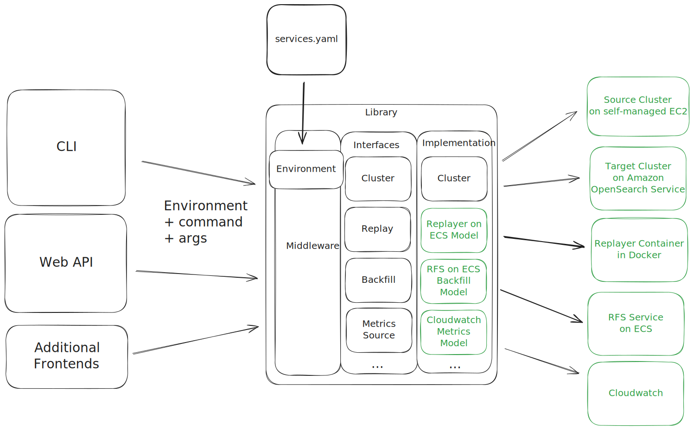

# Migration Console

## Introduction

**Overview**
The Migration Console serves as the control plane for orchestrating and managing the components of the Migration Assistant. It coordinates the activities of various components in the migration pipeline and provides a single point of interaction for users. The Migration Console can refer both to the ECS instance deployed in the user's account and selected VPC, and the command line application installed on that instance to interact with the Migration Assistant components.

**Goals and Scope**:

- Ensure centralized control and visibility into the migration process.
- Provide interfaces for managing communication between the Migration Console and other components.
- Operate statelessly with a transparent source of truth for predictable and configurable behavior.

## System Architecture

The Migration Console is deployed into the customer's VPC and maintains connections with most other components of the Migration Assistant. The below diagram is not comprehensive and does not illustrate any of the data flow between various other components. Additionally, it shows the deployment resulting from using the `deployment/cdk` tooling. A user may also deploy with Docker, in which case each of the ECS containers and Kafka in the diagram are actually Docker containers, the EFS volume is a shared volume, and Cloudwatch is replaced with Prometheus and Jaeger. Regardless, the Migration Console maintains contact with each of the components.

[Source](https://tiny.amazon.com/jmayhucf/desia2zIMi)

### Components & their Relation to the Migration Console

#### Deployment Environment

In a Migration Assistant deployment on AWS, the Bootstrap Box is an EC2 instance that's used to deploy all other services and components of the solution, including the Migration Console. The Migration Console is accessed from the Bootstrap Box using the `./accessContainer` script which uses the AWS CLI `execute-command` function to start an interactive bash session on the Migration Console. This is how a user runs commands on the Migration Console.

The Bootstrap Box doesn't exist in a open-source deployment, and instead the user generally uses their local system or another designated environment to deploy the Migration Console and other components.

In either case, it is the responsibility of the deployment environment to populate a `migration-services.yaml` file on the Migration Console that describes the other services that are deployed. This includes the endpoints and authorization schemes of the clusters, the cluster names and service names for any ECS services, the Kafka broker endpoints, etc.

#### Source Cluster

The source cluster connection is optional.  A customer can configure the `cdk.context.json` with source cluster details (endpoint, auth method, etc.), which are populated in the `migration-services.yaml` file. The Migration Console uses these details directly to make http requests, like `/_cat/indices`, and also passes them to other programs running on the Migration Console box, specifically `CreateSnapshot`.

#### Target Cluster

The target cluster is also populated in the `cdk.context.json` and the Migration Console uses the connection details to make http requests directly, as well as passing them to the `MetadataMigration` tool. Direct HTTP requests are used during an Reindex-from-Snapshot (RFS) migration to query the `.migrations_working_state` index and inform the user about the progress of the backfill.

#### Kafka

In a migration with replayer components deployed, the Migration Console has some utility tools to query or manipulate the Kafka cluster, to e.g. create, delete or describe topics. The Kafka broker endpoints are populated in the `migration-services.yaml` by the CDK deployment and also specify whether IAM properties should be added to the requests for AWS Managed Service Kafka.

#### Reindex-From-Snapshot & Replayer Service

The Reindex-From-Snapshot and Replayer services are deployed (if enabled) by the CDK scripts to ECS, in the same cluster as the Migration Console, or by the `docker-compose.yml` as Docker containers. In the AWS deployment, the Migration Console does not directly interact with either of these services. Instead, it uses the AWS API to manipulate them at the control-plane level by changing the number of desired services to disable, enable, and scale the services.

#### Shared Logs Volume

In an AWS deployment, the Shared Logs Volume is an EFS volume that's mounted to the Migration Console task, as well as the Replayer task (if deployed).  In a Docker deployment, it's a shared volume between those containers. In both cases, logs are written to the volume from the Replayer (in the form of tuples) and processes on the Migration Console (specifically Metadata Migration). These logs can be accessed directly by the user (e.g. with shell commands `ls`, `cat`, `jq`, etc.) or, in the case of tuples, manipulated using Migration Console CLI commands.

#### Cloudwatch Metrics

The various services making up the Migration Assistant emit metrics and traces via an OpenTelemetry Collector to the configured metrics provider. In an AWS deployment, that's Cloudwatch & X-Ray, and in a Docker deployment it's Prometheus and Jaeger. The Migration Console contains basic functionality to query the metrics, and supports both the AWS and Docker deployment sources.

## Library Architecture and Interface

The Console Library is intended to be a layer that provides a unified way to access the many components involved in a migration, regardless of the specific options enabled and where they are deployed.

It allows "frontends" (a CLI app, a Web API, etc.) to ask questions and control a migration while being insulated from the details of how to communicate with each component ("backend services").

The overall architecture can be seen in this diagram. Each of the subsections below discusses a component in more detail, moving from left (user) to right (deployed services). Green indicates examples, not definite implementations.

[source](diagrams/migration-console-library-source.excalidraw) (This is an [excalidraw](https://github.com/excalidraw/excalidraw) markdown file, not particularly human readable.)

### Interfaces

Currently, we have a couple of frontends that leverage the Migration Console library. The primary and most comprehensive is the command line interface (CLI), [source](https://github.com/opensearch-project/opensearch-migrations/blob/main/TrafficCapture/dockerSolution/src/main/docker/migrationConsole/lib/console_link/console_link/cli.py). Additionally, the `cluster-curl` application exposes only cluster-related calls (currently [in PR here](https://github.com/opensearch-project/opensearch-migrations/pull/1046)), and the integ tests that run on the Migration Console ([source](https://github.com/opensearch-project/opensearch-migrations/tree/main/TrafficCapture/dockerSolution/src/main/docker/migrationConsole/lib/integ_test)) make extensive use of the console library and serve as another frontend, though in a different form-factor (i.e. not user-facing).

We intend to support a full web API that matches the CLI by programatically generating both the API and the CLI from a spec (yet to be defined). In the short term, a subset of the functionality is exposed via a Web API.

#### CLI

In the near term of the Migration Assistant, the CLI is the primary way for users to manage and understand their migration. After deploying their tools, a user will log onto the Migration Console and use the CLI for tasks like starting and checking the progress of their historic backfill, turning on and off the replayer, running `_cat/indices` against the source and target cluster, etc. These functions will be performed in the same way by the user, regardless of whether their tools are deployed locally on Docker, remotely on AWS, a different hosting platform, or a combination thereof.

#### Generation from a spec

For the CLI and (standard) web API, the intention is that the “frontend” should be very small--essentially just the necessary code to get the user’s data from the input source (either CLI commands or http requests) into the library itself. To accomplish this, the actual endpoints in both cases could be generated from an API spec or one of them from the other. This will be a helpful way to minimize the developer effort to support additional commands and ensure that behavior is consistent between the two modalities.

#### Custom Frontends

As mentioned above, there are several smaller frontends that expose specific functionality (`cluster-curl`) or directly use the functionality (integ tests), leveraging the library to manage all direct communication with components, without the frontend needing to know how or where the components are deployed. These frontends install and import the library's middleware and models. In the future, these frontends could be expanded--for instance, we could write a "wizard" that walks a user step-by-step through a deployment and migration or an application to help manage multi-target performance testing.

### Configuration & the Environment Object

Configuration defines the services, connection details, and preferences for a migration. The "inner" parts of the library don't interact directly with any configuration files, they rely on an Environment object that contains and manages the implementation models for each involved component. The default behavior is that this Environment object is instantiated from a file at `/config/migration_services.yaml`. However, any frontend/user can specify a different file or can instantiate an Environment object via another strategy entirely.

#### Configuration with a `services.yaml` file

As discussed above and additionally in the next session, a `services.yaml` file is effectively an implementation detail and not the only way of specifying a configuration. However, in our current implementation, it is the default and most widely used way and therefore merits some discussion here. The YAML file has a fully defined spec in the [Migration Console README](https://github.com/opensearch-project/opensearch-migrations/blob/main/migrationConsole/lib/console_link/README.md#servicesyaml-spec).

In general, there is one block in the YAML file for each object that will be instantiated, with all of the configuration details necessary to determine which model implementation should be created and used. The structure of the YAML is enforced by schemas in each model.

#### The Environment Object

One of the core objects used to interact with the library is an `Environment` object that contains and manages the implementation objects for each deployed service. It can be thought of as the in-code implementation of the `services.yaml` file. Each service described in the YAML will be mapped to its appropriate model, instantiated with the provided settings, and held in the Environment object.

This Environment object will be a parameter to every command function in the middleware layer because it contains the full context of the deployed services.

The frontend has a few options for how to interact with the Environment object. In the basic case, the frontend can ask the middleware layer to instantiate and populate the Environment. In this case, the middleware will load the YAML (from the default or a specified path), validate it, and create implementation models for each service involved. It will then return the Environment object to the frontend, and the frontend will supply it along with all command calls.

In the "power user" case--likely to be used by an API, which may not rely on a `services.yaml` file--the frontend can start with an empty Environment, and define and instantiate the underlying models itself. When that Environment is passed into the commands exposed by the middleware layer, it will be used as the source of truth for all deployed services. One option for tools taking this option would be to define a custom configuration format and include an Environment builder/factory to convert that configuration into a suitable Environment object.

### Middleware Layer

The middleware layer is the public-facing API of the library as a whole. As much logic as possible related to error handling, type checking, manipulating arguments, and calling functions on the underlying models should happen through the middleware layer. This allows the frontend interfaces (CLI, web API, etc.) to remain very thin and suitable for generation from a spec.

Each call into the middleware layer should include three pieces of data: the command to be called (e.g. `backfill scale`), any arguments for it (e.g. `units=5`), and the Environment object (which in this case might include a `RFS on ECS Backfill` model). The middleware layer is responsible for calling the appropriate function on the model, validating and passing in the arguments, and handling errors during the execution, and passing the result back to the original caller.

### Model Interfaces & Implementations

Models contain the logic for interacting with each component of the migration. There are two subtypes here: "simple" models and those with multiple implementations.  These aren't hard-and-fast distinctions. A model that currently only has one implementation may end up with additional implementations in the future.

Models with multiple implementations have an [Abstract Base Class](https://docs.python.org/3/library/abc.html) that defines the interface for the model and sets a contract for implemented functions. Each implementation inherits from the base class. This means that the middleware layer doesn't know or care which implementation is being used because it relies on the contract of the abstract base class.

For instance, a `Cluster` model is initialized with the endpoint and auth details for a given cluster and is responsible for using those details to make API calls to the cluster whether the user invokes a cluster command directly (e.g. `console cluster cat-indices`) or indirectly (e.g. when a user invokes `console snapshot status`, the `Snapshot` model makes a call to the `Cluster` model to check the status of the snapshot). This allows us to keep the logic to make a cluster API call exclusively in one place. Currently, we only have a single `Cluster` implementation, but in the future, perhaps a new (or very old) version of Elasticsearch or OpenSearch would need a different client and this would be encapsulated by creating a variation of the current `Cluster` model. This new version would handle the custom client without exposing that implementation detail to the middleware layer or the `Snapshot` model that asks for a given API call to be made.

Effectively, the only component that needs to know which implementation of a model is being used is the Environment which makes the objects available to the middleware layer.
