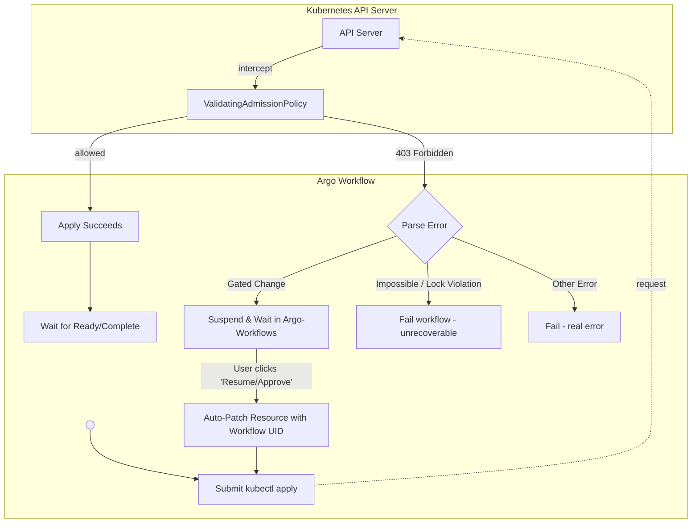

# State-Aware Resource Management for Migration Workflows

> **Status:** Implementation Plan (Ready for Review)

## Context

The migration workflow currently operates in an "always create" mode using `kubectl apply`. This works well for initial deployments but creates risks and inefficiencies during subsequent runs:

1. **Re-running workflows:** Should skip creation if a resource exists with the exact same configuration (Idempotency).
2. **Configuration drift:** Some changes (e.g., replica counts) require careful handling; others (e.g., storage type) must be blocked entirely.
3. **Protecting production:** Dangerous or disruptive changes should never silently apply; they must be gated by human approval.

**Implementation Targets:**

* Phase 1 (Completed): Kafka cluster (`Kafka`), `KafkaNodePool`, and `KafkaTopic` from Strimzi.
* Phase 2 (Current): `CaptureProxy` (long-lived) and `DataSnapshot` / `SnapshotMigration` (finite/terminal).

### Goals

* Use Kubernetes ValidatingAdmissionPolicies (CEL) to enforce change rules at the API level.
* Route policy rejections to a suspend gate in the Argo UI, allowing users to safely approve changes without dropping into a CLI.
* Retain native K8s behavior for "stacked rollouts" on long-lived infrastructure.
* Ensure strict provenance: the parameters in a CRD's `.spec` must *always* perfectly match the actual deployed infrastructure or historical artifact.

---

## Architecture Overview: The Argo Retry Model

The workflow does **not** automatically inject approval annotations on the first pass. When a gated change is attempted, the system relies on a "Catch, Suspend, Auto-Patch, and Retry" loop orchestrated entirely within Argo.



**Key Concept: The API Rejection is Absolute.** If a VAP rejects a change, the entire `kubectl apply` request is aborted. The existing object in `etcd`, including its state and status, remains 100% unchanged.

---

## Field Classification

Changes to resources fall into three categories.

1. **Impossible:** Cannot be done — must delete & recreate the resource. This branch of the workflow cannot be advanced.
2. **Gated:** Requires explicit approval annotation (injected via the Workflow) to proceed.
3. **Safe:** Low-risk, allowed dynamically without approval. Safe fields require no VAP expressions — they are included in the classification tables for coverage tracking only.

For terminal resources in `Completed` state, the [Lock-on-Complete](#the-lock-on-complete-pattern-terminal-resources-only) pattern overrides all categories — every spec change becomes Impossible.

### CaptureProxy (`migrations.opensearch.org/ProxyConfig`)

| Field | Category   | Rationale | Restart Required? |
| --- |------------| --- | --- |
| `spec.listenPort` | Impossible | Changing breaks all client connections | N/A |
| `spec.noCapture` | **Gated**  | Fundamentally changes proxy behavior | Yes (rolling) |
| `spec.enableMSKAuth` | **Gated**  | Auth mode change is destructive | Yes (rolling) |
| `spec.tls.mode` | **Gated**  | TLS mode switch requires cert/secret changes | Yes (rolling) |
| `spec.podReplicas` | Safe       | Scaling is safe, Deployment handles rolling | No |
| `spec.resources` | Safe       | Resource limits/requests | Yes (rolling) |
| `spec.internetFacing` | Impossible | Changes load balancer scheme; recreate Service | N/A |
| `spec.loggingConfigurationOverrideConfigMap` | Safe       | Logging config swap | Yes (rolling) |
| `spec.otelCollectorEndpoint` | Safe       | Observability config | Yes (rolling) |
| `spec.setHeader` | Gated      | Header injection tweaks | Yes (rolling) |
| `spec.destinationConnectionPoolSize` | Safe       | Connection tuning | Yes (rolling) |
| `spec.destinationConnectionPoolTimeout` | Safe       | Connection tuning | Yes (rolling) |
| `spec.kafkaClientId` | Safe       | Client identity change | Yes (rolling) |
| `spec.maxTrafficBufferSize` | Gated       | Performance tuning | Yes (rolling) |
| `spec.numThreads` | Safe       | Performance tuning | Yes (rolling) |
| `spec.sslConfigFile` | Safe       | Legacy SSL config path | Yes (rolling) |
| `spec.suppressCaptureForHeaderMatch` | **Gated**  | Traffic filtering changes | Yes (rolling) |
| `spec.suppressCaptureForMethod` | **Gated**  | Traffic filtering changes | Yes (rolling) |
| `spec.suppressCaptureForUriPath` | **Gated**  | Traffic filtering changes | Yes (rolling) |
| `spec.suppressMethodAndPath` | **Gated**  | Traffic filtering changes | Yes (rolling) |

*(Note: Kafka and KafkaNodePool resources follow similar matrices established in Phase 1).*

### DataSnapshot (`migrations.opensearch.org/DataSnapshot`)

Terminal resource that is created with what is effectively a job.
This transitions to `Completed`. 
Lock-on-Complete freezes the entire spec once done.
All fields here are impossible to edit.  If a user wanted to change a snapshot
in-progress, they would need to delete the existing snapshot and redrive.

### SnapshotMigration (`migrations.opensearch.org/SnapshotMigration`)

Terminal resource — transitions to `Completed`. Lock-on-Complete freezes the entire spec once done. A SnapshotMigration contains one or more sub-tasks, each optionally including metadata migration and/or document backfill (RFS).

**Metadata migration fields:**

This transitions to 'Completed'.
Lock-on-Complete freezes the entire spec once done.
All fields here are impossible to edit.  If a user wanted to change a snapshot
in-progress, they would need to delete the existing snapshot and redrive.

**Document backfill (RFS) fields:**

| Field | Category   | Rationale |
| --- |------------| --- |
| `spec.documentBackfillConfig.indexAllowlist` | Impossible | |
| `spec.documentBackfillConfig.podReplicas` | Safe       | |
| `spec.documentBackfillConfig.allowLooseVersionMatching` | Impossible | |
| `spec.documentBackfillConfig.docTransformerConfigBase64` | Impossible | |
| `spec.documentBackfillConfig.documentsPerBulkRequest` | Safe       | |
| `spec.documentBackfillConfig.initialLeaseDuration` | Gated      | |
| `spec.documentBackfillConfig.maxConnections` | Gated      | |
| `spec.documentBackfillConfig.maxShardSizeBytes` | Gated      | |
| `spec.documentBackfillConfig.otelCollectorEndpoint` | Safe       | |
| `spec.documentBackfillConfig.useTargetClusterForWorkCoordination` |  Safe          | |
| `spec.documentBackfillConfig.jvmArgs` |  Safe          | |
| `spec.documentBackfillConfig.loggingConfigurationOverrideConfigMap` |   Safe         | |
| `spec.documentBackfillConfig.resources` |    Safe        | |

---

## Resource Lifecycle & State Machine

Migration CRD resources follow a common lifecycle tracked natively in the `.status.phase` subresource.

### Terminal vs. Long-Lived Resources

`Ready` and `Completed` are sibling states; a resource will transition to one or the other based on its operational lifespan.

| State | Meaning | Used By |
| --- | --- | --- |
| `Initialized` | Placeholder — created by the initialization process but not yet acted upon. | All |
| `Running` | Work is in progress (deployment rolling out, snapshot copying). | All |
| `Ready` | Infrastructure is healthy, operational, and serving traffic. | **Long-Lived** (Proxy, Kafka) |
| `Completed` | A finite task has finished successfully. The output is immutable. | **Terminal** (Snapshots) |
| `Error` | Execution failed. The resource is "poisoned". | All |

Empty placeholder resources are created during the migration initialization step (before the Argo workflow starts) so that downstream `waitFor` steps can find them. The initializer creates each CRD resource with an empty `spec: {}` and `status.phase: Initialized`. The workflow's first apply populates the spec with real parameters.

### The "Fail Forward / Poison Resource" Principle

If infrastructure deployment fails, **we do not attempt a rollback**. The workflow simply updates the CRD's `.status.phase` to `Error` and halts. The resource is considered "poisoned." It is the user's responsibility to push a new, valid configuration through the workflow to overwrite the poisoned state. This guarantees the CRD `.spec` is never artificially manipulated behind the scenes, ensuring strict provenance.

---

## The Workflow UID Approval Pattern

We tie approvals directly to the specific Argo Workflow execution requesting the change.

**The Flow:**

1. **Try Apply:** Argo attempts the update. The incoming manifest natively includes an Argo label: `workflows.argoproj.io/run-uid: {{workflow.uid}}`.
2. **The Block:** The VAP sees a Gated change, looks for a matching approval annotation, doesn't find it, and returns a `403 Forbidden`.
3. **The Suspend:** Argo catches the 403 and enters a `Suspend` node with a UI message: *"Gated changes detected. Review and click Resume to approve."*
4. **Auto-Patch:** When the user clicks Resume, the very next step in Argo runs a targeted patch:
   `kubectl patch <resource> <name> --type=merge -p '{"metadata":{"annotations":{"migrations.opensearch.org/approved-by-run": "{{workflow.uid}}"}}}'`
5. **The Retry:** The workflow loops back and attempts the exact same `kubectl apply`.
6. **The Pass:** The VAP sees the gated change, but evaluates `object.metadata.annotations['...approved-by-run'] == object.metadata.labels['workflows.argoproj.io/run-uid']`. The change is allowed.

**CEL Implementation Example** *(abbreviated — full policy covers all Gated fields from the classification table)*:

```yaml
validations:
  - expression: |
      # Condition 1: No Gated fields changed
      (object.spec.enableMSKAuth == oldObject.spec.enableMSKAuth &&
       object.spec.noCapture == oldObject.spec.noCapture) 
      ||
      # Condition 2: Workflow UID matches the approval annotation
      (has(object.metadata.annotations) &&
       has(object.metadata.annotations['migrations.opensearch.org/approved-by-run']) &&
       has(object.metadata.labels['workflows.argoproj.io/run-uid']) &&
       object.metadata.annotations['migrations.opensearch.org/approved-by-run'] == object.metadata.labels['workflows.argoproj.io/run-uid'])
    message: "Gated changes detected. Workflow UI approval is required to proceed."

```

---

## Advanced Patterns: Provenance & Idempotency

### The "Lock-on-Complete" Pattern (Terminal Resources Only)

This pattern strictly applies to **completed work products** (e.g., `DataSnapshot`). It freezes the resource's `.spec` to guarantee provenance and enables safe subgraph skipping in Argo.

* **Idempotent Run:** If a user re-runs a workflow against a completed snapshot with the exact same parameters, K8s treats it as a `200 OK` No-Op. Argo sees `status.phase == Completed` and safely skips the subgraph.
* **Changed Parameters:** If a user changes *any* parameter (even a "Safe" one) and re-runs, the VAP rejects the update with a 403. Silently accepting the change would break provenance — the `.spec` would no longer reflect the historical execution. The user must delete the stale artifact to run a new job with different parameters.

*(Note: Because the Kubernetes API passes the fully populated `oldObject` to the VAP during a spec update, we read `.status` directly. No dual-metadata tracking or annotations are required for state locking).*

**CEL Implementation:**

```yaml
validations:
  # Lock-on-Complete: Freeze spec for finished work products natively via status
  - expression: |
      !has(oldObject.status) ||
      !has(oldObject.status.phase) ||
      oldObject.status.phase != 'Completed' ||
      (object.spec == oldObject.spec)
    message: "Consistency Guard: This resource is 'Completed'. The specification is permanently sealed to maintain provenance. Delete the resource to run a new job with these parameters."

```

*(Note: There is explicitly **no** "Running Guard" in this architecture. Long-lived infrastructure supports native K8s stacked rollouts. If a Proxy is `Running`, the user is free to push a corrective workflow over it immediately, governed purely by the standard Gated/Impossible field checks).*

### CRD Upgrade "In-Flight" Handling

To prevent VAPs from breaking when a CRD is upgraded (e.g., a new optional field is added), always use the CEL `has()` operator for new fields.

```yaml
- expression: |
    !has(object.spec.newFeature) || 
    object.spec.newFeature == oldObject.spec.newFeature

```

---

## Efficient Argo Execution

To avoid blind sleeps, we rely on Argo's `resource` template getting a 
quick-result that the resource already matched and was complete.

1. **Phase 1: Apply / Assert**
* Workflow executes `kubectl apply` via Argo's `resource` template.
* If the spec matches etcd exactly, K8s treats it as a No-Op.
* If a VAP rejects it, the recursive UI-approval loop handles it.


2. **Phase 2: Wait**
* Use Argo's native waiters to progress the workflow instantly when the controller updates the status:
```yaml
# For Proxy (Long-Lived)
successCondition: status.phase == Ready
failureCondition: status.phase == Error

```


---

## Implementation Plan

See [reconfiguringWorkflowsImpl.md](./reconfiguringWorkflowsImpl.md) for the concrete implementation reference — file-by-file changes, code patterns, and migration steps for existing Kafka VAPs.
