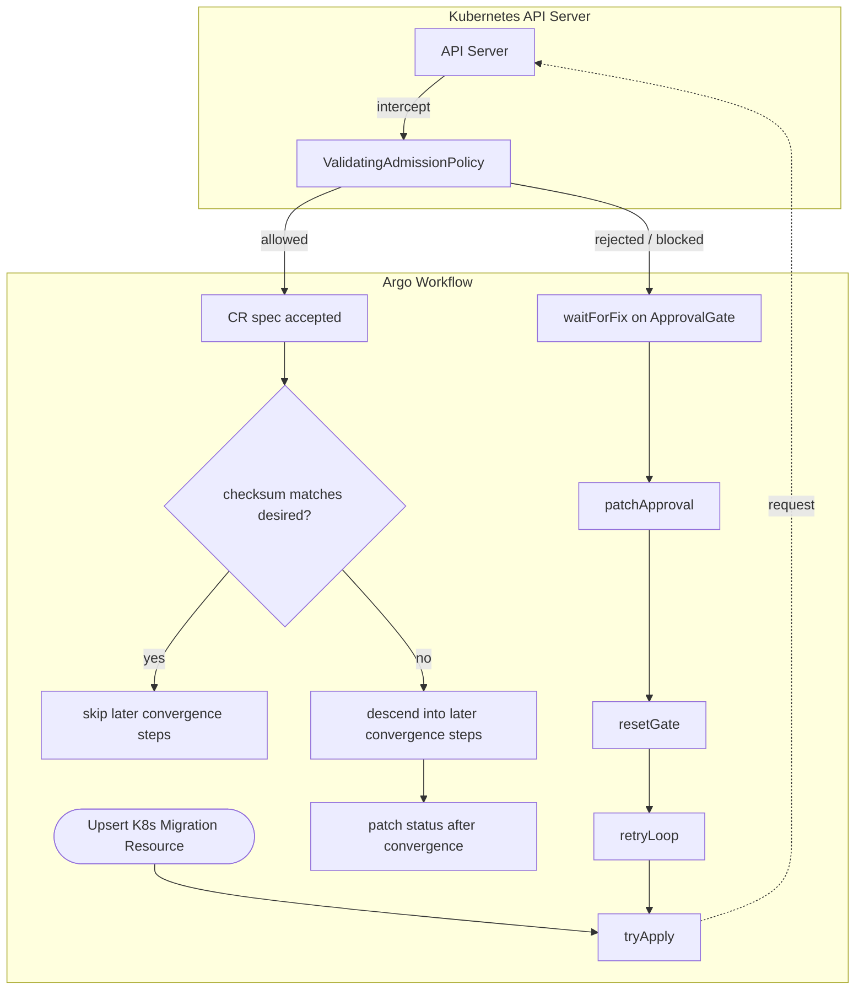

# State-Aware Resource Management for Migration Workflows

> **Status:** Implementation Plan (Ready for Review)

## Context

The migration workflow currently operates in an "always create" mode using `kubectl apply`. This works well for initial deployments but creates risks and inefficiencies during subsequent runs:

1. **Re-running workflows:** Should skip creation if a resource exists with the exact same configuration (Idempotency).
2. **Configuration drift:** Some changes (e.g., replica counts) require careful handling; others (e.g., storage type) must be blocked entirely.
3. **Protecting production:** Dangerous or disruptive changes should never silently apply; they must be gated by human approval.

**Implementation Targets:**

* Phase 1 (Completed): Kafka cluster infrastructure via `KafkaCluster` plus underlying Strimzi resources.
* Phase 2 (Current): `CapturedTraffic`, `CaptureProxy`, `DataSnapshot`, `SnapshotMigration`, and `TrafficReplay`.

### CRD Design

Each migration component is represented by a single CRD that holds both the desired configuration (`.spec`) and the lifecycle state (`.status.phase`). This follows the standard Kubernetes pattern — there are no separate "config" and "resource" CRDs.

The key contract is:

* `.spec` is the desired configuration for the resource.
* `.status.phase` and `.status.configChecksum` describe the last configuration that the workflow actually finished applying.

This means a workflow run must update the CRD `spec` before descending into child-resource reconciliation, but it must only restamp the CRD `status` after the child resources have successfully converged. Waiters and skip logic key off `status`, not just `spec`.

The resource types are:

* **`KafkaCluster`** — workflow-managed Kafka cluster infrastructure (long-lived, transitions to `Ready`)
* **`CapturedTraffic`** — capture stream / Kafka topic contract (long-lived, transitions to `Ready`)
* **`CaptureProxy`** — live capture proxy deployment and serving configuration (long-lived, transitions to `Ready`)
* **`DataSnapshot`** — snapshot operation parameters and lifecycle (terminal, transitions to `Completed`)
* **`SnapshotMigration`** — metadata migration + document backfill (RFS) config and lifecycle (terminal, transitions to `Completed`)
* **`TrafficReplay`** — replay deployment and runtime configuration (long-lived, transitions to `Ready`)

### Goals

* Use Kubernetes ValidatingAdmissionPolicies (CEL) to enforce change rules at the API level.
* Route policy rejections to `ApprovalGate` checkpoints so users can approve and retry safely.
* Retain native K8s behavior for "stacked rollouts" on long-lived infrastructure.
* Ensure strict provenance: the parameters in a CRD's `.spec` must *always* perfectly match the actual deployed infrastructure or historical artifact.

---

## Architecture Overview: The ApprovalGate Retry Model

When a gated or otherwise user-intervention-requiring change is attempted on a specific resource, the workflow relies on a `tryApply -> waitForFix -> patchApproval -> resetGate -> retryLoop` loop orchestrated by Argo Workflows plus `ApprovalGate` CRs.



**Key Concept: The API Rejection is Absolute.** If a VAP rejects a change, the `kubectl apply` request for that resource is aborted. The existing resource, including its state and status, remains unchanged. The workflow does not descend into the child subtree until `tryApply` has successfully written the new root contract.

In practice, the workflow uses three layers around a managed root resource:

1. **Leaf resource apply template**
   - a non-steps `resource` template that performs the actual `kubectl apply`
   - this is the only layer that can naturally expose fields from the applied object via `jsonPath` outputs
2. **Retry / approval wrapper**
   - a `steps` template that runs:
     - `tryApply`
     - `waitForFix`
     - `patchApproval`
     - `resetGate`
     - `retryLoop`
   - if `tryApply` succeeds, this wrapper bubbles the applied-object outputs up to the parent
   - if `tryApply` fails, this wrapper owns the approval/manual-fix loop and retries
3. **Parent lifecycle/orchestration steps**
   - compare the returned checksum to the desired checksum for the run
   - if it matches, skip the subtree
   - if it differs, descend into child-resource reconciliation
   - after convergence, patch final success state in the root CR

The individual child step names have stable roles:

* **`tryApply`** — the actual root CR apply attempt
* **`waitForFix`** — waits on the `ApprovalGate` when the apply failed and user action is required
* **`patchApproval`** — patches the workflow UID approval annotation onto the target resource
* **`resetGate`** — resets the gate back to `Pending` so it can be used again on the next retry
* **`retryLoop`** — recursively re-enters the retry wrapper

After child convergence, some resources may also have a small finalization wrapper that groups together the last bookkeeping actions. For example, Kafka finalization includes both stamping the checksum annotation on the underlying Strimzi `Kafka` resource and patching `KafkaCluster.status` to `Ready` with the new checksum.

### Materializing this into Argo Workflows

Generally, boilerplate is grouped together with 'business logic' coming right after.

* **inside the reconcile wrapper**
  * steps that are about getting the **root CR spec accepted**
  * examples:
    * `tryApply`
    * `waitForFix`
    * `patchApproval`
    * `resetGate`
    * `retryLoop`
* **outside the reconcile wrapper**
  * steps that are about **child-resource convergence**, e.g. `patchKafkaClusterReady`
  * plus the final patch that records successful convergence in the root CR status

So, in the current model:

1. the reconcile wrapper proves that the new root contract is acceptable
2. later workflow steps decide whether to skip or continue based on the returned checksum
3. if work is still needed, later steps perform child-resource convergence
4. only after that succeeds does the workflow patch the final success state in the root CR

"Descend" in this design means:

* continue into the **later convergence steps**
* not necessarily recurse into a nested subtree template

The important distinction is stage, not whether the next operation happens in the same template or a child template:

* **reconcile wrapper** = accept and retry the root contract
* **later convergence steps** = perform the actual infrastructure work if the returned checksum says it is still needed
* **final status patch** = record that the contract has now been successfully realized

---

## Field Classification

Changes to resources fall into three categories.

1. **Impossible:** Cannot be done — the user must explicitly delete & recreate the resource. This branch of the workflow cannot be advanced without .
2. **Gated:** Requires explicit approval annotation (injected via the Workflow) to proceed.
3. **Safe:** Low-risk, allowed dynamically without approval. Safe fields require no VAP expressions — they are included in the classification tables for coverage tracking only.

For terminal resources in `Completed` state, the [Lock-on-Complete](#the-lock-on-complete-pattern-terminal-resources-only) pattern overrides all categories — every spec change becomes Impossible.

### Checksum Materiality — Schema-Driven Per-Dependency Checksums

Each field classification table includes columns showing whether a field is **material to the checksum** for each downstream dependency. A field is material if changing it would alter the behavior or correctness of the downstream consumer — meaning the downstream should block and re-evaluate when this field changes.

Fields that are purely operational (replica counts, resource limits, logging, observability endpoints) are not material — downstream consumers don't care if the proxy scaled from 2 to 4 replicas.

The dependency graph for checksum propagation:

```
Kafka ──→ Proxy (CapturedTraffic) ──→ DataSnapshot ──→ SnapshotMigration ──→ TrafficReplay
  │                    │                                        │
  │                    └────────────────────────────────────────→│
  └─────────────────────────────────────────────────────────────→│
```

Each arrow represents a "waits for" relationship. Downstream waiters check a **per-dependency checksum** on the upstream resource — not a single monolithic hash.

#### Schema annotations as the source of truth

Checksum materiality and change restriction categories are encoded directly on the Zod schema using `.meta()`:

```typescript
listenPort: z.number()
    .describe("TCP port the capture proxy listens on...")
    .meta({
        checksumFor: ['snapshot', 'replayer'],
        changeRestriction: 'impossible'
    })

podReplicas: z.number().default(1).optional()
    .describe("Number of proxy pod replicas...")
    .meta({
        // no checksumFor — purely operational
        changeRestriction: 'safe'
    })
```

The `checksumFor` array names the downstream dependencies whose checksum includes this field. The `changeRestriction` classifies the field for VAP generation (`'impossible'`, `'gated'`, or `'safe'`/omitted).

These annotations drive:
1. **Config transformer** — computes per-dependency checksums by selecting only fields tagged for each dependency
2. **Doc generation** — populates the checksum columns in the field classification tables
3. **VAP generation** — (future) generates CEL expressions from the restriction categories

#### Per-dependency checksums in CRD status

Each CRD carries its self-checksum plus named downstream checksums as flat fields in `.status`:

```yaml
status:
  phase: Ready
  configChecksum: "abc123"           # self — all spec fields, used for lifecycle skip
  checksumForSnapshot: "def456"      # subset of fields that affect snapshots
  checksumForReplayer: "def456"      # subset of fields that affect the replayer
```

Downstream waiters check the checksum relevant to them:

```yaml
# Snapshot waiter checking the proxy:
successCondition: status.phase == Ready, status.checksumForSnapshot == <expected>

# Replayer waiter checking the proxy:
successCondition: status.phase == Ready, status.checksumForReplayer == <expected>
```

This means a change to `podReplicas` (not in any `checksumFor`) changes the self-checksum (triggering a re-deploy of the proxy) but does **not** change the downstream checksums — so the snapshot and replayer waiters are unaffected and don't re-run.

### CaptureProxy (`migrations.opensearch.org/CaptureProxy`)

Downstream dependencies that consume the proxy's checksum:
- **Snapshot** — waits for the proxy to be Ready before creating a snapshot of the source cluster
- **Replayer** — replays the captured traffic; sensitive to anything that changes what traffic is captured or how it's encoded

| Field | Category   | Rationale | Restart Required? | In Checksum For: Snapshot | In Checksum For: Replayer |
| --- |------------| --- | --- | --- | --- |
| `spec.listenPort` | Impossible | Changing breaks all client connections | N/A | ✅ | ✅ |
| `spec.noCapture` | **Gated**  | Fundamentally changes proxy behavior | Yes (rolling) | ✅ | ✅ |
| `spec.enableMSKAuth` | **Gated**  | Auth mode change is destructive | Yes (rolling) | ❌ | ❌ |
| `spec.kafkaClusterName` | **Gated** | Changes which Kafka cluster receives captured traffic | Yes (rolling) | ❌ | ❌ |
| `spec.kafkaTopicName` | **Gated** | Changes which topic receives captured traffic | Yes (rolling) | ❌ | ❌ |
| `spec.tls.mode` | **Gated**  | TLS mode switch requires cert/secret changes | Yes (rolling) | ❌ | ❌ |
| `spec.podReplicas` | Safe       | Scaling is safe, Deployment handles rolling | No | ❌ | ❌ |
| `spec.resources` | Safe       | Resource limits/requests | Yes (rolling) | ❌ | ❌ |
| `spec.internetFacing` | Impossible | Changes load balancer scheme; recreate Service | N/A | ❌ | ❌ |
| `spec.loggingConfigurationOverrideConfigMap` | Safe       | Logging config swap | Yes (rolling) | ❌ | ❌ |
| `spec.otelCollectorEndpoint` | Safe       | Observability config | Yes (rolling) | ❌ | ❌ |
| `spec.setHeader` | Gated      | Header injection tweaks | Yes (rolling) | ✅ | ✅ |
| `spec.destinationConnectionPoolSize` | Safe       | Connection tuning | Yes (rolling) | ❌ | ❌ |
| `spec.destinationConnectionPoolTimeout` | Safe       | Connection tuning | Yes (rolling) | ❌ | ❌ |
| `spec.kafkaClientId` | Safe       | Client identity change | Yes (rolling) | ❌ | ❌ |
| `spec.maxTrafficBufferSize` | Gated       | Performance tuning | Yes (rolling) | ❌ | ❌ |
| `spec.numThreads` | Safe       | Performance tuning | Yes (rolling) | ❌ | ❌ |
| `spec.sslConfigFile` | Safe       | Legacy SSL config path | Yes (rolling) | ❌ | ❌ |
| `spec.suppressCaptureForHeaderMatch` | **Gated**  | Traffic filtering changes | Yes (rolling) | ✅ | ✅ |
| `spec.suppressCaptureForMethod` | **Gated**  | Traffic filtering changes | Yes (rolling) | ✅ | ✅ |
| `spec.suppressCaptureForUriPath` | **Gated**  | Traffic filtering changes | Yes (rolling) | ✅ | ✅ |
| `spec.suppressMethodAndPath` | **Gated**  | Traffic filtering changes | Yes (rolling) | ✅ | ✅ |

*(Note: Kafka and KafkaNodePool resources follow similar matrices established in Phase 1).*

### TrafficReplay (`migrations.opensearch.org/TrafficReplay`)

The replayer has no downstream dependencies — nothing waits on it. The checksum column here tracks whether a field is material to the replayer's *own* checksum (i.e., would a change require re-evaluation of the replayer's correctness, or is it purely operational).

| Field | Category | Rationale | Restart Required? | In Own Checksum |
| --- | --- | --- | --- | --- |
| `spec.kafkaTrafficEnableMSKAuth` | Impossible | Kafka auth mode — changing breaks the consumer connection | N/A | ✅ |
| `spec.kafkaTrafficPropertyFile` | Impossible | Kafka connection properties — fundamental to consumer setup | N/A | ✅ |
| `spec.removeAuthHeader` | **Gated** | Toggles auth header stripping | Yes (rolling) | ✅ |
| `spec.transformerConfig` | **Gated** | Changes traffic transformation — could corrupt replay | Yes (rolling) | ✅ |
| `spec.transformerConfigEncoded` | **Gated** | Same as above, different encoding | Yes (rolling) | ✅ |
| `spec.transformerConfigFile` | **Gated** | Same as above, file reference | Yes (rolling) | ✅ |
| `spec.tupleTransformerConfig` | **Gated** | Tuple-level transformation | Yes (rolling) | ✅ |
| `spec.tupleTransformerConfigBase64` | **Gated** | Same | Yes (rolling) | ✅ |
| `spec.tupleTransformerConfigFile` | **Gated** | Same | Yes (rolling) | ✅ |
| `spec.podReplicas` | Safe | Scaling is safe, Deployment handles rolling | No | ❌ |
| `spec.resources` | Safe | Resource limits/requests | Yes (rolling) | ❌ |
| `spec.jvmArgs` | Safe | JVM tuning | Yes (rolling) | ❌ |
| `spec.loggingConfigurationOverrideConfigMap` | Safe | Logging config swap | Yes (rolling) | ❌ |
| `spec.otelCollectorEndpoint` | Safe | Observability config | Yes (rolling) | ❌ |
| `spec.speedupFactor` | Safe | Replay rate tuning | Yes (rolling) | ❌ |
| `spec.lookaheadTimeSeconds` | Safe | Buffer tuning | Yes (rolling) | ❌ |
| `spec.maxConcurrentRequests` | Safe | Performance tuning | Yes (rolling) | ❌ |
| `spec.numClientThreads` | Safe | Performance tuning | Yes (rolling) | ❌ |
| `spec.observedPacketConnectionTimeout` | Safe | Timeout tuning | Yes (rolling) | ❌ |
| `spec.quiescentPeriodMs` | Safe | Timing tuning | Yes (rolling) | ❌ |
| `spec.targetServerResponseTimeoutSeconds` | Safe | Timeout tuning | Yes (rolling) | ❌ |
| `spec.userAgent` | Safe | Cosmetic | Yes (rolling) | ❌ |

### DataSnapshot (`migrations.opensearch.org/DataSnapshot`)

Terminal resource that is created with what is effectively a job.
This transitions to `Completed`. 
Lock-on-Complete freezes the entire spec once done.
All fields here are impossible to edit.  If a user wanted to change a snapshot
in-progress, they would need to delete the existing snapshot and redrive.

Downstream dependencies that consume the snapshot's checksum:
- **SnapshotMigration** — waits for the snapshot to be Completed before running metadata migration and/or document backfill

Since all spec fields are frozen on completion, every field is inherently material to the checksum. The distinction here is whether a field change would invalidate the downstream SnapshotMigration's correctness (requiring it to re-run) vs. being purely operational to the snapshot job itself.

| Field | Category | In Checksum For: SnapshotMigration |
| --- | --- | --- |
| Snapshot config (compression, global state, allowlist, etc.) | Impossible (Lock-on-Complete) | ✅ |
| Repo config (S3 path, region, etc.) | Impossible (Lock-on-Complete) | ✅ |

### SnapshotMigration (`migrations.opensearch.org/SnapshotMigration`)

Terminal resource — transitions to `Completed`. Lock-on-Complete freezes the entire spec once done. A SnapshotMigration contains one or more sub-tasks, each optionally including metadata migration and/or document backfill (RFS).

Downstream dependencies that consume the migration's checksum:
- **Replayer** — waits for the migration to be Completed before starting replay (ensures the target cluster has the expected index mappings and backfilled data)

**Metadata migration fields:**

This transitions to 'Completed'.
Lock-on-Complete freezes the entire spec once done.
All fields here are impossible to edit.  If a user wanted to change a snapshot
in-progress, they would need to delete the existing snapshot and redrive.

**Document backfill (RFS) fields:**

| Field | Category   | Rationale | In Checksum For: Replayer |
| --- |------------| --- | --- |
| `spec.documentBackfillConfig.indexAllowlist` | Impossible | | ✅ |
| `spec.documentBackfillConfig.podReplicas` | Safe       | | ❌ |
| `spec.documentBackfillConfig.allowLooseVersionMatching` | Impossible | | ✅ |
| `spec.documentBackfillConfig.docTransformerConfigBase64` | Impossible | | ✅ |
| `spec.documentBackfillConfig.documentsPerBulkRequest` | Safe       | | ❌ |
| `spec.documentBackfillConfig.initialLeaseDuration` | Gated      | | ❌ |
| `spec.documentBackfillConfig.maxConnections` | Gated      | | ❌ |
| `spec.documentBackfillConfig.maxShardSizeBytes` | Gated      | | ❌ |
| `spec.documentBackfillConfig.otelCollectorEndpoint` | Safe       | | ❌ |
| `spec.documentBackfillConfig.useTargetClusterForWorkCoordination` |  Safe          | | ❌ |
| `spec.documentBackfillConfig.jvmArgs` |  Safe          | | ❌ |
| `spec.documentBackfillConfig.loggingConfigurationOverrideConfigMap` |   Safe         | | ❌ |
| `spec.documentBackfillConfig.resources` |    Safe        | | ❌ |

---

## Resource Lifecycle & State Machine

Migration CRD resources follow a common lifecycle tracked natively in the `.status.phase` subresource.

### Terminal vs. Long-Lived Resources

`Ready` and `Completed` are sibling states; a resource will transition to one or the other based on its operational lifespan.

| State | Meaning | Used By |
| --- | --- | --- |
| `Initialized` | Placeholder — created by the initialization process but not yet acted upon. | All |
| `Running` | Work is in progress (deployment rolling out, snapshot copying). | All |
| `Ready` | Infrastructure is healthy, operational, and serving traffic. | **Long-Lived** (Proxy, Kafka) |
| `Completed` | A finite task has finished successfully. The output is immutable. | **Terminal** (Snapshots) |
| `Error` | Execution failed. The resource is "poisoned". | All |

Bootstrap placeholder resources are created during the migration initialization step (before the Argo workflow starts) so that downstream `waitFor` steps can find them. The initializer creates each CRD resource with only the minimal bootstrap fields needed up front, plus `status.phase: Initialized` and an empty `status.configChecksum`. The workflow's first successful `tryApply` writes the real desired spec contract.

### The "Fail Forward / Poison Resource" Principle

If infrastructure deployment fails, **we do not attempt a rollback**. The workflow simply updates the CRD's `.status.phase` to `Error` and halts. The resource is considered "poisoned." It is the user's responsibility to push a new, valid configuration through the workflow to overwrite the poisoned state. This guarantees the CRD `.spec` is never artificially manipulated behind the scenes, ensuring strict provenance.

### The "Spec First, Status After Convergence" Principle

For managed CRDs, the workflow uses the following order:

1. Reconcile the CRD `.spec` to the new desired configuration.
2. If that succeeds, descend into the child-resource subtree.
3. Only after the child-resource subtree succeeds, patch:
   * `.status.phase`
   * `.status.configChecksum`
   * any other readiness/completion status fields used by waiters

This keeps the meaning of status precise:

* `.spec` says what the workflow is trying to make true.
* `.status` says what configuration the workflow most recently finished making true.

That distinction is what makes checksum-based skip logic meaningful.

This is important even though reconciliation is still driven by the workflow rather than by a controller watching the CR.

The main reason to write `spec` first is durability of intent:

* VAP evaluates the real requested root-CR change, not just workflow-local inputs.
* once a safe change is accepted, or a gated change is approved and accepted, that desired contract is durably recorded in the CR immediately
* if the workflow is deleted or replaced while child resources are still converging, the accepted desired change is not lost
* the next workflow run can resume from:
  * `.spec` = the desired, already-approved contract
  * `.status` = the last successfully applied contract

That means a restarted workflow does not need to rediscover or reinterpret the user's approved intent. It only needs to compare the desired contract in `.spec` to the last applied contract in `.status` and continue reconciling the child subtree.

If the workflow waited to update `spec` until after child convergence, the CR would only be a placeholder during reconciliation. Approval could be consumed, child deployment could start, and then a workflow teardown could lose the durable record of what change had already been accepted.

---

## The Workflow UID Approval Pattern

We tie approvals directly to the specific Argo Workflow execution requesting the change.

**The Flow:**

1. **`tryApply`:** Argo attempts the update. The incoming manifest includes an Argo label: `workflows.argoproj.io/run-uid: {{workflow.uid}}`.
2. **The Block:** The VAP sees a gated change, looks for a matching approval annotation, does not find it, and rejects the update.
3. **`waitForFix`:** The workflow waits on the corresponding `ApprovalGate` resource instead of using an Argo suspend node.
4. **`patchApproval`:** After the user approves the gate, the workflow patches the target resource:
   `kubectl patch <resource> <name> --type=merge -p '{"metadata":{"annotations":{"migrations.opensearch.org/approved-by-run": "{{workflow.uid}}"}}}'`
5. **`resetGate`:** The workflow sets the `ApprovalGate` phase back to `Pending`.
6. **`retryLoop`:** The workflow loops back and attempts the exact same `kubectl apply`.
7. **The Pass:** The VAP sees the gated change, and evaluates `object.metadata.annotations['...approved-by-run'] == object.metadata.labels['workflows.argoproj.io/run-uid']`. The change is allowed.

**CEL Implementation Example** *(abbreviated — full policy covers all Gated fields from the classification table)*:

```yaml
validations:
  - expression: |
      # Condition 1: No Gated fields changed
      (object.spec.enableMSKAuth == oldObject.spec.enableMSKAuth &&
       object.spec.noCapture == oldObject.spec.noCapture) 
      ||
      # Condition 2: Workflow UID matches the approval annotation
      (has(object.metadata.annotations) &&
       has(object.metadata.annotations['migrations.opensearch.org/approved-by-run']) &&
       has(object.metadata.labels['workflows.argoproj.io/run-uid']) &&
       object.metadata.annotations['migrations.opensearch.org/approved-by-run'] == object.metadata.labels['workflows.argoproj.io/run-uid'])
    message: "Gated changes detected. Approve the corresponding ApprovalGate."

```

---

## Advanced Patterns: Provenance & Idempotency

### The "Lock-on-Complete" Pattern (Terminal Resources Only)

This pattern strictly applies to **completed work products** (e.g., `DataSnapshot`). It freezes the resource's `.spec` to guarantee provenance and enables safe subgraph skipping in Argo.

* **Idempotent Run:** If a user re-runs a workflow against a completed snapshot with the exact same parameters, K8s treats it as a `200 OK` No-Op. Argo sees `status.phase == Completed` and safely skips the subgraph.
* **Changed Parameters:** If a user changes *any* parameter (even a "Safe" one) and re-runs, the VAP rejects the update with a 403. Silently accepting the change would break provenance — the `.spec` would no longer reflect the historical execution. The user must delete the stale artifact to run a new job with different parameters.

*(Note: Because the Kubernetes API passes the fully populated `oldObject` to the VAP during a spec update, we read `.status` directly. No dual-metadata tracking or annotations are required for state locking).*

**CEL Implementation:**

```yaml
validations:
  # Lock-on-Complete: Freeze spec for finished work products natively via status
  - expression: |
      !has(oldObject.status) ||
      !has(oldObject.status.phase) ||
      oldObject.status.phase != 'Completed' ||
      (object.spec == oldObject.spec)
    message: "Consistency Guard: This resource is 'Completed'. The specification is permanently sealed to maintain provenance. Delete the resource to run a new job with these parameters."

```

*(Note: There is explicitly **no** "Running Guard" in this architecture. Long-lived infrastructure supports native K8s stacked rollouts. If a Proxy is `Running`, the user is free to push a corrective workflow over it immediately, governed purely by the standard Gated/Impossible field checks).*

### CRD Upgrade "In-Flight" Handling

To prevent VAPs from breaking when a CRD is upgraded (e.g., a new optional field is added), always use the CEL `has()` operator for new fields.

```yaml
- expression: |
    !has(object.spec.newFeature) || 
    object.spec.newFeature == oldObject.spec.newFeature

```

---

## Efficient Argo Execution: Config Checksum Chaining

### Problem

Resources have cross-branch dependencies (e.g., the replayer waits for the proxy). Previously, waiters checked `status.phase == Ready`, but this has a race condition: on re-run, the phase is already `Ready` from the prior run, so downstream waiters proceed immediately — before the current workflow has verified whether the upstream config changed.

### Solution: Config Checksums

Each resource carries a `status.configChecksum` — a SHA-256 hash of its effective configuration. Downstream waiters check the checksum instead of the phase, ensuring they only proceed when the upstream resource's config matches what the current workflow expects.

**Checksum computation** happens in the config processor at generation time:

1. For each resource, hash all spec fields that will be applied to the CRD
2. For resources with upstream dependencies, fold the upstream checksums into the hash
3. Emit the checksum alongside the denormalized config

**Chaining example:**

```
KafkaCluster checksum = sha256(kafkaClusterSpec)
CapturedTraffic checksum = sha256(topicSpec + KafkaCluster.checksum)
CaptureProxy checksum = sha256(proxySpec + CapturedTraffic.checksum)
TrafficReplay checksum = sha256(replayerSpec + CaptureProxy.checksum)
```

If the Kafka cluster config changes, its checksum changes, which cascades through the proxy and replayer checksums — even if their own spec fields didn't change.

**Runtime flow:**

1. Config processor computes all checksums and includes them in the workflow config
2. The initializer creates placeholder CRDs with `status.phase: Initialized`, an empty `status.configChecksum`, and only the minimal bootstrap fields needed before the workflow starts
3. The initializer also emits helper scripts because CRD status must be patched through the `/status` subresource separately from the initial create/apply
4. Lifecycle templates only stamp the final success state and the new `status.configChecksum` after the child-resource subtree succeeds
5. Waiters compare both lifecycle state and checksum for CRDs, and compare Strimzi readiness plus a checksum annotation for Kafka

**Re-run scenarios:**

| Scenario | What happens |
|----------|-------------|
| Nothing changed | The stored `status.configChecksum` already matches the desired checksum for this run. Waiters resolve instantly and lifecycle templates skip subtree work. |
| Proxy config changed | Proxy checksum changes → replayer expected checksum changes. Replayer waiter blocks until proxy lifecycle completes and stamps new checksum. |
| Kafka config changed | Kafka checksum changes → proxy checksum changes → replayer checksum changes. Full cascade, all waiters block until upstream completes. |
| Only replayer config changed | Proxy/Kafka checksums unchanged, waiters resolve instantly. Only replayer lifecycle runs. |

### Lifecycle Template Pattern

```
checkPhase
  → if checksum differs for this run:
      tryApply → descend into child subtree → patch*Ready/patch*Completed
```

The "already done" check is checksum-based:

* if `status.configChecksum == <desired-checksum>`, the workflow treats that resource as already done and skips the subtree
* if the checksum is empty, missing, or different, the workflow descends and reconciles the subtree

For CRDs we own, the checksum is carried in `status.configChecksum` and is written only when the resource has successfully reached `Ready` / `Completed` for the new desired configuration.

For Kafka, we do not own the `status` subresource, so the workflow patches `metadata.annotations["migration-configChecksum"]` after the Strimzi resource has been applied.

### Waiter Pattern

```yaml
CapturedTraffic:
successCondition: status.phase == Ready, status.configChecksum == <expected-checksum>

DataSnapshot / SnapshotMigration:
successCondition: status.phase == Completed, status.configChecksum == <expected-checksum>

Kafka:
successCondition: status.listeners, metadata.annotations.migration-configChecksum == <expected-checksum>
```

The checksum is not used alone in the CRD waiters; it is paired with the expected terminal lifecycle state so the workflow still distinguishes "not done yet" from "done with the wrong config."

### Accepted Risk: Drift Without a Controller

This model intentionally accepts one limitation:

* if a child resource drifts or is deleted outside the workflow, but the root CRD still carries the old successful checksum, a rerun may skip that subtree

That risk is acceptable for now. The checksum in `status` is treated as the workflow's durable record of the last successfully applied contract, not as a continuously reconciled proof of real-time child-resource health. If the project later needs stronger guarantees, that would require either:

* a controller continuously reconciling child resources from the root CR, or
* an additional child-state proof before skip

The current workflow design deliberately does not require either of those before using checksum-based skip behavior.


---

## Adding a New Managed Resource

When adding a new migration component (e.g., a traffic replayer), follow this checklist. Each step has a concrete file and pattern to follow.

### 1. Define the CRD

Add to `migrationCrds.yaml`. Each resource is a single CRD with configuration in `.spec` and lifecycle in `.status.phase`. Choose the lifecycle type:

* **Long-lived** (proxy, replayer): phases `[Initialized, Running, Ready, Error]`
* **Terminal** (snapshot, migration job): phases `[Initialized, Running, Completed, Error]`

Include a typed schema for every spec field — don't use `x-kubernetes-preserve-unknown-fields` on the spec root. This enables CEL field-level comparisons in VAPs.

### 2. Add RBAC

Add the resource and its `/status` subresource to the `workflow-deployer-role` in `workflowRbac.yaml`:

```yaml
resources: ["trafficreplays", "trafficreplays/status"]
```

### 3. Classify fields

For every spec field, decide:

| Category | Meaning | VAP action |
|----------|---------|------------|
| **Impossible** | Cannot change without delete/recreate (e.g., listen port, index allowlist) | Hard block, no escape hatch |
| **Gated** | Risky but allowed with explicit approval (e.g., auth mode, TLS config) | Block unless UID annotation matches |
| **Safe** | Low-risk, always allowed (e.g., replica count, logging config) | No VAP expression needed |

For terminal resources, Lock-on-Complete overrides everything once `status.phase == Completed`.

### 4. Write the VAP

Add a `ValidatingAdmissionPolicy` + `ValidatingAdmissionPolicyBinding` to `validatingAdmissionPolicies.yaml`.

Pattern for Impossible fields:
```yaml
- expression: |
    !has(oldObject.spec.fieldName) || !has(object.spec.fieldName) ||
    object.spec.fieldName == oldObject.spec.fieldName
  message: "Impossible: fieldName cannot be changed. Delete and recreate."
```

Pattern for Gated fields (all share a single UID check):
```yaml
- expression: |
    (field1 unchanged && field2 unchanged && ...)
    ||
    (has(object.metadata.annotations) &&
     'migrations.opensearch.org/approved-by-run' in object.metadata.annotations &&
     has(object.metadata.labels) &&
     'workflows.argoproj.io/run-uid' in object.metadata.labels &&
     object.metadata.annotations['migrations.opensearch.org/approved-by-run'] ==
       object.metadata.labels['workflows.argoproj.io/run-uid'])
  message: "Gated changes detected. Approve the corresponding ApprovalGate."
```

Use `has()` on every field to handle CRD upgrades where the field didn't previously exist.

For terminal resources, also add them to the `lock-on-complete-policy` resource list.

### 5. Add initializer placeholder

In `migrationInitializer.ts`, create the resource with only the minimal bootstrap fields it needs before workflow execution (for example, dependency links or identity fields needed by waiters), plus `status: { phase: "Initialized", configChecksum: "" }`. Do **not** duplicate the full desired spec contract in the initializer; the workflow-owned `tryApply` step is the canonical place that writes the full root spec.

If the resource is a CRD with a status subresource, make sure the initializer also emits the corresponding status patch handling in the generated resource handler script.

### 6. Build the manifest builder function

In the appropriate workflow template file (e.g., `setupReplay.ts`), create a function that maps config fields to the CRD spec field-by-field:

```typescript
function makeTrafficReplayManifest(config, name) {
    return {
        apiVersion: "migrations.opensearch.org/v1alpha1",
        kind: "TrafficReplay",
        metadata: {
            name: name,
            labels: {
                "workflows.argoproj.io/run-uid": makeStringTypeProxy(expr.getWorkflowValue("uid"))
            }
        },
        spec: {
            // Each field individually via expr.get()/expr.dig()
        }
    };
}
```

### 7. Thread checksum dependencies through the workflow config

If the new resource depends on other resources, include their checksum(s) in the denormalized config emitted by the config processor and fold them into the new resource's checksum.

Examples from the current implementation:

* Proxy checksum includes the Kafka checksum
* Snapshot checksum includes dependent proxy checksums
* Replay checksum includes the upstream proxy checksum

This is what makes re-runs block on the correct upstream resource version instead of merely on a historical `Ready` / `Completed` phase.

### 8. Add checksum-aware waiters

In `resourceManagement.ts`, define the waiter so it checks both:

* the resource has reached the correct lifecycle state
* the resource's checksum matches the expected checksum for this workflow run

For external resources whose status we do not own, store the checksum in metadata annotations instead of status.

The `run-uid` label is required for the Workflow UID Approval Pattern.

### 9. Add apply + retry templates

Three templates, layered:

1. **Leaf apply** — `action: "apply"` with the manifest. In current templates this is usually the `apply<Resource>` or `apply<Resource>Cr` template. Includes `K8S_RESOURCE_RETRY_STRATEGY`.
2. **Retry wrapper** — catches apply failures with `continueOn: {failed: true}`, then runs the current step sequence:
   * `tryApply`
   * `waitForFix`
   * `patchApproval`
   * `resetGate`
   * `retryLoop`
3. **Lifecycle wrapper** — calls the retry template, then descends into the child-resource subtree and finally patches the terminal success state:
   * `patch<Resource>Ready`
   * or `patch<Resource>Completed`

The current workflow does not use Argo suspend/resume nodes for approval. It uses `ApprovalGate` resources and the named steps above.

### 10. Wire into the parent workflow

Call the lifecycle template from `fullMigration.ts` (or the appropriate orchestration template). The parent workflow should not manage phases — that's encapsulated in the lifecycle template.

### 11. Add a Helm test

Create a test pod in `templates/tests/` modeled on `test-vap-kafka.yaml`. The test should:

1. Create the resource
2. Apply a spec (should succeed on `Initialized`)
3. Try an Impossible field change (should fail)
4. Try a Gated field change without approval (should fail)
5. Add matching UID label + annotation, retry the Gated change (should succeed)
6. Try with mismatched UIDs (should fail)
7. For terminal resources: patch to `Completed`, try any spec change (should fail via Lock-on-Complete)

### File summary

| File | What to add |
|------|-------------|
| `migrationCrds.yaml` | CRD with typed schema + status phases |
| `workflowRbac.yaml` | Resource + `/status` in deployer role |
| `validatingAdmissionPolicies.yaml` | Policy + binding (Impossible, Gated, optionally Lock-on-Complete) |
| `migrationInitializer.ts` | Placeholder creation |
| `setup<Component>.ts` | Manifest builder + apply/retry/lifecycle templates |
| `fullMigration.ts` | Call the lifecycle template |
| `templates/tests/test-vap-<component>.yaml` | Helm test for VAP rules |
