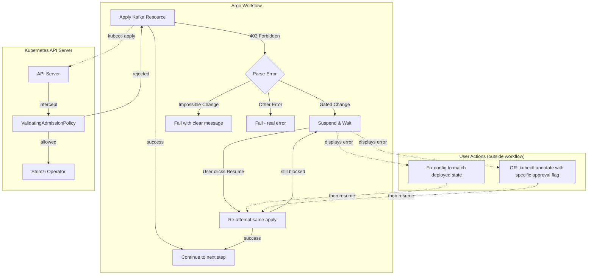
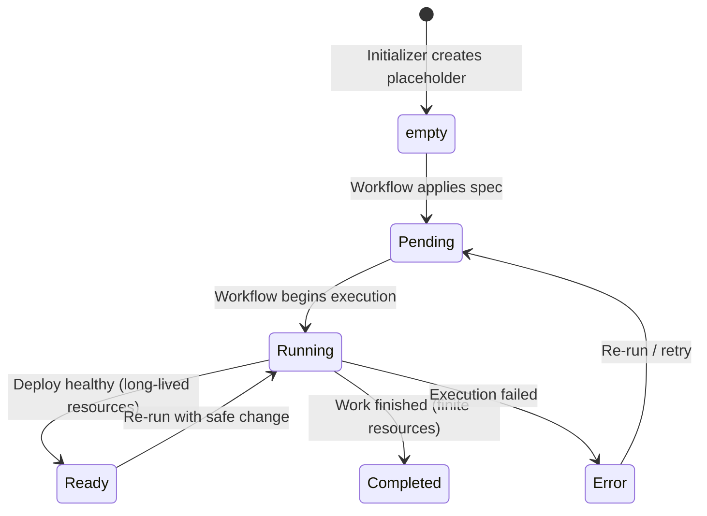
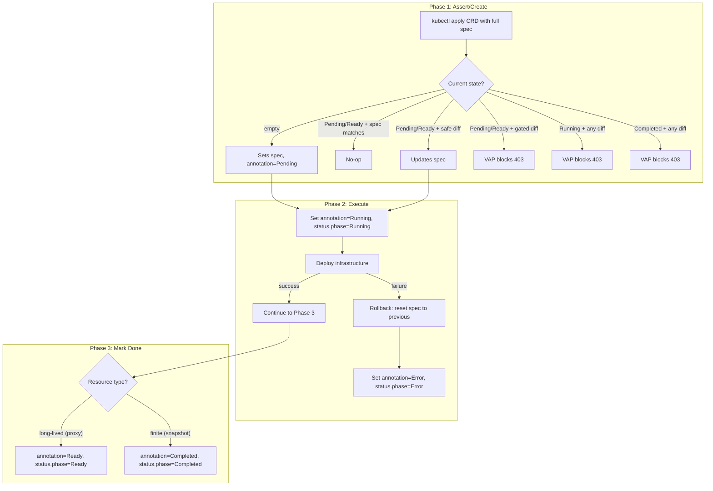

# State-Aware Resource Management for Migration Workflows

> **Status:** Implementation Plan (Ready for Review)

## Context

The migration workflow currently operates in an "always create" mode using `kubectl apply`. This works for initial deployments but creates problems when:

1. **Re-running workflows** - Should skip creation if resource exists with same config
2. **Configuration drift** - Some changes (replica count) require careful handling; others (storage type) should be blocked
3. **Protecting production** - Dangerous changes shouldn't silently apply

**First implementation target**: Kafka cluster (`Kafka`), `KafkaNodePool`, and `KafkaTopic` resources from Strimzi. These establish patterns for later resources (CapturedTraffic, DataSnapshot, SnapshotMigration).

### Goals

- Use Kubernetes ValidatingAdmissionPolicies (CEL) to enforce change rules at the API level
- Route policy rejections to suspend gates where users can fix and retry
- Keep parallel workflow branches running while one waits for user action
- Follow existing suspend/approval patterns from `metadataMigration.ts`

---

## Architecture Overview



### Key Design Decision: "Retry" Model

The workflow does **not** automatically inject approval annotations. When a gated change is blocked:

1. Workflow suspends and displays the VAP error message.
2. User takes manual action outside the workflow:
   - **Option A** Revert their config change to match what's already deployed or a compatible value.
   - **Option B**: Manually `kubectl annotate` the resource in need of approval.  This isn't possible for "Impossible" value changes (the user would need to pursue 'Option A').
     - This is meant to give a warning to the user because the change could create a disturbance.
3. User clicks "Resume" in Argo UI after taking manual action.
4. Workflow re-attempts the **same apply** operation - **OR** the user never does and eventually reruns the workflow with different settings.
5. Either succeeds (user resolved conflict) or fails again (loops back to suspend)

**Important**: Argo's suspend/resume continues from AFTER the suspend step, so we need a **recursive template call** to implement proper retry loops.

---

## Field Classification

### Kafka Cluster (`kafka.strimzi.io/Kafka`)

| Field | Category | Rationale | Restart Required? |
|-------|----------|-----------|-------------------|
| `metadata.name` | Impossible | Cluster identity | N/A |
| `spec.kafka.version` | **Gated** | Version changes need planning | Yes (rolling) |
| `annotations["strimzi.io/kraft"]` | Impossible | Can't switch KRaft/ZK modes | N/A |
| `spec.kafka.config.*` | Safe | Safe operational tuning | No (dynamic) |
| `spec.kafka.listeners` | Safe | Can modify with care | Yes (rolling) |

**Note on `spec.kafka.config.*`**: These are Kafka broker configs that can be changed dynamically:
- `auto.create.topics.enable` - safe
- `offsets.topic.replication.factor` - safe (only affects new topics)
- `transaction.state.log.*` - safe
- `default.replication.factor` - safe (only affects new topics)
- `min.insync.replicas` - safe

**Note on `spec.kafka.listeners`**: These define how clients connect. The workflow doesn't expose these as inputs - they're hardcoded in `makeDeployKafkaClusterKraftManifest()`. If we later expose them, they'd be outputs the user reads, not inputs they configure.

### KafkaNodePool (`kafka.strimzi.io/KafkaNodePool`)

| Field | Category | Rationale | Restart Required? |
|-------|----------|-----------|-------------------|
| `spec.replicas` | **Gated** | Scaling impacts availability/data | No (Strimzi handles rolling) |
| `spec.storage.type` | Impossible | ephemeral/persistent can't switch | N/A |
| `spec.storage.size` | **Gated** | Storage expansion depends on CSI | Depends on provider |
| `spec.roles` | Impossible | Role changes are dangerous | N/A |

**Note on replicas**: Strimzi handles replica scaling gracefully with rolling restarts. The "Gated" classification is for user awareness, not because it's dangerous.

### KafkaTopic (`kafka.strimzi.io/KafkaTopic`)

| Field | Category | Rationale | Restart Required? |
|-------|----------|-----------|-------------------|
| `metadata.labels["strimzi.io/cluster"]` | Impossible | Topic can't move clusters | N/A |
| `spec.partitions` (decrease) | Impossible | Kafka doesn't allow this | N/A |
| `spec.partitions` (increase) | Safe | Safe capacity addition | No |
| `spec.replicas` | **Gated** | Replication factor changes | No |
| `spec.config.*` | Safe | retention, segment.bytes, etc. | No (dynamic) |

**Note on `spec.config.*`**: Topic configs are dynamically applied without restart:
- `retention.ms` - safe, immediate
- `segment.bytes` - safe, affects new segments
- `cleanup.policy` - safe, immediate

### CaptureProxy (`migrations.opensearch.org/ProxyConfig`)

The columns that start with suppress have an impact on the resultant capture.  
Those values should be carried forward into the captured traffic resource and 
changes to those values would make the resource dirty for  anybody using
those resources.

| Field                                   | Category | Rationale                                    | Restart Required?       |
|-----------------------------------------|----------|----------------------------------------------|-------------------------|
| `spec.listenPort`                       | Gated    | Changing breaks all client connections       | What would this be?     |
| `spec.noCapture`                        | Gated    | Fundamentally changes proxy behavior         | Yes (rolling) |
| `spec.enableMSKAuth`                    | Gated    | Auth mode change is destructive              | Yes (rolling) |
| `spec.tls.mode`                         | Gated    | TLS mode switch requires cert/secret changes | Yes (rolling) |
| `spec.podReplicas`                      | Safe     | Scaling is safe, Deployment handles rolling  | No (rolling)            |
| `spec.resources`                        | Safe     | Resource changes trigger rolling restart     | Yes (rolling)           |
| `spec.otelCollectorEndpoint`            | Safe     | Observability config                         | Yes (rolling)           |
| `spec.setHeader`                        | Gated     | Traffic filtering tweaks                     | Yes (rolling)           |
| `spec.suppressCaptureForHeaderMatch`    | Gated     | Traffic filtering tweaks                     | Yes (rolling)           |
| `spec.suppressCaptureForMethod`         | Gated     | Traffic filtering tweaks                     | Yes (rolling)           |
| `spec.suppressCaptureForUriPath`        | Gated     | Traffic filtering tweaks                     | Yes (rolling)           |
| `spec.suppressMethodAndPath`            | Gated     | Traffic filtering tweaks                     | Yes (rolling)           |
| `spec.kafkaClientId`                    | Safe     | Client identity change                       | Yes (rolling)           |
| `spec.destinationConnectionPoolSize`    | Safe     | Connection tuning                            | Yes (rolling)           |
| `spec.destinationConnectionPoolTimeout` | Safe     | Connection tuning                            | Yes (rolling)           |
| `spec.numThreads`                       | Safe     | Performance tuning                           | Yes (rolling)           |
| `spec.maxTrafficBufferSize`             | Safe     | Performance tuning                           | Yes (rolling)           |
| Any other changes                       | Impossible | Default is to not allow any changes        | N/A                     |

**Note on gated changes with fingerprint approval**: When a change touches multiple fields that are individually safe but collectively represent a significant reconfiguration, the VAP uses a **fingerprint-based approval** annotation. See [Fingerprint-Based Approval](#fingerprint-based-approval-for-multi-field-changes) below.

**Legend:**
- **Impossible**: Cannot be done — delete & recreate the resource
- **Gated**: Requires explicit approval annotation to proceed
- **Safe**: Low-risk, allowed without approval

---

## Resource Lifecycle & State Machine

**TODO: Verify this** - I'm not sure that this is true. 

All migration CRD resources follow a common lifecycle. The workflow manages 
state transitions via both `status.phase` (for controllers/UI) and a 
`migrations.opensearch.org/phase` annotation (for VAP visibility, since CEL
cannot see `status` during UPDATE when the status subresource is enabled).

### States

**TODO:** Pending and Running seem very similar.  What's the difference?  When
should I use those and transition between them.

| State | Meaning | Who sets it |
|-------|---------|-------------|
| *(empty)* | Placeholder — initializer created the resource with no spec | Initializer |
| `Pending` | Spec has been applied, work has not started | Workflow (on first apply) |
| `Running` | Work is in progress (deployment rolling out, snapshot running, etc.) | Workflow (on execution start) |
| `Ready` | Healthy and operational — no pending changes | Workflow (on success) |
| `Completed` | Finite work is done (snapshot taken, migration finished) | Workflow (on completion) |
| `Error` | Something went wrong (future use) | Workflow (on failure) |

### Per-Resource State Subsets

**TODO:** add kafka states - and replayer ones too (need a replayer CRD)

Not every resource uses every state:

| Resource | Valid States | Notes |
|----------|-------------|-------|
| `CapturedTraffic` (proxy) | empty → Pending → Running → Ready | Proxy runs indefinitely — no Completed state |
| `DataSnapshot` | empty → Pending → Running → Completed | Finite work product |
| `SnapshotMigration` | empty → Pending → Running → Completed | Finite work product |

### State Transitions

**TODO:** If a VAP rejects a change, the entire object, including its state is unchanged, right?



### VAP Behavior by State

**TODO:** what is a spec mismatch - example please.  Is it 'impossible'?  

| Current State | Safe Change | Gated Change | Spec Mismatch |
|---------------|-------------|--------------|---------------|
| *(empty)* | Allow | Allow | N/A (no existing spec) |
| `Pending` | Allow | Block (needs approval) | Allow (not started yet) |
| `Running` | Allow | Block (needs approval) | Block (in-progress work would be invalidated) |
| `Ready` | Allow | Block (needs approval) | Allow (will re-enter Running) |
| `Completed` | Block | Block | Block — must delete & recreate |

### Annotation + Status Atomicity

The status subresource means `status` and `metadata` (including annotations) are updated via **separate API calls** — they cannot be made atomic in a single request. The workflow should:

1. Patch the annotation first (`migrations.opensearch.org/phase=Ready`)
2. Then patch the status (`status.phase=Ready`)

The VAP checks the **annotation** (which it can always see), so the annotation is the source of truth for admission control. The status is informational for controllers and UI. There is a brief window where they may disagree — this is acceptable because the VAP only gates future writes, and the annotation is always updated first.

### Two-Phase Commit Flow

**TODO:** from earlier too... how does a resource get into the pending state?
Maybe ready and running should be siblings states - some resources go from 
pending to running and others to ready.  Pending and running/ready would all,
from the VAP's rules assume that the settings will eventually be live - so all
CEL rules apply equally for any of those states.



**TODO:** - the rollback comment is wrong.  We don't have the ability to roll the state back after failure...
It should just need to stay with the same values.  The user would need to delete
all resources (container CRD and the ones below) or just keep a poison-resource
in their environment/graph.  If the underlying resource, like a proxy, was running,
and an apply-change couldn't be completed, that's fine.  It will be up to the 
user to push a new config through that DOES complete.  That's the only way to 
keep it in agreement with the provenance guarantee.

**Rollback on Phase 2 failure**: If the infrastructure deploy fails and is rolled back, the workflow must also reset the CRD resource's spec to match the actual deployed state (the previous spec). This prevents the CRD from claiming a config that isn't actually running. Without an operator to watch and reconcile, the Argo workflow is responsible for this resync — it should capture the old spec before attempting the update and restore it on failure.

**Provenance**: The CRD resource's spec always reflects the parameters that produced the currently running (or completed) artifact. Downstream consumers (e.g., snapshot workflows that depend on a proxy) can inspect the spec to determine if the upstream config has changed enough to invalidate their own work.

---

## Value-Based Approval Annotations

Each VAP check uses a **value-based approval annotation** where the annotation value must match the target value being requested. This prevents race conditions and auto-resets after the change succeeds.

| Check | Approval Annotation | Example |
|-------|---------------------|---------|
| KafkaNodePool replicas | `approved-replicas=<target>` | `approved-replicas=3` |
| KafkaNodePool storage.size | `approved-storage-size=<target>` | `approved-storage-size=10Gi` |
| Kafka version | `approved-version=<target>` | `approved-version=3.7.0` |
| KafkaTopic replicas | `approved-topic-replicas=<target>` | `approved-topic-replicas=2` |

**Benefits:**
- **No race conditions**: Approving `replicas=3` won't accidentally allow `replicas=20`
- **Auto-reset**: Once the change succeeds, the annotation value no longer matches future changes
- **Clear audit trail**: Annotation shows exactly what was approved

### skipApprovals Pattern Integration

**TODO:** - We need to be careful with how granular checks are handle - it's just too
much for the workflow or a user to manage them individually.  When a user does the approval,
we should take the resource that they've approved, grab the values & copy them in - as the manifest below shows.

**TODO:** However, the workflow should use a global value - if we're concerned 
about race conditions, we could have it key off of a unique nonce, which could 
simply be set by the workflow putting its UID into an annotation.

Following the existing `skipApprovals` pattern from `metadataMigration.ts`, we can:
1. Add approval flags to the manifest **before** apply (pre-approved)
2. Use a global `skipAllApprovals` flag with care for dev/test environments

```typescript
// In workflow, when applying resource with pre-approval:
const manifest = {
    ...baseManifest,
    metadata: {
        ...baseManifest.metadata,
        annotations: {
            ...baseManifest.metadata.annotations,
            // Add approval annotation if skipApprovals is set
            ...(skipApprovals ? {
                'migrations.opensearch.org/approved-replicas': String(baseManifest.spec.replicas),
                'migrations.opensearch.org/approved-storage-size': baseManifest.spec.storage?.size
            } : {})
        }
    }
}
```

### Fingerprint-Based Approval for Multi-Field Changes

**TODO:** - this feature could be defered.  If we're say that only workflows
can change these resources (though others can delete them), we can just use
the workflow uid (see last section) as our fingerprint.  Something like this
is still unwieldy too.

For resources like the proxy where multiple fields may change at once, per-field annotations become unwieldy. Instead, use a single **fingerprint annotation** that encodes the target values of all controlled (impossible/gated) fields. The CEL expression computes the same fingerprint from the incoming object and compares.

```yaml
# Example: Proxy fingerprint covers all impossible fields
# Annotation: migrations.opensearch.org/approved-config-fingerprint
# Value: deterministic concatenation of controlled field values
validations:
  - expression: |
      # Skip check if no impossible fields changed
      (!has(object.spec.listenPort) || !has(oldObject.spec.listenPort) ||
       object.spec.listenPort == oldObject.spec.listenPort) &&
      (!has(object.spec.noCapture) || !has(oldObject.spec.noCapture) ||
       object.spec.noCapture == oldObject.spec.noCapture) &&
      (!has(object.spec.enableMSKAuth) || !has(oldObject.spec.enableMSKAuth) ||
       object.spec.enableMSKAuth == oldObject.spec.enableMSKAuth)
      ||
      # OR: fingerprint annotation matches the full target config
      (has(object.metadata.annotations) &&
       'migrations.opensearch.org/approved-config-fingerprint' in object.metadata.annotations &&
       object.metadata.annotations['migrations.opensearch.org/approved-config-fingerprint'] ==
         string(object.spec.listenPort) + "|" +
         string(object.spec.noCapture) + "|" +
         string(object.spec.enableMSKAuth))
```

**How it works:**
1. User tries to change `listenPort` from 9200 to 9201 — VAP blocks
2. Error message tells user to set: `kubectl annotate proxyconfig/<name> migrations.opensearch.org/approved-config-fingerprint="9201|false|true" --overwrite`
3. The fingerprint value `9201|false|true` encodes the exact target state of all controlled fields
4. On next apply, CEL computes the same concatenation from the incoming spec and compares — match → allowed
5. **Auto-reset**: The annotation value `9201|false|true` won't match if someone later tries `listenPort=9202` (would need `9202|false|true`)

**Benefits over per-field annotations:**
- Single annotation approves an entire change set atomically
- Can't approve `listenPort=9201` and then sneak in `noCapture=true` — the fingerprint covers all fields
- Same auto-reset property as value-based annotations

---

## Advanced Patterns & Operational Considerations

This section covers patterns for CRD lifecycle management, resource locking after completion, and efficient status detection — building on the core VAP + retry architecture above.

### CRD Upgrade "In-Flight" Handling

Updating a CRD while resources are being processed is a standard day-to-day operation in Kubernetes, but there are two ways it can go:

* **Non-Breaking Changes (Additive):** Adding a new optional field is safe — K8s is resilient here.
    * **The In-Flight Resource:** Existing objects in etcd won't have the new field. Controllers/workflows should treat the absence of the field as a default value.
    * **The Policy Impact:** If a CEL policy references a field that doesn't exist yet on the `oldObject`, the expression may error out.
    * **Solution:** Use the CEL `has()` or `?` operator. E.g., `!has(object.spec.newFeature) || object.spec.newFeature == oldObject.spec.newFeature`. This ensures the policy doesn't crash when comparing an old resource to a new manifest. (Note: the Phase 1 VAPs already follow this pattern for annotations and optional fields.)

* **Breaking Changes (Renames/Deletions):**
    * **Versioned APIs:** K8s handles this by letting you serve multiple versions (e.g., `v1alpha1` and `v1beta1`).
    * **Conversion Webhooks:** If you move a field, you'll eventually need a Conversion Webhook to translate between versions. Without one, if you change the storage version, K8s might lose data during the transition.

### "Lock-on-Complete" CEL Pattern (Subgraph Skip & Consistency Guard)

This pattern applies to resources that represent **completed work products** — snapshots, snapshot migrations, and similar finite artifacts where the resource tracks the outcome of an entire workflow subgraph. It does **not** apply to long-lived resources like the proxy (which uses Ready, not Completed).

**The problem it solves:** When a user re-runs a workflow, completed subgraphs should be skippable. But skipping is only safe if the parameters that produced the completed artifact match what the user is requesting now. If the user changed their config (e.g., different index filter, different target), the old "done" artifact is stale and the subgraph needs to re-run.

**How it works:** When the workflow completes a subgraph (e.g., snapshot creation), it marks the resource as Completed (via annotation + status). On re-run, the workflow attempts to apply the manifest with the user's current parameters. If the spec matches what's already there, the apply is a no-op and the workflow skips the subgraph. If the spec differs, the CEL policy rejects the update instantly (403), signaling that the completed artifact is inconsistent with the new request.

> "If the phase annotation is 'Completed', then any update to the 'spec' must be exactly equal to the current 'spec'."

**Target resources:**
- `DataSnapshot` — a completed snapshot can't be retroactively reconfigured
- `SnapshotMigration` — a completed migration's parameters are fixed

**Not applicable to:**
- `CapturedTraffic` (proxy) — uses Ready state, allows safe spec changes while Ready

```yaml
validations:
  # Lock-on-Complete: freeze spec for finished work products
  - expression: |
      !has(oldObject.metadata.annotations) ||
      !('migrations.opensearch.org/phase' in oldObject.metadata.annotations) ||
      oldObject.metadata.annotations['migrations.opensearch.org/phase'] != 'Completed' ||
      (object.spec == oldObject.spec)
    message: "Resource is Completed and current parameters don't match. To re-run with different parameters, delete the existing resource first."
  # Running guard: block spec changes while work is in progress
  - expression: |
      !has(oldObject.metadata.annotations) ||
      !('migrations.opensearch.org/phase' in oldObject.metadata.annotations) ||
      oldObject.metadata.annotations['migrations.opensearch.org/phase'] != 'Running' ||
      (object.spec == oldObject.spec)
    message: "Resource is Running — spec changes are blocked while work is in progress. Wait for completion or cancel the current run first."
```

> **Note:** The VAP checks the `migrations.opensearch.org/phase` **annotation**, not `status.phase`, because CEL cannot see `status` during a standard UPDATE when the status subresource is enabled. The workflow always updates the annotation first, then status. See the [Annotation + Status Atomicity](#annotation--status-atomicity) section above.

**Why this is better than a wait-based consistency check:**
- **Immediate Failure:** The `kubectl apply` fails instantly with a 403 Forbidden — no polling needed. The workflow can immediately branch to "stale artifact" handling.
- **Atomic Truth:** No race conditions where the workflow thinks it's okay to skip, but someone changed the spec a millisecond later. The API server is the single source of truth.
- **Subgraph Skip:** On match, the apply is a no-op. The workflow sees the resource is already Completed and skips the entire subgraph — no need to re-deploy, re-run, or re-wait.

This pattern is complementary to the value-based approval annotations above. Approvals gate *intentional changes* to infrastructure. Lock-on-Complete guards *consistency of completed work products* to enable safe subgraph skipping.

### Efficient "Done" vs. "Consistent" Detection in Argo

To avoid blind sleeps when waiting for resource readiness, use the Argo `resource` template with `successCondition` / `failureCondition`:

1. **Check/Apply Step:**
    * Apply the manifest.
    * If it fails due to the CEL consistency block (Lock-on-Complete or Running guard), branch to "Inconsistent/Fail" logic.
    * If it succeeds, the update was either a no-op or a valid change.

2. **Wait Step:** Use a `resource` template:
    ```yaml
    # For finite resources:
    successCondition: status.phase == Completed
    failureCondition: status.phase == Error
    # For long-lived resources (proxy):
    successCondition: status.phase == Ready
    failureCondition: status.phase == Error
    ```

Argo watches the resource and moves forward the instant the workflow updates the status — no polling interval needed. This pairs well with the recursive retry loop in Phase 3.

### Key Gotchas

| Gotcha | Detail | Mitigation |
|--------|--------|------------|
| **Status Subresource** | If your CRD doesn't define `.spec.status: {}`, updates to status will increment `metadata.generation`, triggering unnecessary reconciliation loops. | Ensure all CRDs used with this pattern have the status subresource enabled. |
| **CEL and Status Visibility** | CEL in VAPs cannot see `status` during a standard `UPDATE` when the status subresource is enabled. | Use the `migrations.opensearch.org/phase` **annotation** as the source of truth for VAP checks. Always update annotation before status. |
| **Two-Phase Race** | If the workflow updates the phase annotation to "Completed" at the very end, cleanup steps in the same workflow could accidentally trigger the Lock-on-Complete policy. | Sequence cleanup steps *before* the phase transition to "Completed", or exclude the workflow's service account from the lock policy. |
| **Annotation/Status Desync** | Annotation and status require separate API calls (status subresource). Brief desync window exists. | Always update annotation first (it's the VAP source of truth). Status is informational. Acceptable that they briefly disagree. |
| **Rollback Resync** | If Phase 2 fails and infrastructure is rolled back, the CRD spec still reflects the new (failed) config. | Workflow must capture old spec before update and restore it on failure. The CRD spec should always match what's actually deployed. |

---

## Implementation Plan

### Files to Create/Modify

| File | Action | Status | Description |
|------|--------|--------|-------------|
| `deployment/.../templates/resources/migrationCrds.yaml` | **MODIFY** | TODO | Merge migrationOptionsCrds.yaml bodies into this file, add phase annotation/status |
| `deployment/.../templates/resources/migrationOptionsCrds.yaml` | **DELETE** | TODO | Bodies merged into migrationCrds.yaml |
| `deployment/.../templates/resources/validatingAdmissionPolicies.yaml` | **MODIFY** | ✅ Kafka done; proxy/lifecycle TODO | Add proxy VAP (fingerprint), migration CRD lifecycle VAPs (Lock-on-Complete, Running guard) |
| `deployment/.../templates/resources/workflowRbac.yaml` | **MODIFY** | ⚠️ Partial | VAP ClusterRole done; needs RBAC for merged CRD types (proxyconfigs, replayerconfigs, snapshotconfigs, rfsconfigs) |
| `orchestrationSpecs/.../taskBuilder.ts` | **MODIFY** | ✅ DONE | `continueOn` support in TaskOpts |
| `orchestrationSpecs/.../setupCapture.ts` | **MODIFY** | TODO | Add two-phase commit: apply ProxyConfig CRD → deploy → mark Ready, retry loops |
| `orchestrationSpecs/.../setupKafka.ts` | **MODIFY** | ✅ DONE | Reconciliation wrappers with retry loops |
| `orchestrationSpecs/.../resourceManagement.ts` | **MODIFY** | TODO | Add phase annotation/status patch templates |

**Note**: No separate `suspendForBlockedChange` template needed - inline the suspend within the retry loop template.

---

## Phase 1: Create ValidatingAdmissionPolicies — ✅ DONE (Kafka); TODO (Proxy, Lifecycle)

> **Kafka VAPs**: Deployed and tested. The managed-deployment-policy (blocks direct Deployment edits) was also added but is not shown in the plan below.
>
> **⚠️ Stale code below**: The plan's CEL examples use `has(object.metadata.annotations['...'])` but the deployed code uses the cleaner `'...' in object.metadata.annotations` syntax. The deployed code is correct; the examples below should be treated as illustrative only.
>
> **TODO**: Add proxy VAP with fingerprint-based approval (see [Fingerprint-Based Approval](#fingerprint-based-approval-for-multi-field-changes)) and migration CRD lifecycle VAPs (Lock-on-Complete, Running guard — see [Lock-on-Complete](#lock-on-complete-cel-pattern-subgraph-skip--consistency-guard)).

**New file:** `deployment/k8s/charts/aggregates/migrationAssistantWithArgo/templates/resources/validatingAdmissionPolicies.yaml`

```yaml
{{- if get .Values.conditionalPackageInstalls "argo-workflows" }}
# ValidatingAdmissionPolicies for Kafka resources
# Prevents accidental gated changes without explicit approval

# ─────────────────────────────────────────────────────────────
# KafkaNodePool Policy - replicas, storage type, roles
# ─────────────────────────────────────────────────────────────
---
apiVersion: admissionregistration.k8s.io/v1
kind: ValidatingAdmissionPolicy
metadata:
  name: {{ .Release.Namespace }}-kafkanodepool-policy
spec:
  failurePolicy: Fail
  matchConstraints:
    resourceRules:
    - apiGroups: ["kafka.strimzi.io"]
      apiVersions: ["v1", "v1beta2"]
      operations: ["UPDATE"]
      resources: ["kafkanodepools"]
  validations:
    # Gated change: replica scaling requires specific approval
    - expression: |
        object.spec.replicas == oldObject.spec.replicas ||
        (has(object.metadata.annotations) &&
         has(object.metadata.annotations['migrations.opensearch.org/approved-replicas']) &&
         object.metadata.annotations['migrations.opensearch.org/approved-replicas'] == string(object.spec.replicas))
      messageExpression: |
        "Gated Change [replicas]: NodePool scaling from " +
        string(oldObject.spec.replicas) + " to " + string(object.spec.replicas) +
        ". To proceed: kubectl annotate kafkanodepool/" + object.metadata.name +
        " migrations.opensearch.org/approved-replicas=" + string(object.spec.replicas) + " --overwrite"
    # Gated change: storage size requires specific approval
    - expression: |
        !has(object.spec.storage.size) || !has(oldObject.spec.storage.size) ||
        object.spec.storage.size == oldObject.spec.storage.size ||
        (has(object.metadata.annotations) &&
         has(object.metadata.annotations['migrations.opensearch.org/approved-storage-size']) &&
         object.metadata.annotations['migrations.opensearch.org/approved-storage-size'] == object.spec.storage.size)
      messageExpression: |
        "Gated Change [storage.size]: Storage resize from " +
        oldObject.spec.storage.size + " to " + object.spec.storage.size +
        ". To proceed: kubectl annotate kafkanodepool/" + object.metadata.name +
        " migrations.opensearch.org/approved-storage-size=" + object.spec.storage.size + " --overwrite"
    # Impossible: storage type
    - expression: |
        object.spec.storage.type == oldObject.spec.storage.type
      message: "Impossible: Storage type cannot be changed after creation"
    # Impossible: roles
    - expression: |
        object.spec.roles == oldObject.spec.roles
      message: "Impossible: Node pool roles cannot be changed after creation"

---
apiVersion: admissionregistration.k8s.io/v1
kind: ValidatingAdmissionPolicyBinding
metadata:
  name: {{ .Release.Namespace }}-kafkanodepool-binding
spec:
  policyName: {{ .Release.Namespace }}-kafkanodepool-policy
  validationActions: [Deny]
  matchResources:
    namespaceSelector:
      matchExpressions:
      - key: kubernetes.io/metadata.name
        operator: In
        values: ["{{ .Release.Namespace }}"]

# ─────────────────────────────────────────────────────────────
# Kafka Cluster Policy - version changes
# ─────────────────────────────────────────────────────────────
---
apiVersion: admissionregistration.k8s.io/v1
kind: ValidatingAdmissionPolicy
metadata:
  name: {{ .Release.Namespace }}-kafka-policy
spec:
  failurePolicy: Fail
  matchConstraints:
    resourceRules:
    - apiGroups: ["kafka.strimzi.io"]
      apiVersions: ["v1", "v1beta2"]
      operations: ["UPDATE"]
      resources: ["kafkas"]
  validations:
    - expression: |
        object.spec.kafka.version == oldObject.spec.kafka.version ||
        (has(object.metadata.annotations) &&
         has(object.metadata.annotations['migrations.opensearch.org/approved-version']) &&
         object.metadata.annotations['migrations.opensearch.org/approved-version'] == object.spec.kafka.version)
      messageExpression: |
        "Gated Change [version]: Kafka version change from '" +
        oldObject.spec.kafka.version + "' to '" + object.spec.kafka.version +
        "'. To proceed: kubectl annotate kafka/" + object.metadata.name +
        " migrations.opensearch.org/approved-version=" + object.spec.kafka.version + " --overwrite"

---
apiVersion: admissionregistration.k8s.io/v1
kind: ValidatingAdmissionPolicyBinding
metadata:
  name: {{ .Release.Namespace }}-kafka-binding
spec:
  policyName: {{ .Release.Namespace }}-kafka-policy
  validationActions: [Deny]
  matchResources:
    namespaceSelector:
      matchExpressions:
      - key: kubernetes.io/metadata.name
        operator: In
        values: ["{{ .Release.Namespace }}"]

# ─────────────────────────────────────────────────────────────
# KafkaTopic Policy - partition decrease, replica change
# ─────────────────────────────────────────────────────────────
---
apiVersion: admissionregistration.k8s.io/v1
kind: ValidatingAdmissionPolicy
metadata:
  name: {{ .Release.Namespace }}-kafkatopic-policy
spec:
  failurePolicy: Fail
  matchConstraints:
    resourceRules:
    - apiGroups: ["kafka.strimzi.io"]
      apiVersions: ["v1", "v1beta2"]
      operations: ["UPDATE"]
      resources: ["kafkatopics"]
  validations:
    # Impossible: partition decrease (Kafka limitation - cannot be overridden)
    - expression: |
        object.spec.partitions >= oldObject.spec.partitions
      messageExpression: |
        "Impossible: Partition count cannot decrease (Kafka limitation). " +
        "Current: " + string(oldObject.spec.partitions) + ", Requested: " + string(object.spec.partitions)
    # Gated change: replica factor
    - expression: |
        object.spec.replicas == oldObject.spec.replicas ||
        (has(object.metadata.annotations) &&
         has(object.metadata.annotations['migrations.opensearch.org/approved-topic-replicas']) &&
         object.metadata.annotations['migrations.opensearch.org/approved-topic-replicas'] == string(object.spec.replicas))
      messageExpression: |
        "Gated Change [replicas]: Topic replication factor change from " +
        string(oldObject.spec.replicas) + " to " + string(object.spec.replicas) +
        ". To proceed: kubectl annotate kafkatopic/" + object.metadata.name +
        " migrations.opensearch.org/approved-topic-replicas=" + string(object.spec.replicas) + " --overwrite"
    # Impossible: cluster assignment
    - expression: |
        !has(oldObject.metadata.labels) ||
        !has(oldObject.metadata.labels['strimzi.io/cluster']) ||
        object.metadata.labels['strimzi.io/cluster'] == oldObject.metadata.labels['strimzi.io/cluster']
      message: "Impossible: Topic cannot be moved to a different cluster"

---
apiVersion: admissionregistration.k8s.io/v1
kind: ValidatingAdmissionPolicyBinding
metadata:
  name: {{ .Release.Namespace }}-kafkatopic-binding
spec:
  policyName: {{ .Release.Namespace }}-kafkatopic-policy
  validationActions: [Deny]
  matchResources:
    namespaceSelector:
      matchExpressions:
      - key: kubernetes.io/metadata.name
        operator: In
        values: ["{{ .Release.Namespace }}"]

{{- end }}
```

---

## Phase 2: Add RBAC for ValidatingAdmissionPolicies — ✅ DONE (VAPs); ⚠️ needs CRD merge update

> **VAP RBAC**: Deployed. The `vap-manager` ClusterRole and binding are in place.
>
> **⚠️ TODO**: After CRD merge, add RBAC for the new resource types (`proxyconfigs`, `replayerconfigs`, `snapshotconfigs`, `rfsconfigs` and their `/status` subresources) to the existing `workflow-deployer-role` Role.

**Modify:** `deployment/k8s/charts/aggregates/migrationAssistantWithArgo/templates/resources/workflowRbac.yaml`

VAPs are cluster-scoped resources. Add a new ClusterRole for VAP management:

```yaml
# Add after existing ClusterRoleBinding (around line 94)
---
apiVersion: rbac.authorization.k8s.io/v1
kind: ClusterRole
metadata:
  name: {{ .Release.Namespace }}-vap-manager
rules:
  - apiGroups: ["admissionregistration.k8s.io"]
    resources: ["validatingadmissionpolicies", "validatingadmissionpolicybindings"]
    verbs: ["create", "get", "list", "watch", "update", "patch", "delete"]
---
apiVersion: rbac.authorization.k8s.io/v1
kind: ClusterRoleBinding
metadata:
  name: {{ .Release.Namespace }}-vap-manager-binding
subjects:
  - kind: ServiceAccount
    name: argo-workflow-executor
    namespace: {{ .Release.Namespace }}
roleRef:
  kind: ClusterRole
  name: {{ .Release.Namespace }}-vap-manager
  apiGroup: rbac.authorization.k8s.io
```

---

## Phase 3: Add Reconciliation Templates to setupKafka.ts — ✅ DONE

> **Implemented differently than planned below.** The actual implementation uses:
> - `addStepToSelf("retryLoop", ...)` for recursive calls (not `addStep(INTERNAL, "self")`)
> - A shared `suspendForRetry` template (not inline suspend)
> - `retryGroupName_view` optional input for Argo UI display (not `suspendName`)
> - Simpler `when` conditions: `expr.equals(c.tryApply.status, "Failed")` (not `expr.regexMatch` on error messages)
> - Direct output access: `c.steps.tryApply.outputs.brokers` (not `expr.ternary` fallback)
> - Test coverage in `setupKafkaRetryFlow.test.ts`
>
> **⚠️ The code examples below are stale** — they show the original plan, not the deployed implementation. Refer to `setupKafka.ts` for the actual pattern to follow when adding retry loops to `setupCapture.ts`.

**Modify:** `orchestrationSpecs/packages/migration-workflow-templates/src/workflowTemplates/setupKafka.ts`

Since Argo's suspend/resume continues from AFTER the suspend step, we need a **recursive template** to implement proper retry loops.

### Required: Add `continueOn` to TaskOpts — ✅ DONE

> Implemented in `taskBuilder.ts` and `sharedTypes.ts`. The type and rendering logic are in place.

First, we need to add `continueOn` support to the workflow builder's `TaskOpts` type in `taskBuilder.ts`:

```typescript
// In taskBuilder.ts, update TaskOpts:
export type TaskOpts<
    S extends TasksOutputsScope,
    Label extends TaskType,
    LoopT extends PlainObject
> = {
    loopWith?: LoopWithUnion<LoopT> | ((tasks: AllTasksAsOutputReferenceableInner<S, Label>) => LoopWithUnion<LoopT>),
    when?: WhenCondition | ((tasks: AllTasksAsOutputReferenceableInner<S, Label>) => WhenCondition),
    continueOn?: { failed?: boolean, error?: boolean }  // NEW
};
```

### Retry Loop Pattern Using Recursive Template Call

```typescript
// In setupKafka.ts - add after existing templates

    // ── Reconciliation template with retry loop for KafkaNodePool ─────────
    // Uses recursive call: on VAP failure, suspends then calls itself again

    .addTemplate("deployKafkaNodePoolWithRetry", t => t
        .addRequiredInput("clusterName", typeToken<string>())
        .addRequiredInput("clusterConfig", typeToken<KafkaConfig>())
        .addRequiredInput("suspendName", typeToken<string>())  // e.g., "myKafka.KafkaNodePool"

        .addSteps(b => b
            // Step 1: Try apply with continueOn.failed
            .addStep("tryApply", INTERNAL, "deployKafkaNodePool", c =>
                c.register({
                    clusterName: b.inputs.clusterName,
                    clusterConfig: b.inputs.clusterConfig,
                }),
                { continueOn: { failed: true } }
            )

            // Step 2: If VAP blocked (error contains "Major Change Blocked"), suspend
            // Naming: waitForFixOrApproval
            .addStep("waitForFixOrApproval", INLINE, t => t
                .addRequiredInput("name", typeToken<string>())
                .addSuspend(),
                c => c.register({
                    name: b.inputs.suspendName
                }),
                { when: { templateExp: expr.and(
                    // Check if step failed
                    expr.not(expr.equals(
                        expr.taskData("steps", "tryApply", "status"),
                        expr.literal("Succeeded")
                    )),
                    // Check if error message contains "Major Change Blocked"
                    expr.regexMatch(
                        expr.literal("Major Change Blocked"),
                        expr.taskData("steps", "tryApply", "message")
                    )
                )}}
            )

            // Step 3: After suspend resumes, recursively call self to retry
            // This creates the retry loop - keeps trying until success
            .addStep("retryLoop", INTERNAL, "deployKafkaNodePoolWithRetry", c =>
                c.register({
                    clusterName: b.inputs.clusterName,
                    clusterConfig: b.inputs.clusterConfig,
                    suspendName: b.inputs.suspendName,
                }),
                { when: { templateExp: expr.equals(
                    expr.taskData("steps", "waitForFixOrApproval", "status"),
                    expr.literal("Succeeded")
                )}}
            )
        )
    )
```

**Alternative: Using retryStrategy**

If the above pattern is too complex, we could use Argo's built-in `retryStrategy` with a custom error pattern. However, this requires the VAP error to be surfaced in a way that matches the retry condition.

### Output Handling

For templates that produce outputs (like `deployKafkaClusterKraft` which outputs `brokers`), use `expr.ternary` instead of the non-existent `expr.coalesce`:

```typescript
.addExpressionOutput("brokers", c =>
    expr.ternary(
        expr.equals(
            expr.taskData("steps", "tryApply", "status"),
            expr.literal("Succeeded")
        ),
        c.steps.tryApply.outputs.brokers,
        c.steps.retryLoop.outputs.brokers
    )
)
```

---

## Expression Helpers Available

> **Note**: The retry loop implementation ended up using the type-safe builder API (`c.steps.tryApply.status`, `c.steps.tryApply.outputs.brokers`) rather than the raw `expr.taskData()` calls shown in the original plan. The helpers below are still available but the builder API is preferred.

Based on `expression.ts`, the available helpers are:

| Helper | Purpose | Example |
|--------|---------|---------|
| `expr.ternary(cond, ifTrue, ifFalse)` | Conditional | `expr.ternary(expr.isEmpty(x), "default", x)` |
| `expr.equals(a, b)` | Equality check | `expr.equals(status, "Succeeded")` |
| `expr.and(a, b)` | Logical AND | `expr.and(isFailed, isVapError)` |
| `expr.or(a, b)` | Logical OR | - |
| `expr.not(x)` | Logical NOT | `expr.not(expr.isEmpty(x))` |
| `expr.regexMatch(pattern, text)` | Regex match | `expr.regexMatch("Major Change", errorMsg)` |
| `expr.isEmpty(x)` | Check empty | `expr.isEmpty(expr.asString(x))` |
| `expr.concat(...parts)` | String concat | `expr.concat(prefix, ".suffix")` |
| `expr.taskData(type, name, key)` | Access task data | `expr.taskData("steps", "tryApply", "status")` |

**Not available** (would need to be added if needed):
- `expr.coalesce()` - use `expr.ternary(expr.isEmpty(...), ..., ...)` instead
- `expr.contains()` - use `expr.regexMatch()` instead
- `expr.failed()` / `expr.succeeded()` - use `expr.equals(taskData(..., "status"), "Succeeded")` instead

---

## Verification Plan

### 1. Test CEL Expressions (Manual)

```bash
# Create a test KafkaNodePool
kubectl apply -f - <<EOF
apiVersion: kafka.strimzi.io/v1
kind: KafkaNodePool
metadata:
  name: test-pool
  labels:
    strimzi.io/cluster: test-cluster
spec:
  replicas: 1
  roles: [broker, controller]
  storage:
    type: ephemeral
EOF

# Try to change replicas (should be blocked)
kubectl patch kafkanodepool test-pool --type=merge -p '{"spec":{"replicas":3}}'
# Expected: Error "Gated Change [replicas]..."

# Add specific approval annotation with the target value
kubectl annotate kafkanodepool test-pool migrations.opensearch.org/approved-replicas=3

# Retry (should succeed)
kubectl patch kafkanodepool test-pool --type=merge -p '{"spec":{"replicas":3}}'
```

### 2. Test Retry Loop Behavior

1. Deploy workflow with a VAP that will block
2. Verify workflow suspends at `waitForFixOrApproval` step
3. Click "Resume" in Argo UI
4. Verify workflow recursively calls `retryLoop` step
5. Without fixing the issue, verify it suspends again
6. Add approval annotation
7. Click "Resume" again
8. Verify workflow completes successfully

### 3. Edge Cases to Test

| Scenario | Expected Behavior |
|----------|-------------------|
| Fresh install (no existing resource) | Creates normally, VAP only checks UPDATEs |
| Re-run with same config | Applies successfully (no change detected) |
| Safe change only (e.g., config tuning) | Applies successfully |
| Gated change without approval | Suspends, waits for user action |
| Multiple gated changes | Each needs its own approval annotation |
| Impossible field change | Hard fail (no retry possible) |
| User adds approval, resumes | Retry loop succeeds |

---

## Summary

This design uses Kubernetes-native ValidatingAdmissionPolicies to enforce change safety at the API level, combined with Argo workflow suspend/resume with recursive retry loops for user approval.

### What's done:
1. ✅ Kafka VAPs (KafkaNodePool, Kafka, KafkaTopic) with value-based approval annotations — deployed
2. ✅ Managed-deployment-policy VAP (blocks direct Deployment edits) — deployed
3. ✅ VAP RBAC (ClusterRole + binding) — deployed
4. ✅ `continueOn` support in TaskOpts — deployed
5. ✅ Kafka reconciliation templates with recursive retry loops (`addStepToSelf`) — deployed + tested
6. ✅ Helm test for VAP behavior (`test-vap-kafka.yaml`) — deployed

### What's next:
1. **CRD merge**: Consolidate `migrationOptionsCrds.yaml` into `migrationCrds.yaml`, add RBAC for new types
2. **Proxy VAP**: Fingerprint-based approval for impossible proxy fields
3. **Lifecycle VAPs**: Lock-on-Complete and Running guard for migration CRDs (annotation-based phase checks)
4. **Two-phase commit in setupCapture.ts**: Apply ProxyConfig CRD → deploy → mark Ready, with retry loops (follow the `setupKafka.ts` pattern using `addStepToSelf`)
5. **Phase annotation/status patch templates** in `resourceManagement.ts`

### Key implementation patterns (established):
- **Value-based approval annotations** per check type (not a single blanket approval)
- **Recursive template calls** via `addStepToSelf` for retry loops (since Argo continues after suspend)
- **Shared `suspendForRetry` template** with `retryGroupName_view` for Argo UI display
- **`continueOn: { failed: true }`** on the try-apply step, with `when` condition checking `.status == "Failed"`
