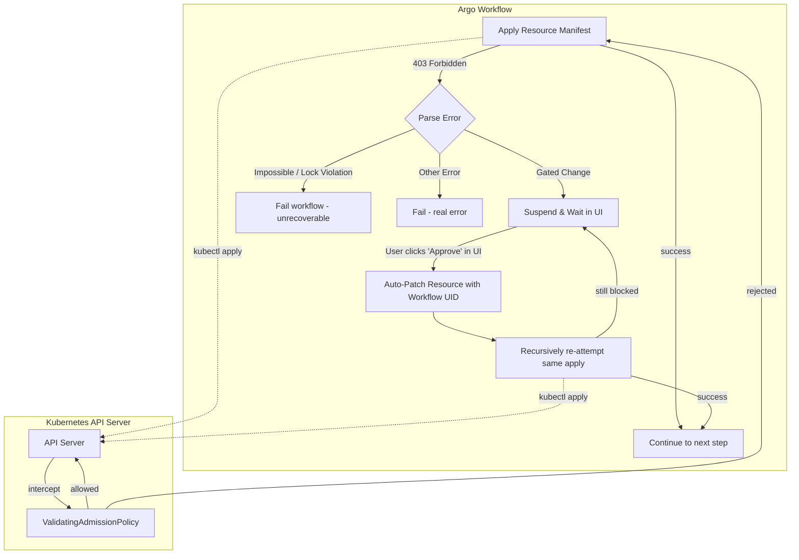

# State-Aware Resource Management for Migration Workflows

> **Status:** Implementation Plan (Ready for Review)

## Context

The migration workflow currently operates in an "always create" mode using `kubectl apply`. This works well for initial deployments but creates risks and inefficiencies during subsequent runs:

1. **Re-running workflows:** Should skip creation if a resource exists with the exact same configuration (Idempotency).
2. **Configuration drift:** Some changes (e.g., replica counts) require careful handling; others (e.g., storage type) must be blocked entirely.
3. **Protecting production:** Dangerous or disruptive changes should never silently apply; they must be gated by human approval.

**Implementation Targets:**

* Phase 1 (Completed): Kafka cluster (`Kafka`), `KafkaNodePool`, and `KafkaTopic` from Strimzi.
* Phase 2 (Current): `CaptureProxy` (long-lived) and `DataSnapshot` / `SnapshotMigration` (finite/terminal).

### Goals

* Use Kubernetes ValidatingAdmissionPolicies (CEL) to enforce change rules at the API level.
* Route policy rejections to a suspend gate in the Argo UI, allowing users to safely approve changes without dropping into a CLI.
* Retain native K8s behavior for "stacked rollouts" on long-lived infrastructure.
* Ensure strict provenance: the parameters in a CRD's `.spec` must *always* perfectly match the actual deployed infrastructure or historical artifact.

---

## Architecture Overview: The UI-Driven Retry Model

The workflow does **not** automatically inject approval annotations on the first pass. When a gated change is attempted, the system relies on a "Catch, Suspend, Auto-Patch, and Retry" loop.



**Key Concept: The API Rejection is Absolute.** If a VAP rejects a change, the entire `kubectl apply` request is aborted. The existing object in `etcd`, including its state and status, remains 100% unchanged.

---

## Field Classification

Changes to resources fall into three categories:

1. **Impossible:** Cannot be done — must delete & recreate the resource.
2. **Gated:** Requires explicit approval annotation (via the Workflow UI) to proceed.
3. **Safe:** Low-risk, allowed dynamically without approval.

### CaptureProxy (`migrations.opensearch.org/ProxyConfig`)

| Field | Category | Rationale | Restart Required? |
| --- | --- | --- | --- |
| `spec.listenPort` | Impossible | Changing breaks all client connections | N/A |
| `spec.noCapture` | **Gated** | Fundamentally changes proxy behavior | Yes (rolling) |
| `spec.enableMSKAuth` | **Gated** | Auth mode change is destructive | Yes (rolling) |
| `spec.tls.mode` | **Gated** | TLS mode switch requires cert/secret changes | Yes (rolling) |
| `spec.podReplicas` | Safe | Scaling is safe, Deployment handles rolling | No |
| `spec.suppressCaptureFor*` | **Gated** | Traffic filtering tweaks | Yes (rolling) |
| `spec.numThreads` | Safe | Performance tuning | Yes (rolling) |

*(Note: Kafka and KafkaNodePool resources follow similar matrices established in Phase 1).*

---

## Resource Lifecycle & State Machine

Migration CRD resources follow a common lifecycle. To ensure CEL policies can evaluate state reliably, the workflow manages state transitions using a metadata annotation (`migrations.opensearch.org/phase`).

### Terminal vs. Long-Lived Resources

`Ready` and `Completed` are sibling states; a resource will transition to one or the other based on its operational lifespan.

| State | Meaning | Used By |
| --- | --- | --- |
| *(empty)* | Placeholder — created but not yet acted upon. | All |
| `Running` | Work is in progress (deployment rolling out, snapshot copying). | All |
| `Ready` | Infrastructure is healthy, operational, and serving traffic. | **Long-Lived** (Proxy, Kafka) |
| `Completed` | A finite task has finished successfully. The output is immutable. | **Terminal** (Snapshots) |
| `Error` | Execution failed. The resource is "poisoned". | All |

### The "Fail Forward / Poison Resource" Principle

If infrastructure deployment fails, **we do not attempt a rollback**. The workflow simply marks the CRD's annotation as `Error` and halts. The resource is "poisoned." It is the user's responsibility to push a new, valid configuration through the workflow to overwrite the poisoned state. This guarantees the CRD `.spec` is never artificially manipulated by the workflow behind the scenes.

---

## The Workflow UID Approval Pattern

*This replaces unwieldy per-field annotations and complex fingerprinting.*

We tie approvals directly to the specific Argo Workflow execution requesting the change. This keeps the human-in-the-loop entirely within the Argo UI.

**The Flow:**

1. **Try Apply:** Argo attempts the update. The incoming manifest includes a label: `workflows.argoproj.io/run-uid: {{workflow.uid}}`.
2. **The Block:** The user attempts a gated change. The VAP sees the change, looks for a matching approval annotation, doesn't find it, and returns a `403 Forbidden`.
3. **The Suspend:** Argo catches the 403 and enters a `Suspend` node with a message: *"Gated changes detected. Review and click Resume to approve."*
4. **Auto-Patch:** When the user clicks Resume, the very next step in Argo runs a targeted patch:
   `kubectl patch <resource> <name> --type=merge -p '{"metadata":{"annotations":{"migrations.opensearch.org/approved-by-run": "{{workflow.uid}}"}}}'`
5. **The Retry:** The workflow loops back and attempts the `kubectl apply` again.
6. **The Pass:** The VAP sees the gated change, but evaluates `object.metadata.annotations['...approved-by-run'] == object.metadata.labels['workflows.argoproj.io/run-uid']`. The change is allowed.

**CEL Implementation Example:**

```yaml
validations:
  - expression: |
      # Condition 1: No Gated fields changed
      (object.spec.enableMSKAuth == oldObject.spec.enableMSKAuth &&
       object.spec.noCapture == oldObject.spec.noCapture) 
      ||
      # Condition 2: Workflow UID matches the approval annotation
      (has(object.metadata.annotations) &&
       has(object.metadata.annotations['migrations.opensearch.org/approved-by-run']) &&
       has(object.metadata.labels['workflows.argoproj.io/run-uid']) &&
       object.metadata.annotations['migrations.opensearch.org/approved-by-run'] == object.metadata.labels['workflows.argoproj.io/run-uid'])
    message: "Gated changes detected. Workflow UI approval is required to proceed."

```

---

## Advanced Patterns: Provenance & Idempotency

### The "Lock-on-Complete" Pattern (Terminal Resources Only)

This pattern strictly applies to **completed work products** (e.g., `DataSnapshot`). It freezes the resource's `.spec` to guarantee provenance and enables safe subgraph skipping in Argo.

**The Logic:** If a user re-runs a workflow against a completed snapshot, we want to skip the work *if* the parameters are identical. However, if a user changes *any* parameter (even a "Safe" one) and re-runs it, silently accepting the change would break provenance—the `.spec` would no longer reflect the historical execution.

When the VAP sees the `Completed` annotation, it rejects *any* spec change with a 403. Argo catches this and hard-fails, telling the user to delete the stale artifact if they want new parameters.

```yaml
validations:
  # Lock-on-Complete: Freeze spec for finished work products
  - expression: |
      !has(oldObject.metadata.annotations) ||
      !('migrations.opensearch.org/phase' in oldObject.metadata.annotations) ||
      oldObject.metadata.annotations['migrations.opensearch.org/phase'] != 'Completed' ||
      (object.spec == oldObject.spec)
    message: "Consistency Guard: This resource is 'Completed'. The specification is permanently sealed to maintain provenance. Delete the resource to run a new job with these parameters."

```

*(Note: There is explicitly **no** "Running Guard" in this architecture. Long-lived infrastructure supports native K8s stacked rollouts. If a Proxy is `Running`, the user is free to push a corrective workflow over it, governed purely by the standard Gated/Impossible field checks).*

### CRD Upgrade "In-Flight" Handling

To prevent VAPs from breaking when a CRD is upgraded (e.g., a new optional field is added), always use the CEL `has()` operator for new fields.

```yaml
- expression: |
    !has(object.spec.newFeature) || 
    object.spec.newFeature == oldObject.spec.newFeature

```

---

## Efficient Argo Execution

To avoid blind sleeps, we rely on server-side applies and Argo's `resource` template.

1. **Phase 1: Apply / Assert**
* Workflow executes `kubectl apply --server-side`.
* If the spec matches etcd exactly, K8s treats it as a `200 OK` No-Op (idempotent). Argo moves on.
* If a VAP rejects it, the recursive UI-approval loop handles it.


2. **Phase 2: Deploy & Wait**
* If infrastructure needs deploying, use Argo's native waiters:
```yaml
# For Proxy (Long-Lived)
successCondition: status.phase == Ready
failureCondition: status.phase == Error

```


---

## Implementation Plan

### Files to Create/Modify

| File | Action | Description |
| --- | --- | --- |
| `.../validatingAdmissionPolicies.yaml` | **MODIFY** | Add Proxy VAP (UID Approval logic) and `Lock-on-Complete` for Snapshot CRDs. |
| `.../taskBuilder.ts` | **DONE** | `continueOn` support added for workflow retries. |
| `.../setupCapture.ts` | **MODIFY** | Add two-phase commit: apply CRD → Suspend → Auto-Patch UID → Retry loop. |

