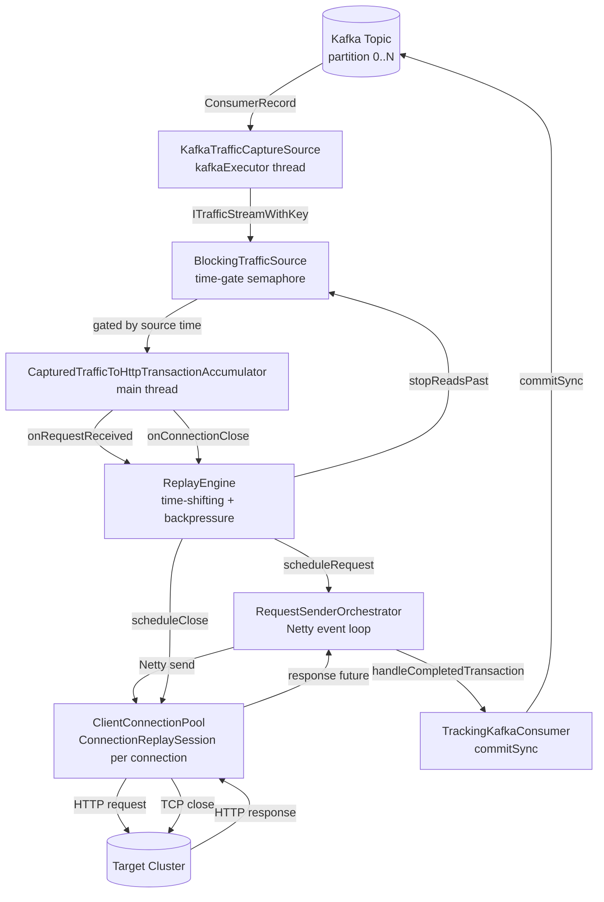
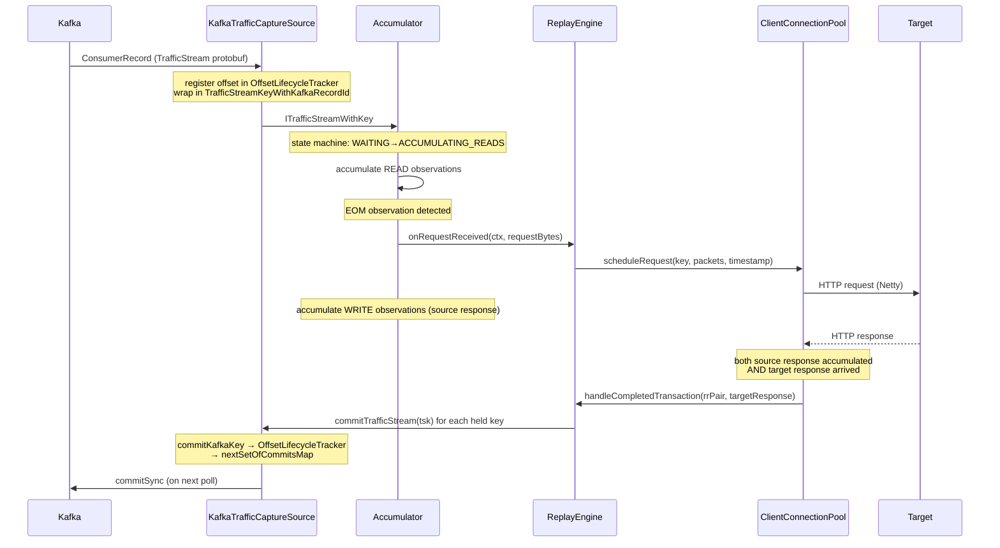
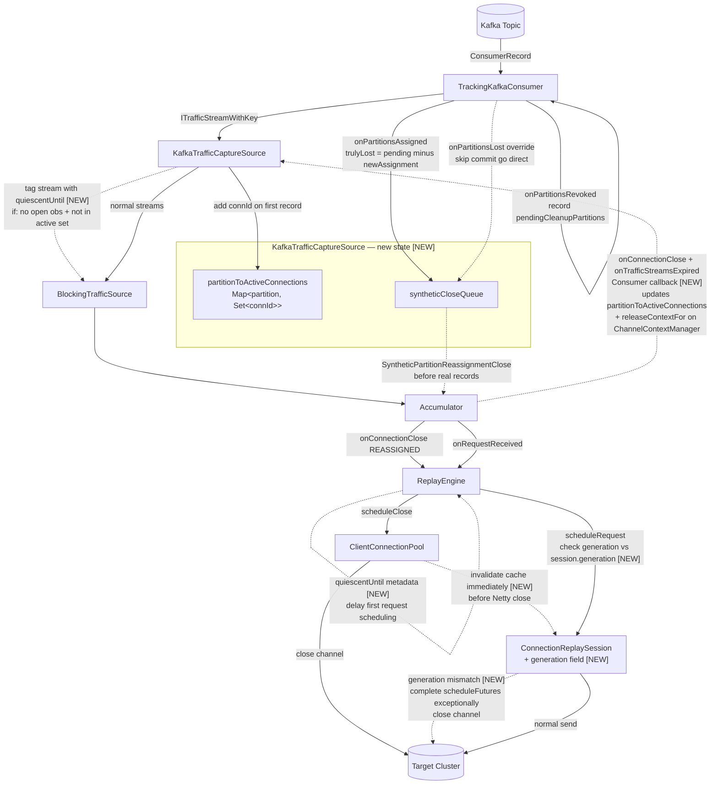
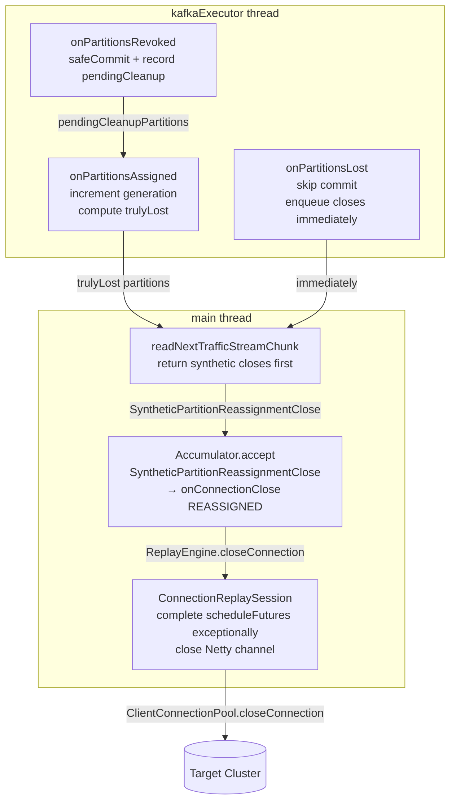

# Traffic Replayer Architecture

## Overview

The replayer reads captured HTTP traffic from Kafka, reconstructs request/response pairs per
connection, replays them against a target cluster, and commits Kafka offsets once each transaction
is fully resolved. The pipeline is deliberately layered so that backpressure, time-shifting, and
commit tracking are each handled at a single well-defined boundary.

---

## Big Picture Dataflow



---

## Normal Request Lifecycle



---

## Planned Architecture Changes

The following diagram shows all planned changes overlaid on the current architecture.
Dashed lines are new data flows; items marked `[NEW]` are new components or fields.



The quiescent metadata flows with the stream, not as a buffer in the source:
- `KafkaTrafficCaptureSource` detects handoff connections (no READ/open observation, connection not in active set) and tags the `ITrafficStreamWithKey` with a `quiescentUntil` wall-clock instant
- The tag propagates through `Accumulation` to `onRequestReceived`
- `ReplayEngine.scheduleRequest()` uses `max(timeShiftedStart, quiescentUntil)` as the effective start time for the first request on that connection
- No buffering in the source; backpressure is unaffected

Key changes summarized:

| # | Change | Where |
|---|---|---|
| 1 | Invalidate `ClientConnectionPool` cache immediately on close scheduling, not after Netty close | `ClientConnectionPool` |
| 2 | `partitionToActiveConnections` map + single accumulator feedback callback (updates active set AND calls `releaseContextFor`) | `KafkaTrafficCaptureSource`, `AccumulationCallbacks` |
| 3 | Synthetic close events (`SyntheticPartitionReassignmentClose`, `ReconstructionStatus.REASSIGNED`) drained before real records | `KafkaTrafficCaptureSource`, `Accumulator`, `TrafficReplayerAccumulationCallbacks` |
| 4 | `ConnectionReplaySession.generation` field; generation mismatch cancels old session (complete futures exceptionally + close channel) | `ConnectionReplaySession`, `ClientConnectionPool` |
| 5 | Quiescent metadata tagged on handoff streams; `ReplayEngine` delays first request scheduling to `max(timeShiftedStart, quiescentUntil)` | `KafkaTrafficCaptureSource`, `ITrafficStreamWithKey`, `Accumulation`, `ReplayEngine` |
| 6 | `onPartitionsLost` override — skip commit, go directly to synthetic close queue | `TrackingKafkaConsumer` |
| 7 | Cooperative rebalancing (`CooperativeStickyAssignor`) — simplifies revocation logic, eliminates stop-the-world | configuration |

---

## Component Map

```
TrafficReplayer (main)
 └─ BlockingTrafficSource          (backpressure / time-gating wrapper)
     └─ KafkaTrafficCaptureSource  (Kafka consumer, async executor)
         └─ TrackingKafkaConsumer  (offset lifecycle, rebalance callbacks)

TrafficReplayerTopLevel
 └─ setupRunAndWaitForReplayToFinish
     ├─ pullCaptureFromSourceToAccumulator  (main read loop)
     │   └─ CapturedTrafficToHttpTransactionAccumulator
     │       └─ ExpiringTrafficStreamMap   (per-connection Accumulation objects)
     └─ TrafficReplayerAccumulationCallbacks  (bridges accumulator → replay engine)
         └─ ReplayEngine
             └─ RequestSenderOrchestrator  (Netty scheduling)
                 └─ ClientConnectionPool  (Netty channels to target)
```

---

## Threads

| Thread | Owner | Role |
|---|---|---|
| main | `TrafficReplayerCore` | Drives the read loop, blocks on `CompletableFuture.get()` |
| `kafkaConsumerThread` | `KafkaTrafficCaptureSource` | All Kafka `poll()`, `commit()`, and rebalance callbacks |
| `BlockingTrafficSource-executor` | `BlockingTrafficSource` | Blocks until time-gate allows a read |
| Netty event loop(s) | `ClientConnectionPool` | Sends requests, receives responses, drives futures |
| `activeWorkMonitorThread` | `TrafficReplayer.main` | Periodic logging of in-flight work |

The Kafka consumer API requires all calls (`poll`, `commitSync`, `pause`, `resume`) to happen on
the same thread. `KafkaTrafficCaptureSource` enforces this by submitting all work to the single
`kafkaExecutor` thread.

---

## Packet Lifecycle: Kafka Record → Commit

### Step 1 — Poll

`pullCaptureFromSourceToAccumulator` (main thread) calls
`blockingTrafficSource.readNextTrafficStreamChunk()`, which:

1. Blocks on a `Semaphore` (`readGate`) until `ReplayEngine` signals that the time window has
   advanced far enough to allow more reads (`stopReadsPast`).
2. Delegates to `KafkaTrafficCaptureSource.readNextTrafficStreamChunk()`, which submits work to
   `kafkaExecutor` and returns a `CompletableFuture`.
3. On `kafkaExecutor`: `TrackingKafkaConsumer.getNextBatchOfRecords()` calls
   `kafkaConsumer.poll(keepAlive / 4)`.

Each `ConsumerRecord` is wrapped into a `TrafficStreamKeyWithKafkaRecordId`, which carries:
- `partition` — Kafka partition number
- `offset` — Kafka offset within that partition
- `generation` — monotonically increasing integer, incremented on each `onPartitionsAssigned`

The offset is registered in `OffsetLifecycleTracker` (a min-heap per partition) via
`offsetTracker.add(offset)`, and `kafkaRecordsLeftToCommitEventually` is incremented.

The record is deserialized from protobuf into a `TrafficStream` and returned as an
`ITrafficStreamWithKey` (specifically `PojoTrafficStreamAndKey`).

### Step 2 — Accumulation

The main thread feeds each `ITrafficStreamWithKey` into
`CapturedTrafficToHttpTransactionAccumulator.accept()`.

The accumulator maintains a map of live connections:
`ExpiringTrafficStreamMap` keyed by `ScopedConnectionIdKey(nodeId, connectionId)`, where `nodeId`
is the capture proxy's node ID (from the protobuf), **not** the Kafka partition number.

For each traffic stream, the accumulator looks up or creates an `Accumulation` object for that
connection. The `Accumulation` is a state machine:

```
IGNORING_LAST_REQUEST   ← initial state when restarting mid-connection
WAITING_FOR_NEXT_READ_CHUNK
ACCUMULATING_READS      ← collecting request bytes
ACCUMULATING_WRITES     ← collecting response bytes
```

Each `TrafficObservation` sub-message within the stream is processed in order. When a complete
HTTP request is detected, `AccumulationCallbacks.onRequestReceived()` is called. When the
connection closes, `onConnectionClose()` is called. If the accumulation times out without a close,
`onTrafficStreamsExpired()` is called.

The `TrafficStreamKey` (the Kafka record identity) is held by the `RequestResponsePacketPair` via
`rrPair.holdTrafficStream(tsk)`. A single HTTP transaction may span multiple Kafka records if the
connection's traffic was split across multiple `TrafficStream` protobuf messages; all of those keys
are held in `trafficStreamKeysBeingHeld`.

### Step 3 — Request Dispatch

`TrafficReplayerAccumulationCallbacks.onRequestReceived()` (called from the accumulator, on the
main thread):

1. Calls `replayEngine.setFirstTimestamp()` to initialize the `TimeShifter` on the first packet.
2. Creates a `TextTrackedFuture<RequestResponsePacketPair>` (`finishedAccumulatingResponseFuture`)
   that will be completed when the response bytes are fully accumulated.
3. Queues the request through `TrafficStreamLimiter` (concurrency cap), then calls
   `transformAndSendRequest()`.
4. The combined future (`allWorkFinishedForTransactionFuture`) is registered in
   `requestWorkTracker` under the `UniqueReplayerRequestKey`.
5. Returns a `Consumer<RequestResponsePacketPair>` — this is the callback that the accumulator
   will call when the response is fully received from the source capture.

`transformAndSendRequest()` runs the request through the JSON transformation pipeline (Netty
handlers), then calls `ReplayEngine.scheduleRequest()`, which time-shifts the original timestamps
and schedules the bytes to be sent via `RequestSenderOrchestrator` on the Netty event loop.

### Step 4 — Response Accumulation

While the replayed request is in-flight to the target, the accumulator continues processing
subsequent `TrafficObservation` entries for the same connection. When it sees response bytes
(WRITE observations), it calls the `Consumer<RequestResponsePacketPair>` returned in step 3,
completing `finishedAccumulatingResponseFuture` with the fully-assembled `RequestResponsePacketPair`.

### Step 5 — Transaction Completion

When both the target response arrives (from Netty) **and** the source response is fully accumulated,
`handleCompletedTransaction()` runs (on the Netty event loop thread):

1. Calls `packageAndWriteResponse()` → `tupleWriter.accept()` → logs the result via
   `ResultsToLogsConsumer`.
2. Calls `commitTrafficStreams(rrPair.completionStatus, rrPair.trafficStreamKeysBeingHeld)`.
3. Removes the request from `requestWorkTracker`.

### Step 6 — Commit

`commitTrafficStreams()` iterates over all `ITrafficStreamKey` objects held by the pair and calls
`trafficCaptureSource.commitTrafficStream(tsk)` for each.

`KafkaTrafficCaptureSource.commitTrafficStream()` delegates to
`TrackingKafkaConsumer.commitKafkaKey()`:

1. Looks up the `OffsetLifecycleTracker` for the record's partition.
2. **Generation check**: if the tracker is gone (partition revoked) or the generation doesn't
   match, returns `IGNORED` — the commit is silently dropped.
3. Calls `tracker.removeAndReturnNewHead(offset)` on the min-heap. This removes the offset and
   returns the new minimum offset if the removed offset was the head (i.e., the lowest
   outstanding offset for that partition). If there are still lower offsets in-flight, returns
   `Optional.empty()`.
4. If a new head is returned, adds `(TopicPartition → OffsetAndMetadata(newHead))` to
   `nextSetOfCommitsMap` and sets `kafkaRecordsReadyToCommit = true`.
5. Returns `AFTER_NEXT_READ` (commit will be flushed on the next poll) or
   `BLOCKED_BY_OTHER_COMMITS` (lower offsets still in-flight).

The actual `kafkaConsumer.commitSync()` happens in `safeCommit()`, which is called:
- At the start and end of every `getNextBatchOfRecords()` call
- During `touch()` (keep-alive polls)
- At the start of `onPartitionsRevoked()`

This means commits are **batched and piggybacked on poll cycles**, not issued immediately per
record. Kafka requires `commitSync` to be called on the consumer thread; `safeCommit` is always
called from `kafkaExecutor`.

---

## Keep-Alive / Touch Mechanism

If records are in-flight but no new records are being read (backpressure is blocking the read
loop), the consumer must still call `poll()` periodically to maintain its group membership
(heartbeat). The `keepAliveInterval` is set to half of `max.poll.interval.ms`.

`BlockingTrafficSource` tracks when the next touch is required via
`TrackingKafkaConsumer.getNextRequiredTouch()`. If `kafkaRecordsLeftToCommitEventually > 0`, a
touch is required within `keepAliveInterval`. If `kafkaRecordsReadyToCommit` is true, a touch is
required immediately.

`touch()` pauses all assigned partitions, calls `poll(Duration.ZERO)` (to service the heartbeat
and trigger any pending commits), then resumes.

The `touch()` call runs on `kafkaExecutor` (via `BlockingTrafficSource-executor` submitting to it)
and is independent of the main read loop thread. This means the heartbeat is maintained even while
the main thread is processing a large batch of synthetic close events (see Partition Revocation
section below).

---

## Backpressure: BlockingTrafficSource + ReplayEngine

`BlockingTrafficSource` implements `BufferedFlowController`. It gates reads behind a time window:
reads are only allowed up to `lastCompletedSourceTime + bufferTimeWindow` ahead of the current
replay position.

`ReplayEngine` drives this via `stopReadsPast(timestamp)`, called whenever a scheduled task
completes. This releases the `readGate` semaphore in `BlockingTrafficSource`, allowing the next
read to proceed.

When the replayer is idle (no tasks outstanding), a scheduled daemon in `ReplayEngine`
(`updateContentTimeControllerWhenIdling`) advances the time controller so reads aren't blocked
indefinitely.

---

## Rebalance Callbacks

Both callbacks run on `kafkaExecutor` (inside a `poll()` call).

### `onPartitionsRevoked(partitions)`

Called before partitions are released to the group coordinator. The consumer still owns the
partitions at this point, so commits are valid.

1. Calls `safeCommit()` — last chance to flush pending commits for the revoked partitions.
2. Removes from `partitionToOffsetLifecycleTrackerMap`, `nextSetOfCommitsMap`,
   `nextSetOfKeysContextsBeingCommitted` for each revoked partition.
3. Recalculates `kafkaRecordsLeftToCommitEventually` from remaining partitions.
4. Records the revoked partitions in a `pendingCleanupPartitions` set (planned).

After this returns, any in-flight records from the revoked partitions will hit the generation
check in `commitKafkaKey()` and return `IGNORED`.

### `onPartitionsAssigned(newPartitions)`

1. Increments `consumerConnectionGeneration` — this invalidates all in-flight commit data from
   the previous assignment.
2. Creates a new `OffsetLifecycleTracker` for each newly assigned partition.
3. (Planned) Computes `trulyLost = pendingCleanupPartitions - newPartitions`. Enqueues synthetic
   close events for all active connections on truly lost partitions.

### `onPartitionsLost(partitions)` (Kafka 2.4+, planned override)

Called instead of `onPartitionsRevoked` when partitions are lost due to a consumer timeout or
group fence. Commits are not possible. Must skip the commit attempt and go directly to enqueuing
synthetic close events. The default implementation calls `onPartitionsRevoked`, which would
attempt a commit that will fail — this needs to be overridden.

### Rebalance Protocol Note

The default `RangeAssignor` uses **eager rebalancing**: all partitions are revoked from all
consumers simultaneously before redistribution. `CooperativeStickyAssignor` uses **incremental
rebalancing**: only partitions that need to move are revoked. Under cooperative rebalancing,
`onPartitionsRevoked` only fires for partitions going to another consumer, so cleanup can happen
immediately without the deferred `onPartitionsAssigned` check. Switching to cooperative
rebalancing is the recommended long-term approach for large partition counts.

---

## Partition Revocation and Connection Cleanup

### The Problem

When a partition is revoked, several layers of per-connection state become stale:

| Layer | State | Self-heals? |
|---|---|---|
| `TrackingKafkaConsumer` | offset trackers, commit maps | ✅ Cleaned in `onPartitionsRevoked` |
| `ChannelContextManager` | OTel span contexts | ⚠️ Only when same connection seen again (generation check) |
| `ExpiringTrafficStreamMap` | `Accumulation` state machines | ⚠️ Stale entries evicted when any traffic advances source time |
| `ClientConnectionPool` | Netty channels to target | ❌ Never cleaned — open connections leak to target server |

The `ClientConnectionPool` leak is the most serious: idle open connections consume server-side
resources on the target cluster and can cause connection exhaustion under high partition churn.

### Partition Revocation Dataflow



### Generation-Based Stale State Fix (implemented)

`ITrafficStreamKey.getSourceGeneration()` (default 0 for non-Kafka sources) returns the
`consumerConnectionGeneration` at the time the record was consumed. This is incremented on each
`onPartitionsAssigned`.

- `ChannelContextManager.retainOrCreateContext()`: if the incoming key's generation exceeds the
  stored entry's generation, force-closes the old OTel span and creates a fresh one.
- `CapturedTrafficToHttpTransactionAccumulator.accept()`: if the existing `Accumulation`'s
  `sourceGeneration` is lower than the incoming key's generation, fires
  `fireAccumulationsCallbacksAndClose(CLOSED_PREMATURELY)` to close tracing contexts, removes
  the stale accumulation, and creates a fresh one.

This fixes correctness (stale state errors) for connections that come back after reassignment.
It does not fix the `ClientConnectionPool` leak or `ChannelContextManager` entries for
connections that are never seen again after revocation.

### Planned Work: Full Partition Revocation Cleanup

The following items are planned but not yet implemented:

**1. Invalidate `ClientConnectionPool` cache before close**

Currently `connectionId2ChannelCache.invalidate()` is called after the Netty channel close
completes. It must be called immediately when the close is scheduled, so that new requests
arriving in the window between scheduling and completion get a fresh `ConnectionReplaySession`
rather than being routed to the old one.

**2. Synthetic close events**

Active connection tracking (`KafkaTrafficCaptureSource`):
- Maintains `Map<Integer, Set<ScopedConnectionIdKey>> partitionToActiveConnections`
- Adds a connection when its first `TrafficStream` is consumed from a partition
- Removes a connection via a single `Consumer<ScopedConnectionIdKey>` callback registered with
  the accumulator, called from both `onConnectionClose` and `onTrafficStreamsExpired`. This
  callback both updates `partitionToActiveConnections` AND calls
  `channelContextManager.releaseContextFor()` — combined because the normal release path
  (`onKeyFinishedCommitting`) requires a successful Kafka commit, which never fires for
  `REASSIGNED` closes. A callback is required (rather than scanning source-side data) because
  expired connections have no source close observation.

Synthetic close injection:
- When `onPartitionsAssigned` determines a partition is truly lost, enqueue a
  `SyntheticPartitionReassignmentClose` record for each connection in that partition's active set
- These are returned from `readNextTrafficStreamChunk()` as a completed future **before** any
  real Kafka records from the new assignment
- `SyntheticPartitionReassignmentClose` implements `ITrafficStreamWithKey` and is handled as a
  special case in `accept()`, firing `onConnectionClose(REASSIGNED, ...)` with a new
  `ReconstructionStatus.REASSIGNED` value
- Does **not** attempt a Kafka commit; the accumulator feedback callback handles `releaseContextFor`
- Records a distinct metric so reassignment closes are differentiable from source closes
- Quota-exempt: close events do not go through `TrafficStreamLimiter` or `requestWorkTracker`

**3. Cancel old `ConnectionReplaySession` on new open with higher generation**

When a new open arrives for a connection that already has a `ConnectionReplaySession` with a
lower generation:
- Add a `generation` field to `ConnectionReplaySession`
- In `getCachedSession` (or `submitUnorderedWorkToEventLoop`), detect the generation mismatch
- Complete all pending `FutureWorkPoint.scheduleFuture` entries exceptionally (so the
  `OnlineRadixSorter` chain fails fast rather than hanging on abandoned futures)
- Close the Netty channel immediately
- Invalidate the cache entry and create a new session

The old session drains asynchronously: all pending requests fail fast (channel closed exception),
`handleCompletedTransaction` handles them as errors, commits are IGNORED via generation check.
Response telemetry for in-flight requests at the moment of cancellation is lost — this is
acceptable since the same loss can occur from network failures, and this scenario only arises
during rapid double-reassignment of the same partition to the same consumer.

**4. Quiescent period for handoff connections**

When a `TrafficStream` arrives for a connection that is not in `partitionToActiveConnections` for
the current partition AND does not start with a READ observation, another replayer may have had
in-flight requests for this connection. The stream is tagged with a `quiescentUntil` wall-clock
instant (configurable duration from now). This metadata propagates through `Accumulation` to
`onRequestReceived`. `ReplayEngine.scheduleRequest()` uses
`max(timeShiftedStart, quiescentUntil)` as the effective start time for the first request on that
connection. No buffering in the source; backpressure is unaffected.

**5. `onPartitionsLost` override**

The default implementation calls `onPartitionsRevoked`, which attempts `safeCommit()`. When
partitions are lost due to timeout or fence, commits will fail. Override to skip the commit and
go directly to enqueuing synthetic closes.

**6. Cooperative rebalancing (recommended)**

Switch to `CooperativeStickyAssignor`. Under cooperative rebalancing, `onPartitionsRevoked` only
fires for partitions being moved to another consumer, so cleanup can happen immediately without
the deferred `onPartitionsAssigned` diff logic. Also eliminates the stop-the-world rebalance
penalty for large partition counts.

---

## Shutdown

`TrafficReplayerTopLevel.shutdown(error)`:
1. Sets `stopReadingRef = true` — the main read loop exits on the next iteration.
2. Cancels `nextChunkFutureRef` — unblocks the main thread if it's waiting on a poll.
3. Calls `clientConnectionPool.shutdownNow()` — closes all Netty channels.
4. Cancels `allRemainingWorkFutureOrShutdownSignalRef` — signals any waiting work to abort.

The shutdown hook registered in `main` calls `shutdown(null)` on SIGTERM/SIGINT.

`setupRunAndWaitForReplayWithShutdownChecks` wraps any exception (including `InterruptedException`)
in a `TerminationException` and propagates it to `main`. `main` exits, the JVM terminates, and
ECS replaces the task.

---

## State Ownership Summary

| State | Owner | Keyed By | Cleaned on Revocation? |
|---|---|---|---|
| `partitionToOffsetLifecycleTrackerMap` | `TrackingKafkaConsumer` | Kafka partition # | ✅ Yes — `onPartitionsRevoked` |
| `nextSetOfCommitsMap` | `TrackingKafkaConsumer` | `TopicPartition` | ✅ Yes — `onPartitionsRevoked` |
| `nextSetOfKeysContextsBeingCommitted` | `TrackingKafkaConsumer` | `TopicPartition` | ✅ Yes — `onPartitionsRevoked` |
| `connectionToChannelContextMap` | `ChannelContextManager` | connection ID string | ⚠️ Partial — generation check on next access; full cleanup via synthetic closes (planned) |
| `connectionAccumulationMap` | `ExpiringTrafficStreamMap` | `(nodeId, connectionId)` | ⚠️ Partial — generation check on next access; expires when source time advances |
| `nodeToExpiringBucketMap` | `ExpiringTrafficStreamMap` | capture nodeId | ⚠️ Expires when source time advances |
| `connectionId2ChannelCache` | `ClientConnectionPool` | `(connectionId, sessionNumber)` | ❌ Not yet — planned via synthetic close → `closeConnection()` + immediate invalidation |
| `requestWorkTracker` | `TrafficReplayerCore` | `UniqueReplayerRequestKey` | ⚠️ In-flight requests complete normally; commits dropped via generation check |
| `partitionToActiveConnections` | `KafkaTrafficCaptureSource` | Kafka partition # | ✅ Drained when synthetic closes are flushed (planned) |
