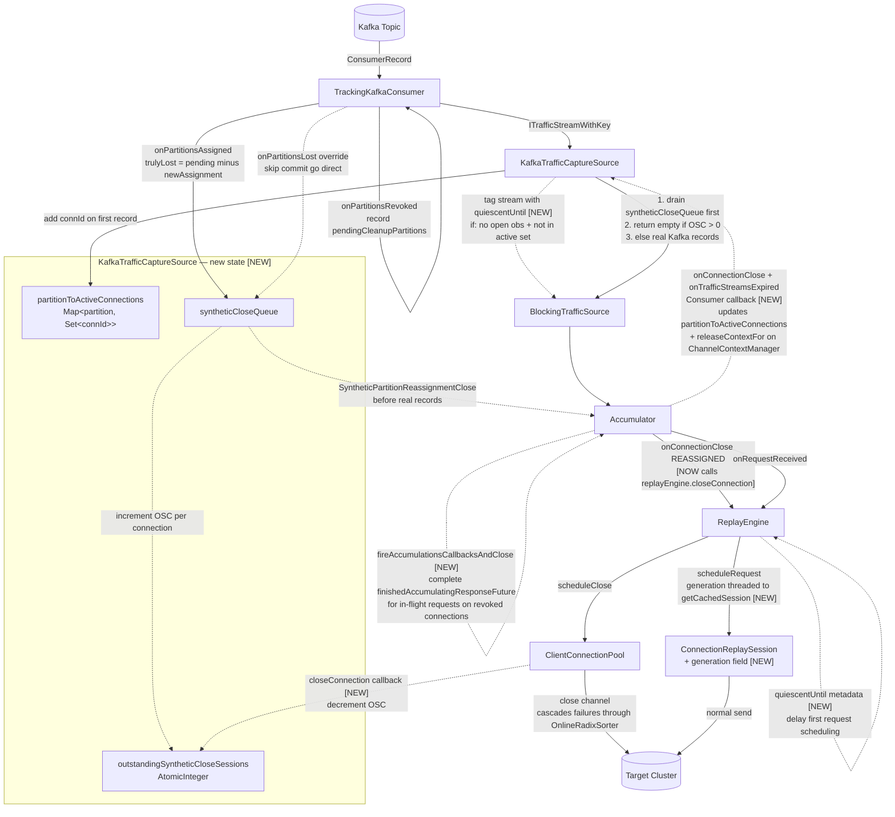

# Traffic Replayer Architecture

## Design Goals and Invariants

The replayer faithfully reproduces HTTP traffic from a source cluster against a target cluster,
preserving the relative timing and ordering of the original traffic while allowing time scaling.

### Delivery Guarantees

- **At-least-once delivery**: The Kafka commit offset only advances after all records up to and
  including that offset have been fully processed. On restart, the replayer re-reads from the last
  committed offset, ensuring no records are skipped. Records may be replayed more than once across
  restarts.

- **Per-connection ordering**: Requests on the same source connection are replayed in the same
  order they were originally sent. The `OnlineRadixSorter` in `ConnectionReplaySession` enforces
  this sequencing on the Netty event loop. Exception: after a Kafka partition reassignment, the
  quiescent period is applied to handoff connections to reduce (but not eliminate) the risk of
  racing with the previous consumer's in-flight requests.

### Time Fidelity

- **Relative timing preserved**: The replayer time-shifts source timestamps to real time via
  `TimeShifter`. The first packet seen sets the reference point; all subsequent packets are
  scheduled relative to that reference, scaled by the configured `speedupFactor`. A source
  message that arrived 30 minutes after the first will be sent 15 minutes after the first if
  `speedupFactor=2`.

- **Transformation latency bound**: Requests are not transformed (JSON rewriting, auth signing,
  etc.) more than a few seconds before they are scheduled to be sent. The `ReplayEngine` schedules
  transformation work at `scheduledSendTime - EXPECTED_TRANSFORMATION_DURATION` to bound the
  window between transformation and transmission.

### Backpressure and Memory Bounds

- **Bounded read-ahead**: The replayer only reads from Kafka as far ahead as needed. `BlockingTrafficSource`
  gates reads behind a time window (`bufferTimeWindow`): it will not read records whose source
  timestamp is more than `bufferTimeWindow` ahead of the current replay position. This prevents
  unbounded memory accumulation from reading too far into the future.

- **Concurrency cap**: `TrafficStreamLimiter` limits the number of in-flight requests to prevent
  memory exhaustion from too many simultaneous open transactions.

### Connection Fidelity

- **Connection reuse**: The replayer maintains the same logical connections as the source, reusing
  `ConnectionReplaySession` objects (and their underlying Netty channels) across requests on the
  same connection. TLS handshakes are performed once per connection, not per request, matching
  source behavior.

- **Retry on mismatch**: When a replayed request receives a response that doesn't match the source
  response, the replayer retries the request according to the configured `RequestRetryEvaluator`
  policy.

- **Source response optional**: The replayer will send requests to the target even when the source
  response is not available (e.g., the source stream was truncated or the connection expired). This
  is a deliberate policy choice — completeness of replay is prioritized over strict source/target
  comparison.

### Partition Reassignment

- **Synthetic closes on partition loss**: When a Kafka partition is truly lost (revoked and not
  reassigned back to this consumer), the replayer synthesizes close events for all active
  connections on that partition. This closes the corresponding target connections and cleans up
  accumulator state, preventing resource leaks on the target cluster.

- **Quiescent period for handoff connections**: When a partition is reassigned to this consumer
  and a connection's first stream has no READ observation (indicating another replayer was
  mid-connection), the first request is delayed by a configurable quiescent period. This reduces
  the risk of the new consumer's requests racing with the previous consumer's in-flight requests
  on the target.

---

## Overview

The replayer reads captured HTTP traffic from Kafka, reconstructs request/response pairs per
connection, replays them against a target cluster, and commits Kafka offsets once each transaction
is fully resolved. The pipeline is deliberately layered so that backpressure, time-shifting, and
commit tracking are each handled at a single well-defined boundary.

---

## Big Picture Dataflow


---

## Normal Request Lifecycle


---

## Planned Architecture Changes

The following diagram shows all planned changes overlaid on the current architecture.
Dashed lines are new data flows; items marked `[NEW]` are new components or fields.



**Key behaviors of the synthetic close backpressure design:**

**Mutual exclusivity of old and new sessions**: The `outstandingSyntheticCloseSessions` counter
ensures `readNextTrafficStreamSynchronously` returns empty batches until all old
`ConnectionReplaySession` objects for revoked partitions are fully closed and cache-invalidated.
Only then does real Kafka data flow. Old and new sessions for the same connection are strictly
sequential — the cache invalidation is the synchronization point.

**No deadlock**: The main thread is never blocked — it returns empty batches while waiting.
The Netty event loop processes completions freely. `finishedAccumulatingResponseFuture` is
completed by `fireAccumulationsCallbacksAndClose` before the channel close, so in-flight requests
drain fast. The `OnlineRadixSorter` cascades failures through remaining slots when the channel
closes, so the close slot runs quickly.

**`TrafficStreamLimiter` is not involved**: Synthetic closes and the empty-batch drain period
do not go through the limiter. The limiter only gates `onRequestReceived`.

Key changes summarized:

| # | Change | Where |
|---|---|---|
| 1 | `partitionToActiveConnections` + `onConnectionDone` callback (updates active set + `releaseContextFor`) | `KafkaTrafficCaptureSource`, `TrafficReplayerAccumulationCallbacks` |
| 2 | Synthetic close events (`SyntheticPartitionReassignmentClose`, `ReconstructionStatus.REASSIGNED`) drained before real records | `KafkaTrafficCaptureSource`, `Accumulator`, `TrafficReplayerAccumulationCallbacks` |
| 3 | `outstandingSyntheticCloseSessions` counter + empty-batch drain in `readNextTrafficStreamSynchronously` | `KafkaTrafficCaptureSource` |
| 4 | `fireAccumulationsCallbacksAndClose` on existing accumulation when synthetic close fires (completes `finishedAccumulatingResponseFuture`) | `CapturedTrafficToHttpTransactionAccumulator` |
| 5 | `onConnectionClose(REASSIGNED)` calls `replayEngine.closeConnection()` (currently skipped) | `TrafficReplayerAccumulationCallbacks` |
| 6 | `closeConnection` callback to decrement `outstandingSyntheticCloseSessions` | `ClientConnectionPool` |
| 7 | `ConnectionReplaySession.generation` field; generation threaded from `ITrafficStreamKey` through `scheduleRequest` to `getCachedSession` | `ConnectionReplaySession`, `RequestSenderOrchestrator` |
| 8 | Quiescent metadata tagged on handoff streams; `ReplayEngine` delays first request to `max(timeShiftedStart, quiescentUntil)` | `KafkaTrafficCaptureSource`, `ITrafficStreamWithKey`, `Accumulation`, `ReplayEngine` |
| 9 | `onPartitionsLost` override — skip commit, go directly to synthetic close queue | `TrackingKafkaConsumer` |
| 10 | Cooperative rebalancing (`CooperativeStickyAssignor`) — simplifies revocation logic, eliminates stop-the-world | configuration |

---

## Component Map

```
TrafficReplayer (main)
 └─ BlockingTrafficSource              (backpressure / time-gating wrapper)
     └─ KafkaTrafficCaptureSource      (Kafka consumer, async executor)
         ├─ TrackingKafkaConsumer      (offset lifecycle, rebalance callbacks)
         ├─ partitionToActiveConnections  Map<partition, Set<connId>>
         ├─ syntheticCloseQueue        Queue<SyntheticPartitionReassignmentClose>
         └─ outstandingSyntheticCloseSessions  AtomicInteger [planned]

TrafficReplayerTopLevel
 └─ setupRunAndWaitForReplayToFinish
     ├─ pullCaptureFromSourceToAccumulator  (main read loop)
     │   └─ CapturedTrafficToHttpTransactionAccumulator
     │       └─ ExpiringTrafficStreamMap   (per-connection Accumulation objects)
     └─ TrafficReplayerAccumulationCallbacks  (bridges accumulator → replay engine)
         └─ ReplayEngine
             └─ RequestSenderOrchestrator  (Netty scheduling)
                 └─ ClientConnectionPool  (Netty channels to target)
                     └─ ConnectionReplaySession  (per-connection: OnlineRadixSorter + generation)
```

---

## Threads

| Thread | Owner | Role |
|---|---|---|
| main | `TrafficReplayerCore` | Drives the read loop, blocks on `CompletableFuture.get()` |
| `kafkaConsumerThread` | `KafkaTrafficCaptureSource` | All Kafka `poll()`, `commit()`, and rebalance callbacks |
| `BlockingTrafficSource-executor` | `BlockingTrafficSource` | Blocks until time-gate allows a read |
| Netty event loop(s) | `ClientConnectionPool` | Sends requests, receives responses, drives futures |
| `activeWorkMonitorThread` | `TrafficReplayer.main` | Periodic logging of in-flight work |

The Kafka consumer API requires all calls (`poll`, `commitSync`, `pause`, `resume`) to happen on
the same thread. `KafkaTrafficCaptureSource` enforces this by submitting all work to the single
`kafkaExecutor` thread.

---

## Packet Lifecycle: Kafka Record → Commit

### Step 1 — Poll

`pullCaptureFromSourceToAccumulator` (main thread) calls
`blockingTrafficSource.readNextTrafficStreamChunk()`, which:

1. Blocks on a `Semaphore` (`readGate`) until `ReplayEngine` signals that the time window has
   advanced far enough to allow more reads (`stopReadsPast`).
2. Delegates to `KafkaTrafficCaptureSource.readNextTrafficStreamChunk()`, which submits work to
   `kafkaExecutor` and returns a `CompletableFuture`.
3. On `kafkaExecutor`: `TrackingKafkaConsumer.getNextBatchOfRecords()` calls
   `kafkaConsumer.poll(keepAlive / 4)`.

Each `ConsumerRecord` is wrapped into a `TrafficStreamKeyWithKafkaRecordId`, which carries:
- `partition` — Kafka partition number
- `offset` — Kafka offset within that partition
- `generation` — monotonically increasing integer, incremented on each `onPartitionsAssigned`

The offset is registered in `OffsetLifecycleTracker` (a min-heap per partition) via
`offsetTracker.add(offset)`, and `kafkaRecordsLeftToCommitEventually` is incremented.

The record is deserialized from protobuf into a `TrafficStream` and returned as an
`ITrafficStreamWithKey` (specifically `PojoTrafficStreamAndKey`).

### Step 2 — Accumulation

The main thread feeds each `ITrafficStreamWithKey` into
`CapturedTrafficToHttpTransactionAccumulator.accept()`.

The accumulator maintains a map of live connections:
`ExpiringTrafficStreamMap` keyed by `ScopedConnectionIdKey(nodeId, connectionId)`, where `nodeId`
is the capture proxy's node ID (from the protobuf), **not** the Kafka partition number.

For each traffic stream, the accumulator looks up or creates an `Accumulation` object for that
connection. The `Accumulation` is a state machine:

```
IGNORING_LAST_REQUEST   ← initial state when restarting mid-connection
WAITING_FOR_NEXT_READ_CHUNK
ACCUMULATING_READS      ← collecting request bytes
ACCUMULATING_WRITES     ← collecting response bytes
```

Each `TrafficObservation` sub-message within the stream is processed in order. When a complete
HTTP request is detected, `AccumulationCallbacks.onRequestReceived()` is called. When the
connection closes, `onConnectionClose()` is called. If the accumulation times out without a close,
`onTrafficStreamsExpired()` is called.

The `TrafficStreamKey` (the Kafka record identity) is held by the `RequestResponsePacketPair` via
`rrPair.holdTrafficStream(tsk)`. A single HTTP transaction may span multiple Kafka records if the
connection's traffic was split across multiple `TrafficStream` protobuf messages; all of those keys
are held in `trafficStreamKeysBeingHeld`.

### Step 3 — Request Dispatch

`TrafficReplayerAccumulationCallbacks.onRequestReceived()` (called from the accumulator, on the
main thread):

1. Calls `replayEngine.setFirstTimestamp()` to initialize the `TimeShifter` on the first packet.
2. Creates a `TextTrackedFuture<RequestResponsePacketPair>` (`finishedAccumulatingResponseFuture`)
   that will be completed when the response bytes are fully accumulated from the source.
3. Queues the request through `TrafficStreamLimiter` (concurrency cap), then calls
   `transformAndSendRequest()`.
4. The combined future (`allWorkFinishedForTransactionFuture`) is registered in
   `requestWorkTracker` under the `UniqueReplayerRequestKey`.
5. Returns a `Consumer<RequestResponsePacketPair>` — this is the callback that the accumulator
   will call when the source response is fully accumulated (step 4 below).

**`TrafficStreamLimiter` and backpressure**: The limiter caps the number of simultaneously
in-flight requests. When the cap is reached, `onRequestReceived` blocks (via a semaphore) until
a slot opens. This means the main thread stalls inside `accept()`, which in turn stalls
`pullCaptureFromSourceToAccumulator`, which stalls `readNextTrafficStreamChunk`. The Kafka
consumer stops reading new records. This is the primary mechanism preventing unbounded memory
growth from too many concurrent open transactions. Close events (`onConnectionClose`) and
expiry events (`onTrafficStreamsExpired`) do **not** go through the limiter — only
`onRequestReceived` does.

`transformAndSendRequest()` runs the request through the JSON transformation pipeline (Netty
handlers), then calls `ReplayEngine.scheduleRequest()`, which time-shifts the original timestamps
and schedules the bytes to be sent via `RequestSenderOrchestrator` on the Netty event loop.
The generation from `requestKey.trafficStreamKey.getSourceGeneration()` is threaded through to
`getCachedSession`, so new sessions are stamped with the correct generation for tracking.

### Step 4 — Response Accumulation

While the replayed request is in-flight to the target, the accumulator continues processing
subsequent `TrafficObservation` entries for the same connection. When it sees response bytes
(WRITE observations), it calls the `Consumer<RequestResponsePacketPair>` returned in step 3,
completing `finishedAccumulatingResponseFuture` with the fully-assembled `RequestResponsePacketPair`.

### Step 5 — Transaction Completion

When both the target response arrives (from Netty) **and** the source response is fully accumulated,
`handleCompletedTransaction()` runs (on the Netty event loop thread):

1. Calls `packageAndWriteResponse()` → `tupleWriter.accept()` → logs the result via
   `ResultsToLogsConsumer`.
2. Calls `commitTrafficStreams(rrPair.completionStatus, rrPair.trafficStreamKeysBeingHeld)`.
3. Removes the request from `requestWorkTracker`.

### Step 6 — Commit

`commitTrafficStreams()` iterates over all `ITrafficStreamKey` objects held by the pair and calls
`trafficCaptureSource.commitTrafficStream(tsk)` for each.

`KafkaTrafficCaptureSource.commitTrafficStream()` delegates to
`TrackingKafkaConsumer.commitKafkaKey()`:

1. Looks up the `OffsetLifecycleTracker` for the record's partition.
2. **Generation check**: if the tracker is gone (partition revoked) or the generation doesn't
   match, returns `IGNORED` — the commit is silently dropped.
3. Calls `tracker.removeAndReturnNewHead(offset)` on the min-heap. This removes the offset and
   returns the new minimum offset if the removed offset was the head (i.e., the lowest
   outstanding offset for that partition). If there are still lower offsets in-flight, returns
   `Optional.empty()`.
4. If a new head is returned, adds `(TopicPartition → OffsetAndMetadata(newHead))` to
   `nextSetOfCommitsMap` and sets `kafkaRecordsReadyToCommit = true`.
5. Returns `AFTER_NEXT_READ` (commit will be flushed on the next poll) or
   `BLOCKED_BY_OTHER_COMMITS` (lower offsets still in-flight).

The actual `kafkaConsumer.commitSync()` happens in `safeCommit()`, which is called:
- At the start and end of every `getNextBatchOfRecords()` call
- During `touch()` (keep-alive polls)
- At the start of `onPartitionsRevoked()`

This means commits are **batched and piggybacked on poll cycles**, not issued immediately per
record. Kafka requires `commitSync` to be called on the consumer thread; `safeCommit` is always
called from `kafkaExecutor`.

---

## Keep-Alive / Touch Mechanism

If records are in-flight but no new records are being read (backpressure is blocking the read
loop), the consumer must still call `poll()` periodically to maintain its group membership
(heartbeat). The `keepAliveInterval` is set to half of `max.poll.interval.ms`.

`BlockingTrafficSource` tracks when the next touch is required via
`TrackingKafkaConsumer.getNextRequiredTouch()`. If `kafkaRecordsLeftToCommitEventually > 0`, a
touch is required within `keepAliveInterval`. If `kafkaRecordsReadyToCommit` is true, a touch is
required immediately.

`touch()` pauses all assigned partitions, calls `poll(Duration.ZERO)` (to service the heartbeat
and trigger any pending commits), then resumes.

The `touch()` call runs on `kafkaExecutor` (via `BlockingTrafficSource-executor` submitting to it)
and is independent of the main read loop thread. This means the heartbeat is maintained even while
the main thread is processing a large batch of synthetic close events (see Partition Revocation
section below).

---

## Backpressure: BlockingTrafficSource + ReplayEngine

`BlockingTrafficSource` implements `BufferedFlowController`. It gates reads behind a time window:
reads are only allowed up to `lastCompletedSourceTime + bufferTimeWindow` ahead of the current
replay position.

`ReplayEngine` drives this via `stopReadsPast(timestamp)`, called whenever a scheduled task
completes. This releases the `readGate` semaphore in `BlockingTrafficSource`, allowing the next
read to proceed.

When the replayer is idle (no tasks outstanding), a scheduled daemon in `ReplayEngine`
(`updateContentTimeControllerWhenIdling`) advances the time controller so reads aren't blocked
indefinitely.

---

## Rebalance Callbacks

Both callbacks run on `kafkaExecutor` (inside a `poll()` call).

### `onPartitionsRevoked(partitions)`

Called before partitions are released to the group coordinator. The consumer still owns the
partitions at this point, so commits are valid.

1. Calls `safeCommit()` — last chance to flush pending commits for the revoked partitions.
2. Removes from `partitionToOffsetLifecycleTrackerMap`, `nextSetOfCommitsMap`,
   `nextSetOfKeysContextsBeingCommitted` for each revoked partition.
3. Recalculates `kafkaRecordsLeftToCommitEventually` from remaining partitions.
4. Records the revoked partitions in a `pendingCleanupPartitions` set (planned).

After this returns, any in-flight records from the revoked partitions will hit the generation
check in `commitKafkaKey()` and return `IGNORED`.

### `onPartitionsAssigned(newPartitions)`

1. Increments `consumerConnectionGeneration` — this invalidates all in-flight commit data from
   the previous assignment.
2. Creates a new `OffsetLifecycleTracker` for each newly assigned partition.
3. (Planned) Computes `trulyLost = pendingCleanupPartitions - newPartitions`. Enqueues synthetic
   close events for all active connections on truly lost partitions.

### `onPartitionsLost(partitions)` (Kafka 2.4+, planned override)

Called instead of `onPartitionsRevoked` when partitions are lost due to a consumer timeout or
group fence. Commits are not possible. Must skip the commit attempt and go directly to enqueuing
synthetic close events. The default implementation calls `onPartitionsRevoked`, which would
attempt a commit that will fail — this needs to be overridden.

### Rebalance Protocol Note

The default `RangeAssignor` uses **eager rebalancing**: all partitions are revoked from all
consumers simultaneously before redistribution. `CooperativeStickyAssignor` uses **incremental
rebalancing**: only partitions that need to move are revoked. Under cooperative rebalancing,
`onPartitionsRevoked` only fires for partitions going to another consumer, so cleanup can happen
immediately without the deferred `onPartitionsAssigned` check. Switching to cooperative
rebalancing is the recommended long-term approach for large partition counts.

---

## Partition Revocation and Connection Cleanup

### The Problem

When a partition is revoked, several layers of per-connection state become stale:

| Layer | State | Self-heals? |
|---|---|---|
| `TrackingKafkaConsumer` | offset trackers, commit maps | ✅ Cleaned in `onPartitionsRevoked` |
| `ChannelContextManager` | OTel span contexts | ⚠️ Only when same connection seen again (generation check) |
| `ExpiringTrafficStreamMap` | `Accumulation` state machines | ⚠️ Stale entries evicted when any traffic advances source time |
| `ClientConnectionPool` | Netty channels to target | ❌ Never cleaned — open connections leak to target server |

The `ClientConnectionPool` leak is the most serious: idle open connections consume server-side
resources on the target cluster and can cause connection exhaustion under high partition churn.

### Partition Revocation Dataflow


### Generation-Based Stale State Fix (implemented)

`ITrafficStreamKey.getSourceGeneration()` (default 0 for non-Kafka sources) returns the
`consumerConnectionGeneration` at the time the record was consumed. This is incremented on each
`onPartitionsAssigned`.

- `ChannelContextManager.retainOrCreateContext()`: if the incoming key's generation exceeds the
  stored entry's generation, force-closes the old OTel span and creates a fresh one.
- `CapturedTrafficToHttpTransactionAccumulator.accept()`: if the existing `Accumulation`'s
  `sourceGeneration` is lower than the incoming key's generation, fires
  `fireAccumulationsCallbacksAndClose(CLOSED_PREMATURELY)` to close tracing contexts, removes
  the stale accumulation, and creates a fresh one.

This fixes correctness (stale state errors) for connections that come back after reassignment.
It does not fix the `ClientConnectionPool` leak or `ChannelContextManager` entries for
connections that are never seen again after revocation.

### Planned Work: Full Partition Revocation Cleanup

The following items are planned but not yet implemented:

**1. Synthetic close events with session drain backpressure**

Active connection tracking (`KafkaTrafficCaptureSource`):
- Maintains `Map<Integer, Set<ScopedConnectionIdKey>> partitionToActiveConnections`
- Adds a connection when its first `TrafficStream` is consumed from a partition
- Removes a connection via a single `Consumer<ScopedConnectionIdKey>` callback registered with
  the accumulator, called from both `onConnectionClose` and `onTrafficStreamsExpired`. This
  callback both updates `partitionToActiveConnections` AND calls
  `channelContextManager.releaseContextFor()`.

Synthetic close injection and drain:
- When `onPartitionsAssigned` determines a partition is truly lost, enqueue a
  `SyntheticPartitionReassignmentClose` for each active connection; increment
  `outstandingSyntheticCloseSessions` counter per connection
- `readNextTrafficStreamSynchronously` drains the synthetic close queue first, then returns
  empty batches while `outstandingSyntheticCloseSessions > 0`, then resumes real Kafka records
- `SyntheticPartitionReassignmentClose` is handled in `accept()` by:
  1. Calling `fireAccumulationsCallbacksAndClose(CLOSED_PREMATURELY)` on the existing
     `Accumulation` — this completes `finishedAccumulatingResponseFuture` for any in-flight
     requests, allowing them to drain fast
  2. Firing `onConnectionClose(REASSIGNED, ...)` with `ReconstructionStatus.REASSIGNED`
- `onConnectionClose(REASSIGNED)` calls `replayEngine.closeConnection()` — the channel close
  cascades failures through the `OnlineRadixSorter`, draining all pending slots quickly
- `ClientConnectionPool.closeConnection()` invalidates the cache and fires a callback to
  decrement `outstandingSyntheticCloseSessions`
- When the counter reaches 0, real Kafka data resumes — old and new sessions are mutually
  exclusive in time

**2. `ConnectionReplaySession.generation` field**

The generation from `ITrafficStreamKey.getSourceGeneration()` is threaded through
`scheduleRequest` → `submitUnorderedWorkToEventLoop` → `getCachedSession`, so new sessions
are stamped with the correct generation for observability. Session cancellation on generation
bump is NOT done in `getCachedSession` (would cause `finishedAccumulatingResponseFuture`
deadlocks); it is handled exclusively by the synthetic close path above.

**3. Quiescent period for handoff connections**

When a `TrafficStream` arrives for a connection not in `partitionToActiveConnections` AND not
starting with a READ observation, the stream is tagged with a `quiescentUntil` wall-clock
instant. This propagates through `Accumulation` to `onRequestReceived`.
`ReplayEngine.scheduleRequest()` uses `max(timeShiftedStart, quiescentUntil)` as the effective
start time. No buffering in the source; backpressure is unaffected.

**4. `onPartitionsLost` override**

Override to skip `safeCommit()` (commits fail when fenced) and go directly to enqueuing
synthetic closes.

**5. Cooperative rebalancing (recommended)**

Switch to `CooperativeStickyAssignor` to eliminate the stop-the-world rebalance penalty and
simplify the deferred `onPartitionsAssigned` diff logic.

---

## Shutdown

`TrafficReplayerTopLevel.shutdown(error)`:
1. Sets `stopReadingRef = true` — the main read loop exits on the next iteration.
2. Cancels `nextChunkFutureRef` — unblocks the main thread if it's waiting on a poll.
3. Calls `clientConnectionPool.shutdownNow()` — closes all Netty channels.
4. Cancels `allRemainingWorkFutureOrShutdownSignalRef` — signals any waiting work to abort.

The shutdown hook registered in `main` calls `shutdown(null)` on SIGTERM/SIGINT.

`setupRunAndWaitForReplayWithShutdownChecks` wraps any exception (including `InterruptedException`)
in a `TerminationException` and propagates it to `main`. `main` exits, the JVM terminates, and
ECS replaces the task.

---

## State Ownership Summary

| State | Owner | Keyed By | Cleaned on Revocation? |
|---|---|---|---|
| `partitionToOffsetLifecycleTrackerMap` | `TrackingKafkaConsumer` | Kafka partition # | ✅ Yes — `onPartitionsRevoked` |
| `nextSetOfCommitsMap` | `TrackingKafkaConsumer` | `TopicPartition` | ✅ Yes — `onPartitionsRevoked` |
| `nextSetOfKeysContextsBeingCommitted` | `TrackingKafkaConsumer` | `TopicPartition` | ✅ Yes — `onPartitionsRevoked` |
| `connectionToChannelContextMap` | `ChannelContextManager` | connection ID string | ⚠️ Partial — generation check on next access; full cleanup via synthetic closes (planned) |
| `connectionAccumulationMap` | `ExpiringTrafficStreamMap` | `(nodeId, connectionId)` | ⚠️ Partial — generation check on next access; expires when source time advances |
| `nodeToExpiringBucketMap` | `ExpiringTrafficStreamMap` | capture nodeId | ⚠️ Expires when source time advances |
| `connectionId2ChannelCache` | `ClientConnectionPool` | `(connectionId, sessionNumber)` | ❌ Not yet — planned via synthetic close → `closeConnection()` + immediate invalidation |
| `requestWorkTracker` | `TrafficReplayerCore` | `UniqueReplayerRequestKey` | ⚠️ In-flight requests complete normally; commits dropped via generation check |
| `partitionToActiveConnections` | `KafkaTrafficCaptureSource` | Kafka partition # | ✅ Drained when synthetic closes are flushed (planned) |
